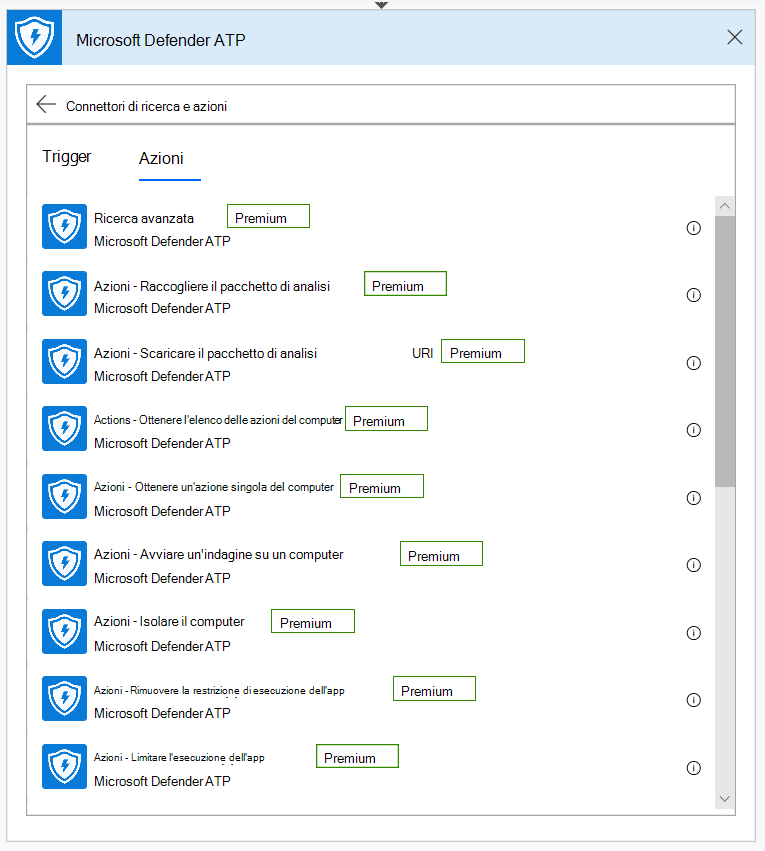
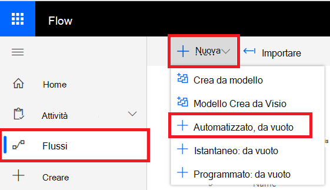

# Microsoft Power Automate (in precedenza Microsoft Flow) e Funzioni di AzureMicrosoft Power Automate (formerly Microsoft Flow), and Azure Functions

[!INCLUDE [Microsoft 365 Defender rebranding](../../includes/microsoft-defender.md)]

**Si applica a:****Applies to:**
- [Microsoft Defender per endpointMicrosoft Defender for Endpoint](https://go.microsoft.com/fwlink/p/?linkid=2154037)
- [Microsoft 365 DefenderMicrosoft 365 Defender](https://go.microsoft.com/fwlink/?linkid=2118804)

- Vuoi provare Microsoft Defender per Endpoint?Want to experience Microsoft Defender for Endpoint? [Iscriversi per una versione di valutazione gratuita.Sign up for a free trial.](https://www.microsoft.com/microsoft-365/windows/microsoft-defender-atp?ocid=docs-wdatp-exposedapis-abovefoldlink) 

L'automazione delle procedure di sicurezza è un requisito standard per ogni centro operativo di sicurezza moderno.Automating security procedures is a standard requirement for every modern Security Operations Center. La mancanza di cyber defender professionali obbliga SOC a lavorare nel modo più efficiente e l'automazione è un must.The lack of professional cyber defenders forces SOC to work in the most efficient way and automation is a must. Microsoft Power Automate supporta connettori diversi che sono stati creati esattamente per questo.Microsoft Power Automate supports different connectors that were built exactly for that. È possibile creare un'automazione di routine end-to-end entro pochi minuti.You can build an end-to-end procedure automation within a few minutes.

Microsoft Defender API ha un connettore Flow con molte funzionalità.Microsoft Defender API has an official Flow Connector with many capabilities.

> [!NOTE]
> Per ulteriori informazioni sui prerequisiti di licenza per i connettori premium, vedere [Licensing for premium connectors.](https://docs.microsoft.com/power-automate/triggers-introduction#licensing-for-premium-connectors)For more details about premium connectors licensing prerequisites, see [Licensing for premium connectors](https://docs.microsoft.com/power-automate/triggers-introduction#licensing-for-premium-connectors).

## Esempio di utilizzoUsage example

L'esempio seguente illustra come creare un Flow che viene attivato ogni volta che si verifica un nuovo avviso nel tenant.The following example demonstrates how to create a Flow that is triggered any time a new Alert occurs on your tenant.

1. Accedere a [Microsoft Power Automate](https://flow.microsoft.com).Log in to [Microsoft Power Automate](https://flow.microsoft.com).

2. Vai a **Flussi my**  >  **New**  >  **Automated-from blank**.Go to **My flows** > **New** > **Automated-from blank**.

    

3. Scegli un nome per il Flow, cerca "Trigger Microsoft Defender ATP" come trigger e quindi seleziona il nuovo trigger Avvisi.Choose a name for your Flow, search for "Microsoft Defender ATP Triggers" as the trigger, and then select the new Alerts trigger.

    

Ora si dispone di Flow che viene attivato ogni volta che si verifica un nuovo avviso.Now you have a Flow that is triggered every time a new Alert occurs.

Tutto quello che devi fare ora è scegliere i passaggi successivi.All you need to do now is choose your next steps.
Ad esempio, puoi isolare il dispositivo se la gravità dell'avviso è Alta e inviare un messaggio di posta elettronica al riguardo.For example, you can isolate the device if the Severity of the Alert is High and send an email about it.
Il trigger Avviso fornisce solo l'ID avviso e l'ID computer.The Alert trigger provides only the Alert ID and the Machine ID. È possibile utilizzare il connettore per espandere queste entità.You can use the connector to expand these entities.

### Ottenere l'entità Alert usando il connettoreGet the Alert entity using the connector

1. Scegliere **Microsoft Defender ATP** per il nuovo passaggio.Choose **Microsoft Defender ATP** for the new step.

2. Scegliere **Avvisi - Api per il singolo avviso.**Choose **Alerts - Get single alert API**.

3. Imposta **l'ID avviso** dell'ultimo passaggio come **Input**.Set the **Alert ID** from the last step as **Input**.

    

### Isolare il dispositivo se la gravità dell'avviso è AltaIsolate the device if the Alert's severity is High

1. Aggiungi **condizione** come nuovo passaggio.Add **Condition** as a new step.

2. Verificare se la gravità **dell'avviso è uguale a** Alta.Check if the Alert severity **is equal to** High.

   Se sì, aggiungi **l'azione Microsoft Defender ATP - Isolare il** computer con l'ID computer e un commento.If yes, add the **Microsoft Defender ATP - Isolate machine** action with the Machine ID and a comment.

    

3. Aggiungi un nuovo passaggio per l'invio tramite posta elettronica dell'avviso e dell'isolamento.Add a new step for emailing about the Alert and the Isolation. Esistono più connettori di posta elettronica molto facili da usare, ad esempio Outlook o Gmail.There are multiple email connectors that are very easy to use, such as Outlook or Gmail.

4. Salvare il flusso.Save your flow.

È inoltre possibile creare un **flusso pianificato** che esegue query di ricerca avanzata e molto altro ancora.You can also create a **scheduled** flow that runs Advanced Hunting queries and much more!

## Argomento correlatoRelated topic
- [API di Microsoft Defender per endpointMicrosoft Defender for Endpoint APIs](apis-intro.md)
