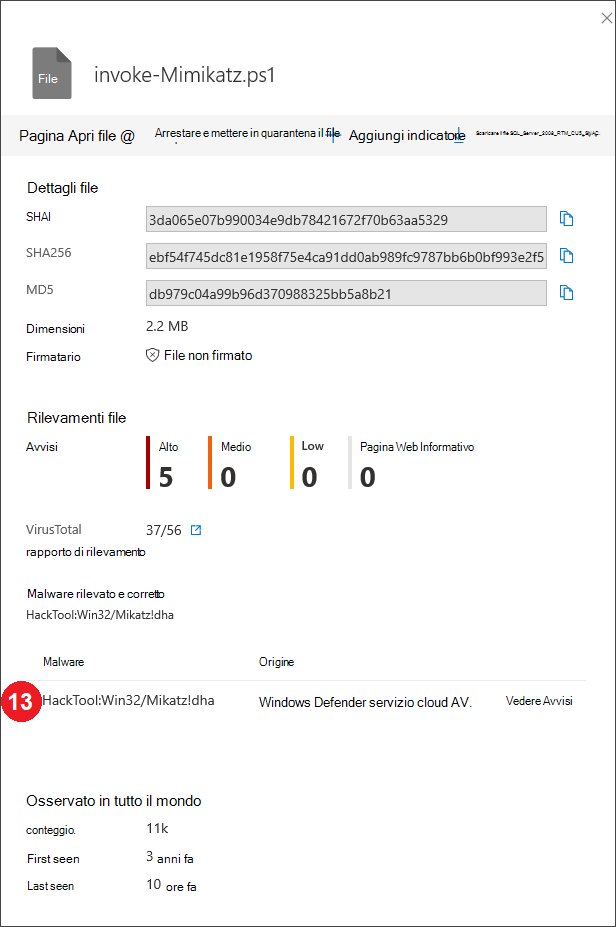
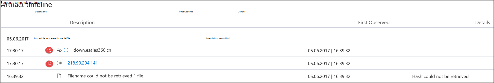
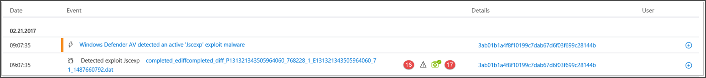
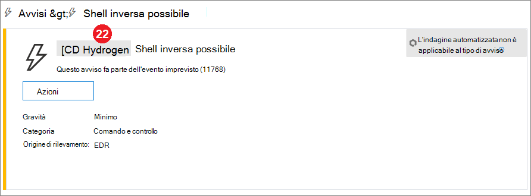

# Campi API di rilevamento di Microsoft Defender per endpoint

[!INCLUDE [Microsoft 365 Defender rebranding](../../includes/microsoft-defender.md)]

**Si applica a:**
- [Microsoft Defender per endpoint](https://go.microsoft.com/fwlink/p/?linkid=2154037)
- [Microsoft 365 Defender](https://go.microsoft.com/fwlink/?linkid=2118804)

>Vuoi provare Defender per Endpoint? [Iscriversi per una versione di valutazione gratuita.](https://www.microsoft.com/microsoft-365/windows/microsoft-defender-atp?ocid=docs-wdatp-apiportalmapping-abovefoldlink)

Comprendere quali campi dati vengono esposti come parte dell'API di rilevamento e come vengono mappati a Microsoft 365 Defender.

>[!Note]
>- [Defender for Endpoint Alert](alerts.md) è composto da uno o più rilevamenti.
>- **Il rilevamento di Microsoft Defender ATP** è composto dall'evento sospetto che si è verificato nel dispositivo e dai relativi **dettagli di** avviso.
>- L'API microsoft Defender for Endpoint Alert è l'API più recente per il consumo di avvisi e contiene un elenco dettagliato di prove correlate per ogni avviso. Per ulteriori informazioni, vedere [Metodi e proprietà degli](alerts.md) avvisi e Avvisi [elenco.](get-alerts.md)

## Campi API di rilevamento e mapping del portale
Nella tabella seguente sono elencati i campi disponibili esposti nel payload dell'API di rilevamento. Vengono mostrati esempi per i valori popolati e un riferimento sul modo in cui i dati vengono riflessi nel portale.

La colonna del campo ArcSight contiene il mapping predefinito tra i campi defender per endpoint e i campi predefiniti in ArcSight. È possibile scaricare il file di mapping dal portale quando si abilita la funzionalità di integrazione SIEM ed è possibile modificarlo in base alle esigenze dell'organizzazione. Per altre informazioni, vedi [Abilitare l'integrazione SIEM in Defender per Endpoint.](enable-siem-integration.md)

I numeri di campo corrispondono ai numeri nelle immagini seguenti.

> [!div class="mx-tableFixed"]
> 
> | Etichetta portale   | Nome campo SIEM           | Campo ArcSight      | Valore di esempio                                                                      | Descrizione                                                                                                                                                                    |
> |------------------|---------------------------|---------------------|------------------------------------------------------------------------------------|--------------------------------------------------------------------------------------------------------------------------------------------------------------------------------|
> | 1                | AlertTitle                | name                | Microsoft Defender AV ha rilevato malware ad alta gravità "Mikatz" | Valore disponibile per ogni rilevamento.                                                                                                                                               |
> | 2                 | Gravità                  | deviceSeverity      | Alto                                                                             | Valore disponibile per ogni rilevamento.                                                                                                                                               |
> | 3                 | Categoria                  | deviceEventCategory | Malware                                                               | Valore disponibile per ogni rilevamento.                                                                                                                                               |
> | 4                 | Origine di rilevamento                    | sourceServiceName   | Antivirus                                                                 | Antivirus Microsoft Defender o Defender for Endpoint. Valore disponibile per ogni rilevamento.                                                                                         |
> | 5                 | MachineName               | sourceHostName      | desktop-4a5ngd6                                                                           | Valore disponibile per ogni rilevamento.                                                                                                                                               |
> | 6                 | FileName                  | fileName            | Robocopy.exe                                                                       | Disponibile per i rilevamenti associati a un file o a un processo.                                                                                                                      |
> | 7                 | FilePath                  | filePath            | C:\Windows\System32\Robocopy.exe                                                   | Disponibile per i rilevamenti associati a un file o a un processo.                                                                                                                     |
> | 8                 | UserDomain                | sourceNtDomain      | CONTOSO                                                                            | Dominio del contesto utente che esegue l'attività, disponibile per Defender per i rilevamenti basati sul comportamento dell'endpoint.                                                           |
> | 9                 | UserName                  | sourceUserName      | liz.bean                                                                           | Contesto utente che esegue l'attività, disponibile per Defender per i rilevamenti basati sul comportamento dell'endpoint.                                                                           |
> | 10                | Sha1                      | fileHash            | 3da065e07b990034e9db7842167f70b63aa5329                                           | Disponibile per i rilevamenti associati a un file o a un processo.                                                                                                                      |
> | 11                | Sha256                    | deviceCustomString6 | ebf54f745dc81e1958f75e4ca91dd0ab989fc9787bb6b0bf993e2f5                   | Disponibile per i rilevamenti di Microsoft Defender AV.                                                                                                                                    |
> | 12                | Md5                       | deviceCustomString5 | db979c04a99b96d370988325bb5a8b21                                                   | Disponibile per i rilevamenti di Microsoft Defender AV.                                                                                                                                    |
> | 13                | ThreatName                | deviceCustomString1  | HackTool:Win32/Mikatz!dha                                                         | Disponibile per i rilevamenti di Microsoft Defender AV.                                                                                                                                    |
> | 14                | IpAddress                 | sourceAddress       | 218.90.204.141                                                                     | Disponibile per i rilevamenti associati agli eventi di rete. Ad esempio, "Comunicazione con una destinazione di rete dannosa".                                                        |
> | 15               | URL                       | requestUrl          | down.esales360.cn                                                                  | Disponibile per i rilevamenti associati agli eventi di rete. Ad esempio, "Comunicazione con una destinazione di rete dannosa".                                                         |
> | 16                | RemediationIsSuccess      | deviceCustomNumber2 | TRUE                                                                               | Disponibile per i rilevamenti di Microsoft Defender AV. Il valore di ArcSight è 1 quando TRUE e 0 quando FALSE.                                                                                    |
> | 17                | WasExecutingWhileDetected | deviceCustomNumber1 | FALSE                                                                              | Disponibile per i rilevamenti di Microsoft Defender AV. Il valore di ArcSight è 1 quando TRUE e 0 quando FALSE.                                                                                    |
> | 18                | AlertId                   | externalId          | 636210704265059241_673569822                                                       | Valore disponibile per ogni rilevamento.                                                                                                                                               |
> | 19               | LinkToWDATP               | flexString1         | `https://securitycenter.windows.com/alert/636210704265059241_673569822`            | Valore disponibile per ogni rilevamento.                                                                                                                                               |
> | 20               | AlertTime                 | deviceReceiptTime   | 2017-05-07T01:56:59.3191352Z                                                       | Ora in cui si è verificato l'evento. Valore disponibile per ogni rilevamento.                                                                                       |
> |  21               | MachineDomain             | sourceDnsDomain     | contoso.com                                                                        | Nome di dominio non rilevante per i dispositivi aggiunti ad AAD. Valore disponibile per ogni rilevamento.                                                                                           |
> | 22               | Attore                     | deviceCustomString4 | BORON                                                                                   | Disponibile per gli avvisi relativi a un gruppo di attore noto.                                                                                                                         |
> | 21+5             | ComputerDnsName           | Nessun mapping          | liz-bean.contoso.com                                                               | Nome di dominio completo del dispositivo. Valore disponibile per ogni rilevamento.                                                                                                    |
> |                  | LogOnUsers                | sourceUserId        | contoso\liz-bean;   contoso\jay-hardee                                             | Il dominio e l'utente dell'utente/i di accesso interattivo al momento dell'evento. Nota: per i dispositivi Windows 10 versione 1607, le informazioni sul dominio non saranno disponibili. |
> |                  | InternalIPv4List          | Nessun mapping          | 192.168.1.7, 10.1.14.1                                                             | Elenco di IP interni IPV4 per le interfacce di rete attive.                                                                                                                                                                               |
> |                  | InternalIPv6List          | Nessun mapping          | fd30:0000:0000:0001:ff4e:003e:0009:000e, FE80:CD00:0000:0CDE:1257:0000:211E:729C | Elenco di IP interni IPV6 per le interfacce di rete attive.                                                                                                                                                                               |
| | LinkToMTP | Nessun mapping | `https://security.microsoft.com/alert/da637370718981685665_16349121` | Valore disponibile per ogni rilevamento.
| | IncidentLinkToMTP | Nessun mapping | `"https://security.microsoft.com/incidents/byalert?alertId=da637370718981685665_16349121&source=SIEM` | Valore disponibile per ogni rilevamento.
| | IncidentLinkToWDATP | Nessun mapping | `https://securitycenter.windows.com/incidents/byalert?alertId=da637370718981685665_16349121&source=SIEM` | Valore disponibile per ogni rilevamento.
> | Campo interno | LastProcessedTimeUtc      | Nessun mapping          | 2017-05-07T01:56:58.9936648Z                                                       | Ora in cui l'evento è arrivato al back-end. Questo campo può essere utilizzato quando si imposta il parametro request per l'intervallo di tempo in cui vengono recuperati i rilevamenti.                         |
> |                  | Non fa parte dello schema    | deviceVendor        |                                                                                    | Valore statico nel mapping ArcSight - 'Microsoft'.                                                                                                                          |
> |                  | Non fa parte dello schema    | deviceProduct       |                                                                                    | Valore statico nel mapping ArcSight - "Microsoft Defender ATP".                                                                                                               |
> |                  | Non fa parte dello schema    | deviceVersion       |                                                                                    | Valore statico nel mapping ArcSight - '2.0', usato per identificare le versioni di mapping.                                                                                         

## Argomenti correlati
- [Abilitare l'integrazione SIEM in Microsoft Defender for Endpoint](enable-siem-integration.md)
- [Configurare ArcSight per eseguire il pull di Microsoft Defender per i rilevamenti degli endpoint](configure-arcsight.md)
- [Eseguire il pull dei rilevamenti di Microsoft Defender per endpoint con l'API REST](pull-alerts-using-rest-api.md)
- [Risolvere i problemi di integrazione degli strumenti SIEM](troubleshoot-siem.md)
