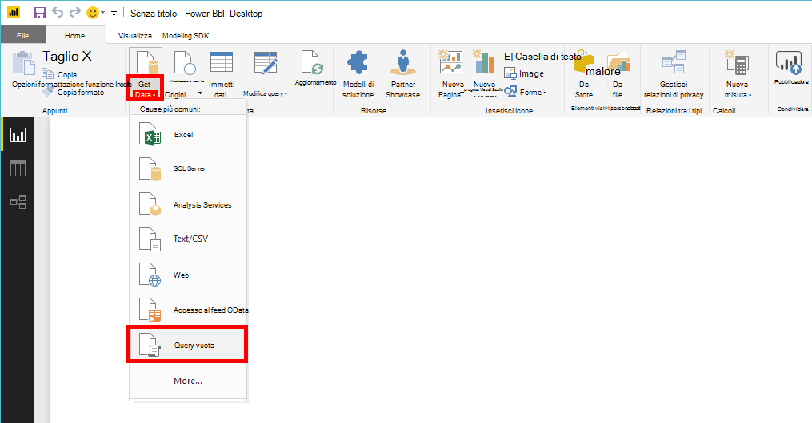
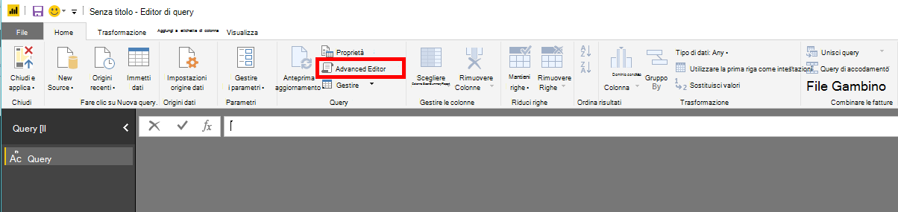
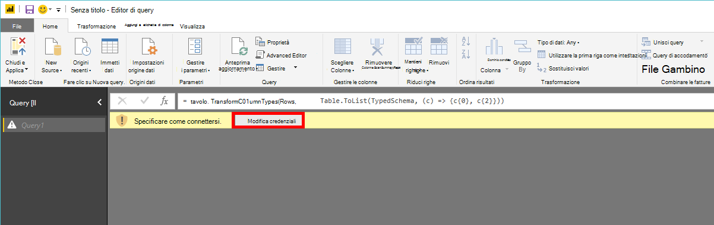
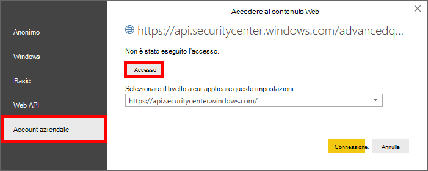
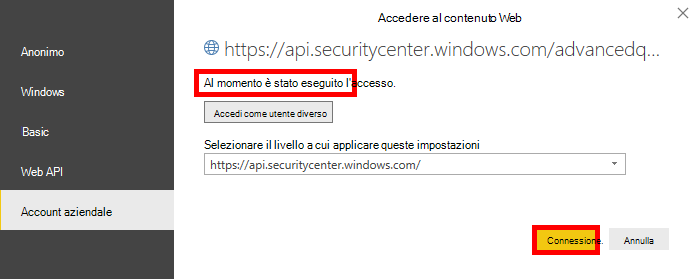

# <a name="create-custom-reports-using-power-bi"></a><span data-ttu-id="5ac4b-104">Creare report personalizzati con Power BI</span><span class="sxs-lookup"><span data-stu-id="5ac4b-104">Create custom reports using Power BI</span></span>

[!INCLUDE [Microsoft 365 Defender rebranding](../../includes/microsoft-defender.md)]

<span data-ttu-id="5ac4b-105">**Si applica a:**</span><span class="sxs-lookup"><span data-stu-id="5ac4b-105">**Applies to:**</span></span>
- [<span data-ttu-id="5ac4b-106">Microsoft Defender ATP</span><span class="sxs-lookup"><span data-stu-id="5ac4b-106">Microsoft Defender for Endpoint</span></span>](https://go.microsoft.com/fwlink/p/?linkid=2154037)
- [<span data-ttu-id="5ac4b-107">Microsoft 365 Defender</span><span class="sxs-lookup"><span data-stu-id="5ac4b-107">Microsoft 365 Defender</span></span>](https://go.microsoft.com/fwlink/?linkid=2118804)


- <span data-ttu-id="5ac4b-108">Vuoi provare Microsoft Defender per Endpoint?</span><span class="sxs-lookup"><span data-stu-id="5ac4b-108">Want to experience Microsoft Defender for Endpoint?</span></span> [<span data-ttu-id="5ac4b-109">Iscriversi per una versione di valutazione gratuita.</span><span class="sxs-lookup"><span data-stu-id="5ac4b-109">Sign up for a free trial.</span></span>](https://www.microsoft.com/microsoft-365/windows/microsoft-defender-atp?ocid=docs-wdatp-exposedapis-abovefoldlink) 

[!include[Microsoft Defender for Endpoint API URIs for US Government](../../includes/microsoft-defender-api-usgov.md)]

[!include[Improve request performance](../../includes/improve-request-performance.md)]

<span data-ttu-id="5ac4b-110">In questa sezione imparerai a creare un report di Power BI in Defender per le API endpoint.</span><span class="sxs-lookup"><span data-stu-id="5ac4b-110">In this section you will learn create a Power BI report on top of Defender for Endpoint APIs.</span></span>

<span data-ttu-id="5ac4b-111">Nel primo esempio viene illustrato come connettere Power BI all'API Advanced Hunting e nel secondo esempio viene illustrata una connessione alle API OData, ad esempio azioni del computer o avvisi.</span><span class="sxs-lookup"><span data-stu-id="5ac4b-111">The first example demonstrates how to connect Power BI to Advanced Hunting API and the second example demonstrates a connection to our OData APIs, such as Machine Actions or Alerts.</span></span>

## <a name="connect-power-bi-to-advanced-hunting-api"></a><span data-ttu-id="5ac4b-112">Connettere Power BI all'API advanced hunting</span><span class="sxs-lookup"><span data-stu-id="5ac4b-112">Connect Power BI to Advanced Hunting API</span></span>

- <span data-ttu-id="5ac4b-113">Aprire Microsoft Power BI</span><span class="sxs-lookup"><span data-stu-id="5ac4b-113">Open Microsoft Power BI</span></span>

- <span data-ttu-id="5ac4b-114">Fare **clic su Ottieni query** vuota  >  **dati**</span><span class="sxs-lookup"><span data-stu-id="5ac4b-114">Click **Get Data** > **Blank Query**</span></span>

    

- <span data-ttu-id="5ac4b-116">Fare clic **su Editor avanzato**</span><span class="sxs-lookup"><span data-stu-id="5ac4b-116">Click **Advanced Editor**</span></span>

    

- <span data-ttu-id="5ac4b-118">Copiare quanto segue e incollarlo nell'editor:</span><span class="sxs-lookup"><span data-stu-id="5ac4b-118">Copy the below and paste it in the editor:</span></span>

```
    let 
        AdvancedHuntingQuery = "DeviceEvents | where ActionType contains 'Anti' | limit 20",

        HuntingUrl = "https://api.securitycenter.microsoft.com/api/advancedqueries",

        Response = Json.Document(Web.Contents(HuntingUrl, [Query=[key=AdvancedHuntingQuery]])),

        TypeMap = #table(
            { "Type", "PowerBiType" },
            {
                { "Double",   Double.Type },
                { "Int64",    Int64.Type },
                { "Int32",    Int32.Type },
                { "Int16",    Int16.Type },
                { "UInt64",   Number.Type },
                { "UInt32",   Number.Type },
                { "UInt16",   Number.Type },
                { "Byte",     Byte.Type },
                { "Single",   Single.Type },
                { "Decimal",  Decimal.Type },
                { "TimeSpan", Duration.Type },
                { "DateTime", DateTimeZone.Type },
                { "String",   Text.Type },
                { "Boolean",  Logical.Type },
                { "SByte",    Logical.Type },
                { "Guid",     Text.Type }
            }),

        Schema = Table.FromRecords(Response[Schema]),
        TypedSchema = Table.Join(Table.SelectColumns(Schema, {"Name", "Type"}), {"Type"}, TypeMap , {"Type"}),
        Results = Response[Results],
        Rows = Table.FromRecords(Results, Schema[Name]),
        Table = Table.TransformColumnTypes(Rows, Table.ToList(TypedSchema, (c) => {c{0}, c{2}}))

    in Table

```

- <span data-ttu-id="5ac4b-119">Fare clic **su Fine**</span><span class="sxs-lookup"><span data-stu-id="5ac4b-119">Click **Done**</span></span>

- <span data-ttu-id="5ac4b-120">Fare **clic su Modifica credenziali**</span><span class="sxs-lookup"><span data-stu-id="5ac4b-120">Click **Edit Credentials**</span></span>

    

- <span data-ttu-id="5ac4b-122">Seleziona **Account organizzazione**  >  **Accedi**</span><span class="sxs-lookup"><span data-stu-id="5ac4b-122">Select **Organizational account** > **Sign in**</span></span>

    

- <span data-ttu-id="5ac4b-124">Immettere le credenziali e attendere l'accesso</span><span class="sxs-lookup"><span data-stu-id="5ac4b-124">Enter your credentials and wait to be signed in</span></span>

- <span data-ttu-id="5ac4b-125">Fare clic **su Connetti**</span><span class="sxs-lookup"><span data-stu-id="5ac4b-125">Click **Connect**</span></span>

    

- <span data-ttu-id="5ac4b-127">Ora i risultati della query verranno visualizzati come tabella ed è possibile iniziare a creare visualizzazioni sopra di essa.</span><span class="sxs-lookup"><span data-stu-id="5ac4b-127">Now the results of your query will appear as table and you can start build visualizations on top of it!</span></span>

- <span data-ttu-id="5ac4b-128">È possibile duplicare la tabella, rinominarla e modificare la query ricerca avanzata all'interno per ottenere i dati che si desidera.</span><span class="sxs-lookup"><span data-stu-id="5ac4b-128">You can duplicate this table, rename it and edit the Advanced Hunting query inside to get any data you would like.</span></span>

## <a name="connect-power-bi-to-odata-apis"></a><span data-ttu-id="5ac4b-129">Connettere Power BI alle API OData</span><span class="sxs-lookup"><span data-stu-id="5ac4b-129">Connect Power BI to OData APIs</span></span>

- <span data-ttu-id="5ac4b-130">L'unica differenza rispetto all'esempio precedente è la query all'interno dell'editor.</span><span class="sxs-lookup"><span data-stu-id="5ac4b-130">The only difference from the above example is the query inside the editor.</span></span> 

- <span data-ttu-id="5ac4b-131">Copia quanto segue e incollalo nell'editor per estrarre tutte **le azioni del computer** dall'organizzazione:</span><span class="sxs-lookup"><span data-stu-id="5ac4b-131">Copy the below and paste it in the editor to pull all **Machine Actions** from your organization:</span></span>

```
    let

        Query = "MachineActions",

        Source = OData.Feed("https://api.securitycenter.microsoft.com/api/" & Query, null, [Implementation="2.0", MoreColumns=true])
    in
        Source

```

- <span data-ttu-id="5ac4b-132">È possibile eseguire la stessa operazione per **Avvisi** e **computer.**</span><span class="sxs-lookup"><span data-stu-id="5ac4b-132">You can do the same for **Alerts** and **Machines**.</span></span>

- <span data-ttu-id="5ac4b-133">È inoltre possibile utilizzare query OData per filtri di query, vedere [Utilizzo di query OData](exposed-apis-odata-samples.md)</span><span class="sxs-lookup"><span data-stu-id="5ac4b-133">You also can use OData queries for queries filters, see [Using OData Queries](exposed-apis-odata-samples.md)</span></span>


## <a name="power-bi-dashboard-samples-in-github"></a><span data-ttu-id="5ac4b-134">Esempi di dashboard di Power BI in GitHub</span><span class="sxs-lookup"><span data-stu-id="5ac4b-134">Power BI dashboard samples in GitHub</span></span>
<span data-ttu-id="5ac4b-135">Per ulteriori informazioni, vedere Modelli [di report di Power BI.](https://github.com/microsoft/MicrosoftDefenderATP-PowerBI)</span><span class="sxs-lookup"><span data-stu-id="5ac4b-135">For more information see the [Power BI report templates](https://github.com/microsoft/MicrosoftDefenderATP-PowerBI).</span></span>

## <a name="sample-reports"></a><span data-ttu-id="5ac4b-136">Report di esempio</span><span class="sxs-lookup"><span data-stu-id="5ac4b-136">Sample reports</span></span>
<span data-ttu-id="5ac4b-137">Visualizzare gli esempi di report di Power BI di Microsoft Defender ATP.</span><span class="sxs-lookup"><span data-stu-id="5ac4b-137">View the Microsoft Defender ATP Power BI report samples.</span></span> <span data-ttu-id="5ac4b-138">Per ulteriori informazioni, vedere [Sfogliare gli esempi di codice.](https://docs.microsoft.com/samples/browse/?products=mdatp)</span><span class="sxs-lookup"><span data-stu-id="5ac4b-138">For more information, see [Browse code samples](https://docs.microsoft.com/samples/browse/?products=mdatp).</span></span>


## <a name="related-topic"></a><span data-ttu-id="5ac4b-139">Argomento correlato</span><span class="sxs-lookup"><span data-stu-id="5ac4b-139">Related topic</span></span>
- [<span data-ttu-id="5ac4b-140">API defender per endpoint</span><span class="sxs-lookup"><span data-stu-id="5ac4b-140">Defender for Endpoint APIs</span></span>](apis-intro.md)
- [<span data-ttu-id="5ac4b-141">Rilevazione avanzata API</span><span class="sxs-lookup"><span data-stu-id="5ac4b-141">Advanced Hunting API</span></span>](run-advanced-query-api.md)
- [<span data-ttu-id="5ac4b-142">Utilizzo di query OData</span><span class="sxs-lookup"><span data-stu-id="5ac4b-142">Using OData Queries</span></span>](exposed-apis-odata-samples.md)
