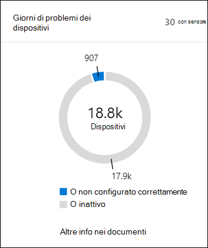
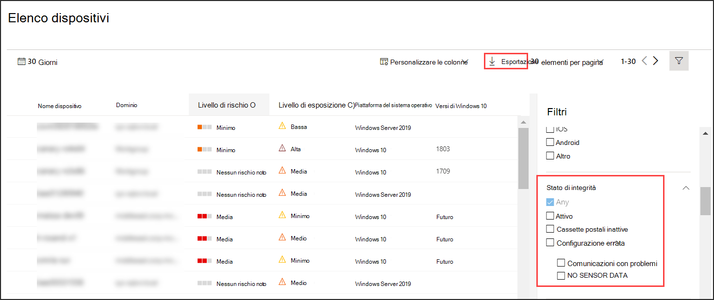

# Controllare lo stato di integrità del sensore in Microsoft Defender per EndpointCheck sensor health state in Microsoft Defender for Endpoint

[!INCLUDE [Microsoft 365 Defender rebranding](../../includes/microsoft-defender.md)]

**Si applica a:****Applies to:**
- [Microsoft Defender per endpointMicrosoft Defender for Endpoint](https://go.microsoft.com/fwlink/p/?linkid=2154037)
- [Microsoft 365 DefenderMicrosoft 365 Defender](https://go.microsoft.com/fwlink/?linkid=2118804)

>Vuoi provare Defender per Endpoint?Want to experience Defender for Endpoint? [Iscriversi per una versione di valutazione gratuita.Sign up for a free trial.](https://www.microsoft.com/microsoft-365/windows/microsoft-defender-atp?ocid=docs-wdatp-checksensor-abovefoldlink)

Il **riquadro Dispositivi con problemi del** sensore è disponibile nel dashboard Operazioni di sicurezza.The **Devices with sensor issues** tile is found on the Security Operations dashboard. Questo riquadro fornisce informazioni sulla capacità del singolo dispositivo di fornire dati del sensore e comunicare con il servizio Defender for Endpoint.This tile provides information on the individual device’s ability to provide sensor data and communicate with the Defender for Endpoint service. Segnala il numero di dispositivi che richiedono attenzione e ti aiuta a identificare i dispositivi problematici e a intervenire per correggere i problemi noti.It reports how many devices require attention and helps you identify problematic devices and take action to correct known issues.

Nel riquadro sono presenti due indicatori di stato che forniscono informazioni sul numero di dispositivi che non segnalano correttamente al servizio:There are two status indicators on the tile that provide information on the number of devices that are not reporting properly to the service:
- **Configurazione errata: questi** dispositivi potrebbero segnalare parzialmente i dati del sensore al servizio Defender for Endpoint e potrebbero avere errori di configurazione che devono essere corretti.**Misconfigured** - These devices might partially be reporting sensor data to the Defender for Endpoint service and might have configuration errors that need to be corrected.
- **Inattivo:** dispositivi che hanno interrotto la segnalazione al servizio Defender for Endpoint per più di sette giorni nell'ultimo mese.**Inactive** - Devices that have stopped reporting to the Defender for Endpoint service for more than seven days in the past month.

Se fai clic su uno dei gruppi, viene visualizzato **l'elenco Dispositivi,** filtrato in base alla tua scelta.Clicking any of the groups directs you to **Devices list**, filtered according to your choice.

**Nell'elenco Dispositivi** è possibile filtrare l'elenco degli stati di integrità in base allo stato seguente:On **Devices list**, you can filter the health state list by the following status:
- **Active** - Dispositivi che segnalano attivamente al servizio Defender for Endpoint.**Active** - Devices that are actively reporting to the Defender for Endpoint service.
- **Configurazione errata: questi** dispositivi potrebbero segnalare parzialmente i dati del sensore al servizio Defender for Endpoint, ma potrebbero avere errori di configurazione che devono essere corretti.**Misconfigured** - These devices might partially be reporting sensor data to the Defender for Endpoint service but have configuration errors that need to be corrected. I dispositivi non configurati correttamente possono avere uno o una combinazione dei seguenti problemi:Misconfigured devices can have either one or a combination of the following issues:
  - **Nessun dato del sensore:** i dispositivi hanno smesso di inviare i dati del sensore.**No sensor data** - Devices has stopped sending sensor data. Gli avvisi limitati possono essere attivati dal dispositivo.Limited alerts can be triggered from the device.
  - **Comunicazioni con problemi** - La capacità di comunicare con il dispositivo è compromessa.**Impaired communications** - Ability to communicate with device is impaired. L'invio di file per l'analisi approfondita, il blocco dei file, l'isolamento del dispositivo dalla rete e altre azioni che richiedono la comunicazione con il dispositivo potrebbero non funzionare.Sending files for deep analysis, blocking files, isolating device from network and other actions that require communication with the device may not work.
- **Inattivo:** dispositivi che hanno interrotto la segnalazione al servizio Defender for Endpoint.**Inactive** - Devices that have stopped reporting to the Defender for Endpoint service.

Puoi anche scaricare l'intero elenco in formato CSV usando la **funzionalità Esporta.**You can also download the entire list in CSV format using the **Export** feature. Per altre informazioni sui filtri, vedi [Visualizzare e organizzare l'elenco Dispositivi.](machines-view-overview.md)For more information on filters, see [View and organize the Devices list](machines-view-overview.md).

>[!NOTE]
>Esportare l'elenco in formato CSV per visualizzare i dati non filtrati.Export the list in CSV format to display the unfiltered data. Il file CSV includerà tutti i dispositivi dell'organizzazione, indipendentemente dai filtri applicati nella visualizzazione stessa e può richiedere molto tempo per il download, a seconda delle dimensioni dell'organizzazione.The CSV file will include all devices in the organization, regardless of any filtering applied in the view itself and can take a significant amount of time to download, depending on how large your organization is.

Puoi visualizzare i dettagli del dispositivo quando fai clic su un dispositivo non configurato correttamente o inattivo.You can view the device details when you click on a misconfigured or inactive device.

## Argomento correlatoRelated topic
- [Risolvere i sensori non integri in Defender for EndpointFix unhealthy sensors in Defender for Endpoint](fix-unhealthy-sensors.md)
