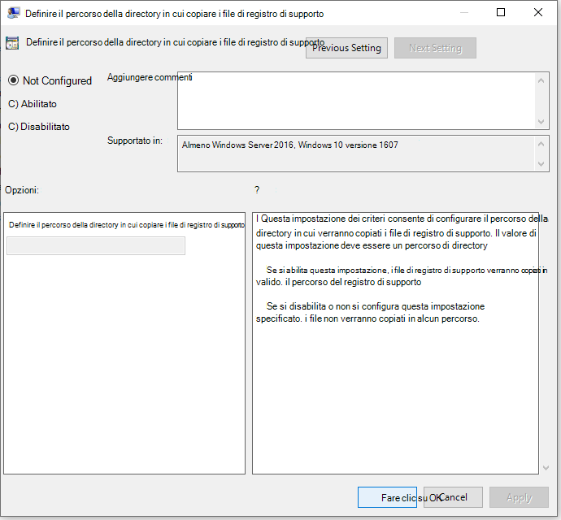
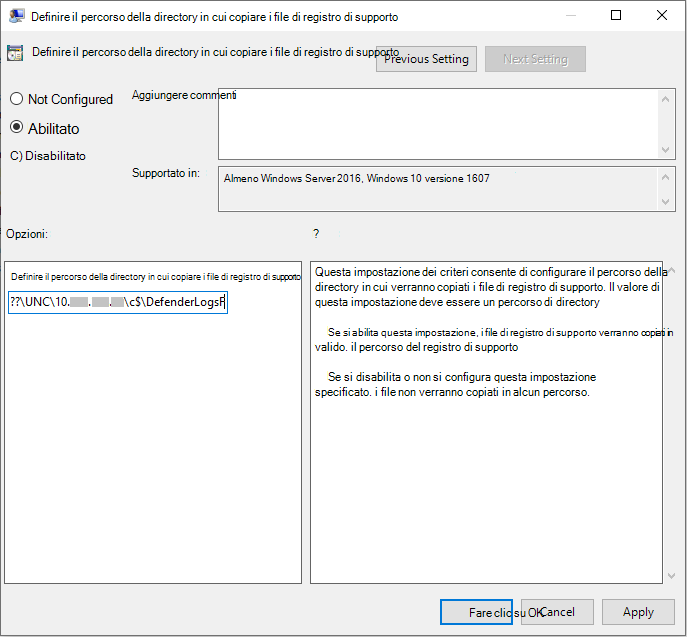

# <a name="collect-microsoft-defender-av-diagnostic-data"></a>Raccogliere i dati di diagnostica di Microsoft Defender AV

[!INCLUDE [Microsoft 365 Defender rebranding](../../includes/microsoft-defender.md)]


**Si applica a:**

- [Microsoft Defender per endpoint](/microsoft-365/security/defender-endpoint/)

Questo articolo descrive come raccogliere dati di diagnostica che possono essere usati dai team di supporto e progettazione Microsoft per risolvere i problemi che potrebbero verificarsi quando si usa Microsoft Defender AV.

> [!NOTE]
> Come parte del processo di indagine o di risposta, puoi raccogliere un pacchetto di indagine da un dispositivo. Ecco come: Raccogliere [il pacchetto di indagine dai dispositivi](/windows/security/threat-protection/microsoft-defender-atp/respond-machine-alerts#collect-investigation-package-from-devices).

In almeno due dispositivi in cui si verifica lo stesso problema, ottenere il file di diagnostica CAB seguendo la procedura seguente:

1. Aprire una versione a livello di amministratore del prompt dei comandi come segue:

    a. Apri il menu **Start.**

    b. Digitare **cmd**. Fare clic con il pulsante **destro del mouse su Prompt** dei comandi e scegliere Esegui come **amministratore.**

    c. Immettere le credenziali di amministratore o approvare il prompt.

2. Passare alla directory di Microsoft Defender. Per impostazione predefinita, è `C:\Program Files\Windows Defender` .

> [!NOTE]
> Se si esegue una versione [aggiornata di Microsoft Defender Platform,](https://support.microsoft.com/help/4052623/update-for-microsoft-defender-antimalware-platform)eseguire dal percorso `MpCmdRun` seguente: `C:\ProgramData\Microsoft\Windows Defender\Platform\<version>` .

3. Digitare il comando seguente e quindi premere **INVIO**  

    ```Dos
    mpcmdrun.exe -GetFiles
    ```
  
4. Verrà generato un file CAB contenente diversi log di diagnostica. Il percorso del file verrà specificato nell'output nel prompt dei comandi. Per impostazione predefinita, il percorso è `C:\ProgramData\Microsoft\Microsoft Defender\Support\MpSupportFiles.cab` .

> [!NOTE]
> Per reindirizzare il file CAB a un percorso diverso o a una condivisione UNC, utilizzare il comando seguente: `mpcmdrun.exe -GetFiles -SupportLogLocation <path>`  <br/>Per ulteriori informazioni, vedere [Reindirizzare i dati di diagnostica a una condivisione UNC.](#redirect-diagnostic-data-to-a-unc-share)

5. Copiare questi file CAB in un percorso accessibile dal supporto Tecnico Microsoft. Un esempio potrebbe essere una cartella di OneDrive protetta da password che puoi condividere con microsoft.

> [!NOTE]
>In caso di problemi con la conformità degli aggiornamenti, inviare un messaggio di posta elettronica utilizzando il modello di posta elettronica Supporto conformità aggiornamenti <a href="mailto:ucsupport@microsoft.com?subject=WDAV assessment issue&body=I%20am%20encountering%20the%20following%20issue%20when%20using%20Windows%20Defender%20AV%20in%20Update%20Compliance%3a%20%0d%0aI%20have%20provided%20at%20least%202%20support%20.cab%20files%20at%20the%20following%20location%3a%20%3Caccessible%20share%2c%20including%20access%20details%20such%20as%20password%3E%0d%0aMy%20OMS%20workspace%20ID%20is%3a%20%0d%0aPlease%20contact%20me%20at%3a">e</a>compilare il modello con le informazioni seguenti:
>```
> I am encountering the following issue when using Microsoft Defender Antivirus in Update Compliance:
> I have provided at least 2 support .cab files at the following location:  
> <accessible share, including access details such as password>
>
>    My OMS workspace ID is:
>
>    Please contact me at:

## <a name="redirect-diagnostic-data-to-a-unc-share"></a>Reindirizzare i dati di diagnostica a una condivisione UNC
Per raccogliere dati di diagnostica in un archivio centrale, è possibile specificare il parametro SupportLogLocation.

```Dos
mpcmdrun.exe -GetFiles -SupportLogLocation <path>
```

Copia i dati di diagnostica nel percorso specificato. Se il percorso non viene specificato, i dati di diagnostica verranno copiati nel percorso specificato nella configurazione del percorso del registro di supporto.

Quando si utilizza il parametro SupportLogLocation, nel percorso di destinazione verrà creata una struttura di cartelle simile alla seguente:

```Dos
<path>\<MMDD>\MpSupport-<hostname>-<HHMM>.cab
```

| Campo  | Descrizione   |
|:----|:----|
| path | Percorso specificato nella riga di comando o recuperato dalla configurazione
| MMDD | Mese e giorno in cui sono stati raccolti i dati di diagnostica (ad esempio, 0530)
| hostname | Nome host del dispositivo in cui sono stati raccolti i dati di diagnostica
| HHMM | Ore e minuti in cui sono stati raccolti i dati di diagnostica (ad esempio, 1422)

> [!NOTE]
> Quando si usa una condivisione file, assicurarsi che l'account usato per raccogliere il pacchetto di diagnostica abbia accesso in scrittura alla condivisione.  

## <a name="specify-location-where-diagnostic-data-is-created"></a>Specificare la posizione in cui vengono creati i dati di diagnostica

È inoltre possibile specificare la posizione in cui verrà creato il file CAB di diagnostica utilizzando un oggetto Criteri di gruppo. 

1. Aprire l'Editor Criteri di gruppo locali e trovare l'oggetto Criteri di gruppo SupportLogLocation all'indirizzo: `HKEY_LOCAL_MACHINE\SOFTWARE\Policies\Microsoft\Windows Defender\SupportLogLocation`
   
1. Selezionare **Definisci il percorso della directory per copiare i file di registro di supporto.**

      
        
       
3. All'interno dell'editor dei criteri, selezionare **Abilitato.**
       
4. Specificare il percorso della directory in cui copiare i file di registro di supporto nel **campo** Opzioni.
      
5. Selezionare **OK** o **Applica**.

## <a name="see-also"></a>Vedere anche

- [Risolvere i problemi relativi ai report di Microsoft Defender Antivirus](troubleshoot-reporting.md)