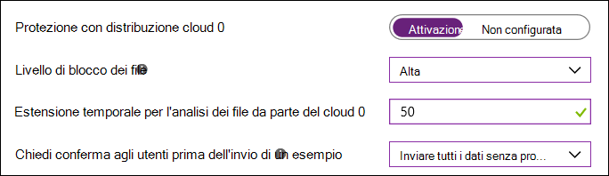

# Abilitare il blocco al primo rilevamento

**Si applica a:**

- [Microsoft Defender per endpoint](/microsoft-365/security/defender-endpoint/)

Questo articolo descrive una funzionalità antivirus/antimalware nota come blocco al primo rilevamento e descrive come abilitarla per l'organizzazione. 

> [!TIP]
> Questo articolo è destinato agli amministratori aziendali e ai professionisti IT che gestiscono le impostazioni di sicurezza per le organizzazioni. Se non si è un amministratore aziendale o un professionista IT, ma si hanno domande sul blocco al primo rilevamento, vedere la sezione [Non si è un amministratore aziendale o un professionista IT?](#not-an-enterprise-admin-or-it-pro).

## Cos'è il blocco al primo rilevamento?

Il blocco al primo rilevamento è una funzionalità di protezione dalle minacce di nuova generazione, che rileva il nuovo malware e lo blocca entro pochi secondi. Il blocco al primo rilevamento è abilitato quando sono abilitate determinate impostazioni di sicurezza. Queste impostazioni includono:

- Protezione fornita dal cloud; 
- Un timeout di invio del campione specificato (ad esempio 50 secondi); e 
- Un livello di livello di blocco dei file alto. 

Nella maggior parte delle organizzazioni aziendali, le impostazioni necessarie per abilitare il blocco al primo rilevamento sono configurate con le distribuzioni di Antivirus Microsoft Defender. 

## Come funziona

Quando Antivirus Microsoft Defender incontra un file sospetto, ma non rilevato, interroga il back-end per la protezione cloud. Il back-end cloud applica l'euristica, l'apprendimento automatico e l'analisi automatica del file per determinare se i file sono dannosi o se non si tratta di una minaccia.

Antivirus Microsoft Defender usa più tecnologie di rilevamento e prevenzione per offrire una protezione accurata, in tempo reale e intelligente. 

  

> [!TIP]
> Per altre informazioni, vedere [ (Blog) Informazioni sulle tecnologie avanzate al centro della protezione di Microsoft Defender per endpoint di nuova generazione](https://www.microsoft.com/security/blog/2019/06/24/inside-out-get-to-know-the-advanced-technologies-at-the-core-of-microsoft-defender-atp-next-generation-protection/).

## Alcune informazioni da conoscere sul blocco al primo rilevamento

- In Windows 10 versione 1803 e successive, il blocco al primo rilevamento può ora bloccare i file eseguibili non di tipo PE, ad esempio JS, VBS o macro, nonché i file eseguibili.

- Il blocco al primo rilevamento usa solo il back-end per la protezione cloud per i file eseguibili e i file eseguibili non di tipo PE scaricati da Internet o che provengono dall'area Internet. Tramite il back-end cloud viene controllato un valore hash del file .exe, per determinare se si tratta di un file non rilevato in precedenza.

- Se il back-end cloud non è in grado di eseguire questa operazione, Antivirus Microsoft Defender blocca il file e carica una copia nel cloud. Il cloud effettua ulteriori analisi per raggiungere una decisione prima di consentire l'esecuzione o bloccare il file in tutti i futuri incontri, a seconda che sia ritenuto dannoso o sicuro.

- In molti casi questo processo può ridurre il tempo di risposta per il nuovo malware da ore a secondi.

- È possibile [specificare per quanto tempo deve essere impedita l'esecuzione del file](configure-cloud-block-timeout-period-microsoft-defender-antivirus.md) mentre il servizio di protezione basato sul cloud lo analizza. Inoltre, si può [personalizzare il messaggio visualizzato sui desktop degli utenti](/windows/security/threat-protection//windows-defender-security-center/wdsc-customize-contact-information.md) quando viene bloccato un file. È possibile modificare il nome della società, le informazioni di contatto e l'URL del messaggio.

## Attivare il blocco al primo rilevamento con Microsoft Intune

> [!TIP]
> Microsoft Intune ora fa parte di Microsoft Endpoint Manager.

1. Nell'interfaccia di amministrazione di Microsoft Endpoint Manager ([https://endpoint.microsoft.com](https://endpoint.microsoft.com)) passare a **Dispositivi** > **Profili di configurazione**.

2. Selezionare o creare un profilo usando il tipo di profilo **Limitazioni del dispositivo**.

3. Nelle **Impostazioni di configurazione** del profilo Limitazioni del dispositivo impostare o confermare le impostazioni seguenti in **Antivirus Microsoft Defender**:

   - **Protezione fornita dal cloud**: abilitata
   - **Livello di blocco file**: alto
   - **Estensioni di tempo per l'analisi di file da parte del cloud**: 50
   - **Richiedi conferma all'utente prima dell'invio di campioni**: Invia tutti i dati senza chiedere conferma

   

4. Salvare le impostazioni.

> [!TIP]
> - Impostando il livello di blocco dei file su **Alto**, si applica un livello di rilevamento elevato. Nel caso improbabile che il blocco dei file causi erroneamente il rilevamento di file legittimi, il team delle operazioni di sicurezza può [ripristinare i file in quarantena](./restore-quarantined-files-microsoft-defender-antivirus.md).
> - Per altre informazioni sulla configurazione delle limitazioni per i dispositivi di Antivirus Microsoft Defender in Intune, vedere [Configurare le impostazioni relative alle restrizioni dei dispositivi in Microsoft Intune](/intune/device-restrictions-configure).
> - Per un elenco delle limitazioni dei dispositivi di Antivirus Microsoft Defender in Intune, vedere [Impostazioni dei dispositivi Windows 10 (e versioni successive) per consentire o limitare l'uso delle funzionalità tramite Intune](/intune/device-restrictions-windows-10#microsoft-defender-antivirus).

## Abilitare il blocco al primo rilevamento con Microsoft Endpoint Manager

> [!TIP]
> Se si sta cercando Microsoft Endpoint Configuration Manager, ora fa parte di Microsoft Endpoint Manager.

1. In Microsoft Endpoint Manager ([https://endpoint.microsoft.com](https://endpoint.microsoft.com)) passare a **Sicurezza degli endpoint** > **Antivirus**.

2. Selezionare un criterio esistente o crearne uno nuovo usando il tipo di profilo **Antivirus Microsoft Defender**.

3. Impostare o confermare le impostazioni di configurazione seguenti:

   - **Attiva la protezione fornita dal cloud**: Sì
   - **Livello di protezione fornita dal cloud**: Alto
   - **Defender - Timeout esteso per il cloud in secondi**: 50

   :::image type="content" source="images/endpointmgr-antivirus-cloudprotection.png" alt-text="Impostazioni di blocco al primo rilevamento in Endpoint Manager":::

4. Applicare il profilo Antivirus Microsoft Defender a un gruppo, ad esempio **Tutti gli utenti**, **Tutti i dispositivi** o **Tutti gli utenti e i dispositivi**.

## Abilitare il blocco al primo rilevamento con Criteri di gruppo

> [!NOTE]
> È consigliabile usare Intune o Microsoft Endpoint Manager per abilitare il blocco al primo rilevamento. 

1. Nel computer di gestione dei Criteri di gruppo aprire la [Console Gestione Criteri di gruppo](/previous-versions/windows/it-pro/windows-server-2008-R2-and-2008/cc731212(v=ws.11)), fare clic con il pulsante destro del mouse sull'oggetto Criteri di gruppo da configurare e scegliere **Modifica**. 

2. Usando l'**Editor Gestione Criteri di gruppo** passare a **Configurazione computer** > **Modelli amministrativi** > **Componenti di Windows** > **Antivirus Microsoft Defender** > **MAPS**. 

3. Nella sezione MAPS fare doppio clic su **Configura la funzionalità 'Blocco al primo rilevamento'** e impostarla su **Abilitato**, quindi scegliere **OK**.

    > [!IMPORTANT]
    > Impostando **Richiedi sempre conferma (0)** verrà ridotto il livello di protezione del dispositivo. Impostando **Non inviare mai (2)**, il blocco al primo rilevamento non funzionerà.

4. Nella sezione MAPS fare doppio clic su **Invia campioni di file se sono necessarie ulteriori analisi** e impostarlo su **Abilitato**. In **Invia campioni di file se sono necessarie ulteriori analisi** selezionare **Invia tutti i campioni** e quindi fare clic su **OK**.

5. Ridistribuire l'oggetto Criteri di gruppo nella rete nel modo consueto.

## Confermare l'abilitazione della funzionalità di blocco al primo rilevamento in singoli dispositivi client

È possibile verificare che il blocco al primo rilevamento sia abilitato nei singoli dispositivi client usando l'app Sicurezza di Windows. Il blocco al primo rilevamento viene abilitato automaticamente purché siano attivate le opzioni **Protezione fornita dal cloud** e **Invio automatico di file di esempio**.

1. Aprire l'app Sicurezza di Windows.

2. Selezionare **Protezione da virus e minacce**, quindi in **Impostazioni di Protezione da virus e minacce** selezionare **Gestisci impostazioni**.

   

3. Verificare che le opzioni **Protezione fornita dal cloud** e **Invio automatico di file di esempio** siano entrambe abilitate.

> [!NOTE]
> - Se le impostazioni dei prerequisiti vengono configurate e distribuite tramite Criteri di gruppo, le impostazioni descritte in questa sezione non saranno disponibili per l'uso nei singoli endpoint. 
> - Le modifiche apportate tramite un oggetto Criteri di gruppo devono essere distribuite nei singoli endpoint prima che l'impostazione venga aggiornata nelle impostazioni di Windows.

## Verificare che il blocco al primo rilevamento funzioni

Per verificare che la funzionalità sia attivata correttamente, scaricare il file di esempio [Blocco al primo rilevamento](https://demo.wd.microsoft.com/Page/BAFS). Per scaricare il file è necessario un account in Azure AD a cui sia assegnato il ruolo Amministratore della sicurezza o Amministratore globale.

Per verificare che la protezione abilitata per il cloud, seguire le istruzioni in [Convalidare le connessioni tra la rete e il cloud](configure-network-connections-microsoft-defender-antivirus.md#validate-connections-between-your-network-and-the-cloud). 

## Disabilitare il blocco al primo rilevamento

> [!CAUTION]
> Disabilitando il blocco al primo rilevamento si ridurrà lo stato di protezione dei dispositivi e della rete.

Si può scegliere di disabilitare il blocco al primo rilevamento se si vogliono mantenere le impostazioni dei prerequisiti senza usare la protezione del blocco al primo rilevamento. È possibile disabilitare temporaneamente il blocco al primo rilevamento per vedere in che modo questa funzionalità influisce sulla rete aziendale. Tuttavia, non è consigliabile disabilitare la protezione del blocco al primo rilevamento in modo permanente.

### Disabilitare il blocco al primo rilevamento con Microsoft Endpoint Manager

1. Passare all'interfaccia di amministrazione di Microsoft Endpoint Manager ([https://endpoint.microsoft.com](https://endpoint.microsoft.com)) e accedere.

2. Passare a **Sicurezza endpoint** > **Antivirus** e quindi selezionare il criterio di Antivirus Microsoft Defender.

3. In **Gestisci** scegliere **Proprietà**.

4. Accanto a **Impostazioni di configurazione** scegliere **Modifica**.

5. Modificare una o più delle impostazioni seguenti:

   - Impostare **Attiva la protezione fornita dal cloud** su **No** o **Non configurato**.
   - Impostare **Livello di protezione fornita dal cloud** su **Non configurato**.
   - Deselezionare la casella di controllo **Defender - Timeout esteso per il cloud in secondi**.

6. Rivedere e salvare le impostazioni.

### Disabilitare il blocco al primo rilevamento con Criteri di gruppo

1. Nel computer di gestione dei Criteri di gruppo aprire la [Console Gestione Criteri di gruppo](/previous-versions/windows/it-pro/windows-server-2008-R2-and-2008/cc731212(v=ws.11)), fare clic con il pulsante destro del mouse sull'oggetto Criteri di gruppo da configurare e quindi scegliere **Modifica**.

2. Usando l **'Editor Gestione Criteri di gruppo** passare a **Configurazione computer** e selezionare **Modelli amministrativi**.

3. Espandere l'albero fino a visualizzare **Componenti di Windows** > **Antivirus Microsoft Defender** > **MAPS**.

4. Fai doppio clic su **Configura la funzionalità 'Blocco al primo rilevamento'** e impostare l'opzione su **Disabilitata**.

    > [!NOTE]
    > La disattivazione del blocco al primo rilevamento non disabilita né altera i Criteri di gruppo prerequisiti.

## Non si è un amministratore aziendale o un professionista IT?

Se non si è un amministratore aziendale o un professionista IT, ma si hanno domande sul blocco al primo rilevamento, questa è la sezione giusta. Il blocco al primo rilevamento è una funzionalità di protezione dalle minacce che rileva e blocca il malware nel giro di pochi secondi. Anche se non esiste una specifica impostazione denominata "Blocco al primo rilevamento", la funzionalità viene abilitata quando nel dispositivo vengono configurate determinate impostazioni.

### Come gestire il blocco al primo rilevamento nel proprio dispositivo

Se si ha un dispositivo personale non gestito da un'organizzazione, può essere utile sapere come attivare o disattivare il blocco al primo rilevamento. A questo scopo si può usare l'app Sicurezza di Windows.

1. Nel computer Windows 10 aprire l'app Sicurezza di Windows.

2. Selezionare **Protezione da virus e minacce**.

3. In **Impostazioni di Protezione da virus e minacce** selezionare **Gestisci impostazioni**.

4. Eseguire una delle operazioni seguenti:

   - Per attivare il blocco al primo rilevamento, verificare che siano abilitate entrambe le opzioni **Protezione fornita dal cloud** e **Invio automatico di file di esempio**.

   - Per disattivare il blocco al primo rilevamento, disabilitare **Protezione fornita dal cloud** e **Invio automatico di file di esempio**.  
    
     > [!CAUTION]
     > Disattivando il blocco al primo rilevamento si riduce il livello di protezione del dispositivo. Non è consigliabile disabilitare la protezione del blocco al primo rilevamento in modo permanente. 

## Vedere anche

- [Antivirus Microsoft Defender in Windows 10](microsoft-defender-antivirus-in-windows-10.md)
- [Abilitare la protezione fornita dal cloud](enable-cloud-protection-microsoft-defender-antivirus.md)
- [Restare protetti con Sicurezza di Windows](https://support.microsoft.com/windows/stay-protected-with-windows-security-2ae0363d-0ada-c064-8b56-6a39afb6a963)
