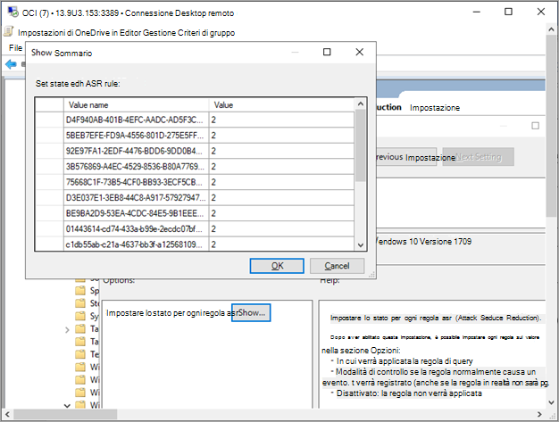

# Onboardare Windows 10 dispositivi con Criteri di gruppoOnboard Windows 10 devices using Group Policy 

[!INCLUDE [Microsoft 365 Defender rebranding](../../includes/microsoft-defender.md)]

**Si applica a:****Applies to:**

- Criteri di gruppoGroup Policy
- [Microsoft Defender per endpointMicrosoft Defender for Endpoint](https://go.microsoft.com/fwlink/p/?linkid=2154037)
- [Microsoft 365 DefenderMicrosoft 365 Defender](https://go.microsoft.com/fwlink/?linkid=2118804)

>Vuoi provare Defender per Endpoint?Want to experience Defender for Endpoint? [Iscriversi per una versione di valutazione gratuita.Sign up for a free trial.](https://www.microsoft.com/microsoft-365/windows/microsoft-defender-atp?ocid=docs-wdatp-configureendpointsgp-abovefoldlink)

> [!NOTE]
> Per utilizzare gli aggiornamenti di Criteri di gruppo per distribuire il pacchetto, è necessario essere in Windows Server 2008 R2 o versione successiva.To use Group Policy (GP) updates to deploy the package, you must be on Windows Server 2008 R2 or later.
> 
> Per Windows Server 2019, potrebbe essere necessario sostituire NT AUTHORITY\Well-Known-System-Account con NT AUTHORITY\SYSTEM del file XML creato dalla preferenza di Criteri di gruppo.For Windows Server 2019, you may need to replace NT AUTHORITY\Well-Known-System-Account with NT AUTHORITY\SYSTEM of the XML file that the Group Policy preference creates.

## Aggiungere dispositivi con Criteri di gruppoOnboard devices using Group Policy

Vedi il [PDF o](https://github.com/MicrosoftDocs/microsoft-365-docs/raw/public/microsoft-365/security/defender-endpoint/downloads/mdatp-deployment-strategy.pdf) il [Visio](https://github.com/MicrosoftDocs/microsoft-365-docs/raw/public/microsoft-365/security/defender-endpoint/downloads/mdatp-deployment-strategy.vsdx) per vedere i vari percorsi nella distribuzione di Defender per Endpoint.Check out the [PDF](https://github.com/MicrosoftDocs/microsoft-365-docs/raw/public/microsoft-365/security/defender-endpoint/downloads/mdatp-deployment-strategy.pdf)  or  [Visio](https://github.com/MicrosoftDocs/microsoft-365-docs/raw/public/microsoft-365/security/defender-endpoint/downloads/mdatp-deployment-strategy.vsdx) to see the various paths in deploying Defender for Endpoint. 

1. Aprire il file del pacchetto .zip criteri di gruppo (*WindowsDefenderATPOnboardingPackage.zip*) scaricato dall'onboarding guidato del servizio.Open the GP configuration package .zip file (*WindowsDefenderATPOnboardingPackage.zip*) that you downloaded from the service onboarding wizard. Puoi anche ottenere il pacchetto da [Microsoft Defender Security Center:](https://securitycenter.windows.com/)You can also get the package from [Microsoft Defender Security Center](https://securitycenter.windows.com/):
 
    1. Nel riquadro di spostamento selezionare **Impostazioni**  >  **onboarding**.In the navigation pane, select **Settings** > **Onboarding**.

    1. Seleziona Windows 10 come sistema operativo.Select Windows 10 as the operating system.
    
    1. Nel campo **Metodo di distribuzione** selezionare Criteri di **gruppo.**In the **Deployment method** field, select **Group policy**.
    
    1. Fai **clic su Scarica pacchetto** e salva il file .zip file.Click **Download package** and save the .zip file.

2. Estrarre il contenuto del file .zip in un percorso condiviso di sola lettura accessibile dal dispositivo.Extract the contents of the .zip file to a shared, read-only location that can be accessed by the device. Dovresti avere una cartella denominata *OptionalParamsPolicy* e il file *WindowsDefenderATPOnboardingScript.cmd.*You should have a folder called *OptionalParamsPolicy* and the file *WindowsDefenderATPOnboardingScript.cmd*.

3. Aprire console [Gestione Criteri di](/internet-explorer/ie11-deploy-guide/group-policy-and-group-policy-mgmt-console-ie11) gruppo, fare clic con il pulsante destro del mouse sull'oggetto Criteri di gruppo che si desidera configurare e scegliere **Modifica**.Open the [Group Policy Management Console](/internet-explorer/ie11-deploy-guide/group-policy-and-group-policy-mgmt-console-ie11) (GPMC), right-click the Group Policy Object (GPO) you want to configure and click **Edit**.

4. **Nell'Editor Gestione Criteri di gruppo** vai a Configurazione **computer,** quindi **Preferenze** e quindi impostazioni del Pannello **di controllo.**In the **Group Policy Management Editor**, go to **Computer configuration**, then **Preferences**, and then **Control panel settings**.

5. Fare clic con **il pulsante destro del mouse** su Attività pianificate, scegliere Nuovo e quindi Fare clic su Attività immediata **(almeno Windows 7).** Right-click **Scheduled tasks**, point to **New**, and then click **Immediate Task (At least Windows 7)**.

6. Nella **finestra Attività** visualizzata passare alla **scheda** Generale. In **Opzioni di sicurezza** fare clic su Cambia utente o **gruppo** e digitare SISTEMA e quindi fare clic su **Controlla nomi** e quindi su **OK.**In the **Task** window that opens, go to the **General** tab. Under **Security options** click **Change User or Group** and type SYSTEM and then click **Check Names** then **OK**. NT AUTHORITY\SYSTEM viene visualizzato come account utente con cui verrà eseguita l'attività.NT AUTHORITY\SYSTEM appears as the user account the task will run as.

7. Selezionare **Esegui se l'utente è connesso o meno** e selezionare la casella di controllo Esegui con **privilegi** più elevati.Select **Run whether user is logged on or not** and check the **Run with highest privileges** check box.

8. Vai alla scheda **Azioni** e fai clic su **Nuovo...** Verificare che **l'opzione Avvia** un programma sia selezionata nel **campo** Azione.Go to the **Actions** tab and click **New...** Ensure that **Start a program** is selected in the **Action** field. Immettere il nome e il percorso del file *WindowsDefenderATPOnboardingScript.cmd* condiviso.Enter the file name and location of the shared *WindowsDefenderATPOnboardingScript.cmd* file.

9. Fare **clic su OK** e chiudere tutte le finestre della Console Gestione Criteri di gruppo aperte.Click **OK** and close any open GPMC windows.

>[!TIP]
> Dopo l'onboarding del dispositivo, puoi scegliere di eseguire un test di rilevamento per verificare che il dispositivo sia stato correttamente onboarding nel servizio.After onboarding the device, you can choose to run a detection test to verify that the device is properly onboarded to the service. Per altre informazioni, vedi Eseguire un test di rilevamento in un dispositivo [Defender per endpoint appena onboarded.](run-detection-test.md)For more information, see [Run a detection test on a newly onboarded Defender for Endpoint device](run-detection-test.md).

## Ulteriori impostazioni di configurazione di Defender per endpointAdditional Defender for Endpoint configuration settings
Per ogni dispositivo, puoi indicare se i campioni possono essere raccolti dal dispositivo quando viene effettuata una richiesta tramite Microsoft Defender Security Center per inviare un file per l'analisi approfondita.For each device, you can state whether samples can be collected from the device when a request is made through Microsoft Defender Security Center to submit a file for deep analysis.

È possibile utilizzare Criteri di gruppo per configurare le impostazioni, ad esempio le impostazioni per la condivisione di esempio utilizzata nella funzionalità di analisi approfondita.You can use Group Policy (GP) to configure settings, such as settings for the sample sharing used in the deep analysis feature.

### Configurare le impostazioni della raccolta di esempioConfigure sample collection settings
1.  Nel dispositivo di gestione Criteri di gruppo copiare i file seguenti dal pacchetto di configurazione:On your GP management device, copy the following files from the configuration package:

    - Copiare _AtpConfiguration.admx_ in _C: \\ Windows \\ PolicyDefinitions_Copy _AtpConfiguration.admx_ into _C:\\Windows\\PolicyDefinitions_

    - Copiare _AtpConfiguration.adml_ in _C: \\ Windows \\ PolicyDefinitions \\ en-US_Copy _AtpConfiguration.adml_ into _C:\\Windows\\PolicyDefinitions\\en-US_

    Se si utilizza un [archivio centrale per i modelli](https://support.microsoft.com/help/3087759/how-to-create-and-manage-the-central-store-for-group-policy-administra)amministrativi di Criteri di gruppo, copiare i file seguenti dal pacchetto di configurazione:If you are using a [Central Store for Group Policy Administrative Templates](https://support.microsoft.com/help/3087759/how-to-create-and-manage-the-central-store-for-group-policy-administra), copy the following files from the configuration package:
    
    - Copiare _AtpConfiguration.admx_ in _\\ \\ \<forest.root\> \\ SysVol \\ \<forest.root\> \\ Policies \\ PolicyDefinitions_Copy _AtpConfiguration.admx_ into _\\\\\<forest.root\>\\SysVol\\\<forest.root\>\\Policies\\PolicyDefinitions_

    - Copiare _AtpConfiguration.adml_ in _\\ \\ \<forest.root\> \\ SysVol \\ \<forest.root\> \\ Policies \\ PolicyDefinitions \\ en-US_Copy _AtpConfiguration.adml_ into _\\\\\<forest.root\>\\SysVol\\\<forest.root\>\\Policies\\PolicyDefinitions\\en-US_

2.  Aprire la [Console Gestione Criteri di gruppo,](/internet-explorer/ie11-deploy-guide/group-policy-and-group-policy-mgmt-console-ie11)fare clic con il pulsante destro del mouse sull'oggetto Criteri di gruppo che si desidera configurare e scegliere **Modifica**.Open the [Group Policy Management Console](/internet-explorer/ie11-deploy-guide/group-policy-and-group-policy-mgmt-console-ie11), right-click the GPO you want to configure and click **Edit**.

3.  **Nell'Editor Gestione Criteri di gruppo** passare a Configurazione **computer**.In the **Group Policy Management Editor**, go to **Computer configuration**.

4.  Fare **clic su Criteri** e quindi su Modelli **amministrativi.**Click **Policies**, then **Administrative templates**.

5.  Fare **clic Windows componenti e** quindi Windows Defender **SmartScreen.**Click **Windows components** and then **Windows Defender SmartScreen**.

6.  Scegli se abilitare o disabilitare la condivisione dei campioni dai dispositivi.Choose to enable or disable sample sharing from your devices.

>[!NOTE]
> Se non si imposta un valore, il valore predefinito è abilitare la raccolta di esempi.If you don't set a value, the default value is to enable sample collection.

## Altre impostazioni di configurazione consigliateOther recommended configuration settings

### Aggiornare la configurazione di endpoint protectionUpdate endpoint protection configuration

Dopo aver configurato lo script di onboarding, continuare a modificare gli stessi criteri di gruppo per aggiungere configurazioni di endpoint protection.After configuring the onboarding script, continue editing the same group policy to add endpoint protection configurations. Eseguire modifiche ai Criteri di gruppo da un sistema che esegue Windows 10 o Server 2019 per assicurarsi di disporre di tutte le funzionalità Antivirus Microsoft Defender necessarie.Perform group policy edits from a system running Windows 10 or Server 2019 to ensure you have all of the required Microsoft Defender Antivirus capabilities. Potrebbe essere necessario chiudere e riaprire l'oggetto Criteri di gruppo per registrare le impostazioni di configurazione di Defender ATP.You may need to close and reopen the group policy object to register the Defender ATP configuration settings.

Tutti i criteri si trovano in `Computer Configuration\Policies\Administrative Templates` .All policies are located under `Computer Configuration\Policies\Administrative Templates`.

**Percorso criteri:** \Windows Components\Windows Defender ATP**Policy location:** \Windows Components\Windows Defender ATP

CriterioPolicy | ImpostazioneSetting 
:---|:---
Enable\Disable Sample collectionEnable\Disable Sample collection|   Enabled - "Enable sample collection on machines" checkedEnabled - "Enable sample collection on machines" checked

 

**Percorso dei criteri:** \Windows Components\Antivirus Microsoft Defender**Policy location:**  \Windows Components\Microsoft Defender Antivirus

CriterioPolicy | ImpostazioneSetting 
:---|:---
Configurare il rilevamento per applicazioni potenzialmente indesiderateConfigure detection for potentially unwanted applications | Enabled, BlockEnabled, Block

 

**Percorso dei criteri:** \Windows Components\Antivirus Microsoft Defender\MAPS**Policy location:** \Windows Components\Microsoft Defender Antivirus\MAPS

CriterioPolicy | ImpostazioneSetting 
:---|:---
Partecipare a Microsoft MAPSJoin Microsoft MAPS | Enabled, Advanced MAPSEnabled, Advanced MAPS
Inviare esempi di file quando è necessaria un'ulteriore analisiSend file samples when further analysis is required | Enabled, Send safe samplesEnabled, Send safe samples

 

**Percorso dei criteri:** \Windows Components\Antivirus Microsoft Defender\Real-time Protection**Policy location:** \Windows Components\Microsoft Defender Antivirus\Real-time Protection

CriterioPolicy | ImpostazioneSetting 
:---|:---
Disattivare la protezione in tempo realeTurn off real-time protection|DisattivatoDisabled
Attivare il monitoraggio del comportamentoTurn on behavior monitoring|AbilitatoEnabled
Analizzare tutti i file e gli allegati scaricatiScan all downloaded files and attachments|AbilitatoEnabled
Monitorare le attività di file e programmi nel computerMonitor file and program activity on your computer|AbilitatoEnabled

 

**Percorso criteri:** \Windows Components\Antivirus Microsoft Defender\Scan**Policy location:**  \Windows Components\Microsoft Defender Antivirus\Scan

Queste impostazioni configurano analisi periodiche dell'endpoint.These settings configure periodic scans of the endpoint. È consigliabile eseguire un'analisi rapida settimanale, permettendo le prestazioni.We recommend performing a weekly quick scan, performance permitting.

CriterioPolicy | ImpostazioneSetting 
:---|:---
Prima di eseguire un'analisi pianificata, verificare la disponibilità delle informazioni di sicurezza più recenti su virus e spywareCheck for the latest virus and spyware security intelligence before running a scheduled scan |AbilitatoEnabled

 

**Percorso dei criteri:** \Windows Components\Antivirus Microsoft Defender\Microsoft Defender Exploit Guard\Attack Surface Reduction**Policy location:** \Windows Components\Microsoft Defender Antivirus\Microsoft Defender Exploit Guard\Attack Surface Reduction

Ottenere l'elenco corrente dei GUID di riduzione della superficie di attacco da [Personalizzare le regole di riduzione della superficie di attacco](customize-attack-surface-reduction.md)Get the current list of attack surface reduction GUIDs from [Customize attack surface reduction rules](customize-attack-surface-reduction.md)

1. Apri il **criterio Configura riduzione superficie di** attacco.Open the **Configure Attack Surface Reduction** policy.

1. Selezionare **Abilitato**.Select **Enabled**.

1. Selezionare il **pulsante** Mostra.Select the **Show** button.

1. Aggiungere ogni GUID nel **campo Nome valore** con un valore pari a 2.Add each GUID in the **Value Name** field with a Value of 2.

   Questa impostazione verrà impostata solo per il controllo.This will set each up for audit only.

   

CriterioPolicy | ImpostazioneSetting 
:---|:---
Configurare l'accesso controllato alle cartelleConfigure Controlled folder access| Abilitato, modalità di controlloEnabled, Audit Mode

## Dispositivi offboard con Criteri di gruppoOffboard devices using Group Policy
Per motivi di sicurezza, il pacchetto usato per i dispositivi offboard scadrà 30 giorni dopo la data di download.For security reasons, the package used to Offboard devices will expire 30 days after the date it was downloaded. I pacchetti di offboarding scaduti inviati a un dispositivo verranno rifiutati.Expired offboarding packages sent to a device will be rejected. Durante il download di un pacchetto di offboarding, ti verrà notificata la data di scadenza dei pacchetti e verrà incluso anche nel nome del pacchetto.When downloading an offboarding package you will be notified of the packages expiry date and it will also be included in the package name.

> [!NOTE]
> I criteri di onboarding e offboarding non devono essere distribuiti nello stesso dispositivo contemporaneamente, altrimenti ciò causerà collisioni imprevedibili.Onboarding and offboarding policies must not be deployed on the same device at the same time, otherwise this will cause unpredictable collisions.

1. Ottenere il pacchetto di offboarding [da Microsoft Defender Security Center](https://securitycenter.windows.com/):Get the offboarding package from [Microsoft Defender Security Center](https://securitycenter.windows.com/):

    1. Nel riquadro di spostamento selezionare **Impostazioni**  >  **offboarding**.In the navigation pane, select **Settings** > **Offboarding**.

    1. Seleziona Windows 10 come sistema operativo.Select Windows 10 as the operating system.
    
    1. Nel campo **Metodo di distribuzione** selezionare Criteri di **gruppo.**In the **Deployment method** field, select **Group policy**.

    1. Fai **clic su Scarica pacchetto** e salva il file .zip file.Click **Download package** and save the .zip file.

2. Estrarre il contenuto del file .zip in un percorso condiviso di sola lettura accessibile dal dispositivo.Extract the contents of the .zip file to a shared, read-only location that can be accessed by the device. Dovresti avere un file denominato *WindowsDefenderATPOffboardingScript_valid_until_YYYY-MM-DD.cmd*.You should have a file named *WindowsDefenderATPOffboardingScript_valid_until_YYYY-MM-DD.cmd*.

3. Aprire console [Gestione Criteri di](/internet-explorer/ie11-deploy-guide/group-policy-and-group-policy-mgmt-console-ie11) gruppo, fare clic con il pulsante destro del mouse sull'oggetto Criteri di gruppo che si desidera configurare e scegliere **Modifica**.Open the [Group Policy Management Console](/internet-explorer/ie11-deploy-guide/group-policy-and-group-policy-mgmt-console-ie11) (GPMC), right-click the Group Policy Object (GPO) you want to configure and click **Edit**.

4. **Nell'Editor Gestione Criteri di gruppo** vai a Configurazione **computer,** Quindi **Preferenze** e quindi Impostazioni pannello **di controllo.**In the **Group Policy Management Editor**, go to **Computer configuration,** then **Preferences**, and then **Control panel settings**.

5. Fare clic con il **pulsante destro del mouse** su Attività pianificate, scegliere **Nuovo** e quindi Fare clic su **Attività immediata.**Right-click **Scheduled tasks**, point to **New**, and then click **Immediate task**.

6. Nella **finestra Attività** visualizzata passare alla **scheda** Generale. Scegliere l'account utente SYSTEM locale (BUILTIN\SYSTEM) in **Opzioni di sicurezza**.In the **Task** window that opens, go to the **General** tab. Choose the local SYSTEM user account (BUILTIN\SYSTEM) under **Security options**.

7. Selezionare **Esegui se l'utente è connesso o meno** e selezionare la **casella** di controllo Esegui con privilegi più elevati.Select **Run whether user is logged on or not** and check the **Run with highest privileges** check-box.

8. Passare alla scheda **Azioni** e fare clic su **Nuovo...**. Verificare che **l'opzione Avvia** un programma sia selezionata nel **campo** Azione.Go to the **Actions** tab and click **New...**. Ensure that **Start a program** is selected in the **Action** field. Immettere il nome e il percorso del file  *WindowsDefenderATPOffboardingScript_valid_until_YYYY-MM-DD.cmd* condiviso.Enter the file name and location of the shared  *WindowsDefenderATPOffboardingScript_valid_until_YYYY-MM-DD.cmd* file.

9. Fare **clic su OK** e chiudere tutte le finestre della Console Gestione Criteri di gruppo aperte.Click **OK** and close any open GPMC windows.

> [!IMPORTANT]
> L'offboarding fa sì che il dispositivo interrompi l'invio dei dati del sensore al portale, ma i dati dal dispositivo, incluso il riferimento a eventuali avvisi che ha avuto, verranno conservati per un massimo di 6 mesi.Offboarding causes the device to stop sending sensor data to the portal but data from the device, including reference to any alerts it has had will be retained for up to 6 months.

## Monitorare la configurazione del dispositivoMonitor device configuration
Con Criteri di gruppo non è disponibile un'opzione per monitorare la distribuzione dei criteri nei dispositivi.With Group Policy there isn’t an option to monitor deployment of policies on the devices. Il monitoraggio può essere eseguito direttamente nel portale o utilizzando i diversi strumenti di distribuzione.Monitoring can be done directly on the portal, or by using the different deployment tools.

## Monitorare i dispositivi tramite il portaleMonitor devices using the portal
1. Vai a [Microsoft Defender Security Center](https://securitycenter.windows.com/).Go to [Microsoft Defender Security Center](https://securitycenter.windows.com/).
2. Fare **clic su Elenco dispositivi**.Click **Devices list**.
3. Verificare che i dispositivi siano visualizzati.Verify that devices are appearing.

> [!NOTE]
> L'inizio della visualizzazione dei dispositivi nell'elenco Dispositivi può richiedere **diversi giorni.**It can take several days for devices to start showing on the **Devices list**. Ciò include il tempo necessario per la distribuzione dei criteri al dispositivo, il tempo necessario prima che l'utente e il tempo necessario per l'avvio dei report da parte dell'endpoint.This includes the time it takes for the policies to be distributed to the device, the time it takes before the user logs on, and the time it takes for the endpoint to start reporting.

## Argomenti correlatiRelated topics
- [Onboard Windows 10 dispositivi con Microsoft Endpoint Configuration ManagerOnboard Windows 10 devices using Microsoft Endpoint Configuration Manager](configure-endpoints-sccm.md)
- [Onboarding di dispositivi Windows 10 con gli strumenti di Gestione dispositivi mobiliOnboard Windows 10 devices using Mobile Device Management tools](configure-endpoints-mdm.md)
- [Onboarding di dispositivi Windows 10 con uno script localeOnboard Windows 10 devices using a local script](configure-endpoints-script.md)
- [Aggiungere dispositivi VDI (Virtual Desktop Infrastructure) non persistentiOnboard non-persistent virtual desktop infrastructure (VDI) devices](configure-endpoints-vdi.md)
- [Eseguire un test di rilevamento su un Microsoft Defender per dispositivi endpoint appena onboardedRun a detection test on a newly onboarded Microsoft Defender for Endpoint devices](run-detection-test.md)
- [Risolvere i problemi di onboarding di Microsoft Defender per endpointTroubleshoot Microsoft Defender for Endpoint onboarding issues](troubleshoot-onboarding.md)
