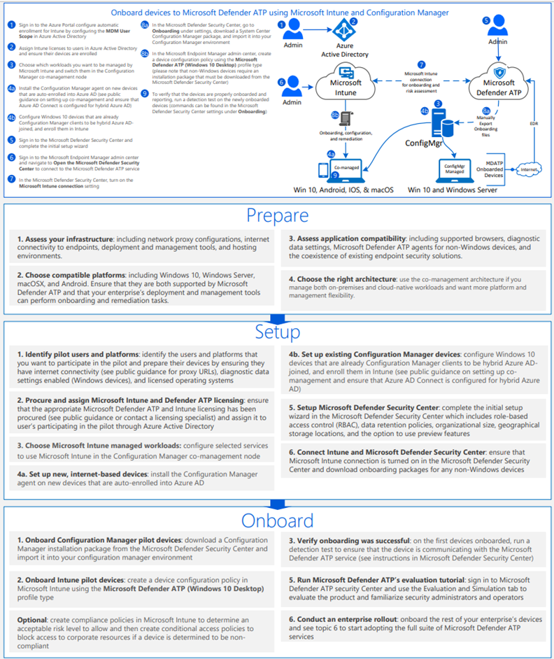
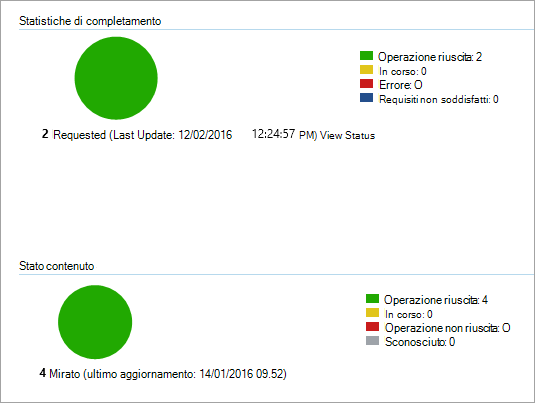

# <a name="onboard-the-windows-10-devices-using-configuration-manager"></a><span data-ttu-id="50b2e-104">Onboardare i dispositivi Windows 10 usando Configuration Manager</span><span class="sxs-lookup"><span data-stu-id="50b2e-104">Onboard the Windows 10 devices using Configuration Manager</span></span>

[!INCLUDE [Microsoft 365 Defender rebranding](../../includes/microsoft-defender.md)]

<span data-ttu-id="50b2e-105">**Si applica a:**</span><span class="sxs-lookup"><span data-stu-id="50b2e-105">**Applies to:**</span></span>

- [<span data-ttu-id="50b2e-106">Microsoft Defender per endpoint</span><span class="sxs-lookup"><span data-stu-id="50b2e-106">Microsoft Defender for Endpoint</span></span>](https://go.microsoft.com/fwlink/p/?linkid=2154037)
- [<span data-ttu-id="50b2e-107">Microsoft 365 Defender</span><span class="sxs-lookup"><span data-stu-id="50b2e-107">Microsoft 365 Defender</span></span>](https://go.microsoft.com/fwlink/?linkid=2118804)
- <span data-ttu-id="50b2e-108">Microsoft Endpoint Configuration Manager corrente</span><span class="sxs-lookup"><span data-stu-id="50b2e-108">Microsoft Endpoint Configuration Manager current branch</span></span>
- <span data-ttu-id="50b2e-109">System Center Configuration Manager 2012 R2</span><span class="sxs-lookup"><span data-stu-id="50b2e-109">System Center 2012 R2 Configuration Manager</span></span>

><span data-ttu-id="50b2e-110">Vuoi provare Defender per Endpoint?</span><span class="sxs-lookup"><span data-stu-id="50b2e-110">Want to experience Defender for Endpoint?</span></span> [<span data-ttu-id="50b2e-111">Iscriversi per una versione di valutazione gratuita.</span><span class="sxs-lookup"><span data-stu-id="50b2e-111">Sign up for a free trial.</span></span>](https://www.microsoft.com/microsoft-365/windows/microsoft-defender-atp?ocid=docs-wdatp-configureendpointssccm-abovefoldlink)

## <a name="supported-client-operating-systems"></a><span data-ttu-id="50b2e-112">Sistemi operativi client supportati</span><span class="sxs-lookup"><span data-stu-id="50b2e-112">Supported client operating systems</span></span>

<span data-ttu-id="50b2e-113">In base alla versione di Configuration Manager in esecuzione, è possibile eseguire l'onboarded dei seguenti sistemi operativi client:</span><span class="sxs-lookup"><span data-stu-id="50b2e-113">Based on the version of Configuration Manager you're running, the following client operating systems can be onboarded:</span></span>

#### <a name="configuration-manager-version-1910-and-prior"></a><span data-ttu-id="50b2e-114">Configuration Manager versione 1910 e precedenti</span><span class="sxs-lookup"><span data-stu-id="50b2e-114">Configuration Manager version 1910 and prior</span></span>

- <span data-ttu-id="50b2e-115">Client computer che eseguono Windows 10</span><span class="sxs-lookup"><span data-stu-id="50b2e-115">Clients computers running Windows 10</span></span> 

#### <a name="configuration-manager-version-2002-and-later"></a><span data-ttu-id="50b2e-116">Configuration Manager versione 2002 e successive</span><span class="sxs-lookup"><span data-stu-id="50b2e-116">Configuration Manager version 2002 and later</span></span>

<span data-ttu-id="50b2e-117">A partire da Configuration Manager versione 2002, è possibile eseguire l'onboardboard dei sistemi operativi seguenti:</span><span class="sxs-lookup"><span data-stu-id="50b2e-117">Starting in Configuration Manager version 2002, you can onboard the following operating systems:</span></span>

- <span data-ttu-id="50b2e-118">Windows 8.1</span><span class="sxs-lookup"><span data-stu-id="50b2e-118">Windows 8.1</span></span>
- <span data-ttu-id="50b2e-119">Windows 10</span><span class="sxs-lookup"><span data-stu-id="50b2e-119">Windows 10</span></span>
- <span data-ttu-id="50b2e-120">Windows Server 2012 R2</span><span class="sxs-lookup"><span data-stu-id="50b2e-120">Windows Server 2012 R2</span></span>
- <span data-ttu-id="50b2e-121">Windows Server 2016</span><span class="sxs-lookup"><span data-stu-id="50b2e-121">Windows Server 2016</span></span>
- <span data-ttu-id="50b2e-122">Windows Server 2016 versione 1803 o successiva</span><span class="sxs-lookup"><span data-stu-id="50b2e-122">Windows Server 2016, version 1803 or later</span></span>
- <span data-ttu-id="50b2e-123">Windows Server 2019</span><span class="sxs-lookup"><span data-stu-id="50b2e-123">Windows Server 2019</span></span>

>[!NOTE]
><span data-ttu-id="50b2e-124">Per ulteriori informazioni su come eseguire l'onboard Windows Server 2012 R2, Windows Server 2016 e Windows Server 2019, vedere [Onboard Windows servers](configure-server-endpoints.md).</span><span class="sxs-lookup"><span data-stu-id="50b2e-124">For more information on how to onboard Windows Server 2012 R2, Windows Server 2016, and Windows Server 2019, see, [Onboard Windows servers](configure-server-endpoints.md).</span></span>


### <a name="onboard-devices-using-system-center-configuration-manager"></a><span data-ttu-id="50b2e-125">Onboard dei dispositivi con System Center Configuration Manager</span><span class="sxs-lookup"><span data-stu-id="50b2e-125">Onboard devices using System Center Configuration Manager</span></span>


<span data-ttu-id="50b2e-126">[](images/onboard-config-mgr.png#lightbox)</span><span class="sxs-lookup"><span data-stu-id="50b2e-126">[](images/onboard-config-mgr.png#lightbox)</span></span>


<span data-ttu-id="50b2e-127">Consulta il [pdf o](https://github.com/MicrosoftDocs/microsoft-365-docs/raw/public/microsoft-365/security/defender-endpoint/downloads/mdatp-deployment-strategy.pdf) il [Visio](https://github.com/MicrosoftDocs/microsoft-365-docs/raw/public/microsoft-365/security/defender-endpoint/downloads/mdatp-deployment-strategy.vsdx) per vedere i vari percorsi nella distribuzione di Microsoft Defender per Endpoint.</span><span class="sxs-lookup"><span data-stu-id="50b2e-127">Check out the [PDF](https://github.com/MicrosoftDocs/microsoft-365-docs/raw/public/microsoft-365/security/defender-endpoint/downloads/mdatp-deployment-strategy.pdf)  or  [Visio](https://github.com/MicrosoftDocs/microsoft-365-docs/raw/public/microsoft-365/security/defender-endpoint/downloads/mdatp-deployment-strategy.vsdx) to see the various paths in deploying Microsoft Defender for Endpoint.</span></span> 


1. <span data-ttu-id="50b2e-128">Aprire il file del pacchetto di .zip configuration manager (*WindowsDefenderATPOnboardingPackage.zip*) scaricato dall'onboarding guidato del servizio.</span><span class="sxs-lookup"><span data-stu-id="50b2e-128">Open the Configuration Manager configuration package .zip file (*WindowsDefenderATPOnboardingPackage.zip*) that you downloaded from the service onboarding wizard.</span></span> <span data-ttu-id="50b2e-129">Puoi anche ottenere il pacchetto da [Microsoft 365 Defender portale:](https://security.microsoft.com/)</span><span class="sxs-lookup"><span data-stu-id="50b2e-129">You can also get the package from [Microsoft 365 Defender portal](https://security.microsoft.com/):</span></span>

    1. <span data-ttu-id="50b2e-130">Nel riquadro di spostamento seleziona **Impostazioni**  >    >    >  **Onboarding** gestione dispositivi degli endpoint.</span><span class="sxs-lookup"><span data-stu-id="50b2e-130">In the navigation pane, select **Settings** > **Endpoints** > **Device management** > **Onboarding**.</span></span>
    
    1. <span data-ttu-id="50b2e-131">Seleziona Windows 10 come sistema operativo.</span><span class="sxs-lookup"><span data-stu-id="50b2e-131">Select Windows 10 as the operating system.</span></span>

    1. <span data-ttu-id="50b2e-132">Nel campo **Metodo di** distribuzione selezionare **System Center Configuration Manager 2012/2012 R2/1511/1602**.</span><span class="sxs-lookup"><span data-stu-id="50b2e-132">In the **Deployment method** field, select **System Center Configuration Manager 2012/2012 R2/1511/1602**.</span></span>
    
    1. <span data-ttu-id="50b2e-133">Seleziona **Scarica pacchetto** e salva il file .zip file.</span><span class="sxs-lookup"><span data-stu-id="50b2e-133">Select **Download package**, and save the .zip file.</span></span>

2. <span data-ttu-id="50b2e-134">Estrarre il contenuto del file .zip in un percorso condiviso di sola lettura accessibile dagli amministratori di rete che distribuiranno il pacchetto.</span><span class="sxs-lookup"><span data-stu-id="50b2e-134">Extract the contents of the .zip file to a shared, read-only location that can be accessed by the network administrators who will deploy the package.</span></span> <span data-ttu-id="50b2e-135">Dovresti avere un file denominato *WindowsDefenderATPOnboardingScript.cmd.*</span><span class="sxs-lookup"><span data-stu-id="50b2e-135">You should have a file named *WindowsDefenderATPOnboardingScript.cmd*.</span></span>

3. <span data-ttu-id="50b2e-136">Distribuire il pacchetto seguendo la procedura descritta nell'articolo [Packages and Programs in System Center 2012 R2 Configuration Manager.](/previous-versions/system-center/system-center-2012-R2/gg699369\(v=technet.10\))</span><span class="sxs-lookup"><span data-stu-id="50b2e-136">Deploy the package by following the steps in the [Packages and Programs in System Center 2012 R2 Configuration Manager](/previous-versions/system-center/system-center-2012-R2/gg699369\(v=technet.10\)) article.</span></span>

    <span data-ttu-id="50b2e-137">a.</span><span class="sxs-lookup"><span data-stu-id="50b2e-137">a.</span></span> <span data-ttu-id="50b2e-138">Scegli una raccolta di dispositivi predefinita in cui distribuire il pacchetto.</span><span class="sxs-lookup"><span data-stu-id="50b2e-138">Choose a predefined device collection to deploy the package to.</span></span>

> [!NOTE]
> <span data-ttu-id="50b2e-139">Defender for Endpoint non supporta l'onboarding durante la [fase out-of-box experience (OOBE).](https://answers.microsoft.com/en-us/windows/wiki/windows_10/how-to-complete-the-windows-10-out-of-box/47e3f943-f000-45e3-8c5c-9d85a1a0cf87)</span><span class="sxs-lookup"><span data-stu-id="50b2e-139">Defender for Endpoint doesn't support onboarding during the [Out-Of-Box Experience (OOBE)](https://answers.microsoft.com/en-us/windows/wiki/windows_10/how-to-complete-the-windows-10-out-of-box/47e3f943-f000-45e3-8c5c-9d85a1a0cf87) phase.</span></span> <span data-ttu-id="50b2e-140">Assicurarsi che gli utenti completino la Procedura guidata dopo l'Windows o l'aggiornamento.</span><span class="sxs-lookup"><span data-stu-id="50b2e-140">Make sure users complete OOBE after running Windows installation or upgrading.</span></span>

>[!TIP]
> <span data-ttu-id="50b2e-141">Dopo l'onboarding del dispositivo, puoi scegliere di eseguire un test di rilevamento per verificare che un dispositivo sia stato correttamente onboarding nel servizio.</span><span class="sxs-lookup"><span data-stu-id="50b2e-141">After onboarding the device, you can choose to run a detection test to verify that an device is properly onboarded to the service.</span></span> <span data-ttu-id="50b2e-142">Per altre informazioni, vedi Eseguire un test di rilevamento in un dispositivo [Defender per endpoint appena onboarded.](run-detection-test.md)</span><span class="sxs-lookup"><span data-stu-id="50b2e-142">For more information, see [Run a detection test on a newly onboarded Defender for Endpoint device](run-detection-test.md).</span></span>
>
> <span data-ttu-id="50b2e-143">Tieni presente che è possibile creare una regola di rilevamento in un'applicazione di Configuration Manager per verificare continuamente se è stato eseguito l'onboarded di un dispositivo.</span><span class="sxs-lookup"><span data-stu-id="50b2e-143">Note that it is possible to create a detection rule on a Configuration Manager application to continuously check if a device has been onboarded.</span></span> <span data-ttu-id="50b2e-144">Un'applicazione è un tipo di oggetto diverso rispetto a un pacchetto e a un programma.</span><span class="sxs-lookup"><span data-stu-id="50b2e-144">An application is a different type of object than a package and program.</span></span>
> <span data-ttu-id="50b2e-145">Se un dispositivo non è ancora stato onboarded (a causa del completamento della Configurazione guidata in sospeso o di qualsiasi altro motivo), Configuration Manager ritenterà di eseguire l'onboarded del dispositivo fino a quando la regola non rileva la modifica dello stato.</span><span class="sxs-lookup"><span data-stu-id="50b2e-145">If a device is not yet onboarded (due to pending OOBE completion or any other reason), Configuration Manager will retry to onboard the device until the rule detects the status change.</span></span>
> 
> <span data-ttu-id="50b2e-146">Questo comportamento può essere ottenuto creando una regola di rilevamento che controlla se il valore del Registro di sistema "OnboardingState" (di tipo REG_DWORD) = 1.</span><span class="sxs-lookup"><span data-stu-id="50b2e-146">This behavior can be accomplished by creating a detection rule checking if the "OnboardingState" registry value (of type REG_DWORD) = 1.</span></span>
> <span data-ttu-id="50b2e-147">Questo valore del Registro di sistema si trova in "HKLM\SOFTWARE\Microsoft\Windows Advanced Threat Protection\Status".</span><span class="sxs-lookup"><span data-stu-id="50b2e-147">This registry value is located under "HKLM\SOFTWARE\Microsoft\Windows Advanced Threat Protection\Status".</span></span>
<span data-ttu-id="50b2e-148">Per ulteriori informazioni, vedere [Configure Detection Methods in System Center 2012 R2 Configuration Manager.](/previous-versions/system-center/system-center-2012-R2/gg682159\(v=technet.10\)#step-4-configure-detection-methods-to-indicate-the-presence-of-the-deployment-type)</span><span class="sxs-lookup"><span data-stu-id="50b2e-148">For more information, see [Configure Detection Methods in System Center 2012 R2 Configuration Manager](/previous-versions/system-center/system-center-2012-R2/gg682159\(v=technet.10\)#step-4-configure-detection-methods-to-indicate-the-presence-of-the-deployment-type).</span></span>

### <a name="configure-sample-collection-settings"></a><span data-ttu-id="50b2e-149">Configurare le impostazioni della raccolta di esempio</span><span class="sxs-lookup"><span data-stu-id="50b2e-149">Configure sample collection settings</span></span>

<span data-ttu-id="50b2e-150">Per ogni dispositivo, puoi impostare un valore di configurazione per indicare se è possibile raccogliere campioni dal dispositivo quando viene effettuata una richiesta tramite Microsoft 365 Defender per inviare un file per l'analisi approfondita.</span><span class="sxs-lookup"><span data-stu-id="50b2e-150">For each device, you can set a configuration value to state whether samples can be collected from the device when a request is made through Microsoft 365 Defender to submit a file for deep analysis.</span></span>

>[!NOTE]
><span data-ttu-id="50b2e-151">Queste impostazioni di configurazione vengono in genere eseguite tramite Configuration Manager.</span><span class="sxs-lookup"><span data-stu-id="50b2e-151">These configuration settings are typically done through Configuration Manager.</span></span>

<span data-ttu-id="50b2e-152">Puoi impostare una regola di conformità per l'elemento di configurazione in Configuration Manager per modificare l'impostazione della condivisione di esempio in un dispositivo.</span><span class="sxs-lookup"><span data-stu-id="50b2e-152">You can set a compliance rule for configuration item in Configuration Manager to change the sample share setting on a device.</span></span>

<span data-ttu-id="50b2e-153">Questa regola deve essere un elemento *di configurazione* della regola di conformità che imposta il valore di una chiave del Registro di sistema nei dispositivi di destinazione per assicurarsi che siano reclami.</span><span class="sxs-lookup"><span data-stu-id="50b2e-153">This rule should be a *remediating* compliance rule configuration item that sets the value of a registry key on targeted devices to make sure they’re complaint.</span></span>

<span data-ttu-id="50b2e-154">La configurazione viene impostata tramite la voce della chiave del Registro di sistema seguente:</span><span class="sxs-lookup"><span data-stu-id="50b2e-154">The configuration is set through the following registry key entry:</span></span>

```console
Path: "HKLM\SOFTWARE\Policies\Microsoft\Windows Advanced Threat Protection"
Name: "AllowSampleCollection"
Value: 0 or 1
```

<span data-ttu-id="50b2e-155">Dove:</span><span class="sxs-lookup"><span data-stu-id="50b2e-155">Where:</span></span><br>
<span data-ttu-id="50b2e-156">Il tipo di chiave è D-WORD.</span><span class="sxs-lookup"><span data-stu-id="50b2e-156">Key type is a D-WORD.</span></span> <br>
<span data-ttu-id="50b2e-157">I valori possibili sono:</span><span class="sxs-lookup"><span data-stu-id="50b2e-157">Possible values are:</span></span>
- <span data-ttu-id="50b2e-158">0 - Non consente la condivisione di esempi da questo dispositivo</span><span class="sxs-lookup"><span data-stu-id="50b2e-158">0 - doesn't allow sample sharing  from this device</span></span>
- <span data-ttu-id="50b2e-159">1 - Consente la condivisione di tutti i tipi di file da questo dispositivo</span><span class="sxs-lookup"><span data-stu-id="50b2e-159">1 - allows sharing of all file types from this device</span></span>

<span data-ttu-id="50b2e-160">Il valore predefinito nel caso in cui la chiave del Registro di sistema non esista è 1.</span><span class="sxs-lookup"><span data-stu-id="50b2e-160">The default value in case the registry key doesn’t exist is 1.</span></span>

<span data-ttu-id="50b2e-161">Per ulteriori informazioni sulla System Center Configuration Manager conformità, vedere Introduzione alle impostazioni di [conformità in System Center 2012 R2 Configuration Manager.](/previous-versions/system-center/system-center-2012-R2/gg682139\(v=technet.10\))</span><span class="sxs-lookup"><span data-stu-id="50b2e-161">For more information about System Center Configuration Manager Compliance, see [Introduction to compliance settings in System Center 2012 R2 Configuration Manager](/previous-versions/system-center/system-center-2012-R2/gg682139\(v=technet.10\)).</span></span>


## <a name="other-recommended-configuration-settings"></a><span data-ttu-id="50b2e-162">Altre impostazioni di configurazione consigliate</span><span class="sxs-lookup"><span data-stu-id="50b2e-162">Other recommended configuration settings</span></span>
<span data-ttu-id="50b2e-163">Dopo l'onboarding dei dispositivi al servizio, è importante sfruttare le funzionalità di protezione dalle minacce incluse abilitandoli con le impostazioni di configurazione consigliate seguenti.</span><span class="sxs-lookup"><span data-stu-id="50b2e-163">After onboarding devices to the service, it's important to take advantage of the included threat protection capabilities by enabling them with the following recommended configuration settings.</span></span>

### <a name="device-collection-configuration"></a><span data-ttu-id="50b2e-164">Configurazione raccolta dispositivi</span><span class="sxs-lookup"><span data-stu-id="50b2e-164">Device collection configuration</span></span>
<span data-ttu-id="50b2e-165">Se si usa Endpoint Configuration Manager, versione 2002 o successiva, è possibile scegliere di ampliare la distribuzione per includere server o client di livello inferiore.</span><span class="sxs-lookup"><span data-stu-id="50b2e-165">If you're using Endpoint Configuration Manager, version 2002 or later, you can choose to broaden the deployment to include servers or down-level clients.</span></span>


### <a name="next-generation-protection-configuration"></a><span data-ttu-id="50b2e-166">Configurazione di protezione di nuova generazione</span><span class="sxs-lookup"><span data-stu-id="50b2e-166">Next generation protection configuration</span></span>
<span data-ttu-id="50b2e-167">Sono consigliate le impostazioni di configurazione seguenti:</span><span class="sxs-lookup"><span data-stu-id="50b2e-167">The following configuration settings are recommended:</span></span>

<span data-ttu-id="50b2e-168">**Analisi**</span><span class="sxs-lookup"><span data-stu-id="50b2e-168">**Scan**</span></span> <br>
- <span data-ttu-id="50b2e-169">Analizzare i dispositivi di archiviazione rimovibili, ad esempio le unità USB: Sì</span><span class="sxs-lookup"><span data-stu-id="50b2e-169">Scan removable storage devices such as USB drives: Yes</span></span>

<span data-ttu-id="50b2e-170">**Protezione in tempo reale**</span><span class="sxs-lookup"><span data-stu-id="50b2e-170">**Real-time Protection**</span></span> <br>
- <span data-ttu-id="50b2e-171">Abilita monitoraggio comportamentale: Sì</span><span class="sxs-lookup"><span data-stu-id="50b2e-171">Enable Behavioral Monitoring: Yes</span></span>
- <span data-ttu-id="50b2e-172">Abilitare la protezione da applicazioni potenzialmente indesiderate durante il download e prima dell'installazione: Sì</span><span class="sxs-lookup"><span data-stu-id="50b2e-172">Enable protection against Potentially Unwanted Applications at download and prior to installation: Yes</span></span>

<span data-ttu-id="50b2e-173">**Servizio di protezione cloud**</span><span class="sxs-lookup"><span data-stu-id="50b2e-173">**Cloud Protection Service**</span></span>
- <span data-ttu-id="50b2e-174">Tipo di appartenenza al servizio di protezione cloud: appartenenza avanzata</span><span class="sxs-lookup"><span data-stu-id="50b2e-174">Cloud Protection Service membership type: Advanced membership</span></span>

<span data-ttu-id="50b2e-175">**Riduzione della superficie di attacco** Configurare tutte le regole disponibili su Controllo.</span><span class="sxs-lookup"><span data-stu-id="50b2e-175">**Attack surface reduction** Configure all available rules to Audit.</span></span>

>[!NOTE]
> <span data-ttu-id="50b2e-176">Il blocco di queste attività può interrompere i processi aziendali legittimi.</span><span class="sxs-lookup"><span data-stu-id="50b2e-176">Blocking these activities may interrupt legitimate business processes.</span></span> <span data-ttu-id="50b2e-177">L'approccio migliore consiste nell'impostare tutti i controlli, identificare quelli sicuri da attivare e quindi abilitare tali impostazioni sugli endpoint che non dispongono di rilevamenti falsi positivi.</span><span class="sxs-lookup"><span data-stu-id="50b2e-177">The best approach is setting everything to audit, identifying which ones are safe to turn on, and then enabling those settings on endpoints which do not have false positive detections.</span></span>


<span data-ttu-id="50b2e-178">**Protezione di rete**</span><span class="sxs-lookup"><span data-stu-id="50b2e-178">**Network protection**</span></span> <br>
<span data-ttu-id="50b2e-179">Prima di abilitare la protezione di rete in modalità di controllo o blocco, assicurati di aver installato l'aggiornamento della piattaforma antimalware, che può essere ottenuto dalla [pagina di supporto](https://support.microsoft.com/en-us/help/4560203/windows-defender-anti-malware-platform-binaries-are-missing).</span><span class="sxs-lookup"><span data-stu-id="50b2e-179">Prior to enabling network protection in audit or block mode, ensure that you've installed the antimalware platform update, which can be obtained from the [support page](https://support.microsoft.com/en-us/help/4560203/windows-defender-anti-malware-platform-binaries-are-missing).</span></span>


<span data-ttu-id="50b2e-180">**Accesso controllato alle cartelle**</span><span class="sxs-lookup"><span data-stu-id="50b2e-180">**Controlled folder access**</span></span><br>
<span data-ttu-id="50b2e-181">Abilita la funzionalità in modalità di controllo per almeno 30 giorni.</span><span class="sxs-lookup"><span data-stu-id="50b2e-181">Enable the feature in audit mode for at least 30 days.</span></span> <span data-ttu-id="50b2e-182">Dopo questo periodo, esaminare i rilevamenti e creare un elenco di applicazioni che possono scrivere nelle directory protette.</span><span class="sxs-lookup"><span data-stu-id="50b2e-182">After this period, review detections and create a list of applications that are allowed to write to protected directories.</span></span>

<span data-ttu-id="50b2e-183">Per ulteriori informazioni, vedere [Evaluate controlled folder access](evaluate-controlled-folder-access.md).</span><span class="sxs-lookup"><span data-stu-id="50b2e-183">For more information, see [Evaluate controlled folder access](evaluate-controlled-folder-access.md).</span></span>


## <a name="offboard-devices-using-configuration-manager"></a><span data-ttu-id="50b2e-184">Dispositivi offboard con Configuration Manager</span><span class="sxs-lookup"><span data-stu-id="50b2e-184">Offboard devices using Configuration Manager</span></span>

<span data-ttu-id="50b2e-185">Per motivi di sicurezza, il pacchetto usato per i dispositivi offboard scadrà 30 giorni dopo la data di download.</span><span class="sxs-lookup"><span data-stu-id="50b2e-185">For security reasons, the package used to Offboard devices will expire 30 days after the date it was downloaded.</span></span> <span data-ttu-id="50b2e-186">I pacchetti di offboarding scaduti inviati a un dispositivo verranno rifiutati.</span><span class="sxs-lookup"><span data-stu-id="50b2e-186">Expired offboarding packages sent to a device will be rejected.</span></span> <span data-ttu-id="50b2e-187">Durante il download di un pacchetto di offboarding, ti verrà notificata la data di scadenza dei pacchetti e verrà incluso anche nel nome del pacchetto.</span><span class="sxs-lookup"><span data-stu-id="50b2e-187">When downloading an offboarding package, you will be notified of the packages expiry date and it will also be included in the package name.</span></span>

> [!NOTE]
> <span data-ttu-id="50b2e-188">I criteri di onboarding e offboarding non devono essere distribuiti nello stesso dispositivo contemporaneamente, altrimenti ciò causerà collisioni imprevedibili.</span><span class="sxs-lookup"><span data-stu-id="50b2e-188">Onboarding and offboarding policies must not be deployed on the same device at the same time, otherwise this will cause unpredictable collisions.</span></span>

### <a name="offboard-devices-using-microsoft-endpoint-manager-current-branch"></a><span data-ttu-id="50b2e-189">Offboard devices using Microsoft Endpoint Manager current branch</span><span class="sxs-lookup"><span data-stu-id="50b2e-189">Offboard devices using Microsoft Endpoint Manager current branch</span></span>

<span data-ttu-id="50b2e-190">Se usi il Microsoft Endpoint Manager corrente, vedi Creare un file di [configurazione di offboarding.](/configmgr/protect/deploy-use/windows-defender-advanced-threat-protection#create-an-offboarding-configuration-file)</span><span class="sxs-lookup"><span data-stu-id="50b2e-190">If you use Microsoft Endpoint Manager current branch, see [Create an offboarding configuration file](/configmgr/protect/deploy-use/windows-defender-advanced-threat-protection#create-an-offboarding-configuration-file).</span></span>

### <a name="offboard-devices-using-system-center-2012-r2-configuration-manager"></a><span data-ttu-id="50b2e-191">Offboard devices using System Center 2012 R2 Configuration Manager</span><span class="sxs-lookup"><span data-stu-id="50b2e-191">Offboard devices using System Center 2012 R2 Configuration Manager</span></span>

1. <span data-ttu-id="50b2e-192">Ottenere il pacchetto di offboarding [da Microsoft 365 Defender portale:](https://security.microsoft.com/)</span><span class="sxs-lookup"><span data-stu-id="50b2e-192">Get the offboarding package from [Microsoft 365 Defender portal](https://security.microsoft.com/):</span></span>

    1. <span data-ttu-id="50b2e-193">Nel riquadro di spostamento seleziona **Impostazioni**  >    >    >   **Offboarding** gestione dispositivi endpoint.</span><span class="sxs-lookup"><span data-stu-id="50b2e-193">In the navigation pane, select **Settings** > **Endpoints** > **Device management** >  **Offboarding**.</span></span>

    1. <span data-ttu-id="50b2e-194">Seleziona Windows 10 come sistema operativo.</span><span class="sxs-lookup"><span data-stu-id="50b2e-194">Select Windows 10 as the operating system.</span></span>

    1. <span data-ttu-id="50b2e-195">Nel campo **Metodo di** distribuzione selezionare **System Center Configuration Manager 2012/2012 R2/1511/1602**.</span><span class="sxs-lookup"><span data-stu-id="50b2e-195">In the **Deployment method** field, select **System Center Configuration Manager 2012/2012 R2/1511/1602**.</span></span>
    
    1. <span data-ttu-id="50b2e-196">Seleziona **Scarica pacchetto** e salva il file .zip file.</span><span class="sxs-lookup"><span data-stu-id="50b2e-196">Select **Download package**, and save the .zip file.</span></span>

2. <span data-ttu-id="50b2e-197">Estrarre il contenuto del file .zip in un percorso condiviso di sola lettura accessibile dagli amministratori di rete che distribuiranno il pacchetto.</span><span class="sxs-lookup"><span data-stu-id="50b2e-197">Extract the contents of the .zip file to a shared, read-only location that can be accessed by the network administrators who will deploy the package.</span></span> <span data-ttu-id="50b2e-198">Dovresti avere un file denominato *WindowsDefenderATPOffboardingScript_valid_until_YYYY-MM-DD.cmd*.</span><span class="sxs-lookup"><span data-stu-id="50b2e-198">You should have a file named *WindowsDefenderATPOffboardingScript_valid_until_YYYY-MM-DD.cmd*.</span></span>

3. <span data-ttu-id="50b2e-199">Distribuire il pacchetto seguendo la procedura descritta nell'articolo [Packages and Programs in System Center 2012 R2 Configuration Manager.](/previous-versions/system-center/system-center-2012-R2/gg699369\(v=technet.10\))</span><span class="sxs-lookup"><span data-stu-id="50b2e-199">Deploy the package by following the steps in the [Packages and Programs in System Center 2012 R2 Configuration Manager](/previous-versions/system-center/system-center-2012-R2/gg699369\(v=technet.10\)) article.</span></span>

    <span data-ttu-id="50b2e-200">a.</span><span class="sxs-lookup"><span data-stu-id="50b2e-200">a.</span></span> <span data-ttu-id="50b2e-201">Scegli una raccolta di dispositivi predefinita in cui distribuire il pacchetto.</span><span class="sxs-lookup"><span data-stu-id="50b2e-201">Choose a predefined device collection to deploy the package to.</span></span>

> [!IMPORTANT]
> <span data-ttu-id="50b2e-202">L'offboarding fa sì che il dispositivo interrompi l'invio dei dati del sensore al portale, ma i dati dal dispositivo, incluso il riferimento a eventuali avvisi che ha avuto, verranno conservati per un massimo di 6 mesi.</span><span class="sxs-lookup"><span data-stu-id="50b2e-202">Offboarding causes the device to stop sending sensor data to the portal but data from the device, including reference to any alerts it has had will be retained for up to 6 months.</span></span>


## <a name="monitor-device-configuration"></a><span data-ttu-id="50b2e-203">Monitorare la configurazione del dispositivo</span><span class="sxs-lookup"><span data-stu-id="50b2e-203">Monitor device configuration</span></span>

<span data-ttu-id="50b2e-204">Se usi il ramo Microsoft Endpoint Manager corrente, usa il dashboard predefinito di Defender for Endpoint nella console di Configuration Manager.</span><span class="sxs-lookup"><span data-stu-id="50b2e-204">If you're using Microsoft Endpoint Manager current branch, use the built-in Defender for Endpoint dashboard in the Configuration Manager console.</span></span> <span data-ttu-id="50b2e-205">Per altre informazioni, vedi [Defender for Endpoint - Monitor.](/configmgr/protect/deploy-use/windows-defender-advanced-threat-protection#monitor)</span><span class="sxs-lookup"><span data-stu-id="50b2e-205">For more information, see [Defender for Endpoint - Monitor](/configmgr/protect/deploy-use/windows-defender-advanced-threat-protection#monitor).</span></span>

<span data-ttu-id="50b2e-206">Se si usa System Center 2012 R2 Configuration Manager, il monitoraggio è costituito da due parti:</span><span class="sxs-lookup"><span data-stu-id="50b2e-206">If you're using System Center 2012 R2 Configuration Manager, monitoring consists of two parts:</span></span>

1. <span data-ttu-id="50b2e-207">Verificare che il pacchetto di configurazione sia stato distribuito correttamente e che sia in esecuzione (o sia stato eseguito correttamente) nei dispositivi della rete.</span><span class="sxs-lookup"><span data-stu-id="50b2e-207">Confirming the configuration package has been correctly deployed and is running (or has successfully run) on the devices in your network.</span></span>

2. <span data-ttu-id="50b2e-208">Verifica che i dispositivi siano conformi al servizio Defender for Endpoint (in questo modo il dispositivo può completare il processo di onboarding e può continuare a segnalare i dati al servizio).</span><span class="sxs-lookup"><span data-stu-id="50b2e-208">Checking that the devices are compliant with the Defender for Endpoint service (this ensures the device can complete the onboarding process and can continue to report data to the service).</span></span>

### <a name="confirm-the-configuration-package-has-been-correctly-deployed"></a><span data-ttu-id="50b2e-209">Verificare che il pacchetto di configurazione sia stato distribuito correttamente</span><span class="sxs-lookup"><span data-stu-id="50b2e-209">Confirm the configuration package has been correctly deployed</span></span>

1. <span data-ttu-id="50b2e-210">Nella console di Configuration Manager fare clic **su Monitoraggio** nella parte inferiore del riquadro di spostamento.</span><span class="sxs-lookup"><span data-stu-id="50b2e-210">In the Configuration Manager console, click **Monitoring** at the bottom of the navigation pane.</span></span>

2. <span data-ttu-id="50b2e-211">Selezionare **Panoramica** e **quindi Distribuzioni**.</span><span class="sxs-lookup"><span data-stu-id="50b2e-211">Select **Overview** and then **Deployments**.</span></span>

3. <span data-ttu-id="50b2e-212">Selezionare nella distribuzione con il nome del pacchetto.</span><span class="sxs-lookup"><span data-stu-id="50b2e-212">Select on the deployment with the package name.</span></span>

4. <span data-ttu-id="50b2e-213">Esaminare gli indicatori di stato in **Statistiche di completamento** e Stato **contenuto**.</span><span class="sxs-lookup"><span data-stu-id="50b2e-213">Review the status indicators under **Completion Statistics** and **Content Status**.</span></span>

    <span data-ttu-id="50b2e-214">Se sono presenti distribuzioni non riuscite (dispositivi con stato **Errore,** Requisiti **non** soddisfatti o Non **riusciti),** potrebbe essere necessario risolvere i problemi relativi ai dispositivi.</span><span class="sxs-lookup"><span data-stu-id="50b2e-214">If there are failed deployments (devices with **Error**, **Requirements Not Met**, or **Failed statuses**), you may need to  troubleshoot the devices.</span></span> <span data-ttu-id="50b2e-215">Per altre informazioni, vedi Risoluzione dei problemi [di onboarding](troubleshoot-onboarding.md)di Microsoft Defender for Endpoint.</span><span class="sxs-lookup"><span data-stu-id="50b2e-215">For more information, see, [Troubleshoot Microsoft Defender for Endpoint onboarding issues](troubleshoot-onboarding.md).</span></span>

    

### <a name="check-that-the-devices-are-compliant-with-the-microsoft-defender-for-endpoint-service"></a><span data-ttu-id="50b2e-217">Verificare che i dispositivi siano conformi al servizio Microsoft Defender for Endpoint</span><span class="sxs-lookup"><span data-stu-id="50b2e-217">Check that the devices are compliant with the Microsoft Defender for Endpoint service</span></span>

<span data-ttu-id="50b2e-218">È possibile impostare una regola di conformità per l'elemento di configurazione in System Center 2012 R2 Configuration Manager per monitorare la distribuzione.</span><span class="sxs-lookup"><span data-stu-id="50b2e-218">You can set a compliance rule for configuration item in System Center 2012 R2 Configuration Manager to monitor your deployment.</span></span>

<span data-ttu-id="50b2e-219">Questa regola deve essere un elemento di configurazione della regola di conformità *non correttiva* che monitori il valore di una chiave del Registro di sistema nei dispositivi di destinazione.</span><span class="sxs-lookup"><span data-stu-id="50b2e-219">This rule should be a *non-remediating* compliance rule configuration item that monitors the value of a registry key on targeted devices.</span></span>

<span data-ttu-id="50b2e-220">Monitorare la seguente voce della chiave del Registro di sistema:</span><span class="sxs-lookup"><span data-stu-id="50b2e-220">Monitor the following registry key entry:</span></span>

```console
Path: "HKLM\SOFTWARE\Microsoft\Windows Advanced Threat Protection\Status"
Name: "OnboardingState"
Value: "1"
```

<span data-ttu-id="50b2e-221">Per ulteriori informazioni, vedere [Introduction to compliance settings in System Center 2012 R2 Configuration Manager.](/previous-versions/system-center/system-center-2012-R2/gg682139\(v=technet.10\))</span><span class="sxs-lookup"><span data-stu-id="50b2e-221">For more information, see [Introduction to compliance settings in System Center 2012 R2 Configuration Manager](/previous-versions/system-center/system-center-2012-R2/gg682139\(v=technet.10\)).</span></span>

## <a name="related-topics"></a><span data-ttu-id="50b2e-222">Argomenti correlati</span><span class="sxs-lookup"><span data-stu-id="50b2e-222">Related topics</span></span>
- [<span data-ttu-id="50b2e-223">Onboardare Windows 10 dispositivi con Criteri di gruppo</span><span class="sxs-lookup"><span data-stu-id="50b2e-223">Onboard Windows 10 devices using Group Policy</span></span>](configure-endpoints-gp.md)
- [<span data-ttu-id="50b2e-224">Onboarding di dispositivi Windows 10 con gli strumenti di Gestione dispositivi mobili</span><span class="sxs-lookup"><span data-stu-id="50b2e-224">Onboard Windows 10 devices using Mobile Device Management tools</span></span>](configure-endpoints-mdm.md)
- [<span data-ttu-id="50b2e-225">Onboarding di dispositivi Windows 10 con uno script locale</span><span class="sxs-lookup"><span data-stu-id="50b2e-225">Onboard Windows 10 devices using a local script</span></span>](configure-endpoints-script.md)
- [<span data-ttu-id="50b2e-226">Aggiungere dispositivi VDI (Virtual Desktop Infrastructure) non persistenti</span><span class="sxs-lookup"><span data-stu-id="50b2e-226">Onboard non-persistent virtual desktop infrastructure (VDI) devices</span></span>](configure-endpoints-vdi.md)
- [<span data-ttu-id="50b2e-227">Eseguire un test di rilevamento in un dispositivo Microsoft Defender for Endpoint appena onboarded</span><span class="sxs-lookup"><span data-stu-id="50b2e-227">Run a detection test on a newly onboarded Microsoft Defender for Endpoint device</span></span>](run-detection-test.md)
- [<span data-ttu-id="50b2e-228">Risolvere i problemi di onboarding di Microsoft Defender per endpoint</span><span class="sxs-lookup"><span data-stu-id="50b2e-228">Troubleshoot Microsoft Defender for Endpoint onboarding issues</span></span>](troubleshoot-onboarding.md)
