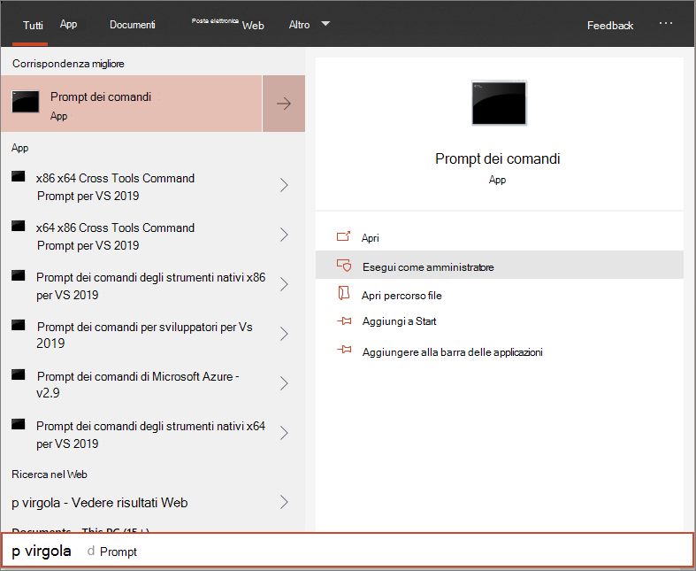

# <a name="onboard-the-windows-10-devices-using-a-local-script"></a><span data-ttu-id="e31d2-104">Eseguire l'onboard Windows 10 dispositivi usando uno script locale</span><span class="sxs-lookup"><span data-stu-id="e31d2-104">Onboard the Windows 10 devices using a local script</span></span>

[!INCLUDE [Microsoft 365 Defender rebranding](../../includes/microsoft-defender.md)]

- [<span data-ttu-id="e31d2-105">Microsoft 365 Defender</span><span class="sxs-lookup"><span data-stu-id="e31d2-105">Microsoft 365 Defender</span></span>](https://go.microsoft.com/fwlink/?linkid=2118804)


><span data-ttu-id="e31d2-106">Vuoi provare Defender per Endpoint?</span><span class="sxs-lookup"><span data-stu-id="e31d2-106">Want to experience Defender for Endpoint?</span></span> [<span data-ttu-id="e31d2-107">Iscriversi per una versione di valutazione gratuita.</span><span class="sxs-lookup"><span data-stu-id="e31d2-107">Sign up for a free trial.</span></span>](https://www.microsoft.com/microsoft-365/windows/microsoft-defender-atp?ocid=docs-wdatp-configureendpointsscript-abovefoldlink)

<span data-ttu-id="e31d2-108">Puoi anche eseguire manualmente l'onboard di singoli dispositivi in Defender for Endpoint.</span><span class="sxs-lookup"><span data-stu-id="e31d2-108">You can also manually onboard individual devices to Defender for Endpoint.</span></span> <span data-ttu-id="e31d2-109">È consigliabile eseguire questa operazione prima di testare il servizio prima di eseguire l'onboarding di tutti i dispositivi della rete.</span><span class="sxs-lookup"><span data-stu-id="e31d2-109">You might want to do this first when testing the service before you commit to onboarding all devices in your network.</span></span>

> [!IMPORTANT]
> <span data-ttu-id="e31d2-110">Questo script è stato ottimizzato per l'uso su un massimo di 10 dispositivi.</span><span class="sxs-lookup"><span data-stu-id="e31d2-110">This script has been optimized for use on up to 10 devices.</span></span>
>
> <span data-ttu-id="e31d2-111">Per eseguire la distribuzione su larga scala, [utilizzare altre opzioni di distribuzione.](configure-endpoints.md)</span><span class="sxs-lookup"><span data-stu-id="e31d2-111">To deploy at scale, use [other deployment options](configure-endpoints.md).</span></span> <span data-ttu-id="e31d2-112">Ad esempio, puoi distribuire uno script di onboarding in più di 10 dispositivi in produzione con lo script disponibile in Onboard Windows 10 dispositivi usando [Criteri di gruppo.](configure-endpoints-gp.md)</span><span class="sxs-lookup"><span data-stu-id="e31d2-112">For example, you can deploy an onboarding script to more than 10 devices in production with the script available in [Onboard Windows 10 devices using Group Policy](configure-endpoints-gp.md).</span></span>

## <a name="onboard-devices"></a><span data-ttu-id="e31d2-113">Eseguire l'onboarding dei dispositivi</span><span class="sxs-lookup"><span data-stu-id="e31d2-113">Onboard devices</span></span> 

<span data-ttu-id="e31d2-114">[](images/onboard-script.png#lightbox)</span><span class="sxs-lookup"><span data-stu-id="e31d2-114">[](images/onboard-script.png#lightbox)</span></span>


<span data-ttu-id="e31d2-115">Vedi il [PDF o](https://github.com/MicrosoftDocs/microsoft-365-docs/raw/public/microsoft-365/security/defender-endpoint/downloads/mdatp-deployment-strategy.pdf) il [Visio](https://github.com/MicrosoftDocs/microsoft-365-docs/raw/public/microsoft-365/security/defender-endpoint/downloads/mdatp-deployment-strategy.vsdx) per vedere i vari percorsi nella distribuzione di Defender per Endpoint.</span><span class="sxs-lookup"><span data-stu-id="e31d2-115">Check out the [PDF](https://github.com/MicrosoftDocs/microsoft-365-docs/raw/public/microsoft-365/security/defender-endpoint/downloads/mdatp-deployment-strategy.pdf)  or  [Visio](https://github.com/MicrosoftDocs/microsoft-365-docs/raw/public/microsoft-365/security/defender-endpoint/downloads/mdatp-deployment-strategy.vsdx) to see the various paths in deploying Defender for Endpoint.</span></span> 


1.  <span data-ttu-id="e31d2-116">Aprire il file del pacchetto .zip criteri di gruppo (*WindowsDefenderATPOnboardingPackage.zip*) scaricato dall'onboarding guidato del servizio.</span><span class="sxs-lookup"><span data-stu-id="e31d2-116">Open the GP configuration package .zip file (*WindowsDefenderATPOnboardingPackage.zip*) that you downloaded from the service onboarding wizard.</span></span> <span data-ttu-id="e31d2-117">Puoi anche ottenere il pacchetto da [Microsoft 365 Defender Portal:](https://security.microsoft.com/)</span><span class="sxs-lookup"><span data-stu-id="e31d2-117">You can also get the package from [Microsoft 365  Defender portal](https://security.microsoft.com/):</span></span>

    1. <span data-ttu-id="e31d2-118">Nel riquadro di spostamento seleziona **Impostazioni**  >    >    >  **Onboarding** gestione dispositivi degli endpoint.</span><span class="sxs-lookup"><span data-stu-id="e31d2-118">In the navigation pane, select **Settings** > **Endpoints** > **Device management** > **Onboarding**.</span></span>

    1. <span data-ttu-id="e31d2-119">Seleziona Windows 10 come sistema operativo.</span><span class="sxs-lookup"><span data-stu-id="e31d2-119">Select Windows 10 as the operating system.</span></span>

    1. <span data-ttu-id="e31d2-120">Nel campo **Metodo di** distribuzione selezionare **Script locale**.</span><span class="sxs-lookup"><span data-stu-id="e31d2-120">In the **Deployment method** field, select **Local Script**.</span></span>

    1. <span data-ttu-id="e31d2-121">Fai **clic su Scarica pacchetto** e salva il file .zip file.</span><span class="sxs-lookup"><span data-stu-id="e31d2-121">Click **Download package** and save the .zip file.</span></span>

  
2.  <span data-ttu-id="e31d2-122">Estrai il contenuto del pacchetto di configurazione in una posizione nel dispositivo che vuoi eseguire l'onboard(ad esempio, desktop).</span><span class="sxs-lookup"><span data-stu-id="e31d2-122">Extract the contents of the configuration package to a location on the device you want to onboard (for example, the Desktop).</span></span> <span data-ttu-id="e31d2-123">Dovresti avere un file denominato *WindowsDefenderATPLocalOnboardingScript.cmd.*</span><span class="sxs-lookup"><span data-stu-id="e31d2-123">You should have a file named *WindowsDefenderATPLocalOnboardingScript.cmd*.</span></span>

3.  <span data-ttu-id="e31d2-124">Apri un prompt della riga di comando con privilegi elevati nel dispositivo ed esegui lo script:</span><span class="sxs-lookup"><span data-stu-id="e31d2-124">Open an elevated command-line prompt on the device and run the script:</span></span>

    1.  <span data-ttu-id="e31d2-125">Passare a **Start** e digitare **cmd**.</span><span class="sxs-lookup"><span data-stu-id="e31d2-125">Go to **Start** and type **cmd**.</span></span>

    1.  <span data-ttu-id="e31d2-126">Fare clic con il pulsante destro del mouse su **Prompt dei comandi** e scegliere **Esegui come amministratore**.</span><span class="sxs-lookup"><span data-stu-id="e31d2-126">Right-click **Command prompt** and select **Run as administrator**.</span></span>

        

4.  <span data-ttu-id="e31d2-128">Digitare il percorso del file script.</span><span class="sxs-lookup"><span data-stu-id="e31d2-128">Type the location of the script file.</span></span> <span data-ttu-id="e31d2-129">Se il file è stato copiato sul desktop, digitare: *%userprofile%\Desktop\WindowsDefenderATPLocalOnboardingScript.cmd*</span><span class="sxs-lookup"><span data-stu-id="e31d2-129">If you copied the file to the desktop, type: *%userprofile%\Desktop\WindowsDefenderATPLocalOnboardingScript.cmd*</span></span>

5.  <span data-ttu-id="e31d2-130">Premere INVIO **o** fare clic su **OK.**</span><span class="sxs-lookup"><span data-stu-id="e31d2-130">Press the **Enter** key or click **OK**.</span></span>

<span data-ttu-id="e31d2-131">Per informazioni su come convalidare manualmente la conformità del dispositivo e la segnalazione corretta dei dati del sensore, vedi Risolvere i problemi di [onboarding](troubleshoot-onboarding.md)di Microsoft Defender for Endpoint.</span><span class="sxs-lookup"><span data-stu-id="e31d2-131">For information on how you can manually validate that the device is compliant and correctly reports sensor data see, [Troubleshoot Microsoft Defender for Endpoint onboarding issues](troubleshoot-onboarding.md).</span></span>


>[!TIP]
> <span data-ttu-id="e31d2-132">Dopo l'onboarding del dispositivo, puoi scegliere di eseguire un test di rilevamento per verificare che un dispositivo sia stato correttamente onboarding nel servizio.</span><span class="sxs-lookup"><span data-stu-id="e31d2-132">After onboarding the device, you can choose to run a detection test to verify that an device is properly onboarded to the service.</span></span> <span data-ttu-id="e31d2-133">Per altre informazioni, vedi Eseguire un test di rilevamento su un endpoint [di Microsoft Defender for Endpoint appena onboarded.](run-detection-test.md)</span><span class="sxs-lookup"><span data-stu-id="e31d2-133">For more information, see [Run a detection test on a newly onboarded Microsoft Defender for Endpoint endpoint](run-detection-test.md).</span></span>

## <a name="configure-sample-collection-settings"></a><span data-ttu-id="e31d2-134">Configurare le impostazioni della raccolta di esempio</span><span class="sxs-lookup"><span data-stu-id="e31d2-134">Configure sample collection settings</span></span>
<span data-ttu-id="e31d2-135">Per ogni dispositivo, puoi impostare un valore di configurazione per indicare se è possibile raccogliere campioni dal dispositivo quando viene effettuata una richiesta tramite Microsoft 365 Defender per inviare un file per l'analisi approfondita.</span><span class="sxs-lookup"><span data-stu-id="e31d2-135">For each device, you can set a configuration value to state whether samples can be collected from the device when a request is made through Microsoft 365 Defender to submit a file for deep analysis.</span></span>

<span data-ttu-id="e31d2-136">Puoi configurare manualmente l'impostazione di condivisione di esempio nel dispositivo usando *regedit* o creando ed eseguendo un file *REG.*</span><span class="sxs-lookup"><span data-stu-id="e31d2-136">You can manually configure the sample sharing setting on the device by using *regedit* or creating and running a *.reg* file.</span></span>  

<span data-ttu-id="e31d2-137">La configurazione viene impostata tramite la voce della chiave del Registro di sistema seguente:</span><span class="sxs-lookup"><span data-stu-id="e31d2-137">The configuration is set through the following registry key entry:</span></span>

```console
Path: “HKLM\SOFTWARE\Policies\Microsoft\Windows Advanced Threat Protection”
Name: "AllowSampleCollection"
Value: 0 or 1
```
<span data-ttu-id="e31d2-138">Dove:</span><span class="sxs-lookup"><span data-stu-id="e31d2-138">Where:</span></span><br>
<span data-ttu-id="e31d2-139">Il tipo di nome è D-WORD.</span><span class="sxs-lookup"><span data-stu-id="e31d2-139">Name type is a D-WORD.</span></span> <br>
<span data-ttu-id="e31d2-140">I valori possibili sono:</span><span class="sxs-lookup"><span data-stu-id="e31d2-140">Possible values are:</span></span>
- <span data-ttu-id="e31d2-141">0 - Non consente la condivisione di esempi da questo dispositivo</span><span class="sxs-lookup"><span data-stu-id="e31d2-141">0 - doesn't allow sample sharing  from this device</span></span>
- <span data-ttu-id="e31d2-142">1 - Consente la condivisione di tutti i tipi di file da questo dispositivo</span><span class="sxs-lookup"><span data-stu-id="e31d2-142">1 - allows sharing of all file types from this device</span></span>

<span data-ttu-id="e31d2-143">Il valore predefinito nel caso in cui la chiave del Registro di sistema non esista è 1.</span><span class="sxs-lookup"><span data-stu-id="e31d2-143">The default value in case the registry key doesn’t exist is 1.</span></span>


## <a name="offboard-devices-using-a-local-script"></a><span data-ttu-id="e31d2-144">Dispositivi offboard con uno script locale</span><span class="sxs-lookup"><span data-stu-id="e31d2-144">Offboard devices using a local script</span></span>
<span data-ttu-id="e31d2-145">Per motivi di sicurezza, il pacchetto usato per i dispositivi offboard scadrà 30 giorni dopo la data di download.</span><span class="sxs-lookup"><span data-stu-id="e31d2-145">For security reasons, the package used to Offboard devices will expire 30 days after the date it was downloaded.</span></span> <span data-ttu-id="e31d2-146">I pacchetti di offboarding scaduti inviati a un dispositivo verranno rifiutati.</span><span class="sxs-lookup"><span data-stu-id="e31d2-146">Expired offboarding packages sent to an device will be rejected.</span></span> <span data-ttu-id="e31d2-147">Durante il download di un pacchetto di offboarding, ti verrà notificata la data di scadenza dei pacchetti e verrà incluso anche nel nome del pacchetto.</span><span class="sxs-lookup"><span data-stu-id="e31d2-147">When downloading an offboarding package you will be notified of the packages expiry date and it will also be included in the package name.</span></span>

> [!NOTE]
> <span data-ttu-id="e31d2-148">I criteri di onboarding e offboarding non devono essere distribuiti nello stesso dispositivo contemporaneamente, altrimenti ciò causerà collisioni imprevedibili.</span><span class="sxs-lookup"><span data-stu-id="e31d2-148">Onboarding and offboarding policies must not be deployed on the same device at the same time, otherwise this will cause unpredictable collisions.</span></span>

1. <span data-ttu-id="e31d2-149">Ottenere il pacchetto di offboarding [da Microsoft 365 Defender portale:](https://security.microsoft.com/)</span><span class="sxs-lookup"><span data-stu-id="e31d2-149">Get the offboarding package from [Microsoft 365 Defender portal](https://security.microsoft.com/):</span></span>

    1. <span data-ttu-id="e31d2-150">Nel riquadro di spostamento seleziona **Impostazioni**  >    >    > **Offboarding** gestione dispositivi endpoint.</span><span class="sxs-lookup"><span data-stu-id="e31d2-150">In the navigation pane, select **Settings** > **Endpoints** > **Device management** >**Offboarding**.</span></span>

    1. <span data-ttu-id="e31d2-151">Seleziona Windows 10 come sistema operativo.</span><span class="sxs-lookup"><span data-stu-id="e31d2-151">Select Windows 10 as the operating system.</span></span>

    1. <span data-ttu-id="e31d2-152">Nel campo **Metodo di** distribuzione selezionare **Script locale**.</span><span class="sxs-lookup"><span data-stu-id="e31d2-152">In the **Deployment method** field, select **Local Script**.</span></span>

    1. <span data-ttu-id="e31d2-153">Fai **clic su Scarica pacchetto** e salva il file .zip file.</span><span class="sxs-lookup"><span data-stu-id="e31d2-153">Click **Download package** and save the .zip file.</span></span>

2. <span data-ttu-id="e31d2-154">Estrarre il contenuto del file .zip in un percorso condiviso di sola lettura accessibile dai dispositivi.</span><span class="sxs-lookup"><span data-stu-id="e31d2-154">Extract the contents of the .zip file to a shared, read-only location that can be accessed by the devices.</span></span> <span data-ttu-id="e31d2-155">Dovresti avere un file denominato *WindowsDefenderATPOffboardingScript_valid_until_YYYY-MM-DD.cmd*.</span><span class="sxs-lookup"><span data-stu-id="e31d2-155">You should have a file named *WindowsDefenderATPOffboardingScript_valid_until_YYYY-MM-DD.cmd*.</span></span>

3.  <span data-ttu-id="e31d2-156">Apri un prompt della riga di comando con privilegi elevati nel dispositivo ed esegui lo script:</span><span class="sxs-lookup"><span data-stu-id="e31d2-156">Open an elevated command-line prompt on the device and run the script:</span></span>

    1.  <span data-ttu-id="e31d2-157">Passare a **Start** e digitare **cmd**.</span><span class="sxs-lookup"><span data-stu-id="e31d2-157">Go to **Start** and type **cmd**.</span></span>

    1.  <span data-ttu-id="e31d2-158">Fare clic con il pulsante destro del mouse su **Prompt dei comandi** e scegliere **Esegui come amministratore**.</span><span class="sxs-lookup"><span data-stu-id="e31d2-158">Right-click **Command prompt** and select **Run as administrator**.</span></span>

        

4.  <span data-ttu-id="e31d2-160">Digitare il percorso del file script.</span><span class="sxs-lookup"><span data-stu-id="e31d2-160">Type the location of the script file.</span></span> <span data-ttu-id="e31d2-161">Se il file è stato copiato sul desktop, digitare: *%userprofile%\Desktop\WindowsDefenderATPOffboardingScript_valid_until_YYYY-MM-DD.cmd*</span><span class="sxs-lookup"><span data-stu-id="e31d2-161">If you copied the file to the desktop, type: *%userprofile%\Desktop\WindowsDefenderATPOffboardingScript_valid_until_YYYY-MM-DD.cmd*</span></span>

5.  <span data-ttu-id="e31d2-162">Premere INVIO **o** fare clic su **OK.**</span><span class="sxs-lookup"><span data-stu-id="e31d2-162">Press the **Enter** key or click **OK**.</span></span>

> [!IMPORTANT]
> <span data-ttu-id="e31d2-163">L'offboarding fa sì che il dispositivo interrompi l'invio dei dati del sensore al portale, ma i dati dal dispositivo, incluso il riferimento a eventuali avvisi che ha avuto, verranno conservati per un massimo di 6 mesi.</span><span class="sxs-lookup"><span data-stu-id="e31d2-163">Offboarding causes the device to stop sending sensor data to the portal but data from the device, including reference to any alerts it has had will be retained for up to 6 months.</span></span>


## <a name="monitor-device-configuration"></a><span data-ttu-id="e31d2-164">Monitorare la configurazione del dispositivo</span><span class="sxs-lookup"><span data-stu-id="e31d2-164">Monitor device configuration</span></span>
<span data-ttu-id="e31d2-165">È possibile seguire i diversi passaggi di verifica descritti in Risolvere i problemi di [onboarding](troubleshoot-onboarding.md) per verificare che lo script sia stato completato correttamente e che l'agente sia in esecuzione.</span><span class="sxs-lookup"><span data-stu-id="e31d2-165">You can follow the different verification steps in the [Troubleshoot onboarding issues](troubleshoot-onboarding.md) to verify that the script completed successfully and the agent is running.</span></span>

<span data-ttu-id="e31d2-166">Il monitoraggio può essere eseguito anche direttamente nel portale o utilizzando i diversi strumenti di distribuzione.</span><span class="sxs-lookup"><span data-stu-id="e31d2-166">Monitoring can also be done directly on the portal, or by using the different deployment tools.</span></span>

### <a name="monitor-devices-using-the-portal"></a><span data-ttu-id="e31d2-167">Monitorare i dispositivi tramite il portale</span><span class="sxs-lookup"><span data-stu-id="e31d2-167">Monitor devices using the portal</span></span>
1. <span data-ttu-id="e31d2-168">Passare a Microsoft 365 Defender portale.</span><span class="sxs-lookup"><span data-stu-id="e31d2-168">Go to Microsoft 365 Defender portal.</span></span>

2. <span data-ttu-id="e31d2-169">Fare clic **su Inventario dispositivi**.</span><span class="sxs-lookup"><span data-stu-id="e31d2-169">Click **Devices inventory**.</span></span>

3. <span data-ttu-id="e31d2-170">Verificare che i dispositivi siano visualizzati.</span><span class="sxs-lookup"><span data-stu-id="e31d2-170">Verify that devices are appearing.</span></span>


## <a name="related-topics"></a><span data-ttu-id="e31d2-171">Argomenti correlati</span><span class="sxs-lookup"><span data-stu-id="e31d2-171">Related topics</span></span>
- [<span data-ttu-id="e31d2-172">Onboardare Windows 10 dispositivi con Criteri di gruppo</span><span class="sxs-lookup"><span data-stu-id="e31d2-172">Onboard Windows 10 devices using Group Policy</span></span>](configure-endpoints-gp.md)
- [<span data-ttu-id="e31d2-173">Onboard Windows 10 dispositivi con Microsoft Endpoint Configuration Manager</span><span class="sxs-lookup"><span data-stu-id="e31d2-173">Onboard Windows 10 devices using Microsoft Endpoint Configuration Manager</span></span>](configure-endpoints-sccm.md)
- [<span data-ttu-id="e31d2-174">Onboarding di dispositivi Windows 10 con gli strumenti di Gestione dispositivi mobili</span><span class="sxs-lookup"><span data-stu-id="e31d2-174">Onboard Windows 10 devices using Mobile Device Management tools</span></span>](configure-endpoints-mdm.md)
- [<span data-ttu-id="e31d2-175">Aggiungere dispositivi VDI (Virtual Desktop Infrastructure) non persistenti</span><span class="sxs-lookup"><span data-stu-id="e31d2-175">Onboard non-persistent virtual desktop infrastructure (VDI) devices</span></span>](configure-endpoints-vdi.md)
- [<span data-ttu-id="e31d2-176">Eseguire un test di rilevamento in un dispositivo Microsoft Defender for Endpoint appena onboarded</span><span class="sxs-lookup"><span data-stu-id="e31d2-176">Run a detection test on a newly onboarded Microsoft Defender for Endpoint device</span></span>](run-detection-test.md)
- [<span data-ttu-id="e31d2-177">Risolvere i problemi di onboarding di Microsoft Defender per endpoint</span><span class="sxs-lookup"><span data-stu-id="e31d2-177">Troubleshoot Microsoft Defender for Endpoint onboarding issues</span></span>](troubleshoot-onboarding.md)
