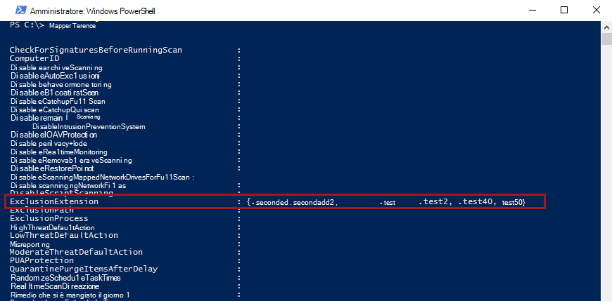
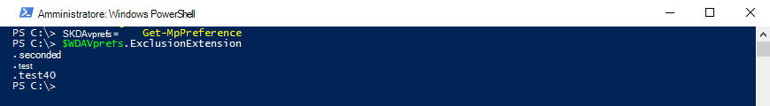

# <a name="configure-and-validate-exclusions-based-on-file-extension-and-folder-location"></a><span data-ttu-id="ce6f4-104">Configurare e convalidare le esclusioni in base all'estensione di file e al percorso della cartella</span><span class="sxs-lookup"><span data-stu-id="ce6f4-104">Configure and validate exclusions based on file extension and folder location</span></span>

[!INCLUDE [Microsoft 365 Defender rebranding](../../includes/microsoft-defender.md)]


<span data-ttu-id="ce6f4-105">**Si applica a:**</span><span class="sxs-lookup"><span data-stu-id="ce6f4-105">**Applies to:**</span></span>

- [<span data-ttu-id="ce6f4-106">Microsoft Defender per endpoint</span><span class="sxs-lookup"><span data-stu-id="ce6f4-106">Microsoft Defender for Endpoint</span></span>](/microsoft-365/security/defender-endpoint/)

> [!IMPORTANT]
> <span data-ttu-id="ce6f4-107">Le esclusioni di Microsoft Defender Antivirus non si applicano ad altre funzionalità di Microsoft Defender for Endpoint, tra cui il rilevamento e la risposta degli [endpoint (EDR),](/microsoft-365/security/defender-endpoint/overview-endpoint-detection-response)le regole di riduzione della superficie di attacco [(ASR)](/microsoft-365/security/defender-endpoint/attack-surface-reduction)e l'accesso controllato [alle cartelle.](/microsoft-365/security/defender-endpoint/controlled-folders)</span><span class="sxs-lookup"><span data-stu-id="ce6f4-107">Microsoft Defender Antivirus exclusions don't apply to other Microsoft Defender for Endpoint capabilities, including [endpoint detection and response (EDR)](/microsoft-365/security/defender-endpoint/overview-endpoint-detection-response), [attack surface reduction (ASR) rules](/microsoft-365/security/defender-endpoint/attack-surface-reduction), and [controlled folder access](/microsoft-365/security/defender-endpoint/controlled-folders).</span></span> <span data-ttu-id="ce6f4-108">I file esclusi utilizzando i metodi descritti in questo articolo possono comunque attivare avvisi EDR e altri rilevamenti.</span><span class="sxs-lookup"><span data-stu-id="ce6f4-108">Files that you exclude using the methods described in this article can still trigger EDR alerts and other detections.</span></span> <span data-ttu-id="ce6f4-109">Per escludere i file in modo generale, aggiungerli agli indicatori personalizzati di Microsoft Defender for [Endpoint.](/microsoft-365/security/defender-endpoint/manage-indicators)</span><span class="sxs-lookup"><span data-stu-id="ce6f4-109">To exclude files broadly, add them to the Microsoft Defender for Endpoint [custom indicators](/microsoft-365/security/defender-endpoint/manage-indicators).</span></span>

## <a name="exclusion-lists"></a><span data-ttu-id="ce6f4-110">Elenchi di esclusione</span><span class="sxs-lookup"><span data-stu-id="ce6f4-110">Exclusion lists</span></span>

<span data-ttu-id="ce6f4-111">Puoi escludere determinati file dalle analisi di Microsoft Defender Antivirus modificando gli elenchi di esclusione.</span><span class="sxs-lookup"><span data-stu-id="ce6f4-111">You can exclude certain files from Microsoft Defender Antivirus scans by modifying exclusion lists.</span></span> <span data-ttu-id="ce6f4-112">**In genere, non è necessario applicare esclusioni**.</span><span class="sxs-lookup"><span data-stu-id="ce6f4-112">**Generally, you shouldn't need to apply exclusions**.</span></span> <span data-ttu-id="ce6f4-113">Microsoft Defender Antivirus include molte esclusioni automatiche basate su comportamenti noti del sistema operativo e file di gestione tipici, ad esempio quelli utilizzati nella gestione aziendale, nella gestione dei database e in altri scenari e situazioni aziendali.</span><span class="sxs-lookup"><span data-stu-id="ce6f4-113">Microsoft Defender Antivirus includes many automatic exclusions based on known operating system behaviors and typical management files, such as those used in enterprise management, database management, and other enterprise scenarios and situations.</span></span>

> [!NOTE]
> <span data-ttu-id="ce6f4-114">Le esclusioni si applicano anche ai rilevamenti di app potenzialmente indesiderate.</span><span class="sxs-lookup"><span data-stu-id="ce6f4-114">Exclusions apply to Potentially Unwanted Apps (PUA) detections as well.</span></span>

> [!NOTE]
> <span data-ttu-id="ce6f4-115">Le esclusioni automatiche si applicano solo a Windows Server 2016 e versione precedente.</span><span class="sxs-lookup"><span data-stu-id="ce6f4-115">Automatic exclusions apply only to Windows Server 2016 and above.</span></span> <span data-ttu-id="ce6f4-116">Queste esclusioni non sono visibili nell'app Sicurezza di Windows e in PowerShell.</span><span class="sxs-lookup"><span data-stu-id="ce6f4-116">These exclusions are not visible in the Windows Security app and in PowerShell.</span></span>

<span data-ttu-id="ce6f4-117">In questo articolo viene descritto come configurare gli elenchi di esclusione per i file e le cartelle.</span><span class="sxs-lookup"><span data-stu-id="ce6f4-117">This article  describes how to configure exclusion lists for the files and folders.</span></span> <span data-ttu-id="ce6f4-118">Vedere [Suggerimenti per la definizione delle esclusioni](configure-exclusions-microsoft-defender-antivirus.md#recommendations-for-defining-exclusions) prima di definire gli elenchi di esclusione.</span><span class="sxs-lookup"><span data-stu-id="ce6f4-118">See [Recommendations for defining exclusions](configure-exclusions-microsoft-defender-antivirus.md#recommendations-for-defining-exclusions) before defining your exclusion lists.</span></span>

| <span data-ttu-id="ce6f4-119">Esclusione</span><span class="sxs-lookup"><span data-stu-id="ce6f4-119">Exclusion</span></span> | <span data-ttu-id="ce6f4-120">Esempi</span><span class="sxs-lookup"><span data-stu-id="ce6f4-120">Examples</span></span> | <span data-ttu-id="ce6f4-121">Elenco di esclusione</span><span class="sxs-lookup"><span data-stu-id="ce6f4-121">Exclusion list</span></span> |
|:---|:---|:---|
|<span data-ttu-id="ce6f4-122">Qualsiasi file con un'estensione specifica</span><span class="sxs-lookup"><span data-stu-id="ce6f4-122">Any file with a specific extension</span></span> | <span data-ttu-id="ce6f4-123">Tutti i file con l'estensione specificata, in qualsiasi punto del computer.</span><span class="sxs-lookup"><span data-stu-id="ce6f4-123">All files with the specified extension, anywhere on the machine.</span></span> <p> <span data-ttu-id="ce6f4-124">Sintassi valida: `.test` e `test`</span><span class="sxs-lookup"><span data-stu-id="ce6f4-124">Valid syntax: `.test` and `test`</span></span>  | <span data-ttu-id="ce6f4-125">Esclusioni di estensione</span><span class="sxs-lookup"><span data-stu-id="ce6f4-125">Extension exclusions</span></span> |
|<span data-ttu-id="ce6f4-126">Qualsiasi file in una cartella specifica</span><span class="sxs-lookup"><span data-stu-id="ce6f4-126">Any file under a specific folder</span></span> | <span data-ttu-id="ce6f4-127">Tutti i file nella `c:\test\sample` cartella</span><span class="sxs-lookup"><span data-stu-id="ce6f4-127">All files under the `c:\test\sample` folder</span></span> | <span data-ttu-id="ce6f4-128">Esclusioni di file e cartelle</span><span class="sxs-lookup"><span data-stu-id="ce6f4-128">File and folder exclusions</span></span> |
| <span data-ttu-id="ce6f4-129">Un file specifico in una cartella specifica</span><span class="sxs-lookup"><span data-stu-id="ce6f4-129">A specific file in a specific folder</span></span> | <span data-ttu-id="ce6f4-130">Solo `c:\sample\sample.test` il file</span><span class="sxs-lookup"><span data-stu-id="ce6f4-130">The file `c:\sample\sample.test` only</span></span> | <span data-ttu-id="ce6f4-131">Esclusioni di file e cartelle</span><span class="sxs-lookup"><span data-stu-id="ce6f4-131">File and folder exclusions</span></span> |
| <span data-ttu-id="ce6f4-132">Un processo specifico</span><span class="sxs-lookup"><span data-stu-id="ce6f4-132">A specific process</span></span> | <span data-ttu-id="ce6f4-133">Il file eseguibile `c:\test\process.exe`</span><span class="sxs-lookup"><span data-stu-id="ce6f4-133">The executable file `c:\test\process.exe`</span></span> | <span data-ttu-id="ce6f4-134">Esclusioni di file e cartelle</span><span class="sxs-lookup"><span data-stu-id="ce6f4-134">File and folder exclusions</span></span> |

<span data-ttu-id="ce6f4-135">Gli elenchi di esclusione hanno le caratteristiche seguenti:</span><span class="sxs-lookup"><span data-stu-id="ce6f4-135">Exclusion lists have the following characteristics:</span></span>

- <span data-ttu-id="ce6f4-136">Le esclusioni di cartelle si applicano a tutti i file e le cartelle in tale cartella, a meno che la sottocartella non sia un reparse point.</span><span class="sxs-lookup"><span data-stu-id="ce6f4-136">Folder exclusions apply to all files and folders under that folder, unless the subfolder is a reparse point.</span></span> <span data-ttu-id="ce6f4-137">Le sottocartelle dei reparse point devono essere escluse separatamente.</span><span class="sxs-lookup"><span data-stu-id="ce6f4-137">Reparse point subfolders must be excluded separately.</span></span>
- <span data-ttu-id="ce6f4-138">Le estensioni di file si applicano a qualsiasi nome di file con l'estensione definita se non è definito un percorso o una cartella.</span><span class="sxs-lookup"><span data-stu-id="ce6f4-138">File extensions apply to any file name with the defined extension if a path or folder is not defined.</span></span>

> [!IMPORTANT]
> - <span data-ttu-id="ce6f4-139">L'utilizzo di caratteri jolly come l'asterisco ( \* ) modificherà la modalità di interpretazione delle regole di esclusione.</span><span class="sxs-lookup"><span data-stu-id="ce6f4-139">Using wildcards such as the asterisk (\*) will alter how the exclusion rules are interpreted.</span></span> <span data-ttu-id="ce6f4-140">Per informazioni importanti sul funzionamento dei caratteri jolly, vedere la sezione Use [wildcards in the file name and folder path or extension exclusion lists.](#use-wildcards-in-the-file-name-and-folder-path-or-extension-exclusion-lists)</span><span class="sxs-lookup"><span data-stu-id="ce6f4-140">See the [Use wildcards in the file name and folder path or extension exclusion lists](#use-wildcards-in-the-file-name-and-folder-path-or-extension-exclusion-lists) section for important information about how wildcards work.</span></span>
> - <span data-ttu-id="ce6f4-141">Non è possibile escludere le unità di rete mappate.</span><span class="sxs-lookup"><span data-stu-id="ce6f4-141">You cannot exclude mapped network drives.</span></span> <span data-ttu-id="ce6f4-142">È necessario specificare il percorso di rete effettivo.</span><span class="sxs-lookup"><span data-stu-id="ce6f4-142">You must specify the actual network path.</span></span>
> - <span data-ttu-id="ce6f4-143">Le cartelle che sono reparse point create dopo l'avvio del servizio Microsoft Defender Antivirus e che sono state aggiunte all'elenco di esclusione non verranno incluse.</span><span class="sxs-lookup"><span data-stu-id="ce6f4-143">Folders that are reparse points that are created after the Microsoft Defender Antivirus service starts and that have been added to the exclusion list will not be included.</span></span> <span data-ttu-id="ce6f4-144">Devi riavviare il servizio (riavviando Windows) perché i nuovi reparse point siano riconosciuti come destinazione di esclusione valida.</span><span class="sxs-lookup"><span data-stu-id="ce6f4-144">You must restart the service (by restarting Windows) for new reparse points to be recognized as a valid exclusion target.</span></span>

<span data-ttu-id="ce6f4-145">Per escludere i file aperti da un processo specifico, vedere [Configure and validate exclusions for files opened by processes](configure-process-opened-file-exclusions-microsoft-defender-antivirus.md).</span><span class="sxs-lookup"><span data-stu-id="ce6f4-145">To exclude files opened by a specific process, see [Configure and validate exclusions for files opened by processes](configure-process-opened-file-exclusions-microsoft-defender-antivirus.md).</span></span>

<span data-ttu-id="ce6f4-146">Le esclusioni si applicano [alle analisi pianificate,](scheduled-catch-up-scans-microsoft-defender-antivirus.md) [alle analisi su richiesta](run-scan-microsoft-defender-antivirus.md)e alla protezione in tempo [reale.](configure-real-time-protection-microsoft-defender-antivirus.md)</span><span class="sxs-lookup"><span data-stu-id="ce6f4-146">The exclusions apply to [scheduled scans](scheduled-catch-up-scans-microsoft-defender-antivirus.md), [on-demand scans](run-scan-microsoft-defender-antivirus.md), and [real-time protection](configure-real-time-protection-microsoft-defender-antivirus.md).</span></span>

> [!IMPORTANT]
> <span data-ttu-id="ce6f4-147">Le modifiche apportate all'elenco di esclusione con Criteri di **gruppo** verranno mostrate negli elenchi nell'app [Sicurezza di Windows.](microsoft-defender-security-center-antivirus.md)</span><span class="sxs-lookup"><span data-stu-id="ce6f4-147">Exclusion list changes made with Group Policy **will show** in the lists in the [Windows Security app](microsoft-defender-security-center-antivirus.md).</span></span>
> <span data-ttu-id="ce6f4-148">Le modifiche apportate nell'app Sicurezza di Windows **non verranno mostrate** negli elenchi di Criteri di gruppo.</span><span class="sxs-lookup"><span data-stu-id="ce6f4-148">Changes made in the Windows Security app **will not show** in the Group Policy lists.</span></span>

<span data-ttu-id="ce6f4-149">By default, local changes made to the lists (by users with administrator privileges, including changes made with PowerShell and WMI) will be merged with the lists as defined (and deployed) by Group Policy, Configuration Manager, or Intune.</span><span class="sxs-lookup"><span data-stu-id="ce6f4-149">By default, local changes made to the lists (by users with administrator privileges, including changes made with PowerShell and WMI) will be merged with the lists as defined (and deployed) by Group Policy, Configuration Manager, or Intune.</span></span> <span data-ttu-id="ce6f4-150">Gli elenchi di Criteri di gruppo hanno la precedenza in caso di conflitti.</span><span class="sxs-lookup"><span data-stu-id="ce6f4-150">The Group Policy lists take precedence when there are conflicts.</span></span>

<span data-ttu-id="ce6f4-151">È possibile [configurare la modalità di unione degli](configure-local-policy-overrides-microsoft-defender-antivirus.md#merge-lists) elenchi di esclusioni definite localmente e globalmente per consentire alle modifiche locali di ignorare le impostazioni di distribuzione gestite.</span><span class="sxs-lookup"><span data-stu-id="ce6f4-151">You can [configure how locally and globally defined exclusions lists are merged](configure-local-policy-overrides-microsoft-defender-antivirus.md#merge-lists) to allow local changes to override managed deployment settings.</span></span>

## <a name="configure-the-list-of-exclusions-based-on-folder-name-or-file-extension"></a><span data-ttu-id="ce6f4-152">Configurare l'elenco di esclusioni in base al nome della cartella o all'estensione di file</span><span class="sxs-lookup"><span data-stu-id="ce6f4-152">Configure the list of exclusions based on folder name or file extension</span></span>

### <a name="use-intune-to-configure-file-name-folder-or-file-extension-exclusions"></a><span data-ttu-id="ce6f4-153">Usare Intune per configurare le esclusioni di nome file, cartella o estensione di file</span><span class="sxs-lookup"><span data-stu-id="ce6f4-153">Use Intune to configure file name, folder, or file extension exclusions</span></span>

<span data-ttu-id="ce6f4-154">Fare inoltre riferimento ai seguenti articoli:</span><span class="sxs-lookup"><span data-stu-id="ce6f4-154">See the following articles:</span></span>
- [<span data-ttu-id="ce6f4-155">Configurare le impostazioni di restrizione dei dispositivi in Microsoft Intune</span><span class="sxs-lookup"><span data-stu-id="ce6f4-155">Configure device restriction settings in Microsoft Intune</span></span>](/intune/device-restrictions-configure)
- [<span data-ttu-id="ce6f4-156">Impostazioni di restrizione del dispositivo Microsoft Defender Antivirus per Windows 10 in Intune</span><span class="sxs-lookup"><span data-stu-id="ce6f4-156">Microsoft Defender Antivirus device restriction settings for Windows 10 in Intune</span></span>](/intune/device-restrictions-windows-10#microsoft-defender-antivirus)

### <a name="use-configuration-manager-to-configure-file-name-folder-or-file-extension-exclusions"></a><span data-ttu-id="ce6f4-157">Usare Configuration Manager per configurare le esclusioni di file, cartelle o estensioni di file</span><span class="sxs-lookup"><span data-stu-id="ce6f4-157">Use Configuration Manager to configure file name, folder, or file extension exclusions</span></span>

<span data-ttu-id="ce6f4-158">Vedi [Come creare e distribuire criteri antimalware: impostazioni](/configmgr/protect/deploy-use/endpoint-antimalware-policies#exclusion-settings) di esclusione per informazioni dettagliate sulla configurazione di Microsoft Endpoint Manager (current branch).</span><span class="sxs-lookup"><span data-stu-id="ce6f4-158">See [How to create and deploy antimalware policies: Exclusion settings](/configmgr/protect/deploy-use/endpoint-antimalware-policies#exclusion-settings) for details on configuring Microsoft Endpoint Manager (current branch).</span></span>

### <a name="use-group-policy-to-configure-folder-or-file-extension-exclusions"></a><span data-ttu-id="ce6f4-159">Utilizzare Criteri di gruppo per configurare le esclusioni di cartelle o estensioni di file</span><span class="sxs-lookup"><span data-stu-id="ce6f4-159">Use Group Policy to configure folder or file extension exclusions</span></span>

>[!NOTE]
><span data-ttu-id="ce6f4-160">Se si specifica un percorso completo di un file, viene escluso solo tale file.</span><span class="sxs-lookup"><span data-stu-id="ce6f4-160">If you specify a fully qualified path to a file, then only that file is excluded.</span></span> <span data-ttu-id="ce6f4-161">Se nell'esclusione è definita una cartella, vengono esclusi tutti i file e le sottodirectory in tale cartella.</span><span class="sxs-lookup"><span data-stu-id="ce6f4-161">If a folder is defined in the exclusion, then all files and subdirectories under that folder are excluded.</span></span>

1. <span data-ttu-id="ce6f4-162">Nel computer di gestione di Criteri di gruppo, aprire console Gestione Criteri di [gruppo,](/previous-versions/windows/it-pro/windows-server-2008-R2-and-2008/cc731212(v=ws.11))fare clic con il pulsante destro del mouse sull'oggetto Criteri di gruppo che si desidera configurare e scegliere **Modifica**.</span><span class="sxs-lookup"><span data-stu-id="ce6f4-162">On your Group Policy management computer, open the [Group Policy Management Console](/previous-versions/windows/it-pro/windows-server-2008-R2-and-2008/cc731212(v=ws.11)), right-click the Group Policy Object you want to configure and click **Edit**.</span></span>

2. <span data-ttu-id="ce6f4-163">**Nell'Editor Gestione Criteri di gruppo** passare a Configurazione **computer** e selezionare **Modelli amministrativi.**</span><span class="sxs-lookup"><span data-stu-id="ce6f4-163">In the **Group Policy Management Editor** go to **Computer configuration** and select **Administrative templates**.</span></span>

3. <span data-ttu-id="ce6f4-164">Espandere l'albero fino **ai componenti di Windows**  >  **Esclusioni di Microsoft Defender Antivirus**  >  .</span><span class="sxs-lookup"><span data-stu-id="ce6f4-164">Expand the tree to **Windows components** > **Microsoft Defender Antivirus** > **Exclusions**.</span></span>

4. <span data-ttu-id="ce6f4-165">Apri **l'impostazione Esclusioni percorso** per la modifica e aggiungi le esclusioni.</span><span class="sxs-lookup"><span data-stu-id="ce6f4-165">Open the **Path Exclusions** setting for editing, and add your exclusions.</span></span>

    1. <span data-ttu-id="ce6f4-166">Impostare l'opzione su **Abilitato**.</span><span class="sxs-lookup"><span data-stu-id="ce6f4-166">Set the option to **Enabled**.</span></span>
    1. <span data-ttu-id="ce6f4-167">Nella sezione **Opzioni** fare clic su **Mostra**.</span><span class="sxs-lookup"><span data-stu-id="ce6f4-167">Under the **Options** section, click **Show**.</span></span>
    1. <span data-ttu-id="ce6f4-168">Specificare ogni cartella sulla propria riga nella **colonna Nome** valore.</span><span class="sxs-lookup"><span data-stu-id="ce6f4-168">Specify each folder on its own line under the **Value name** column.</span></span>
    1. <span data-ttu-id="ce6f4-169">Se si specifica un file, assicurarsi di immettere un percorso completo del file, inclusi la lettera di unità, il percorso della cartella, il nome del file e l'estensione.</span><span class="sxs-lookup"><span data-stu-id="ce6f4-169">If you are specifying a file, ensure that you enter a fully qualified path to the file, including the drive letter, folder path, file name, and extension.</span></span> <span data-ttu-id="ce6f4-170">Immettere **0** nella **colonna** Valore.</span><span class="sxs-lookup"><span data-stu-id="ce6f4-170">Enter **0** in the **Value** column.</span></span>

5. <span data-ttu-id="ce6f4-171">Scegliere **OK**.</span><span class="sxs-lookup"><span data-stu-id="ce6f4-171">Choose **OK**.</span></span>

6. <span data-ttu-id="ce6f4-172">Apri **l'impostazione Esclusioni estensioni** per la modifica e aggiungi le esclusioni.</span><span class="sxs-lookup"><span data-stu-id="ce6f4-172">Open the **Extension Exclusions** setting for editing and add your exclusions.</span></span>

    1. <span data-ttu-id="ce6f4-173">Impostare l'opzione su **Abilitato**.</span><span class="sxs-lookup"><span data-stu-id="ce6f4-173">Set the option to **Enabled**.</span></span>
    1. <span data-ttu-id="ce6f4-174">Nella sezione **Opzioni** selezionare **Mostra**.</span><span class="sxs-lookup"><span data-stu-id="ce6f4-174">Under the **Options** section, select **Show**.</span></span>
    1. <span data-ttu-id="ce6f4-175">Immettere ogni estensione di file nella propria riga nella **colonna Nome** valore.</span><span class="sxs-lookup"><span data-stu-id="ce6f4-175">Enter each file extension on its own line under the **Value name** column.</span></span>  <span data-ttu-id="ce6f4-176">Immettere **0** nella **colonna** Valore.</span><span class="sxs-lookup"><span data-stu-id="ce6f4-176">Enter **0** in the **Value** column.</span></span>

7. <span data-ttu-id="ce6f4-177">Scegliere **OK**.</span><span class="sxs-lookup"><span data-stu-id="ce6f4-177">Choose **OK**.</span></span>

<a id="ps"></a>

### <a name="use-powershell-cmdlets-to-configure-file-name-folder-or-file-extension-exclusions"></a><span data-ttu-id="ce6f4-178">Utilizzare i cmdlet di PowerShell per configurare le esclusioni di file, cartelle o estensioni di file</span><span class="sxs-lookup"><span data-stu-id="ce6f4-178">Use PowerShell cmdlets to configure file name, folder, or file extension exclusions</span></span>

<span data-ttu-id="ce6f4-179">L'utilizzo di PowerShell per aggiungere o rimuovere esclusioni per i file in base all'estensione, al percorso o al nome di file richiede l'utilizzo di una combinazione di tre cmdlet e del parametro dell'elenco di esclusione appropriato.</span><span class="sxs-lookup"><span data-stu-id="ce6f4-179">Using PowerShell to add or remove exclusions for files based on the extension, location, or file name requires using a combination of three cmdlets and the appropriate exclusion list parameter.</span></span> <span data-ttu-id="ce6f4-180">I cmdlet sono tutti nel [modulo Defender](/powershell/module/defender/).</span><span class="sxs-lookup"><span data-stu-id="ce6f4-180">The cmdlets are all in the [Defender module](/powershell/module/defender/).</span></span>

<span data-ttu-id="ce6f4-181">Il formato dei cmdlet è il seguente:</span><span class="sxs-lookup"><span data-stu-id="ce6f4-181">The format for the cmdlets is as follows:</span></span>

```PowerShell
<cmdlet> -<exclusion list> "<item>"
```

<span data-ttu-id="ce6f4-182">Gli elementi seguenti sono consentiti come `<cmdlet>` :</span><span class="sxs-lookup"><span data-stu-id="ce6f4-182">The following are allowed as the `<cmdlet>`:</span></span>

| <span data-ttu-id="ce6f4-183">Azione di configurazione</span><span class="sxs-lookup"><span data-stu-id="ce6f4-183">Configuration action</span></span> | <span data-ttu-id="ce6f4-184">Cmdlet di PowerShell</span><span class="sxs-lookup"><span data-stu-id="ce6f4-184">PowerShell cmdlet</span></span> |
|:---|:---|
|<span data-ttu-id="ce6f4-185">Creare o sovrascrivere l'elenco</span><span class="sxs-lookup"><span data-stu-id="ce6f4-185">Create or overwrite the list</span></span> | `Set-MpPreference` |
|<span data-ttu-id="ce6f4-186">Aggiungi all'elenco</span><span class="sxs-lookup"><span data-stu-id="ce6f4-186">Add to the list</span></span> | `Add-MpPreference` |
|<span data-ttu-id="ce6f4-187">Rimuovere un elemento dall'elenco</span><span class="sxs-lookup"><span data-stu-id="ce6f4-187">Remove item from the list</span></span> | `Remove-MpPreference` |

<span data-ttu-id="ce6f4-188">Gli elementi seguenti sono consentiti come `<exclusion list>` :</span><span class="sxs-lookup"><span data-stu-id="ce6f4-188">The following are allowed as the `<exclusion list>`:</span></span>

| <span data-ttu-id="ce6f4-189">Tipo di esclusione</span><span class="sxs-lookup"><span data-stu-id="ce6f4-189">Exclusion type</span></span> | <span data-ttu-id="ce6f4-190">Parametro di PowerShell</span><span class="sxs-lookup"><span data-stu-id="ce6f4-190">PowerShell parameter</span></span> |
|:---|:---|
| <span data-ttu-id="ce6f4-191">Tutti i file con un'estensione di file specificata</span><span class="sxs-lookup"><span data-stu-id="ce6f4-191">All files with a specified file extension</span></span> | `-ExclusionExtension` |
| <span data-ttu-id="ce6f4-192">Tutti i file in una cartella (inclusi i file nelle sottodirectory) o in un file specifico</span><span class="sxs-lookup"><span data-stu-id="ce6f4-192">All files under a folder (including files in subdirectories), or a specific file</span></span> | `-ExclusionPath` |

> [!IMPORTANT]
> <span data-ttu-id="ce6f4-193">Se è stato creato un elenco con o , utilizzando di nuovo `Set-MpPreference` `Add-MpPreference` il cmdlet verrà `Set-MpPreference` sovrascritto l'elenco esistente.</span><span class="sxs-lookup"><span data-stu-id="ce6f4-193">If you have created a list, either with `Set-MpPreference` or `Add-MpPreference`, using the `Set-MpPreference` cmdlet again will overwrite the existing list.</span></span>

<span data-ttu-id="ce6f4-194">Ad esempio, il frammento di codice seguente fa in modo che le analisi di Microsoft Defender Antivirus escludono qualsiasi file con estensione `.test` file:</span><span class="sxs-lookup"><span data-stu-id="ce6f4-194">For example, the following code snippet would cause Microsoft Defender Antivirus scans to exclude any file with the `.test` file extension:</span></span>

```PowerShell
Add-MpPreference -ExclusionExtension ".test"
```

<span data-ttu-id="ce6f4-195">Per ulteriori informazioni, vedere [Use PowerShell cmdlets to configure and run Microsoft Defender Antivirus](use-powershell-cmdlets-microsoft-defender-antivirus.md) and Defender [cmdlets](/powershell/module/defender/).</span><span class="sxs-lookup"><span data-stu-id="ce6f4-195">For more information, see [Use PowerShell cmdlets to configure and run Microsoft Defender Antivirus](use-powershell-cmdlets-microsoft-defender-antivirus.md) and [Defender cmdlets](/powershell/module/defender/).</span></span>

### <a name="use-windows-management-instruction-wmi-to-configure-file-name-folder-or-file-extension-exclusions"></a><span data-ttu-id="ce6f4-196">Utilizzare Windows Management Instruction (WMI) per configurare le esclusioni di file, cartelle o estensioni di file</span><span class="sxs-lookup"><span data-stu-id="ce6f4-196">Use Windows Management Instruction (WMI) to configure file name, folder, or file extension exclusions</span></span>

<span data-ttu-id="ce6f4-197">Utilizzare i [ **metodi Set**, **Add** e **Remove** della **classe MSFT_MpPreference**](/previous-versions/windows/desktop/legacy/dn455323(v=vs.85)) per le proprietà seguenti:</span><span class="sxs-lookup"><span data-stu-id="ce6f4-197">Use the [**Set**, **Add**, and **Remove** methods of the **MSFT_MpPreference**](/previous-versions/windows/desktop/legacy/dn455323(v=vs.85)) class for the following properties:</span></span>

```WMI
ExclusionExtension
ExclusionPath
```

<span data-ttu-id="ce6f4-198">**L'utilizzo di Set,** **Add** e **Remove** è analogo alle rispettive controparti in PowerShell: , `Set-MpPreference` e `Add-MpPreference` `Remove-MpPreference` .</span><span class="sxs-lookup"><span data-stu-id="ce6f4-198">The use of **Set**, **Add**, and **Remove** is analogous to their counterparts in PowerShell: `Set-MpPreference`, `Add-MpPreference`, and `Remove-MpPreference`.</span></span>

<span data-ttu-id="ce6f4-199">Per altre informazioni, [vedi Windows Defender API WMIv2](/previous-versions/windows/desktop/defender/windows-defender-wmiv2-apis-portal).</span><span class="sxs-lookup"><span data-stu-id="ce6f4-199">For more information, see [Windows Defender WMIv2 APIs](/previous-versions/windows/desktop/defender/windows-defender-wmiv2-apis-portal).</span></span>

<a id="man-tools"></a>

### <a name="use-the-windows-security-app-to-configure-file-name-folder-or-file-extension-exclusions"></a><span data-ttu-id="ce6f4-200">Usare l'app Sicurezza di Windows per configurare le esclusioni di file, cartelle o estensioni di file</span><span class="sxs-lookup"><span data-stu-id="ce6f4-200">Use the Windows Security app to configure file name, folder, or file extension exclusions</span></span>

<span data-ttu-id="ce6f4-201">Per istruzioni, vedi Aggiungere [esclusioni nell'app Sicurezza di Windows.](microsoft-defender-security-center-antivirus.md)</span><span class="sxs-lookup"><span data-stu-id="ce6f4-201">See [Add exclusions in the Windows Security app](microsoft-defender-security-center-antivirus.md) for instructions.</span></span>

<a id="wildcards"></a>

## <a name="use-wildcards-in-the-file-name-and-folder-path-or-extension-exclusion-lists"></a><span data-ttu-id="ce6f4-202">Utilizzare caratteri jolly negli elenchi di esclusione di estensione e nome file e percorso cartella</span><span class="sxs-lookup"><span data-stu-id="ce6f4-202">Use wildcards in the file name and folder path or extension exclusion lists</span></span>

<span data-ttu-id="ce6f4-203">È possibile utilizzare l'asterisco, il punto interrogativo o le variabili di ambiente (ad esempio ) come caratteri jolly per definire gli elementi nell'elenco di esclusione del nome file o `*` `?` del percorso della `%ALLUSERSPROFILE%` cartella.</span><span class="sxs-lookup"><span data-stu-id="ce6f4-203">You can use the asterisk `*`, question mark `?`, or environment variables (such as `%ALLUSERSPROFILE%`) as wildcards when defining items in the file name or folder path exclusion list.</span></span> <span data-ttu-id="ce6f4-204">Il modo in cui questi caratteri jolly vengono interpretati è diverso dall'utilizzo normale in altre app e lingue.</span><span class="sxs-lookup"><span data-stu-id="ce6f4-204">The way in which these wildcards are interpreted differs from their usual usage in other apps and languages.</span></span> <span data-ttu-id="ce6f4-205">Leggere questa sezione per comprendere le limitazioni specifiche.</span><span class="sxs-lookup"><span data-stu-id="ce6f4-205">Make sure to read this section to understand their specific limitations.</span></span>

> [!IMPORTANT]
> <span data-ttu-id="ce6f4-206">Esistono limitazioni chiave e scenari di utilizzo per questi caratteri jolly:</span><span class="sxs-lookup"><span data-stu-id="ce6f4-206">There are key limitations and usage scenarios for these wildcards:</span></span>
> - <span data-ttu-id="ce6f4-207">L'utilizzo delle variabili di ambiente è limitato alle variabili del computer e a quelle applicabili ai processi in esecuzione come account NT AUTHORITY\SYSTEM.</span><span class="sxs-lookup"><span data-stu-id="ce6f4-207">Environment variable usage is limited to machine variables and those applicable to processes running as an NT AUTHORITY\SYSTEM account.</span></span>
> - <span data-ttu-id="ce6f4-208">Non è possibile utilizzare un carattere jolly al posto di una lettera di unità.</span><span class="sxs-lookup"><span data-stu-id="ce6f4-208">You cannot use a wildcard in place of a drive letter.</span></span>
> - <span data-ttu-id="ce6f4-209">Un `*` asterisco in un'esclusione di cartella è in posizione per una singola cartella.</span><span class="sxs-lookup"><span data-stu-id="ce6f4-209">An asterisk `*` in a folder exclusion stands in place for a single folder.</span></span> <span data-ttu-id="ce6f4-210">Utilizzare più istanze di `\*\` per indicare più cartelle annidate con nomi non specificati.</span><span class="sxs-lookup"><span data-stu-id="ce6f4-210">Use multiple instances of `\*\` to indicate multiple nested folders with unspecified names.</span></span>

<span data-ttu-id="ce6f4-211">Nella tabella seguente viene descritto come utilizzare i caratteri jolly e vengono forniti alcuni esempi.</span><span class="sxs-lookup"><span data-stu-id="ce6f4-211">The following table describes how the wildcards can be used and provides some examples.</span></span>


|<span data-ttu-id="ce6f4-212">Carattere jolly</span><span class="sxs-lookup"><span data-stu-id="ce6f4-212">Wildcard</span></span>  |<span data-ttu-id="ce6f4-213">Esempi</span><span class="sxs-lookup"><span data-stu-id="ce6f4-213">Examples</span></span>  |
|:---------|:---------|
|<span data-ttu-id="ce6f4-214">`*` (asterisco)</span><span class="sxs-lookup"><span data-stu-id="ce6f4-214">`*` (asterisk)</span></span> <p> <span data-ttu-id="ce6f4-215">Nelle **inclusioni di nomi di file ed** estensioni di file, l'asterisco sostituisce qualsiasi numero di caratteri e si applica solo ai file nell'ultima cartella definita nell'argomento.</span><span class="sxs-lookup"><span data-stu-id="ce6f4-215">In **file name and file extension inclusions**, the asterisk replaces any number of characters, and only applies to files in the last folder defined in the argument.</span></span> <p> <span data-ttu-id="ce6f4-216">Nelle **esclusioni di cartelle,** l'asterisco sostituisce una singola cartella.</span><span class="sxs-lookup"><span data-stu-id="ce6f4-216">In **folder exclusions**, the asterisk replaces a single folder.</span></span> <span data-ttu-id="ce6f4-217">Usa più `*` barre con cartelle per indicare più cartelle `\` annidate.</span><span class="sxs-lookup"><span data-stu-id="ce6f4-217">Use multiple `*` with folder slashes `\` to indicate multiple nested folders.</span></span> <span data-ttu-id="ce6f4-218">Dopo aver trovato la corrispondenza con il numero di cartelle con caratteri jolly e con nome, vengono incluse anche tutte le sottocartelle.</span><span class="sxs-lookup"><span data-stu-id="ce6f4-218">After matching the number of wild carded and named folders, all subfolders are also included.</span></span>   | <span data-ttu-id="ce6f4-219">`C:\MyData\*.txt` include `C:\MyData\notes.txt`</span><span class="sxs-lookup"><span data-stu-id="ce6f4-219">`C:\MyData\*.txt` includes `C:\MyData\notes.txt`</span></span> <p> <span data-ttu-id="ce6f4-220">`C:\somepath\*\Data` include tutti i file `C:\somepath\Archives\Data` e le relative sottocartelle e le relative `C:\somepath\Authorized\Data` sottocartelle</span><span class="sxs-lookup"><span data-stu-id="ce6f4-220">`C:\somepath\*\Data` includes any file in `C:\somepath\Archives\Data` and its subfolders, and `C:\somepath\Authorized\Data` and its subfolders</span></span> <p> <span data-ttu-id="ce6f4-221">`C:\Serv\*\*\Backup` include qualsiasi file nelle `C:\Serv\Primary\Denied\Backup` sottocartelle e nelle `C:\Serv\Secondary\Allowed\Backup` relative sottocartelle e nelle relative sottocartelle</span><span class="sxs-lookup"><span data-stu-id="ce6f4-221">`C:\Serv\*\*\Backup` includes any file in `C:\Serv\Primary\Denied\Backup` and its subfolders and `C:\Serv\Secondary\Allowed\Backup` and its subfolders</span></span>     |
|<span data-ttu-id="ce6f4-222">`?` (punto interrogativo)</span><span class="sxs-lookup"><span data-stu-id="ce6f4-222">`?` (question mark)</span></span>  <p> <span data-ttu-id="ce6f4-223">Nelle **inclusioni di nomi di file ed** estensioni di file , il punto interrogativo sostituisce un singolo carattere e si applica solo ai file nell'ultima cartella definita nell'argomento.</span><span class="sxs-lookup"><span data-stu-id="ce6f4-223">In **file name and file extension inclusions**, the question mark replaces a single character, and only applies to files in the last folder defined in the argument.</span></span> <p> <span data-ttu-id="ce6f4-224">Nelle **esclusioni cartella,** il punto interrogativo sostituisce un singolo carattere in un nome di cartella.</span><span class="sxs-lookup"><span data-stu-id="ce6f4-224">In **folder exclusions**, the question mark replaces a single character in a folder name.</span></span> <span data-ttu-id="ce6f4-225">Dopo aver trovato la corrispondenza con il numero di cartelle con caratteri jolly e con nome, vengono incluse anche tutte le sottocartelle.</span><span class="sxs-lookup"><span data-stu-id="ce6f4-225">After matching the number of wild carded and named folders, all subfolders are also included.</span></span>   |<span data-ttu-id="ce6f4-226">`C:\MyData\my?.zip` include `C:\MyData\my1.zip`</span><span class="sxs-lookup"><span data-stu-id="ce6f4-226">`C:\MyData\my?.zip` includes `C:\MyData\my1.zip`</span></span> <p> <span data-ttu-id="ce6f4-227">`C:\somepath\?\Data` include qualsiasi file in `C:\somepath\P\Data` e nelle relative sottocartelle</span><span class="sxs-lookup"><span data-stu-id="ce6f4-227">`C:\somepath\?\Data` includes any file in `C:\somepath\P\Data` and its subfolders</span></span>  <p> <span data-ttu-id="ce6f4-228">`C:\somepath\test0?\Data` includerebbe qualsiasi file in `C:\somepath\test01\Data` e nelle relative sottocartelle</span><span class="sxs-lookup"><span data-stu-id="ce6f4-228">`C:\somepath\test0?\Data` would include any file in `C:\somepath\test01\Data` and its subfolders</span></span>          |
|<span data-ttu-id="ce6f4-229">Variabili di ambiente</span><span class="sxs-lookup"><span data-stu-id="ce6f4-229">Environment variables</span></span> <p> <span data-ttu-id="ce6f4-230">La variabile definita viene popolata come percorso quando viene valutata l'esclusione.</span><span class="sxs-lookup"><span data-stu-id="ce6f4-230">The defined variable is populated as a path when the exclusion is evaluated.</span></span>          |<span data-ttu-id="ce6f4-231">`%ALLUSERSPROFILE%\CustomLogFiles` includerebbe `C:\ProgramData\CustomLogFiles\Folder1\file1.txt`</span><span class="sxs-lookup"><span data-stu-id="ce6f4-231">`%ALLUSERSPROFILE%\CustomLogFiles` would include `C:\ProgramData\CustomLogFiles\Folder1\file1.txt`</span></span>         |
        

> [!IMPORTANT]
> <span data-ttu-id="ce6f4-232">Se si combina un argomento di esclusione file con un argomento di esclusione cartella, le regole verranno bloccate in corrispondenza della corrispondenza dell'argomento file nella cartella corrispondente e non verranno cercate corrispondenze di file in alcuna sottocartella.</span><span class="sxs-lookup"><span data-stu-id="ce6f4-232">If you mix a file exclusion argument with a folder exclusion argument, the rules will stop at the file argument match in the matched folder, and will not look for file matches in any subfolders.</span></span>
> <span data-ttu-id="ce6f4-233">È ad esempio possibile escludere tutti i file che iniziano con "data" nelle cartelle e `c:\data\final\marked` `c:\data\review\marked` utilizzando l'argomento regola `c:\data\*\marked\date*` .</span><span class="sxs-lookup"><span data-stu-id="ce6f4-233">For example, you can exclude all files that start with "date" in the folders `c:\data\final\marked` and `c:\data\review\marked` by using the rule argument `c:\data\*\marked\date*`.</span></span>
> <span data-ttu-id="ce6f4-234">Questo argomento, tuttavia, non corrisponde ad alcun file nelle sottocartelle in `c:\data\final\marked` o `c:\data\review\marked` .</span><span class="sxs-lookup"><span data-stu-id="ce6f4-234">This argument, however, will not match any files in subfolders under `c:\data\final\marked` or `c:\data\review\marked`.</span></span>

<a id="review"></a>

### <a name="system-environment-variables"></a><span data-ttu-id="ce6f4-235">Variabili di ambiente di sistema</span><span class="sxs-lookup"><span data-stu-id="ce6f4-235">System environment variables</span></span>

<span data-ttu-id="ce6f4-236">Nella tabella seguente sono elencate e descritte le variabili di ambiente degli account di sistema.</span><span class="sxs-lookup"><span data-stu-id="ce6f4-236">The following table lists and describes the system account environment variables.</span></span> 

| <span data-ttu-id="ce6f4-237">Questa variabile di ambiente di sistema...</span><span class="sxs-lookup"><span data-stu-id="ce6f4-237">This system environment variable...</span></span> | <span data-ttu-id="ce6f4-238">Reindirizza a questo</span><span class="sxs-lookup"><span data-stu-id="ce6f4-238">Redirects to this</span></span> |
|:--|:--|
| `%APPDATA%`| `C:\Users\UserName.DomainName\AppData\Roaming` |
| `%APPDATA%\Microsoft\Internet Explorer\Quick Launch` | `C:\Windows\System32\config\systemprofile\AppData\Roaming\Microsoft\Internet Explorer\Quick Launch` |
| `%APPDATA%\Microsoft\Windows\Start Menu` | `C:\Windows\System32\config\systemprofile\AppData\Roaming\Microsoft\Windows\Start Menu` |
| `%APPDATA%\Microsoft\Windows\Start Menu\Programs` | `C:\Windows\System32\config\systemprofile\AppData\Roaming\Microsoft\Windows\Start Menu\Programs` |
| `%LOCALAPPDATA%` | `C:\Windows\System32\config\systemprofile\AppData\Local` |
| `%ProgramData%` | `C:\ProgramData` |
| `%ProgramFiles%` | `C:\Program Files` |
| `%ProgramFiles%\Common Files` | `C:\Program Files\Common Files` |
| `%ProgramFiles%\Windows Sidebar\Gadgets` | `C:\Program Files\Windows Sidebar\Gadgets` |
| `%ProgramFiles%\Common Files` | `C:\Program Files\Common Files` |
| `%ProgramFiles(x86)%` | `C:\Program Files (x86)` |
| `%ProgramFiles(x86)%\Common Files` | `C:\Program Files (x86)\Common Files` |
| `%SystemDrive%` | `C:` |
| `%SystemDrive%\Program Files` | `C:\Program Files` |
| `%SystemDrive%\Program Files (x86)` | `C:\Program Files (x86)` |
| `%SystemDrive%\Users` | `C:\Users` |
| `%SystemDrive%\Users\Public` | `C:\Users\Public` |
| `%SystemRoot%` | `C:\Windows` |
| `%windir%` | `C:\Windows` |
| `%windir%\Fonts` | `C:\Windows\Fonts` |
| `%windir%\Resources` | `C:\Windows\Resources` |
| `%windir%\resources\0409` | `C:\Windows\resources\0409` |
| `%windir%\system32` | `C:\Windows\System32` |
| `%ALLUSERSPROFILE%` | `C:\ProgramData` |
| `%ALLUSERSPROFILE%\Application Data` | `C:\ProgramData\Application Data` |
| `%ALLUSERSPROFILE%\Documents` | `C:\ProgramData\Documents` |
| `%ALLUSERSPROFILE%\Documents\My Music\Sample Music` | `C:\ProgramData\Documents\My Music\Sample Music` |
| `%ALLUSERSPROFILE%\Documents\My Music` | `C:\ProgramData\Documents\My Music` |
| `%ALLUSERSPROFILE%\Documents\My Pictures` | `C:\ProgramData\Documents\My Pictures` |
| `%ALLUSERSPROFILE%\Documents\My Pictures\Sample Pictures` | `C:\ProgramData\Documents\My Pictures\Sample Pictures` |
| `%ALLUSERSPROFILE%\Documents\My Videos` | `C:\ProgramData\Documents\My Videos` |
| `%ALLUSERSPROFILE%\Microsoft\Windows\DeviceMetadataStore` | `C:\ProgramData\Microsoft\Windows\DeviceMetadataStore` |
| `%ALLUSERSPROFILE%\Microsoft\Windows\GameExplorer` | `C:\ProgramData\Microsoft\Windows\GameExplorer` |
| `%ALLUSERSPROFILE%\Microsoft\Windows\Ringtones` | `C:\ProgramData\Microsoft\Windows\Ringtones` |
| `%ALLUSERSPROFILE%\Microsoft\Windows\Start Menu` | `C:\ProgramData\Microsoft\Windows\Start Menu` |
| `%ALLUSERSPROFILE%\Microsoft\Windows\Start Menu\Programs` | `C:\ProgramData\Microsoft\Windows\Start Menu\Programs` |
| `%ALLUSERSPROFILE%\Microsoft\Windows\Start Menu\Programs\Administrative Tools` | `C:\ProgramData\Microsoft\Windows\Start Menu\Programs\Administrative Tools` |
| `%ALLUSERSPROFILE%\Microsoft\Windows\Start Menu\Programs\StartUp` | `C:\ProgramData\Microsoft\Windows\Start Menu\Programs\StartUp` |
| `%ALLUSERSPROFILE%\Microsoft\Windows\Templates` | `C:\ProgramData\Microsoft\Windows\Templates` |
| `%ALLUSERSPROFILE%\Start Menu` | `C:\ProgramData\Start Menu` |
| `%ALLUSERSPROFILE%\Start Menu\Programs` | <span data-ttu-id="ce6f4-239">C:\ProgramData\Start Menu\Programs</span><span class="sxs-lookup"><span data-stu-id="ce6f4-239">C:\ProgramData\Start Menu\Programs</span></span> |
| `%ALLUSERSPROFILE%\Start Menu\Programs\Administrative Tools` | `C:\ProgramData\Start Menu\Programs\Administrative Tools` | 
| `%ALLUSERSPROFILE%\Templates` | `C:\ProgramData\Templates` |
| `%LOCALAPPDATA%\Microsoft\Windows\ConnectedSearch\Templates` | `C:\Windows\System32\config\systemprofile\AppData\Local\Microsoft\Windows\ConnectedSearch\Templates` |
| `%LOCALAPPDATA%\Microsoft\Windows\History` | `C:\Windows\System32\config\systemprofile\AppData\Local\Microsoft\Windows\History` |
| `%PUBLIC%` | `C:\Users\Public` |
| `%PUBLIC%\AccountPictures` | `C:\Users\Public\AccountPictures` |
| `%PUBLIC%\Desktop` | `C:\Users\Public\Desktop` |
| `%PUBLIC%\Documents` | `C:\Users\Public\Documents` |
| `%PUBLIC%\Downloads` | `C:\Users\Public\Downloads` |
| `%PUBLIC%\Music\Sample Music` | `C:\Users\Public\Music\Sample Music` |
| `%PUBLIC%\Music\Sample Playlists` | `C:\Users\Public\Music\Sample Playlists` |
| `%PUBLIC%\Pictures\Sample Pictures` | `C:\Users\Public\Pictures\Sample Pictures` |
| `%PUBLIC%\RecordedTV.library-ms` | `C:\Users\Public\RecordedTV.library-ms` |
| `%PUBLIC%\Videos` | `C:\Users\Public\Videos` |
| `%PUBLIC%\Videos\Sample Videos` | `C:\Users\Public\Videos\Sample Videos` | 
| `%USERPROFILE%` | `C:\Windows\System32\config\systemprofile` |
| `%USERPROFILE%\AppData\Local` | `C:\Windows\System32\config\systemprofile\AppData\Local` |
| `%USERPROFILE%\AppData\LocalLow` | `C:\Windows\System32\config\systemprofile\AppData\LocalLow` |
| `%USERPROFILE%\AppData\Roaming` | `C:\Windows\System32\config\systemprofile\AppData\Roaming` |


## <a name="review-the-list-of-exclusions"></a><span data-ttu-id="ce6f4-240">Esaminare l'elenco delle esclusioni</span><span class="sxs-lookup"><span data-stu-id="ce6f4-240">Review the list of exclusions</span></span>

<span data-ttu-id="ce6f4-241">È possibile recuperare gli elementi nell'elenco di esclusione utilizzando uno dei metodi seguenti:</span><span class="sxs-lookup"><span data-stu-id="ce6f4-241">You can retrieve the items in the exclusion list using one of the following methods:</span></span>
- [<span data-ttu-id="ce6f4-242">Intune</span><span class="sxs-lookup"><span data-stu-id="ce6f4-242">Intune</span></span>](/intune/deploy-use/help-secure-windows-pcs-with-endpoint-protection-for-microsoft-intune)
- [<span data-ttu-id="ce6f4-243">Microsoft Endpoint Configuration Manager</span><span class="sxs-lookup"><span data-stu-id="ce6f4-243">Microsoft Endpoint Configuration Manager</span></span>](/configmgr/protect/deploy-use/endpoint-antimalware-policies)
- <span data-ttu-id="ce6f4-244">MpCmdRun</span><span class="sxs-lookup"><span data-stu-id="ce6f4-244">MpCmdRun</span></span>
- <span data-ttu-id="ce6f4-245">PowerShell</span><span class="sxs-lookup"><span data-stu-id="ce6f4-245">PowerShell</span></span>
- [<span data-ttu-id="ce6f4-246">App Sicurezza di Windows</span><span class="sxs-lookup"><span data-stu-id="ce6f4-246">Windows Security app</span></span>](microsoft-defender-security-center-antivirus.md)

>[!IMPORTANT]
><span data-ttu-id="ce6f4-247">Le modifiche apportate all'elenco di esclusione con Criteri di **gruppo** verranno mostrate negli elenchi nell'app [Sicurezza di Windows.](microsoft-defender-security-center-antivirus.md)</span><span class="sxs-lookup"><span data-stu-id="ce6f4-247">Exclusion list changes made with Group Policy **will show** in the lists in the [Windows Security app](microsoft-defender-security-center-antivirus.md).</span></span>
>
><span data-ttu-id="ce6f4-248">Le modifiche apportate nell'app Sicurezza di Windows **non verranno mostrate** negli elenchi di Criteri di gruppo.</span><span class="sxs-lookup"><span data-stu-id="ce6f4-248">Changes made in the Windows Security app **will not show** in the Group Policy lists.</span></span>

<span data-ttu-id="ce6f4-249">Se si utilizza PowerShell, è possibile recuperare l'elenco in due modi:</span><span class="sxs-lookup"><span data-stu-id="ce6f4-249">If you use PowerShell, you can retrieve the list in two ways:</span></span>

- <span data-ttu-id="ce6f4-250">Recuperare lo stato di tutte le preferenze di Microsoft Defender Antivirus.</span><span class="sxs-lookup"><span data-stu-id="ce6f4-250">Retrieve the status of all Microsoft Defender Antivirus preferences.</span></span> <span data-ttu-id="ce6f4-251">Ogni elenco viene visualizzato su righe separate, ma gli elementi all'interno di ogni elenco vengono combinati nella stessa riga.</span><span class="sxs-lookup"><span data-stu-id="ce6f4-251">Each list is displayed on separate lines, but the items within each list are combined into the same line.</span></span>
- <span data-ttu-id="ce6f4-252">Scrivi lo stato di tutte le preferenze in una variabile e usa tale variabile solo per chiamare l'elenco specifico che ti interessa.</span><span class="sxs-lookup"><span data-stu-id="ce6f4-252">Write the status of all preferences to a variable, and use that variable to only call the specific list you are interested in.</span></span> <span data-ttu-id="ce6f4-253">Ogni utilizzo di `Add-MpPreference` viene scritto in una nuova riga.</span><span class="sxs-lookup"><span data-stu-id="ce6f4-253">Each use of `Add-MpPreference` is written to a new line.</span></span>

### <a name="validate-the-exclusion-list-by-using-mpcmdrun"></a><span data-ttu-id="ce6f4-254">Convalidare l'elenco di esclusione utilizzando MpCmdRun</span><span class="sxs-lookup"><span data-stu-id="ce6f4-254">Validate the exclusion list by using MpCmdRun</span></span>

<span data-ttu-id="ce6f4-255">Per controllare le esclusioni con lo strumento da riga di comando dedicato [mpcmdrun.exe](./command-line-arguments-microsoft-defender-antivirus.md?branch=v-anbic-wdav-new-mpcmdrun-options), utilizzare il comando seguente:</span><span class="sxs-lookup"><span data-stu-id="ce6f4-255">To check exclusions with the dedicated [command-line tool mpcmdrun.exe](./command-line-arguments-microsoft-defender-antivirus.md?branch=v-anbic-wdav-new-mpcmdrun-options), use the following command:</span></span>

```DOS
Start, CMD (Run as admin)
cd "%programdata%\microsoft\windows defender\platform"
cd 4.18.1812.3 (Where 4.18.1812.3 is this month's MDAV "Platform Update".)
MpCmdRun.exe -CheckExclusion -path <path>
```

>[!NOTE]
><span data-ttu-id="ce6f4-256">Il controllo delle esclusioni con MpCmdRun richiede Microsoft Defender Antivirus CAMP versione 4.18.1812.3 (rilasciata a dicembre 2018) o successiva.</span><span class="sxs-lookup"><span data-stu-id="ce6f4-256">Checking exclusions with MpCmdRun requires Microsoft Defender Antivirus CAMP version 4.18.1812.3 (released in December 2018) or later.</span></span>

### <a name="review-the-list-of-exclusions-alongside-all-other-microsoft-defender-antivirus-preferences-by-using-powershell"></a><span data-ttu-id="ce6f4-257">Esaminare l'elenco delle esclusioni insieme a tutte le altre preferenze di Microsoft Defender Antivirus tramite PowerShell</span><span class="sxs-lookup"><span data-stu-id="ce6f4-257">Review the list of exclusions alongside all other Microsoft Defender Antivirus preferences by using PowerShell</span></span>

<span data-ttu-id="ce6f4-258">Utilizzare il cmdlet seguente:</span><span class="sxs-lookup"><span data-stu-id="ce6f4-258">Use the following cmdlet:</span></span>

```PowerShell
Get-MpPreference
```

<span data-ttu-id="ce6f4-259">Nell'esempio seguente vengono evidenziati gli elementi contenuti `ExclusionExtension` nell'elenco:</span><span class="sxs-lookup"><span data-stu-id="ce6f4-259">In the following example, the items contained in the `ExclusionExtension` list are highlighted:</span></span>



<span data-ttu-id="ce6f4-261">Per ulteriori informazioni, vedere [Use PowerShell cmdlets to configure and run Microsoft Defender Antivirus](use-powershell-cmdlets-microsoft-defender-antivirus.md) and Defender [cmdlets](/powershell/module/defender/).</span><span class="sxs-lookup"><span data-stu-id="ce6f4-261">For more information, see [Use PowerShell cmdlets to configure and run Microsoft Defender Antivirus](use-powershell-cmdlets-microsoft-defender-antivirus.md) and [Defender cmdlets](/powershell/module/defender/).</span></span>

### <a name="retrieve-a-specific-exclusions-list-by-using-powershell"></a><span data-ttu-id="ce6f4-262">Recuperare un elenco di esclusioni specifico tramite PowerShell</span><span class="sxs-lookup"><span data-stu-id="ce6f4-262">Retrieve a specific exclusions list by using PowerShell</span></span>

<span data-ttu-id="ce6f4-263">Usa il frammento di codice seguente (immetti ogni riga come comando separato); sostituire **WDAVprefs** con qualsiasi etichetta che si desidera assegnare alla variabile:</span><span class="sxs-lookup"><span data-stu-id="ce6f4-263">Use the following code snippet (enter each line as a separate command); replace **WDAVprefs** with whatever label you want to name the variable:</span></span>

```PowerShell
$WDAVprefs = Get-MpPreference
$WDAVprefs.ExclusionExtension
$WDAVprefs.ExclusionPath
```

<span data-ttu-id="ce6f4-264">Nell'esempio seguente l'elenco viene suddiviso in nuove righe per ogni utilizzo del `Add-MpPreference` cmdlet:</span><span class="sxs-lookup"><span data-stu-id="ce6f4-264">In the following example, the list is split into new lines for each use of the `Add-MpPreference` cmdlet:</span></span>



<span data-ttu-id="ce6f4-266">Per ulteriori informazioni, vedere [Use PowerShell cmdlets to configure and run Microsoft Defender Antivirus](use-powershell-cmdlets-microsoft-defender-antivirus.md) and Defender [cmdlets](/powershell/module/defender/).</span><span class="sxs-lookup"><span data-stu-id="ce6f4-266">For more information, see [Use PowerShell cmdlets to configure and run Microsoft Defender Antivirus](use-powershell-cmdlets-microsoft-defender-antivirus.md) and [Defender cmdlets](/powershell/module/defender/).</span></span>

<a id="validate"></a>

## <a name="validate-exclusions-lists-with-the-eicar-test-file"></a><span data-ttu-id="ce6f4-267">Convalidare gli elenchi di esclusioni con il file di test EICAR</span><span class="sxs-lookup"><span data-stu-id="ce6f4-267">Validate exclusions lists with the EICAR test file</span></span>

<span data-ttu-id="ce6f4-268">È possibile verificare che gli elenchi di esclusione funzionino utilizzando PowerShell con il cmdlet o la classe `Invoke-WebRequest` .NET WebClient per scaricare un file di test.</span><span class="sxs-lookup"><span data-stu-id="ce6f4-268">You can validate that your exclusion lists are working by using PowerShell with either the `Invoke-WebRequest` cmdlet or the .NET WebClient class to download a test file.</span></span>

<span data-ttu-id="ce6f4-269">Nel frammento di codice di PowerShell seguente sostituire *test.txt* con un file conforme alle regole di esclusione.</span><span class="sxs-lookup"><span data-stu-id="ce6f4-269">In the following PowerShell snippet, replace *test.txt* with a file that conforms to your exclusion rules.</span></span> <span data-ttu-id="ce6f4-270">Ad esempio, se l'estensione è `.testing` stata esclusa, sostituire `test.txt` con `test.testing` .</span><span class="sxs-lookup"><span data-stu-id="ce6f4-270">For example, if you have excluded the `.testing` extension, replace `test.txt` with `test.testing`.</span></span> <span data-ttu-id="ce6f4-271">Se si sta testando un percorso, assicurarsi di eseguire il cmdlet all'interno di tale percorso.</span><span class="sxs-lookup"><span data-stu-id="ce6f4-271">If you are testing a path, ensure you run the cmdlet within that path.</span></span>

```PowerShell
Invoke-WebRequest "http://www.eicar.org/download/eicar.com.txt" -OutFile "test.txt"
```

<span data-ttu-id="ce6f4-272">Se Microsoft Defender Antivirus segnala malware, la regola non funziona.</span><span class="sxs-lookup"><span data-stu-id="ce6f4-272">If Microsoft Defender Antivirus reports malware, then the rule is not working.</span></span> <span data-ttu-id="ce6f4-273">Se non è presente alcun rapporto di malware e il file scaricato esiste, l'esclusione funziona.</span><span class="sxs-lookup"><span data-stu-id="ce6f4-273">If there is no report of malware and the downloaded file exists, then the exclusion is working.</span></span> <span data-ttu-id="ce6f4-274">È possibile aprire il file per verificare che il contenuto sia identico a quello descritto nel sito Web [del file di test EICAR.](http://www.eicar.org/86-0-Intended-use.html)</span><span class="sxs-lookup"><span data-stu-id="ce6f4-274">You can open the file to confirm the contents are the same as what is described on the [EICAR test file website](http://www.eicar.org/86-0-Intended-use.html).</span></span>

<span data-ttu-id="ce6f4-275">È inoltre possibile utilizzare il codice di PowerShell seguente, che chiama la classe .NET WebClient per scaricare il file di test, come nel cmdlet, e sostituirec:\test.txtcon un file conforme alla regola che si sta `Invoke-WebRequest` convalidando: </span><span class="sxs-lookup"><span data-stu-id="ce6f4-275">You can also use the following PowerShell code, which calls the .NET WebClient class to download the test file - as with the `Invoke-WebRequest` cmdlet; replace *c:\test.txt* with a file that conforms to the rule you are validating:</span></span>

```PowerShell
$client = new-object System.Net.WebClient
$client.DownloadFile("http://www.eicar.org/download/eicar.com.txt","c:\test.txt")
```

<span data-ttu-id="ce6f4-276">Se non si dispone dell'accesso a Internet, è possibile creare il proprio file di test EICAR scrivendo la stringa EICAR in un nuovo file di testo con il comando powershell seguente:</span><span class="sxs-lookup"><span data-stu-id="ce6f4-276">If you do not have Internet access, you can create your own EICAR test file by writing the EICAR string to a new text file with the following PowerShell command:</span></span>

```PowerShell
[io.file]::WriteAllText("test.txt",'X5O!P%@AP[4\PZX54(P^)7CC)7}$EICAR-STANDARD-ANTIVIRUS-TEST-FILE!$H+H*')
```

<span data-ttu-id="ce6f4-277">È inoltre possibile copiare la stringa in un file di testo vuoto e tentare di salvarla con il nome del file o nella cartella che si sta tentando di escludere.</span><span class="sxs-lookup"><span data-stu-id="ce6f4-277">You can also copy the string into a blank text file and attempt to save it with the file name or in the folder you are attempting to exclude.</span></span>

## <a name="related-topics"></a><span data-ttu-id="ce6f4-278">Argomenti correlati</span><span class="sxs-lookup"><span data-stu-id="ce6f4-278">Related topics</span></span>

- [<span data-ttu-id="ce6f4-279">Configurare e convalidare le esclusioni nelle analisi di Microsoft Defender Antivirus</span><span class="sxs-lookup"><span data-stu-id="ce6f4-279">Configure and validate exclusions in Microsoft Defender Antivirus scans</span></span>](configure-exclusions-microsoft-defender-antivirus.md)
- [<span data-ttu-id="ce6f4-280">Configurare e convalidare le esclusioni per i file aperti dai processi</span><span class="sxs-lookup"><span data-stu-id="ce6f4-280">Configure and validate exclusions for files opened by processes</span></span>](configure-process-opened-file-exclusions-microsoft-defender-antivirus.md)
- [<span data-ttu-id="ce6f4-281">Configurare le esclusioni di Microsoft Defender Antivirus in Windows Server</span><span class="sxs-lookup"><span data-stu-id="ce6f4-281">Configure Microsoft Defender Antivirus exclusions on Windows Server</span></span>](configure-server-exclusions-microsoft-defender-antivirus.md)
- [<span data-ttu-id="ce6f4-282">Errori comuni da evitare durante la definizione delle esclusioni</span><span class="sxs-lookup"><span data-stu-id="ce6f4-282">Common mistakes to avoid when defining exclusions</span></span>](common-exclusion-mistakes-microsoft-defender-antivirus.md)
