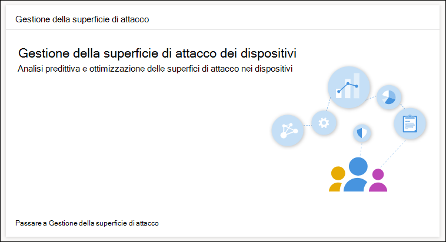
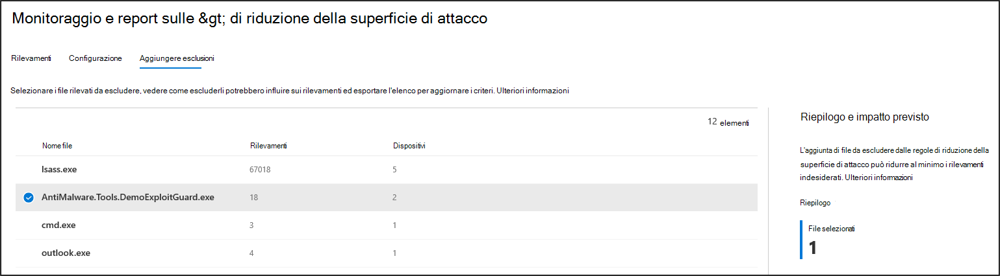

# Ottimizzare la distribuzione e i rilevamenti delle regole asr

[!INCLUDE [Microsoft 365 Defender rebranding](../../includes/microsoft-defender.md)]

**Si applica a:**
- [Microsoft Defender per endpoint](https://go.microsoft.com/fwlink/p/?linkid=2154037)
- [Microsoft 365 Defender](https://go.microsoft.com/fwlink/?linkid=2118804)

> Vuoi provare Defender per Endpoint? [Iscriversi per una versione di valutazione gratuita.](https://www.microsoft.com/en-us/WindowsForBusiness/windows-atp?ocid=docs-wdatp-onboardconfigure-abovefoldlink)

[Le regole di riduzione della superficie di](./attack-surface-reduction.md) attacco identificano e impediscono exploit di malware tipici. Controllano quando e come può essere eseguito codice potenzialmente dannoso. Ad esempio, possono impedire a JavaScript o VBScript di avviare un file eseguibile scaricato, bloccare le chiamate API Win32 da macro Office e bloccare i processi eseguiti da unità USB.

 
*Scheda di gestione della superficie di attacco*

La *scheda di gestione della superficie di* attacco è un punto di ingresso per gli strumenti Microsoft 365 centro sicurezza che puoi usare per:

* Comprendere in che modo le regole DISR sono attualmente distribuite nell'organizzazione.
* Esaminare i rilevamenti asr e identificare possibili rilevamenti non corretti.
* Analizzare l'impatto delle esclusioni e generare l'elenco dei percorsi di file da escludere.

Seleziona **Vai a gestione della superficie di** attacco Monitoraggio & report > regole di riduzione della superficie di attacco > Aggiungi  >  **esclusioni.** Da qui è possibile passare ad altre sezioni del centro sicurezza Microsoft 365 sicurezza.

 
La ***scheda Aggiungi esclusioni nella** pagina Regole di riduzione della superficie di attacco nel centro sicurezza Microsoft 365 sicurezza*

> [!NOTE]
> Per accedere Microsoft 365 centro sicurezza, è necessario disporre di una licenza Microsoft 365 E3 o E5 e di un account con determinati ruoli Azure Active Directory. [Leggere le licenze e le autorizzazioni necessarie.](/office365/securitycompliance/microsoft-security-and-compliance#required-licenses-and-permissions)

Per ulteriori informazioni sulla distribuzione delle regole asr Microsoft 365 centro sicurezza, vedere Monitorare e gestire la distribuzione e i rilevamenti delle regole [asr.](/office365/securitycompliance/monitor-devices#monitor-and-manage-asr-rule-deployment-and-detections)

**Argomenti correlati**

* [Verificare che i dispositivi siano configurati correttamente](configure-machines.md)
* [Eseguire l'onboarded dei dispositivi in Microsoft Defender per Endpoint](configure-machines-onboarding.md)
* [Monitorare la conformità alla linea di base di sicurezza di Microsoft Defender for Endpoint](configure-machines-security-baseline.md)
