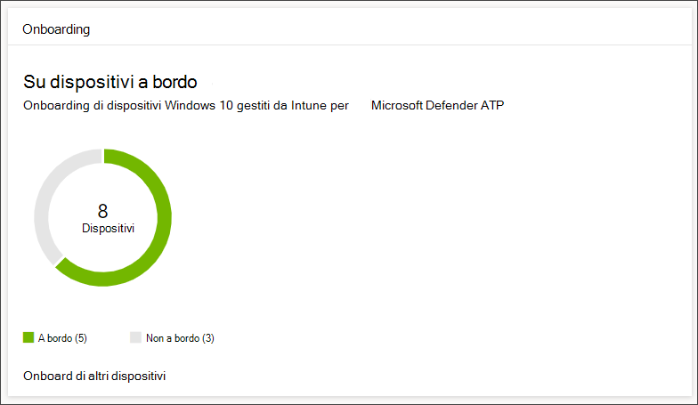
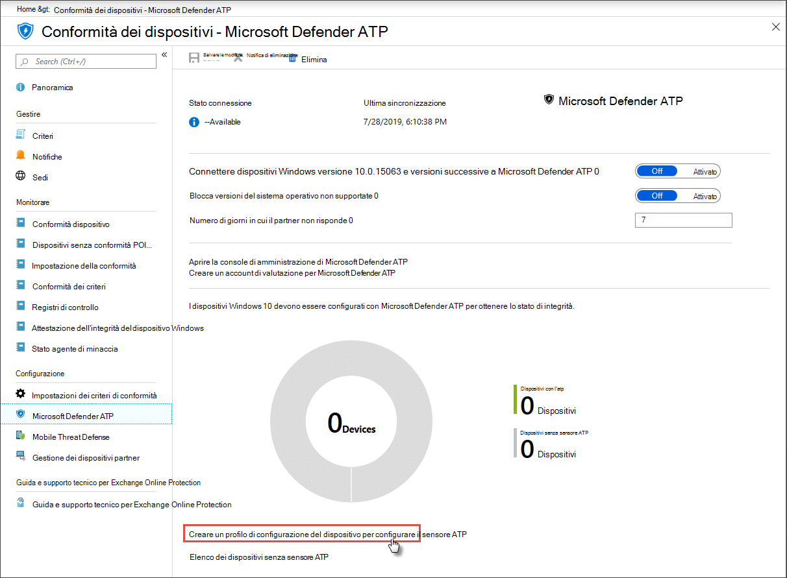

# Eseguire l'onboarded dei dispositivi in Microsoft Defender per EndpointGet devices onboarded to Microsoft Defender for Endpoint

[!INCLUDE [Microsoft 365 Defender rebranding](../../includes/microsoft-defender.md)]

**Si applica a:****Applies to:**
- [Microsoft Defender ATPMicrosoft Defender for Endpoint](https://go.microsoft.com/fwlink/p/?linkid=2154037)
- [Microsoft 365 DefenderMicrosoft 365 Defender](https://go.microsoft.com/fwlink/?linkid=2118804)

>Vuoi provare Microsoft Defender per Endpoint?Want to experience Microsoft Defender for Endpoint? [Iscriversi per una versione di valutazione gratuita.Sign up for a free trial.](https://www.microsoft.com/microsoft-365/windows/microsoft-defender-atp?ocid=docs-wdatp-onboardconfigure-abovefoldlink)

Ogni dispositivo onboarded aggiunge un sensore edR (Endpoint Detection and Response) aggiuntivo e aumenta la visibilità sull'attività di violazione nella rete.Each onboarded device adds an additional endpoint detection and response (EDR) sensor and increases visibility over breach activity in your network. L'onboarding garantisce inoltre che un dispositivo possa essere controllato alla ricerca di componenti vulnerabili e problemi di configurazione della sicurezza e possa ricevere azioni di correzione critiche durante gli attacchi.Onboarding also ensures that a device can be checked for vulnerable components as well security configuration issues and can receive critical remediation actions during attacks.

Prima di poter tenere traccia e gestire l'onboarding dei dispositivi:Before you can track and manage onboarding of devices:
- [Registrare i dispositivi nella gestione di IntuneEnroll your devices to Intune management](configure-machines.md#enroll-devices-to-intune-management)
- [Verificare di disporre delle autorizzazioni necessarieEnsure you have the necessary permissions](configure-machines.md#obtain-required-permissions)

## Individuare e tenere traccia dei dispositivi non protettiDiscover and track unprotected devices

La scheda **di onboarding** offre una panoramica generale della frequenza di onboarding confrontando il numero di dispositivi Windows 10 effettivamente onboarding in Defender per Endpoint con il numero totale di dispositivi Windows 10 gestiti da Intune.The **Onboarding** card provides a high-level overview of your onboarding rate by comparing the number of Windows 10 devices that have actually onboarded to Defender for Endpoint against the total number of Intune-managed Windows 10 devices.

 
*Scheda che mostra i dispositivi onboarded rispetto al numero totale di dispositivi Windows 10 gestiti da Intune**Card showing onboarded devices compared to the total number of Intune-managed Windows 10 device*

>[!NOTE]
>Se hai usato Gestione configurazione Centro sicurezza, lo script di onboarding o altri metodi di onboarding che non usano profili intune, potresti riscontrare discrepanze di dati.If you used Security Center Configuration Manager, the onboarding script, or other onboarding methods that don’t use Intune profiles, you might encounter data discrepancies. Per risolvere queste discrepanze, crea un profilo di configurazione intune corrispondente per Defender per l'onboarding dell'endpoint e assegna il profilo ai dispositivi.To resolve these discrepancies, create a corresponding Intune configuration profile for Defender for Endpoint onboarding and assign that profile to your devices.

## Onboardare più dispositivi con profili intuneOnboard more devices with Intune profiles

Defender for Endpoint offre diverse opzioni convenienti per [l'onboarding di dispositivi Windows 10.](onboard-configure.md)Defender for Endpoint provides several convenient options for [onboarding Windows 10 devices](onboard-configure.md). Per i dispositivi gestiti da Intune, tuttavia, puoi sfruttare i profili di Intune per distribuire comodamente il sensore Defender for Endpoint per selezionare i dispositivi, in modo efficace l'onboarding di questi dispositivi nel servizio.For Intune-managed devices, however, you can leverage Intune profiles to conveniently deploy the Defender for Endpoint sensor to select devices, effectively onboarding these devices to the service.

Nella scheda **Onboarding** seleziona **Onboarding di altri** dispositivi per creare e assegnare un profilo in Intune.From the **Onboarding** card, select **Onboard more devices** to create and assign a profile on Intune. Il collegamento consente di accedere alla pagina di conformità del dispositivo in Intune, che fornisce una panoramica simile dello stato di onboarding.The link takes you to the device compliance page on Intune, which provides a similar overview of your onboarding state.

 
   *Pagina conformità dei dispositivi Microsoft Defender ATP nella gestione dei dispositivi di Intune**Microsoft Defender ATP device compliance page on Intune device management*

>[!TIP]
>In alternativa, è possibile passare alla pagina Conformità onboarding di Defender for Endpoint nel portale di [Microsoft Azure](https://portal.azure.com/) da Tutti i servizi > Intune > Conformità dei dispositivi **> Microsoft Defender ATP**.Alternatively, you can navigate to the Defender for Endpoint onboarding compliance page in the [Microsoft Azure portal](https://portal.azure.com/) from **All services > Intune > Device compliance > Microsoft Defender ATP**.

>[!NOTE]
> Se vuoi visualizzare i dati del dispositivo più aggiornati, fai clic su Elenco di dispositivi senza sensore **ATP.**If you want to view the most up-to-date device data, click on **List of devices without ATP sensor**.

Dalla pagina conformità del dispositivo, crea un profilo di configurazione specifico per la distribuzione del sensore Defender for Endpoint e assegna il profilo ai dispositivi che vuoi eseguire l'onboard.From the device compliance page, create a configuration profile specifically for the deployment of the Defender for Endpoint sensor and assign that profile to the devices you want to onboard. A tale scopo, è possibile:To do this, you can either:

- Seleziona Crea un profilo di configurazione del dispositivo per configurare il sensore **ATP** in modo che inizi con un profilo di configurazione del dispositivo predefinito.Select **Create a device configuration profile to configure ATP sensor** to start with a predefined device configuration profile.
- Crea il profilo di configurazione del dispositivo da zero.Create the device configuration profile from scratch.

Per altre informazioni, leggi l'uso dei profili di configurazione dei dispositivi [intune per eseguire l'onboardmento dei dispositivi in Defender per Endpoint.](https://docs.microsoft.com/intune/advanced-threat-protection#onboard-devices-by-using-a-configuration-profile)For more information, [read about using Intune device configuration profiles to onboard devices to Defender for Endpoint](https://docs.microsoft.com/intune/advanced-threat-protection#onboard-devices-by-using-a-configuration-profile).

>Vuoi provare Microsoft Defender ATP?Want to experience Microsoft Defender ATP? [Iscriversi per una versione di valutazione gratuita.Sign up for a free trial.](https://www.microsoft.com/microsoft-365/windows/microsoft-defender-atp?ocid=docs-wdatp-onboardconfigure-belowfoldlink)

## Argomenti correlatiRelated topics
- [Verificare che i dispositivi siano configurati correttamenteEnsure your devices are configured properly](configure-machines.md)
- [Aumentare la conformità alla linea di base di sicurezza di Defender for EndpointIncrease compliance to the Defender for Endpoint security baseline](configure-machines-security-baseline.md)
- [Ottimizzare la distribuzione e i rilevamenti delle regole asrOptimize ASR rule deployment and detections](configure-machines-asr.md)
