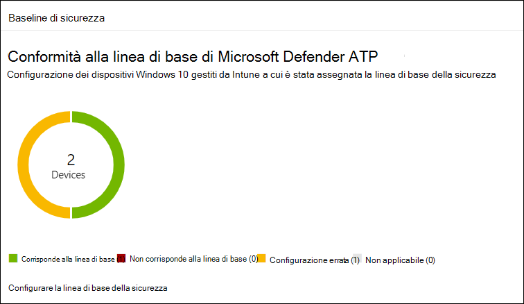
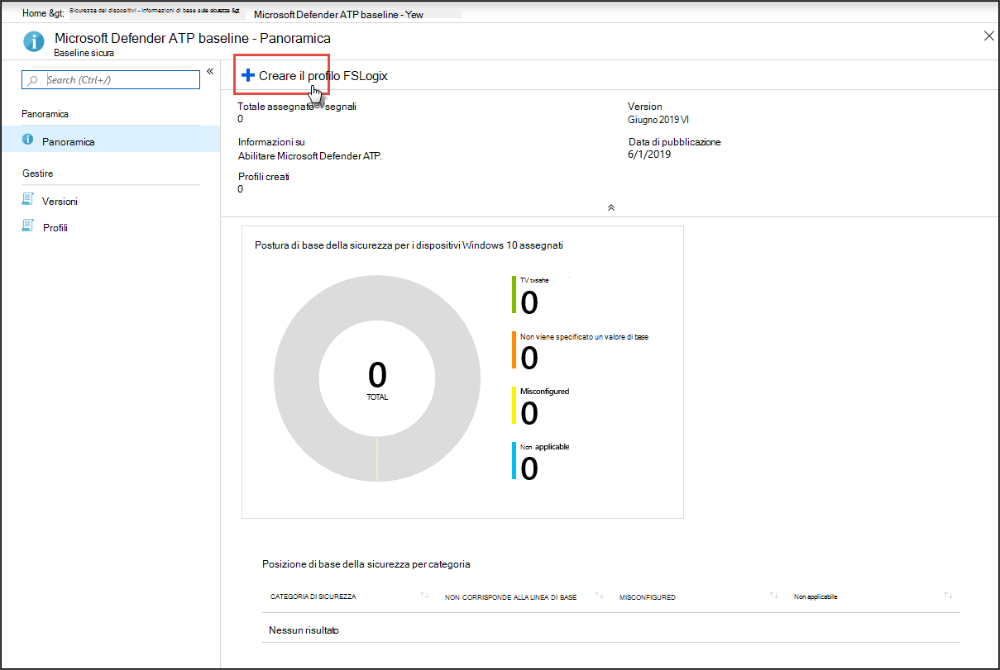
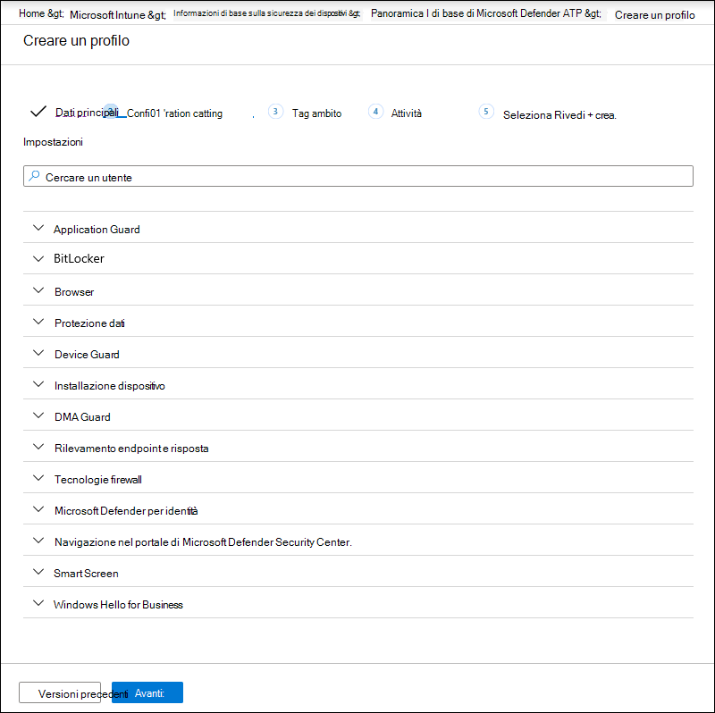
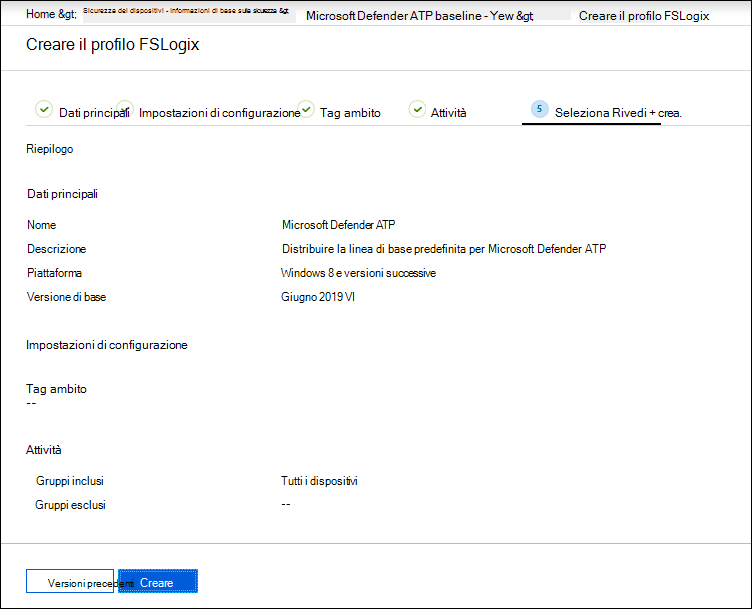

# Aumentare la conformità alla linea di base di sicurezza di Microsoft Defender for EndpointIncrease compliance to the Microsoft Defender for Endpoint security baseline

[!INCLUDE [Microsoft 365 Defender rebranding](../../includes/microsoft-defender.md)]

**Si applica a:****Applies to:**
- [Microsoft Defender per endpointMicrosoft Defender for Endpoint](https://go.microsoft.com/fwlink/p/?linkid=2154037)
- [Microsoft 365 DefenderMicrosoft 365 Defender](https://go.microsoft.com/fwlink/?linkid=2118804)

>Vuoi provare Defender per Endpoint?Want to experience Defender for Endpoint? [Iscriversi per una versione di valutazione gratuita.Sign up for a free trial.](https://www.microsoft.com/microsoft-365/windows/microsoft-defender-atp?ocid=docs-wdatp-onboardconfigure-abovefoldlink)

Le linee di base della sicurezza assicurano che le funzionalità di sicurezza siano configurate in base alle indicazioni degli esperti di sicurezza e degli amministratori di sistema di Windows esperti.Security baselines ensure that security features are configured according to guidance from both security experts and expert Windows system administrators. Quando viene distribuita, la linea di base di defender per la sicurezza degli endpoint imposta Defender per i controlli di sicurezza degli endpoint in modo da garantire una protezione ottimale.When deployed, the Defender for Endpoint security baseline sets Defender for Endpoint security controls to provide optimal protection.

Per comprendere le linee di base della sicurezza e come vengono assegnate in Intune usando i profili di configurazione, [leggere queste domande frequenti](https://docs.microsoft.com/intune/security-baselines#q--a).To understand security baselines and how they are assigned on Intune using configuration profiles, [read this FAQ](https://docs.microsoft.com/intune/security-baselines#q--a).

Prima di poter distribuire e tenere traccia della conformità alle linee di base della sicurezza:Before you can deploy and track compliance to security baselines:
- [Registrare i dispositivi nella gestione di IntuneEnroll your devices to Intune management](configure-machines.md#enroll-devices-to-intune-management)
- [Verificare di disporre delle autorizzazioni necessarieEnsure you have the necessary permissions](configure-machines.md#obtain-required-permissions)

## Confronto tra Microsoft Defender per Endpoint e le linee di base della sicurezza di Windows IntuneCompare the Microsoft Defender for Endpoint and the Windows Intune security baselines
La linea di base per la sicurezza di Windows Intune fornisce un set completo di impostazioni consigliate necessarie per configurare in modo sicuro i dispositivi che eseguono Windows, incluse le impostazioni del browser, le impostazioni di PowerShell, nonché le impostazioni per alcune funzionalità di sicurezza come Microsoft Defender Antivirus.The Windows Intune security baseline provides a comprehensive set of recommended settings needed to securely configure devices running Windows, including browser settings, PowerShell settings, as well as settings for some security features like Microsoft Defender Antivirus. Al contrario, la linea di base di Defender for Endpoint fornisce impostazioni che ottimizzano tutti i controlli di sicurezza nello stack defender per endpoint, incluse le impostazioni per il rilevamento e la risposta degli endpoint (EDR) e le impostazioni disponibili anche nella linea di base di sicurezza di Windows Intune.In contrast, the Defender for Endpoint baseline provides settings that optimize all the security controls in the Defender for Endpoint stack, including settings for endpoint detection and response (EDR) as well as settings also found in the Windows Intune security baseline. Per ulteriori informazioni su ogni previsione, vedere:For more information about each baseline, see:

- [Impostazioni di base della sicurezza di Windows per IntuneWindows security baseline settings for Intune](https://docs.microsoft.com/intune/security-baseline-settings-windows)
- [Impostazioni di base di Microsoft Defender for Endpoint per IntuneMicrosoft Defender for Endpoint baseline settings for Intune](https://docs.microsoft.com/intune/security-baseline-settings-defender-atp)

Idealmente, i dispositivi onboarded in Defender for Endpoint vengono distribuiti entrambe le linee di base: la linea di base di sicurezza di Windows Intune per proteggere inizialmente Windows e quindi la linea di base di sicurezza di Defender for Endpoint su più livelli per configurare in modo ottimale i controlli di sicurezza defender per endpoint.Ideally, devices onboarded to Defender for Endpoint are deployed both baselines: the Windows Intune security baseline to initially secure Windows and then the Defender for Endpoint security baseline layered on top to optimally configure the Defender for Endpoint security controls. Per trarre vantaggio dai dati più recenti su rischi e minacce e per ridurre al minimo i conflitti con l'evolversi delle linee di base, applicare sempre le versioni più recenti delle linee di base in tutti i prodotti non appena vengono rilasciati.To benefit from the latest data on risks and threats and to minimize conflicts as baselines evolve, always apply the latest versions of the baselines across all products as soon as they are released.

>[!NOTE]
>La baseline di sicurezza di Defender for Endpoint è stata ottimizzata per i dispositivi fisici e attualmente non è consigliata per l'uso in macchine virtuali (VM) o endpoint VDI.The Defender for Endpoint security baseline has been optimized for physical devices and is currently not recommended for use on virtual machine (VMs) or VDI endpoints. Alcune impostazioni di base possono influire sulle sessioni interattive remote in ambienti virtualizzati.Certain baseline settings can impact remote interactive sessions on virtualized environments.

## Monitorare la conformità alla baseline di sicurezza di Defender for EndpointMonitor compliance to the Defender for Endpoint security baseline

La **scheda di base** Sicurezza nella gestione [della](configure-machines.md) configurazione dei dispositivi fornisce una panoramica della conformità nei dispositivi Windows 10 a cui è stata assegnata la linea di base di sicurezza defender per endpoint.The **Security baseline** card on [device configuration management](configure-machines.md) provides an overview of compliance across Windows 10 devices that have been assigned the Defender for Endpoint security baseline.

 
*Scheda che mostra la conformità alla linea di base di sicurezza di Defender for Endpoint**Card showing compliance to the Defender for Endpoint security baseline*

A ogni dispositivo viene assegnato uno dei seguenti tipi di stato:Each device is given one of the following status types:

- **Corrisponde alla linea di** base: le impostazioni del dispositivo corrispondono a tutte le impostazioni della linea di base**Matches baseline**—device settings match all the settings in the baseline
- **Non corrisponde alla linea di base:** almeno un'impostazione del dispositivo non corrisponde alla linea di base**Does not match baseline**—at least one device setting doesn't match the baseline
- **Configurazione non corretta:** almeno un'impostazione di base non è configurata correttamente nel dispositivo ed è in conflitto, errore o stato in sospeso**Misconfigured**—at least one baseline setting isn't properly configured on the device and is in a conflict, error, or pending state
- **Non applicabile:** almeno un'impostazione di base non è applicabile nel dispositivo**Not applicable**—At least one baseline setting isn't applicable on the device

Per esaminare dispositivi specifici, selezionare **Configura baseline di sicurezza** nella scheda.To review specific devices, select **Configure security baseline** on the card. Questo consente di accedere alla gestione dei dispositivi di Intune.This takes you to Intune device management. Da qui, seleziona **Stato del** dispositivo per i nomi e gli stati dei dispositivi.From there, select **Device status** for the names and statuses of the devices.

>[!NOTE]
>Potrebbero verificarsi discrepanze nei dati aggregati visualizzati nella pagina di gestione della configurazione del dispositivo e in quelli visualizzati nelle schermate di panoramica in Intune.You might experience discrepancies in aggregated data displayed on the device configuration management page and those displayed on overview screens in Intune.

## Esaminare e assegnare microsoft Defender for Endpoint security baselineReview and assign the Microsoft Defender for Endpoint security baseline

La gestione della configurazione dei dispositivi monitora la conformità di base solo dei dispositivi Windows 10 a cui è stata assegnata in modo specifico la baseline di sicurezza di Microsoft Defender for Endpoint.Device configuration management monitors baseline compliance only of Windows 10 devices that have been specifically assigned the Microsoft Defender for Endpoint security baseline. Puoi esaminare comodamente la linea di base e assegnarla ai dispositivi nella gestione dei dispositivi di Intune.You can conveniently review the baseline and assign it to devices on Intune device management.

1. Seleziona **Configure security baseline** nella scheda Security **baseline** per passare a Intune device management.Select **Configure security baseline** on the **Security baseline** card to go to Intune device management. Viene visualizzata una panoramica simile della conformità di base.A similar overview of baseline compliance is displayed.

   >[!TIP]
   > In alternativa, è possibile passare a Defender for Endpoint security baseline nel portale di Microsoft Azure da **All services > Intune > Device security > Security baselines > Microsoft Defender ATP baseline**.Alternatively, you can navigate to the Defender for Endpoint security baseline in the Microsoft Azure portal from **All services > Intune > Device security > Security baselines > Microsoft Defender ATP baseline**.

2. Creare un nuovo profilo.Create a new profile.

    
   *Panoramica di base sulla sicurezza di Microsoft Defender per endpoint in Intune**Microsoft Defender for Endpoint security baseline overview on Intune*

3. Durante la creazione del profilo, è possibile rivedere e modificare impostazioni specifiche sulla linea di base.During profile creation, you can review and adjust specific settings on the baseline.

    
   *Opzioni di base della sicurezza durante la creazione del profilo in Intune**Security baseline options during profile creation on Intune*

4. Assegnare il profilo al gruppo di dispositivi appropriato.Assign the profile to the appropriate device group.

    
   *Assegnazione del profilo di base della sicurezza in Intune**Assigning the security baseline profile on Intune*

5. Crea il profilo per salvarlo e distribuirlo al gruppo di dispositivi assegnato.Create the profile to save it and deploy it to the assigned device group.

    
   *Creazione del profilo di base della sicurezza in Intune**Creating the security baseline profile on Intune*

>[!TIP]
>Le linee di base della sicurezza in Intune offrono un modo pratico per proteggere e proteggere in modo completo i dispositivi.Security baselines on Intune provide a convenient way to comprehensively secure and protect your devices. [Altre informazioni sulle linee di base della sicurezza in Intune](https://docs.microsoft.com/intune/security-baselines).[Learn more about security baselines on Intune](https://docs.microsoft.com/intune/security-baselines).

>Vuoi provare Microsoft Defender per Endpoint?Want to experience Microsoft Defender for Endpoint? [Iscriversi per una versione di valutazione gratuita.Sign up for a free trial.](https://www.microsoft.com/microsoft-365/windows/microsoft-defender-atp?ocid=docs-wdatp-onboardconfigure-belowfoldlink)

## Argomenti correlatiRelated topics
- [Verificare che i dispositivi siano configurati correttamenteEnsure your devices are configured properly](configure-machines.md)
- [Eseguire l'onboarded dei dispositivi in Microsoft Defender per EndpointGet devices onboarded to Microsoft Defender for Endpoint](configure-machines-onboarding.md)
- [Ottimizzare la distribuzione e i rilevamenti delle regole asrOptimize ASR rule deployment and detections](configure-machines-asr.md)
