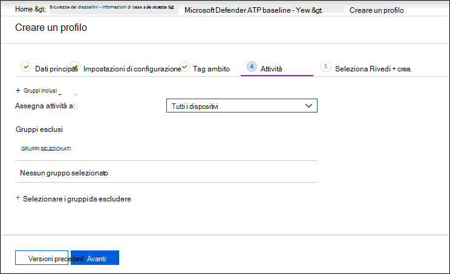

# Aumentare la conformità alla linea di base di sicurezza di Microsoft Defender for Endpoint

[!INCLUDE [Microsoft 365 Defender rebranding](../../includes/microsoft-defender.md)]

**Si applica a:**
- [Microsoft Defender per endpoint](https://go.microsoft.com/fwlink/p/?linkid=2154037)
- [Microsoft 365 Defender](https://go.microsoft.com/fwlink/?linkid=2118804)

>Vuoi provare Defender per Endpoint? [Iscriversi per una versione di valutazione gratuita.](https://www.microsoft.com/microsoft-365/windows/microsoft-defender-atp?ocid=docs-wdatp-onboardconfigure-abovefoldlink)

Le linee di base della sicurezza assicurano che le funzionalità di sicurezza siano configurate in base alle indicazioni degli esperti di sicurezza e degli amministratori di sistema di Windows esperti. Quando viene distribuita, la linea di base di defender per la sicurezza degli endpoint imposta Defender per i controlli di sicurezza degli endpoint in modo da garantire una protezione ottimale.

Per comprendere le linee di base della sicurezza e come vengono assegnate in Intune usando i profili di configurazione, [leggere queste domande frequenti](https://docs.microsoft.com/intune/security-baselines#q--a).

Prima di poter distribuire e tenere traccia della conformità alle linee di base della sicurezza:
- [Registrare i dispositivi nella gestione di Intune](configure-machines.md#enroll-devices-to-intune-management)
- [Verificare di disporre delle autorizzazioni necessarie](configure-machines.md#obtain-required-permissions)

## Confronto tra Microsoft Defender per Endpoint e le linee di base della sicurezza di Windows Intune
La linea di base per la sicurezza di Windows Intune fornisce un set completo di impostazioni consigliate necessarie per configurare in modo sicuro i dispositivi che eseguono Windows, incluse le impostazioni del browser, le impostazioni di PowerShell, nonché le impostazioni per alcune funzionalità di sicurezza come Microsoft Defender Antivirus. Al contrario, la linea di base di Defender for Endpoint fornisce impostazioni che ottimizzano tutti i controlli di sicurezza nello stack defender per endpoint, incluse le impostazioni per il rilevamento e la risposta degli endpoint (EDR) e le impostazioni disponibili anche nella linea di base di sicurezza di Windows Intune. Per ulteriori informazioni su ogni previsione, vedere:

- [Impostazioni di base della sicurezza di Windows per Intune](https://docs.microsoft.com/intune/security-baseline-settings-windows)
- [Impostazioni di base di Microsoft Defender for Endpoint per Intune](https://docs.microsoft.com/intune/security-baseline-settings-defender-atp)

Idealmente, i dispositivi onboarded in Defender for Endpoint vengono distribuiti entrambe le linee di base: la linea di base di sicurezza di Windows Intune per proteggere inizialmente Windows e quindi la linea di base di sicurezza di Defender for Endpoint su più livelli per configurare in modo ottimale i controlli di sicurezza defender per endpoint. Per trarre vantaggio dai dati più recenti su rischi e minacce e per ridurre al minimo i conflitti con l'evolversi delle linee di base, applicare sempre le versioni più recenti delle linee di base in tutti i prodotti non appena vengono rilasciati.

>[!NOTE]
>La baseline di sicurezza di Defender for Endpoint è stata ottimizzata per i dispositivi fisici e attualmente non è consigliata per l'uso in macchine virtuali (VM) o endpoint VDI. Alcune impostazioni di base possono influire sulle sessioni interattive remote in ambienti virtualizzati.

## Monitorare la conformità alla baseline di sicurezza di Defender for Endpoint

La **scheda di base** Sicurezza nella gestione [della](configure-machines.md) configurazione dei dispositivi fornisce una panoramica della conformità nei dispositivi Windows 10 a cui è stata assegnata la linea di base di sicurezza defender per endpoint.

 
*Scheda che mostra la conformità alla linea di base di sicurezza di Defender for Endpoint*

A ogni dispositivo viene assegnato uno dei seguenti tipi di stato:

- **Corrisponde alla linea di** base: le impostazioni del dispositivo corrispondono a tutte le impostazioni della linea di base
- **Non corrisponde alla linea di base:** almeno un'impostazione del dispositivo non corrisponde alla linea di base
- **Configurazione non corretta:** almeno un'impostazione di base non è configurata correttamente nel dispositivo ed è in conflitto, errore o stato in sospeso
- **Non applicabile:** almeno un'impostazione di base non è applicabile nel dispositivo

Per esaminare dispositivi specifici, selezionare **Configura baseline di sicurezza** nella scheda. Questo consente di accedere alla gestione dei dispositivi di Intune. Da qui, seleziona **Stato del** dispositivo per i nomi e gli stati dei dispositivi.

>[!NOTE]
>Potrebbero verificarsi discrepanze nei dati aggregati visualizzati nella pagina di gestione della configurazione del dispositivo e in quelli visualizzati nelle schermate di panoramica in Intune.

## Esaminare e assegnare microsoft Defender for Endpoint security baseline

La gestione della configurazione dei dispositivi monitora la conformità di base solo dei dispositivi Windows 10 a cui è stata assegnata in modo specifico la baseline di sicurezza di Microsoft Defender for Endpoint. Puoi esaminare comodamente la linea di base e assegnarla ai dispositivi nella gestione dei dispositivi di Intune.

1. Seleziona **Configure security baseline** nella scheda Security **baseline** per passare a Intune device management. Viene visualizzata una panoramica simile della conformità di base.

   >[!TIP]
   > In alternativa, è possibile passare a Defender for Endpoint security baseline nel portale di Microsoft Azure da **All services > Intune > Device security > Security baselines > Microsoft Defender ATP baseline**.

2. Creare un nuovo profilo.

    
   *Panoramica di base sulla sicurezza di Microsoft Defender per endpoint in Intune*

3. Durante la creazione del profilo, è possibile rivedere e modificare impostazioni specifiche sulla linea di base.

    
   *Opzioni di base della sicurezza durante la creazione del profilo in Intune*

4. Assegnare il profilo al gruppo di dispositivi appropriato.

    
   *Assegnazione del profilo di base della sicurezza in Intune*

5. Crea il profilo per salvarlo e distribuirlo al gruppo di dispositivi assegnato.

    
   *Creazione del profilo di base della sicurezza in Intune*

>[!TIP]
>Le linee di base della sicurezza in Intune offrono un modo pratico per proteggere e proteggere in modo completo i dispositivi. [Altre informazioni sulle linee di base della sicurezza in Intune](https://docs.microsoft.com/intune/security-baselines).

>Vuoi provare Microsoft Defender per Endpoint? [Iscriversi per una versione di valutazione gratuita.](https://www.microsoft.com/microsoft-365/windows/microsoft-defender-atp?ocid=docs-wdatp-onboardconfigure-belowfoldlink)

## Argomenti correlati
- [Verificare che i dispositivi siano configurati correttamente](configure-machines.md)
- [Eseguire l'onboarded dei dispositivi in Microsoft Defender per Endpoint](configure-machines-onboarding.md)
- [Ottimizzare la distribuzione e i rilevamenti delle regole asr](configure-machines-asr.md)
