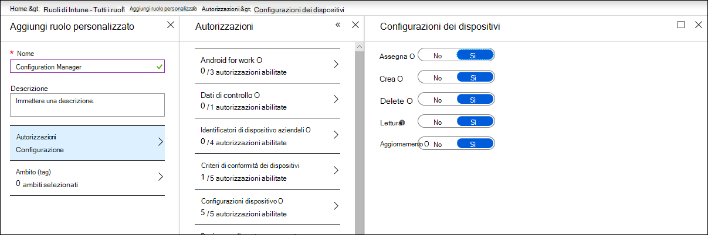

# Verificare che i dispositivi siano configurati correttamenteEnsure your devices are configured properly

[!INCLUDE [Microsoft 365 Defender rebranding](../../includes/microsoft-defender.md)]

**Si applica a:****Applies to:**
- [Microsoft Defender per endpointMicrosoft Defender for Endpoint](https://go.microsoft.com/fwlink/p/?linkid=2154037)
- [Microsoft 365 DefenderMicrosoft 365 Defender](https://go.microsoft.com/fwlink/?linkid=2118804)

>Vuoi provare Defender per Endpoint?Want to experience Defender for Endpoint? [Iscriversi per una versione di valutazione gratuita.Sign up for a free trial.](https://www.microsoft.com/microsoft-365/windows/microsoft-defender-atp?ocid=docs-wdatp-onboardconfigure-abovefoldlink)

Con i dispositivi configurati correttamente, è possibile aumentare la resilienza generale contro le minacce e migliorare la capacità di rilevare e rispondere agli attacchi.With properly configured devices, you can boost overall resilience against threats and enhance your capability to detect and respond to attacks. La gestione della configurazione della sicurezza garantisce che i dispositivi:Security configuration management helps ensure that your devices:

- Onboard to Microsoft Defender for EndpointOnboard to Microsoft Defender for Endpoint
- Soddisfare o superare la configurazione di base di Defender for Endpoint securityMeet or exceed the Defender for Endpoint security baseline configuration
- Disporre di mitigazioni strategiche della superficie di attaccoHave strategic attack surface mitigations in place

Fai **clic su Gestione** configurazione dal menu di spostamento per aprire la pagina Gestione configurazione dispositivi.Click **Configuration management** from the navigation menu to open the Device configuration management page.

 
*Pagina Gestione configurazione dispositivi**Device configuration management page*

È possibile tenere traccia dello stato di configurazione a livello di organizzazione e intervenire rapidamente in risposta a una copertura di onboarding scarsa, a problemi di conformità e a mitigazioni della superficie di attacco scarsamente ottimizzate tramite collegamenti diretti e diretti alle pagine di gestione dei dispositivi nel centro sicurezza Microsoft Intune e Microsoft 365.You can track configuration status at an organizational level and quickly take action in response to poor onboarding coverage, compliance issues, and poorly optimized attack surface mitigations through direct, deep links to device management pages on Microsoft Intune and Microsoft 365 security center.

In questo modo, si trarranno vantaggio da:In doing so, you benefit from:
- Visibilità completa degli eventi nei dispositiviComprehensive visibility of the events on your devices
- Una solida intelligence sulle minacce e potenti tecnologie di apprendimento dei dispositivi per l'elaborazione di eventi non elaborati e l'identificazione dell'attività di violazione e degli indicatori di minacciaRobust threat intelligence and powerful device learning technologies for processing raw events and identifying the breach activity and threat indicators
- Una pila completa di funzionalità di sicurezza configurate per arrestare in modo efficiente l'installazione di installazioni dannose, dirottamento di file di sistema e processo, esfiltrazione dei dati e altre attività di minacciaA full stack of security features configured to efficiently stop the installation of malicious implants, hijacking of system files and process, data exfiltration, and other threat activities
- Mitigazioni ottimizzate della superficie di attacco, massimizzando le difese strategiche contro l'attività delle minacce riducendo al minimo l'impatto sulla produttivitàOptimized attack surface mitigations, maximizing strategic defenses against threat activity while minimizing impact to productivity

## Registrare i dispositivi nella gestione di IntuneEnroll devices to Intune management

La gestione della configurazione dei dispositivi funziona a stretto contatto con la gestione dei dispositivi di Intune per stabilire l'inventario dei dispositivi nell'organizzazione e la configurazione di sicurezza di base.Device configuration management works closely with Intune device management to establish the inventory of the devices in your organization and the baseline security configuration. Sarà possibile tenere traccia e gestire i problemi di configurazione nei dispositivi Windows 10 Intune.You will be able to track and manage configuration issues on Intune-managed Windows 10 devices.

Prima di poter verificare che i dispositivi siano configurati correttamente, registrarli nella gestione di Intune.Before you can ensure your devices are configured properly, enroll them to Intune management. La registrazione di Intune è affidabile e include diverse opzioni di registrazione per Windows 10 dispositivi.Intune enrollment is robust and has several enrollment options for Windows 10 devices. Per altre informazioni sulle opzioni di registrazione di Intune, leggi informazioni sulla configurazione della registrazione [per Windows dispositivi](/intune/windows-enroll).For more information about Intune enrollment options, read about [setting up enrollment for Windows devices](/intune/windows-enroll).

>[!NOTE]
>Per registrare Windows dispositivi in Intune, agli amministratori devono essere già state assegnate licenze.To enroll Windows devices to Intune, administrators must have already been assigned licenses. [Per informazioni sull'assegnazione delle licenze per la registrazione dei dispositivi, vedere](/intune/licenses-assign).[Read about assigning licenses for device enrollment](/intune/licenses-assign).

>[!TIP] 
>Per ottimizzare la gestione dei dispositivi tramite Intune, [connetti Intune a Defender per Endpoint.](/intune/advanced-threat-protection#enable-windows-defender-atp-in-intune)To optimize device management through Intune, [connect Intune to Defender for Endpoint](/intune/advanced-threat-protection#enable-windows-defender-atp-in-intune).

## Ottenere le autorizzazioni necessarieObtain required permissions
Per impostazione predefinita, solo gli utenti a cui è stato assegnato il ruolo Amministratore globale o Amministratore servizio Intune in Azure AD possono gestire e assegnare i profili di configurazione dei dispositivi necessari per l'onboarding dei dispositivi e la distribuzione della linea di base di sicurezza.By default, only users who have been assigned the Global Administrator or the Intune Service Administrator role on Azure AD can manage and assign the device configuration profiles needed for onboarding devices and deploying the security baseline.

Se sono stati assegnati altri ruoli, verificare di disporre delle autorizzazioni necessarie:If you have been assigned other roles, ensure you have the necessary permissions:

- Autorizzazioni complete per le configurazioni dei dispositiviFull permissions to device configurations
- Autorizzazioni complete per le linee di base della sicurezzaFull permissions to security baselines
- Autorizzazioni di lettura per i criteri di conformità dei dispositiviRead permissions to device compliance policies
- Autorizzazioni di lettura per l'organizzazioneRead permissions to the organization

 
*Autorizzazioni di configurazione dei dispositivi in Intune**Device configuration permissions on Intune*

>[!TIP] 
>Per ulteriori informazioni sull'assegnazione delle autorizzazioni in Intune, [vedere creazione di ruoli personalizzati.](/intune/create-custom-role#to-create-a-custom-role)To learn more about assigning permissions on Intune, [read about creating custom roles](/intune/create-custom-role#to-create-a-custom-role).

## Contenuto della sezioneIn this section
ArgomentoTopic | DescrizioneDescription
:---|:---
[Eseguire l'onboarded dei dispositivi in Defender for EndpointGet devices onboarded to Defender for Endpoint](configure-machines-onboarding.md)| Tenere traccia dello stato di onboarding dei dispositivi gestiti da Intune e dell'onboarding di altri dispositivi tramite Intune.Track onboarding status of Intune-managed devices and onboard more devices through Intune. 
[Aumentare la conformità alla linea di base di sicurezza di Defender for EndpointIncrease compliance to the Defender for Endpoint security baseline](configure-machines-security-baseline.md) | Tenere traccia della conformità di base e della non conformità.Track baseline compliance and noncompliance. Distribuire la linea di base per la sicurezza in più dispositivi gestiti da Intune.Deploy the security baseline to more Intune-managed devices.
[Ottimizzare la distribuzione e i rilevamenti delle regole asrOptimize ASR rule deployment and detections](configure-machines-asr.md) | Esaminare la distribuzione delle regole e ottimizzare i rilevamenti usando gli strumenti di analisi dell'impatto nel centro sicurezza Microsoft 365 sicurezza.Review rule deployment and tweak detections using impact analysis tools in Microsoft 365 security center.

>Vuoi provare Defender per Endpoint?Want to experience Defender for Endpoint? [Iscriversi per una versione di valutazione gratuita.Sign up for a free trial.](https://www.microsoft.com/microsoft-365/windows/microsoft-defender-atp?ocid=docs-wdatp-onboardconfigure-belowfoldlink)
