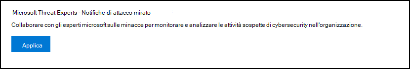
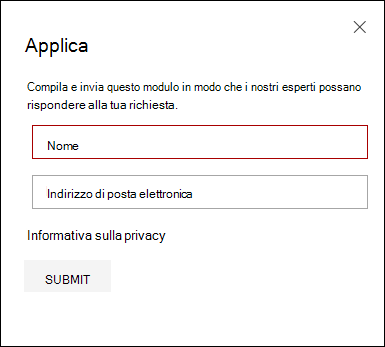
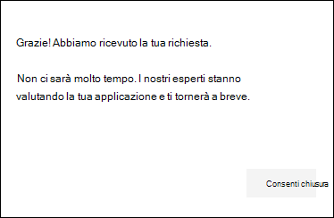
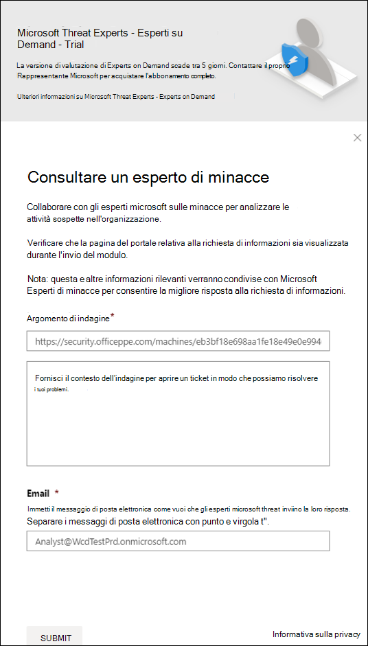
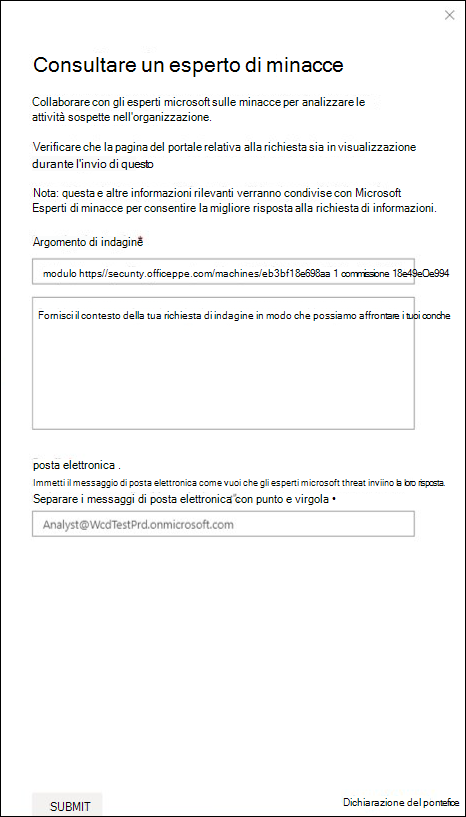

# Configurare e gestire le funzionalità di Microsoft Threat ExpertsConfigure and manage Microsoft Threat Experts capabilities

[!INCLUDE [Microsoft 365 Defender rebranding](../../includes/microsoft-defender.md)]

**Si applica a:****Applies to:**
- [Microsoft Defender per endpointMicrosoft Defender for Endpoint](https://go.microsoft.com/fwlink/p/?linkid=2154037)
- [Microsoft 365 DefenderMicrosoft 365 Defender](https://go.microsoft.com/fwlink/?linkid=2118804)

>Vuoi provare Defender per Endpoint?Want to experience Defender for Endpoint? [Iscriversi per una versione di valutazione gratuita.Sign up for a free trial.](https://www.microsoft.com/microsoft-365/windows/microsoft-defender-atp?ocid=docs-wdatp-assignaccess-abovefoldlink)

## Prima di iniziareBefore you begin 
> [!NOTE]
> Discutere i requisiti di idoneità con il provider di servizi tecnici Microsoft e il team dell'account prima di richiedere l'accesso a Microsoft Threat Experts - Servizio di ricerca delle minacce gestite di notifica di attacco mirato.Discuss the eligibility requirements with your Microsoft Technical Service provider and account team before you apply to Microsoft Threat Experts - Targeted Attack Notification managed threat hunting service.

Assicurati di aver distribuito Defender for Endpoint nel tuo ambiente con i dispositivi registrati e non solo in una configurazione di laboratorio.Ensure that you have Defender for Endpoint deployed in your environment with devices enrolled, and not just on a laboratory set-up.

Se sei un cliente di Defender for Endpoint, devi richiedere Microsoft Threat Experts **-** Notifiche di attacco mirate per ottenere informazioni e analisi speciali per identificare le minacce più critiche, in modo da poter rispondere rapidamente.If you're a Defender for Endpoint customer, you need to apply for **Microsoft Threat Experts - Targeted Attack Notifications** to get special insights and analysis to help identify the most critical threats, so you can respond to them quickly. Contattare il team dell'account o il rappresentante Microsoft per sottoscrivere Microsoft Threat Experts **- Esperti** su richiesta per consultare i nostri esperti sulle minacce su rilevamenti e avversari pertinenti.Contact your account team or Microsoft representative to subscribe to **Microsoft Threat Experts - Experts on Demand** to consult with our threat experts on relevant detections and adversaries.

## Candidarsi per Microsoft Threat Experts - Servizio Notifiche di attacco miratoApply for Microsoft Threat Experts - Targeted Attack Notifications service 
Se sei già un cliente di Defender for Endpoint, puoi candidarti tramite il Microsoft Defender Security Center.If you're already a Defender for Endpoint customer, you can apply through the Microsoft Defender Security Center. 

1. Dal riquadro di spostamento, passare a Impostazioni > **generale > funzionalità avanzate > Microsoft Threat Experts - Notifiche di attacco mirato**.From the navigation pane, go to **Settings > General > Advanced features > Microsoft Threat Experts - Targeted Attack Notifications**.

2. Fare clic su **Applica**.Click **Apply**.

    

3. Immettere il nome e l'indirizzo di posta elettronica in modo che Microsoft possa tornare all'applicazione.Enter your name and email address so that Microsoft can get back to you on your application.

    

4. Leggi [l'informativa sulla privacy,](https://privacy.microsoft.com/en-us/privacystatement)quindi fai clic su **Invia** al termine.Read the [privacy statement](https://privacy.microsoft.com/en-us/privacystatement), then click **Submit** when you're done. Una volta approvata l'applicazione, riceverai un messaggio di posta elettronica di benvenuto.You will receive a welcome email once your application is approved.

    

Una volta accettato, riceverai un messaggio di benvenuto e il pulsante **Applica** verrà modificato in un interruttore "attivato".When accepted, you will receive a welcome email and you will see the **Apply** button change to a toggle that is “on”. Nel caso in cui desideri uscire dal servizio Notifiche di attacco mirato, fai scorrere l'interruttore "off" e fai clic su **Salva** preferenze nella parte inferiore della pagina.In case you want to take yourself out of the Targeted Attack Notifications service, slide the toggle “off” and click **Save preferences** at the bottom of the page. 

## Dove vedrai le notifiche di attacco mirate da Microsoft Threat ExpertsWhere you'll see the targeted attack notifications from Microsoft Threat Experts 
È possibile ricevere una notifica di attacco mirato Microsoft Threat Experts tramite il supporto seguente:You can receive targeted attack notification from Microsoft Threat Experts through the following medium:  
- Pagina Eventi imprevisti del portale defender per **endpoint**The Defender for Endpoint portal's **Incidents** page 
- Dashboard degli avvisi del portale defender **per** endpointThe Defender for Endpoint portal's **Alerts** dashboard  
- API di avviso OData [e API](/windows/security/threat-protection/microsoft-defender-atp/get-alerts) [REST](/windows/security/threat-protection/microsoft-defender-atp/pull-alerts-using-rest-api)OData alerting [API](/windows/security/threat-protection/microsoft-defender-atp/get-alerts) and [REST API](/windows/security/threat-protection/microsoft-defender-atp/pull-alerts-using-rest-api)
- [Tabella DeviceAlertEvents](/windows/security/threat-protection/microsoft-defender-atp/advanced-hunting-devicealertevents-table) in Ricerca avanzata[DeviceAlertEvents](/windows/security/threat-protection/microsoft-defender-atp/advanced-hunting-devicealertevents-table) table in Advanced hunting
- Il messaggio di posta elettronica, se si sceglie di configurarloYour email, if you choose to configure it 

Per ricevere notifiche di attacco mirate tramite posta elettronica, creare una regola di notifica tramite posta elettronica.To receive targeted attack notifications through email, create an email notification rule.

### Creare una regola di notifica tramite posta elettronicaCreate an email notification rule 
È possibile creare regole per inviare notifiche tramite posta elettronica per i destinatari delle notifiche.You can create rules to send email notifications for notification recipients. Per  [informazioni dettagliate,](configure-email-notifications.md) vedere Configure alert notifications to create, edit, delete, or troubleshoot email notification.See  [Configure alert notifications](configure-email-notifications.md) to create, edit, delete, or troubleshoot email notification, for details.

## Visualizzare la notifica di attacco miratoView the targeted attack notification  
Inizierai a ricevere una notifica di attacco mirato Microsoft Threat Experts posta elettronica dopo aver configurato il sistema per ricevere la notifica tramite posta elettronica.You'll start receiving targeted attack notification from Microsoft Threat Experts in your email after you have configured your system to receive email notification.  

1. Fai clic sul collegamento nel messaggio di posta elettronica per passare al contesto di avviso corrispondente nel dashboard contrassegnato con **esperti di minacce.**Click the link in the email to go to the corresponding alert context in the dashboard tagged with **Threat experts**. 

2. Nel dashboard seleziona lo stesso argomento di avviso ricevuto dal messaggio di posta elettronica per visualizzare i dettagli.From the dashboard, select the same alert topic that you got from the email, to view the details.  

## Sottoscrizione a Microsoft Threat Experts - Esperti su richiestaSubscribe to Microsoft Threat Experts - Experts on Demand
È disponibile come servizio di sottoscrizione.This is available as a subscription service. Se sei già un cliente di Defender for Endpoint, puoi contattare il tuo rappresentante Microsoft per sottoscrivere Microsoft Threat Experts - Esperti su richiesta.If you're already a Defender for Endpoint customer, you can contact your Microsoft representative to subscribe to Microsoft Threat Experts - Experts on Demand. 

## Consultare un esperto di minacce Microsoft sulle attività sospette di cybersecurity nell'organizzazioneConsult a Microsoft threat expert about suspicious cybersecurity activities in your organization 
È possibile collaborare con Microsoft Threat Experts che possono essere coinvolti direttamente dall'interno del Microsoft Defender Security Center per una risposta accurata e immediata.You can partner with Microsoft Threat Experts who can be engaged directly from within the Microsoft Defender Security Center for timely and accurate response. Gli esperti forniscono informazioni dettagliate per comprendere meglio le minacce complesse, le notifiche di attacco mirate che si ottengono o se sono necessarie ulteriori informazioni sugli avvisi, su un dispositivo potenzialmente compromesso o su un contesto di intelligence per le minacce visualizzato nel dashboard del portale.Experts provide insights to better understand complex threats, targeted attack notifications that you get, or if you need more information about the alerts, a potentially compromised device, or a threat intelligence context that you see on your portal dashboard. 

> [!NOTE]
> - Le richieste di avviso relative ai dati di intelligence sulle minacce personalizzati dell'organizzazione non sono attualmente supportate.Alert inquiries related to your organization's customized threat intelligence data are currently not supported. Per informazioni dettagliate, consultare le operazioni di sicurezza o il team di risposta agli incidenti.Consult your security operations or incident response team for details.
> - È necessario disporre **dell'autorizzazione** Gestione impostazioni di sicurezza nel portale del Centro sicurezza per poter inviare un'indagine "Consultare un esperto di minacce".You need to have the **Manage security settings** permission in the Security Center portal to be able to submit a "Consult a threat expert" inquiry.

1. Passare alla pagina del portale con le informazioni rilevanti che si desidera analizzare, ad esempio la **pagina Evento** imprevisto.Navigate to the portal page with the relevant information that you'd like to investigate, for example, the **Incident** page. Assicurati che la pagina per l'avviso o il dispositivo pertinente sia in visualizzazione prima di inviare una richiesta di indagine.Ensure that the page for the relevant alert or device is in view before you send an investigation request. 

2. Scegliere ? dal menu in alto a **destra.**From the upper right-hand menu, click the **?** .icon. Quindi, selezionare **Consult a threat expert**.Then, select **Consult a threat expert**. 

    

    Viene visualizzata una schermata a comparsa.A flyout screen opens. La schermata seguente mostra quando si è in una sottoscrizione di valutazione.The following screen shows when you are on a trial subscription.

    

    La schermata seguente mostra quando si è in un abbonamento completo Microsoft Threat Experts - Esperti su richiesta.The following screen shows when you are on a full Microsoft Threat Experts - Experts on-Demand subscription.

    

    Il **campo dell'argomento** Richiesta di informazioni è precompilato con il collegamento alla pagina pertinente per la richiesta di indagine.The **Inquiry topic** field is pre-populated with the link to the relevant page for your investigation request. Ad esempio, un collegamento alla pagina dell'evento imprevisto, dell'avviso o dei dettagli del dispositivo in cui ti trovavi quando hai effettuato la richiesta.For example, a link to the incident, alert, or device details page that you were at when you made the request.

3.  Nel campo successivo, fornire informazioni sufficienti per fornire al Microsoft Threat Experts contesto sufficiente per avviare l'indagine.In the next field, provide enough information to give the Microsoft Threat Experts enough context to start the investigation.
  
4. Immettere l'indirizzo di posta elettronica che si desidera utilizzare per corrispondere a Microsoft Threat Experts.Enter the email address that you'd like to use to correspond with Microsoft Threat Experts.

> [!NOTE]
> Se si desidera tenere traccia dello stato dei casi esperti su richiesta tramite Hub dei servizi Microsoft, contattare il technical account manager.If you would like to track the status of your Experts on Demand cases through Microsoft Services Hub, reach out to your Technical Account Manager. 

Guarda questo video per una breve panoramica dell'hub dei servizi Microsoft.Watch this video for a quick overview of the Microsoft Services Hub.

>[!VIDEO https://www.microsoft.com/videoplayer/embed/RE4pk9f] 

   
## Argomenti di analisi di esempio che è possibile consultare con Microsoft Threat Experts - Esperti su richiestaSample investigation topics that you can consult with Microsoft Threat Experts - Experts on Demand 

**Informazioni sull'avviso****Alert information**
- Viene visualizzato un nuovo tipo di avviso per un file binario living-off-the-land: [AlertID].We see a new type of alert for a living-off-the-land binary: [AlertID]. Puoi dirci altre informazioni su questo avviso e su come possiamo analizzare ulteriormente?Can you tell us something more about this alert and how we can investigate further?
- Sono stati osservati due attacchi simili, che tentano di eseguire script di PowerShell dannosi ma generano avvisi diversi.We’ve observed two similar attacks, which try to execute malicious PowerShell scripts but generate different alerts. Uno è "Riga di comando di PowerShell sospetta" e l'altro è "È stato rilevato un file dannoso in base all'indicazione fornita da O365".One is "Suspicious PowerShell command line" and the other is "A malicious file was detected based on indication provided by O365". Qual è la differenza?What is the difference?
- Oggi viene visualizzato un avviso strano per il numero anomalo di accessi non riusciti dal dispositivo di un utente di alto profilo.I receive an odd alert today for abnormal number of failed logins from a high profile user’s device. Non è possibile trovare ulteriori prove su questi tentativi di accesso.I cannot find any further evidence around these sign-in attempts. In che modo Defender per Endpoint può visualizzare questi tentativi?How can Defender for Endpoint see these attempts? Che tipo di accesso viene monitorato?What type of sign-ins are being monitored?
- Puoi fornire più contesto o informazioni dettagliate su questo avviso: "È stato osservato un comportamento sospetto da parte di un'utilità di sistema".Can you give more context or insights about this alert: “Suspicious behavior by a system utility was observed”. 

**Possibile compromissione del computer****Possible machine compromise**
- Puoi rispondere al motivo per cui viene visualizzato "Processo sconosciuto osservato?"Can you help answer why we see “Unknown process observed?” Questo messaggio o avviso viene visualizzato frequentemente in molti dispositivi.This message or alert is seen frequently on many devices. Apprezziamo qualsiasi input per chiarire se questo messaggio o avviso è correlato ad attività dannose.We appreciate any input to clarify whether this message or alert is related to malicious activity.
- È possibile convalidare una possibile compromissione nel sistema seguente in [data] con comportamenti simili a quelli del rilevamento malware [nome malware] precedente nello stesso sistema in [mese]?Can you help validate a possible compromise on the following system on [date] with similar behaviors as the previous [malware name] malware detection on the same system in [month]?

**Dettagli di Intelligence per le minacce****Threat intelligence details**
- È stato rilevato un messaggio di posta elettronica di phishing che ha recapitato un documento di Word dannoso a un utente.We detected a phishing email that delivered a malicious Word document to a user. Il documento di Word dannoso ha causato una serie di eventi sospetti, che hanno attivato più avvisi di Microsoft Defender per il malware [nome malware].The malicious Word document caused a series of suspicious events, which triggered multiple Microsoft Defender alerts for [malware name] malware. Hai informazioni su questo malware?Do you have any information on this malware? In caso affermativa, è possibile inviarmi un collegamento?If yes, can you send me a link?
- Di recente ho visto un post [di riferimento sui social media, ad esempio Twitter o blog] su una minaccia mirata al mio settore.I recently saw a [social media reference, for example, Twitter or blog] post about a threat that is targeting my industry. Puoi aiutarmi a capire quale protezione offre Defender for Endpoint contro questo attore di minacce?Can you help me understand what protection Defender for Endpoint provides against this threat actor? 

**Microsoft Threat Experts di avviso****Microsoft Threat Experts’ alert communications** 
- Il team di risposta agli incidenti può aiutarci a risolvere la notifica di attacco mirato che abbiamo ricevuto?Can your incident response team help us address the targeted attack notification that we got?
- Ho ricevuto questa notifica di attacco mirato da Microsoft Threat Experts.I received this targeted attack notification from Microsoft Threat Experts. Non abbiamo un team di risposta agli eventi imprevisti.We don’t have our own incident response team. Cosa possiamo fare ora e come possiamo contenere l'incidente?What can we do now, and how can we contain the incident?
- Ho ricevuto una notifica di attacco mirato da Microsoft Threat Experts.I received a targeted attack notification from Microsoft Threat Experts. Quali dati è possibile fornire al team di risposta agli incidenti?What data can you provide to us that we can pass on to our incident response team?

  >[!NOTE]
  >Microsoft Threat Experts è un servizio di ricerca della sicurezza informatica gestito e non un servizio di risposta agli incidenti.Microsoft Threat Experts is a managed cybersecurity hunting service and not an incident response service. Tuttavia, gli esperti possono passare senza problemi l'indagine ai servizi daRT (Detection and Response Team) di Microsoft Cybersecurity Solutions Group (CSG), se necessario.However, the experts can seamlessly transition the investigation to Microsoft Cybersecurity Solutions Group (CSG)'s  Detection and Response Team (DART) services, when necessary. È inoltre possibile scegliere di interagire con il proprio team di risposta agli incidenti per risolvere i problemi che richiedono una risposta agli eventi imprevisti.You can also opt to engage with your own incident response team to address issues that requires an incident response. 

## ScenarioScenario

### Ricevere un rapporto sullo stato della richiesta di ricerca gestitaReceive a progress report about your managed hunting inquiry 
La risposta Microsoft Threat Experts varia in base all'indagine.Response from Microsoft Threat Experts varies according to your inquiry. Entro due giorni verrà inviato  un rapporto sullo stato di avanzamento dell'indagine consulti un esperto delle minacce per comunicare lo stato dell'indagine dalle categorie seguenti:They will email a progress report to you about your **Consult a threat expert** inquiry within two days, to communicate the investigation status from the following categories: 
- Sono necessarie ulteriori informazioni per proseguire con l'indagineMore information is needed to continue with the investigation 
- Per determinare il contesto tecnico sono necessari uno o più esempi di fileA file or several file samples are needed to determine the technical context 
- L'indagine richiede più tempoInvestigation requires more time   
- Le informazioni iniziali sono sufficienti per concludere l'indagineInitial information was enough to conclude the investigation 

È fondamentale rispondere rapidamente per mantenere l'indagine in movimento.It is crucial to respond in quickly to keep the investigation moving. 

## Argomento correlatoRelated topic
- [Panoramica di Microsoft Threat ExpertsMicrosoft Threat Experts overview](microsoft-threat-experts.md)
- [Microsoft Threat Experts in Microsoft 365 panoramicaMicrosoft Threat Experts in Microsoft 365 Overview](/microsoft-365/security/mtp/microsoft-threat-experts)
