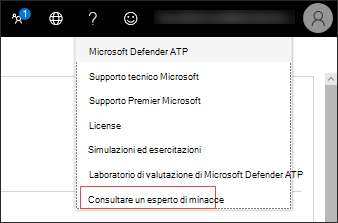

# Configurare e gestire le funzionalità di Microsoft Threat Experts

[!INCLUDE [Microsoft 365 Defender rebranding](../../includes/microsoft-defender.md)]

**Si applica a:**
- [Microsoft Defender ATP](https://go.microsoft.com/fwlink/p/?linkid=2154037)
- [Microsoft 365 Defender](https://go.microsoft.com/fwlink/?linkid=2118804)

>Vuoi provare Defender per Endpoint? [Iscriversi per una versione di valutazione gratuita.](https://www.microsoft.com/microsoft-365/windows/microsoft-defender-atp?ocid=docs-wdatp-assignaccess-abovefoldlink)

## Prima di iniziare 
> [!NOTE]
> Discutere i requisiti di idoneità con il provider di servizi tecnici Microsoft e il team dell'account prima di richiedere la richiesta a Microsoft Threat Experts - Targeted Attack Notification managed threat hunting service.

Assicurati di aver distribuito Defender for Endpoint nel tuo ambiente con i dispositivi registrati e non solo in una configurazione di laboratorio.

Se sei un cliente di Defender for Endpoint, devi richiedere esperti di microsoft **threat - Notifiche** di attacco mirate per ottenere informazioni e analisi speciali per identificare le minacce più critiche, in modo da poter rispondere rapidamente. Contattare il team dell'account o il rappresentante Microsoft per sottoscrivere microsoft **Threat Experts - Experts on Demand** per consultare i nostri esperti sulle minacce su rilevamenti e avversari pertinenti.

## Richiedere esperti di microsoft threat - Servizio notifiche di attacchi mirati 
Se sei già un cliente di Defender for Endpoint, puoi candidarti tramite Microsoft Defender Security Center. 

1. Dal riquadro di spostamento passare a Impostazioni > generale > funzionalità avanzate **> Microsoft Threat Experts - Notifiche di attacco mirato.**

2. Fare clic su **Applica**.

    

3. Immettere il nome e l'indirizzo di posta elettronica in modo che Microsoft possa tornare all'applicazione.

    

4. Leggi [l'informativa sulla privacy,](https://privacy.microsoft.com/en-us/privacystatement)quindi fai clic su **Invia** al termine. Una volta approvata l'applicazione, riceverai un messaggio di posta elettronica di benvenuto.

    

Una volta accettato, riceverai un messaggio di benvenuto e il pulsante **Applica** verrà modificato in un interruttore "attivato". Nel caso in cui desideri uscire dal servizio Notifiche di attacco mirato, fai scorrere l'interruttore "off" e fai clic su **Salva** preferenze nella parte inferiore della pagina. 

## Dove vedrai le notifiche di attacchi mirati di Microsoft Threat Experts 
È possibile ricevere una notifica di attacco mirato dagli esperti microsoft sulle minacce tramite il supporto seguente:  
- Pagina Eventi imprevisti del portale defender per **endpoint** 
- Dashboard degli avvisi del portale defender **per** endpoint  
- API di avviso OData [e API](https://docs.microsoft.com/windows/security/threat-protection/microsoft-defender-atp/get-alerts) [REST](https://docs.microsoft.com/windows/security/threat-protection/microsoft-defender-atp/pull-alerts-using-rest-api)
- [Tabella DeviceAlertEvents](https://docs.microsoft.com/windows/security/threat-protection/microsoft-defender-atp/advanced-hunting-devicealertevents-table) in Ricerca avanzata
- Il messaggio di posta elettronica, se si sceglie di configurarlo 

Per ricevere notifiche di attacco mirate tramite posta elettronica, creare una regola di notifica tramite posta elettronica.

### Creare una regola di notifica tramite posta elettronica 
È possibile creare regole per inviare notifiche tramite posta elettronica per i destinatari delle notifiche. Per  [informazioni dettagliate,](configure-email-notifications.md) vedere Configure alert notifications to create, edit, delete, or troubleshoot email notification.

## Visualizzare la notifica di attacco mirato  
Inizierai a ricevere una notifica di attacco mirato dagli esperti microsoft threat nella posta elettronica dopo aver configurato il sistema per ricevere la notifica tramite posta elettronica.  

1. Fai clic sul collegamento nel messaggio di posta elettronica per passare al contesto di avviso corrispondente nel dashboard contrassegnato con **esperti di minacce.** 

2. Nel dashboard seleziona lo stesso argomento di avviso ricevuto dal messaggio di posta elettronica per visualizzare i dettagli.  

## Abbonati a Microsoft Threat Experts - Esperti su richiesta
È disponibile come servizio di sottoscrizione. Se sei già un cliente di Defender for Endpoint, puoi contattare il tuo rappresentante Microsoft per sottoscrivere Microsoft Threat Experts - Experts on Demand. 

## Consultare un esperto di minacce Microsoft sulle attività sospette di cybersecurity nell'organizzazione 
Puoi collaborare con esperti microsoft sulle minacce che possono essere coinvolti direttamente da Microsoft Defender Security Center per una risposta accurata e immediata. Gli esperti forniscono informazioni dettagliate per comprendere meglio le minacce complesse, le notifiche di attacco mirate che si ottengono o se sono necessarie ulteriori informazioni sugli avvisi, su un dispositivo potenzialmente compromesso o su un contesto di intelligence per le minacce visualizzato nel dashboard del portale. 

> [!NOTE]
> - Le richieste di avviso relative ai dati di intelligence sulle minacce personalizzati dell'organizzazione non sono attualmente supportate. Per informazioni dettagliate, consultare le operazioni di sicurezza o il team di risposta agli incidenti.
> - È necessario disporre **dell'autorizzazione** Gestione impostazioni di sicurezza nel portale del Centro sicurezza per poter inviare un'indagine "Consultare un esperto di minacce".

1. Passare alla pagina del portale con le informazioni rilevanti che si desidera analizzare, ad esempio la **pagina Evento** imprevisto. Assicurati che la pagina per l'avviso o il dispositivo pertinente sia in visualizzazione prima di inviare una richiesta di indagine. 

2. Scegliere ? dal menu in alto a **destra.** . Quindi, selezionare **Consult a threat expert**. 

    

    Viene visualizzata una schermata a comparsa. La schermata seguente mostra quando si è in una sottoscrizione di valutazione.

    

    La schermata seguente mostra quando si è su un abbonamento completo a Microsoft Threat Experts - Experts on-Demand.

    

    Il **campo dell'argomento** Richiesta di informazioni è precompilato con il collegamento alla pagina pertinente per la richiesta di indagine. Ad esempio, un collegamento alla pagina dell'evento imprevisto, dell'avviso o dei dettagli del dispositivo in cui ti trovavi quando hai effettuato la richiesta.

3.  Nel campo successivo, fornire informazioni sufficienti per fornire agli esperti di microsoft threat un contesto sufficiente per avviare l'indagine.
  
4. Immettere l'indirizzo di posta elettronica che si desidera utilizzare per la corrispondenza con microsoft threat experts.

> [!NOTE]
> Se si desidera tenere traccia dello stato dei casi esperti su richiesta tramite Hub dei servizi Microsoft, contattare il technical account manager. 

Guarda questo video per una breve panoramica dell'hub dei servizi Microsoft.

>[!VIDEO https://www.microsoft.com/videoplayer/embed/RE4pk9f] 

   
## Argomenti di analisi di esempio che è possibile consultare con gli esperti di Microsoft Threat - Esperti su richiesta 

**Informazioni sull'avviso**
- Viene visualizzato un nuovo tipo di avviso per un file binario living-off-the-land: [AlertID]. Puoi dirci altre informazioni su questo avviso e su come possiamo analizzare ulteriormente?
- Sono stati osservati due attacchi simili, che tentano di eseguire script di PowerShell dannosi ma generano avvisi diversi. Uno è "Riga di comando di PowerShell sospetta" e l'altro è "È stato rilevato un file dannoso in base all'indicazione fornita da O365". Qual è la differenza?
- Oggi viene visualizzato un avviso strano per il numero anomalo di accessi non riusciti dal dispositivo di un utente di alto profilo. Non è possibile trovare ulteriori prove su questi tentativi di accesso. In che modo Defender per Endpoint può visualizzare questi tentativi? Che tipo di accesso viene monitorato?
- Puoi fornire più contesto o informazioni dettagliate su questo avviso: "È stato osservato un comportamento sospetto da parte di un'utilità di sistema". 

**Possibile compromissione del computer**
- Puoi rispondere al motivo per cui viene visualizzato "Processo sconosciuto osservato?" Questo messaggio o avviso viene visualizzato frequentemente in molti dispositivi. Apprezziamo qualsiasi input per chiarire se questo messaggio o avviso è correlato ad attività dannose.
- È possibile convalidare una possibile compromissione nel sistema seguente in [data] con comportamenti simili a quelli del rilevamento malware [nome malware] precedente nello stesso sistema in [mese]?

**Dettagli di Intelligence per le minacce**
- È stato rilevato un messaggio di posta elettronica di phishing che ha recapitato un documento di Word dannoso a un utente. Il documento di Word dannoso ha causato una serie di eventi sospetti, che hanno attivato più avvisi di Microsoft Defender per il malware [nome malware]. Hai informazioni su questo malware? In caso affermativa, è possibile inviarmi un collegamento?
- Di recente ho visto un post [di riferimento sui social media, ad esempio Twitter o blog] su una minaccia mirata al mio settore. Puoi aiutarmi a capire quale protezione offre Defender for Endpoint contro questo attore di minacce? 

**Comunicazioni di avviso di Microsoft Threat Experts** 
- Il team di risposta agli incidenti può aiutarci a risolvere la notifica di attacco mirato che abbiamo ricevuto?
- Ho ricevuto questa notifica di attacco mirato da microsoft threat experts. Non abbiamo un team di risposta agli eventi imprevisti. Cosa possiamo fare ora e come possiamo contenere l'incidente?
- Ho ricevuto una notifica di attacco mirato da Microsoft Threat Experts. Quali dati è possibile fornire al team di risposta agli incidenti?

  >[!NOTE]
  >Microsoft Threat Experts è un servizio di ricerca di cybersecurity gestito e non un servizio di risposta agli incidenti. Tuttavia, gli esperti possono passare senza problemi l'indagine ai servizi daRT (Detection and Response Team) di Microsoft Cybersecurity Solutions Group (CSG), se necessario. È inoltre possibile scegliere di interagire con il proprio team di risposta agli incidenti per risolvere i problemi che richiedono una risposta agli eventi imprevisti. 

## Scenario

### Ricevere un rapporto sullo stato della richiesta di ricerca gestita 
La risposta di Microsoft Threat Experts varia a seconda dell'indagine. Entro due giorni verrà inviato  un rapporto sullo stato di avanzamento dell'indagine consulti un esperto delle minacce per comunicare lo stato dell'indagine dalle categorie seguenti: 
- Sono necessarie ulteriori informazioni per proseguire con l'indagine 
- Per determinare il contesto tecnico sono necessari uno o più esempi di file 
- L'indagine richiede più tempo   
- Le informazioni iniziali sono sufficienti per concludere l'indagine 

È fondamentale rispondere rapidamente per mantenere l'indagine in movimento. 

## Argomento correlato
- [Panoramica di Microsoft Threat Experts](microsoft-threat-experts.md)
