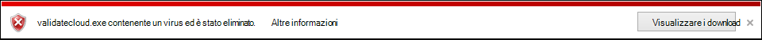
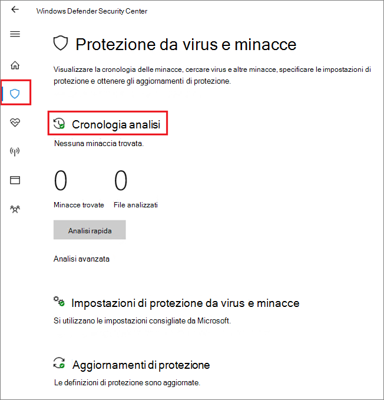

# <a name="configure-and-validate-microsoft-defender-antivirus-network-connections"></a><span data-ttu-id="5a707-104">Configurare e convalidare le connessioni di rete di Windows Defender Antivirus</span><span class="sxs-lookup"><span data-stu-id="5a707-104">Configure and validate Microsoft Defender Antivirus network connections</span></span>

[!INCLUDE [Microsoft 365 Defender rebranding](../../includes/microsoft-defender.md)]


<span data-ttu-id="5a707-105">**Si applica a:**</span><span class="sxs-lookup"><span data-stu-id="5a707-105">**Applies to:**</span></span>

- [<span data-ttu-id="5a707-106">Microsoft Defender per endpoint</span><span class="sxs-lookup"><span data-stu-id="5a707-106">Microsoft Defender for Endpoint</span></span>](/microsoft-365/security/defender-endpoint/)

<span data-ttu-id="5a707-107">Per garantire il corretto funzionamento della protezione con distribuzione cloud di Microsoft Defender Antivirus, è necessario configurare la rete in modo da consentire le connessioni tra gli endpoint e alcuni server Microsoft.</span><span class="sxs-lookup"><span data-stu-id="5a707-107">To ensure Microsoft Defender Antivirus cloud-delivered protection works properly, you need to configure your network to allow connections between your endpoints and certain Microsoft servers.</span></span>

<span data-ttu-id="5a707-108">In questo articolo vengono elencate le connessioni che devono essere consentite, ad esempio utilizzando le regole del firewall, e vengono fornite istruzioni per convalidare la connessione.</span><span class="sxs-lookup"><span data-stu-id="5a707-108">This article lists the connections that must be allowed, such as by using firewall rules, and provides instructions for validating your connection.</span></span> <span data-ttu-id="5a707-109">La configurazione corretta della protezione consente di ottenere il massimo valore dai servizi di protezione garantiti dal cloud.</span><span class="sxs-lookup"><span data-stu-id="5a707-109">Configuring your protection properly helps ensure that you receive the best value from your cloud-delivered protection services.</span></span>

<span data-ttu-id="5a707-110">Vedere il post di blog [Modifiche importanti all'endpoint di Microsoft Active Protection Services](https://techcommunity.microsoft.com/t5/Configuration-Manager-Archive/Important-changes-to-Microsoft-Active-Protection-Service-MAPS/ba-p/274006) per alcuni dettagli sulla connettività di rete.</span><span class="sxs-lookup"><span data-stu-id="5a707-110">See the blog post [Important changes to Microsoft Active Protection Services endpoint](https://techcommunity.microsoft.com/t5/Configuration-Manager-Archive/Important-changes-to-Microsoft-Active-Protection-Service-MAPS/ba-p/274006) for some details about network connectivity.</span></span>

>[!TIP]
><span data-ttu-id="5a707-111">Puoi anche visitare il sito Web demo di Microsoft Defender for Endpoint [all'indirizzo demo.wd.microsoft.com](https://demo.wd.microsoft.com?ocid=cx-wddocs-testground) per verificare che le funzionalità seguenti funzionino:</span><span class="sxs-lookup"><span data-stu-id="5a707-111">You can also visit the Microsoft Defender for Endpoint demo website at [demo.wd.microsoft.com](https://demo.wd.microsoft.com?ocid=cx-wddocs-testground) to confirm the following features are working:</span></span>
>
>- <span data-ttu-id="5a707-112">Protezione basata sul cloud</span><span class="sxs-lookup"><span data-stu-id="5a707-112">Cloud-delivered protection</span></span>
>- <span data-ttu-id="5a707-113">Apprendimento rapido (incluso blocco a prima vista)</span><span class="sxs-lookup"><span data-stu-id="5a707-113">Fast learning (including block at first sight)</span></span>
>- <span data-ttu-id="5a707-114">Blocco di applicazioni potenzialmente indesiderate</span><span class="sxs-lookup"><span data-stu-id="5a707-114">Potentially unwanted application blocking</span></span>

## <a name="allow-connections-to-the-microsoft-defender-antivirus-cloud-service"></a><span data-ttu-id="5a707-115">Consenti connessioni al servizio cloud Microsoft Defender Antivirus</span><span class="sxs-lookup"><span data-stu-id="5a707-115">Allow connections to the Microsoft Defender Antivirus cloud service</span></span>

<span data-ttu-id="5a707-116">Il servizio cloud Microsoft Defender Antivirus fornisce una protezione rapida e avanzata per gli endpoint.</span><span class="sxs-lookup"><span data-stu-id="5a707-116">The Microsoft Defender Antivirus cloud service provides fast, strong protection for your endpoints.</span></span> <span data-ttu-id="5a707-117">L'abilitazione del servizio di protezione fornita dal cloud è facoltativa, tuttavia è altamente consigliata perché fornisce una protezione importante contro il malware sugli endpoint e sulla rete.</span><span class="sxs-lookup"><span data-stu-id="5a707-117">Enabling the cloud-delivered protection service is optional, however it's highly recommended because it provides important protection against malware on your endpoints and across your network.</span></span>

>[!NOTE]
><span data-ttu-id="5a707-118">Il servizio cloud Microsoft Defender Antivirus è un meccanismo per fornire una protezione aggiornata alla rete e agli endpoint.</span><span class="sxs-lookup"><span data-stu-id="5a707-118">The Microsoft Defender Antivirus cloud service is a mechanism for delivering updated protection to your network and endpoints.</span></span> <span data-ttu-id="5a707-119">Anche se viene definito servizio cloud, non si tratta semplicemente di protezione per i file archiviati nel cloud, bensì di risorse distribuite e machine learning per fornire protezione agli endpoint a una velocità molto più veloce rispetto agli aggiornamenti tradizionali di Security Intelligence.</span><span class="sxs-lookup"><span data-stu-id="5a707-119">Although it's called a cloud service, it's not simply protection for files stored in the cloud, rather it uses distributed resources and machine learning to deliver protection to your endpoints at a rate that is far faster than traditional Security intelligence updates.</span></span>

<span data-ttu-id="5a707-120">Per informazioni dettagliate sull'abilitazione del servizio con Intune, Microsoft Endpoint Configuration Manager, Criteri di gruppo, cmdlet di PowerShell o su singoli client nell'app Sicurezza di Windows, vedere Enable [cloud-delivered protection.](enable-cloud-protection-microsoft-defender-antivirus.md)</span><span class="sxs-lookup"><span data-stu-id="5a707-120">See [Enable cloud-delivered protection](enable-cloud-protection-microsoft-defender-antivirus.md) for details on enabling the service with Intune, Microsoft Endpoint Configuration Manager, Group Policy, PowerShell cmdlets, or on individual clients in the Windows Security app.</span></span> 

<span data-ttu-id="5a707-121">Dopo aver abilitato il servizio, potrebbe essere necessario configurare la rete o il firewall per consentire le connessioni tra il servizio e gli endpoint.</span><span class="sxs-lookup"><span data-stu-id="5a707-121">After you've enabled the service, you may need to configure your network or firewall to allow connections between it and your endpoints.</span></span>

<span data-ttu-id="5a707-122">Poiché la protezione è un servizio cloud, i computer devono avere accesso a Internet e raggiungere i servizi di apprendimento automatico di Microsoft Defender per Office 365.</span><span class="sxs-lookup"><span data-stu-id="5a707-122">Because your protection is a cloud service, computers must have access to the internet and reach the Microsoft Defender for Office 365 machine learning services.</span></span> <span data-ttu-id="5a707-123">Non escludere l'URL `*.blob.core.windows.net` da qualsiasi tipo di ispezione di rete.</span><span class="sxs-lookup"><span data-stu-id="5a707-123">Don't exclude the URL `*.blob.core.windows.net` from any kind of network inspection.</span></span> 

<span data-ttu-id="5a707-124">Nella tabella seguente sono elencati i servizi e gli URL associati.</span><span class="sxs-lookup"><span data-stu-id="5a707-124">The table below lists the services and their associated URLs.</span></span> <span data-ttu-id="5a707-125">Assicurarsi che non vi siano regole di filtro firewall o di rete che neghino l'accesso a questi URL oppure potrebbe essere necessario creare una regola di autorizzazione specifica per tali URL (ad esclusione `*.blob.core.windows.net` dell'URL).</span><span class="sxs-lookup"><span data-stu-id="5a707-125">Make sure that there are no firewall or network filtering rules denying access to these URLs, or you may need to create an allow rule specifically for them (excluding the URL `*.blob.core.windows.net`).</span></span> <span data-ttu-id="5a707-126">Di seguito vengono indicati gli URL che utilizzano la porta 443 per le comunicazioni.</span><span class="sxs-lookup"><span data-stu-id="5a707-126">Below mention URLs are using port 443 for communication.</span></span>


| <span data-ttu-id="5a707-127">**Servizio**</span><span class="sxs-lookup"><span data-stu-id="5a707-127">**Service**</span></span>| <span data-ttu-id="5a707-128">**Descrizione**</span><span class="sxs-lookup"><span data-stu-id="5a707-128">**Description**</span></span> |<span data-ttu-id="5a707-129">**URL**</span><span class="sxs-lookup"><span data-stu-id="5a707-129">**URL**</span></span> |
| :--: | :-- | :-- |
| <span data-ttu-id="5a707-130">Servizio di protezione fornito dal cloud di Microsoft Defender Antivirus, noto anche come Microsoft Active Protection Service (MAPS)</span><span class="sxs-lookup"><span data-stu-id="5a707-130">Microsoft Defender Antivirus cloud-delivered protection service, also referred to as Microsoft Active Protection Service (MAPS)</span></span>|<span data-ttu-id="5a707-131">Usato da Microsoft Defender Antivirus per fornire protezione da cloud</span><span class="sxs-lookup"><span data-stu-id="5a707-131">Used by Microsoft Defender Antivirus to provide cloud-delivered protection</span></span>|`*.wdcp.microsoft.com` <br/> `*.wdcpalt.microsoft.com` <br/> `*.wd.microsoft.com`|
| <span data-ttu-id="5a707-132">Microsoft Update Service (MU)</span><span class="sxs-lookup"><span data-stu-id="5a707-132">Microsoft Update Service (MU)</span></span> <br/> <span data-ttu-id="5a707-133">Servizio Windows Update (WU)</span><span class="sxs-lookup"><span data-stu-id="5a707-133">Windows Update Service (WU)</span></span>|  <span data-ttu-id="5a707-134">Informazioni sulla sicurezza e aggiornamenti dei prodotti</span><span class="sxs-lookup"><span data-stu-id="5a707-134">Security intelligence and product updates</span></span>   |`*.update.microsoft.com` <br/> `*.delivery.mp.microsoft.com`<br/> `*.windowsupdate.com` <br/><br/> <span data-ttu-id="5a707-135">Per informazioni [dettagliate, vedere Endpoint di connessione per Windows Update](/windows/privacy/manage-windows-1709-endpoints#windows-update)</span><span class="sxs-lookup"><span data-stu-id="5a707-135">For details see [Connection endpoints for Windows Update](/windows/privacy/manage-windows-1709-endpoints#windows-update)</span></span>|
|<span data-ttu-id="5a707-136">Aggiornamenti di Intelligence per la sicurezza Percorso di download alternativo (ADL)</span><span class="sxs-lookup"><span data-stu-id="5a707-136">Security intelligence updates Alternate Download Location (ADL)</span></span>|   <span data-ttu-id="5a707-137">Posizione alternativa per gli aggiornamenti di Microsoft Defender Antivirus Security intelligence se l'intelligence di sicurezza installata non è aggiornata (7 o più giorni dopo)</span><span class="sxs-lookup"><span data-stu-id="5a707-137">Alternate location for Microsoft Defender Antivirus Security intelligence updates if the installed Security intelligence is out of date (7 or more days behind)</span></span>|    `*.download.microsoft.com`  </br> `*.download.windowsupdate.com`</br> `https://fe3cr.delivery.mp.microsoft.com/ClientWebService/client.asmx`|
| <span data-ttu-id="5a707-138">Spazio di archiviazione per l'invio di malware</span><span class="sxs-lookup"><span data-stu-id="5a707-138">Malware submission storage</span></span>|<span data-ttu-id="5a707-139">Percorso di caricamento per i file inviati a Microsoft tramite il modulo di invio o l'invio automatico di esempio</span><span class="sxs-lookup"><span data-stu-id="5a707-139">Upload location for files submitted to Microsoft via the Submission form or automatic sample submission</span></span>    | `ussus1eastprod.blob.core.windows.net` <br/>    `ussus2eastprod.blob.core.windows.net` <br/>    `ussus3eastprod.blob.core.windows.net` <br/>    `ussus4eastprod.blob.core.windows.net` <br/>    `wsus1eastprod.blob.core.windows.net` <br/>    `wsus2eastprod.blob.core.windows.net` <br/>    `ussus1westprod.blob.core.windows.net` <br/>    `ussus2westprod.blob.core.windows.net` <br/>    `ussus3westprod.blob.core.windows.net` <br/>    `ussus4westprod.blob.core.windows.net` <br/>    `wsus1westprod.blob.core.windows.net` <br/>    `wsus2westprod.blob.core.windows.net` <br/>    `usseu1northprod.blob.core.windows.net` <br/>    `wseu1northprod.blob.core.windows.net` <br/>    `usseu1westprod.blob.core.windows.net` <br/>    `wseu1westprod.blob.core.windows.net` <br/>    `ussuk1southprod.blob.core.windows.net` <br/>    `wsuk1southprod.blob.core.windows.net` <br/>    `ussuk1westprod.blob.core.windows.net` <br/>    `wsuk1westprod.blob.core.windows.net` |
| <span data-ttu-id="5a707-140">Elenco di revoche di certificati (CRL)</span><span class="sxs-lookup"><span data-stu-id="5a707-140">Certificate Revocation List (CRL)</span></span>|<span data-ttu-id="5a707-141">Utilizzato da Windows durante la creazione della connessione SSL a MAPS per l'aggiornamento del CRL</span><span class="sxs-lookup"><span data-stu-id="5a707-141">Used by Windows when creating the SSL connection to MAPS for updating the CRL</span></span>   | `http://www.microsoft.com/pkiops/crl/` <br/> `http://www.microsoft.com/pkiops/certs` <br/>   `http://crl.microsoft.com/pki/crl/products` <br/> `http://www.microsoft.com/pki/certs` |
| <span data-ttu-id="5a707-142">Archivio simboli</span><span class="sxs-lookup"><span data-stu-id="5a707-142">Symbol Store</span></span>|<span data-ttu-id="5a707-143">Utilizzato da Microsoft Defender Antivirus per ripristinare determinati file critici durante i flussi di correzione</span><span class="sxs-lookup"><span data-stu-id="5a707-143">Used by Microsoft Defender Antivirus to restore certain critical files during remediation flows</span></span>  | `https://msdl.microsoft.com/download/symbols` |
| <span data-ttu-id="5a707-144">Client di telemetria universale</span><span class="sxs-lookup"><span data-stu-id="5a707-144">Universal Telemetry Client</span></span>| <span data-ttu-id="5a707-145">Usato da Windows per inviare dati di diagnostica client; Microsoft Defender Antivirus usa la telemetria per il monitoraggio della qualità del prodotto</span><span class="sxs-lookup"><span data-stu-id="5a707-145">Used by Windows to send client diagnostic data; Microsoft Defender Antivirus uses telemetry for product quality monitoring purposes</span></span>   | <span data-ttu-id="5a707-146">L'aggiornamento utilizza SSL (porta TCP 443) per scaricare manifesti e caricare dati di diagnostica in Microsoft che utilizza gli endpoint DNS seguenti:   `vortex-win.data.microsoft.com`</span><span class="sxs-lookup"><span data-stu-id="5a707-146">The update uses SSL (TCP Port 443) to download manifests and upload diagnostic data to Microsoft that uses the following DNS endpoints:   `vortex-win.data.microsoft.com`</span></span> <br/>   `settings-win.data.microsoft.com`|

## <a name="validate-connections-between-your-network-and-the-cloud"></a><span data-ttu-id="5a707-147">Convalidare le connessioni tra la rete e il cloud</span><span class="sxs-lookup"><span data-stu-id="5a707-147">Validate connections between your network and the cloud</span></span>

<span data-ttu-id="5a707-148">Dopo aver consentito gli URL elencati in precedenza, puoi verificare se sei connesso al servizio cloud Microsoft Defender Antivirus e stai correttamente segnalando e ricevendo informazioni per assicurarti di essere completamente protetto.</span><span class="sxs-lookup"><span data-stu-id="5a707-148">After allowing the URLs listed above, you can test if you're connected to the Microsoft Defender Antivirus cloud service and are correctly reporting and receiving information to ensure you're fully protected.</span></span>

<span data-ttu-id="5a707-149">**Usa lo strumento cmdline per convalidare la protezione consegnata dal cloud:**</span><span class="sxs-lookup"><span data-stu-id="5a707-149">**Use the cmdline tool to validate cloud-delivered protection:**</span></span>

<span data-ttu-id="5a707-150">Utilizzare l'argomento seguente con l'utilità da riga di comando ( ) di Microsoft Defender Antivirus per verificare che la rete possa comunicare con il servizio `mpcmdrun.exe` cloud Microsoft Defender Antivirus:</span><span class="sxs-lookup"><span data-stu-id="5a707-150">Use the following argument with the Microsoft Defender Antivirus command-line utility (`mpcmdrun.exe`) to verify that your network can communicate with the Microsoft Defender Antivirus cloud service:</span></span>

```console
"%ProgramFiles%\Windows Defender\MpCmdRun.exe" -ValidateMapsConnection
```

> [!NOTE]
> <span data-ttu-id="5a707-151">È necessario aprire una versione a livello di amministratore del prompt dei comandi.</span><span class="sxs-lookup"><span data-stu-id="5a707-151">You need to open an administrator-level version of the command prompt.</span></span> <span data-ttu-id="5a707-152">Fare clic con il pulsante destro del mouse sull'elemento nel menu Start, scegliere Esegui come **amministratore** e fare clic su **Sì** al prompt delle autorizzazioni.</span><span class="sxs-lookup"><span data-stu-id="5a707-152">Right-click the item in the Start menu, click **Run as administrator** and click **Yes** at the permissions prompt.</span></span> <span data-ttu-id="5a707-153">Questo comando funzionerà solo in Windows 10 versione 1703 o successiva.</span><span class="sxs-lookup"><span data-stu-id="5a707-153">This command will only work on Windows 10, version 1703 or higher.</span></span>

<span data-ttu-id="5a707-154">Per ulteriori informazioni, vedere [Manage Microsoft Defender Antivirus with the mpcmdrun.exe commandline tool](command-line-arguments-microsoft-defender-antivirus.md).</span><span class="sxs-lookup"><span data-stu-id="5a707-154">For more information, see [Manage Microsoft Defender Antivirus with the mpcmdrun.exe commandline tool](command-line-arguments-microsoft-defender-antivirus.md).</span></span>

<span data-ttu-id="5a707-155">**Tentare di scaricare un file di malware contraffatto da Microsoft:**</span><span class="sxs-lookup"><span data-stu-id="5a707-155">**Attempt to download a fake malware file from Microsoft:**</span></span>

<span data-ttu-id="5a707-156">Puoi scaricare un file di esempio che Microsoft Defender Antivirus rileverà e bloccherà se sei connesso correttamente al cloud.</span><span class="sxs-lookup"><span data-stu-id="5a707-156">You can download a sample file that Microsoft Defender Antivirus will detect and block if you're properly connected to the cloud.</span></span>

<span data-ttu-id="5a707-157">Scaricare il file visitando [https://aka.ms/ioavtest](https://aka.ms/ioavtest) .</span><span class="sxs-lookup"><span data-stu-id="5a707-157">Download the file by visiting [https://aka.ms/ioavtest](https://aka.ms/ioavtest).</span></span>

>[!NOTE]
><span data-ttu-id="5a707-158">Questo file non è un malware effettivo.</span><span class="sxs-lookup"><span data-stu-id="5a707-158">This file is not an actual piece of malware.</span></span> <span data-ttu-id="5a707-159">Si tratta di un file fittizio progettato per verificare se si è connessi correttamente al cloud.</span><span class="sxs-lookup"><span data-stu-id="5a707-159">It's a fake file that is designed to test if you're properly connected to the cloud.</span></span>

<span data-ttu-id="5a707-160">Se si è connessi correttamente, verrà visualizzata una notifica di avviso di Microsoft Defender Antivirus.</span><span class="sxs-lookup"><span data-stu-id="5a707-160">If you're properly connected, you'll see a warning Microsoft Defender Antivirus notification.</span></span>

<span data-ttu-id="5a707-161">Se si usa Microsoft Edge, verrà visualizzato anche un messaggio di notifica:</span><span class="sxs-lookup"><span data-stu-id="5a707-161">If you're using Microsoft Edge, you'll also see a notification message:</span></span>


<span data-ttu-id="5a707-163">Se si usa Internet Explorer, viene visualizzato un messaggio simile:</span><span class="sxs-lookup"><span data-stu-id="5a707-163">A similar message occurs if you're using Internet Explorer:</span></span>



<span data-ttu-id="5a707-165">Vedrai anche un rilevamento in **Minacce** in quarantena nella sezione **Cronologia** analisi nell'app Sicurezza di Windows:</span><span class="sxs-lookup"><span data-stu-id="5a707-165">You'll also see a detection under **Quarantined threats** in the **Scan history** section in the Windows Security app:</span></span>

1. <span data-ttu-id="5a707-166">Apri l'app Sicurezza di Windows facendo clic sull'icona scudo nella barra delle applicazioni o cercando **Defender** nel menu Start.</span><span class="sxs-lookup"><span data-stu-id="5a707-166">Open the Windows Security app by clicking the shield icon in the task bar or searching the start menu for **Defender**.</span></span>

2. <span data-ttu-id="5a707-167">Seleziona il **riquadro Protezione da &** virus (o l'icona scudo sulla barra dei menu sinistra) e quindi l'etichetta **Cronologia** analisi:</span><span class="sxs-lookup"><span data-stu-id="5a707-167">Select the **Virus & threat protection** tile (or the shield icon on the left menu bar) and then the **Scan history** label:</span></span>

    

3. <span data-ttu-id="5a707-169">Nella sezione **Minacce in quarantena** seleziona Visualizza cronologia **completa** per visualizzare il malware contraffatto rilevato.</span><span class="sxs-lookup"><span data-stu-id="5a707-169">Under the **Quarantined threats** section, select **See full history** to see the detected fake malware.</span></span>

   > [!NOTE]
   > <span data-ttu-id="5a707-170">Le versioni di Windows 10 precedenti alla versione 1703 hanno un'interfaccia utente diversa.</span><span class="sxs-lookup"><span data-stu-id="5a707-170">Versions of Windows 10 before version 1703 have a different user interface.</span></span> <span data-ttu-id="5a707-171">Vedi [Microsoft Defender Antivirus nell'app Sicurezza di Windows.](microsoft-defender-security-center-antivirus.md)</span><span class="sxs-lookup"><span data-stu-id="5a707-171">See [Microsoft Defender Antivirus in the Windows Security app](microsoft-defender-security-center-antivirus.md).</span></span>

   <span data-ttu-id="5a707-172">Nel registro eventi di Windows verrà inoltre visualizzato [Windows Defender id evento client 1116](troubleshoot-microsoft-defender-antivirus.md).</span><span class="sxs-lookup"><span data-stu-id="5a707-172">The Windows event log will also show [Windows Defender client event ID 1116](troubleshoot-microsoft-defender-antivirus.md).</span></span>

## <a name="related-articles"></a><span data-ttu-id="5a707-173">Articoli correlati</span><span class="sxs-lookup"><span data-stu-id="5a707-173">Related articles</span></span>

- [<span data-ttu-id="5a707-174">Microsoft Defender Antivirus in Windows 10</span><span class="sxs-lookup"><span data-stu-id="5a707-174">Microsoft Defender Antivirus in Windows 10</span></span>](microsoft-defender-antivirus-in-windows-10.md)

- [<span data-ttu-id="5a707-175">Abilitare la protezione basata sul cloud</span><span class="sxs-lookup"><span data-stu-id="5a707-175">Enable cloud-delivered protection</span></span>](enable-cloud-protection-microsoft-defender-antivirus.md)

- [<span data-ttu-id="5a707-176">Argomenti della riga di comando</span><span class="sxs-lookup"><span data-stu-id="5a707-176">Command line arguments</span></span>](command-line-arguments-microsoft-defender-antivirus.md)

- [<span data-ttu-id="5a707-177">Modifiche importanti all'endpoint di Microsoft Active Protection Services</span><span class="sxs-lookup"><span data-stu-id="5a707-177">Important changes to Microsoft Active Protection Services endpoint</span></span>](https://techcommunity.microsoft.com/t5/Configuration-Manager-Archive/Important-changes-to-Microsoft-Active-Protection-Service-MAPS/ba-p/274006)