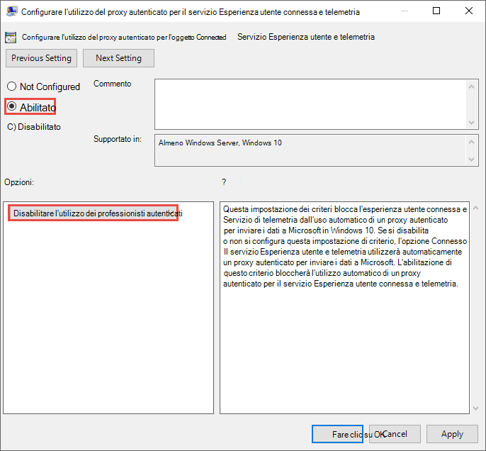
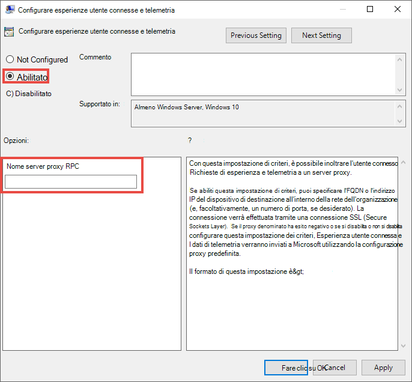

# <a name="configure-device-proxy-and-internet-connectivity-settings"></a><span data-ttu-id="09ea2-104">Configurare le impostazioni del proxy del dispositivo e della connettività Internet</span><span class="sxs-lookup"><span data-stu-id="09ea2-104">Configure device proxy and Internet connectivity settings</span></span>

[!INCLUDE [Microsoft 365 Defender rebranding](../../includes/microsoft-defender.md)]

<span data-ttu-id="09ea2-105">**Si applica a:**</span><span class="sxs-lookup"><span data-stu-id="09ea2-105">**Applies to:**</span></span>
- [<span data-ttu-id="09ea2-106">Microsoft Defender ATP</span><span class="sxs-lookup"><span data-stu-id="09ea2-106">Microsoft Defender for Endpoint</span></span>](https://go.microsoft.com/fwlink/p/?linkid=2154037)
- [<span data-ttu-id="09ea2-107">Microsoft 365 Defender</span><span class="sxs-lookup"><span data-stu-id="09ea2-107">Microsoft 365 Defender</span></span>](https://go.microsoft.com/fwlink/?linkid=2118804)

> <span data-ttu-id="09ea2-108">Vuoi provare Defender per Endpoint?</span><span class="sxs-lookup"><span data-stu-id="09ea2-108">Want to experience Defender for Endpoint?</span></span> [<span data-ttu-id="09ea2-109">Iscriversi per una versione di valutazione gratuita.</span><span class="sxs-lookup"><span data-stu-id="09ea2-109">Sign up for a free trial.</span></span>](https://www.microsoft.com/en-us/WindowsForBusiness/windows-atp?ocid=docs-wdatp-configureendpointsscript-abovefoldlink)

<span data-ttu-id="09ea2-110">Il sensore Defender for Endpoint richiede Microsoft Windows HTTP (WinHTTP) per segnalare i dati del sensore e comunicare con il servizio Defender for Endpoint.</span><span class="sxs-lookup"><span data-stu-id="09ea2-110">The Defender for Endpoint sensor requires Microsoft Windows HTTP (WinHTTP) to report sensor data and communicate with the Defender for Endpoint service.</span></span>

<span data-ttu-id="09ea2-111">Il sensore Defender for Endpoint incorporato viene eseguito nel contesto di sistema usando l'account LocalSystem.</span><span class="sxs-lookup"><span data-stu-id="09ea2-111">The embedded Defender for Endpoint sensor runs in system context using the LocalSystem account.</span></span> <span data-ttu-id="09ea2-112">Il sensore usa i servizi HTTP di Microsoft Windows (WinHTTP) per abilitare la comunicazione con il servizio cloud Defender for Endpoint.</span><span class="sxs-lookup"><span data-stu-id="09ea2-112">The sensor uses Microsoft Windows HTTP Services (WinHTTP) to enable communication with the Defender for Endpoint cloud service.</span></span>

>[!TIP]
><span data-ttu-id="09ea2-113">Per le organizzazioni che usano i proxy come porta di accesso a Internet, è possibile usare la protezione della rete per esaminare gli eventi che si verificano dietro un proxy.</span><span class="sxs-lookup"><span data-stu-id="09ea2-113">For organizations that use forward proxies as a gateway to the Internet, you can use network protection to investigate behind a proxy.</span></span> <span data-ttu-id="09ea2-114">Per altre informazioni, vedere [Esaminare gli eventi di connessione che si verificano dietro i proxy di inoltro](investigate-behind-proxy.md).</span><span class="sxs-lookup"><span data-stu-id="09ea2-114">For more information, see [Investigate connection events that occur behind forward proxies](investigate-behind-proxy.md).</span></span>

<span data-ttu-id="09ea2-115">L'impostazione di configurazione WinHTTP è indipendente dalle impostazioni del proxy di esplorazione Internet di Windows (WinINet) e può individuare un server proxy solo utilizzando i metodi di individuazione seguenti:</span><span class="sxs-lookup"><span data-stu-id="09ea2-115">The WinHTTP configuration setting is independent of the Windows Internet (WinINet) Internet browsing proxy settings and can only discover a proxy server by using the following discovery methods:</span></span>

- <span data-ttu-id="09ea2-116">Metodi di individuazione automatica:</span><span class="sxs-lookup"><span data-stu-id="09ea2-116">Auto-discovery methods:</span></span>
  - <span data-ttu-id="09ea2-117">Proxy trasparente</span><span class="sxs-lookup"><span data-stu-id="09ea2-117">Transparent proxy</span></span>
  - <span data-ttu-id="09ea2-118">Protocollo Web Proxy Auto-discovery (WPAD)</span><span class="sxs-lookup"><span data-stu-id="09ea2-118">Web Proxy Auto-discovery Protocol (WPAD)</span></span>

    > [!NOTE]
    > <span data-ttu-id="09ea2-119">Se si usa il proxy trasparente o WPAD nella topologia di rete, non sono necessarie impostazioni di configurazione speciali.</span><span class="sxs-lookup"><span data-stu-id="09ea2-119">If you're using Transparent proxy or WPAD in your network topology, you don't need special configuration settings.</span></span> <span data-ttu-id="09ea2-120">Per altre informazioni sulle esclusioni degli URL di Defender for Endpoint nel proxy, vedi Abilitare l'accesso a Defender per gli URL del servizio [endpoint nel server proxy.](#enable-access-to-microsoft-defender-for-endpoint-service-urls-in-the-proxy-server)</span><span class="sxs-lookup"><span data-stu-id="09ea2-120">For more information on Defender for Endpoint URL exclusions in the proxy, see [Enable access to Defender for Endpoint service URLs in the proxy server](#enable-access-to-microsoft-defender-for-endpoint-service-urls-in-the-proxy-server).</span></span>

- <span data-ttu-id="09ea2-121">Configurazione manuale del proxy statico:</span><span class="sxs-lookup"><span data-stu-id="09ea2-121">Manual static proxy configuration:</span></span>
  - <span data-ttu-id="09ea2-122">Configurazione basata sul registro</span><span class="sxs-lookup"><span data-stu-id="09ea2-122">Registry based configuration</span></span>
  - <span data-ttu-id="09ea2-123">WinHTTP configurato utilizzando il comando netsh. Questo è adatto solo per desktop in una topologia stabile (ad esempio: un desktop in una rete aziendale dietro lo stesso proxy)</span><span class="sxs-lookup"><span data-stu-id="09ea2-123">WinHTTP configured using netsh command – Suitable only for desktops in a stable topology (for example: a desktop in a corporate network behind the same proxy)</span></span>

## <a name="configure-the-proxy-server-manually-using-a-registry-based-static-proxy"></a><span data-ttu-id="09ea2-124">Configurare manualmente il server proxy con un proxy statico basato sul registro</span><span class="sxs-lookup"><span data-stu-id="09ea2-124">Configure the proxy server manually using a registry-based static proxy</span></span>

<span data-ttu-id="09ea2-125">Configura un proxy statico basato sul Registro di sistema per consentire solo al sensore Defender for Endpoint di segnalare i dati di diagnostica e comunicare con Defender per i servizi endpoint se a un computer non è consentito connettersi a Internet.</span><span class="sxs-lookup"><span data-stu-id="09ea2-125">Configure a registry-based static proxy to allow only Defender for Endpoint sensor to report diagnostic data and communicate with Defender for Endpoint services if a computer is not be permitted to connect to the Internet.</span></span>

<span data-ttu-id="09ea2-126">Il proxy statico è configurabile tramite Criteri di gruppo.</span><span class="sxs-lookup"><span data-stu-id="09ea2-126">The static proxy is configurable through Group Policy (GP).</span></span> <span data-ttu-id="09ea2-127">I criteri di gruppo sono disponibili in:</span><span class="sxs-lookup"><span data-stu-id="09ea2-127">The group policy can be found under:</span></span>

- <span data-ttu-id="09ea2-128">Modelli amministrativi > componenti di Windows > raccolte dati e build di anteprima > configurare l'utilizzo del proxy autenticato per il servizio Esperienza utente connessa e telemetria</span><span class="sxs-lookup"><span data-stu-id="09ea2-128">Administrative Templates > Windows Components > Data Collection and Preview Builds > Configure Authenticated Proxy usage for the Connected User Experience and Telemetry Service</span></span>
  - <span data-ttu-id="09ea2-129">Impostarlo su **Abilitato e** selezionare Disabilita utilizzo **proxy autenticato**: </span><span class="sxs-lookup"><span data-stu-id="09ea2-129">Set it to **Enabled** and select **Disable Authenticated Proxy usage**: </span></span>
- <span data-ttu-id="09ea2-130">Modelli amministrativi > componenti di Windows > raccolte dati e build di anteprima > **configurare esperienze utente connesse e telemetria**:</span><span class="sxs-lookup"><span data-stu-id="09ea2-130">**Administrative Templates > Windows Components > Data Collection and Preview Builds > Configure connected user experiences and telemetry**:</span></span>
  - <span data-ttu-id="09ea2-131">Configurare il proxy:</span><span class="sxs-lookup"><span data-stu-id="09ea2-131">Configure the proxy:</span></span><br>
    <span data-ttu-id="09ea2-132"></span><span class="sxs-lookup"><span data-stu-id="09ea2-132"></span></span>

    <span data-ttu-id="09ea2-133">Il criterio imposta due valori di registro`TelemetryProxyServer` come REG_SZ e `DisableEnterpriseAuthProxy` REG_DWORD nella chiave di registro`HKLM\Software\Policies\Microsoft\Windows\DataCollection`.</span><span class="sxs-lookup"><span data-stu-id="09ea2-133">The policy sets two registry values `TelemetryProxyServer` as REG_SZ and `DisableEnterpriseAuthProxy` as REG_DWORD under the registry key `HKLM\Software\Policies\Microsoft\Windows\DataCollection`.</span></span>

    <span data-ttu-id="09ea2-134">Il valore del Registro `TelemetryProxyServer` di sistema assume il formato stringa seguente:</span><span class="sxs-lookup"><span data-stu-id="09ea2-134">The registry value `TelemetryProxyServer` takes the following string format:</span></span>

    ```text
    <server name or ip>:<port>
    ```

    <span data-ttu-id="09ea2-135">Ad esempio: 10.0.0.6:8080</span><span class="sxs-lookup"><span data-stu-id="09ea2-135">For example: 10.0.0.6:8080</span></span>

    <span data-ttu-id="09ea2-136">Il valore del registro `DisableEnterpriseAuthProxy` deve essere impostato su 1.</span><span class="sxs-lookup"><span data-stu-id="09ea2-136">The registry value `DisableEnterpriseAuthProxy` should be set to 1.</span></span>

## <a name="configure-the-proxy-server-manually-using-netsh-command"></a><span data-ttu-id="09ea2-137">Configurare manualmente il server proxy utilizzando il comando netsh</span><span class="sxs-lookup"><span data-stu-id="09ea2-137">Configure the proxy server manually using netsh command</span></span>

<span data-ttu-id="09ea2-138">Usare netsh per configurare un proxy statico a livello di sistema.</span><span class="sxs-lookup"><span data-stu-id="09ea2-138">Use netsh to configure a system-wide static proxy.</span></span>

> [!NOTE]
> - <span data-ttu-id="09ea2-139">Questa operazione avrà effetto su tutte le applicazioni, inclusi i servizi di Windows che usano WinHTTP con proxy predefinito.</span><span class="sxs-lookup"><span data-stu-id="09ea2-139">This will affect all applications including Windows services which use WinHTTP with default proxy.</span></span></br>
> - <span data-ttu-id="09ea2-140">I portatili che cambiano topologia (ad esempio, da ufficio a casa) non funzionano correttamente con netsh.</span><span class="sxs-lookup"><span data-stu-id="09ea2-140">Laptops that are changing topology (for example: from office to home) will malfunction with netsh.</span></span> <span data-ttu-id="09ea2-141">È consigliabile usare la configurazione del proxy statico basata sul registro.</span><span class="sxs-lookup"><span data-stu-id="09ea2-141">Use the registry-based static proxy configuration.</span></span>

1. <span data-ttu-id="09ea2-142">Aprire un prompt dei comandi con privilegi elevati:</span><span class="sxs-lookup"><span data-stu-id="09ea2-142">Open an elevated command-line:</span></span>

    <span data-ttu-id="09ea2-143">a.</span><span class="sxs-lookup"><span data-stu-id="09ea2-143">a.</span></span> <span data-ttu-id="09ea2-144">Passare a **Start** e digitare **cmd**.</span><span class="sxs-lookup"><span data-stu-id="09ea2-144">Go to **Start** and type **cmd**.</span></span>

    <span data-ttu-id="09ea2-145">b.</span><span class="sxs-lookup"><span data-stu-id="09ea2-145">b.</span></span> <span data-ttu-id="09ea2-146">Fare clic con il pulsante destro del mouse su **Prompt dei comandi** e scegliere **Esegui come amministratore**.</span><span class="sxs-lookup"><span data-stu-id="09ea2-146">Right-click **Command prompt** and select **Run as administrator**.</span></span>

2. <span data-ttu-id="09ea2-147">Immettere il comando indicato di seguito e premere **INVIO**:</span><span class="sxs-lookup"><span data-stu-id="09ea2-147">Enter the following command and press **Enter**:</span></span>

   ```PowerShell
   netsh winhttp set proxy <proxy>:<port>
   ```

   <span data-ttu-id="09ea2-148">Ad esempio: netsh winhttp set proxy 10.0.0.6:8080</span><span class="sxs-lookup"><span data-stu-id="09ea2-148">For example: netsh winhttp set proxy 10.0.0.6:8080</span></span>

<span data-ttu-id="09ea2-149">Per reimpostare il proxy winhttp, immettere il comando seguente e premere **INVIO**</span><span class="sxs-lookup"><span data-stu-id="09ea2-149">To reset the winhttp proxy, enter the following command and press **Enter**</span></span>

```PowerShell
netsh winhttp reset proxy
```

<span data-ttu-id="09ea2-150">Per altre informazioni, vedere [Sintassi comando netsh, contesti e formattazione](https://docs.microsoft.com/windows-server/networking/technologies/netsh/netsh-contexts).</span><span class="sxs-lookup"><span data-stu-id="09ea2-150">See [Netsh Command Syntax, Contexts, and Formatting](https://docs.microsoft.com/windows-server/networking/technologies/netsh/netsh-contexts) to learn more.</span></span>

## <a name="enable-access-to-microsoft-defender-for-endpoint-service-urls-in-the-proxy-server"></a><span data-ttu-id="09ea2-151">Abilitare l'accesso agli URL del servizio Microsoft Defender for Endpoint nel server proxy</span><span class="sxs-lookup"><span data-stu-id="09ea2-151">Enable access to Microsoft Defender for Endpoint service URLs in the proxy server</span></span>

<span data-ttu-id="09ea2-152">Se un proxy o un firewall blocca tutto il traffico per impostazione predefinita e consente solo domini specifici, aggiungere i domini elencati nel foglio di lavoro scaricabile all'elenco di domini consentiti.</span><span class="sxs-lookup"><span data-stu-id="09ea2-152">If a proxy or firewall is blocking all traffic by default and allowing only specific domains through, add the domains listed in the downloadable sheet to the allowed domains list.</span></span>

<span data-ttu-id="09ea2-153">Nel seguente foglio di calcolo scaricabile sono elencati i servizi e gli URL associati a cui la rete deve essere in grado di connettersi.</span><span class="sxs-lookup"><span data-stu-id="09ea2-153">The following downloadable spreadsheet lists the services and their associated URLs that your network must be able to connect to.</span></span> <span data-ttu-id="09ea2-154">È consigliabile verificare che non siano presenti regole di filtro di rete o firewall che negherebbero l'accesso *a* questi URL oppure potrebbe essere necessario creare una regola di autorizzazione specifica per tali URL.</span><span class="sxs-lookup"><span data-stu-id="09ea2-154">You should ensure that there are no firewall or network filtering rules that would deny access to these URLs, or you may need to create an *allow* rule specifically for them.</span></span>


|<span data-ttu-id="09ea2-155">**Foglio di calcolo dell'elenco dei domini**</span><span class="sxs-lookup"><span data-stu-id="09ea2-155">**Spreadsheet of domains list**</span></span>|<span data-ttu-id="09ea2-156">**Descrizione**</span><span class="sxs-lookup"><span data-stu-id="09ea2-156">**Description**</span></span>|
|:-----|:-----|
|<br/>  | <span data-ttu-id="09ea2-158">Foglio di calcolo di record DNS specifici per le posizioni dei servizi, le posizioni geografiche e il sistema operativo.</span><span class="sxs-lookup"><span data-stu-id="09ea2-158">Spreadsheet of specific DNS records for service locations, geographic locations, and OS.</span></span> <br><br>[<span data-ttu-id="09ea2-159">Scaricare il foglio di calcolo qui.</span><span class="sxs-lookup"><span data-stu-id="09ea2-159">Download the spreadsheet here.</span></span>](https://download.microsoft.com/download/8/a/5/8a51eee5-cd02-431c-9d78-a58b7f77c070/mde-urls.xlsx) 


<span data-ttu-id="09ea2-160">Se un proxy o un firewall ha l’analisi HTTPS (ispezione SSL) abilitata, bisogna escludere i domini elencati nella tabella di analisi HTTPS di cui sopra.</span><span class="sxs-lookup"><span data-stu-id="09ea2-160">If a proxy or firewall has HTTPS scanning (SSL inspection) enabled, exclude the domains listed in the above table from HTTPS scanning.</span></span>

> [!NOTE]
> <span data-ttu-id="09ea2-161">settings-win.data.microsoft.com è necessario solo se hai dispositivi Windows 10 che eseguono la versione 1803 o precedente.</span><span class="sxs-lookup"><span data-stu-id="09ea2-161">settings-win.data.microsoft.com is only needed if you have Windows 10 devices running version 1803 or earlier.</span></span><br>


> [!NOTE]
> <span data-ttu-id="09ea2-162">Gli URL che includono v20 in essi sono necessari solo se hai dispositivi Windows 10 che eseguono la versione 1803 o successiva.</span><span class="sxs-lookup"><span data-stu-id="09ea2-162">URLs that include v20 in them are only needed if you have Windows 10 devices running version 1803 or later.</span></span> <span data-ttu-id="09ea2-163">Ad esempio, è necessario per un dispositivo Windows 10 che esegue la versione 1803 o successiva e che sia stato onboarded nell'area di archiviazione ```us-v20.events.data.microsoft.com``` dati statunitense.</span><span class="sxs-lookup"><span data-stu-id="09ea2-163">For example, ```us-v20.events.data.microsoft.com``` is needed for a Windows 10 device running version 1803 or later and onboarded to US Data Storage region.</span></span>


> [!NOTE]
> <span data-ttu-id="09ea2-164">Se si usa Microsoft Defender Antivirus nell'ambiente, vedere [Configure network connections to the Microsoft Defender Antivirus cloud service.](https://docs.microsoft.com/windows/security/threat-protection/microsoft-defender-antivirus/configure-network-connections-microsoft-defender-antivirus)</span><span class="sxs-lookup"><span data-stu-id="09ea2-164">If you are using Microsoft Defender Antivirus in your environment, see [Configure network connections to the Microsoft Defender Antivirus cloud service](https://docs.microsoft.com/windows/security/threat-protection/microsoft-defender-antivirus/configure-network-connections-microsoft-defender-antivirus).</span></span>

<span data-ttu-id="09ea2-165">Se un proxy o un firewall blocca il traffico anonimo, poiché il sensore Defender for Endpoint si connette dal contesto di sistema, assicurati che il traffico anonimo sia consentito negli URL elencati in precedenza.</span><span class="sxs-lookup"><span data-stu-id="09ea2-165">If a proxy or firewall is blocking anonymous traffic, as Defender for Endpoint sensor is connecting from system context, make sure anonymous traffic is permitted in the previously listed URLs.</span></span>

### <a name="microsoft-monitoring-agent-mma---proxy-and-firewall-requirements-for-older-versions-of-windows-client-or-windows-server"></a><span data-ttu-id="09ea2-166">Microsoft Monitoring Agent (MMA): requisiti proxy e firewall per le versioni precedenti del client Windows o di Windows Server</span><span class="sxs-lookup"><span data-stu-id="09ea2-166">Microsoft Monitoring Agent (MMA) - proxy and firewall requirements for older versions of Windows client or Windows Server</span></span>

<span data-ttu-id="09ea2-167">Le informazioni seguenti elencano le informazioni di configurazione del proxy e del firewall necessarie per comunicare con l'agente Log Analytics (spesso noto come Microsoft Monitoring Agent) per le versioni precedenti di Windows, ad esempio Windows 7 SP1, Windows 8.1, Windows Server 2008 R2, Windows Server 2012 R2 e Windows Server 2016.</span><span class="sxs-lookup"><span data-stu-id="09ea2-167">The information below list the proxy and firewall configuration information required to communicate with Log Analytics agent (often referred to as Microsoft Monitoring Agent) for the previous versions of Windows such as Windows 7 SP1, Windows 8.1, Windows Server 2008 R2, Windows Server 2012 R2, and Windows Server 2016.</span></span>

|<span data-ttu-id="09ea2-168">Risorsa agente</span><span class="sxs-lookup"><span data-stu-id="09ea2-168">Agent Resource</span></span>|<span data-ttu-id="09ea2-169">Porte</span><span class="sxs-lookup"><span data-stu-id="09ea2-169">Ports</span></span> |<span data-ttu-id="09ea2-170">Direction</span><span class="sxs-lookup"><span data-stu-id="09ea2-170">Direction</span></span> |<span data-ttu-id="09ea2-171">Ignorare l'ispezione HTTPS</span><span class="sxs-lookup"><span data-stu-id="09ea2-171">Bypass HTTPS inspection</span></span>|
|------|---------|--------|--------|   
|<span data-ttu-id="09ea2-172">\*.ods.opinsights.azure.com</span><span class="sxs-lookup"><span data-stu-id="09ea2-172">\*.ods.opinsights.azure.com</span></span> |<span data-ttu-id="09ea2-173">Porta 443</span><span class="sxs-lookup"><span data-stu-id="09ea2-173">Port 443</span></span> |<span data-ttu-id="09ea2-174">In uscita</span><span class="sxs-lookup"><span data-stu-id="09ea2-174">Outbound</span></span>|<span data-ttu-id="09ea2-175">Sì</span><span class="sxs-lookup"><span data-stu-id="09ea2-175">Yes</span></span> |  
|<span data-ttu-id="09ea2-176">\*.oms.opinsights.azure.com</span><span class="sxs-lookup"><span data-stu-id="09ea2-176">\*.oms.opinsights.azure.com</span></span> |<span data-ttu-id="09ea2-177">Porta 443</span><span class="sxs-lookup"><span data-stu-id="09ea2-177">Port 443</span></span> |<span data-ttu-id="09ea2-178">In uscita</span><span class="sxs-lookup"><span data-stu-id="09ea2-178">Outbound</span></span>|<span data-ttu-id="09ea2-179">Sì</span><span class="sxs-lookup"><span data-stu-id="09ea2-179">Yes</span></span> |  
|<span data-ttu-id="09ea2-180">\*.blob.core.windows.net</span><span class="sxs-lookup"><span data-stu-id="09ea2-180">\*.blob.core.windows.net</span></span> |<span data-ttu-id="09ea2-181">Porta 443</span><span class="sxs-lookup"><span data-stu-id="09ea2-181">Port 443</span></span> |<span data-ttu-id="09ea2-182">In uscita</span><span class="sxs-lookup"><span data-stu-id="09ea2-182">Outbound</span></span>|<span data-ttu-id="09ea2-183">Sì</span><span class="sxs-lookup"><span data-stu-id="09ea2-183">Yes</span></span> |
|<span data-ttu-id="09ea2-184">\*.azure-automation.net</span><span class="sxs-lookup"><span data-stu-id="09ea2-184">\*.azure-automation.net</span></span> |<span data-ttu-id="09ea2-185">Porta 443</span><span class="sxs-lookup"><span data-stu-id="09ea2-185">Port 443</span></span> |<span data-ttu-id="09ea2-186">In uscita</span><span class="sxs-lookup"><span data-stu-id="09ea2-186">Outbound</span></span>|<span data-ttu-id="09ea2-187">Sì</span><span class="sxs-lookup"><span data-stu-id="09ea2-187">Yes</span></span> |  


> [!NOTE]
> <span data-ttu-id="09ea2-188">Come soluzione basata sul cloud, l'intervallo IP può cambiare.</span><span class="sxs-lookup"><span data-stu-id="09ea2-188">As a cloud-based solution, the IP range can change.</span></span> <span data-ttu-id="09ea2-189">È consigliabile passare all'impostazione di risoluzione DNS.</span><span class="sxs-lookup"><span data-stu-id="09ea2-189">It's recommended you move to DNS resolving setting.</span></span>

## <a name="confirm-microsoft-monitoring-agent-mma-service-url-requirements"></a><span data-ttu-id="09ea2-190">Verificare i requisiti degli URL del servizio Microsoft Monitoring Agent (MMA)</span><span class="sxs-lookup"><span data-stu-id="09ea2-190">Confirm Microsoft Monitoring Agent (MMA) Service URL Requirements</span></span> 

<span data-ttu-id="09ea2-191">Vedere le indicazioni seguenti per eliminare il requisito con caratteri jolly (\*) per l'ambiente specifico quando si usa Microsoft Monitoring Agent (MMA) per le versioni precedenti di Windows.</span><span class="sxs-lookup"><span data-stu-id="09ea2-191">Please see the following guidance to eliminate the wildcard (\*) requirement for your specific environment when using the Microsoft Monitoring Agent (MMA) for previous versions of Windows.</span></span>

1.  <span data-ttu-id="09ea2-192">Onboard a previous operating system with the Microsoft Monitoring Agent (MMA) into Defender for Endpoint (for more information, see [Onboard previous versions of Windows on Defender for Endpoint and](https://go.microsoft.com/fwlink/p/?linkid=2010326) [Onboard Windows servers](configure-server-endpoints.md#windows-server-2008-r2-sp1-windows-server-2012-r2-and-windows-server-2016).</span><span class="sxs-lookup"><span data-stu-id="09ea2-192">Onboard a previous operating system with the Microsoft Monitoring Agent (MMA) into Defender for Endpoint (for more information, see [Onboard previous versions of Windows on Defender for Endpoint](https://go.microsoft.com/fwlink/p/?linkid=2010326) and [Onboard Windows servers](configure-server-endpoints.md#windows-server-2008-r2-sp1-windows-server-2012-r2-and-windows-server-2016).</span></span>

2.  <span data-ttu-id="09ea2-193">Assicurati che il computer eserciti correttamente la segnalazione nel portale di Microsoft Defender Security Center.</span><span class="sxs-lookup"><span data-stu-id="09ea2-193">Ensure the machine is successfully reporting into the Microsoft Defender Security Center portal.</span></span>

3.  <span data-ttu-id="09ea2-194">Eseguire lo TestCloudConnection.exe da "C:\Programmi\Microsoft Monitoring Agent\Agent" per convalidare la connettività e visualizzare gli URL necessari per l'area di lavoro specifica.</span><span class="sxs-lookup"><span data-stu-id="09ea2-194">Run the TestCloudConnection.exe tool from “C:\Program Files\Microsoft Monitoring Agent\Agent” to validate the connectivity and to see the required URLs for your specific workspace.</span></span>

4.  <span data-ttu-id="09ea2-195">Controlla l'elenco degli URL degli endpoint di Microsoft Defender per l'elenco completo dei requisiti per la tua area geografica (fai riferimento al Foglio di calcolo DEGLI URL [del servizio).](https://download.microsoft.com/download/8/a/5/8a51eee5-cd02-431c-9d78-a58b7f77c070/mde-urls.xlsx)</span><span class="sxs-lookup"><span data-stu-id="09ea2-195">Check the Microsoft Defender for Endpoint URLs list for the complete list of requirements for your region (please refer to the Service URLs [Spreadsheet](https://download.microsoft.com/download/8/a/5/8a51eee5-cd02-431c-9d78-a58b7f77c070/mde-urls.xlsx)).</span></span>


<span data-ttu-id="09ea2-197">I caratteri jolly (\*) utilizzati negli endpoint URL \*.ods.opinsights.azure.com, \*.oms.opinsights.azure.com e \*.agentsvc.azure-automation.net possono essere sostituiti con l'ID area di lavoro specifico.</span><span class="sxs-lookup"><span data-stu-id="09ea2-197">The wildcards (\*) used in \*.ods.opinsights.azure.com, \*.oms.opinsights.azure.com, and \*.agentsvc.azure-automation.net URL endpoints can be replaced with your specific Workspace ID.</span></span> <span data-ttu-id="09ea2-198">L'ID area di lavoro è specifico dell'ambiente e dell'area di lavoro ed è disponibile nella sezione Onboarding del tenant all'interno del portale di Microsoft Defender Security Center.</span><span class="sxs-lookup"><span data-stu-id="09ea2-198">The Workspace ID is specific to your environment and workspace and can be found in the Onboarding section of your tenant within the Microsoft Defender Security Center portal.</span></span>

<span data-ttu-id="09ea2-199">L'endpoint URL \*.blob.core.windows.net può essere sostituito con gli URL visualizzati nella sezione "Regola firewall: \*.blob.core.windows.net" dei risultati del test.</span><span class="sxs-lookup"><span data-stu-id="09ea2-199">The \*.blob.core.windows.net URL endpoint can be replaced with the URLs shown in the “Firewall Rule: \*.blob.core.windows.net” section of the test results.</span></span> 

> [!NOTE]
> <span data-ttu-id="09ea2-200">Nel caso dell'onboarding tramite Il Centro sicurezza di Azure (ASC), possono essere usate più aree di lavoro.In the case of onboarding via Azure Security Center (ASC), multiple workspaces maybe used.</span><span class="sxs-lookup"><span data-stu-id="09ea2-200">In the case of onboarding via Azure Security Center (ASC), multiple workspaces maybe used.</span></span> <span data-ttu-id="09ea2-201">Sarà necessario eseguire la procedura di TestCloudConnection.exe sopra descritta in un computer onboarded da ogni area di lavoro (per determinare se sono presenti modifiche agli URL \*.blob.core.windows.net tra le aree di lavoro).</span><span class="sxs-lookup"><span data-stu-id="09ea2-201">You will need to perform the TestCloudConnection.exe procedure above on an onboarded machine from each workspace (to determine if there are any changes to the \*.blob.core.windows.net URLs between the workspaces).</span></span>

## <a name="verify-client-connectivity-to-microsoft-defender-atp-service-urls"></a><span data-ttu-id="09ea2-202">Verificare la connettività client agli URL del servizio Microsoft Defender ATP</span><span class="sxs-lookup"><span data-stu-id="09ea2-202">Verify client connectivity to Microsoft Defender ATP service URLs</span></span>

<span data-ttu-id="09ea2-203">Verificare che la configurazione del proxy sia stata completata correttamente, che WinHTTP possa individuare e comunicare attraverso il server proxy nell’ambiente e che il server proxy consenta il traffico agli URL del servizio Defender per Endpoint.</span><span class="sxs-lookup"><span data-stu-id="09ea2-203">Verify the proxy configuration completed successfully, that WinHTTP can discover and communicate through the proxy server in your environment, and that the proxy server allows traffic to the Defender for Endpoint service URLs.</span></span>

1. <span data-ttu-id="09ea2-204">Scarica lo [strumento Analizzatore client MDATP](https://aka.ms/mdatpanalyzer) nel PC in cui è in esecuzione il sensore Defender for Endpoint.</span><span class="sxs-lookup"><span data-stu-id="09ea2-204">Download the [MDATP Client Analyzer tool](https://aka.ms/mdatpanalyzer) to the PC where Defender for Endpoint sensor is running on.</span></span>

2. <span data-ttu-id="09ea2-205">Estrarre il contenuto di MDATPClientAnalyzer.zip nel dispositivo.</span><span class="sxs-lookup"><span data-stu-id="09ea2-205">Extract the contents of MDATPClientAnalyzer.zip on the device.</span></span>

3. <span data-ttu-id="09ea2-206">Aprire un prompt dei comandi con privilegi elevati:</span><span class="sxs-lookup"><span data-stu-id="09ea2-206">Open an elevated command-line:</span></span>

    <span data-ttu-id="09ea2-207">a.</span><span class="sxs-lookup"><span data-stu-id="09ea2-207">a.</span></span> <span data-ttu-id="09ea2-208">Passare a **Start** e digitare **cmd**.</span><span class="sxs-lookup"><span data-stu-id="09ea2-208">Go to **Start** and type **cmd**.</span></span>

    <span data-ttu-id="09ea2-209">b.</span><span class="sxs-lookup"><span data-stu-id="09ea2-209">b.</span></span>  <span data-ttu-id="09ea2-210">Fare clic con il pulsante destro del mouse su **Prompt dei comandi** e scegliere **Esegui come amministratore**.</span><span class="sxs-lookup"><span data-stu-id="09ea2-210">Right-click **Command prompt** and select **Run as administrator**.</span></span>

4. <span data-ttu-id="09ea2-211">Immettere il comando indicato di seguito e premere **INVIO**:</span><span class="sxs-lookup"><span data-stu-id="09ea2-211">Enter the following command and press **Enter**:</span></span>

    ```PowerShell
    HardDrivePath\MDATPClientAnalyzer.cmd
    ```

    <span data-ttu-id="09ea2-212">Sostituire *HardDrivePath* con il percorso in cui è stato scaricato lo strumento MDATPClientAnalyzer, ad esempio</span><span class="sxs-lookup"><span data-stu-id="09ea2-212">Replace *HardDrivePath* with the path where the MDATPClientAnalyzer tool was downloaded to, for example</span></span>

    ```PowerShell
    C:\Work\tools\MDATPClientAnalyzer\MDATPClientAnalyzer.cmd
    ```

5. <span data-ttu-id="09ea2-213">Estrarre il *MDATPClientAnalyzerResult.zip* creato dallo strumento nella cartella utilizzata in *HardDrivePath.*</span><span class="sxs-lookup"><span data-stu-id="09ea2-213">Extract the *MDATPClientAnalyzerResult.zip* file created by tool in the folder used in the *HardDrivePath*.</span></span>

6. <span data-ttu-id="09ea2-214">Aprire *MDATPClientAnalyzerResult.txt* e verificare di avere eseguito la procedura di configurazione del proxy per abilitare l'individuazione del server e l'accesso agli URL di servizio.</span><span class="sxs-lookup"><span data-stu-id="09ea2-214">Open *MDATPClientAnalyzerResult.txt* and verify that you have performed the proxy configuration steps to enable server discovery and access to the service URLs.</span></span> <br><br>
   <span data-ttu-id="09ea2-215">Lo strumento controlla la connettività degli URL del servizio Defender per Endpoint con cui è configurato per interagire.</span><span class="sxs-lookup"><span data-stu-id="09ea2-215">The tool checks the connectivity of Defender for Endpoint service URLs that Defender for Endpoint client is configured to interact with.</span></span> <span data-ttu-id="09ea2-216">Quindi immette i risultati per ogni URL che potrebbe essere potenzialmente utilizzato per comunicare con il servizio Defender per l'endpoint nel file *MDATPClientAnalyzerResult.txt*.</span><span class="sxs-lookup"><span data-stu-id="09ea2-216">It then prints the results into the *MDATPClientAnalyzerResult.txt* file for each URL that can potentially be used to communicate with the Defender for Endpoint services.</span></span> <span data-ttu-id="09ea2-217">Ad esempio:</span><span class="sxs-lookup"><span data-stu-id="09ea2-217">For example:</span></span>

   ```text
   Testing URL : https://xxx.microsoft.com/xxx
   1 - Default proxy: Succeeded (200)
   2 - Proxy auto discovery (WPAD): Succeeded (200)
   3 - Proxy disabled: Succeeded (200)
   4 - Named proxy: Doesn't exist
   5 - Command line proxy: Doesn't exist
   ```

<span data-ttu-id="09ea2-218">Se almeno una delle opzioni di connettività restituisce uno stato (200), il client Defender per Endpoint può comunicare correttamente con l'URL testato usando questo metodo di connettività.</span><span class="sxs-lookup"><span data-stu-id="09ea2-218">If at least one of the connectivity options returns a (200) status, then the Defender for Endpoint client can communicate with the tested URL properly using this connectivity method.</span></span> <br><br>

<span data-ttu-id="09ea2-219">Tuttavia, se i risultati della verifica della connettività indicano un errore, viene visualizzato un errore HTTP (vedere codici di stato HTTP).</span><span class="sxs-lookup"><span data-stu-id="09ea2-219">However, if the connectivity check results indicate a failure, an HTTP error is displayed (see HTTP Status Codes).</span></span> <span data-ttu-id="09ea2-220">Puoi quindi usare gli URL nella tabella illustrata in Abilitare l'accesso a Defender per gli URL del servizio [endpoint nel server proxy.](#enable-access-to-microsoft-defender-for-endpoint-service-urls-in-the-proxy-server)</span><span class="sxs-lookup"><span data-stu-id="09ea2-220">You can then use the URLs in the table shown in [Enable access to Defender for Endpoint service URLs in the proxy server](#enable-access-to-microsoft-defender-for-endpoint-service-urls-in-the-proxy-server).</span></span> <span data-ttu-id="09ea2-221">Gli URL che userai dipendono dall'area selezionata durante la procedura di onboarding.</span><span class="sxs-lookup"><span data-stu-id="09ea2-221">The URLs you'll use will depend on the region selected during the onboarding procedure.</span></span>

> [!NOTE]
> <span data-ttu-id="09ea2-222"> Strumento di analisi della connettività non è compatibile con la regola ASR [Bloccare le creazioni di processi provenienti dai comandi PSExec e WMI](https://docs.microsoft.com/windows/security/threat-protection/windows-defender-exploit-guard/attack-surface-reduction#attack-surface-reduction-rules).</span><span class="sxs-lookup"><span data-stu-id="09ea2-222">The Connectivity Analyzer tool is not compatible with ASR rule [Block process creations originating from PSExec and WMI commands](https://docs.microsoft.com/windows/security/threat-protection/windows-defender-exploit-guard/attack-surface-reduction#attack-surface-reduction-rules).</span></span> <span data-ttu-id="09ea2-223">È necessario disabilitare temporaneamente questa regola per eseguire lo strumento di connettività.</span><span class="sxs-lookup"><span data-stu-id="09ea2-223">You will need to temporarily disable this rule to run the connectivity tool.</span></span>


> [!NOTE]
> <span data-ttu-id="09ea2-224">Quando telemetryProxyServer è impostato, nel Registro di sistema o tramite Criteri di gruppo, Defender for Endpoint esegue il fall back to direct se non è in grado di accedere al proxy definito.</span><span class="sxs-lookup"><span data-stu-id="09ea2-224">When the TelemetryProxyServer is set, in Registry or via Group Policy, Defender for Endpoint will fall back to direct if it can't access the defined proxy.</span></span>

## <a name="related-topics"></a><span data-ttu-id="09ea2-225">Argomenti correlati</span><span class="sxs-lookup"><span data-stu-id="09ea2-225">Related topics</span></span>

- [<span data-ttu-id="09ea2-226">Onboard di dispositivi Windows 10</span><span class="sxs-lookup"><span data-stu-id="09ea2-226">Onboard Windows 10 devices</span></span>](configure-endpoints.md)
- [<span data-ttu-id="09ea2-227">Risolvere i problemi di onboarding di Microsoft Defender per endpoint</span><span class="sxs-lookup"><span data-stu-id="09ea2-227">Troubleshoot Microsoft Defender for Endpoint onboarding issues</span></span>](troubleshoot-onboarding.md)
