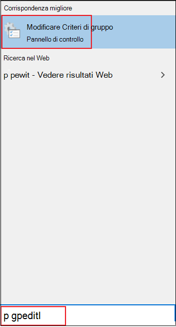

# Abilitare e configurare la protezione sempre attiva di Microsoft Defender Antivirus in Criteri di gruppoEnable and configure Microsoft Defender Antivirus always-on protection in Group Policy

**Si applica a:****Applies to:**

- [Microsoft Defender per endpointMicrosoft Defender for Endpoint](/microsoft-365/security/defender-endpoint/)

La protezione always-on è costituita da protezione in tempo reale, monitoraggio del comportamento ed euristica per identificare il malware in base ad attività sospette e dannose note.Always-on protection consists of real-time protection, behavior monitoring, and heuristics to identify malware based on known suspicious and malicious activities.

Queste attività includono eventi, ad esempio processi che apportano modifiche insolite ai file esistenti, modifica o creazione di chiavi del Registro di sistema di avvio automatico e percorsi di avvio (noti anche come punti di estendibilità di avvio automatico o ASEP) e altre modifiche al file system o alla struttura di file.These activities include events, such as processes making unusual changes to existing files, modifying or creating automatic startup registry keys and startup locations (also known as auto-start extensibility points, or ASEPs), and other changes to the file system or file structure.

## Abilitare e configurare la protezione always-on in Criteri di gruppoEnable and configure always-on protection in Group Policy

È possibile utilizzare **Editor Criteri di gruppo locali** per abilitare e configurare Antivirus Microsoft Defender di protezione always-on.You can use **Local Group Policy Editor** to enable and configure Microsoft Defender Antivirus always-on protection settings.

Per abilitare e configurare la protezione always-on:To enable and configure always-on protection:

1. Aprire **Editor Criteri di gruppo locali.**Open **Local Group Policy Editor**. Per eseguire l'operazione:To do this:  

    1. Nella casella di Windows 10 della barra delle applicazioni digitare **gpedit**.In your Windows 10 taskbar search box, type **gpedit**.
    
    1. In **Corrispondenza ottimale** fare clic su Modifica Criteri di **gruppo** per avviare Editor Criteri di **gruppo locali.**Under **Best match**, click **Edit group policy** to launch **Local Group Policy Editor**.
    
       

2. Nel riquadro sinistro **dell'Editor** Criteri di gruppo locali espandere l'albero fino a Configurazione **computer** Modelli amministrativi  >    >  **Windows componenti**  >  **Antivirus Microsoft Defender**.In the left pane of **Local Group Policy Editor**, expand the tree to **Computer Configuration** > **Administrative Templates** > **Windows Components** > **Microsoft Defender Antivirus**. 

3. Configurare le impostazioni Antivirus Microsoft Defender dei criteri del servizio antimalware.Configure the Microsoft Defender Antivirus antimalware service policy settings. Per eseguire l'operazione:To do this:  

    1. Nel riquadro **Antivirus Microsoft Defender** dettagli a destra fare doppio clic sull'impostazione del criterio come specificato nella tabella seguente:In the **Microsoft Defender Antivirus** details pane on right, double-click the policy setting as specified in the following table:

       | ImpostazioneSetting | DescrizioneDescription | Impostazione predefinitaDefault setting |
       |-----------------------------|------------------------|-------------------------------|
       | Consenti avvio del servizio antimalware con priorità normaleAllow antimalware service to startup with normal priority | È possibile ridurre la priorità del motore di Antivirus Microsoft Defender, che può essere utile nelle distribuzioni leggere in cui si desidera disporre di un processo di avvio il più snello possibile.You can lower the priority of the Microsoft Defender Antivirus engine, which may be useful in lightweight deployments where you want to have as lean a startup process as possible. Ciò può influire sulla protezione dell'endpoint.This may impact protection on the endpoint. | AbilitatoEnabled
       | Consenti al servizio antimalware di rimanere sempre in esecuzioneAllow antimalware service to remain running always | Se gli aggiornamenti della protezione sono stati disabilitati, è possibile impostare Antivirus Microsoft Defender'esecuzione.If protection updates have been disabled, you can set Microsoft Defender Antivirus to still run. In questo modo si riduce la protezione nell'endpoint.This lowers the protection on the endpoint. | DisattivatoDisabled |
    
    1. Configurare l'impostazione in base alle esigenze e fare clic su **OK.**Configure the setting as appropriate, and click **OK**.
    
    1. Ripetere i passaggi precedenti per ogni impostazione nella tabella.Repeat the previous steps for each setting in the table.

4. Configurare le Antivirus Microsoft Defender dei criteri di protezione in tempo reale.Configure the Microsoft Defender Antivirus real-time protection policy settings. Per eseguire l'operazione:To do this:

    1. Nel riquadro **Antivirus Microsoft Defender** dettagli fare doppio clic su **Protezione in tempo reale.**In the **Microsoft Defender Antivirus** details pane, double-click **Real-time Protection**. In caso contrario, **dal Antivirus Microsoft Defender** albero a sinistra fare clic su Protezione in **tempo reale.**Or, from the **Microsoft Defender Antivirus** tree on left pane, click **Real-time Protection**.
    
    1. Nel riquadro **dei dettagli protezione** in tempo reale a destra fare doppio clic sull'impostazione del criterio come specificato nella tabella seguente:In the **Real-time Protection** details pane on right, double-click the policy setting as specified in the following table:  

       | ImpostazioneSetting | DescrizioneDescription | Impostazione predefinitaDefault setting |
       |-----------------------------|------------------------|-------------------------------|
       | Attivare il monitoraggio del comportamentoTurn on behavior monitoring | Il motore AV monitorerà i processi di file, le modifiche ai file e al Registro di sistema e altri eventi sugli endpoint per attività dannose sospette e note.The AV engine will monitor file processes, file and registry changes, and other events on your endpoints for suspicious and known malicious activity. | AbilitatoEnabled |
       | Analizzare tutti i file e gli allegati scaricatiScan all downloaded files and attachments | I file e gli allegati scaricati vengono analizzati automaticamente.Downloaded files and attachments are automatically scanned. Questo funziona in aggiunta al filtro SmartScreen Windows Defender, che analizza i file prima e durante il download.This operates in addition to the Windows Defender SmartScreen filter, which scans files before and during downloading. | AbilitatoEnabled |
       | Monitorare le attività di file e programmi nel computerMonitor file and program activity on your computer | Il motore di Antivirus Microsoft Defender prende nota di eventuali modifiche ai file (scritture di file, ad esempio spostamenti, copie o modifiche) e attività generali del programma (programmi aperti o in esecuzione e che causano l'esecuzione di altri programmi).The Microsoft Defender Antivirus engine makes note of any file changes (file writes, such as moves, copies, or modifications) and general program activity (programs that are opened or running and that cause other programs to run). | AbilitatoEnabled |
       | Attivare le notifiche di scrittura del volume non elaboratoTurn on raw volume write notifications | Le informazioni sulle scritture di volumi non elaborati verranno analizzate dal monitoraggio del comportamento.Information about raw volume writes will be analyzed by behavior monitoring. | AbilitatoEnabled |
       | Attivare l'analisi dei processi ogni volta che è abilitata la protezione in tempo realeTurn on process scanning whenever real-time protection is enabled | È possibile abilitare il motore di Antivirus Microsoft Defender in modo indipendente per analizzare i processi in esecuzione alla ricerca di modifiche o comportamenti sospetti.You can independently enable the Microsoft Defender Antivirus engine to scan running processes for suspicious modifications or behaviors. Ciò è utile se la protezione in tempo reale è stata temporaneamente disabilitata e si desidera analizzare automaticamente i processi avviati mentre era disabilitata.This is useful if you have temporarily disabled real-time protection and want to automatically scan processes that started while it was disabled. | AbilitatoEnabled |
       | Definire le dimensioni massime dei file e degli allegati scaricati da analizzareDefine the maximum size of downloaded files and attachments to be scanned | È possibile definire le dimensioni in kilobyte.You can define the size in kilobytes. | AbilitatoEnabled |
       | Configurare l'override delle impostazioni locali per attivare il monitoraggio del comportamentoConfigure local setting override for turn on behavior monitoring | Configurare una sostituzione locale per la configurazione del monitoraggio del comportamento.Configure a local override for the configuration of behavior monitoring. Questa impostazione può essere impostata solo da Criteri di gruppo.This setting can only be set by Group Policy. Se abiliti questa impostazione, l'impostazione della preferenza locale avrà la priorità su Criteri di gruppo.If you enable this setting, the local preference setting will take priority over Group Policy. Se si disabilita o non si configura questa impostazione, Criteri di gruppo avrà la priorità sull'impostazione di preferenza locale.If you disable or do not configure this setting, Group Policy will take priority over the local preference setting.| AbilitatoEnabled |
       | Configurare l'override delle impostazioni locali per l'analisi di tutti i file e gli allegati scaricatiConfigure local setting override for scanning all downloaded files and attachments | Configurare una sostituzione locale per la configurazione dell'analisi di tutti i file e gli allegati scaricati.Configure a local override for the configuration of scanning for all downloaded files and attachments. Questa impostazione può essere impostata solo da Criteri di gruppo.This setting can only be set by Group Policy. Se abiliti questa impostazione, l'impostazione della preferenza locale avrà la priorità su Criteri di gruppo.If you enable this setting, the local preference setting will take priority over Group Policy. Se si disabilita o non si configura questa impostazione, Criteri di gruppo avrà la priorità sull'impostazione di preferenza locale.If you disable or do not configure this setting, Group Policy will take priority over the local preference setting.| AbilitatoEnabled |
       | Configurare l'override delle impostazioni locali per il monitoraggio dell'attività di file e programmi nel computerConfigure local setting override for monitoring file and program activity on your computer | Configurare una sostituzione locale per la configurazione del monitoraggio dell'attività di file e programmi nel computer.Configure a local override for the configuration of monitoring for file and program activity on your computer. Questa impostazione può essere impostata solo da Criteri di gruppo.This setting can only be set by Group Policy. Se abiliti questa impostazione, l'impostazione della preferenza locale avrà la priorità su Criteri di gruppo.If you enable this setting, the local preference setting will take priority over Group Policy. Se si disabilita o non si configura questa impostazione, Criteri di gruppo avrà la priorità sull'impostazione di preferenza locale.If you disable or do not configure this setting, Group Policy will take priority over the local preference setting.| AbilitatoEnabled |
       | Configurare l'override delle impostazioni locali per attivare la protezione in tempo realeConfigure local setting override to turn on real-time protection | Configurare una sostituzione locale per la configurazione per attivare la protezione in tempo reale.Configure a local override for the configuration to turn on real-time protection. Questa impostazione può essere impostata solo da Criteri di gruppo.This setting can only be set by Group Policy. Se abiliti questa impostazione, l'impostazione della preferenza locale avrà la priorità su Criteri di gruppo.If you enable this setting, the local preference setting will take priority over Group Policy. Se si disabilita o non si configura questa impostazione, Criteri di gruppo avrà la priorità sull'impostazione di preferenza locale.If you disable or do not configure this setting, Group Policy will take priority over the local preference setting.| AbilitatoEnabled |
       | Configurare l'override delle impostazioni locali per il monitoraggio dell'attività dei file in ingresso e in uscitaConfigure local setting override for monitoring for incoming and outgoing file activity | Configurare una sostituzione locale per la configurazione del monitoraggio per l'attività dei file in ingresso e in uscita.Configure a local override for the configuration of monitoring for incoming and outgoing file activity. Questa impostazione può essere impostata solo da Criteri di gruppo.This setting can only be set by Group Policy. Se abiliti questa impostazione, l'impostazione della preferenza locale avrà la priorità su Criteri di gruppo.If you enable this setting, the local preference setting will take priority over Group Policy. Se si disabilita o non si configura questa impostazione, Criteri di gruppo avrà la priorità sull'impostazione di preferenza locale.If you disable or do not configure this setting, Group Policy will take priority over the local preference setting. | AbilitatoEnabled |
       | Configurare il monitoraggio per l'attività di file e programmi in ingresso e in uscitaConfigure monitoring for incoming and outgoing file and program activity | Specificare se il monitoraggio deve essere eseguito in ingresso, in uscita, in entrambe le direzioni o in nessuna delle due direzioni.Specify whether monitoring should occur on incoming, outgoing, both, or neither direction. Ciò è rilevante per le installazioni di Windows Server in cui sono stati definiti server specifici o ruoli del server che visualizzano grandi quantità di modifiche ai file in una sola direzione e si desidera migliorare le prestazioni di rete.This is relevant for Windows Server installations where you have defined specific servers or Server Roles that see large amounts of file changes in only one direction and you want to improve network performance. Gli endpoint (e i server) completamente aggiornati in una rete avranno un impatto minimo sulle prestazioni indipendentemente dal numero o dalla direzione delle modifiche ai file.Fully updated endpoints (and servers) on a network will see little performance impact irrespective of the number or direction of file changes. | Abilitato (entrambe le direzioni)Enabled (both directions) |

    1. Configurare l'impostazione in base alle esigenze e fare clic su **OK.**Configure the setting as appropriate, and click **OK**.
    
    1. Ripetere i passaggi precedenti per ogni impostazione nella tabella.Repeat the previous steps for each setting in the table.

5. Configurare l'impostazione Antivirus Microsoft Defender criteri di analisi dei dati.Configure the Microsoft Defender Antivirus scanning policy setting. Per eseguire l'operazione:To do this:  

    1. Nel riquadro **Antivirus Microsoft Defender** albero a sinistra fare clic su **Analizza.**From the **Microsoft Defender Antivirus** tree on left pane, click **Scan**.
    
       

    1. Nel riquadro **Dei** dettagli analisi a destra fare doppio clic sull'impostazione del criterio come specificato nella tabella seguente:In the **Scan** details pane on right, double-click the policy setting as specified in the following table:

       | ImpostazioneSetting | DescrizioneDescription | Impostazione predefinitaDefault setting |
       |-----------------------------|------------------------|-------------------------------|    
       | Attivare l'euristicaTurn on heuristics | La protezione euristica disabiliterà o blocleverà le attività sospette immediatamente prima che al motore Antivirus Microsoft Defender venga richiesto di rilevare l'attività.Heuristic protection will disable or block suspicious activity immediately before the Microsoft Defender Antivirus engine is asked to detect the activity. | AbilitatoEnabled |

    1. Configurare l'impostazione in base alle esigenze e fare clic su **OK.**Configure the setting as appropriate, and click **OK**.
    
6. Chiudere **Editor Criteri di gruppo locali**.Close **Local Group Policy Editor**.

## Disabilitare la protezione in tempo reale in Criteri di gruppoDisable real-time protection in Group Policy

> [!WARNING]
> La disabilitazione della protezione in tempo reale riduce drasticamente la protezione degli endpoint e non è consigliata.Disabling real-time protection drastically reduces the protection on your endpoints and is not recommended.

La funzionalità principale di protezione in tempo reale è abilitata per impostazione predefinita, ma è possibile disabilitarla utilizzando Editor **Criteri di gruppo locali.**The main real-time protection capability is enabled by default, but you can disable it by using **Local Group Policy Editor**.

Per disabilitare la protezione in tempo reale in Criteri di gruppo:To disable real-time protection in Group policy:

1. Aprire **Editor Criteri di gruppo locali.**Open **Local Group Policy Editor**.

   1. Nella casella di Windows 10 della barra delle applicazioni digitare **gpedit**.In your Windows 10 taskbar search box, type **gpedit**.
   
   1. In **Corrispondenza ottimale** fare clic su Modifica Criteri di **gruppo** per avviare Editor Criteri di **gruppo locali.**Under **Best match**, click **Edit group policy** to launch **Local Group Policy Editor**.

2.  Nel riquadro sinistro dell'Editor Criteri di gruppo **locali** espandere l'albero fino a Configurazione computer Modelli amministrativi  >    >  **Windows componenti**  >  **Antivirus Microsoft Defender**  >  **Protezione in tempo reale**.In the left pane of **Local Group Policy Editor**, expand the tree to **Computer Configuration** > **Administrative Templates** > **Windows Components** > **Microsoft Defender Antivirus** > **Real-time Protection**.

3. Nel riquadro **dei dettagli protezione** in tempo reale a destra fare doppio clic su Disattiva protezione in tempo **reale.**In the **Real-time Protection** details pane on right, double-click **Turn off real-time protection**.

   

4. Nella finestra **di impostazione Disattiva protezione in tempo** reale imposta l'opzione su **Abilitato.**In the **Turn off real-time protection** setting window, set the option to **Enabled**.

   
   
5. Fare clic su **OK**.Click **OK**.

6. Chiudere **Editor Criteri di gruppo locali**.Close **Local Group Policy Editor**.

## Articoli correlatiRelated articles

- [Configurare la protezione comportamentale, euristica e in tempo realeConfigure behavioral, heuristic, and real-time protection](configure-protection-features-microsoft-defender-antivirus.md)
- [Antivirus Microsoft Defender in Windows 10Microsoft Defender Antivirus in Windows 10](microsoft-defender-antivirus-in-windows-10.md)
