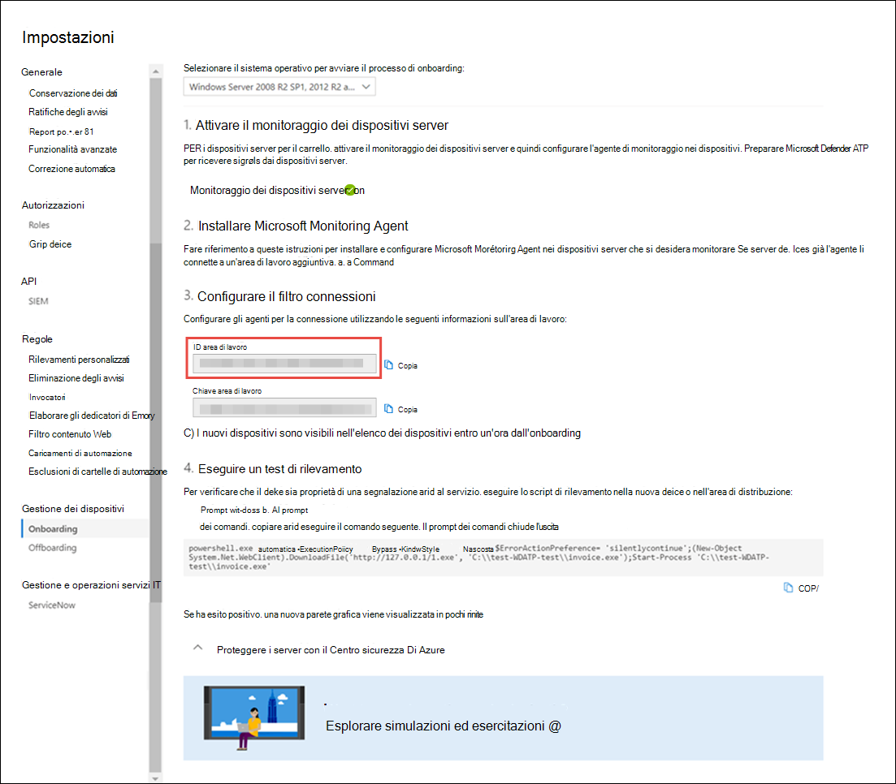

# <a name="onboard-windows-servers-to-the-microsoft-defender-for-endpoint-service"></a><span data-ttu-id="04911-104">Onboard dei server Windows nel servizio Microsoft Defender for Endpoint</span><span class="sxs-lookup"><span data-stu-id="04911-104">Onboard Windows servers to the Microsoft Defender for Endpoint service</span></span>

[!INCLUDE [Microsoft 365 Defender rebranding](../../includes/microsoft-defender.md)]


<span data-ttu-id="04911-105">**Si applica a:**</span><span class="sxs-lookup"><span data-stu-id="04911-105">**Applies to:**</span></span>

- <span data-ttu-id="04911-106">Windows Server 2008 R2 SP1</span><span class="sxs-lookup"><span data-stu-id="04911-106">Windows Server 2008 R2 SP1</span></span>
- <span data-ttu-id="04911-107">Windows Server 2012 R2</span><span class="sxs-lookup"><span data-stu-id="04911-107">Windows Server 2012 R2</span></span>
- <span data-ttu-id="04911-108">Windows Server 2016</span><span class="sxs-lookup"><span data-stu-id="04911-108">Windows Server 2016</span></span>
- <span data-ttu-id="04911-109">Windows Server (SAC) versione 1803 e successive</span><span class="sxs-lookup"><span data-stu-id="04911-109">Windows Server (SAC) version 1803 and later</span></span>
- <span data-ttu-id="04911-110">Windows Server 2019 e versioni successive</span><span class="sxs-lookup"><span data-stu-id="04911-110">Windows Server 2019 and later</span></span>
- <span data-ttu-id="04911-111">Windows Server 2019 Core Edition</span><span class="sxs-lookup"><span data-stu-id="04911-111">Windows Server 2019 core edition</span></span>

> <span data-ttu-id="04911-112">Vuoi provare Defender per Endpoint?</span><span class="sxs-lookup"><span data-stu-id="04911-112">Want to experience Defender for Endpoint?</span></span> [<span data-ttu-id="04911-113">Iscriversi per una versione di valutazione gratuita.</span><span class="sxs-lookup"><span data-stu-id="04911-113">Sign up for a free trial.</span></span>](https://www.microsoft.com/microsoft-365/windows/microsoft-defender-atp?ocid=docs-wdatp-configserver-abovefoldlink)


<span data-ttu-id="04911-114">Defender for Endpoint estende il supporto per includere anche il sistema operativo Windows Server.</span><span class="sxs-lookup"><span data-stu-id="04911-114">Defender for Endpoint extends support to also include the Windows Server operating system.</span></span> <span data-ttu-id="04911-115">Questo supporto offre funzionalità avanzate di rilevamento e analisi degli attacchi tramite la console di Microsoft Defender Security Center.</span><span class="sxs-lookup"><span data-stu-id="04911-115">This support provides advanced attack detection and investigation capabilities seamlessly through the Microsoft Defender Security Center console.</span></span>

<span data-ttu-id="04911-116">Per una guida pratica su cosa deve essere in atto per le licenze e l'infrastruttura, vedi [Protezione dei server Windows con Defender per endpoint.](https://techcommunity.microsoft.com/t5/What-s-New/Protecting-Windows-Server-with-Windows-Defender-ATP/m-p/267114#M128)</span><span class="sxs-lookup"><span data-stu-id="04911-116">For a practical guidance on what needs to be in place for licensing and infrastructure, see [Protecting Windows Servers with Defender for Endpoint](https://techcommunity.microsoft.com/t5/What-s-New/Protecting-Windows-Server-with-Windows-Defender-ATP/m-p/267114#M128).</span></span>

<span data-ttu-id="04911-117">Per indicazioni su come scaricare e usare Le linee di base della sicurezza di Windows per i server Windows, vedi [Linee di base per la sicurezza di Windows.](https://docs.microsoft.com/windows/device-security/windows-security-baselines)</span><span class="sxs-lookup"><span data-stu-id="04911-117">For guidance on how to download and use Windows Security Baselines for Windows servers, see [Windows Security Baselines](https://docs.microsoft.com/windows/device-security/windows-security-baselines).</span></span>

<br>

## <a name="windows-server-2008-r2-sp1-windows-server-2012-r2-and-windows-server-2016"></a><span data-ttu-id="04911-118">Windows Server 2008 R2 SP1, Windows Server 2012 R2 e Windows Server 2016</span><span class="sxs-lookup"><span data-stu-id="04911-118">Windows Server 2008 R2 SP1, Windows Server 2012 R2, and Windows Server 2016</span></span>

<span data-ttu-id="04911-119">È possibile eseguire l'onboarding di Windows Server 2008 R2 SP1, Windows Server 2012 R2 e Windows Server 2016 in Defender for Endpoint utilizzando una delle opzioni seguenti:</span><span class="sxs-lookup"><span data-stu-id="04911-119">You can onboard Windows Server 2008 R2 SP1, Windows Server 2012 R2, and Windows Server 2016 to Defender for Endpoint by using any of the following options:</span></span>

- <span data-ttu-id="04911-120">**Opzione 1:** [eseguire l'onboarding installando e configurando Microsoft Monitoring Agent (MMA)](#option-1-onboard-by-installing-and-configuring-microsoft-monitoring-agent-mma)</span><span class="sxs-lookup"><span data-stu-id="04911-120">**Option 1**: [Onboard by installing and configuring Microsoft Monitoring Agent (MMA)](#option-1-onboard-by-installing-and-configuring-microsoft-monitoring-agent-mma)</span></span>
- <span data-ttu-id="04911-121">**Opzione 2:** [onboard tramite il Centro sicurezza Di Azure](#option-2-onboard-windows-servers-through-azure-security-center)</span><span class="sxs-lookup"><span data-stu-id="04911-121">**Option 2**: [Onboard through Azure Security Center](#option-2-onboard-windows-servers-through-azure-security-center)</span></span>
- <span data-ttu-id="04911-122">**Opzione 3**: [Onboard tramite Microsoft Endpoint Manager versione 2002 e successive](#option-3-onboard-windows-servers-through-microsoft-endpoint-manager-version-2002-and-later)</span><span class="sxs-lookup"><span data-stu-id="04911-122">**Option 3**: [Onboard through Microsoft Endpoint Manager version 2002 and later](#option-3-onboard-windows-servers-through-microsoft-endpoint-manager-version-2002-and-later)</span></span>


<span data-ttu-id="04911-123">Dopo aver completato i passaggi di onboarding usando una delle opzioni fornite, è necessario configurare e aggiornare i client [di System Center Endpoint Protection.](#configure-and-update-system-center-endpoint-protection-clients)</span><span class="sxs-lookup"><span data-stu-id="04911-123">After completing the onboarding steps using any of the provided options, you'll need to [Configure and update System Center Endpoint Protection clients](#configure-and-update-system-center-endpoint-protection-clients).</span></span>


> [!NOTE]
> <span data-ttu-id="04911-124">Defender for Endpoint è necessaria una licenza server autonoma per nodo per eseguire l'onboardboard di un server Windows tramite Microsoft Monitoring Agent (opzione 1) o Tramite Microsoft Endpoint Manager (opzione 3).</span><span class="sxs-lookup"><span data-stu-id="04911-124">Defender for Endpoint standalone server license is required, per node, in order to onboard a Windows server through Microsoft Monitoring Agent (Option 1), or through Microsoft Endpoint Manager (Option 3).</span></span> <span data-ttu-id="04911-125">In alternativa, è necessaria una licenza di Azure Defender for Servers, per nodo, per eseguire l'onboardboard di un server Windows tramite Il Centro sicurezza Di Azure (opzione 2), vedere Funzionalità supportate disponibili nel Centro sicurezza di [Azure.](https://docs.microsoft.com/azure/security-center/security-center-services)</span><span class="sxs-lookup"><span data-stu-id="04911-125">Alternatively, an Azure Defender for Servers license is required, per node, in order to onboard a Windows server through Azure Security Center (Option 2), see [Supported features available in Azure Security Center](https://docs.microsoft.com/azure/security-center/security-center-services).</span></span>


### <a name="option-1-onboard-by-installing-and-configuring-microsoft-monitoring-agent-mma"></a><span data-ttu-id="04911-126">Opzione 1: eseguire l'onboarding installando e configurando Microsoft Monitoring Agent (MMA)</span><span class="sxs-lookup"><span data-stu-id="04911-126">Option 1: Onboard by installing and configuring Microsoft Monitoring Agent (MMA)</span></span>
<span data-ttu-id="04911-127">Dovrai installare e configurare MMA per i server Windows per segnalare i dati del sensore a Defender per Endpoint.</span><span class="sxs-lookup"><span data-stu-id="04911-127">You'll need to install and configure MMA for Windows servers to report sensor data to Defender for Endpoint.</span></span> <span data-ttu-id="04911-128">Per ulteriori informazioni, vedere [Raccogliere i dati di log con l'agente Di log di Azure.](https://docs.microsoft.com/azure/azure-monitor/platform/log-analytics-agent)</span><span class="sxs-lookup"><span data-stu-id="04911-128">For more information, see [Collect log data with Azure Log Analytics agent](https://docs.microsoft.com/azure/azure-monitor/platform/log-analytics-agent).</span></span>

<span data-ttu-id="04911-129">Se si usa già System Center Operations Manager (SCOM) o Azure Monitor (in precedenza noto come Operations Management Suite (OMS),collegare Microsoft Monitoring Agent (MMA) per creare report nell'area di lavoro di Defender for Endpoint tramite il supporto di Multihoming.</span><span class="sxs-lookup"><span data-stu-id="04911-129">If you're already using System Center Operations Manager (SCOM) or Azure Monitor (formerly known as Operations Management Suite (OMS)), attach the Microsoft Monitoring Agent (MMA) to report to your Defender for Endpoint workspace through Multihoming support.</span></span>

<span data-ttu-id="04911-130">In generale, è necessario eseguire la procedura seguente:</span><span class="sxs-lookup"><span data-stu-id="04911-130">In general, you'll need to take the following steps:</span></span>
1. <span data-ttu-id="04911-131">Soddisfare i requisiti di onboarding descritti nella **sezione Prima di** iniziare.</span><span class="sxs-lookup"><span data-stu-id="04911-131">Fulfill the onboarding requirements outlined in **Before you begin** section.</span></span>
2. <span data-ttu-id="04911-132">Attivare il monitoraggio dei server da Microsoft Defender Security Center.</span><span class="sxs-lookup"><span data-stu-id="04911-132">Turn on server monitoring from Microsoft Defender Security center.</span></span>
3. <span data-ttu-id="04911-133">Installare e configurare MMA per il server per segnalare i dati del sensore a Defender per Endpoint.</span><span class="sxs-lookup"><span data-stu-id="04911-133">Install and configure MMA for the server to report sensor data to Defender for Endpoint.</span></span>
4. <span data-ttu-id="04911-134">Configurare e aggiornare i client di System Center Endpoint Protection.</span><span class="sxs-lookup"><span data-stu-id="04911-134">Configure and update System Center Endpoint Protection clients.</span></span>


> [!TIP]
> <span data-ttu-id="04911-135">Dopo l'onboarding del dispositivo, puoi scegliere di eseguire un test di rilevamento per verificare che sia stato correttamente eseguito l'onboarding nel servizio.</span><span class="sxs-lookup"><span data-stu-id="04911-135">After onboarding the device, you can choose to run a detection test to verify that it is properly onboarded to the service.</span></span> <span data-ttu-id="04911-136">Per altre informazioni, vedi Eseguire un test di rilevamento su un defender appena [onboarded per endpoint](run-detection-test.md)endpoint.</span><span class="sxs-lookup"><span data-stu-id="04911-136">For more information, see [Run a detection test on a newly onboarded Defender for Endpoint endpoint](run-detection-test.md).</span></span>


#### <a name="before-you-begin"></a><span data-ttu-id="04911-137">Prima di iniziare</span><span class="sxs-lookup"><span data-stu-id="04911-137">Before you begin</span></span> 
<span data-ttu-id="04911-138">Eseguire la procedura seguente per soddisfare i requisiti di onboarding:</span><span class="sxs-lookup"><span data-stu-id="04911-138">Perform the following steps to fulfill the onboarding requirements:</span></span>

 - <span data-ttu-id="04911-139">Per Windows Server 2008 R2 SP1 o Windows Server 2012 R2, assicurarsi di installare l'hotfix seguente:</span><span class="sxs-lookup"><span data-stu-id="04911-139">For Windows Server 2008 R2 SP1 or Windows Server 2012 R2, ensure that you install the following hotfix:</span></span>
    - [<span data-ttu-id="04911-140">Aggiornamento per l'esperienza del cliente e telemetria diagnostica</span><span class="sxs-lookup"><span data-stu-id="04911-140">Update for customer experience and diagnostic telemetry</span></span>](https://support.microsoft.com/help/3080149/update-for-customer-experience-and-diagnostic-telemetry)

 - <span data-ttu-id="04911-141">Inoltre, per Windows Server 2008 R2 SP1, assicurarsi di soddisfare i requisiti seguenti:</span><span class="sxs-lookup"><span data-stu-id="04911-141">In addition, for Windows Server 2008 R2 SP1, ensure that you fulfill the following requirements:</span></span>
    - <span data-ttu-id="04911-142">Installare [l'aggiornamento cumulativo mensile di febbraio](https://support.microsoft.com/help/4074598/windows-7-update-kb4074598)</span><span class="sxs-lookup"><span data-stu-id="04911-142">Install the [February monthly update rollup](https://support.microsoft.com/help/4074598/windows-7-update-kb4074598)</span></span>
    - <span data-ttu-id="04911-143">Installare [.NET Framework 4.5](https://www.microsoft.com/download/details.aspx?id=30653) (o versione successiva) o [KB3154518](https://support.microsoft.com/help/3154518/support-for-tls-system-default-versions-included-in-the-net-framework)</span><span class="sxs-lookup"><span data-stu-id="04911-143">Install either [.NET framework 4.5](https://www.microsoft.com/download/details.aspx?id=30653) (or later) or [KB3154518](https://support.microsoft.com/help/3154518/support-for-tls-system-default-versions-included-in-the-net-framework)</span></span>
   
   > [!NOTE]
    > <span data-ttu-id="04911-144">Se si gestisce Windows Server 2008 R2 SP1 con SCCM, l'agente client SCCM installa .Net Framework 4.5.2.</span><span class="sxs-lookup"><span data-stu-id="04911-144">If you are managing your Windows Server 2008 R2 SP1 with SCCM, the SCCM client agent installs .Net Framework 4.5.2.</span></span> <span data-ttu-id="04911-145">Non è quindi necessario installare .NET Framework 4.5 (o versione successiva).</span><span class="sxs-lookup"><span data-stu-id="04911-145">So you don't need to install the .NET framework 4.5 (or later).</span></span>
   
 - <span data-ttu-id="04911-146">Per Windows Server 2008 R2 SP1 e Windows Server 2012 R2: Configurare e aggiornare i client [di System Center Endpoint Protection.](#configure-and-update-system-center-endpoint-protection-clients)</span><span class="sxs-lookup"><span data-stu-id="04911-146">For Windows Server 2008 R2 SP1 and Windows Server 2012 R2: [Configure and update System Center Endpoint Protection clients](#configure-and-update-system-center-endpoint-protection-clients).</span></span>

    > [!NOTE]
    > <span data-ttu-id="04911-147">Questo passaggio è necessario solo se l'organizzazione usa System Center Endpoint Protection (SCEP) e stai onboarding di Windows Server 2008 R2 SP1 e Windows Server 2012 R2.</span><span class="sxs-lookup"><span data-stu-id="04911-147">This step is required only if your organization uses System Center Endpoint Protection (SCEP) and you're onboarding Windows Server 2008 R2 SP1 and Windows Server 2012 R2.</span></span>


<span id="server-mma"/>

### <a name="install-and-configure-microsoft-monitoring-agent-mma-to-report-sensor-data-to-microsoft-defender-for-endpoint"></a><span data-ttu-id="04911-148">Installare e configurare Microsoft Monitoring Agent (MMA) per segnalare i dati del sensore a Microsoft Defender per Endpoint</span><span class="sxs-lookup"><span data-stu-id="04911-148">Install and configure Microsoft Monitoring Agent (MMA) to report sensor data to Microsoft Defender for Endpoint</span></span>

1. <span data-ttu-id="04911-149">Scaricare il file di installazione dell'agente: [Windows 64-bit agent](https://go.microsoft.com/fwlink/?LinkId=828603).</span><span class="sxs-lookup"><span data-stu-id="04911-149">Download the agent setup file: [Windows 64-bit agent](https://go.microsoft.com/fwlink/?LinkId=828603).</span></span>

2. <span data-ttu-id="04911-150">Utilizzando l'ID area di lavoro e la chiave Workspace ottenuta nella procedura precedente, scegliere uno dei metodi di installazione seguenti per installare l'agente nel server Windows:</span><span class="sxs-lookup"><span data-stu-id="04911-150">Using the Workspace ID and Workspace key obtained in the previous procedure, choose any of the following installation methods to install the agent on the Windows server:</span></span>
    - <span data-ttu-id="04911-151">[Installare manualmente l'agente utilizzando il programma di installazione](https://docs.microsoft.com/azure/log-analytics/log-analytics-windows-agents#install-agent-using-setup-wizard).</span><span class="sxs-lookup"><span data-stu-id="04911-151">[Manually install the agent using setup](https://docs.microsoft.com/azure/log-analytics/log-analytics-windows-agents#install-agent-using-setup-wizard).</span></span> <br>
    <span data-ttu-id="04911-152">Nella pagina **Opzioni di installazione agente** scegliere Connetti **l'agente ad Azure Log Analytics (OMS).**</span><span class="sxs-lookup"><span data-stu-id="04911-152">On the **Agent Setup Options** page, choose **Connect the agent to Azure Log Analytics (OMS)**.</span></span>
    - <span data-ttu-id="04911-153">[Installare l'agente utilizzando la riga di comando](https://docs.microsoft.com/azure/log-analytics/log-analytics-windows-agents#install-agent-using-command-line).</span><span class="sxs-lookup"><span data-stu-id="04911-153">[Install the agent using the command line](https://docs.microsoft.com/azure/log-analytics/log-analytics-windows-agents#install-agent-using-command-line).</span></span>
    - <span data-ttu-id="04911-154">[Configurare l'agente utilizzando uno script](https://docs.microsoft.com/azure/log-analytics/log-analytics-windows-agents#install-agent-using-dsc-in-azure-automation).</span><span class="sxs-lookup"><span data-stu-id="04911-154">[Configure the agent using a script](https://docs.microsoft.com/azure/log-analytics/log-analytics-windows-agents#install-agent-using-dsc-in-azure-automation).</span></span>

> [!NOTE]
> <span data-ttu-id="04911-155">If you are a [US Government customer](gov.md), under "Azure Cloud" you'll need to choose "Azure US Government" if using the setup wizard, or if using a command line or a script - set the "OPINSIGHTS_WORKSPACE_AZURE_CLOUD_TYPE" parameter to 1.</span><span class="sxs-lookup"><span data-stu-id="04911-155">If you are a [US Government customer](gov.md), under "Azure Cloud" you'll need to choose "Azure US Government" if using the setup wizard, or if using a command line or a script - set the "OPINSIGHTS_WORKSPACE_AZURE_CLOUD_TYPE" parameter to 1.</span></span>


<span id="server-proxy"/>

### <a name="configure-windows-server-proxy-and-internet-connectivity-settings-if-needed"></a><span data-ttu-id="04911-156">Configurare le impostazioni di connettività Internet e proxy di Windows Server, se necessario</span><span class="sxs-lookup"><span data-stu-id="04911-156">Configure Windows server proxy and Internet connectivity settings if needed</span></span>
<span data-ttu-id="04911-157">Se i server devono usare un proxy per comunicare con Defender per Endpoint, usa uno dei metodi seguenti per configurare la MMA per l'utilizzo del server proxy:</span><span class="sxs-lookup"><span data-stu-id="04911-157">If your servers need to use a proxy to communicate with Defender for Endpoint, use one of the following methods to configure the MMA to use the proxy server:</span></span>


- [<span data-ttu-id="04911-158">Configurare la MMA per l'utilizzo di un server proxy</span><span class="sxs-lookup"><span data-stu-id="04911-158">Configure the MMA to use a proxy server</span></span>](https://docs.microsoft.com/azure/azure-monitor/platform/agent-windows#install-agent-using-setup-wizard)

- [<span data-ttu-id="04911-159">Configurare Windows per l'utilizzo di un server proxy per tutte le connessioni</span><span class="sxs-lookup"><span data-stu-id="04911-159">Configure Windows to use a proxy server for all connections</span></span>](configure-proxy-internet.md)

<span data-ttu-id="04911-160">Se è in uso un proxy o un firewall, assicurarsi che i server possano accedere a tutti gli URL del servizio Microsoft Defender for Endpoint direttamente e senza l'intercettazione SSL.</span><span class="sxs-lookup"><span data-stu-id="04911-160">If a proxy or firewall is in use, please ensure that servers can access all of the Microsoft Defender for Endpoint service URLs directly and without SSL interception.</span></span> <span data-ttu-id="04911-161">Per altre informazioni, vedi [abilitare l'accesso a Defender per gli URL del servizio endpoint.](configure-proxy-internet.md#enable-access-to-microsoft-defender-for-endpoint-service-urls-in-the-proxy-server)</span><span class="sxs-lookup"><span data-stu-id="04911-161">For more information, see [enable access to Defender for Endpoint service URLs](configure-proxy-internet.md#enable-access-to-microsoft-defender-for-endpoint-service-urls-in-the-proxy-server).</span></span> <span data-ttu-id="04911-162">L'uso dell'intercettazione SSL impedirà al sistema di comunicare con il servizio Defender for Endpoint.</span><span class="sxs-lookup"><span data-stu-id="04911-162">Use of SSL interception will prevent the system from communicating with the Defender for Endpoint service.</span></span> 

<span data-ttu-id="04911-163">Al termine, nel portale dovrebbero essere visualizzati i server Windows onboarded entro un'ora.</span><span class="sxs-lookup"><span data-stu-id="04911-163">Once completed, you should see onboarded Windows servers in the portal within an hour.</span></span>

### <a name="option-2-onboard-windows-servers-through-azure-security-center"></a><span data-ttu-id="04911-164">Opzione 2: onboard dei server Windows tramite il Centro sicurezza Di Azure</span><span class="sxs-lookup"><span data-stu-id="04911-164">Option 2: Onboard Windows servers through Azure Security Center</span></span>
1. <span data-ttu-id="04911-165">Nel riquadro di spostamento di Microsoft Defender Security Center seleziona **Impostazioni**  >    >  **Onboarding** gestione dispositivi.</span><span class="sxs-lookup"><span data-stu-id="04911-165">In the Microsoft Defender Security Center navigation pane, select **Settings** > **Device management** > **Onboarding**.</span></span>

2. <span data-ttu-id="04911-166">Selezionare **Windows Server 2008 R2 SP1, 2012 R2 e 2016** come sistema operativo.</span><span class="sxs-lookup"><span data-stu-id="04911-166">Select **Windows Server 2008 R2 SP1, 2012 R2 and 2016** as the operating system.</span></span>

3. <span data-ttu-id="04911-167">Fare **clic su Onboard Servers nel Centro sicurezza di Azure.**</span><span class="sxs-lookup"><span data-stu-id="04911-167">Click **Onboard Servers in Azure Security Center**.</span></span>

4. <span data-ttu-id="04911-168">Seguire le istruzioni per l'onboarding in [Microsoft Defender for Endpoint with Azure Security Center](https://docs.microsoft.com/azure/security-center/security-center-wdatp).</span><span class="sxs-lookup"><span data-stu-id="04911-168">Follow the onboarding instructions in [Microsoft Defender for Endpoint with Azure Security Center](https://docs.microsoft.com/azure/security-center/security-center-wdatp).</span></span>

<span data-ttu-id="04911-169">Dopo aver completato i passaggi di onboarding, è necessario configurare e aggiornare i client [di System Center Endpoint Protection.](#configure-and-update-system-center-endpoint-protection-clients)</span><span class="sxs-lookup"><span data-stu-id="04911-169">After completing the onboarding steps, you'll need to [Configure and update System Center Endpoint Protection clients](#configure-and-update-system-center-endpoint-protection-clients).</span></span>

> [!NOTE]
> - <span data-ttu-id="04911-170">Perché l'onboarding tramite Azure Defender for Servers (in precedenza Azure Security Center Standard Edition) funzioni come previsto, il server deve avere un'area di lavoro e una chiave appropriate configurate nelle impostazioni di Microsoft Monitoring Agent (MMA).</span><span class="sxs-lookup"><span data-stu-id="04911-170">For onboarding via Azure Defender for Servers (previously Azure Security Center Standard Edition) to work as expected, the server must have an appropriate workspace and key configured within the Microsoft Monitoring Agent (MMA) settings.</span></span>
> - <span data-ttu-id="04911-171">Una volta configurato, il Management Pack cloud appropriato viene distribuito nel computer e il processo del sensore (MsSenseS.exe) verrà distribuito e avviato.</span><span class="sxs-lookup"><span data-stu-id="04911-171">Once configured, the appropriate cloud management pack is deployed on the machine and the sensor process (MsSenseS.exe) will be deployed and started.</span></span> 
> - <span data-ttu-id="04911-172">Questa operazione è necessaria anche se il server è configurato per l'utilizzo di un server gateway OMS come proxy.</span><span class="sxs-lookup"><span data-stu-id="04911-172">This is also required if the server is configured to use an OMS Gateway server as proxy.</span></span>

### <a name="option-3-onboard-windows-servers-through-microsoft-endpoint-manager-version-2002-and-later"></a><span data-ttu-id="04911-173">Opzione 3: onboard dei server Windows tramite Microsoft Endpoint Manager versione 2002 e successive</span><span class="sxs-lookup"><span data-stu-id="04911-173">Option 3: Onboard Windows servers through Microsoft Endpoint Manager version 2002 and later</span></span>
<span data-ttu-id="04911-174">Puoi eseguire l'onboardazione di Windows Server 2012 R2 e Windows Server 2016 utilizzando Microsoft Endpoint Manager versione 2002 e successive.</span><span class="sxs-lookup"><span data-stu-id="04911-174">You can onboard Windows Server 2012 R2 and Windows Server 2016 by using Microsoft Endpoint Manager version 2002 and later.</span></span> <span data-ttu-id="04911-175">Per altre informazioni, vedi [Microsoft Defender for Endpoint nel ramo corrente di Microsoft Endpoint Manager.](https://docs.microsoft.com/mem/configmgr/protect/deploy-use/defender-advanced-threat-protection)</span><span class="sxs-lookup"><span data-stu-id="04911-175">For more information, see [Microsoft Defender for Endpoint in Microsoft Endpoint Manager current branch](https://docs.microsoft.com/mem/configmgr/protect/deploy-use/defender-advanced-threat-protection).</span></span>

<span data-ttu-id="04911-176">Dopo aver completato i passaggi di onboarding, è necessario configurare e aggiornare i client [di System Center Endpoint Protection.](#configure-and-update-system-center-endpoint-protection-clients)</span><span class="sxs-lookup"><span data-stu-id="04911-176">After completing the onboarding steps, you'll need to [Configure and update System Center Endpoint Protection clients](#configure-and-update-system-center-endpoint-protection-clients).</span></span>

<br>

## <a name="windows-server-sac-version-1803-windows-server-2019-and-windows-server-2019-core-edition"></a><span data-ttu-id="04911-177">Windows Server (SAC) versione 1803, Windows Server 2019 e Windows Server 2019 Core Edition</span><span class="sxs-lookup"><span data-stu-id="04911-177">Windows Server (SAC) version 1803, Windows Server 2019, and Windows Server 2019 Core edition</span></span>
<span data-ttu-id="04911-178">È possibile eseguire l'onboard di Windows Server (SAC) versione 1803, Windows Server 2019 o Windows Server 2019 Core edition utilizzando i metodi di distribuzione seguenti:</span><span class="sxs-lookup"><span data-stu-id="04911-178">You can onboard Windows Server (SAC) version 1803, Windows Server 2019, or Windows Server 2019 Core edition by using the following deployment methods:</span></span>

- [<span data-ttu-id="04911-179">Script locale</span><span class="sxs-lookup"><span data-stu-id="04911-179">Local script</span></span>](configure-endpoints-script.md) 
- [<span data-ttu-id="04911-180">Criteri di gruppo</span><span class="sxs-lookup"><span data-stu-id="04911-180">Group Policy</span></span>](configure-endpoints-gp.md)
- [<span data-ttu-id="04911-181">Microsoft Endpoint Configuration Manager</span><span class="sxs-lookup"><span data-stu-id="04911-181">Microsoft Endpoint Configuration Manager</span></span>](configure-endpoints-sccm.md)
- [<span data-ttu-id="04911-182">System Center Configuration Manager 2012 / 2012 R2 1511 / 1602</span><span class="sxs-lookup"><span data-stu-id="04911-182">System Center Configuration Manager 2012 / 2012 R2  1511 / 1602</span></span>](configure-endpoints-sccm.md#onboard-devices-using-system-center-configuration-manager)
- [<span data-ttu-id="04911-183">Script di onboarding VDI per dispositivi non persistenti</span><span class="sxs-lookup"><span data-stu-id="04911-183">VDI onboarding scripts for non-persistent devices</span></span>](configure-endpoints-vdi.md)

> [!NOTE]
> - <span data-ttu-id="04911-184">Il pacchetto di onboarding per Windows Server 2019 tramite Microsoft Endpoint Manager attualmente contiene uno script.</span><span class="sxs-lookup"><span data-stu-id="04911-184">The Onboarding package for Windows Server 2019 through Microsoft Endpoint Manager currently ships a script.</span></span> <span data-ttu-id="04911-185">Per altre informazioni su come distribuire gli script in Configuration Manager, vedi [Pacchetti e programmi in Configuration Manager.](https://docs.microsoft.com/configmgr/apps/deploy-use/packages-and-programs)</span><span class="sxs-lookup"><span data-stu-id="04911-185">For more information on how to deploy scripts in Configuration Manager, see [Packages and programs in Configuration Manager](https://docs.microsoft.com/configmgr/apps/deploy-use/packages-and-programs).</span></span>
> - <span data-ttu-id="04911-186">Uno script locale è adatto per un modello di prova, ma non deve essere utilizzato per la distribuzione di produzione.</span><span class="sxs-lookup"><span data-stu-id="04911-186">A local script is suitable for a proof of concept but should not be used for production deployment.</span></span> <span data-ttu-id="04911-187">Per una distribuzione di produzione, ti consigliamo di usare Criteri di gruppo o Microsoft Endpoint Configuration Manager.</span><span class="sxs-lookup"><span data-stu-id="04911-187">For a production deployment, we recommend using Group Policy, or Microsoft Endpoint Configuration Manager.</span></span>

<span data-ttu-id="04911-188">Il supporto per Windows Server fornisce informazioni più approfondite sulle attività del server, sulla copertura per il rilevamento di attacchi di kernel e memoria e consente azioni di risposta.</span><span class="sxs-lookup"><span data-stu-id="04911-188">Support for Windows Server provides deeper insight into server activities, coverage for kernel and memory attack detection, and enables response actions.</span></span>

1. <span data-ttu-id="04911-189">Configura le impostazioni di onboarding di Defender per endpoint nel server Windows usando gli stessi strumenti e metodi per i dispositivi Windows 10.</span><span class="sxs-lookup"><span data-stu-id="04911-189">Configure Defender for Endpoint onboarding settings on the Windows server using the same tools and methods for Windows 10 devices.</span></span> <span data-ttu-id="04911-190">Per altre informazioni, vedi [Onboard di dispositivi Windows 10.](configure-endpoints.md)</span><span class="sxs-lookup"><span data-stu-id="04911-190">For more information, see [Onboard Windows 10 devices](configure-endpoints.md).</span></span>

2. <span data-ttu-id="04911-191">Se si esegue una soluzione antimalware di terze parti, è necessario applicare le impostazioni della modalità passiva di Microsoft Defender AV seguenti.</span><span class="sxs-lookup"><span data-stu-id="04911-191">If you're running a third-party antimalware solution, you'll need to apply the following Microsoft Defender AV passive mode settings.</span></span> <span data-ttu-id="04911-192">Verificare che sia stato configurato correttamente:</span><span class="sxs-lookup"><span data-stu-id="04911-192">Verify that it was configured correctly:</span></span>

    1. <span data-ttu-id="04911-193">Impostare la voce del Registro di sistema seguente:</span><span class="sxs-lookup"><span data-stu-id="04911-193">Set the following registry entry:</span></span>
       - <span data-ttu-id="04911-194">Percorso: `HKLM\SOFTWARE\Policies\Microsoft\Windows Advanced Threat Protection`</span><span class="sxs-lookup"><span data-stu-id="04911-194">Path: `HKLM\SOFTWARE\Policies\Microsoft\Windows Advanced Threat Protection`</span></span>
       - <span data-ttu-id="04911-195">Nome: ForceDefenderPassiveMode</span><span class="sxs-lookup"><span data-stu-id="04911-195">Name: ForceDefenderPassiveMode</span></span>
       - <span data-ttu-id="04911-196">Tipo: REG_DWORD</span><span class="sxs-lookup"><span data-stu-id="04911-196">Type: REG_DWORD</span></span>
       - <span data-ttu-id="04911-197">Value: 1</span><span class="sxs-lookup"><span data-stu-id="04911-197">Value: 1</span></span>

    1. <span data-ttu-id="04911-198">Eseguire il comando di PowerShell seguente per verificare che la modalità passiva sia stata configurata:</span><span class="sxs-lookup"><span data-stu-id="04911-198">Run the following PowerShell command to verify that the passive mode was configured:</span></span>

       ```PowerShell
       Get-WinEvent -FilterHashtable @{ProviderName="Microsoft-Windows-Sense" ;ID=84}
       ```

    1. <span data-ttu-id="04911-199">Verificare che sia stato trovato un evento recente contenente l'evento in modalità passiva:</span><span class="sxs-lookup"><span data-stu-id="04911-199">Confirm  that a recent event containing the passive mode event is found:</span></span>

       

3. <span data-ttu-id="04911-201">Eseguire il comando seguente per verificare se Microsoft Defender AV è installato:</span><span class="sxs-lookup"><span data-stu-id="04911-201">Run the following command to check if Microsoft Defender AV is installed:</span></span>

   ```sc.exe query Windefend```

    <span data-ttu-id="04911-202">Se il risultato è "Il servizio specificato non esiste come servizio installato", dovrai installare Microsoft Defender AV.</span><span class="sxs-lookup"><span data-stu-id="04911-202">If the result is 'The specified service doesn't exist as an installed service', then you'll need to install Microsoft Defender AV.</span></span> <span data-ttu-id="04911-203">Per altre informazioni, vedi [Microsoft Defender Antivirus in Windows 10.](https://docs.microsoft.com/windows/security/threat-protection/microsoft-defender-antivirus/microsoft-defender-antivirus-in-windows-10)</span><span class="sxs-lookup"><span data-stu-id="04911-203">For more information, see [Microsoft Defender Antivirus in Windows 10](https://docs.microsoft.com/windows/security/threat-protection/microsoft-defender-antivirus/microsoft-defender-antivirus-in-windows-10).</span></span>
    
    <span data-ttu-id="04911-204">Per informazioni su come usare Criteri di gruppo per configurare e gestire Microsoft Defender Antivirus nei server Windows, vedere Usare le impostazioni di Criteri di gruppo per configurare e gestire [Microsoft Defender Antivirus.](https://docs.microsoft.com/windows/security/threat-protection/microsoft-defender-antivirus/use-group-policy-microsoft-defender-antivirus)</span><span class="sxs-lookup"><span data-stu-id="04911-204">For information on how to use Group Policy to configure and manage Microsoft Defender Antivirus on your Windows servers, see [Use Group Policy settings to configure and manage Microsoft Defender Antivirus](https://docs.microsoft.com/windows/security/threat-protection/microsoft-defender-antivirus/use-group-policy-microsoft-defender-antivirus).</span></span>

<br>

## <a name="integration-with-azure-security-center"></a><span data-ttu-id="04911-205">Integrazione con il Centro sicurezza di Azure</span><span class="sxs-lookup"><span data-stu-id="04911-205">Integration with Azure Security Center</span></span>
<span data-ttu-id="04911-206">Defender for Endpoint può integrarsi con Il Centro sicurezza Di Azure per fornire una soluzione completa di protezione dei server Windows.</span><span class="sxs-lookup"><span data-stu-id="04911-206">Defender for Endpoint can integrate with Azure Security Center to provide a comprehensive Windows server protection solution.</span></span> <span data-ttu-id="04911-207">Con questa integrazione, Il Centro sicurezza di Azure può usare la potenza di Defender for Endpoint per fornire un rilevamento delle minacce migliorato per i server Windows.</span><span class="sxs-lookup"><span data-stu-id="04911-207">With this integration, Azure Security Center can use the power of Defender for Endpoint to provide improved threat detection for Windows Servers.</span></span>

<span data-ttu-id="04911-208">In questa integrazione sono incluse le funzionalità seguenti:</span><span class="sxs-lookup"><span data-stu-id="04911-208">The following capabilities are included in this integration:</span></span>
- <span data-ttu-id="04911-209">Onboarding automatico: il sensore Defender for Endpoint viene abilitato automaticamente nei server Windows onboarding nel Centro sicurezza Di Azure.</span><span class="sxs-lookup"><span data-stu-id="04911-209">Automated onboarding - Defender for Endpoint sensor is automatically enabled on Windows Servers that are onboarded to Azure Security Center.</span></span> <span data-ttu-id="04911-210">Per ulteriori informazioni sull'onboarding del Centro sicurezza di Azure, vedere [Onboarding to Azure Security Center Standard for enhanced security](https://docs.microsoft.com/azure/security-center/security-center-onboarding).</span><span class="sxs-lookup"><span data-stu-id="04911-210">For more information on Azure Security Center onboarding, see [Onboarding to Azure Security Center Standard for enhanced security](https://docs.microsoft.com/azure/security-center/security-center-onboarding).</span></span>

    > [!NOTE]
    > <span data-ttu-id="04911-211">L'onboarding automatico è applicabile solo per Windows Server 2008 R2 SP1, Windows Server 2012 R2 e Windows Server 2016.</span><span class="sxs-lookup"><span data-stu-id="04911-211">Automated onboarding is only applicable for Windows Server 2008 R2 SP1, Windows Server 2012 R2, and Windows Server 2016.</span></span>

- <span data-ttu-id="04911-212">I server Windows monitorati dal Centro sicurezza di Azure saranno disponibili anche in Defender for Endpoint: Azure Security Center si connette senza problemi al tenant Defender for Endpoint, offrendo una singola visualizzazione tra client e server.</span><span class="sxs-lookup"><span data-stu-id="04911-212">Windows servers monitored by Azure Security Center will also be available in Defender for Endpoint - Azure Security Center seamlessly connects to the Defender for Endpoint tenant, providing a single view across clients and servers.</span></span>  <span data-ttu-id="04911-213">Inoltre, gli avvisi di Defender for Endpoint saranno disponibili nella console del Centro sicurezza Di Azure.</span><span class="sxs-lookup"><span data-stu-id="04911-213">In addition, Defender for Endpoint alerts will be available in the Azure Security Center console.</span></span>
- <span data-ttu-id="04911-214">Indagine server: i clienti del Centro sicurezza Di Azure possono accedere a Microsoft Defender Security Center per eseguire indagini dettagliate per scoprire l'ambito di una potenziale violazione.</span><span class="sxs-lookup"><span data-stu-id="04911-214">Server investigation -  Azure Security Center customers can access Microsoft Defender Security Center to perform detailed investigation to uncover the scope of a potential breach.</span></span>

> [!IMPORTANT]
> - <span data-ttu-id="04911-215">Quando si utilizza il Centro sicurezza di Azure per monitorare i server, viene creato automaticamente un tenant Defender for Endpoint (negli Stati Uniti per gli utenti statunitensi, nell'UE per gli utenti europei e del Regno Unito).</span><span class="sxs-lookup"><span data-stu-id="04911-215">When you use Azure Security Center to monitor servers, a Defender for Endpoint tenant is automatically created (in the US for US users, in the EU for European and UK users).</span></span><br>
<span data-ttu-id="04911-216">I dati raccolti da Defender per Endpoint vengono archiviati nella posizione geografica del tenant come identificato durante il provisioning.</span><span class="sxs-lookup"><span data-stu-id="04911-216">Data collected by Defender for Endpoint is stored in the geo-location of the tenant as identified during provisioning.</span></span>
> - <span data-ttu-id="04911-217">Se usi Defender per Endpoint prima di usare Il Centro sicurezza di Azure, i dati verranno archiviati nella posizione specificata al momento della creazione del tenant anche se ti integri con Il Centro sicurezza Di Azure in un secondo momento.</span><span class="sxs-lookup"><span data-stu-id="04911-217">If you use Defender for Endpoint before using Azure Security Center, your data will be stored in the location you specified when you created your tenant even if you integrate with Azure Security Center at a later time.</span></span>
> - <span data-ttu-id="04911-218">Dopo la configurazione, non è possibile modificare la posizione in cui sono archiviati i dati.</span><span class="sxs-lookup"><span data-stu-id="04911-218">Once configured, you cannot change the location where your data is stored.</span></span> <span data-ttu-id="04911-219">Se è necessario spostare i dati in un'altra posizione, è necessario contattare il supporto tecnico Microsoft per reimpostare il tenant.</span><span class="sxs-lookup"><span data-stu-id="04911-219">If you need to move your data to another location, you need to contact Microsoft Support to reset the tenant.</span></span> <br>
<span data-ttu-id="04911-220">Il monitoraggio degli endpoint del server che utilizza questa integrazione è stato disabilitato per i clienti di Office 365 GCC.</span><span class="sxs-lookup"><span data-stu-id="04911-220">Server endpoint monitoring utilizing this integration has been disabled for Office 365 GCC customers.</span></span>

<br>

## <a name="configure-and-update-system-center-endpoint-protection-clients"></a><span data-ttu-id="04911-221">Configurare e aggiornare i client di System Center Endpoint Protection</span><span class="sxs-lookup"><span data-stu-id="04911-221">Configure and update System Center Endpoint Protection clients</span></span>

<span data-ttu-id="04911-222">Defender for Endpoint si integra con System Center Endpoint Protection.</span><span class="sxs-lookup"><span data-stu-id="04911-222">Defender for Endpoint integrates with System Center Endpoint Protection.</span></span> <span data-ttu-id="04911-223">L'integrazione fornisce visibilità ai rilevamenti di malware e per interrompere la propagazione di un attacco nell'organizzazione vietando file potenzialmente dannosi o malware sospetto.</span><span class="sxs-lookup"><span data-stu-id="04911-223">The integration provides visibility to malware detections and to stop propagation of an attack in your organization by banning potentially malicious files or suspected malware.</span></span>

<span data-ttu-id="04911-224">Per abilitare questa integrazione, sono necessari i passaggi seguenti:</span><span class="sxs-lookup"><span data-stu-id="04911-224">The following steps are required to enable this integration:</span></span>
- <span data-ttu-id="04911-225">Installare l'aggiornamento della piattaforma antimalware di gennaio [2017 per i client di Endpoint Protection.](https://support.microsoft.com/help/3209361/january-2017-anti-malware-platform-update-for-endpoint-protection-clie)</span><span class="sxs-lookup"><span data-stu-id="04911-225">Install the [January 2017 anti-malware platform update for Endpoint Protection clients](https://support.microsoft.com/help/3209361/january-2017-anti-malware-platform-update-for-endpoint-protection-clie).</span></span>

- <span data-ttu-id="04911-226">[Configurare l'appartenenza del servizio di protezione cloud](https://docs.microsoft.com/windows/security/threat-protection/microsoft-defender-antivirus/enable-cloud-protection-microsoft-defender-antivirus) del client SCEP all'impostazione Avanzate. </span><span class="sxs-lookup"><span data-stu-id="04911-226">[Configure the SCEP client Cloud Protection Service membership](https://docs.microsoft.com/windows/security/threat-protection/microsoft-defender-antivirus/enable-cloud-protection-microsoft-defender-antivirus) to the **Advanced** setting.</span></span>

<br>

## <a name="offboard-windows-servers"></a><span data-ttu-id="04911-227">Offboard di server Windows</span><span class="sxs-lookup"><span data-stu-id="04911-227">Offboard Windows servers</span></span>
<span data-ttu-id="04911-228">Puoi eseguire l'offboard di Windows Server (SAC), Windows Server 2019 e Windows Server 2019 Core edition nello stesso metodo disponibile per i dispositivi client Windows 10.</span><span class="sxs-lookup"><span data-stu-id="04911-228">You can offboard Windows Server (SAC), Windows Server 2019, and Windows Server 2019 Core edition in the same method available for Windows 10 client devices.</span></span>

<span data-ttu-id="04911-229">Per altre versioni di Windows Server, sono disponibili due opzioni per eseguire l'offboard dei server Windows dal servizio:</span><span class="sxs-lookup"><span data-stu-id="04911-229">For other Windows server versions, you have two options to offboard Windows servers from the service:</span></span>
- <span data-ttu-id="04911-230">Disinstallare l'agente MMA</span><span class="sxs-lookup"><span data-stu-id="04911-230">Uninstall the MMA agent</span></span>
- <span data-ttu-id="04911-231">Rimuovere la configurazione dell'area di lavoro defender per endpoint</span><span class="sxs-lookup"><span data-stu-id="04911-231">Remove the Defender for Endpoint workspace configuration</span></span>

> [!NOTE]
> <span data-ttu-id="04911-232">L'offboarding fa sì che il server Windows interrompi l'invio dei dati del sensore al portale, ma i dati dal server Windows, incluso il riferimento a eventuali avvisi che ha avuto, verranno conservati per un massimo di 6 mesi.</span><span class="sxs-lookup"><span data-stu-id="04911-232">Offboarding causes the Windows server to stop sending sensor data to the portal but data from the Windows server, including reference to any alerts it has had will be retained for up to 6 months.</span></span>

### <a name="uninstall-windows-servers-by-uninstalling-the-mma-agent"></a><span data-ttu-id="04911-233">Disinstallare i server Windows disinstallando l'agente MMA</span><span class="sxs-lookup"><span data-stu-id="04911-233">Uninstall Windows servers by uninstalling the MMA agent</span></span>
<span data-ttu-id="04911-234">Per eseguire l'offboard del server Windows, puoi disinstallare l'agente MMA dal server Windows o scollegarlo dalla creazione di report nell'area di lavoro defender per endpoint.</span><span class="sxs-lookup"><span data-stu-id="04911-234">To offboard the Windows server, you can uninstall the MMA agent from the Windows server or detach it from reporting to your Defender for Endpoint workspace.</span></span> <span data-ttu-id="04911-235">Dopo l'offboarding dell'agente, il server Windows non invierà più i dati del sensore a Defender per Endpoint.</span><span class="sxs-lookup"><span data-stu-id="04911-235">After offboarding the agent, the Windows server will no longer send sensor data to Defender for Endpoint.</span></span>
<span data-ttu-id="04911-236">Per ulteriori informazioni, vedere [Per disabilitare un agente.](https://docs.microsoft.com/azure/log-analytics/log-analytics-windows-agents#to-disable-an-agent)</span><span class="sxs-lookup"><span data-stu-id="04911-236">For more information, see [To disable an agent](https://docs.microsoft.com/azure/log-analytics/log-analytics-windows-agents#to-disable-an-agent).</span></span>

### <a name="remove-the-defender-for-endpoint-workspace-configuration"></a><span data-ttu-id="04911-237">Rimuovere la configurazione dell'area di lavoro defender per endpoint</span><span class="sxs-lookup"><span data-stu-id="04911-237">Remove the Defender for Endpoint workspace configuration</span></span>
<span data-ttu-id="04911-238">Per eseguire l'offboard del server Windows, è possibile utilizzare uno dei metodi seguenti:</span><span class="sxs-lookup"><span data-stu-id="04911-238">To offboard the Windows server, you can use either of the following methods:</span></span>

- <span data-ttu-id="04911-239">Rimuovere la configurazione dell'area di lavoro defender per endpoint dall'agente MMA</span><span class="sxs-lookup"><span data-stu-id="04911-239">Remove the Defender for Endpoint workspace configuration from the MMA agent</span></span>
- <span data-ttu-id="04911-240">Eseguire un comando di PowerShell per rimuovere la configurazione</span><span class="sxs-lookup"><span data-stu-id="04911-240">Run a PowerShell command to remove the configuration</span></span>

#### <a name="remove-the-defender-for-endpoint-workspace-configuration-from-the-mma-agent"></a><span data-ttu-id="04911-241">Rimuovere la configurazione dell'area di lavoro defender per endpoint dall'agente MMA</span><span class="sxs-lookup"><span data-stu-id="04911-241">Remove the Defender for Endpoint workspace configuration from the MMA agent</span></span>

1. <span data-ttu-id="04911-242">Nelle proprietà **di Microsoft Monitoring Agent** selezionare la scheda Azure Log Analytics **(OMS).**</span><span class="sxs-lookup"><span data-stu-id="04911-242">In the **Microsoft Monitoring Agent Properties**, select the **Azure Log Analytics (OMS)** tab.</span></span>

2. <span data-ttu-id="04911-243">Seleziona l'area di lavoro Defender per Endpoint e fai clic su **Rimuovi.**</span><span class="sxs-lookup"><span data-stu-id="04911-243">Select the Defender for Endpoint workspace, and click **Remove**.</span></span>

    

#### <a name="run-a-powershell-command-to-remove-the-configuration"></a><span data-ttu-id="04911-245">Eseguire un comando di PowerShell per rimuovere la configurazione</span><span class="sxs-lookup"><span data-stu-id="04911-245">Run a PowerShell command to remove the configuration</span></span>

1. <span data-ttu-id="04911-246">Ottenere l'ID area di lavoro:</span><span class="sxs-lookup"><span data-stu-id="04911-246">Get your Workspace ID:</span></span>

   1. <span data-ttu-id="04911-247">Nel riquadro di spostamento selezionare **Impostazioni**  >  **Onboarding.**</span><span class="sxs-lookup"><span data-stu-id="04911-247">In the navigation pane, select **Settings** > **Onboarding**.</span></span>

   1. <span data-ttu-id="04911-248">Selezionare **Windows Server 2008 R2 SP1, 2012 R2 e 2016** come sistema operativo e ottenere l'ID area di lavoro:</span><span class="sxs-lookup"><span data-stu-id="04911-248">Select **Windows Server 2008 R2 SP1, 2012 R2 and 2016** as the operating system and get your Workspace ID:</span></span>

      

2. <span data-ttu-id="04911-250">Aprire un PowerShell con privilegi elevati ed eseguire il comando seguente.</span><span class="sxs-lookup"><span data-stu-id="04911-250">Open an elevated PowerShell and run the following command.</span></span> <span data-ttu-id="04911-251">Utilizzare l'ID area di lavoro ottenuto e sostituendo `WorkspaceID` :</span><span class="sxs-lookup"><span data-stu-id="04911-251">Use the Workspace ID you obtained and replacing `WorkspaceID`:</span></span>

    ```powershell
    $ErrorActionPreference = "SilentlyContinue"
    # Load agent scripting object
    $AgentCfg = New-Object -ComObject AgentConfigManager.MgmtSvcCfg
    # Remove OMS Workspace
    $AgentCfg.RemoveCloudWorkspace("WorkspaceID")
    # Reload the configuration and apply changes
    $AgentCfg.ReloadConfiguration()

    ```

<br>

## <a name="related-topics"></a><span data-ttu-id="04911-252">Argomenti correlati</span><span class="sxs-lookup"><span data-stu-id="04911-252">Related topics</span></span>
- [<span data-ttu-id="04911-253">Onboard di dispositivi Windows 10</span><span class="sxs-lookup"><span data-stu-id="04911-253">Onboard Windows 10 devices</span></span>](configure-endpoints.md)
- [<span data-ttu-id="04911-254">Onboard di dispositivi non Windows</span><span class="sxs-lookup"><span data-stu-id="04911-254">Onboard non-Windows devices</span></span>](configure-endpoints-non-windows.md)
- [<span data-ttu-id="04911-255">Configurare le impostazioni di connettività Proxy e Internet</span><span class="sxs-lookup"><span data-stu-id="04911-255">Configure proxy and Internet connectivity settings</span></span>](configure-proxy-internet.md)
- [<span data-ttu-id="04911-256">Eseguire un test di rilevamento in un dispositivo Defender for Endpoint appena onboarded</span><span class="sxs-lookup"><span data-stu-id="04911-256">Run a detection test on a newly onboarded Defender for Endpoint device</span></span>](run-detection-test.md)
- [<span data-ttu-id="04911-257">Risoluzione dei problemi di onboarding di Microsoft Defender per endpoint</span><span class="sxs-lookup"><span data-stu-id="04911-257">Troubleshooting Microsoft Defender for Endpoint onboarding issues</span></span>](troubleshoot-onboarding.md)
