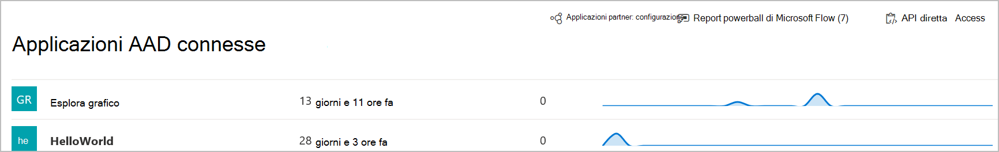

# Applicazioni connesse in Microsoft Defender for EndpointConnected applications in Microsoft Defender for Endpoint

[!INCLUDE [Microsoft 365 Defender rebranding](../../includes/microsoft-defender.md)]

**Si applica a:****Applies to:**
- [Microsoft Defender per endpointMicrosoft Defender for Endpoint](https://go.microsoft.com/fwlink/p/?linkid=2154037)
- [Microsoft 365 DefenderMicrosoft 365 Defender](https://go.microsoft.com/fwlink/?linkid=2118804)

>Vuoi provare Defender per Endpoint?Want to experience Defender for Endpoint? [Iscriversi per una versione di valutazione gratuita.Sign up for a free trial.](https://www.microsoft.com/microsoft-365/windows/microsoft-defender-atp?ocid=docs-wdatp-assignaccess-abovefoldlink)

Le applicazioni connesse si integrano con la piattaforma Defender for Endpoint usando le API.Connected applications integrates with the Defender for Endpoint platform using APIs. 

Le applicazioni usano il protocollo OAuth 2.0 standard per autenticare e fornire token da usare con le API di Microsoft Defender for Endpoint.Applications use standard OAuth 2.0 protocol to authenticate and provide tokens for use with Microsoft Defender for Endpoint APIs.  Inoltre, le Azure Active Directory (Azure AD) consentono agli amministratori tenant di impostare un controllo esplicito sulle API a cui è possibile accedere usando l'app corrispondente.In addition, Azure Active Directory (Azure AD) applications allow tenant admins to set explicit control over which APIs can be accessed using the corresponding app.
 
Dovrai seguire questi [passaggi](/microsoft-365/security/defender-endpoint/apis-intro) per usare le API con l'applicazione connessa.You'll need to follow [these steps](/microsoft-365/security/defender-endpoint/apis-intro) to use the APIs with the connected application.
 
## Accedere alla pagina dell'applicazione connessaAccess the connected application page
Nel menu di spostamento a sinistra seleziona **Endpoint Partner** e  >  **API Applicazioni**  >  **connesse.**From the left navigation menu, select **Endpoints** > **Partners and APIs** > **Connected applications**.

 
## Visualizzare i dettagli dell'applicazione connessaView connected application details
La pagina Applicazioni connesse fornisce informazioni sulle applicazioni di Azure AD connesse a Microsoft Defender for Endpoint nell'organizzazione.The Connected applications page provides information about the Azure AD applications connected to Microsoft Defender for Endpoint in your organization. È possibile esaminare l'utilizzo delle applicazioni connesse: ultimo visto, numero di richieste nelle ultime 24 ore e tendenze delle richieste negli ultimi 30 giorni.You can review the usage of the connected applications: last seen, number of requests in the past 24 hours, and request trends in the last 30 days.

 
## Modificare, riconfigurare o eliminare un'applicazione connessaEdit, reconfigure, or delete a connected application
Il **collegamento Apri impostazioni applicazione** apre la pagina di gestione delle applicazioni di Azure AD corrispondente nel portale di Azure.The **Open application settings** link opens the corresponding Azure AD application management page in the Azure portal. Dal portale di Azure, è possibile gestire le autorizzazioni, riconfigurare o eliminare le applicazioni connesse.From the Azure portal, you can manage permissions, reconfigure, or delete the connected applications.
