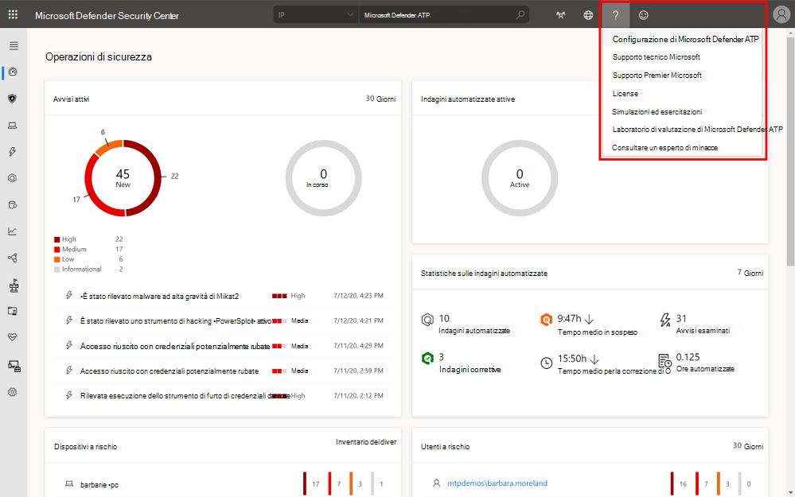
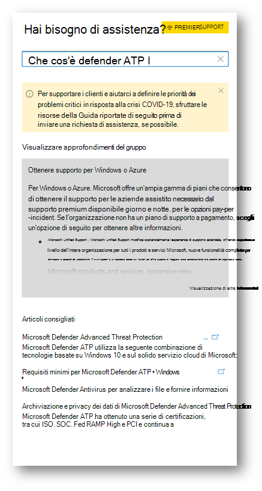
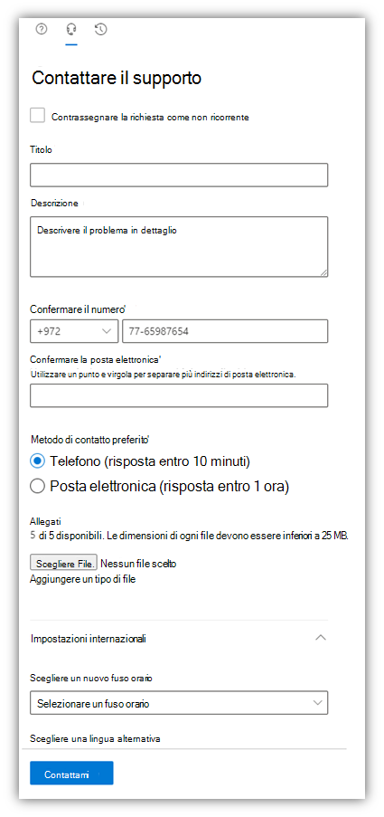

# Contattare il supporto di Microsoft Defender per endpoint

[!INCLUDE [Microsoft 365 Defender rebranding](../../includes/microsoft-defender.md)]

**Si applica a:**
- [Microsoft Defender ATP](https://go.microsoft.com/fwlink/p/?linkid=2154037)
- [Microsoft 365 Defender](https://go.microsoft.com/fwlink/?linkid=2118804)

>Vuoi provare Defender per Endpoint? [Iscriversi per una versione di valutazione gratuita.](https://www.microsoft.com/microsoft-365/windows/microsoft-defender-atp?ocid=docs-wdatp-assignaccess-abovefoldlink)

Defender for Endpoint ha recentemente aggiornato il processo di supporto per offrire un'esperienza di supporto più moderna e avanzata. 

Il nuovo widget consente ai clienti di:
- Trovare soluzioni ai problemi comuni
- Inviare un caso di supporto al team di supporto Microsoft

## Prerequisiti
È importante conoscere i ruoli specifici che dispongono dell'autorizzazione per aprire i casi di supporto.

Come minimo, è necessario disporre di un ruolo di amministratore del supporto **tecnico o** dell'helpdesk.

Per ulteriori informazioni sui ruoli che dispongono dell'autorizzazione, vedere [Autorizzazioni di amministratore della sicurezza](https://docs.microsoft.com/azure/active-directory/users-groups-roles/directory-assign-admin-roles#security-administrator-permissions). I ruoli che includono `microsoft.office365.supportTickets/allEntities/allTasks` l'azione possono inviare un caso.

Per informazioni generali sui ruoli di amministratore, vedere [Informazioni sui ruoli di amministratore.](https://docs.microsoft.com/microsoft-365/admin/add-users/about-admin-roles?view=o365-worldwide&preserve-view=true)

## Accedere al widget
L'accesso al nuovo widget di supporto può essere eseguito in due modi:

1.  Fare clic sul punto interrogativo in alto a destra del portale e quindi su "Supporto Microsoft":

    

2. Fare clic sul **pulsante Serve aiuto?**  in basso a destra di Microsoft Defender Security Center:

    

Nel widget verranno offerte due opzioni:

- Trovare soluzioni ai problemi comuni    
- Aprire una richiesta di servizio  

## Trovare soluzioni ai problemi comuni
Questa opzione include articoli che potrebbero essere correlati alla domanda che potresti porre. Basta iniziare a digitare la domanda nella casella di ricerca e verranno riportati gli articoli relativi alla ricerca.

Nel caso in cui gli articoli suggeriti non siano sufficienti, è possibile aprire una richiesta di servizio.

## Aprire una richiesta di servizio

Scopri come aprire i ticket di supporto contattando defender per il supporto endpoint. 

### Contattare il supporto
Questa opzione è disponibile facendo clic sull'icona che ha l'aspetto di una cuffia. Verrà quindi visualizzata la pagina seguente per inviare il caso di supporto:

1. Compilare un titolo e una descrizione per il problema che si sta affrontando, nonché un numero di telefono e un indirizzo di posta elettronica in cui è possibile contattarti. 

2. (Facoltativo) Includere fino a cinque allegati rilevanti per il problema per fornire un contesto aggiuntivo per il caso di supporto. 

3. Selezionare il fuso orario e una lingua alternativa, se applicabile. La richiesta verrà inviata al team di supporto Microsoft. Il team risponderà alla richiesta di servizio a breve.

## Argomenti correlati
- [Risolvere i problemi relativi ai servizi](troubleshoot-mdatp.md)
- [Controllare l'integrità del servizio](service-status.md)