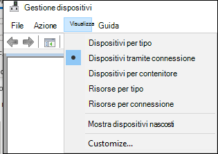
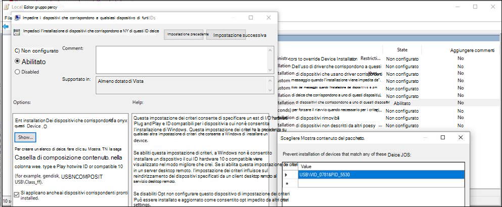
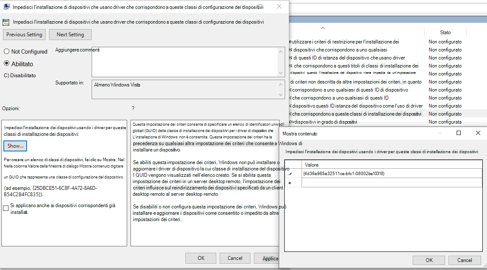
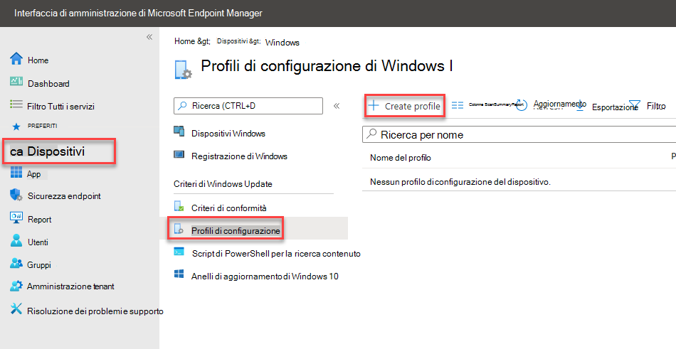
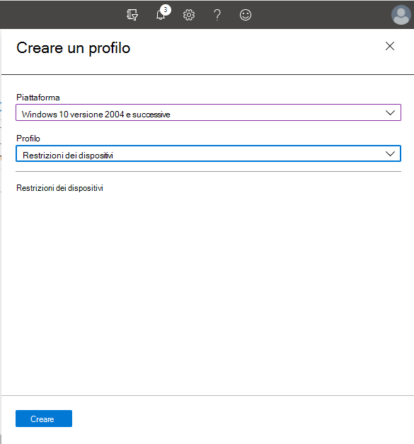
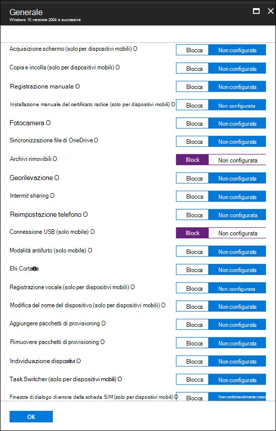
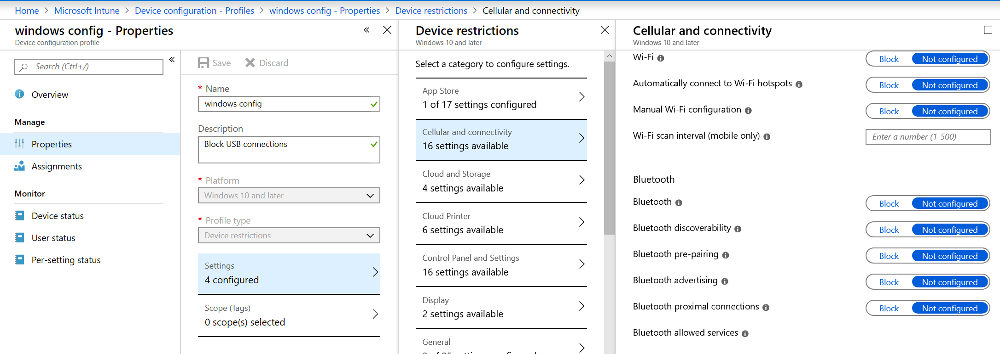
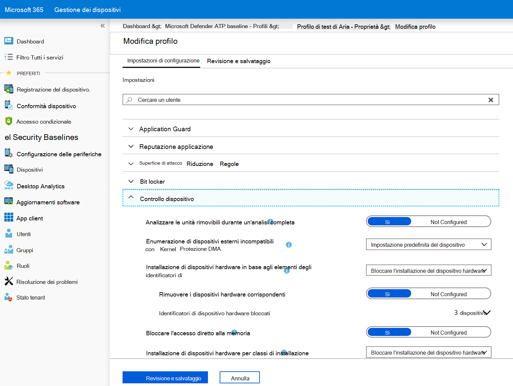
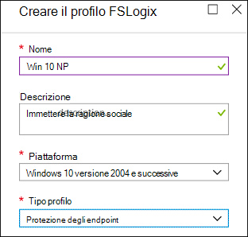
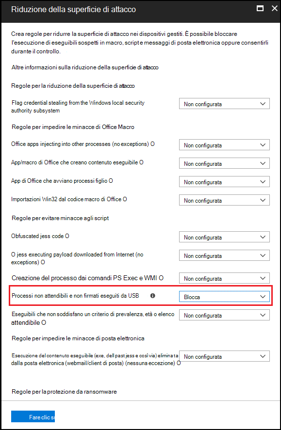

# <a name="how-to-control-usb-devices-and-other-removable-media-using-microsoft-defender-for-endpoint"></a><span data-ttu-id="09050-103">Come controllare i dispositivi USB e altri supporti rimovibili con Microsoft Defender for Endpoint</span><span class="sxs-lookup"><span data-stu-id="09050-103">How to control USB devices and other removable media using Microsoft Defender for Endpoint</span></span>

<span data-ttu-id="09050-104">**Si applica a:** [Microsoft Defender for Endpoint](https://go.microsoft.com/fwlink/p/?linkid=2069559)</span><span class="sxs-lookup"><span data-stu-id="09050-104">**Applies to:** [Microsoft Defender for Endpoint](https://go.microsoft.com/fwlink/p/?linkid=2069559)</span></span>

<span data-ttu-id="09050-105">Microsoft consiglia un approccio [a](https://aka.ms/devicecontrolblog)più livelli alla protezione dei supporti rimovibili e Microsoft Defender for Endpoint offre più funzionalità di monitoraggio e controllo per evitare che le minacce nelle periferiche non autorizzate compromettentino i dispositivi:</span><span class="sxs-lookup"><span data-stu-id="09050-105">Microsoft recommends [a layered approach to securing removable media](https://aka.ms/devicecontrolblog), and Microsoft Defender for Endpoint provides multiple monitoring and control features to help prevent threats in unauthorized peripherals from compromising your devices:</span></span>

1. <span data-ttu-id="09050-106">[Scopri gli eventi connessi plug and play per le periferiche in Microsoft Defender for Endpoint advanced hunting.](#discover-plug-and-play-connected-events)</span><span class="sxs-lookup"><span data-stu-id="09050-106">[Discover plug and play connected events for peripherals in Microsoft Defender for Endpoint advanced hunting](#discover-plug-and-play-connected-events).</span></span> <span data-ttu-id="09050-107">Identificare o analizzare attività di utilizzo sospette.</span><span class="sxs-lookup"><span data-stu-id="09050-107">Identify or investigate suspicious usage activity.</span></span>

2. <span data-ttu-id="09050-108">Configurare per consentire o bloccare solo determinati dispositivi rimovibili e prevenire le minacce.</span><span class="sxs-lookup"><span data-stu-id="09050-108">Configure to allow or block only certain removable devices and prevent threats.</span></span>
    1. <span data-ttu-id="09050-109">[Consentire o bloccare i dispositivi rimovibili](#allow-or-block-removable-devices) in base alla configurazione granulare per negare l'accesso in scrittura ai dischi rimovibili e approvare o negare i dispositivi tramite ID dispositivo USB.</span><span class="sxs-lookup"><span data-stu-id="09050-109">[Allow or block removable devices](#allow-or-block-removable-devices) based on granular configuration to deny write access to removable disks and approve or deny devices by using USB device IDs.</span></span> <span data-ttu-id="09050-110">Assegnazione flessibile dei criteri delle impostazioni di installazione dei dispositivi in base a un singolo utente o gruppo di utenti e dispositivi di Azure Active Directory (Azure AD).</span><span class="sxs-lookup"><span data-stu-id="09050-110">Flexible policy assignment of device installation settings based on an individual or group of Azure Active Directory (Azure AD) users and devices.</span></span>

    2. <span data-ttu-id="09050-111">[Impedisci minacce dall'archiviazione rimovibile](#prevent-threats-from-removable-storage) introdotta dai dispositivi di archiviazione rimovibili abilitando:</span><span class="sxs-lookup"><span data-stu-id="09050-111">[Prevent threats from removable storage](#prevent-threats-from-removable-storage) introduced by removable storage devices by enabling:</span></span>  
        - <span data-ttu-id="09050-112">Antivirus Microsoft Defender protezione in tempo reale (RTP) per analizzare l'archiviazione rimovibile alla ricerca di malware.</span><span class="sxs-lookup"><span data-stu-id="09050-112">Microsoft Defender Antivirus real-time protection (RTP) to scan removable storage for malware.</span></span>  
        - <span data-ttu-id="09050-113">La regola USB di riduzione della superficie di attacco (ASR) per bloccare i processi non attendibili e non firmati eseguiti da USB.</span><span class="sxs-lookup"><span data-stu-id="09050-113">The Attack Surface Reduction (ASR) USB rule to block untrusted and unsigned processes that run from USB.</span></span>  
        - <span data-ttu-id="09050-114">Impostazioni di protezione DMA (Direct Memory Access) per ridurre gli attacchi DMA, inclusa la protezione DMA kernel per Thunderbolt e il blocco di DMA fino all'accesso di un utente.</span><span class="sxs-lookup"><span data-stu-id="09050-114">Direct Memory Access (DMA) protection settings to mitigate DMA attacks, including Kernel DMA Protection for Thunderbolt and blocking DMA until a user signs in.</span></span>  

3. <span data-ttu-id="09050-115">[Crea avvisi e](#create-customized-alerts-and-response-actions) azioni di risposta personalizzati per monitorare l'utilizzo di dispositivi rimovibili in base a questi eventi Plug and Play o a qualsiasi altro evento di Microsoft Defender for Endpoint con [regole di rilevamento personalizzate.](/microsoft-365/security/defender-endpoint/custom-detection-rules)</span><span class="sxs-lookup"><span data-stu-id="09050-115">[Create customized alerts and response actions](#create-customized-alerts-and-response-actions) to monitor usage of removable devices based on these plug and play events or any other Microsoft Defender for Endpoint events with [custom detection rules](/microsoft-365/security/defender-endpoint/custom-detection-rules).</span></span>

4. <span data-ttu-id="09050-116">[Rispondere alle minacce](#respond-to-threats) provenienti dalle periferiche in tempo reale in base alle proprietà segnalate da ogni periferica.</span><span class="sxs-lookup"><span data-stu-id="09050-116">[Respond to threats](#respond-to-threats) from peripherals in real-time based on properties reported by each peripheral.</span></span>

>[!Note]
><span data-ttu-id="09050-117">Queste misure di riduzione delle minacce consentono di impedire l'arrivo di malware nell'ambiente.</span><span class="sxs-lookup"><span data-stu-id="09050-117">These threat reduction measures help prevent malware from coming into your environment.</span></span> <span data-ttu-id="09050-118">Per proteggere i dati aziendali dall'uscita dall'ambiente, è anche possibile configurare misure di prevenzione della perdita dei dati.</span><span class="sxs-lookup"><span data-stu-id="09050-118">To protect enterprise data from leaving your environment, you can also configure data loss prevention measures.</span></span> <span data-ttu-id="09050-119">Ad esempio, nei dispositivi Windows 10 è possibile configurare [BitLocker](/windows/security/information-protection/bitlocker/bitlocker-overview.md) e [Windows Information Protection](/windows/security/information-protection/create-wip-policy-using-intune-azure.md), che crittograferà i dati aziendali anche se sono archiviati in un dispositivo personale oppure utilizzare il [CSP Archiviazione/RemovableDiskDenyWriteAccess](/windows/client-management/mdm/policy-csp-storage#storage-removablediskdenywriteaccess) per negare l'accesso in scrittura ai dischi rimovibili.</span><span class="sxs-lookup"><span data-stu-id="09050-119">For example, on Windows 10 devices you can configure [BitLocker](/windows/security/information-protection/bitlocker/bitlocker-overview.md) and [Windows Information Protection](/windows/security/information-protection/create-wip-policy-using-intune-azure.md), which will encrypt company data even if it is stored on a personal device, or use the [Storage/RemovableDiskDenyWriteAccess CSP](/windows/client-management/mdm/policy-csp-storage#storage-removablediskdenywriteaccess) to deny write access to removable disks.</span></span> <span data-ttu-id="09050-120">Inoltre, puoi classificare e proteggere i file nei dispositivi [Windows](/windows/security/threat-protection/windows-defender-atp/information-protection-in-windows-overview) (inclusi i dispositivi USB montati) usando Microsoft Defender per Endpoint e Azure Information Protection.</span><span class="sxs-lookup"><span data-stu-id="09050-120">Additionally, you can [classify and protect files on Windows devices](/windows/security/threat-protection/windows-defender-atp/information-protection-in-windows-overview) (including their mounted USB devices) by using Microsoft Defender for Endpoint and Azure Information Protection.</span></span>

## <a name="discover-plug-and-play-connected-events"></a><span data-ttu-id="09050-121">Individuare gli eventi connessi plug and play</span><span class="sxs-lookup"><span data-stu-id="09050-121">Discover plug and play connected events</span></span>

<span data-ttu-id="09050-122">Puoi visualizzare gli eventi connessi plug and play in Microsoft Defender for Endpoint advanced hunting per identificare attività di utilizzo sospette o eseguire indagini interne.</span><span class="sxs-lookup"><span data-stu-id="09050-122">You can view plug and play connected events in Microsoft Defender for Endpoint advanced hunting to identify suspicious usage activity or perform internal investigations.</span></span>
<span data-ttu-id="09050-123">Per esempi di query di ricerca avanzata di Defender per Endpoint, vedi l'articolo [microsoft Defender for Endpoint hunting queries GitHub repo](https://github.com/Microsoft/WindowsDefenderATP-Hunting-Queries).</span><span class="sxs-lookup"><span data-stu-id="09050-123">For examples of Defender for Endpoint advanced hunting queries, see the [Microsoft Defender for Endpoint hunting queries GitHub repo](https://github.com/Microsoft/WindowsDefenderATP-Hunting-Queries).</span></span>

<span data-ttu-id="09050-124">Esempi Power BI modelli di report sono disponibili per Microsoft Defender per Endpoint che puoi usare per le query di ricerca avanzate.</span><span class="sxs-lookup"><span data-stu-id="09050-124">Sample Power BI report templates are available for Microsoft Defender for Endpoint that you can use for Advanced hunting queries.</span></span> <span data-ttu-id="09050-125">Con questi modelli di esempio, incluso uno per il controllo dei dispositivi, puoi integrare la potenza della ricerca avanzata in Power BI.</span><span class="sxs-lookup"><span data-stu-id="09050-125">With these sample templates, including one for device control, you can integrate the power of Advanced hunting into Power BI.</span></span> <span data-ttu-id="09050-126">Per ulteriori informazioni, GitHub repository dei modelli [PowerBI.](https://github.com/microsoft/MDATP-PowerBI-Templates)</span><span class="sxs-lookup"><span data-stu-id="09050-126">See the [GitHub repository for PowerBI templates](https://github.com/microsoft/MDATP-PowerBI-Templates) for more information.</span></span> <span data-ttu-id="09050-127">Vedi [Creare report personalizzati con Power BI](/microsoft-365/security/defender-endpoint/api-power-bi) per altre informazioni sull'Power BI integrazione.</span><span class="sxs-lookup"><span data-stu-id="09050-127">See [Create custom reports using Power BI](/microsoft-365/security/defender-endpoint/api-power-bi) to learn more about Power BI integration.</span></span>

## <a name="allow-or-block-removable-devices"></a><span data-ttu-id="09050-128">Consentire o bloccare i dispositivi rimovibili</span><span class="sxs-lookup"><span data-stu-id="09050-128">Allow or block removable devices</span></span>
<span data-ttu-id="09050-129">Nella tabella seguente vengono descritti i modi in cui Microsoft Defender for Endpoint può consentire o bloccare i dispositivi rimovibili in base alla configurazione granulare.</span><span class="sxs-lookup"><span data-stu-id="09050-129">The following table describes the ways Microsoft Defender for Endpoint can allow or block removable devices based on granular configuration.</span></span>

| <span data-ttu-id="09050-130">Controllo</span><span class="sxs-lookup"><span data-stu-id="09050-130">Control</span></span>  | <span data-ttu-id="09050-131">Descrizione</span><span class="sxs-lookup"><span data-stu-id="09050-131">Description</span></span> |
|----------|-------------|
| [<span data-ttu-id="09050-132">Limitare le unità USB e altre periferiche</span><span class="sxs-lookup"><span data-stu-id="09050-132">Restrict USB drives and other peripherals</span></span>](#restrict-usb-drives-and-other-peripherals) | <span data-ttu-id="09050-133">Puoi consentire o impedire agli utenti di installare solo le unità USB e altre periferiche incluse in un elenco di dispositivi o tipi di dispositivi autorizzati/non autorizzati.</span><span class="sxs-lookup"><span data-stu-id="09050-133">You can allow/prevent users to install only the USB drives and other peripherals included on a list of authorized/unauthorized devices or device types.</span></span> |
| [<span data-ttu-id="09050-134">Bloccare l'installazione e l'utilizzo dell'archiviazione rimovibile</span><span class="sxs-lookup"><span data-stu-id="09050-134">Block installation and usage of removable storage</span></span>](#block-installation-and-usage-of-removable-storage) | <span data-ttu-id="09050-135">Non è possibile installare o usare l'archiviazione rimovibile.</span><span class="sxs-lookup"><span data-stu-id="09050-135">You can't install or use removable storage.</span></span> |
| [<span data-ttu-id="09050-136">Consentire l'installazione e l'utilizzo di periferiche approvate in modo specifico</span><span class="sxs-lookup"><span data-stu-id="09050-136">Allow installation and usage of specifically approved peripherals</span></span>](#allow-installation-and-usage-of-specifically-approved-peripherals)   | <span data-ttu-id="09050-137">È possibile installare e utilizzare solo periferiche approvate che segnalano proprietà specifiche nel firmware.</span><span class="sxs-lookup"><span data-stu-id="09050-137">You can only install and use approved peripherals that report specific properties in their firmware.</span></span> |
| [<span data-ttu-id="09050-138">Impedire l'installazione di periferiche specificamente proibite</span><span class="sxs-lookup"><span data-stu-id="09050-138">Prevent installation of specifically prohibited peripherals</span></span>](#prevent-installation-of-specifically-prohibited-peripherals) | <span data-ttu-id="09050-139">Non è possibile installare o utilizzare periferiche proibite che segnalano proprietà specifiche nel firmware.</span><span class="sxs-lookup"><span data-stu-id="09050-139">You can't install or use prohibited peripherals that report specific properties in their firmware.</span></span> |
| [<span data-ttu-id="09050-140">Consentire l'installazione e l'utilizzo di periferiche approvate in modo specifico con ID istanza dispositivo corrispondenti</span><span class="sxs-lookup"><span data-stu-id="09050-140">Allow installation and usage of specifically approved peripherals with matching device instance IDs</span></span>](#allow-installation-and-usage-of-specifically-approved-peripherals-with-matching-device-instance-ids) | <span data-ttu-id="09050-141">Puoi installare e usare solo periferiche approvate che corrispondono a uno qualsiasi di questi ID di istanza del dispositivo.</span><span class="sxs-lookup"><span data-stu-id="09050-141">You can only install and use approved peripherals that match any of these device instance IDs.</span></span> |
| [<span data-ttu-id="09050-142">Impedire l'installazione e l'utilizzo di periferiche specificamente proibite con ID istanza dispositivo corrispondenti</span><span class="sxs-lookup"><span data-stu-id="09050-142">Prevent installation and usage of specifically prohibited peripherals with matching device instance IDs</span></span>](#prevent-installation-and-usage-of-specifically-prohibited-peripherals-with-matching-device-instance-ids) | <span data-ttu-id="09050-143">Non è possibile installare o usare periferiche non consentite che corrispondono a uno qualsiasi di questi ID di istanza del dispositivo.</span><span class="sxs-lookup"><span data-stu-id="09050-143">You can't install or use prohibited peripherals that match any of these device instance IDs.</span></span> |
| [<span data-ttu-id="09050-144">Limitare i servizi che utilizzano Bluetooth</span><span class="sxs-lookup"><span data-stu-id="09050-144">Limit services that use Bluetooth</span></span>](#limit-services-that-use-bluetooth) | <span data-ttu-id="09050-145">È possibile limitare i servizi che possono utilizzare Bluetooth.</span><span class="sxs-lookup"><span data-stu-id="09050-145">You can limit the services that can use Bluetooth.</span></span> |
| [<span data-ttu-id="09050-146">Usare Le impostazioni di base di Microsoft Defender per endpoint</span><span class="sxs-lookup"><span data-stu-id="09050-146">Use Microsoft Defender for Endpoint baseline settings</span></span>](#use-microsoft-defender-for-endpoint-baseline-settings) | <span data-ttu-id="09050-147">Puoi impostare la configurazione consigliata per ATP usando la baseline di sicurezza defender per endpoint.</span><span class="sxs-lookup"><span data-stu-id="09050-147">You can set the recommended configuration for ATP by using the Defender for Endpoint security baseline.</span></span> |

### <a name="restrict-usb-drives-and-other-peripherals"></a><span data-ttu-id="09050-148">Limitare le unità USB e altre periferiche</span><span class="sxs-lookup"><span data-stu-id="09050-148">Restrict USB drives and other peripherals</span></span>

<span data-ttu-id="09050-149">Per evitare infezioni da malware o perdita di dati, un'organizzazione può limitare le unità USB e altre periferiche.</span><span class="sxs-lookup"><span data-stu-id="09050-149">To prevent malware infections or data loss, an organization may restrict USB drives and other peripherals.</span></span> <span data-ttu-id="09050-150">Nella tabella seguente vengono descritti i modi in cui Microsoft Defender for Endpoint può impedire l'installazione e l'utilizzo di unità USB e altre periferiche.</span><span class="sxs-lookup"><span data-stu-id="09050-150">The following table describes the ways Microsoft Defender for Endpoint can help prevent installation and usage of USB drives and other peripherals.</span></span>

| <span data-ttu-id="09050-151">Controllo</span><span class="sxs-lookup"><span data-stu-id="09050-151">Control</span></span>  | <span data-ttu-id="09050-152">Descrizione</span><span class="sxs-lookup"><span data-stu-id="09050-152">Description</span></span>
|----------|-------------|
| [<span data-ttu-id="09050-153">Consentire l'installazione e l'utilizzo di unità USB e altre periferiche</span><span class="sxs-lookup"><span data-stu-id="09050-153">Allow installation and usage of USB drives and other peripherals</span></span>](#allow-installation-and-usage-of-usb-drives-and-other-peripherals) | <span data-ttu-id="09050-154">Consentire agli utenti di installare solo le unità USB e altre periferiche incluse in un elenco di dispositivi o tipi di dispositivi autorizzati</span><span class="sxs-lookup"><span data-stu-id="09050-154">Allow users to install only the USB drives and other peripherals included on a list of authorized devices or device types</span></span> |
| [<span data-ttu-id="09050-155">Impedire l'installazione e l'utilizzo di unità USB e altre periferiche</span><span class="sxs-lookup"><span data-stu-id="09050-155">Prevent installation and usage of USB drives and other peripherals</span></span>](#prevent-installation-and-usage-of-usb-drives-and-other-peripherals) | <span data-ttu-id="09050-156">Impedire agli utenti di installare unità USB e altre periferiche incluse in un elenco di dispositivi e tipi di dispositivi non autorizzati</span><span class="sxs-lookup"><span data-stu-id="09050-156">Prevent users from installing USB drives and other peripherals included on a list of unauthorized devices and device types</span></span> |

<span data-ttu-id="09050-157">Tutti i controlli precedenti possono essere impostati tramite i modelli [amministrativi di](/intune/administrative-templates-windows)Intune.</span><span class="sxs-lookup"><span data-stu-id="09050-157">All of the above controls can be set through the Intune [Administrative Templates](/intune/administrative-templates-windows).</span></span> <span data-ttu-id="09050-158">I criteri pertinenti si trovano qui nei modelli di amministratore di Intune:</span><span class="sxs-lookup"><span data-stu-id="09050-158">The relevant policies are located here in the Intune Administrator Templates:</span></span>


>[!Note]
><span data-ttu-id="09050-160">Usando Intune, puoi applicare criteri di configurazione dei dispositivi a utenti e/o gruppi di dispositivi di Azure AD.</span><span class="sxs-lookup"><span data-stu-id="09050-160">Using Intune, you can apply device configuration policies to Azure AD user and/or device groups.</span></span>
<span data-ttu-id="09050-161">I criteri precedenti possono essere impostati anche tramite le impostazioni [del provider di](/windows/client-management/mdm/policy-csp-deviceinstallation) servizi di configurazione per l'installazione dei dispositivi e gli oggetti Criteri di gruppo Installazione [dispositivi](/previous-versions/dotnet/articles/bb530324(v=msdn.10)).</span><span class="sxs-lookup"><span data-stu-id="09050-161">The above policies can also be set through the [Device Installation CSP settings](/windows/client-management/mdm/policy-csp-deviceinstallation) and the [Device Installation GPOs](/previous-versions/dotnet/articles/bb530324(v=msdn.10)).</span></span>

> [!Note]
> <span data-ttu-id="09050-162">Testare e perfezionare sempre queste impostazioni con un gruppo pilota di utenti e dispositivi prima di applicarle nell'ambiente di produzione.</span><span class="sxs-lookup"><span data-stu-id="09050-162">Always test and refine these settings with a pilot group of users and devices first before applying them in production.</span></span>
<span data-ttu-id="09050-163">Per altre informazioni sul controllo dei dispositivi USB, vedi il [blog di Microsoft Defender for Endpoint.](https://www.microsoft.com/security/blog/2018/12/19/windows-defender-atp-has-protections-for-usb-and-removable-devices/)</span><span class="sxs-lookup"><span data-stu-id="09050-163">For more information about controlling USB devices, see the [Microsoft Defender for Endpoint blog](https://www.microsoft.com/security/blog/2018/12/19/windows-defender-atp-has-protections-for-usb-and-removable-devices/).</span></span>

#### <a name="allow-installation-and-usage-of-usb-drives-and-other-peripherals"></a><span data-ttu-id="09050-164">Consentire l'installazione e l'utilizzo di unità USB e altre periferiche</span><span class="sxs-lookup"><span data-stu-id="09050-164">Allow installation and usage of USB drives and other peripherals</span></span>

<span data-ttu-id="09050-165">Un modo per approcciare l'installazione e l'uso di unità USB e altre periferiche consiste nell'iniziare consentendo tutto.</span><span class="sxs-lookup"><span data-stu-id="09050-165">One way to approach allowing installation and usage of USB drives and other peripherals is to start by allowing everything.</span></span> <span data-ttu-id="09050-166">In seguito, puoi iniziare a ridurre i driver USB consentiti e altre periferiche.</span><span class="sxs-lookup"><span data-stu-id="09050-166">Afterwards, you can start reducing the allowable USB drivers and other peripherals.</span></span>

>[!Note]
><span data-ttu-id="09050-167">Poiché una periferica USB non autorizzata può avere firmware che falsifica le proprietà USB, ti consigliamo di consentire solo periferiche USB approvate in modo specifico e limitare gli utenti che possono accedervi.</span><span class="sxs-lookup"><span data-stu-id="09050-167">Because an unauthorized USB peripheral can have firmware that spoofs its USB properties, we recommend only allowing specifically approved USB peripherals and limiting the users who can access them.</span></span>

1. <span data-ttu-id="09050-168">Abilita **Impedisci l'installazione di dispositivi non descritti da altre impostazioni dei criteri** per tutti gli utenti.</span><span class="sxs-lookup"><span data-stu-id="09050-168">Enable **Prevent installation of devices not described by other policy settings** to all users.</span></span>
2. <span data-ttu-id="09050-169">Abilita **Consenti l'installazione dei dispositivi usando driver che corrispondono a queste classi di configurazione** dei dispositivi per tutte le classi di installazione dei [dispositivi.](/windows-hardware/drivers/install/system-defined-device-setup-classes-available-to-vendors)</span><span class="sxs-lookup"><span data-stu-id="09050-169">Enable **Allow installation of devices using drivers that match these device setup classes** for all [device setup classes](/windows-hardware/drivers/install/system-defined-device-setup-classes-available-to-vendors).</span></span>

<span data-ttu-id="09050-170">Per applicare il criterio per i dispositivi già installati, applica i criteri di prevenzione con questa impostazione.</span><span class="sxs-lookup"><span data-stu-id="09050-170">To enforce the policy for already installed devices, apply the prevent policies that have this setting.</span></span>

<span data-ttu-id="09050-171">Quando configuri il criterio Consenti installazione dispositivi, devi consentire anche tutti gli attributi padre.</span><span class="sxs-lookup"><span data-stu-id="09050-171">When configuring the allow device installation policy, you must allow all parent attributes as well.</span></span> <span data-ttu-id="09050-172">Puoi visualizzare gli elementi padre di un dispositivo aprendo Gestione dispositivi e visualizzando in base alla connessione.</span><span class="sxs-lookup"><span data-stu-id="09050-172">You can view the parents of a device by opening Device Manager and view by connection.</span></span>



<span data-ttu-id="09050-174">In questo esempio è necessario aggiungere le classi seguenti: HID, Keyboard e {36fc9e60-c465-11cf-8056-444553540000}.</span><span class="sxs-lookup"><span data-stu-id="09050-174">In this example, the following classes needed to be added: HID, Keyboard, and {36fc9e60-c465-11cf-8056-444553540000}.</span></span> <span data-ttu-id="09050-175">Per [altre informazioni, vedi Driver USB](/windows-hardware/drivers/usbcon/supported-usb-classes) forniti da Microsoft.</span><span class="sxs-lookup"><span data-stu-id="09050-175">See [Microsoft-provided USB drivers](/windows-hardware/drivers/usbcon/supported-usb-classes) for more information.</span></span>


<span data-ttu-id="09050-177">Se vuoi limitare determinati dispositivi, rimuovi la classe di configurazione del dispositivo della periferica che vuoi limitare.</span><span class="sxs-lookup"><span data-stu-id="09050-177">If you want to restrict to certain devices, remove the device setup class of the peripheral that you want to limit.</span></span> <span data-ttu-id="09050-178">Aggiungi quindi l'ID dispositivo che vuoi aggiungere.</span><span class="sxs-lookup"><span data-stu-id="09050-178">Then add the device ID that you want to add.</span></span> <span data-ttu-id="09050-179">L'ID dispositivo si basa sull'ID fornitore e sui valori dell'ID prodotto per un dispositivo.</span><span class="sxs-lookup"><span data-stu-id="09050-179">Device ID is based on the vendor ID and product ID values for a device.</span></span> <span data-ttu-id="09050-180">Per informazioni sui formati degli ID dispositivo, vedi [Identificatori USB standard.](/windows-hardware/drivers/install/standard-usb-identifiers)</span><span class="sxs-lookup"><span data-stu-id="09050-180">For information on device ID formats, see [Standard USB Identifiers](/windows-hardware/drivers/install/standard-usb-identifiers).</span></span> 

<span data-ttu-id="09050-181">Per trovare gli ID del dispositivo, vedi [Cercare l'ID dispositivo.](#look-up-device-id)</span><span class="sxs-lookup"><span data-stu-id="09050-181">To find the device IDs, see [Look up device ID](#look-up-device-id).</span></span> 

<span data-ttu-id="09050-182">Ad esempio:</span><span class="sxs-lookup"><span data-stu-id="09050-182">For example:</span></span>

1. <span data-ttu-id="09050-183">Rimuovi la classe USBDevice **dall'opzione Consenti l'installazione dei dispositivi usando driver che corrispondono alla configurazione del dispositivo.**</span><span class="sxs-lookup"><span data-stu-id="09050-183">Remove class USBDevice from the **Allow installation of devices using drivers that match these device setup**.</span></span>
2. <span data-ttu-id="09050-184">Aggiungi l'ID del dispositivo per consentire l'installazione del dispositivo **che corrisponde a uno qualsiasi di questi ID dispositivo.**</span><span class="sxs-lookup"><span data-stu-id="09050-184">Add the device ID to allow in the **Allow installation of device that match any of these device IDs**.</span></span> 


#### <a name="prevent-installation-and-usage-of-usb-drives-and-other-peripherals"></a><span data-ttu-id="09050-185">Impedire l'installazione e l'utilizzo di unità USB e altre periferiche</span><span class="sxs-lookup"><span data-stu-id="09050-185">Prevent installation and usage of USB drives and other peripherals</span></span>

<span data-ttu-id="09050-186">Se vuoi impedire l'installazione di una classe di dispositivi o di alcuni dispositivi, puoi usare i criteri impedisci l'installazione dei dispositivi:</span><span class="sxs-lookup"><span data-stu-id="09050-186">If you want to prevent the installation of a device class or certain devices, you can use the prevent device installation policies:</span></span>

1. <span data-ttu-id="09050-187">Abilita **Impedisci l'installazione dei dispositivi che corrispondono a uno di** questi ID dispositivo e aggiungi questi dispositivi all'elenco.</span><span class="sxs-lookup"><span data-stu-id="09050-187">Enable **Prevent installation of devices that match any of these device IDs** and add these devices to the list.</span></span>
2. <span data-ttu-id="09050-188">Abilita **Impedisci l'installazione dei dispositivi usando driver che corrispondono a queste classi di configurazione dei dispositivi.**</span><span class="sxs-lookup"><span data-stu-id="09050-188">Enable **Prevent installation of devices using drivers that match these device setup classes**.</span></span>

> [!Note]
> <span data-ttu-id="09050-189">I criteri impedisci l'installazione dei dispositivi hanno la precedenza sui criteri consenti l'installazione dei dispositivi.</span><span class="sxs-lookup"><span data-stu-id="09050-189">The prevent device installation policies take precedence over the allow device installation policies.</span></span>

<span data-ttu-id="09050-190">Il **criterio** Impedisci l'installazione di dispositivi che corrispondono a uno di questi ID dispositivo consente di specificare un elenco di dispositivi a cui Windows non è consentita l'installazione.</span><span class="sxs-lookup"><span data-stu-id="09050-190">The **Prevent installation of devices that match any of these device IDs** policy allows you to specify a list of devices that Windows is prevented from installing.</span></span> 

<span data-ttu-id="09050-191">Per impedire l'installazione di dispositivi che corrispondono a uno di questi ID dispositivo:</span><span class="sxs-lookup"><span data-stu-id="09050-191">To prevent installation of devices that match any of these device IDs:</span></span> 

1. <span data-ttu-id="09050-192">[Cerca l'ID](#look-up-device-id) del dispositivo per i dispositivi che Windows impedire l'installazione.</span><span class="sxs-lookup"><span data-stu-id="09050-192">[Look up device ID](#look-up-device-id) for devices that you want Windows to prevent from installing.</span></span>

   

2. <span data-ttu-id="09050-194">Abilita **Impedisci l'installazione** dei dispositivi che corrispondono a uno di questi ID dispositivo e aggiungi gli ID fornitore o prodotto all'elenco.</span><span class="sxs-lookup"><span data-stu-id="09050-194">Enable **Prevent installation of devices that match any of these device IDs** and add the vendor or product IDs to the list.</span></span>

    

#### <a name="look-up-device-id"></a><span data-ttu-id="09050-196">Cercare l'ID dispositivo</span><span class="sxs-lookup"><span data-stu-id="09050-196">Look up device ID</span></span>

<span data-ttu-id="09050-197">Puoi usare Gestione dispositivi per cercare un ID dispositivo.</span><span class="sxs-lookup"><span data-stu-id="09050-197">You can use Device Manager to look up a device ID.</span></span>

1. <span data-ttu-id="09050-198">Aprire Gestione dispositivi.</span><span class="sxs-lookup"><span data-stu-id="09050-198">Open Device Manager.</span></span>
2. <span data-ttu-id="09050-199">Fare **clic su** Visualizza e selezionare Dispositivi per **connessione.**</span><span class="sxs-lookup"><span data-stu-id="09050-199">Click **View** and select **Devices by connection**.</span></span>
3. <span data-ttu-id="09050-200">Nell'albero fare clic con il pulsante destro del mouse sul dispositivo e scegliere **Proprietà.**</span><span class="sxs-lookup"><span data-stu-id="09050-200">From the tree, right-click the device and select **Properties**.</span></span>
4. <span data-ttu-id="09050-201">Nella finestra di dialogo del dispositivo selezionato fare clic sulla **scheda** Dettagli.</span><span class="sxs-lookup"><span data-stu-id="09050-201">In the dialog box for the selected device, click the **Details** tab.</span></span>
5. <span data-ttu-id="09050-202">Fare clic **sull'elenco** a discesa Proprietà e selezionare **ID hardware.**</span><span class="sxs-lookup"><span data-stu-id="09050-202">Click the **Property** drop-down list and select **Hardware Ids**.</span></span>
6. <span data-ttu-id="09050-203">Fai clic con il pulsante destro del mouse sul valore ID superiore e scegli **Copia.**</span><span class="sxs-lookup"><span data-stu-id="09050-203">Right-click the top ID value and select **Copy**.</span></span>

<span data-ttu-id="09050-204">Per informazioni sui formati di ID dispositivo, vedi [Identificatori USB standard.](/windows-hardware/drivers/install/standard-usb-identifiers)</span><span class="sxs-lookup"><span data-stu-id="09050-204">For information about Device ID formats, see [Standard USB Identifiers](/windows-hardware/drivers/install/standard-usb-identifiers).</span></span>

<span data-ttu-id="09050-205">Per informazioni sugli ID fornitore, vedere [Membri USB.](https://www.usb.org/members)</span><span class="sxs-lookup"><span data-stu-id="09050-205">For information on vendor IDs, see [USB members](https://www.usb.org/members).</span></span>

<span data-ttu-id="09050-206">Di seguito è riportato un esempio per cercare un ID fornitore di dispositivo o un ID prodotto (che fa parte dell'ID del dispositivo) tramite PowerShell:</span><span class="sxs-lookup"><span data-stu-id="09050-206">The following is an example for looking up a device vendor ID or product ID (which is part of the device ID) using PowerShell:</span></span> 

```powershell
Get-WMIObject -Class Win32_DiskDrive |
Select-Object -Property * 
```

<span data-ttu-id="09050-207">Il **criterio Impedisci** l'installazione di dispositivi che usano driver che corrispondono a queste classi di installazione dei dispositivi consente di specificare le classi di installazione dei dispositivi a cui Windows non è consentita l'installazione.</span><span class="sxs-lookup"><span data-stu-id="09050-207">The **Prevent installation of devices using drivers that match these device setup classes** policy allows you to specify device setup classes that Windows is prevented from installing.</span></span> 

<span data-ttu-id="09050-208">Per impedire l'installazione di determinate classi di dispositivi:</span><span class="sxs-lookup"><span data-stu-id="09050-208">To prevent installation of particular classes of devices:</span></span> 

1. <span data-ttu-id="09050-209">Trova il GUID della classe di installazione del dispositivo da Classi di installazione dispositivi definite dal sistema [disponibili per i fornitori.](/windows-hardware/drivers/install/system-defined-device-setup-classes-available-to-vendors)</span><span class="sxs-lookup"><span data-stu-id="09050-209">Find the GUID of the device setup class from [System-Defined Device Setup Classes Available to Vendors](/windows-hardware/drivers/install/system-defined-device-setup-classes-available-to-vendors).</span></span>

2. <span data-ttu-id="09050-210">Abilita **Impedisci l'installazione dei dispositivi usando driver che corrispondono a** queste classi di installazione dei dispositivi e aggiungi il GUID della classe all'elenco.</span><span class="sxs-lookup"><span data-stu-id="09050-210">Enable **Prevent installation of devices using drivers that match these device setup classes** and add the class GUID to the list.</span></span>

    > [!div class="mx-imgBorder"]
    > <span data-ttu-id="09050-211"></span><span class="sxs-lookup"><span data-stu-id="09050-211"></span></span>

### <a name="block-installation-and-usage-of-removable-storage"></a><span data-ttu-id="09050-212">Bloccare l'installazione e l'utilizzo dell'archiviazione rimovibile</span><span class="sxs-lookup"><span data-stu-id="09050-212">Block installation and usage of removable storage</span></span>

1. <span data-ttu-id="09050-213">Accedere all'interfaccia [Microsoft Endpoint Manager di amministrazione](https://endpoint.microsoft.com/).</span><span class="sxs-lookup"><span data-stu-id="09050-213">Sign in to the [Microsoft Endpoint Manager admin center](https://endpoint.microsoft.com/).</span></span>

2. <span data-ttu-id="09050-214">Fare **clic su Profili** di configurazione  >  **dispositivi** Crea  >  **profilo**.</span><span class="sxs-lookup"><span data-stu-id="09050-214">Click **Devices** > **Configuration Profiles** > **Create profile**.</span></span>

    > [!div class="mx-imgBorder"]
    > <span data-ttu-id="09050-215"></span><span class="sxs-lookup"><span data-stu-id="09050-215"></span></span>

3. <span data-ttu-id="09050-216">Utilizzare le seguenti impostazioni:</span><span class="sxs-lookup"><span data-stu-id="09050-216">Use the following settings:</span></span>

   - <span data-ttu-id="09050-217">Nome: digitare un nome per il profilo</span><span class="sxs-lookup"><span data-stu-id="09050-217">Name: Type a name for the profile</span></span>
   - <span data-ttu-id="09050-218">Descrizione: digitare una descrizione</span><span class="sxs-lookup"><span data-stu-id="09050-218">Description: Type a description</span></span>
   - <span data-ttu-id="09050-219">Piattaforma: Windows 10 e versioni successive</span><span class="sxs-lookup"><span data-stu-id="09050-219">Platform: Windows 10 and later</span></span>
   - <span data-ttu-id="09050-220">Tipo di profilo: Restrizioni del dispositivo</span><span class="sxs-lookup"><span data-stu-id="09050-220">Profile type: Device restrictions</span></span>

   > [!div class="mx-imgBorder"]
   > <span data-ttu-id="09050-221"></span><span class="sxs-lookup"><span data-stu-id="09050-221"></span></span>

4. <span data-ttu-id="09050-222">Fare **clic su Configura**  >  **generale**.</span><span class="sxs-lookup"><span data-stu-id="09050-222">Click **Configure** > **General**.</span></span>  

5. <span data-ttu-id="09050-223">Per **Archivi rimovibili** e **connessione USB (solo per dispositivi mobili)** scegliere **Blocca.**</span><span class="sxs-lookup"><span data-stu-id="09050-223">For **Removable storage** and **USB connection (mobile only)**, choose **Block**.</span></span> <span data-ttu-id="09050-224">**L'archiviazione rimovibile** include unità USB, mentre la connessione **USB (solo** per dispositivi mobili) esclude la ricarica USB, ma include altre connessioni USB solo su dispositivi mobili.</span><span class="sxs-lookup"><span data-stu-id="09050-224">**Removable storage** includes USB drives, whereas **USB connection (mobile only)** excludes USB charging but includes other USB connections on mobile devices only.</span></span> 

   

6. <span data-ttu-id="09050-226">Fare **clic su OK** per chiudere **Impostazioni** generali e **Restrizioni dispositivo.**</span><span class="sxs-lookup"><span data-stu-id="09050-226">Click **OK** to close **General** settings and **Device restrictions**.</span></span>

7. <span data-ttu-id="09050-227">Fare **clic su** Crea per salvare il profilo.</span><span class="sxs-lookup"><span data-stu-id="09050-227">Click **Create** to save the profile.</span></span>

### <a name="allow-installation-and-usage-of-specifically-approved-peripherals"></a><span data-ttu-id="09050-228">Consentire l'installazione e l'utilizzo di periferiche approvate in modo specifico</span><span class="sxs-lookup"><span data-stu-id="09050-228">Allow installation and usage of specifically approved peripherals</span></span>

<span data-ttu-id="09050-229">Le periferiche che possono essere installate possono essere specificate [dall'identità hardware.](/windows-hardware/drivers/install/device-identification-strings)</span><span class="sxs-lookup"><span data-stu-id="09050-229">Peripherals that are allowed to be installed can be specified by their [hardware identity](/windows-hardware/drivers/install/device-identification-strings).</span></span> <span data-ttu-id="09050-230">Per un elenco delle strutture di identificatori comuni, vedere [Formati degli identificatori di dispositivo.](/windows-hardware/drivers/install/device-identifier-formats)</span><span class="sxs-lookup"><span data-stu-id="09050-230">For a list of common identifier structures, see [Device Identifier Formats](/windows-hardware/drivers/install/device-identifier-formats).</span></span> <span data-ttu-id="09050-231">Testare la configurazione prima della distribuzione per assicurarsi che blocchi e consenta i dispositivi previsti.</span><span class="sxs-lookup"><span data-stu-id="09050-231">Test the configuration prior to rolling it out to ensure it blocks and allows the devices expected.</span></span> <span data-ttu-id="09050-232">Testare idealmente diverse istanze dell'hardware.</span><span class="sxs-lookup"><span data-stu-id="09050-232">Ideally test various instances of the hardware.</span></span> <span data-ttu-id="09050-233">Ad esempio, testare più chiavi USB anziché una sola.</span><span class="sxs-lookup"><span data-stu-id="09050-233">For example, test multiple USB keys rather than only one.</span></span>

<span data-ttu-id="09050-234">Per un esempio SyncML che consente l'installazione di ID dispositivo specifici, vedi [CSP DeviceInstallation/AllowInstallationOfMatchingDeviceIDs.](/windows/client-management/mdm/policy-csp-deviceinstallation#deviceinstallation-allowinstallationofmatchingdeviceids)</span><span class="sxs-lookup"><span data-stu-id="09050-234">For a SyncML example that allows installation of specific device IDs, see [DeviceInstallation/AllowInstallationOfMatchingDeviceIDs CSP](/windows/client-management/mdm/policy-csp-deviceinstallation#deviceinstallation-allowinstallationofmatchingdeviceids).</span></span> <span data-ttu-id="09050-235">Per consentire classi di dispositivi specifiche, vedi [CSP DeviceInstallation/AllowInstallationOfMatchingDeviceSetupClasses.](/windows/client-management/mdm/policy-csp-deviceinstallation#deviceinstallation-allowinstallationofmatchingdevicesetupclasses)</span><span class="sxs-lookup"><span data-stu-id="09050-235">To allow specific device classes, see [DeviceInstallation/AllowInstallationOfMatchingDeviceSetupClasses CSP](/windows/client-management/mdm/policy-csp-deviceinstallation#deviceinstallation-allowinstallationofmatchingdevicesetupclasses).</span></span>
<span data-ttu-id="09050-236">Consentire l'installazione di dispositivi specifici richiede anche l'abilitazione di [DeviceInstallation/PreventInstallationOfDevicesNotDescribedByOtherPolicySettings.](/windows/client-management/mdm/policy-csp-deviceinstallation#deviceinstallation-preventinstallationofdevicesnotdescribedbyotherpolicysettings)</span><span class="sxs-lookup"><span data-stu-id="09050-236">Allowing installation of specific devices requires also enabling [DeviceInstallation/PreventInstallationOfDevicesNotDescribedByOtherPolicySettings](/windows/client-management/mdm/policy-csp-deviceinstallation#deviceinstallation-preventinstallationofdevicesnotdescribedbyotherpolicysettings).</span></span>

### <a name="prevent-installation-of-specifically-prohibited-peripherals"></a><span data-ttu-id="09050-237">Impedire l'installazione di periferiche specificamente proibite</span><span class="sxs-lookup"><span data-stu-id="09050-237">Prevent installation of specifically prohibited peripherals</span></span>

<span data-ttu-id="09050-238">Microsoft Defender for Endpoint blocca l'installazione e l'utilizzo delle periferiche proibite utilizzando una delle opzioni seguenti:</span><span class="sxs-lookup"><span data-stu-id="09050-238">Microsoft Defender for Endpoint blocks installation and usage of prohibited peripherals by using either of these options:</span></span>

- <span data-ttu-id="09050-239">[I modelli amministrativi](/intune/administrative-templates-windows) possono bloccare qualsiasi dispositivo con un ID hardware o una classe di installazione corrispondente.</span><span class="sxs-lookup"><span data-stu-id="09050-239">[Administrative Templates](/intune/administrative-templates-windows) can block any device with a matching hardware ID or setup class.</span></span>  
- <span data-ttu-id="09050-240">[Impostazioni CSP per l'installazione dei](/windows/client-management/mdm/policy-csp-deviceinstallation) dispositivi con un profilo personalizzato in Intune.</span><span class="sxs-lookup"><span data-stu-id="09050-240">[Device Installation CSP settings](/windows/client-management/mdm/policy-csp-deviceinstallation) with a custom profile in Intune.</span></span> <span data-ttu-id="09050-241">Puoi impedire [l'installazione di ID dispositivo specifici](/windows/client-management/mdm/policy-csp-deviceinstallation#deviceinstallation-preventinstallationofmatchingdeviceids) o impedire classi di dispositivi [specifiche.](/windows/client-management/mdm/policy-csp-deviceinstallation#deviceinstallation-preventinstallationofmatchingdevicesetupclasses)</span><span class="sxs-lookup"><span data-stu-id="09050-241">You can [prevent installation of specific device IDs](/windows/client-management/mdm/policy-csp-deviceinstallation#deviceinstallation-preventinstallationofmatchingdeviceids) or [prevent specific device classes](/windows/client-management/mdm/policy-csp-deviceinstallation#deviceinstallation-preventinstallationofmatchingdevicesetupclasses).</span></span>

### <a name="allow-installation-and-usage-of-specifically-approved-peripherals-with-matching-device-instance-ids"></a><span data-ttu-id="09050-242">Consentire l'installazione e l'utilizzo di periferiche approvate in modo specifico con ID istanza dispositivo corrispondenti</span><span class="sxs-lookup"><span data-stu-id="09050-242">Allow installation and usage of specifically approved peripherals with matching device instance IDs</span></span>

<span data-ttu-id="09050-243">Le periferiche che possono essere installate possono essere specificate dagli [ID istanza del dispositivo.](/windows-hardware/drivers/install/device-instance-ids)</span><span class="sxs-lookup"><span data-stu-id="09050-243">Peripherals that are allowed to be installed can be specified by their [device instance IDs](/windows-hardware/drivers/install/device-instance-ids).</span></span> <span data-ttu-id="09050-244">Testare la configurazione prima di implementazione per assicurarsi che consenta i dispositivi previsti.</span><span class="sxs-lookup"><span data-stu-id="09050-244">Test the configuration prior to rolling it out to ensure it allows the devices expected.</span></span> <span data-ttu-id="09050-245">Testare idealmente diverse istanze dell'hardware.</span><span class="sxs-lookup"><span data-stu-id="09050-245">Ideally test various instances of the hardware.</span></span> <span data-ttu-id="09050-246">Ad esempio, testare più chiavi USB anziché una sola.</span><span class="sxs-lookup"><span data-stu-id="09050-246">For example, test multiple USB keys rather than only one.</span></span>

<span data-ttu-id="09050-247">Puoi consentire l'installazione e l'uso di periferiche approvate con ID istanza dispositivo corrispondenti configurando l'impostazione dei criteri [DeviceInstallation/AllowInstallationOfMatchingDeviceInstanceIDs.](/windows/client-management/mdm/policy-csp-deviceinstallation#deviceinstallation-allowinstallationofmatchingdeviceinstanceids)</span><span class="sxs-lookup"><span data-stu-id="09050-247">You can allow installation and usage of approved peripherals with matching device instance IDs by configuring [DeviceInstallation/AllowInstallationOfMatchingDeviceInstanceIDs](/windows/client-management/mdm/policy-csp-deviceinstallation#deviceinstallation-allowinstallationofmatchingdeviceinstanceids) policy setting.</span></span>

### <a name="prevent-installation-and-usage-of-specifically-prohibited-peripherals-with-matching-device-instance-ids"></a><span data-ttu-id="09050-248">Impedire l'installazione e l'utilizzo di periferiche specificamente proibite con ID istanza dispositivo corrispondenti</span><span class="sxs-lookup"><span data-stu-id="09050-248">Prevent installation and usage of specifically prohibited peripherals with matching device instance IDs</span></span>

<span data-ttu-id="09050-249">Le periferiche non consentite per l'installazione possono essere specificate dagli [ID istanza del dispositivo.](/windows-hardware/drivers/install/device-instance-ids)</span><span class="sxs-lookup"><span data-stu-id="09050-249">Peripherals that are prohibited to be installed can be specified by their [device instance IDs](/windows-hardware/drivers/install/device-instance-ids).</span></span> <span data-ttu-id="09050-250">Testare la configurazione prima di implementazione per assicurarsi che consenta i dispositivi previsti.</span><span class="sxs-lookup"><span data-stu-id="09050-250">Test the configuration prior to rolling it out to ensure it allows the devices expected.</span></span> <span data-ttu-id="09050-251">Testare idealmente diverse istanze dell'hardware.</span><span class="sxs-lookup"><span data-stu-id="09050-251">Ideally test various instances of the hardware.</span></span> <span data-ttu-id="09050-252">Ad esempio, testare più chiavi USB anziché una sola.</span><span class="sxs-lookup"><span data-stu-id="09050-252">For example, test multiple USB keys rather than only one.</span></span>

<span data-ttu-id="09050-253">Puoi impedire l'installazione delle periferiche proibite con ID istanza dispositivo corrispondenti configurando l'impostazione dei criteri [DeviceInstallation/PreventInstallationOfMatchingDeviceInstanceIDs.](/windows/client-management/mdm/policy-csp-deviceinstallation#deviceinstallation-preventinstallationofmatchingdeviceinstanceids)</span><span class="sxs-lookup"><span data-stu-id="09050-253">You can prevent installation of the prohibited peripherals with matching device instance IDs by configuring [DeviceInstallation/PreventInstallationOfMatchingDeviceInstanceIDs](/windows/client-management/mdm/policy-csp-deviceinstallation#deviceinstallation-preventinstallationofmatchingdeviceinstanceids) policy setting.</span></span>

### <a name="limit-services-that-use-bluetooth"></a><span data-ttu-id="09050-254">Limitare i servizi che utilizzano Bluetooth</span><span class="sxs-lookup"><span data-stu-id="09050-254">Limit services that use Bluetooth</span></span>

<span data-ttu-id="09050-255">Usando Intune, puoi limitare i servizi che possono usare Bluetooth tramite [i "Bluetooth consentiti".](/windows/client-management/mdm/policy-csp-bluetooth#servicesallowedlist-usage-guide)</span><span class="sxs-lookup"><span data-stu-id="09050-255">Using Intune, you can limit the services that can use Bluetooth through the ["Bluetooth allowed services"](/windows/client-management/mdm/policy-csp-bluetooth#servicesallowedlist-usage-guide).</span></span> <span data-ttu-id="09050-256">Lo stato predefinito delle impostazioni "Bluetooth servizi consentiti" indica che tutto è consentito.</span><span class="sxs-lookup"><span data-stu-id="09050-256">The default state of "Bluetooth allowed services" settings means everything is allowed.</span></span>  <span data-ttu-id="09050-257">Non appena viene aggiunto un servizio, questo diventa l'elenco di elementi consentiti.</span><span class="sxs-lookup"><span data-stu-id="09050-257">As soon as a service is added, that becomes the allowed list.</span></span> <span data-ttu-id="09050-258">Se il cliente aggiunge i valori Keyboards e Mice e non aggiunge i GUID di trasferimento file, il trasferimento di file dovrebbe essere bloccato.</span><span class="sxs-lookup"><span data-stu-id="09050-258">If the customer adds the Keyboards and Mice values, and doesn’t add the file transfer GUIDs, file transfer should be blocked.</span></span>

> [!div class="mx-imgBorder"]
> <span data-ttu-id="09050-259"></span><span class="sxs-lookup"><span data-stu-id="09050-259"></span></span>

### <a name="use-microsoft-defender-for-endpoint-baseline-settings"></a><span data-ttu-id="09050-260">Usare Le impostazioni di base di Microsoft Defender per endpoint</span><span class="sxs-lookup"><span data-stu-id="09050-260">Use Microsoft Defender for Endpoint baseline settings</span></span>

<span data-ttu-id="09050-261">Le impostazioni di base di Microsoft Defender for Endpoint rappresentano la configurazione consigliata per la protezione dalle minacce.</span><span class="sxs-lookup"><span data-stu-id="09050-261">The Microsoft Defender for Endpoint baseline settings represent the recommended configuration for threat protection.</span></span> <span data-ttu-id="09050-262">Le impostazioni di configurazione per la linea di base si trovano nella pagina di modifica del profilo delle impostazioni di configurazione.</span><span class="sxs-lookup"><span data-stu-id="09050-262">Configuration settings for baseline are located in the edit profile page of the configuration settings.</span></span>

> [!div class="mx-imgBorder"]
> <span data-ttu-id="09050-263"></span><span class="sxs-lookup"><span data-stu-id="09050-263"></span></span>

## <a name="prevent-threats-from-removable-storage"></a><span data-ttu-id="09050-264">Impedire alle minacce di archivi rimovibili</span><span class="sxs-lookup"><span data-stu-id="09050-264">Prevent threats from removable storage</span></span>
  
<span data-ttu-id="09050-265">I dispositivi di archiviazione rimovibili possono introdurre ulteriori rischi per la sicurezza per l'organizzazione.</span><span class="sxs-lookup"><span data-stu-id="09050-265">Removable storage devices can introduce additional security risk to your organization.</span></span> <span data-ttu-id="09050-266">Microsoft Defender for Endpoint può aiutare a identificare e bloccare i file dannosi nei dispositivi di archiviazione rimovibili.</span><span class="sxs-lookup"><span data-stu-id="09050-266">Microsoft Defender for Endpoint can help identify and block malicious files on removable storage devices.</span></span>

<span data-ttu-id="09050-267">Microsoft Defender for Endpoint può anche impedire l'uso di periferiche USB nei dispositivi per evitare minacce esterne.</span><span class="sxs-lookup"><span data-stu-id="09050-267">Microsoft Defender for Endpoint can also prevent USB peripherals from being used on devices to help prevent external threats.</span></span> <span data-ttu-id="09050-268">A tale scopo, usa le proprietà segnalate dalle periferiche USB per determinare se possono essere installate e usate nel dispositivo.</span><span class="sxs-lookup"><span data-stu-id="09050-268">It does this by using the properties reported by USB peripherals to determine whether or not they can be installed and used on the device.</span></span>

<span data-ttu-id="09050-269">Tieni presente che se blocchi dispositivi USB o altre classi di dispositivi usando i criteri di installazione dei dispositivi, i dispositivi connessi, ad esempio i telefoni, possono comunque caricarsi.</span><span class="sxs-lookup"><span data-stu-id="09050-269">Note that if you block USB devices or any other device classes using the device installation policies, connected devices, such as phones, can still charge.</span></span>

>[!NOTE]
><span data-ttu-id="09050-270">Testare e perfezionare sempre queste impostazioni con un gruppo pilota di utenti e dispositivi prima di distribuire ampiamente all'organizzazione.</span><span class="sxs-lookup"><span data-stu-id="09050-270">Always test and refine these settings with a pilot group of users and devices first before widely distributing to your organization.</span></span> 

<span data-ttu-id="09050-271">Nella tabella seguente vengono descritti i modi in cui Microsoft Defender for Endpoint può aiutare a prevenire le minacce dall'archiviazione rimovibile.</span><span class="sxs-lookup"><span data-stu-id="09050-271">The following table describes the ways Microsoft Defender for Endpoint can help prevent threats from removable storage.</span></span>

<span data-ttu-id="09050-272">Per altre informazioni sul controllo dei dispositivi USB, vedi il [blog di Microsoft Defender for Endpoint.](https://aka.ms/devicecontrolblog)</span><span class="sxs-lookup"><span data-stu-id="09050-272">For more information about controlling USB devices, see the [Microsoft Defender for Endpoint blog](https://aka.ms/devicecontrolblog).</span></span>

| <span data-ttu-id="09050-273">Controllo</span><span class="sxs-lookup"><span data-stu-id="09050-273">Control</span></span>  | <span data-ttu-id="09050-274">Descrizione</span><span class="sxs-lookup"><span data-stu-id="09050-274">Description</span></span> |
|----------|-------------|
| [<span data-ttu-id="09050-275">Abilitare Antivirus Microsoft Defender scansione</span><span class="sxs-lookup"><span data-stu-id="09050-275">Enable Microsoft Defender Antivirus Scanning</span></span>](#enable-microsoft-defender-antivirus-scanning) | <span data-ttu-id="09050-276">Abilitare Antivirus Microsoft Defender per la protezione in tempo reale o le analisi pianificate.</span><span class="sxs-lookup"><span data-stu-id="09050-276">Enable Microsoft Defender Antivirus scanning for real-time protection or scheduled scans.</span></span>|
| [<span data-ttu-id="09050-277">Bloccare i processi non attendibili e non firmati nelle periferiche USB</span><span class="sxs-lookup"><span data-stu-id="09050-277">Block untrusted and unsigned processes on USB peripherals</span></span>](#block-untrusted-and-unsigned-processes-on-usb-peripherals) | <span data-ttu-id="09050-278">Bloccare i file USB non firmati o non attendibili.</span><span class="sxs-lookup"><span data-stu-id="09050-278">Block USB files that are unsigned or untrusted.</span></span> |
| [<span data-ttu-id="09050-279">Protezione dagli attacchi DMA (Direct Memory Access)</span><span class="sxs-lookup"><span data-stu-id="09050-279">Protect against Direct Memory Access (DMA) attacks</span></span>](#protect-against-direct-memory-access-dma-attacks) | <span data-ttu-id="09050-280">Configurare le impostazioni per la protezione dagli attacchi DMA.</span><span class="sxs-lookup"><span data-stu-id="09050-280">Configure settings to protect against DMA attacks.</span></span> |

>[!NOTE]
><span data-ttu-id="09050-281">Poiché una periferica USB non autorizzata può avere firmware che falsifica le proprietà USB, ti consigliamo di consentire solo periferiche USB approvate in modo specifico e limitare gli utenti che possono accedervi.</span><span class="sxs-lookup"><span data-stu-id="09050-281">Because an unauthorized USB peripheral can have firmware that spoofs its USB properties, we recommend only allowing specifically approved USB peripherals and limiting the users who can access them.</span></span>

### <a name="enable-microsoft-defender-antivirus-scanning"></a><span data-ttu-id="09050-282">Abilitare Antivirus Microsoft Defender scansione</span><span class="sxs-lookup"><span data-stu-id="09050-282">Enable Microsoft Defender Antivirus Scanning</span></span>

<span data-ttu-id="09050-283">La protezione dell'archiviazione rimovibile [](/microsoft-365/security/defender-endpoint/configure-real-time-protection-microsoft-defender-antivirus) autorizzata con Antivirus Microsoft Defender richiede l'abilitazione della protezione in tempo reale o la pianificazione delle analisi e la configurazione delle unità rimovibili per le analisi.</span><span class="sxs-lookup"><span data-stu-id="09050-283">Protecting authorized removable storage with Microsoft Defender Antivirus requires [enabling real-time protection](/microsoft-365/security/defender-endpoint/configure-real-time-protection-microsoft-defender-antivirus) or scheduling scans and configuring removable drives for scans.</span></span>

- <span data-ttu-id="09050-284">Se la protezione in tempo reale è abilitata, i file vengono analizzati prima dell'accesso e dell'esecuzione.</span><span class="sxs-lookup"><span data-stu-id="09050-284">If real-time protection is enabled, files are scanned before they are accessed and executed.</span></span> <span data-ttu-id="09050-285">L'ambito di analisi include tutti i file, inclusi quelli nei dispositivi rimovibili montati, ad esempio le unità USB.</span><span class="sxs-lookup"><span data-stu-id="09050-285">The scanning scope includes all files, including those on mounted removable devices such as USB drives.</span></span> <span data-ttu-id="09050-286">Facoltativamente, è possibile eseguire uno [script di PowerShell](/samples/browse/?redirectedfrom=TechNet-Gallery) per eseguire un'analisi personalizzata di un'unità USB dopo l'installazione, in modo che Antivirus Microsoft Defender inizi l'analisi di tutti i file su un dispositivo rimovibile dopo aver collegato il dispositivo rimovibile.</span><span class="sxs-lookup"><span data-stu-id="09050-286">You can optionally [run a PowerShell script to perform a custom scan](/samples/browse/?redirectedfrom=TechNet-Gallery) of a USB drive after it is mounted, so that Microsoft Defender Antivirus starts scanning all files on a removable device once the removable device is attached.</span></span> <span data-ttu-id="09050-287">Tuttavia, è consigliabile abilitare la protezione in tempo reale per migliorare le prestazioni di analisi, in particolare per i dispositivi di archiviazione di grandi dimensioni.</span><span class="sxs-lookup"><span data-stu-id="09050-287">However, we recommend enabling real-time protection for improved scanning performance, especially for large storage devices.</span></span>

- <span data-ttu-id="09050-288">Se vengono utilizzate analisi pianificate, è necessario disabilitare l'impostazione DisableRemovableDriveScanning (abilitata per impostazione predefinita) per analizzare il dispositivo rimovibile durante un'analisi completa.</span><span class="sxs-lookup"><span data-stu-id="09050-288">If scheduled scans are used, then you need to disable the DisableRemovableDriveScanning setting (enabled by default) to scan the removable device during a full scan.</span></span> <span data-ttu-id="09050-289">I dispositivi rimovibili vengono analizzati durante un'analisi rapida o personalizzata indipendentemente dall'impostazione DisableRemovableDriveScanning.</span><span class="sxs-lookup"><span data-stu-id="09050-289">Removable devices are scanned during a quick or custom scan regardless of the DisableRemovableDriveScanning setting.</span></span>

>[!NOTE]
><span data-ttu-id="09050-290">Ti consigliamo di abilitare il monitoraggio in tempo reale per l'analisi.</span><span class="sxs-lookup"><span data-stu-id="09050-290">We recommend enabling real-time monitoring for scanning.</span></span> <span data-ttu-id="09050-291">In Intune, è possibile abilitare il monitoraggio in tempo reale per Windows 10 in **Restrizioni** dispositivo Configurare Antivirus Microsoft Defender  >    >    >  **monitoraggio in tempo reale**.</span><span class="sxs-lookup"><span data-stu-id="09050-291">In Intune, you can enable real-time monitoring for Windows 10 in **Device Restrictions** > **Configure** > **Microsoft Defender Antivirus** > **Real-time monitoring**.</span></span>

<!-- Need to build out point in the preceding note. 
-->

### <a name="block-untrusted-and-unsigned-processes-on-usb-peripherals"></a><span data-ttu-id="09050-292">Bloccare i processi non attendibili e non firmati nelle periferiche USB</span><span class="sxs-lookup"><span data-stu-id="09050-292">Block untrusted and unsigned processes on USB peripherals</span></span>

<span data-ttu-id="09050-293">Gli utenti finali potrebbero collegare dispositivi rimovibili infettati da malware.</span><span class="sxs-lookup"><span data-stu-id="09050-293">End-users might plug in removable devices that are infected with malware.</span></span>
<span data-ttu-id="09050-294">Per evitare infezioni, una società può bloccare i file USB non firmati o non attendibili.</span><span class="sxs-lookup"><span data-stu-id="09050-294">To prevent infections, a company can block USB files that are unsigned or untrusted.</span></span>
<span data-ttu-id="09050-295">In alternativa, le aziende possono [](/microsoft-365/security/defender-endpoint/attack-surface-reduction) sfruttare la funzionalità di controllo delle regole di riduzione della superficie di attacco per monitorare l'attività di processi non attendibili e non firmati eseguiti su una periferica USB.</span><span class="sxs-lookup"><span data-stu-id="09050-295">Alternatively, companies can leverage the audit feature of [attack surface reduction rules](/microsoft-365/security/defender-endpoint/attack-surface-reduction) to monitor the activity of untrusted and unsigned processes that execute on a USB peripheral.</span></span>
<span data-ttu-id="09050-296">Questa operazione può essere eseguita impostando rispettivamente i processi non attendibili e non firmati eseguiti da **USB** su **Blocca** o **Controlla** solo.</span><span class="sxs-lookup"><span data-stu-id="09050-296">This can be done by setting **Untrusted and unsigned processes that run from USB** to either **Block** or **Audit only**, respectively.</span></span>
<span data-ttu-id="09050-297">Con questa regola, gli amministratori possono impedire o controllare l'esecuzione di file eseguibili non firmati o non attendibili da unità rimovibili USB, incluse le schede SD.</span><span class="sxs-lookup"><span data-stu-id="09050-297">With this rule, admins can prevent or audit unsigned or untrusted executable files from running from USB removable drives, including SD cards.</span></span>
<span data-ttu-id="09050-298">I tipi di file interessati includono file eseguibili (ad esempio .exe, .dll o scr) e file di script, ad esempio file di PowerShell (ps), VisualBasic (con estensione vbs) o JavaScript (.js).</span><span class="sxs-lookup"><span data-stu-id="09050-298">Affected file types include executable files (such as .exe, .dll, or .scr) and script files such as a PowerShell (.ps), VisualBasic (.vbs), or JavaScript (.js) files.</span></span>

<span data-ttu-id="09050-299">Queste impostazioni richiedono [l'abilitazione della protezione in tempo reale.](/microsoft-365/security/defender-endpoint/configure-real-time-protection-microsoft-defender-antivirus)</span><span class="sxs-lookup"><span data-stu-id="09050-299">These settings require [enabling real-time protection](/microsoft-365/security/defender-endpoint/configure-real-time-protection-microsoft-defender-antivirus).</span></span>

1. <span data-ttu-id="09050-300">Accedere al Microsoft Endpoint Manager [.](https://endpoint.microsoft.com/)</span><span class="sxs-lookup"><span data-stu-id="09050-300">Sign in to the [Microsoft Endpoint Manager](https://endpoint.microsoft.com/).</span></span>

2. <span data-ttu-id="09050-301">Fare **clic su**  >  **Windows** Criteri di configurazione  >  **Crea**  >  **profilo**.</span><span class="sxs-lookup"><span data-stu-id="09050-301">Click **Devices** > **Windows** > **Configuration Policies** > **Create profile**.</span></span> 

    

3. <span data-ttu-id="09050-303">Utilizzare le seguenti impostazioni:</span><span class="sxs-lookup"><span data-stu-id="09050-303">Use the following settings:</span></span>
   - <span data-ttu-id="09050-304">Piattaforma: Windows 10 e versioni successive</span><span class="sxs-lookup"><span data-stu-id="09050-304">Platform: Windows 10 and later</span></span> 
   - <span data-ttu-id="09050-305">Tipo di profilo: Restrizioni del dispositivo</span><span class="sxs-lookup"><span data-stu-id="09050-305">Profile type: Device restrictions</span></span>

   > [!div class="mx-imgBorder"]
   > <span data-ttu-id="09050-306"></span><span class="sxs-lookup"><span data-stu-id="09050-306"></span></span>

4. <span data-ttu-id="09050-307">Fai clic su **Crea**.</span><span class="sxs-lookup"><span data-stu-id="09050-307">Click **Create**.</span></span>  

5. <span data-ttu-id="09050-308">Per Processi non firmati e non attendibili **eseguiti da USB,** scegliere **Blocca**.</span><span class="sxs-lookup"><span data-stu-id="09050-308">For **Unsigned and untrusted processes that run from USB**, choose **Block**.</span></span>

   

6. <span data-ttu-id="09050-310">Fare **clic su OK** per chiudere le impostazioni e Le restrizioni del **dispositivo**.</span><span class="sxs-lookup"><span data-stu-id="09050-310">Click **OK** to close settings and **Device restrictions**.</span></span>

### <a name="protect-against-direct-memory-access-dma-attacks"></a><span data-ttu-id="09050-311">Protezione dagli attacchi DMA (Direct Memory Access)</span><span class="sxs-lookup"><span data-stu-id="09050-311">Protect against Direct Memory Access (DMA) attacks</span></span>

<span data-ttu-id="09050-312">Gli attacchi DMA possono portare alla divulgazione di informazioni riservate che risiedono su un PC o persino all'inserimento di malware che consente agli utenti malintenzionati di ignorare la schermata di blocco o controllare i PC in remoto.</span><span class="sxs-lookup"><span data-stu-id="09050-312">DMA attacks can lead to disclosure of sensitive information residing on a PC, or even injection of malware that allows attackers to bypass the lock screen or control PCs remotely.</span></span> <span data-ttu-id="09050-313">Le impostazioni seguenti consentono di evitare attacchi DMA:</span><span class="sxs-lookup"><span data-stu-id="09050-313">The following settings help to prevent DMA attacks:</span></span>

1. <span data-ttu-id="09050-314">A partire dalla Windows 10 1803, Microsoft ha introdotto [kernel DMA Protection for Thunderbolt](/windows/security/information-protection/kernel-dma-protection-for-thunderbolt.md) per fornire protezione nativa dagli attacchi DMA tramite porte Thunderbolt.</span><span class="sxs-lookup"><span data-stu-id="09050-314">Beginning with Windows 10 version 1803, Microsoft introduced [Kernel DMA Protection for Thunderbolt](/windows/security/information-protection/kernel-dma-protection-for-thunderbolt.md) to provide native protection against DMA attacks via Thunderbolt ports.</span></span> <span data-ttu-id="09050-315">Kernel DMA Protection for Thunderbolt è abilitato dai produttori di sistemi e non può essere attivato o disattivato dagli utenti.</span><span class="sxs-lookup"><span data-stu-id="09050-315">Kernel DMA Protection for Thunderbolt is enabled by system manufacturers and cannot be turned on or off by users.</span></span>

   <span data-ttu-id="09050-316">A partire Windows 10 versione 1809, è possibile regolare il livello di protezione DMA kernel configurando [il CSP DMA Guard.](/windows/client-management/mdm/policy-csp-dmaguard#dmaguard-deviceenumerationpolicy)</span><span class="sxs-lookup"><span data-stu-id="09050-316">Beginning with Windows 10 version 1809, you can adjust the level of Kernel DMA Protection by configuring the [DMA Guard CSP](/windows/client-management/mdm/policy-csp-dmaguard#dmaguard-deviceenumerationpolicy).</span></span> <span data-ttu-id="09050-317">Si tratta di un controllo aggiuntivo per le periferiche che non supportano l'isolamento della memoria del dispositivo (noto anche come remapping DMA).</span><span class="sxs-lookup"><span data-stu-id="09050-317">This is an additional control for peripherals that don't support device memory isolation (also known as DMA-remapping).</span></span> <span data-ttu-id="09050-318">L'isolamento della memoria consente al sistema operativo di sfruttare l'I/O Memory Management Unit (IOMMU) di un dispositivo per bloccare l'I/O non consentito o l'accesso alla memoria dalla periferica (sandboxing della memoria).</span><span class="sxs-lookup"><span data-stu-id="09050-318">Memory isolation allows the OS to leverage the I/O Memory Management Unit (IOMMU) of a device to block unallowed I/O, or memory access, by the peripheral (memory sandboxing).</span></span> <span data-ttu-id="09050-319">In altre parole, il sistema operativo assegna un determinato intervallo di memoria alla periferica.</span><span class="sxs-lookup"><span data-stu-id="09050-319">In other words, the OS assigns a certain memory range to the peripheral.</span></span> <span data-ttu-id="09050-320">Se la periferica tenta di leggere/scrivere in memoria al di fuori dell'intervallo assegnato, il sistema operativo la blocca.</span><span class="sxs-lookup"><span data-stu-id="09050-320">If the peripheral attempts to read/write to memory outside of the assigned range, the OS blocks it.</span></span>

   <span data-ttu-id="09050-321">Le periferiche che supportano l'isolamento della memoria del dispositivo possono sempre connettersi.</span><span class="sxs-lookup"><span data-stu-id="09050-321">Peripherals that support device memory isolation can always connect.</span></span> <span data-ttu-id="09050-322">Periferiche che non possono essere bloccate, consentite o consentite solo dopo l'accesso dell'utente (impostazione predefinita).</span><span class="sxs-lookup"><span data-stu-id="09050-322">Peripherals that don't can be blocked, allowed, or allowed only after the user signs in (default).</span></span>

2. <span data-ttu-id="09050-323">Nei Windows 10 che non supportano Kernel DMA Protection, è possibile:</span><span class="sxs-lookup"><span data-stu-id="09050-323">On Windows 10 systems that do not support Kernel DMA Protection, you can:</span></span>

   - [<span data-ttu-id="09050-324">Blocca DMA finché un utente non accede</span><span class="sxs-lookup"><span data-stu-id="09050-324">Block DMA until a user signs in</span></span>](/windows/client-management/mdm/policy-csp-dataprotection#dataprotection-allowdirectmemoryaccess)
   - [<span data-ttu-id="09050-325">Bloccare tutte le connessioni tramite le porte Thunderbolt (inclusi i dispositivi USB)</span><span class="sxs-lookup"><span data-stu-id="09050-325">Block all connections via the Thunderbolt ports (including USB devices)</span></span>](https://support.microsoft.com/help/2516445/blocking-the-sbp-2-driver-and-thunderbolt-controllers-to-reduce-1394-d)

## <a name="create-customized-alerts-and-response-actions"></a><span data-ttu-id="09050-326">Creare avvisi e azioni di risposta personalizzati</span><span class="sxs-lookup"><span data-stu-id="09050-326">Create customized alerts and response actions</span></span>

<span data-ttu-id="09050-327">È possibile creare avvisi e azioni di risposta personalizzati con il connettore WDATP e le regole di rilevamento personalizzate:</span><span class="sxs-lookup"><span data-stu-id="09050-327">You can create custom alerts and response actions with the WDATP Connector and the custom detection rules:</span></span>

<span data-ttu-id="09050-328">**Azioni di risposta del connettore Wdatp:**</span><span class="sxs-lookup"><span data-stu-id="09050-328">**Wdatp Connector response Actions:**</span></span>

<span data-ttu-id="09050-329">**Analizzare:** Avviare indagini, raccogliere pacchetti di indagini e isolare un computer.</span><span class="sxs-lookup"><span data-stu-id="09050-329">**Investigate:** Initiate investigations, collect investigation package, and isolate a machine.</span></span>

<span data-ttu-id="09050-330">**Analisi delle minacce** nei dispositivi USB.</span><span class="sxs-lookup"><span data-stu-id="09050-330">**Threat Scanning** on USB devices.</span></span>

<span data-ttu-id="09050-331">**Limitare** l'esecuzione di tutte le applicazioni nel computer, ad eccezione di un connettore MDATP predefinito impostato è uno degli oltre 200 connettori predefiniti, tra cui Outlook, Teams, Slack e così via. È possibile creare connettori personalizzati.</span><span class="sxs-lookup"><span data-stu-id="09050-331">**Restrict execution of all applications** on the machine except a predefined set MDATP connector is one of over 200 pre-defined connectors including Outlook, Teams, Slack, etc. Custom connectors can be built.</span></span>
- [<span data-ttu-id="09050-332">Ulteriori informazioni sulle azioni di risposta del connettore WDATP</span><span class="sxs-lookup"><span data-stu-id="09050-332">More information on WDATP Connector Response Actions</span></span>](/connectors/wdatp/)

<span data-ttu-id="09050-333">**Azione di risposta alle regole di rilevamento personalizzate:** È possibile applicare azioni sia a livello di computer che a livello di file.</span><span class="sxs-lookup"><span data-stu-id="09050-333">**Custom Detection Rules Response Action:** Both machine and file level actions can be applied.</span></span>
- [<span data-ttu-id="09050-334">Ulteriori informazioni sulle azioni di risposta alle regole di rilevamento personalizzate</span><span class="sxs-lookup"><span data-stu-id="09050-334">More information on Custom Detection Rules Response Actions</span></span>](/microsoft-365/security/defender-endpoint/custom-detection-rules)

<span data-ttu-id="09050-335">Per informazioni sugli eventi di ricerca avanzata correlati al controllo dei dispositivi ed esempi su come creare avvisi personalizzati, vedi Aggiornamenti di ricerca [avanzata: eventi USB,](https://techcommunity.microsoft.com/t5/Microsoft-Defender-ATP/Advanced-hunting-updates-USB-events-machine-level-actions-and/ba-p/824152)azioni a livello di computer e modifiche allo schema.</span><span class="sxs-lookup"><span data-stu-id="09050-335">For information on device control related advance hunting events and examples on how to create custom alerts, see [Advanced hunting updates: USB events, machine-level actions, and schema changes](https://techcommunity.microsoft.com/t5/Microsoft-Defender-ATP/Advanced-hunting-updates-USB-events-machine-level-actions-and/ba-p/824152).</span></span>

## <a name="respond-to-threats"></a><span data-ttu-id="09050-336">Rispondere alle minacce</span><span class="sxs-lookup"><span data-stu-id="09050-336">Respond to threats</span></span>

<span data-ttu-id="09050-337">Puoi creare avvisi personalizzati e azioni di risposta automatica con [Microsoft Defender for Endpoint Custom Detection Rules.](/microsoft-365/security/defender-endpoint/custom-detection-rules)</span><span class="sxs-lookup"><span data-stu-id="09050-337">You can create custom alerts and automatic response actions with the [Microsoft Defender for Endpoint Custom Detection Rules](/microsoft-365/security/defender-endpoint/custom-detection-rules).</span></span> <span data-ttu-id="09050-338">Le azioni di risposta all'interno del rilevamento personalizzato riguardano sia le azioni a livello di computer che di file.</span><span class="sxs-lookup"><span data-stu-id="09050-338">Response actions within the custom detection cover both machine and file level actions.</span></span> <span data-ttu-id="09050-339">Puoi anche creare avvisi e azioni di risposta automatica usando [PowerApps](https://powerapps.microsoft.com/) [e Flow](https://flow.microsoft.com/) con [il connettore Microsoft Defender for Endpoint.](/connectors/wdatp/)</span><span class="sxs-lookup"><span data-stu-id="09050-339">You can also create alerts and automatic response actions using [PowerApps](https://powerapps.microsoft.com/) and [Flow](https://flow.microsoft.com/) with the [Microsoft Defender for Endpoint connector](/connectors/wdatp/).</span></span> <span data-ttu-id="09050-340">Il connettore supporta azioni per l'indagine, l'analisi delle minacce e la limitazione delle applicazioni in esecuzione.</span><span class="sxs-lookup"><span data-stu-id="09050-340">The connector supports actions for investigation, threat scanning, and restricting running applications.</span></span> <span data-ttu-id="09050-341">Si tratta di uno degli oltre 200 connettori predefiniti, tra cui Outlook, Teams, Slack e altro ancora.</span><span class="sxs-lookup"><span data-stu-id="09050-341">It is one of over 200 pre-defined connectors including Outlook, Teams, Slack, and more.</span></span> <span data-ttu-id="09050-342">È inoltre possibile creare connettori personalizzati.</span><span class="sxs-lookup"><span data-stu-id="09050-342">Custom connectors can also be built.</span></span> <span data-ttu-id="09050-343">Per [ulteriori informazioni sui](/connectors/) connettori, vedere Connectors.</span><span class="sxs-lookup"><span data-stu-id="09050-343">See [Connectors](/connectors/) to learn more about connectors.</span></span>
 
<span data-ttu-id="09050-344">Ad esempio, usando entrambi gli approcci, puoi fare in modo che l'Antivirus Microsoft Defender quando un dispositivo USB viene montato su un computer.</span><span class="sxs-lookup"><span data-stu-id="09050-344">For example, using either approach, you can automatically have the Microsoft Defender Antivirus run when a USB device is mounted onto a machine.</span></span>

## <a name="related-topics"></a><span data-ttu-id="09050-345">Argomenti correlati</span><span class="sxs-lookup"><span data-stu-id="09050-345">Related topics</span></span>

- [<span data-ttu-id="09050-346">Configurare la protezione in tempo reale per Antivirus Microsoft Defender</span><span class="sxs-lookup"><span data-stu-id="09050-346">Configure real-time protection for Microsoft Defender Antivirus</span></span>](/microsoft-365/security/defender-endpoint/configure-real-time-protection-microsoft-defender-antivirus)
- [<span data-ttu-id="09050-347">Defender/AllowFullScanRemovableDriveScanning</span><span class="sxs-lookup"><span data-stu-id="09050-347">Defender/AllowFullScanRemovableDriveScanning</span></span>](/windows/client-management/mdm/policy-csp-defender#defender-allowfullscanremovabledrivescanning)
- [<span data-ttu-id="09050-348">Policy/DeviceInstallation CSP</span><span class="sxs-lookup"><span data-stu-id="09050-348">Policy/DeviceInstallation CSP</span></span>](/windows/client-management/mdm/policy-csp-deviceinstallation)
- [<span data-ttu-id="09050-349">Eseguire un'analisi personalizzata di un dispositivo rimovibile</span><span class="sxs-lookup"><span data-stu-id="09050-349">Perform a custom scan of a removable device</span></span>](/samples/browse/?redirectedfrom=TechNet-Gallery)
- [<span data-ttu-id="09050-350">Modello PowerBI di Controllo dispositivo per la creazione di report personalizzati</span><span class="sxs-lookup"><span data-stu-id="09050-350">Device Control PowerBI Template for custom reporting</span></span>](https://github.com/microsoft/MDATP-PowerBI-Templates)
- [<span data-ttu-id="09050-351">BitLocker</span><span class="sxs-lookup"><span data-stu-id="09050-351">BitLocker</span></span>](/windows/security/information-protection/bitlocker/bitlocker-overview.md) 
- [<span data-ttu-id="09050-352">Windows Information Protection</span><span class="sxs-lookup"><span data-stu-id="09050-352">Windows Information Protection</span></span>](/windows/security/information-protection/windows-information-protection/create-wip-policy-using-intune-azure.md)
