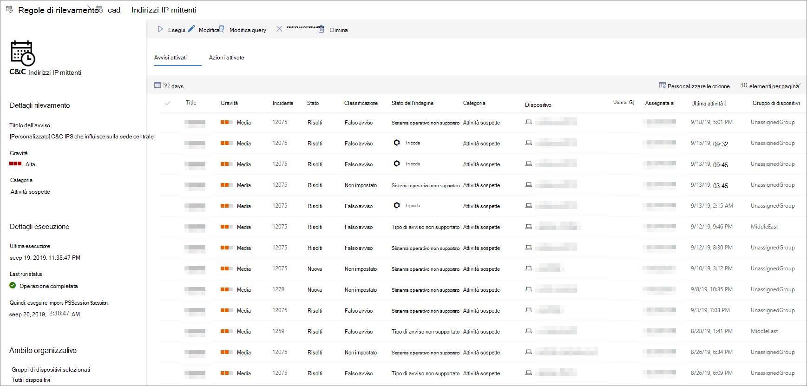

# Visualizzare e gestire regole di rilevamento personalizzate

[!INCLUDE [Microsoft 365 Defender rebranding](../../includes/microsoft-defender.md)]

**Si applica a:**
- [Microsoft Defender per endpoint](https://go.microsoft.com/fwlink/p/?linkid=2154037)
- [Microsoft 365 Defender](https://go.microsoft.com/fwlink/?linkid=2118804)

>Vuoi provare Defender per Endpoint? [Iscriversi per una versione di valutazione gratuita.](https://www.microsoft.com/microsoft-365/windows/microsoft-defender-atp?ocid=docs-wdatp-assignaccess-abovefoldlink)

Gestisci le regole [di rilevamento personalizzate esistenti](custom-detection-rules.md) per assicurarti che trovino in modo efficace minacce ed esercitino azioni. Scopri come visualizzare l'elenco delle regole, controllare le esecuzioni precedenti ed esaminare gli avvisi che hanno attivato. È inoltre possibile eseguire una regola su richiesta e modificarla.

## Autorizzazioni necessarie

Per creare o gestire rilevamenti personalizzati, [il ruolo](user-roles.md#create-roles-and-assign-the-role-to-an-azure-active-directory-group) deve disporre dell'autorizzazione gestisci **impostazioni di** sicurezza.

## Visualizzare le regole esistenti

Per visualizzare tutte le regole di rilevamento personalizzate esistenti, passare a **Impostazioni**  >  **Rilevamenti personalizzati.** Nella pagina sono elencate tutte le regole con le seguenti informazioni di esecuzione:

- **Ultima esecuzione:** data dell'ultima esecuzione di una regola per verificare la presenza di corrispondenze di query e generare avvisi
- **Stato dell'ultima esecuzione:** indica se una regola è stata eseguita correttamente
- **Esecuzione successiva:** l'esecuzione pianificata successiva
- **Stato:** indica se una regola è stata attivata o disattivata

## Visualizzare i dettagli della regola, modificare la regola ed eseguire la regola

Per visualizzare informazioni complete su una regola di rilevamento personalizzata, selezionare il nome della regola nell'elenco delle regole in **Impostazioni**  >  **Rilevamenti personalizzati**. In una pagina sulla regola selezionata vengono visualizzate le informazioni seguenti:

- Informazioni generali sulla regola, inclusi i dettagli dell'avviso, lo stato di esecuzione e l'ambito
- Elenco degli avvisi attivati
- Elenco delle azioni attivate

 
*Pagina regola di rilevamento personalizzata*

È inoltre possibile eseguire le azioni seguenti nella regola da questa pagina:

- **Esegui:** eseguire immediatamente la regola. Questa azione reimposta anche l'intervallo per l'esecuzione successiva.
- **Modifica:** modificare la regola senza modificare la query
- **Modifica query**: modifica la query in ricerca avanzata
- **Attivare**  /  **Disattiva:** abilita la regola o arresta l'esecuzione
- **Delete:** disattivare la regola e rimuoverla

>[!TIP]
>Per visualizzare rapidamente le informazioni ed eseguire azioni su un elemento di una tabella, utilizzare la colonna di selezione [&#10003;] a sinistra della tabella.

## Argomenti correlati
- [Panoramica dei rilevamenti personalizzati](overview-custom-detections.md)
- [Creare regole di rilevamento](custom-detection-rules.md)
- [Panoramica della rilevazione avanzata](advanced-hunting-overview.md)
- [Visualizzare e organizzare gli avvisi](alerts-queue.md)
