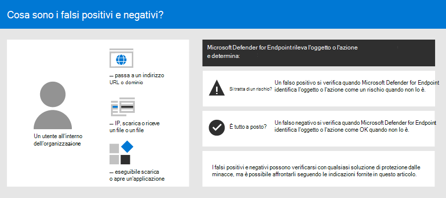
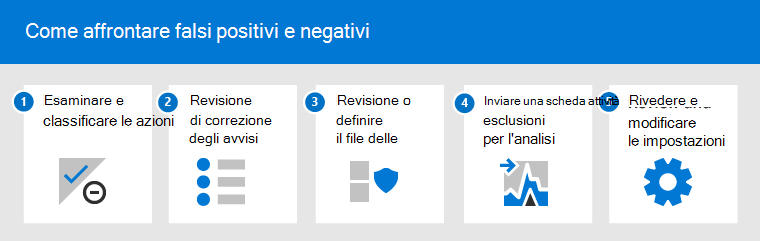
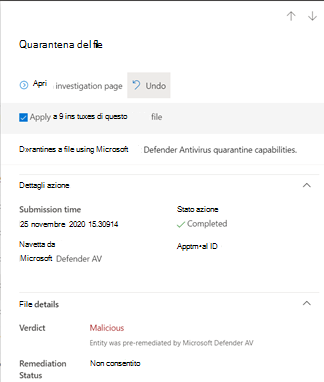
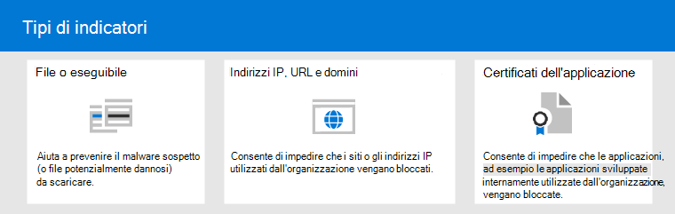

# <a name="address-false-positivesnegatives-in-microsoft-defender-for-endpoint"></a>Indirizzare i falsi positivi/negativi in Microsoft Defender per Endpoint

[!INCLUDE [Microsoft 365 Defender rebranding](../../includes/microsoft-defender.md)]

**Si applica a**

- [Microsoft Defender per endpoint](https://go.microsoft.com/fwlink/p/?linkid=2146806)

Nelle soluzioni di protezione degli endpoint, un falso positivo è un'entità, ad esempio un file o un processo, che è stata rilevata e identificata come dannosa, anche se l'entità non è effettivamente una minaccia. Un falso negativo è un'entità che non è stata rilevata come minaccia, anche se in realtà è dannosa. I falsi positivi/negativi possono verificarsi con qualsiasi soluzione di protezione dalle minacce, incluso [Microsoft Defender per Endpoint.](microsoft-defender-endpoint.md)



Fortunatamente, è possibile eseguire operazioni per risolvere e ridurre questo tipo di problemi. Se vengono visualizzati falsi positivi/negativi in [Microsoft 365 Defender](microsoft-defender-security-center.md) (in precedenza Microsoft Defender Security Center), le operazioni di sicurezza possono adottare misure per affrontarli utilizzando il processo seguente:

1. [Esaminare e classificare gli avvisi](#part-1-review-and-classify-alerts)
2. [Esaminare le azioni di correzione eseguite](#part-2-review-remediation-actions)
3. [Esaminare e definire le esclusioni](#part-3-review-or-define-exclusions)
4. [Inviare un'entità per l'analisi](#part-4-submit-a-file-for-analysis)
5. [Esaminare e modificare le impostazioni di protezione dalle minacce](#part-5-review-and-adjust-your-threat-protection-settings)

È possibile ottenere assistenza se si verificano ancora problemi con falsi positivi/negativi dopo aver eseguito le attività descritte in questo articolo. Vedere [Serve ancora assistenza?](#still-need-help)



> [!NOTE]
> Questo articolo è destinato agli operatori della sicurezza e agli amministratori della sicurezza che usano [Microsoft Defender per Endpoint.](microsoft-defender-endpoint.md)

## <a name="part-1-review-and-classify-alerts"></a>Parte 1: esaminare e classificare gli avvisi

Se viene visualizzato un [avviso](alerts.md) che è stato attivato perché è stato rilevato un elemento dannoso o sospetto che non dovrebbe essere stato, è possibile eliminare l'avviso per tale entità. È inoltre possibile eliminare gli avvisi che non sono necessariamente falsi positivi, ma non sono importanti. È consigliabile classificare anche gli avvisi.

La gestione degli avvisi e la classificazione dei falsi positivi aiuta a formare la soluzione di protezione dalle minacce e a ridurre il numero di falsi positivi o falsi negativi nel tempo. L'esecuzione di questi passaggi consente inoltre di ridurre i rumori nel dashboard delle operazioni di sicurezza in modo che il team di sicurezza possa concentrarsi sugli elementi di lavoro con priorità più alta.

### <a name="determine-whether-an-alert-is-accurate"></a>Determinare se un avviso è accurato

Prima di classificare o eliminare un avviso, determinare se l'avviso è accurato, falso positivo o benigno.

1. Accedere al portale Microsoft 365 Defender ( <https://security.microsoft.com> ) ed eseguire l'accesso.

2. Nel riquadro di spostamento scegliere **Coda avvisi.**

3. Selezionare un avviso per ulteriori dettagli sull'avviso. (Vedere [Esaminare gli avvisi in Microsoft Defender per Endpoint).](review-alerts.md)

4. A seconda dello stato dell'avviso, eseguire i passaggi descritti nella tabella seguente:

<br>

****

|Stato avviso|Soluzione|
|---|---|
|L'avviso è accurato|Assegnare l'avviso e quindi [analizzarlo ulteriormente.](investigate-alerts.md)|
|L'avviso è un falso positivo|<ol><li>[Classificare l'avviso](#classify-an-alert) come falso positivo.</li><li>[Eliminare l'avviso](#suppress-an-alert).</li><li>[Crea un indicatore](#indicators-for-microsoft-defender-for-endpoint) per Microsoft Defender per Endpoint.</li><li>[Inviare un file a Microsoft per l'analisi](#part-4-submit-a-file-for-analysis).</li></ol>|
|L'avviso è accurato, ma benigno (non importante)|[Classificare l'avviso](#classify-an-alert) come vero positivo e quindi [eliminare l'avviso.](#suppress-an-alert)|
|||

### <a name="classify-an-alert"></a>Classificare un avviso

Gli avvisi possono essere classificati come falsi positivi o veri positivi in Microsoft 365 Defender. La classificazione degli avvisi aiuta a formare Microsoft Defender for Endpoint in modo che, nel tempo, si vedano più avvisi veri e meno avvisi falsi.

1. Accedere al portale Microsoft 365 Defender ( <https://security.microsoft.com> ) ed eseguire l'accesso.

2. Selezionare **Coda avvisi** e quindi selezionare un avviso.

3. Per l'avviso selezionato, selezionare **Azioni**  >  **Gestisci avviso.** Verrà visualizzato un riquadro a comparsa.

4. Nella sezione **Gestisci avviso** selezionare True **alert o** **False alert.** Utilizzare **l'avviso False** per classificare un falso positivo.

> [!TIP]
> Per ulteriori informazioni sull'eliminazione degli avvisi, vedere [Manage Microsoft Defender for Endpoint alerts.](/microsoft-365/security/defender-endpoint/manage-alerts) Inoltre, se l'organizzazione utilizza un server SIEM (Security Information and Event Management), assicurarsi di definire anche una regola di eliminazione.

### <a name="suppress-an-alert"></a>Eliminare un avviso

Se sono presenti avvisi che sono falsi positivi o veri positivi ma per eventi non importanti, è possibile eliminare tali avvisi in Microsoft 365 Defender. L'eliminazione degli avvisi consente di ridurre il rumore nel dashboard delle operazioni di sicurezza.

1. Accedere al portale Microsoft 365 Defender ( <https://security.microsoft.com> ) ed eseguire l'accesso.

2. Nel riquadro di spostamento selezionare **Coda avvisi.**

3. Selezionare un avviso che si desidera eliminare per aprire il relativo **riquadro** Dei dettagli.

4. Nel riquadro **Dettagli** scegliere i puntini di sospensione (**...**) e quindi **Creare una regola di eliminazione.**

5. Specificare tutte le impostazioni per la regola di eliminazione, quindi scegliere **Salva.**

> [!TIP]
> Serve assistenza per le regole di eliminazione? Vedere [Eliminazione di un avviso e creazione di una nuova regola di eliminazione.](/microsoft-365/security/defender-endpoint/manage-alerts#suppress-an-alert-and-create-a-new-suppression-rule)

## <a name="part-2-review-remediation-actions"></a>Parte 2: esaminare le azioni di correzione

[Le azioni di correzione,](manage-auto-investigation.md#remediation-actions)ad esempio l'invio di un file in quarantena o l'arresto di un processo, vengono eseguite su entità (ad esempio file) che vengono rilevate come minacce. Diversi tipi di azioni di correzione si verificano automaticamente tramite analisi automatizzate e Antivirus Microsoft Defender:

- Mettere in quarantena un file
- Rimuovere una chiave del Registro di sistema
- Uccidi un processo
- Arrestare un servizio
- Disabilitare un driver
- Rimuovere un'attività pianificata

Altre azioni, ad esempio l'avvio di un'analisi antivirus o la raccolta di un pacchetto di analisi, vengono eseguite manualmente o tramite [Live Response.](live-response.md) Le azioni eseguite tramite Live Response non possono essere annullate.

Dopo aver esaminato gli avvisi, il passaggio successivo consiste nell'esaminare [le azioni di correzione.](manage-auto-investigation.md) Se sono state intraprese azioni a seguito di falsi positivi, è possibile annullare la maggior parte dei tipi di azioni correttive. In particolare, è possibile:

- [Ripristinare un file in quarantena dal Centro notifiche](#restore-a-quarantined-file-from-the-action-center)
- [Annullare più azioni contemporaneamente](#undo-multiple-actions-at-one-time)
- [Rimuovere un file dalla quarantena su più dispositivi](#remove-a-file-from-quarantine-across-multiple-devices).  e
- [Ripristinare un file dalla quarantena](#restore-file-from-quarantine)

Al termine dell'analisi e dell'annullamento delle azioni eseguite a seguito di falsi positivi, procedere alla revisione o [alla definizione delle esclusioni.](#part-3-review-or-define-exclusions)

### <a name="review-completed-actions"></a>Rivedere le azioni completate

1. Vai al centro notifiche ( <https://security.microsoft.com/action-center> ) e accedi.

2. Selezionare la **scheda** Cronologia per visualizzare un elenco delle azioni eseguite.

3. Selezionare un elemento per visualizzare ulteriori dettagli sull'azione di correzione eseguita.

### <a name="restore-a-quarantined-file-from-the-action-center"></a>Ripristinare un file in quarantena dal Centro notifiche

1. Vai al centro notifiche ( <https://security.microsoft.com/action-center> ) e accedi.

2. Nella scheda **Cronologia** selezionare un'azione che si desidera annullare.

3. Nel riquadro a comparsa selezionare **Annulla.** Se l'azione non può essere annullata con questo metodo, non verrà visualizzato un **pulsante** Annulla. Per ulteriori informazioni, vedere [Annullare le azioni completate.](manage-auto-investigation.md#undo-completed-actions)

### <a name="undo-multiple-actions-at-one-time"></a>Annullare più azioni contemporaneamente

1. Vai al centro notifiche ( <https://security.microsoft.com/action-center> ) e accedi.

2. Nella scheda **Cronologia** selezionare le azioni che si desidera annullare.

3. Nel riquadro sul lato destro dello schermo selezionare **Annulla.**

### <a name="remove-a-file-from-quarantine-across-multiple-devices"></a>Rimuovere un file dalla quarantena in più dispositivi

> [!div class="mx-imgBorder"]
> 

1. Vai al centro notifiche ( <https://security.microsoft.com/action-center> ) e accedi.

2. Nella scheda **Cronologia** selezionare un file con il tipo di azione **File quarantena.**

3. Nel riquadro sul lato destro dello schermo, selezionare Applica a X altre istanze **del file** e quindi scegliere **Annulla.**

### <a name="restore-file-from-quarantine"></a>Ripristinare un file dalla quarantena

È possibile eseguire il rollback e rimuovere un file dalla quarantena se si è stabilito che è pulito dopo un'indagine. Esegui il comando seguente in ogni dispositivo in cui il file è stato messo in quarantena.

1. Apri un prompt della riga di comando con privilegi elevati nel dispositivo:
   1. Passare a **Start** e digitare _cmd_.
   2. Fai clic con il **pulsante destro del mouse** su Prompt dei comandi e scegli Esegui come **amministratore.**

2. Immettere il comando seguente e premere **INVIO**:

    ```console
    "ProgramFiles%\Windows Defender\MpCmdRun.exe" –Restore –Name EUS:Win32/CustomEnterpriseBlock –All
    ```

    > [!IMPORTANT]
    > In alcuni scenari, **ThreatName** può essere visualizzato come `EUS:Win32/CustomEnterpriseBlock!cl` . Defender for Endpoint ripristini tutti i file bloccati personalizzati messi in quarantena su questo dispositivo negli ultimi 30 giorni.
    >
    > Un file messo in quarantena come potenziale minaccia di rete potrebbe non essere recuperabile. Se un utente tenta di ripristinare il file dopo la quarantena, tale file potrebbe non essere accessibile. Ciò può essere dovuto al fatto che il sistema non ha più credenziali di rete per accedere al file. In genere, questo è il risultato di un accesso temporaneo a una cartella condivisa o di sistema e i token di accesso sono scaduti.

3. Nel riquadro sul lato destro dello schermo, selezionare Applica a X altre istanze **del file** e quindi scegliere **Annulla.**

## <a name="part-3-review-or-define-exclusions"></a>Parte 3: Esaminare o definire le esclusioni

Un'esclusione è un'entità, ad esempio un file o un URL, specificata come eccezione alle azioni di correzione. L'entità esclusa può comunque essere rilevata, ma non vengono eseguite azioni di correzione su tale entità. In altri casi, il file o il processo rilevato non verrà arrestato, inviato in quarantena, rimosso o modificato in altro modo da Microsoft Defender per Endpoint.

Per definire le esclusioni in Microsoft Defender for Endpoint, eseguire le attività seguenti:

- [Definire le esclusioni per Antivirus Microsoft Defender](#exclusions-for-microsoft-defender-antivirus)
- [Creare indicatori "consenti" per Microsoft Defender for Endpoint](#indicators-for-microsoft-defender-for-endpoint)

> [!NOTE]
> Antivirus Microsoft Defender esclusioni si applicano solo alla protezione antivirus e non ad altre funzionalità di Microsoft Defender for Endpoint. Per escludere i file in generale, usa esclusioni per Antivirus Microsoft Defender [e indicatori personalizzati](/microsoft-365/security/defender-endpoint/manage-indicators) per Microsoft Defender per Endpoint.

Le procedure descritte in questa sezione descrivono come definire esclusioni e indicatori.

### <a name="exclusions-for-microsoft-defender-antivirus"></a>Esclusioni per Antivirus Microsoft Defender

In generale, non è necessario definire le esclusioni per Antivirus Microsoft Defender. Assicurarsi di definire le esclusioni con parsimonio e di includere solo i file, le cartelle, i processi e i file aperti dal processo che provocano falsi positivi. Inoltre, assicurati di esaminare regolarmente le esclusioni definite. Ti consigliamo di [usare Microsoft Endpoint Manager](/mem/endpoint-manager-overview) per definire o modificare le esclusioni antivirus; tuttavia, puoi usare altri metodi, ad esempio [Criteri di gruppo](/azure/active-directory-domain-services/manage-group-policy) (vedi Gestire Microsoft Defender per [endpoint).](manage-atp-post-migration.md)

> [!TIP]
> Serve assistenza per le esclusioni antivirus? Vedere [Configure and validate exclusions for Antivirus Microsoft Defender scans](configure-exclusions-microsoft-defender-antivirus.md).

#### <a name="use-microsoft-endpoint-manager-to-manage-antivirus-exclusions-for-existing-policies"></a>Utilizzare Microsoft Endpoint Manager per gestire le esclusioni antivirus (per i criteri esistenti)

1. Accedere all'Microsoft Endpoint Manager di amministrazione ( <https://endpoint.microsoft.com> ) e accedere.

2. Scegliere **Endpoint security**  >  **Antivirus** e quindi selezionare un criterio esistente. Se non si dispone di un criterio esistente o si desidera creare un nuovo criterio, passare [alla procedura successiva.](#use-microsoft-endpoint-manager-to-create-a-new-antivirus-policy-with-exclusions)

3. Scegliere **Proprietà** e accanto a **Impostazioni di configurazione** scegliere **Modifica.**

4. Espandi **Antivirus Microsoft Defender esclusioni** e quindi specifica le esclusioni.

5. Scegliere **Rivedi e salva** e quindi Salva. 

#### <a name="use-microsoft-endpoint-manager-to-create-a-new-antivirus-policy-with-exclusions"></a>Utilizzare Microsoft Endpoint Manager per creare un nuovo criterio antivirus con esclusioni

1. Accedere all'Microsoft Endpoint Manager di amministrazione ( <https://endpoint.microsoft.com> ) e accedere.

2. Scegliere **Endpoint security**  >  **Antivirus**+ Create  >  **Policy.**

3. Selezionare una piattaforma,ad esempio **Windows 10 e versioni successive,** **macOS** o **Windows 10 e Windows Server**).

4. In **Profilo** selezionare Antivirus Microsoft Defender **e** quindi scegliere **Crea.**

5. Specificare un nome e una descrizione per il profilo, quindi scegliere **Avanti.**

6. Nella scheda **Impostazioni di configurazione** specificare le esclusioni antivirus e quindi scegliere **Avanti.**

7. Nella scheda **Tag ambito,** se si utilizzano tag di ambito nell'organizzazione, specificare i tag di ambito per il criterio che si sta creando. Vedere [Tag di ambito.](/mem/intune/fundamentals/scope-tags)

8. Nella scheda **Assegnazioni** specificare gli utenti e i gruppi a cui applicare i criteri e quindi scegliere **Avanti**. Per assistenza con le assegnazioni, vedere [Assegnare profili utente](/mem/intune/configuration/device-profile-assign)e dispositivo in Microsoft Intune .

9. Nella scheda **Revisione e creazione** rivedere le impostazioni e quindi scegliere **Crea.**

### <a name="indicators-for-microsoft-defender-for-endpoint"></a>Indicatori per Microsoft Defender per Endpoint

[Gli](/microsoft-365/security/defender-endpoint/manage-indicators) indicatori (in particolare, indicatori di compromissione o ioc) consentono al team delle operazioni di sicurezza di definire il rilevamento, la prevenzione e l'esclusione delle entità. Ad esempio, puoi specificare determinati file da omettere dalle analisi e dalle azioni di correzione in Microsoft Defender per Endpoint. In caso contrario, gli indicatori possono essere utilizzati per generare avvisi per determinati file, indirizzi IP o URL.

Per specificare le entità come esclusioni per Microsoft Defender for Endpoint, crea indicatori "consenti" per tali entità. Tali indicatori "consenti" in Microsoft Defender for Endpoint si applicano alla protezione [di](microsoft-defender-antivirus-in-windows-10.md)nuova [generazione,](overview-endpoint-detection-response.md)rilevamento e reazione dagli endpoint e all'indagine & [correzione automatica.](/microsoft-365/security/defender-endpoint/automated-investigations)

Gli indicatori "Consenti" possono essere creati per:

- [File](#indicators-for-files)
- [Indirizzi IP, URL e domini](#indicators-for-ip-addresses-urls-or-domains)
- [Certificati dell'applicazione](#indicators-for-application-certificates)



#### <a name="indicators-for-files"></a>Indicatori per i file

Quando si [crea un indicatore "Consenti"](/microsoft-365/security/defender-endpoint/indicator-file)per un file, ad esempio un file eseguibile, si evita che i file che l'organizzazione sta utilizzando vengano bloccati. I file possono includere file eseguibili portabili (PE), ad esempio `.exe` e `.dll` file.

Prima di creare indicatori per i file, verificare che siano soddisfatti i requisiti seguenti:

- Antivirus Microsoft Defender è configurato con la protezione basata su cloud abilitata (vedere [Gestire la protezione basata su cloud](/windows/security/threat-protection/microsoft-defender-antivirus/deploy-manage-report-microsoft-defender-antivirus))
- La versione del client antimalware è 4.18.1901.x o successiva
- I dispositivi eseguono Windows 10 versione 1703 o successiva; Windows Server 2016; o Windows Server 2019
- La [funzionalità Blocca o consenti è attivata](/microsoft-365/security/defender-endpoint/advanced-features)

#### <a name="indicators-for-ip-addresses-urls-or-domains"></a>Indicatori per indirizzi IP, URL o domini

Quando si [crea un indicatore "Consenti"](/microsoft-365/security/defender-endpoint/indicator-ip-domain)per un indirizzo IP, un URL o un dominio, si evita che i siti o gli indirizzi IP utilizzati dall'organizzazione vengano bloccati.

Prima di creare indicatori per indirizzi IP, URL o domini, verificare che siano soddisfatti i requisiti seguenti:

- La protezione di rete in Defender for Endpoint è abilitata in modalità blocco (vedere [Abilitare la protezione di rete](/microsoft-365/security/defender-endpoint/enable-network-protection))
- La versione del client antimalware è 4.18.1906.x o successiva
- I dispositivi eseguono Windows 10 versione 1709 o successiva

Gli indicatori di rete personalizzati sono attivati nella [Microsoft 365 Defender](microsoft-defender-security-center.md). Per ulteriori informazioni, vedere [Funzionalità avanzate.](/microsoft-365/security/defender-endpoint/advanced-features)

#### <a name="indicators-for-application-certificates"></a>Indicatori per i certificati delle applicazioni

Quando si [crea un indicatore "Consenti"](/microsoft-365/security/defender-endpoint/indicator-certificates)per un certificato dell'applicazione, si evita che le applicazioni, ad esempio le applicazioni sviluppate internamente, utilizzate dall'organizzazione vengano bloccate. `.CER` o `.PEM` le estensioni di file sono supportate.

Prima di creare indicatori per i certificati dell'applicazione, verificare che siano soddisfatti i requisiti seguenti:

- Antivirus Microsoft Defender è configurato con la protezione basata su cloud abilitata (vedere [Gestire la protezione basata su cloud](deploy-manage-report-microsoft-defender-antivirus.md))
- La versione del client antimalware è 4.18.1901.x o successiva
- I dispositivi eseguono Windows 10 versione 1703 o successiva; Windows Server 2016; o Windows Server 2019
- Le definizioni di protezione da virus e minacce sono aggiornate

> [!TIP]
> Quando si creano indicatori, è possibile definirli uno alla volta o importare più elementi contemporaneamente. Tieni presente che esiste un limite di 15.000 indicatori per un singolo tenant. Potrebbe inoltre essere necessario raccogliere prima alcuni dettagli, ad esempio informazioni sull'hash dei file. Verificare i prerequisiti prima di creare [gli indicatori.](manage-indicators.md)

## <a name="part-4-submit-a-file-for-analysis"></a>Parte 4: Inviare un file per l'analisi

È possibile inviare entità, ad esempio file e rilevamenti senza file, a Microsoft per l'analisi. I ricercatori di sicurezza Microsoft analizzano tutti gli invii e i relativi risultati aiutano a informare Microsoft Defender per le funzionalità di protezione dalle minacce degli endpoint. Quando accedi al sito di invio, puoi tenere traccia degli invii.

### <a name="submit-a-file-for-analysis"></a>Inviare un file per l'analisi

Se si dispone di un file che è stato rilevato in modo errato come dannoso o è stato perso, seguire questa procedura per inviare il file per l'analisi.

1. Rivedere le linee guida qui: [Inviare file per l'analisi](/windows/security/threat-protection/intelligence/submission-guide).

2. Visita il sito Intelligence di sicurezza Microsoft di invio ( <https://www.microsoft.com/wdsi/filesubmission> ) e invia i file.

### <a name="submit-a-fileless-detection-for-analysis"></a>Inviare un rilevamento senza file per l'analisi

Se è stato rilevato un malware in base al comportamento e non si dispone di un file, è possibile inviare il `Mpsupport.cab` file per l'analisi. È possibile ottenere il file *.cab* utilizzando lo strumento Microsoft Malware Protection Command-Line Utility (MPCmdRun.exe) in Windows 10.

1. Passare a ` C:\ProgramData\Microsoft\Windows Defender\Platform\<version>` e quindi eseguire come `MpCmdRun.exe` amministratore.

2. Digitare `mpcmdrun.exe -GetFiles` e quindi premere **INVIO.**

   Viene .cab un file di diagnostica contenente diversi log di diagnostica. Il percorso del file viene specificato nell'output del prompt dei comandi. Per impostazione predefinita, il percorso è `C:\ProgramData\Microsoft\Microsoft Defender\Support\MpSupportFiles.cab` .

3. Rivedere le linee guida qui: [Inviare file per l'analisi](/windows/security/threat-protection/intelligence/submission-guide).

4. Visita il sito Intelligence di sicurezza Microsoft di invio ( <https://www.microsoft.com/wdsi/filesubmission> ) e invia i .cab file.

### <a name="what-happens-after-a-file-is-submitted"></a>Cosa succede dopo l'invio di un file?

Il tuo invio viene analizzato immediatamente dai nostri sistemi per fornire la determinazione più recente anche prima che un analista inizi a gestire il tuo caso. È possibile che un file sia già stato inviato ed elaborato da un analista. In questi casi, viene effettuata una determinazione rapida.

Per gli invii che non sono stati già elaborati, vengono classificati come priorità per l'analisi nel modo seguente:

- Ai file prevalenti che potrebbero influire su un numero elevato di computer viene data una priorità più alta.
- Ai clienti autenticati, in particolare ai clienti aziendali con ID [Software Assurance (SAID)](https://www.microsoft.com/licensing/licensing-programs/software-assurance-default.aspx)validi, viene data una priorità più alta.
- Gli invii contrassegnati come priorità alta dai titolari di SAID sono immediatamente oggetto di attenzione.

Per verificare la disponibilità di aggiornamenti relativi all'invio, accedere al sito [di Intelligence di sicurezza Microsoft di invio.](https://www.microsoft.com/wdsi/filesubmission)

> [!TIP]
> Per ulteriori informazioni, vedere [Inviare file per l'analisi.](/windows/security/threat-protection/intelligence/submission-guide#how-does-microsoft-prioritize-submissions)

## <a name="part-5-review-and-adjust-your-threat-protection-settings"></a>Parte 5: esaminare e modificare le impostazioni di protezione dalle minacce

Microsoft Defender for Endpoint offre un'ampia gamma di opzioni, inclusa la possibilità di ottimizzare le impostazioni per diverse funzionalità e funzionalità. Se si verificano numerosi falsi positivi, verificare le impostazioni di protezione dalle minacce dell'organizzazione. Potrebbe essere necessario apportare alcune modifiche a:

- [Protezione basata sul cloud](#cloud-delivered-protection)
- [Correzione per applicazioni potenzialmente indesiderate](#remediation-for-potentially-unwanted-applications)
- [Analisi e correzione automatizzate](#automated-investigation-and-remediation)

### <a name="cloud-delivered-protection"></a>Protezione fornita dal cloud

Controlla il livello di protezione fornito dal cloud per Antivirus Microsoft Defender. Per impostazione predefinita, la protezione recapitata nel cloud è impostata su **Non** configurato, che corrisponde a un normale livello di protezione per la maggior parte delle organizzazioni. Se la protezione consegnata dal cloud è impostata su **Alta,** Alta **+** o **Tolleranza zero,** è possibile che si verifichi un numero maggiore di falsi positivi.

> [!TIP]
> Per ulteriori informazioni sulla configurazione della protezione basata sul cloud, vedere [Specify the cloud-delivered protection level.](/windows/security/threat-protection/microsoft-defender-antivirus/specify-cloud-protection-level-microsoft-defender-antivirus)

Ti consigliamo di [usare Microsoft Endpoint Manager](/mem/endpoint-manager-overview) per modificare o impostare le impostazioni di protezione per il cloud; tuttavia, puoi usare altri metodi, ad esempio [Criteri di gruppo](/azure/active-directory-domain-services/manage-group-policy) (vedi Gestire Microsoft Defender per [endpoint).](manage-atp-post-migration.md)

#### <a name="use-microsoft-endpoint-manager-to-review-and-edit-cloud-delivered-protection-settings-for-existing-policies"></a>Usare Microsoft Endpoint Manager per esaminare e modificare le impostazioni di protezione recapitate nel cloud (per i criteri esistenti)

1. Accedere all'Microsoft Endpoint Manager di amministrazione ( <https://endpoint.microsoft.com> ) e accedere.

2. Scegliere **Endpoint security**  >  **Antivirus** e quindi selezionare un criterio esistente. Se non si dispone di un criterio esistente o si desidera creare un nuovo criterio, passare [alla procedura successiva.](#use-microsoft-endpoint-manager-to-set-cloud-delivered-protection-settings-for-a-new-policy)

3. In **Gestisci** selezionare **Proprietà.** Quindi, accanto a **Impostazioni di configurazione** scegliere **Modifica.**

4. Espandi **Protezione cloud** ed esamina l'impostazione corrente nella riga Livello di protezione fornito **dal** cloud. È consigliabile impostare la protezione fornita dal cloud su **Non** configurato, che garantisce una protezione avanzata riducendo al contempo le probabilità di ottenere falsi positivi.

5. Scegliere **Rivedi e salva** e quindi **Salva.**

#### <a name="use-microsoft-endpoint-manager-to-set-cloud-delivered-protection-settings-for-a-new-policy"></a>Usare Microsoft Endpoint Manager per configurare le impostazioni di protezione recapitate nel cloud (per un nuovo criterio)

1. Accedere all'Microsoft Endpoint Manager di amministrazione ( <https://endpoint.microsoft.com> ) e accedere.

2. Scegliere **Endpoint security**  >  **Antivirus**+ Create  >  **policy**.

3. In **Piattaforma** seleziona un'opzione e quindi in Profilo seleziona **Antivirus** o **Antivirus Microsoft Defender** (l'opzione specifica dipende da ciò che hai selezionato per **Piattaforma).)** Quindi scegliere **Crea**.

4. Nella scheda **Nozioni di** base specificare un nome e una descrizione per il criterio. Quindi scegliere **Avanti**.

5. Nella scheda **Impostazioni di** configurazione espandere **Protezione cloud** e specificare le impostazioni seguenti:
   - Impostare **Attiva protezione recapitata sul cloud** su **Sì.**
   - Impostare **Livello di protezione fornita dal cloud** su **Non configurato**. Per impostazione predefinita, questo livello offre un livello di protezione elevato, riducendo al contempo le probabilità di ottenere falsi positivi.

6. Nella scheda **Tag ambito,** se si utilizzano tag di ambito nell'organizzazione, specificare i tag di ambito per il criterio. Vedere [Tag di ambito.](/mem/intune/fundamentals/scope-tags)

7. Nella scheda **Assegnazioni** specificare gli utenti e i gruppi a cui applicare i criteri e quindi scegliere **Avanti**. Per assistenza con le assegnazioni, vedere [Assegnare profili utente](/mem/intune/configuration/device-profile-assign)e dispositivo in Microsoft Intune .

8. Nella scheda **Revisione e creazione** rivedere le impostazioni e quindi scegliere **Crea.**

### <a name="remediation-for-potentially-unwanted-applications"></a>Correzione per applicazioni potenzialmente indesiderate

Le applicazioni potenzialmente indesiderate sono una categoria di software che può causare l'esecuzione lenta dei dispositivi, la visualizzazione di annunci imprevisti o l'installazione di altro software che potrebbe essere imprevisto o indesiderato. Tra gli esempi di applicazioni potenzialmente dannose sono inclusi il software pubblicitario, il software di aggregazione e il software di evasione che si comporta in modo diverso con i prodotti di sicurezza. Anche se la puA non è considerata malware, alcuni tipi di software sono puA in base al loro comportamento e reputazione.

> [!TIP]
> Per ulteriori informazioni sulla puA, vedere [Detect and block potentially unwanted applications](/windows/security/threat-protection/microsoft-defender-antivirus/detect-block-potentially-unwanted-apps-microsoft-defender-antivirus).

A seconda delle app che l'organizzazione usa, potresti ricevere falsi positivi a seguito delle impostazioni di protezione dell'app di accesso alla posta elettronica. Se necessario, è consigliabile eseguire la protezione puA in modalità di controllo per un po' di tempo oppure applicare la protezione puA a un sottoinsieme di dispositivi dell'organizzazione. È possibile configurare la protezione dell'accesso Microsoft Edge per il browser e per Antivirus Microsoft Defender.

Ti consigliamo di [usare Microsoft Endpoint Manager](/mem/endpoint-manager-overview) per modificare o impostare le impostazioni di protezione puA; tuttavia, puoi usare altri metodi, ad esempio [Criteri di gruppo](/azure/active-directory-domain-services/manage-group-policy) (vedi Gestire Microsoft Defender per [endpoint).](manage-atp-post-migration.md)

#### <a name="use-microsoft-endpoint-manager-to-edit-pua-protection-for-existing-configuration-profiles"></a>Utilizzare Microsoft Endpoint Manager per modificare la protezione delle applicazioni personali (per i profili di configurazione esistenti)Use Microsoft Endpoint Manager to edit PUA protection (for existing configuration profiles)

1. Accedere all'Microsoft Endpoint Manager di amministrazione ( <https://endpoint.microsoft.com> ) e accedere.

2. Scegliere **Profili**  >  **di configurazione dei** dispositivi e quindi selezionare un criterio esistente. Se non si dispone di un criterio esistente o si desidera creare un nuovo criterio, passare [alla procedura successiva.](#use-microsoft-endpoint-manager-to-set-pua-protection-for-a-new-configuration-profile)

3. In **Gestisci** scegliere **Proprietà** e quindi, accanto a Impostazioni **di configurazione,** scegliere **Modifica.**

4. Nella scheda **Impostazioni di configurazione** scorrere verso il basso ed espandere **Antivirus Microsoft Defender**.

5. Impostare **Rileva applicazioni potenzialmente indesiderate** su **Controlla**. Puoi disattivarlo, ma usando la modalità di controllo potrai vedere i rilevamenti.

6. Scegliere **Rivedi e salva** e quindi Salva. 

#### <a name="use-microsoft-endpoint-manager-to-set-pua-protection-for-a-new-configuration-profile"></a>Utilizzare Microsoft Endpoint Manager per impostare la protezione puA (per un nuovo profilo di configurazione)Use Microsoft Endpoint Manager to set PUA protection (for a new configuration profile)

1. Accedere all'Microsoft Endpoint Manager di amministrazione ( <https://endpoint.microsoft.com> ) e accedere.

2. Scegliere **Profili**  >  **di configurazione dei dispositivi**+ Crea  >  **profilo**.

3. Per **Piattaforma,** scegliere Windows 10 **e versioni successive** e, per **Profilo,** selezionare **Restrizioni dispositivo.**

4. Nella scheda **Nozioni di** base specificare un nome e una descrizione per il criterio. Quindi scegliere **Avanti**.

5. Nella scheda **Impostazioni di configurazione** scorrere verso il basso ed espandere **Antivirus Microsoft Defender**.

6. Impostare **Rileva applicazioni potenzialmente indesiderate** su **Controlla** e quindi scegliere **Avanti.** È possibile disattivare la protezione puA, ma utilizzando la modalità di controllo sarà possibile visualizzare i rilevamenti.

7. Nella scheda **Assegnazioni** specificare gli utenti e i gruppi a cui applicare i criteri e quindi scegliere **Avanti**. Per assistenza con le assegnazioni, vedere [Assegnare profili utente](/mem/intune/configuration/device-profile-assign)e dispositivo in Microsoft Intune .

8. Nella scheda **Regole di applicabilità** specificare le edizioni o le versioni del sistema operativo da includere o escludere dal criterio. Ad esempio, puoi impostare il criterio da applicare a tutti i dispositivi in determinate edizioni di Windows 10. Quindi scegliere **Avanti**.

9. Nella scheda **Revisione e creazione** rivedere le impostazioni e quindi scegliere **Crea.**

### <a name="automated-investigation-and-remediation"></a>Indagine e correzione automatizzate

[Le funzionalità di analisi e correzione automatizzate](automated-investigations.md) (AIR) sono progettate per esaminare gli avvisi e intervenire immediatamente per risolvere le violazioni. Quando vengono attivati avvisi e viene eseguita un'indagine automatizzata, viene generato un verdetto per ogni prova esaminata. I verdetti possono essere *Dannosi,* *Sospetti* o *Nessuna minaccia trovata.*

A seconda del [livello di automazione](/microsoft-365/security/defender-endpoint/automation-levels) impostato per l'organizzazione e di altre impostazioni di sicurezza, vengono eseguite azioni di correzione sugli artefatti considerati dannosi *o* *sospetti.* In alcuni casi, le azioni di correzione vengono eseguite automaticamente. in altri casi, le azioni di correzione vengono eseguite manualmente o solo dopo l'approvazione da parte del team delle operazioni di sicurezza.

- [Ulteriori informazioni sui livelli di automazione;](/microsoft-365/security/defender-endpoint/automation-levels) E poi
- [Configurare le funzionalità AIR in Defender per Endpoint](/microsoft-365/security/defender-endpoint/configure-automated-investigations-remediation).

> [!IMPORTANT]
> Ti consigliamo di *usare l'automazione* completa per l'analisi e la correzione automatizzate. Non disattivare queste funzionalità a causa di un falso positivo. Usa invece gli [indicatori "consenti"](#indicators-for-microsoft-defender-for-endpoint)per definire le eccezioni e mantieni l'analisi e la correzione automatizzate impostate per eseguire automaticamente le azioni appropriate. Seguire [queste indicazioni consente](automation-levels.md#levels-of-automation) di ridurre il numero di avvisi che il team delle operazioni di sicurezza deve gestire.

## <a name="still-need-help"></a>Ulteriore assistenza

Se hai seguito tutti i passaggi descritti in questo articolo e hai ancora bisogno di assistenza, contatta il supporto tecnico.

1. Vai a Microsoft 365 Defender ( <https://security.microsoft.com> ) e accedi.

2. Nell'angolo in alto a destra selezionare il punto interrogativo (**?**) e quindi scegliere **Supporto Tecnico Microsoft**.

3. Nella finestra **Dell'Assistente** supporto, descrivere il problema e quindi inviare il messaggio. Da qui è possibile aprire una richiesta di servizio.

## <a name="see-also"></a>Vedere anche

[Gestire Microsoft Defender per Endpoint](manage-atp-post-migration.md)

[Panoramica del Microsoft 365 Defender portale](/microsoft-365/security/defender-endpoint/use)
