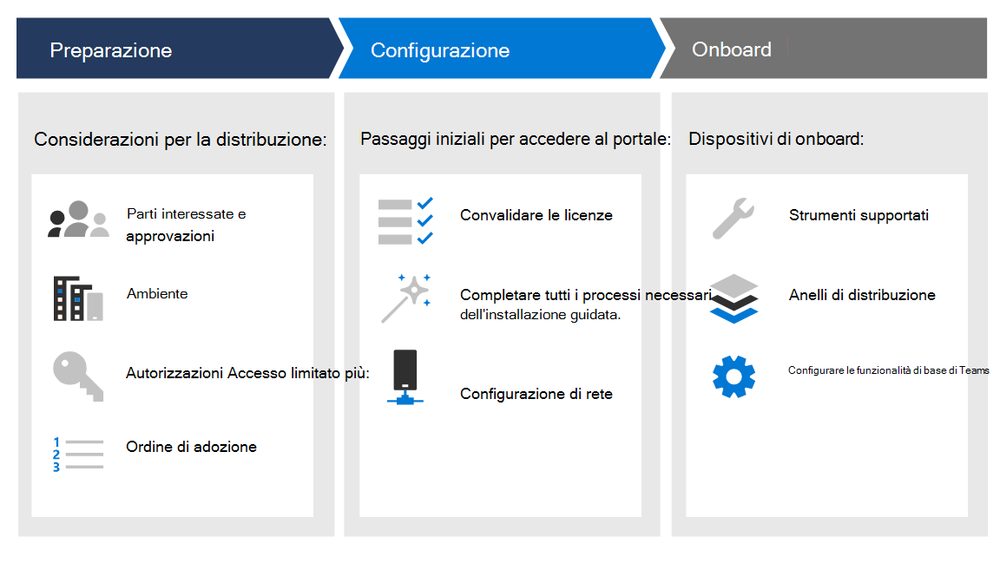

# Fasi della distribuzioneDeployment phases

[!INCLUDE [Microsoft 365 Defender rebranding](../../includes/microsoft-defender.md)]

**Si applica a:****Applies to:**
- [Microsoft Defender per endpointMicrosoft Defender for Endpoint](https://go.microsoft.com/fwlink/p/?linkid=2154037)
- [Microsoft 365 DefenderMicrosoft 365 Defender](https://go.microsoft.com/fwlink/?linkid=2118804)

>Vuoi provare Defender per Endpoint?Want to experience Defender for Endpoint? [Iscriversi per una versione di valutazione gratuita.Sign up for a free trial.](https://www.microsoft.com/microsoft-365/windows/microsoft-defender-atp?ocid=docs-wdatp-assignaccess-abovefoldlink)

Scopri come distribuire Microsoft Defender for Endpoint in modo che l'azienda possa sfruttare la protezione preventiva, il rilevamento post-violazione, l'indagine automatizzata e la risposta.Learn how to deploy Microsoft Defender for Endpoint so that your enterprise can take advantage of preventative protection, post-breach detection, automated investigation, and response. 

Questa guida consente di lavorare tra le parti interessate per preparare l'ambiente e quindi eseguire l'onboardboard dei dispositivi in modo metodico, passando dalla valutazione a un progetto pilota significativo, alla distribuzione completa.This guide helps you work across stakeholders to prepare your environment and then onboard devices in a methodical way, moving from evaluation, to a meaningful pilot, to full deployment.

Ogni sezione corrisponde a un articolo separato in questa soluzione.Each section corresponds to a separate article in this solution.

|FasePhase | DescrizioneDescription | 
|:-------|:-----|
| [Fase 1: preparazionePhase 1: Prepare](prepare-deployment.md)| Informazioni su cosa è necessario considerare quando si distribuisce Defender per Endpoint, ad esempio le approvazioni delle parti interessate, le considerazioni sull'ambiente, le autorizzazioni di accesso e l'ordine di adozione delle funzionalità.Learn about what you need to consider when deploying Defender for Endpoint such as stakeholder approvals, environment considerations, access permissions, and adoption order of capabilities. 
| [Fase 2: configurazionePhase 2: Setup](production-deployment.md)|  Ottieni indicazioni sui passaggi iniziali da eseguire per accedere al portale, ad esempio la convalida delle licenze, il completamento dell'installazione guidata e la configurazione di rete.Get guidance on the initial steps you need to take so that you can access the portal such as validating licensing, completing the setup wizard, and network configuration. 
| [Fase 3: onboardingPhase 3: Onboard](onboarding.md) | Scopri come usare gli anelli di distribuzione, gli strumenti di onboarding supportati in base al tipo di endpoint e la configurazione delle funzionalità disponibili.Learn how to make use of deployment rings, supported onboarding tools based on the type of endpoint, and configuring available capabilities. 

Dopo aver completato questa guida, verrà impostata con le autorizzazioni di accesso appropriate, gli endpoint verranno onboarding e verranno segnalati i dati dei sensori al servizio e saranno disponibili funzionalità quali la protezione di nuova generazione e la riduzione della superficie di attacco.After you've completed this guide, you'll be setup with the right access permissions, your endpoints will be onboarded and reporting sensor data to the service, and capabilities such as next-generation protection and attack surface reduction will be in place.

Indipendentemente dall'architettura dell'ambiente e dal metodo di distribuzione scelto in Plan [deployment](deployment-strategy.md) guidance, questa guida ti supporterà negli endpoint di onboarding.Regardless of the environment architecture and method of deployment you choose outlined in the [Plan deployment](deployment-strategy.md) guidance, this guide is going to support you in onboarding endpoints. 

## Funzionalità chiaveKey capabilities

Mentre Microsoft Defender for Endpoint offre molte funzionalità, lo scopo principale di questa guida alla distribuzione è iniziare a usare i dispositivi di onboarding.While Microsoft Defender for Endpoint provides many capabilities, the primary purpose of this deployment guide is to get you started by onboarding devices. Oltre all'onboarding, questa guida ti consente di iniziare con le funzionalità seguenti.In addition to onboarding, this guidance gets you started with the following capabilities.

FunzionalitàCapability | DescrizioneDescription 
:---|:---
Rilevamento endpoint e rispostaEndpoint detection and response | Vengono messe in atto funzionalità di rilevamento e risposta degli endpoint per rilevare, analizzare e rispondere ai tentativi di intrusione e alle violazioni attive.Endpoint detection and response capabilities are put in place to detect, investigate, and respond to intrusion attempts and active breaches.
Protezione di nuova generazioneNext-generation protection | Per rafforzare ulteriormente il perimetro di sicurezza della rete, Microsoft Defender for Endpoint usa una protezione di nuova generazione progettata per rilevare tutti i tipi di minacce emergenti.To further reinforce the security perimeter of your network, Microsoft Defender for Endpoint uses next-generation protection designed to catch all types of emerging threats.
La riduzione della superficie di attaccoAttack surface reduction |  Fornire la prima linea di difesa nello stack.Provide the first line of defense in the stack. Assicurandosi che le impostazioni di configurazione siano impostate correttamente e che le tecniche di mitigazione degli exploit siano applicate, questo set di funzionalità resiste agli attacchi e allo sfruttamento.By ensuring configuration settings are properly set and exploit mitigation techniques are applied, these set of capabilities resist attacks and exploitation.

Tutte queste funzionalità sono disponibili per i titolari della licenza di Microsoft Defender per Endpoint.All these capabilities are available for Microsoft Defender for Endpoint license holders. Per ulteriori informazioni, vedere [Requisiti di licenza.](minimum-requirements.md#licensing-requirements)For more information, see [Licensing requirements](minimum-requirements.md#licensing-requirements).

## AmbitoScope

### Nell'ambitoIn scope

-   Uso di Microsoft Endpoint Manager e Microsoft Endpoint Manager per eseguire l'onboarding degli endpoint nel servizio e configurare le funzionalitàUse of Microsoft Endpoint Manager and Microsoft Endpoint Manager to onboard endpoints into the service and configure capabilities

-   Abilitazione di Defender per le funzionalità di rilevamento e risposta degli endpoint (EDR)Enabling Defender for Endpoint endpoint detection and response (EDR)  capabilities

-   Abilitazione delle funzionalità di Defender per Endpoint Endpoint Protection Platform (EPP)Enabling Defender for Endpoint endpoint protection platform (EPP) capabilities

    -   Protezione di nuova generazioneNext-generation protection

    -   La riduzione della superficie di attaccoAttack surface reduction

### EsclusioniOut of scope

Gli elementi seguenti non sono nell'ambito di questa guida alla distribuzione:The following are out of scope of this deployment guide:

-   Configurazione di soluzioni di terze parti che potrebbero integrarsi con Defender for EndpointConfiguration of third-party solutions that might integrate with Defender for Endpoint

-   Test di penetrazione nell'ambiente di produzionePenetration testing in production environment

## Vedere ancheSee also
- [Fase 1: preparazionePhase 1: Prepare](prepare-deployment.md)
- [Fase 2: configurazionePhase 2: Set up](production-deployment.md)
- [Phase 3: onboardingPhase 3: Onboard](onboarding.md)
- [Pianificare la distribuzionePlan deployment](deployment-strategy.md)