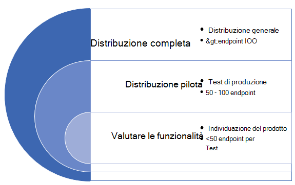

# Distribuire Microsoft Defender per Endpoint negli anelli

[!INCLUDE [Microsoft 365 Defender rebranding](../../includes/microsoft-defender.md)]

**Si applica a:**
- [Microsoft Defender per endpoint](https://go.microsoft.com/fwlink/p/?linkid=2154037)
- [Microsoft 365 Defender](https://go.microsoft.com/fwlink/?linkid=2118804)

>Vuoi provare Defender per Endpoint? [Iscriversi per una versione di valutazione gratuita.](https://www.microsoft.com/microsoft-365/windows/microsoft-defender-atp?ocid=docs-wdatp-assignaccess-abovefoldlink)

La distribuzione di Microsoft Defender per Endpoint può essere eseguita usando un approccio di distribuzione basato su anello. 

I ring di distribuzione possono essere applicati negli scenari seguenti:
- [Nuove distribuzioni](#new-deployments)
- [Distribuzioni esistenti](#existing-deployments)

## Nuove distribuzioni

Un approccio basato su anello è un metodo per identificare un set di endpoint da eseguire l'onboarding e verificare che determinati criteri siano soddisfatti prima di procedere alla distribuzione del servizio in un set di dispositivi più ampio. Puoi definire i criteri di uscita per ogni anello e assicurarti che siano soddisfatti prima di passare all'anello successivo.

L'adozione di una distribuzione basata su anello consente di ridurre i potenziali problemi che potrebbero verificarsi durante l'implementazione del servizio. Pilotando prima un determinato numero di dispositivi, è possibile identificare potenziali problemi e ridurre i potenziali rischi che potrebbero verificarsi. 

Nella tabella 1 viene fornito un esempio dei ring di distribuzione che è possibile utilizzare. 

**Tabella 1**

|**Anello di distribuzione**|**Descrizione**|
|:-----|:-----|
Valuta | Anello 1: identificare 50 sistemi per i test pilota 
Distribuzione pilota | Anello 2: identificare i successivi 50-100 endpoint nell'ambiente di produzione    
Distribuzione completa | Anello 3: Implementare il servizio nel resto dell'ambiente con incrementi maggiori

### Criteri di uscita
Un esempio di set di criteri di uscita per questi anelli può includere:
- I dispositivi vengono visualizzati nell'elenco di inventario dei dispositivi
- Gli avvisi vengono visualizzati nel dashboard
- [Eseguire un test di rilevamento](run-detection-test.md)
- [Eseguire un attacco simulato su un dispositivo](attack-simulations.md)

### Valuta
Identificare un numero limitato di computer di test nell'ambiente da eseguire l'onboard nel servizio. Idealmente, questi computer sarebbero meno di 50 endpoint. 

### Distribuzione pilota
Microsoft Defender for Endpoint supporta un'ampia gamma di endpoint che è possibile eseguire l'onboard nel servizio. In questo anello, identificare diversi dispositivi da eseguire l'onboard e in base ai criteri di uscita definiti, decidere di passare al successivo anello di distribuzione.

La tabella seguente mostra gli endpoint supportati e lo strumento corrispondente che puoi usare per eseguire l'onboardboard dei dispositivi nel servizio. 

| Endpoint     | Strumento di distribuzione                       |
|--------------|------------------------------------------|
| **Windows**  |  [Script locale (fino a 10 dispositivi)](configure-endpoints-script.md)   NOTA: se vuoi distribuire più di 10 dispositivi in un ambiente di produzione, usa il metodo Criteri di gruppo o gli altri strumenti supportati elencati di seguito.   [Criteri di gruppo](configure-endpoints-gp.md)    [Microsoft Endpoint Manager/ Mobile Device Manager](configure-endpoints-mdm.md)     [Microsoft Endpoint Configuration Manager](configure-endpoints-sccm.md)   [Script VDI](configure-endpoints-vdi.md)   |
| **macOS**    | [Script locale](mac-install-manually.md)   [Microsoft Endpoint Manager](mac-install-with-intune.md)   [JAMF Pro](mac-install-with-jamf.md)   [Gestione di dispositivi mobili](mac-install-with-other-mdm.md) |
| **Linux Server** | [Script locale](linux-install-manually.md)   [Pupazzo](linux-install-with-puppet.md)   [Ansible](linux-install-with-ansible.md)|
| **iOS**      | [Basato su app](ios-install.md)                                |
| **Android**  | [Microsoft Endpoint Manager](android-intune.md)               | 

### Distribuzione completa
In questa fase, è possibile utilizzare il [materiale di](deployment-strategy.md) pianificazione della distribuzione per pianificare la distribuzione. 

Usa il materiale seguente per selezionare l'architettura appropriata di Microsoft Defender for Endpoint che meglio si adatta alla tua organizzazione.

|**Elemento**|**Descrizione**|
|:-----|:-----|
|  [PDF](https://github.com/MicrosoftDocs/microsoft-365-docs/raw/public/microsoft-365/security/defender-endpoint/downloads/mdatp-deployment-strategy.pdf)  \| [Visio](https://github.com/MicrosoftDocs/microsoft-365-docs/raw/public/microsoft-365/security/defender-endpoint/downloads/mdatp-deployment-strategy.vsdx) | Il materiale sull'architettura consente di pianificare la distribuzione per le architetture seguenti: <ul><li> Nativa del cloud </li><li> Co-gestione </li><li> Locale</li><li>Valutazione e onboarding locale</li>

## Distribuzioni esistenti

### Endpoint di Windows
Per Windows e/o Windows Server, è possibile selezionare diversi computer da testare in anticipo (prima della patch di martedì) utilizzando il programma Di convalida degli aggiornamenti della sicurezza **(SUVP).**

Per ulteriori informazioni, vedere:
- [Che cos'è il programma di convalida degli aggiornamenti della sicurezza](https://techcommunity.microsoft.com/t5/windows-it-pro-blog/what-is-the-security-update-validation-program/ba-p/275767)
- [Software Update Validation Program and Microsoft Malware Protection Center Establishment - TwC Interactive Timeline Part 4](https://www.microsoft.com/security/blog/2012/03/28/software-update-validation-program-and-microsoft-malware-protection-center-establishment-twc-interactive-timeline-part-4/)

### Endpoint non Windows
Con macOS e Linux, puoi prendere un paio di sistemi ed eseguirti nel canale "InsidersFast".

>[!NOTE]
>Idealmente, almeno un amministratore della sicurezza e uno sviluppatore, in modo da poter individuare problemi di compatibilità, prestazioni e affidabilità prima che la build venga trasformata nel canale "Produzione".

La scelta del canale determina il tipo e la frequenza degli aggiornamenti offerti al dispositivo. I dispositivi in insiders-fast sono i primi a ricevere aggiornamenti e nuove funzionalità, seguiti successivamente da insider lenti e infine da prod.

Per visualizzare in anteprima le nuove funzionalità e fornire feedback anticipato, è consigliabile configurare alcuni dispositivi nell'organizzazione per l'uso di insiders-fast o insiders-slow.

>[!WARNING]
>Il cambio di canale dopo l'installazione iniziale richiede la reinstallazione del prodotto. Per cambiare il canale del prodotto: disinstalla il pacchetto esistente, ri-configura il dispositivo per l'uso del nuovo canale e segui i passaggi in questo documento per installare il pacchetto dal nuovo percorso.
