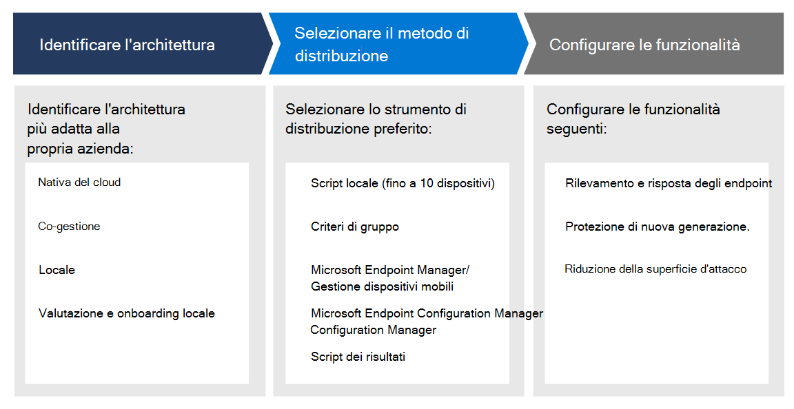

# Pianificare la distribuzione di Microsoft Defender for Endpoint 

[!INCLUDE [Microsoft 365 Defender rebranding](../../includes/microsoft-defender.md)]

**Si applica a:**
- [Microsoft Defender ATP](https://go.microsoft.com/fwlink/p/?linkid=2154037)
- [Microsoft 365 Defender](https://go.microsoft.com/fwlink/?linkid=2118804)

>Vuoi provare Defender per Endpoint? [Iscriversi per una versione di valutazione gratuita.](https://www.microsoft.com/microsoft-365/windows/microsoft-defender-atp?ocid=docs-wdatp-secopsdashboard-abovefoldlink) 

Pianificare la distribuzione di Microsoft Defender for Endpoint in modo da ottimizzare le funzionalità di sicurezza all'interno della famiglia di prodotti e proteggere meglio l'azienda dalle minacce informatiche.

Questa soluzione fornisce indicazioni su come identificare l'architettura dell'ambiente, selezionare il tipo di strumento di distribuzione più adatto alle proprie esigenze e indicazioni su come configurare le funzionalità.

## Passaggio 1: identificare l'architettura
Tutti gli ambienti aziendali sono univoci, quindi sono disponibili diverse opzioni per offrire la flessibilità necessaria per scegliere come distribuire il servizio.

Alcuni strumenti sono più adatti per determinate architetture, a seconda dell'ambiente. 

Usa il materiale seguente per selezionare l'architettura di Defender for Endpoint appropriata per la famiglia di prodotti più adatta alla tua organizzazione.

| Elemento | Descrizione |
|:-----|:-----|
|  [PDF](https://github.com/MicrosoftDocs/microsoft-365-docs/raw/public/microsoft-365/security/defender-endpoint/downloads/mdatp-deployment-strategy.pdf)  \| [Visio](https://github.com/MicrosoftDocs/microsoft-365-docs/raw/public/microsoft-365/security/defender-endpoint/downloads/mdatp-deployment-strategy.vsdx) | Il materiale sull'architettura consente di pianificare la distribuzione per le architetture seguenti: <ul><li> Nativa del cloud </li><li> Co-gestione </li><li> Locale</li><li>Valutazione e onboarding locale</li>

## Passaggio 2: Selezionare il metodo di distribuzione
Defender for Endpoint supporta un'ampia gamma di endpoint che è possibile eseguire l'onboard nel servizio. 

Nella tabella seguente sono elencati gli endpoint supportati e lo strumento di distribuzione corrispondente che è possibile utilizzare per pianificare la distribuzione in modo appropriato.

| Endpoint     | Strumento di distribuzione                       |
|--------------|------------------------------------------|
| **Windows**  |  [Script locale (fino a 10 dispositivi)](configure-endpoints-script.md)    [Criteri di gruppo](configure-endpoints-gp.md)    [Microsoft Endpoint Manager/ Mobile Device Manager](configure-endpoints-mdm.md)     [Microsoft Endpoint Configuration Manager](configure-endpoints-sccm.md)   [Script VDI](configure-endpoints-vdi.md)   |
| **macOS**    | [Script locale](mac-install-manually.md)   [Microsoft Endpoint Manager](mac-install-with-intune.md)   [JAMF Pro](mac-install-with-jamf.md)   [Gestione di dispositivi mobili](mac-install-with-other-mdm.md) |
| **Linux Server** | [Script locale](linux-install-manually.md)   [Pupazzo](linux-install-with-puppet.md)   [Ansible](linux-install-with-ansible.md)|
| **iOS**      | [Basato su app](ios-install.md)                                |
| **Android**  | [Microsoft Endpoint Manager](android-intune.md)               | 

## Passaggio 3: Configurare le funzionalità
Dopo gli endpoint di onboarding, configura le funzionalità di sicurezza in Defender per Endpoint in modo da poter ottimizzare la protezione di sicurezza affidabile disponibile nella famiglia di prodotti. Le funzionalità includono:

- Rilevamento endpoint e risposta
- Protezione di nuova generazione
- Riduzione della superficie d'attacco

  
## Argomenti correlati
- [Fasi di distribuzione](deployment-phases.md)
