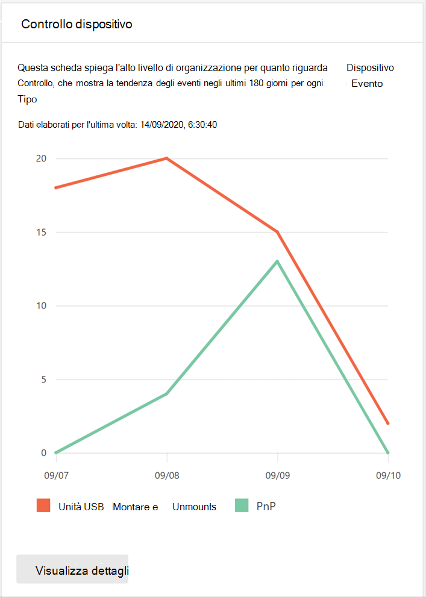
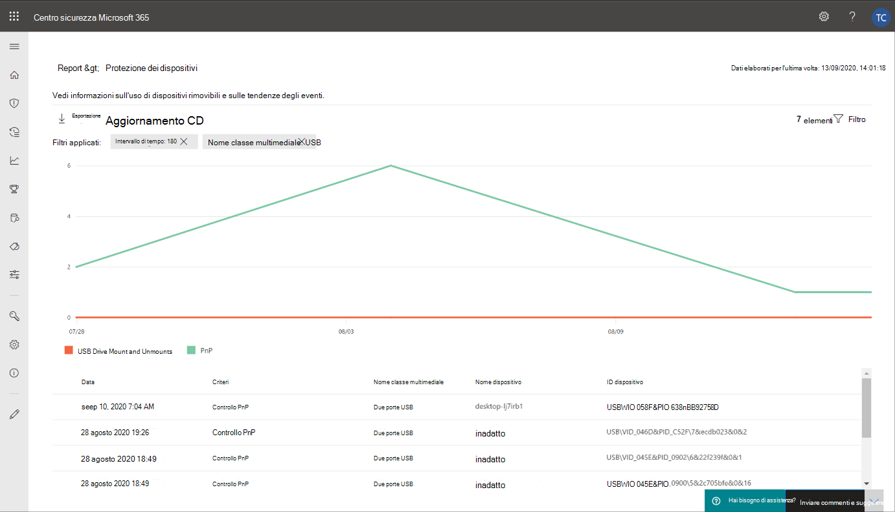
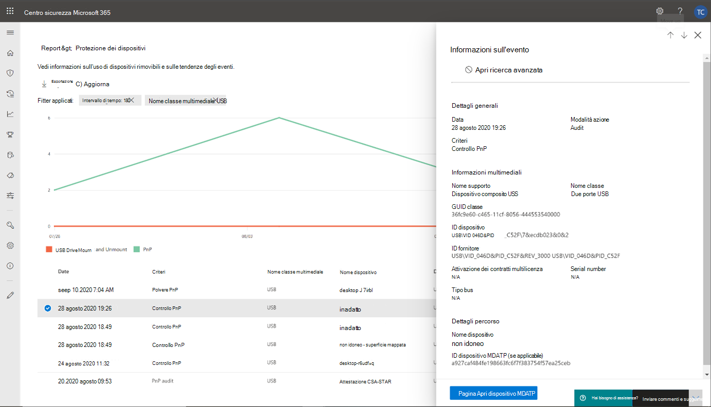
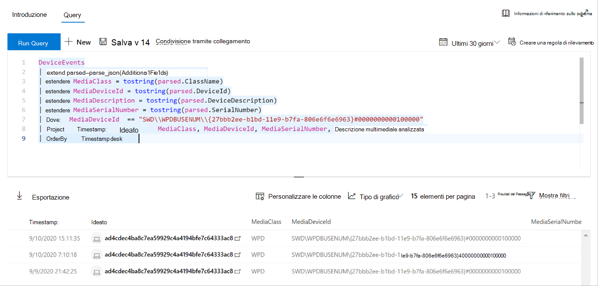
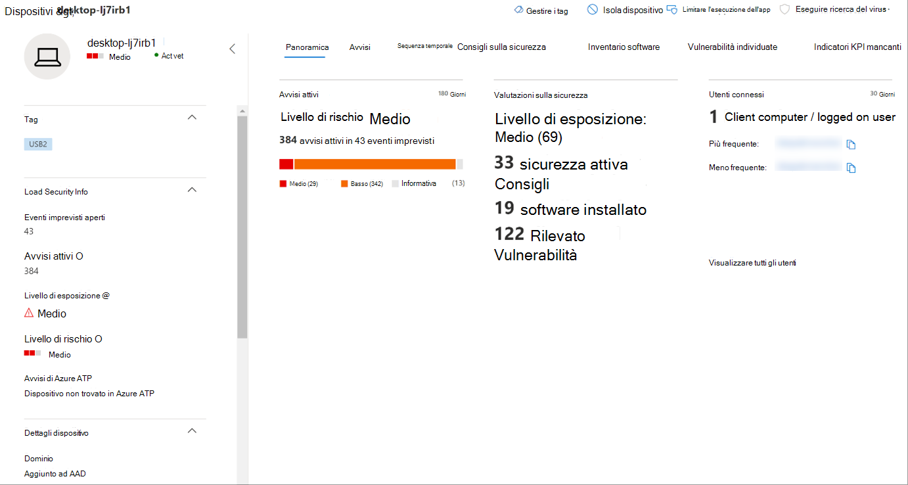

# Proteggere i dati dell'organizzazione con il controllo del dispositivoProtect your organization’s data with device control

**Si applica a:** [Microsoft Defender for Endpoint](https://go.microsoft.com/fwlink/p/?linkid=2069559)**Applies to:** [Microsoft Defender for Endpoint](https://go.microsoft.com/fwlink/p/?linkid=2069559)

Il controllo dei dispositivi Microsoft Defender for Endpoint protegge dalla perdita di dati, monitorando e controllando l'uso dei supporti da parte dei dispositivi dell'organizzazione, ad esempio l'uso di dispositivi di archiviazione rimovibili e unità USB.Microsoft Defender for Endpoint device control protects against data loss, by monitoring and controlling media use by devices in your organization, such as the use of removable storage devices and USB drives.

Con il report di controllo del dispositivo puoi visualizzare gli eventi correlati all'utilizzo dei supporti, ad esempio:With the device control report, you can view events that relate to media usage, such as:

- **Eventi di controllo:** Indica il numero di eventi di controllo che si verificano quando è connesso un supporto esterno.**Audit events:** Shows the number of audit events that occur when external media is connected.
- **Eventi dei criteri:** Mostra il numero di eventi dei criteri che si verificano quando viene attivato un criterio di controllo del dispositivo.**Policy events:** Shows the number of policy events that occur when a device control policy is triggered.

> [!NOTE]
> L'evento di controllo per tenere traccia dell'utilizzo dei contenuti multimediali è abilitato per impostazione predefinita per i dispositivi onboarded in Microsoft Defender per Endpoint.The audit event to track media usage is enabled by default for devices onboarded to Microsoft Defender for Endpoint.

## Informazioni sugli eventi di controlloUnderstanding the audit events

Gli eventi di controllo includono:The audit events include:

- **Montaggio e smontare unità USB:** Eventi di controllo generati quando un'unità USB viene montata o disinstallata.**USB drive mount and unmount:** Audit events that are generated when a USB drive is mounted or unmounted.
- **PnP:** Gli eventi di controllo Plug and Play vengono generati quando viene connessa un'archiviazione rimovibile, una stampante o Bluetooth supporto.**PnP:** Plug and Play audit events are generated when removable storage, a printer, or Bluetooth media is connected.

## Monitorare la sicurezza del controllo dei dispositiviMonitor device control security

Il controllo dei dispositivi in Microsoft Defender for Endpoint offre agli amministratori della sicurezza strumenti che consentono loro di tenere traccia della sicurezza del controllo dei dispositivi dell'organizzazione tramite i report.Device control in Microsoft Defender for Endpoint empowers security administrators with tools that enable them to track their organization’s device control security through reports. Puoi trovare il report di controllo del dispositivo nel centro sicurezza Microsoft 365 sicurezza andando a **Report > Protezione del dispositivo**.You can find the device control report in the Microsoft 365 security center by going to **Reports > Device protection**.

La scheda Protezione dispositivo nel dashboard **Report** mostra il numero di eventi di controllo generati dal tipo di supporto negli ultimi 180 giorni.The Device protection card on the **Reports** dashboard shows the number of audit events generated by media type, over the last 180 days.

> [!div class="mx-imgBorder"]
> 

Il **pulsante Visualizza dettagli** mostra più dati di utilizzo multimediale nella pagina del report del controllo **dispositivo.**The **View details** button shows more media usage data in the **device control report** page.

La pagina fornisce un dashboard con un numero aggregato di eventi per tipo e un elenco di eventi.The page provides a dashboard with aggregated number of events per type and a list of events. Gli amministratori possono filtrare l'intervallo di tempo, il nome della classe multimediale e l'ID dispositivo.Administrators can filter on time range, media class name, and device ID.

> [!div class="mx-imgBorder"]
> 

Quando si seleziona un evento, viene visualizzato un riquadro a comparsa che mostra ulteriori informazioni:When you select an event, a flyout appears that shows you more information:

- **Dettagli generali:** Data, modalità azione e i criteri di questo evento.**General details:** Date, Action mode, and the policy of this event.
- **Informazioni multimediali:** Le informazioni multimediali includono Nome supporto, Nome classe, GUID classe, ID dispositivo, ID fornitore, Volume, Numero di serie e Tipo di bus.**Media information:** Media information includes Media name, Class name, Class GUID, Device ID, Vendor ID, Volume, Serial number, and Bus type.
- **Dettagli percorso:** Nome del dispositivo e MDATP dispositivo.**Location details:** Device name and MDATP device ID.

> [!div class="mx-imgBorder"]
> 

Per visualizzare le attività in tempo reale per questi elementi multimediali nell'organizzazione, selezionare il **pulsante Apri ricerca** avanzata.To see real-time activity for this media across the organization, select the **Open Advanced hunting** button. Include una query incorporata predefinita.This includes an embedded, pre-defined query.

> [!div class="mx-imgBorder"]
> 

Per visualizzare la sicurezza del dispositivo, seleziona il **pulsante Apri** pagina dispositivo nel riquadro a comparsa.To see the security of the device, select the **Open device page** button on the flyout. Questo pulsante apre la pagina dell'entità dispositivo.This button opens the device entity page.

> [!div class="mx-imgBorder"]
> 

## Segnalazione di ritardiReporting delays

Il report di controllo del dispositivo può avere un ritardo di 12 ore dal momento in cui si verifica una connessione multimediale al momento in cui l'evento si riflette nella scheda o nell'elenco dei domini.The device control report can have a 12-hour delay from the time a media connection occurs to the time the event is reflected in the card or in the domain list.
