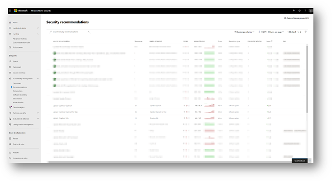

# <a name="device-discovery-overview"></a>Panoramica di Device discovery

[!INCLUDE [Microsoft 365 Defender rebranding](../../includes/microsoft-defender.md)]

**Si applica a:**
- [Microsoft Defender per endpoint](https://go.microsoft.com/fwlink/p/?linkid=2146631)
- [Microsoft 365 Defender](https://go.microsoft.com/fwlink/?linkid=2118804)


La protezione dell'ambiente richiede l'inventario dei dispositivi presenti nella rete. Tuttavia, il mapping dei dispositivi in una rete può spesso essere costoso, impegnativo e dispendioso in termini di tempo. 

Microsoft Defender for Endpoint offre una funzionalità di individuazione dei dispositivi che consente di trovare dispositivi non gestiti connessi alla rete aziendale senza la necessità di dispositivi aggiuntivi o modifiche di processo ingombranti.


La funzionalità di individuazione dei dispositivi consente di:

- **Individuare gli endpoint aziendali connessi alla rete aziendale** <br>
Usando le opzioni di individuazione di base o standard, puoi individuare workstation, server ed endpoint mobili non ancora onboarded in Microsoft Defender for Endpoint.  

- **Onboard degli endpoint individuati**<br>
Gli endpoint non gestiti nella rete introducono vulnerabilità e rischi per la rete. L'onboarding al servizio può aumentare la visibilità della sicurezza su di essi. 

In combinazione con questa funzionalità, una nuova raccomandazione di sicurezza per l'onboard di dispositivi a Microsoft Defender for Endpoint sarà disponibile nell'ambito dell'esperienza di gestione delle minacce e delle vulnerabilità esistente.


## <a name="discovery-methods"></a>Metodi di individuazione
Esistono due modalità di individuazione: 

-   Individuazione di base 
-   Individuazione standard (scelta consigliata) 


> [!IMPORTANT]
> L'individuazione è impostata sulla modalità di base. Puoi scegliere di mantenere questa configurazione tramite la pagina delle impostazioni. L'individuazione standard sarà la modalità predefinita per tutti i clienti a partire dal 19 luglio 2021, a meno che non venga modificata tramite la pagina delle impostazioni prima di questa data.

### <a name="basic-discovery"></a>Individuazione di base 

In questa modalità, gli endpoint raccoglieranno passivamente gli eventi nella rete ed estrarranno le informazioni sul dispositivo da essi. L'individuazione di base usa SenseNDR.exe binario per la raccolta passiva dei dati di rete e non verrà avviato alcun traffico di rete. Gli endpoint estraggono semplicemente i dati da ogni traffico di rete visualizzato da un dispositivo onboarded. 

### <a name="standard-discovery"></a>Individuazione standard 

Questa modalità consente agli endpoint di sondare attivamente i dispositivi osservati nella rete per arricchire i dati raccolti, consentendoti di creare un inventario dei dispositivi affidabile e coerente. La modalità standard usa il probe intelligente e attivo per individuare ulteriori informazioni sui dispositivi osservati per arricchire le informazioni esistenti sul dispositivo.  

Quando è abilitata la modalità Standard, le attività di rete minime e trascurabili generate dal sensore di individuazione potrebbero essere osservate dagli strumenti di monitoraggio della rete nell'organizzazione.  

 Se scegli di non abilitare questa modalità, ottieni solo una visibilità limitata degli endpoint non gestiti nella rete.

L'individuazione standard usa vari script di PowerShell per sondare attivamente i dispositivi nella rete. Tali script di PowerShell sono firmati da Microsoft e vengono eseguiti dal percorso seguente: `C:\ProgramData\Microsoft\Windows Defender Advanced Threat Protection\Downloads\*.ps` . Ad esempio, `C:\ProgramData\Microsoft\Windows Defender Advanced Threat Protection\Downloads\UnicastScannerV1.1.0.ps1`.

È possibile modificare e personalizzare le impostazioni di individuazione, per ulteriori informazioni, vedere [Configure device discovery.](configure-device-discovery.md)

> [!NOTE]
> Il motore di individuazione distingue tra gli eventi di rete ricevuti nella rete aziendale e l'esterno della rete aziendale. I dispositivi non connessi a reti aziendali non verranno individuati o elencati nell'inventario dei dispositivi. 


## <a name="device-inventory"></a>Inventario dei dispositivi 
I dispositivi individuati ma non ancora stati onboarded e protetti da Microsoft Defender for Endpoint saranno elencati in Inventario dispositivi all'interno della scheda Endpoint. Ora puoi usare un nuovo filtro nell'elenco dell'inventario dei dispositivi denominato Stato onboarding che può avere uno dei valori seguenti:

- Onboarded: l'endpoint viene onboarded in Microsoft Defender for Endpoint.
- Può essere onboarded: l'endpoint è stato individuato nella rete e il sistema operativo è stato identificato come supportato da Microsoft Defender per Endpoint, ma non è attualmente onboarded. Ti consigliamo vivamente di eseguire l'onboarding di questi dispositivi.
- Non supportato: l'endpoint è stato individuato nella rete ma non è supportato da Microsoft Defender per Endpoint.
- Informazioni insufficienti: il sistema non è stato in grado di determinare la supportabilità del dispositivo. L'abilitazione dell'individuazione standard in più dispositivi nella rete può arricchire gli attributi individuati. 
 


> [!TIP]
> Puoi sempre applicare filtri per escludere i dispositivi non gestiti dall'elenco di inventario dei dispositivi. Puoi anche usare la colonna dello stato di onboarding nelle query API per filtrare i dispositivi non gestiti. 

## <a name="vulnerability-assessment-on-discovered-devices"></a>Valutazione della vulnerabilità nei dispositivi individuati
Le vulnerabilità e i rischi nei dispositivi e in altri dispositivi non gestiti individuati nella rete fanno parte dei flussi TVM correnti in "Security Consigli" e sono rappresentati nelle pagine delle entità nel portale. Cercare suggerimenti sulla sicurezza correlati a "SSH" per individuare le vulnerabilità SSH correlate ai dispositivi gestiti e non gestiti. 

  

## <a name="use-advanced-hunting-on-discovered-devices"></a>Usare Ricerca avanzata nei dispositivi individuati
Puoi usare query di ricerca avanzata per ottenere visibilità sui dispositivi individuati.
Trova i dettagli sugli endpoint individuati nella tabella DeviceInfo o informazioni correlate alla rete su tali dispositivi nella tabella DeviceNetworkInfo.
  


L'individuazione dei dispositivi sfrutta i dispositivi onboarded di Microsoft Defender for Endpoint come origine dati di rete per attribuite le attività ai dispositivi non onboarded. Ciò significa che se un dispositivo onboarded di Microsoft Defender per Endpoint comunica con un dispositivo non onboarded, le attività sul dispositivo non onboarded possono essere visualizzate nella sequenza temporale e tramite la tabella Advanced hunting DeviceNetworkEvents. 


I nuovi eventi sono basati sulle connessioni TCP (Transmission Control Protocol) e si adattano alla combinazione DeviceNetworkEvents corrente. Ingresso TCP verso il dispositivo abilitato per Microsoft Defender per Endpoint da un dispositivo non Abilitato per Microsoft Defender for Endpoint.  

Sono stati aggiunti anche i seguenti tipi di azione:  

- ConnectionAttempt - Tentativo di stabilire una connessione TCP (syn)  
- ConnectionAcknowledged - Conferma dell'accettazione di una connessione TCP (syn\ack)  

È possibile provare questa query di esempio:  

```
DeviceNetworkEvents  
| where ActionType == "ConnectionAcknowledged" or ActionType == "ConnectionAttempt"  
| take 10  
```


## <a name="changed-behavior"></a>Comportamento modificato
La sezione seguente elenca le modifiche che osserverai in Microsoft Defender for Endpoint e/o Microsoft 365 Security Center quando questa funzionalità è abilitata. 
 
1.  I dispositivi non onboarded in Microsoft Defender to Endpoint dovrebbero essere visualizzati nell'inventario dei dispositivi, nella ricerca avanzata e nelle query API. Ciò può aumentare in modo significativo le dimensioni dei risultati delle query. 
    1. Le tabelle "DeviceInfo" e "DeviceNetworkInfo" in Ricerca avanzata ora conteneranno il dispositivo individuato. Puoi filtrare tali dispositivi usando l'attributo "OnboardingStatus".

    2. Si prevede che i dispositivi individuati vengano visualizzati nei risultati delle query dell'API di streaming. È possibile filtrare tali dispositivi utilizzando il `OnboardingStatus` filtro nella query. 

2.  I dispositivi non gestiti verranno assegnati ai gruppi di dispositivi esistenti in base ai criteri definiti. 
3.  In rari casi, l'individuazione standard potrebbe attivare avvisi su monitor di rete o strumenti di sicurezza. Inviare commenti e suggerimenti, se si verificano eventi di questo tipo, per evitare che questi problemi si verifichino. È possibile escludere in modo esplicito destinazioni specifiche o intere subnet dal sondaggio attivo tramite l'individuazione standard. 


## <a name="next-steps"></a>Passaggi successivi
- [Configurare device discovery](configure-device-discovery.md)
- [Domande frequenti su Individuazione dispositivi](device-discovery-faq.md)
