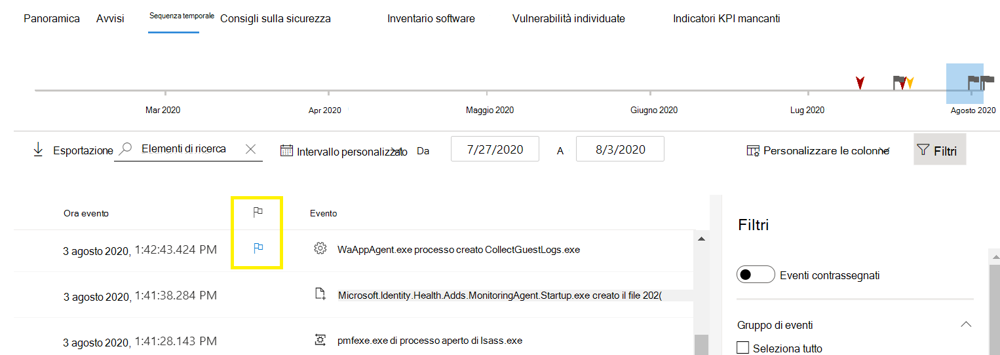
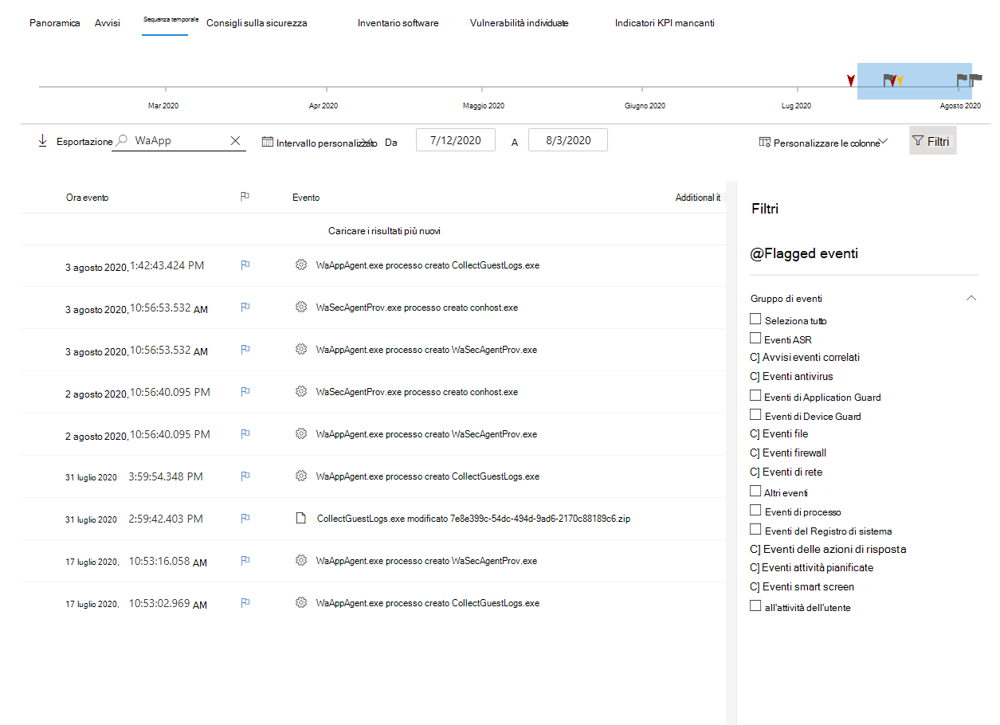

# Flag di evento della sequenza temporale del dispositivo Microsoft Defender for EndpointMicrosoft Defender for Endpoint device timeline event flags

[!INCLUDE [Microsoft 365 Defender rebranding](../../includes/microsoft-defender.md)]

**Si applica a:****Applies to:**
- [Microsoft Defender ATPMicrosoft Defender for Endpoint](https://go.microsoft.com/fwlink/p/?linkid=2154037)
- [Microsoft 365 DefenderMicrosoft 365 Defender](https://go.microsoft.com/fwlink/?linkid=2118804)

>Vuoi provare Defender per Endpoint?Want to experience Defender for Endpoint? [Iscriversi per una versione di valutazione gratuita.Sign up for a free trial.](https://www.microsoft.com/microsoft-365/windows/microsoft-defender-atp?ocid=docs-wdatp-assignaccess-abovefoldlink)

I flag di evento nella sequenza temporale del dispositivo Defender for Endpoint ti aiutano a filtrare e organizzare eventi specifici quando stai analizzando potenziali attacchi.Event flags in the Defender for Endpoint device timeline help you filter and organize specific events when you're  investigate potential attacks.

La sequenza temporale del dispositivo Defender for Endpoint fornisce una visualizzazione cronologica degli eventi e degli avvisi associati osservati in un dispositivo.The Defender for Endpoint device timeline provides a chronological view of the events and associated alerts observed on a device. Questo elenco di eventi offre visibilità completa su eventi, file e indirizzi IP osservati nel dispositivo.This list of events provides full visibility into any events, files, and IP addresses observed on the device. L'elenco può talvolta essere lungo.The list can sometimes be lengthy. I flag degli eventi della sequenza temporale del dispositivo consentono di tenere traccia degli eventi che potrebbero essere correlati.Device timeline event flags help you track events that could be related. 

Dopo aver attraversato una sequenza temporale del dispositivo, puoi ordinare, filtrare ed esportare gli eventi specifici contrassegnati.After you've gone through a device timeline, you can sort, filter, and export the specific events that you flagged.

Durante l'esplorazione della sequenza temporale del dispositivo, puoi cercare e filtrare eventi specifici.While navigating the device timeline, you can search and filter for specific events. Puoi impostare i flag di evento:You can set event flags by: 

- Evidenziazione degli eventi più importantiHighlighting the most important events 
- Contrassegno di eventi che richiedono un'immersione approfonditaMarking events that requires deep dive 
- Creazione di una sequenza temporale di violazione pulitaBuilding a clean breach timeline

## Contrassegnare un eventoFlag an event
1. Trovare l'evento che si desidera contrassegnareFind the event that you want to flag
2. Fare clic sull'icona del contrassegno nella colonna Contrassegno.Click the flag icon in the Flag column. 

## Visualizzare gli eventi contrassegnatiView flagged events  
1. Nella sezione Filtri **sequenza temporale** abilita **Eventi contrassegnati.**In the timeline **Filters** section, enable **Flagged events**.
2. Fare clic su **Applica**.Click **Apply**. Vengono visualizzati solo gli eventi contrassegnati.Only flagged events are displayed.
È possibile applicare filtri aggiuntivi facendo clic sulla barra del tempo.You can apply additional filters by clicking on the time bar. Verranno visualizzati solo gli eventi prima dell'evento contrassegnato.This will only show events prior to the flagged event.  

