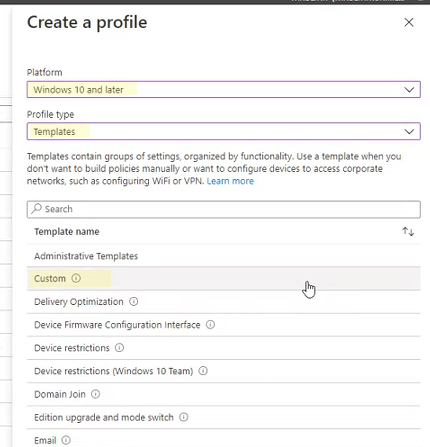

# <a name="enable-attack-surface-reduction-rules"></a>Abilitare regole per la riduzione della superficie di attacco

[!INCLUDE [Microsoft 365 Defender rebranding](../../includes/microsoft-defender.md)]

**Si applica a:**

- [Microsoft Defender per endpoint](https://go.microsoft.com/fwlink/p/?linkid=2154037)
- [Microsoft 365 Defender](https://go.microsoft.com/fwlink/?linkid=2118804)

> [!TIP]
> Vuoi provare Defender per Endpoint? [Iscriversi per una versione di valutazione gratuita.](https://www.microsoft.com/microsoft-365/windows/microsoft-defender-atp?ocid=docs-wdatp-assignaccess-abovefoldlink)

[Le regole di riduzione della superficie](attack-surface-reduction.md) di attacco (regole ASR) consentono di impedire azioni che il malware spesso abuso per compromettere dispositivi e reti.

**Requisiti** Puoi impostare regole di riduzione della superficie di attacco per i dispositivi che eseguono una delle seguenti edizioni e versioni di Windows:

- Windows 10 Pro, [versione 1709](/windows/whats-new/whats-new-windows-10-version-1709) o successiva
- Windows 10 Enterprise, [versione 1709](/windows/whats-new/whats-new-windows-10-version-1709) o successiva
- Windows Server, [versione 1803 (Canale semestraale)](/windows-server/get-started/whats-new-in-windows-server-1803) o versione successiva
- [Windows Server 2019](/windows-server/get-started-19/whats-new-19)

Anche se le regole di riduzione della superficie di attacco non richiedono una licenza di [Windows E5,](/windows/deployment/deploy-enterprise-licenses)se si dispone di Windows E5, si ottengono funzionalità di gestione avanzate. Queste funzionalità disponibili solo in Windows E5 includono monitoraggio, analisi e flussi di lavoro disponibili in [Defender for Endpoint,](/microsoft-365/security/defender-endpoint/microsoft-defender-endpoint?view=o365-worldwide&preserve-view=true)nonché funzionalità di creazione di report e configurazione nel Centro sicurezza [Microsoft 365.](/microsoft-365/security/defender/overview-security-center?view=o365-worldwide&preserve-view=true) Queste funzionalità avanzate non sono disponibili con una licenza di Windows Professional o Windows E3. Tuttavia, se hai queste licenze, puoi usare il Visualizzatore eventi e i registri di Microsoft Defender Antivirus per esaminare gli eventi delle regole di riduzione della superficie di attacco.

Ogni regola asr contiene una delle quattro impostazioni seguenti:

- **Non configurato**: disabilita la regola asr
- **Block**: Enable the ASR rule
- **Controllo**: valutare l'impatto della regola asr sull'organizzazione se abilitata
- **Avviso:** abilitare la regola asr ma consentire all'utente finale di ignorare il blocco

> [!IMPORTANT]
> Attualmente, la modalità avviso non è supportata per tre regole asr quando si configurano le regole asr in Microsoft Endpoint Manager (MEM). Per altre informazioni, vedi [Casi in cui la modalità avviso non è supportata.](attack-surface-reduction.md#cases-where-warn-mode-is-not-supported)

È consigliabile usare le regole asr con una licenza di Windows E5 (o una SKU di licenza simile) per sfruttare le funzionalità avanzate di monitoraggio e creazione di report disponibili in [Microsoft Defender for Endpoint](https://docs.microsoft.com/windows/security/threat-protection) (Defender for Endpoint). Tuttavia, per altre licenze come Windows Professional o E3 che non hanno accesso alle funzionalità avanzate di monitoraggio e creazione di report, è possibile sviluppare strumenti di monitoraggio e creazione di report personalizzati oltre agli eventi generati in ogni endpoint quando vengono attivate le regole di registrazione asr (ad esempio, Inoltro eventi).

> [!TIP]
> Per altre informazioni sulle licenze di Windows, vedi [Licenze di Windows 10](https://www.microsoft.com/licensing/product-licensing/windows10?activetab=windows10-pivot:primaryr5) e ottieni la guida per i [contratti multilicenza per Windows 10.](https://download.microsoft.com/download/2/D/1/2D14FE17-66C2-4D4C-AF73-E122930B60F6/Windows-10-Volume-Licensing-Guide.pdf)

Puoi abilitare le regole di riduzione della superficie di attacco usando uno dei metodi seguenti:

- [Microsoft Intune](#intune)
- [Gestione di dispositivi mobili (MDM)](#mdm)
- [Microsoft Endpoint Configuration Manager](#microsoft-endpoint-configuration-manager)
- [Criteri di gruppo](#group-policy)
- [PowerShell](#powershell)

È consigliabile gestire a livello aziendale, ad esempio Intune o Microsoft Endpoint Manager. La gestione a livello aziendale sovrascriverà tutte le impostazioni di Criteri di gruppo o PowerShell in conflitto all'avvio.

## <a name="exclude-files-and-folders-from-asr-rules"></a>Escludere file e cartelle dalle regole asr

È possibile escludere file e cartelle dalla maggior parte delle regole di riduzione della superficie di attacco. Ciò significa che, anche se una regola asr determina che il file o la cartella contiene comportamenti dannosi, non blocchi l'esecuzione del file. Ciò potrebbe potenzialmente consentire l'esecuzione di file non sicuri e infettare i dispositivi.

Puoi anche escludere le regole asr dall'attivazione in base agli hash di certificati e file consentendo a Defender per gli indicatori di certificato e file dell'endpoint specificati. (Vedere [Gestire gli indicatori](https://docs.microsoft.com/microsoft-365/security/defender-endpoint/manage-indicators).)

> [!IMPORTANT]
> L'esclusione di file o cartelle può ridurre notevolmente la protezione fornita dalle regole asr. L'esecuzione dei file esclusi sarà consentita e non verrà registrato alcun report o evento.
> Se le regole di ripristino automatico rilevano file che ritieni non debbano essere rilevati, devi prima usare la modalità di controllo per [testare la regola.](evaluate-attack-surface-reduction.md)

È possibile specificare singoli file o cartelle (utilizzando percorsi di cartelle o nomi di risorse completi), ma non è possibile specificare le regole a cui si applicano le esclusioni. Un'esclusione viene applicata solo all'avvio dell'applicazione o del servizio escluso. Ad esempio, se si aggiunge un'esclusione per un servizio di aggiornamento già in esecuzione, il servizio di aggiornamento continuerà a attivare eventi finché il servizio non viene arrestato e riavviato.

Le regole asr supportano variabili di ambiente e caratteri jolly. Per informazioni sull'utilizzo dei caratteri jolly, vedere [Use wildcards in the file name and folder path or extension exclusion lists](https://docs.microsoft.com/windows/security/threat-protection/microsoft-defender-antivirus/configure-extension-file-exclusions-microsoft-defender-antivirus#use-wildcards-in-the-file-name-and-folder-path-or-extension-exclusion-lists).

Le procedure seguenti per l'abilitazione delle regole asr includono istruzioni su come escludere file e cartelle.

## <a name="intune"></a>Intune

1. Selezionare **Profili di configurazione** del  >  **dispositivo**. Scegliere un profilo di endpoint protection esistente o crearne uno nuovo. Per crearne uno nuovo, selezionare **Crea profilo** e immettere le informazioni per il profilo. Per **Tipo di profilo** selezionare Endpoint **protection.** Se è stato scelto un profilo esistente, selezionare **Proprietà** e quindi **Impostazioni.**

2. Nel riquadro **Endpoint protection** seleziona Windows Defender **Exploit Guard** e quindi seleziona Riduzione della superficie **di attacco.** Selezionare l'impostazione desiderata per ogni regola asr.

3. In **Eccezioni di riduzione della superficie di attacco** immetti singoli file e cartelle. È inoltre possibile selezionare **Importa per** importare un file CSV contenente file e cartelle da escludere dalle regole asr. Ogni riga del file CSV deve essere formattata come segue:

   `C:\folder`, `%ProgramFiles%\folder\file`, `C:\path`

4. Selezionare **OK** nei tre riquadri di configurazione. Seleziona Quindi **Crea** se stai creando un nuovo file di endpoint protection o **Salva** se ne stai modificando uno esistente.

## <a name="mdm"></a>MDM

Usa il provider di servizi di configurazione [./Vendor/MSFT/Policy/Config/Defender/AttackSurfaceReductionRules](https://docs.microsoft.com/windows/client-management/mdm/policy-csp-defender#defender-attacksurfacereductionrules) per abilitare e impostare singolarmente la modalità per ogni regola.

Di seguito è riportato un esempio di riferimento, utilizzando [i valori GUID per le regole asr.](attack-surface-reduction.md#attack-surface-reduction-rules)

`OMA-URI path: ./Vendor/MSFT/Policy/Config/Defender/AttackSurfaceReductionRules`

`Value: 75668C1F-73B5-4CF0-BB93-3ECF5CB7CC84=2|3B576869-A4EC-4529-8536-B80A7769E899=1|D4F940AB-401B-4EfC-AADC-AD5F3C50688A=2|D3E037E1-3EB8-44C8-A917-57927947596D=1|5BEB7EFE-FD9A-4556-801D-275E5FFC04CC=0|BE9BA2D9-53EA-4CDC-84E5-9B1EEEE46550=1`

I valori da abilitare (blocca), disabilitare, avvisare o abilitare in modalità di controllo sono:

- 0 : Disable (Disable the ASR rule)
- 1 : Blocca (abilita la regola asr)
- 2 : Controllo (valutare l'impatto della regola asr sull'organizzazione se abilitata)
- 6 : avvisa (abilita la regola asr ma consenti all'utente finale di ignorare il blocco). La modalità avviso è ora disponibile per la maggior parte delle regole asr.

Usa il provider di servizi di configurazione [./Vendor/MSFT/Policy/Config/Defender/AttackSurfaceReductionOnlyExclusions](https://docs.microsoft.com/windows/client-management/mdm/policy-csp-defender#defender-attacksurfacereductiononlyexclusions) per aggiungere esclusioni.

Esempio:

`OMA-URI path: ./Vendor/MSFT/Policy/Config/Defender/AttackSurfaceReductionOnlyExclusions`

`Value: c:\path|e:\path|c:\Exclusions.exe`

> [!NOTE]
> Assicurati di immettere valori URI OMA senza spazi.

## <a name="microsoft-endpoint-configuration-manager"></a>Microsoft Endpoint Configuration Manager

1. In Microsoft Endpoint Configuration Manager, vai a **Assets and Compliance**  >  **Endpoint Protection**  >  **Windows Defender Exploit Guard**.

2. Selezionare **Home**  >  **Create Exploit Guard Policy**.

3. Immetti un nome e una descrizione, seleziona **Riduzione superficie di attacco** e seleziona **Avanti.**

4. Scegliere le regole che verranno bloccate o le azioni di controllo e selezionare **Avanti.**

5. Rivedere le impostazioni e selezionare **Avanti** per creare il criterio.

6. Dopo la creazione del criterio, **chiudere**.

## <a name="group-policy"></a>Criteri di gruppo

> [!WARNING]
> Se gestisci i computer e i dispositivi con Intune, Configuration Manager o un'altra piattaforma di gestione a livello aziendale, il software di gestione sovrascriverà tutte le impostazioni di Criteri di gruppo in conflitto all'avvio.

1. Nel computer di gestione dei Criteri di gruppo aprire la [Console Gestione Criteri di gruppo](https://technet.microsoft.com/library/cc731212.aspx), fare clic con il pulsante destro del mouse sull'oggetto Criteri di gruppo da configurare e scegliere **Modifica**.

2. Nell **'Editor Gestione Criteri di gruppo** passare a **Configurazione computer** e selezionare **Modelli amministrativi**.

3. Espandi l'albero fino ai **componenti di Windows** Microsoft Defender  >  **Antivirus** Microsoft Defender Exploit Guard Riduzione della  >  **superficie**  >  **di attacco.**

4. Selezionare **Configura regole di riduzione della superficie di attacco** e selezionare **Abilitato.** È quindi possibile impostare il singolo stato per ogni regola nella sezione opzioni.

   Selezionare **Mostra...** e immettere l'ID regola nella colonna **Nome valore** e lo stato scelto nella colonna **Valore** come indicato di seguito:

   - 0 : Disable (Disable the ASR rule)
   - 1 : Blocca (abilita la regola asr)
   - 2 : Controllo (valutare l'impatto della regola asr sull'organizzazione se abilitata)
   - 6 : Avvisa (abilita la regola di registrazione asr ma consenti all'utente finale di ignorare il blocco)

   :::image type="content" source="images/asr-rules-gp.png" alt-text="Regole asr in Criteri di gruppo":::

5. Per escludere file e cartelle dalle  regole asr, selezionare l'impostazione Escludi file e percorsi dalle regole di riduzione della superficie di attacco e impostare l'opzione su **Abilitato.** Selezionare **Mostra** e immettere ogni file o cartella nella **colonna Nome** valore. Immettere **0** nella **colonna Valore** per ogni elemento.

   > [!WARNING]
   > Non utilizzare le virgolette perché non sono supportate per la colonna **Nome valore** o **Valore.**

## <a name="microsoft-endpoint-manager-custom-procedure"></a>Procedura personalizzata di Microsoft Endpoint Manager

Puoi usare un'interfaccia di amministrazione di Microsoft Endpoint Manager (MEM) per configurare regole asr personalizzate.

1. Aprire l'interfaccia di amministrazione di Microsoft Endpoint Manager (MEM). Nel menu **Home** fare clic su **Dispositivi,** selezionare **Profilo di configurazione** e quindi fare clic su Crea **profilo.**

   

2. In **Crea profilo** selezionare quanto segue nei due elenchi a discesa seguenti:

   - In **Piattaforma** seleziona **Windows 10 e versioni successive**
   - In **Tipo di profilo** selezionare **Modelli**

   Selezionare **Personalizzato** e quindi fare clic su **Crea.**

   

3. Lo strumento Modello personalizzato viene aperto al **passaggio 1 Nozioni di base.** In **1 Nozioni di** base, in **Nome** digitare un nome per il modello e **in** Descrizione è possibile digitare una descrizione facoltativa.

   

4. Fare clic su **Avanti**. Step **2 Configuration settings opens.** Per Impostazioni URI OMA, fare clic su **Aggiungi.** Vengono ora visualizzate due opzioni: **Aggiungi** ed **Esporta**.

   

5. Fare **di nuovo clic su** Aggiungi. Verrà **visualizzata la finestra di dialogo Aggiungi impostazioni URI OMA** riga. In **Aggiungi riga** eseguire le operazioni seguenti:

   - In **Nome** digitare un nome per la regola.
   - In **Descrizione** digitare una breve descrizione.
   - In **URI OMA** digitare o incollare il collegamento URI OMA specifico per la regola che si sta aggiungendo.
   - In **Tipo di dati** selezionare **String**.
   - In **Valore** digitare o incollare il valore GUID, il segno e il valore State senza spazi \= (_GUID=StateValue_). Dove: {0 : Disable (Disable the ASR rule)}, {1 : Block (Enable the ASR rule)}, {2 : Audit (Evaluate how the ASR rule would impact your organization if enabled)}, {6 : Warn (Enable the ASR rule but allow the end-user to bypass the block)}

   

6. Fare clic su **Salva**. **Add Row** closes. In **Personalizzato** fare clic su **Avanti.** Nel passaggio **3 Tag ambito** i tag di ambito sono facoltativi. Eseguire una delle operazioni seguenti:

   - Fare **clic su Seleziona tag ambito,** selezionare il tag di ambito (facoltativo) e quindi fare clic su **Avanti.**
   - Oppure fare clic su **Avanti**

7. Nel passaggio **4 Assegnazioni,** **in** Gruppi inclusi per i gruppi a cui si desidera applicare la regola, selezionare una delle opzioni seguenti:

   - **Aggiungere gruppi**
   - **Aggiungere tutti gli utenti**
   - **Aggiungere tutti i dispositivi**

   

8. In **Gruppi esclusi** selezionare i gruppi che si desidera escludere dalla regola e quindi fare clic su **Avanti.**

9. Nel passaggio **5 Regole di applicabilità** per le impostazioni seguenti eseguire le operazioni seguenti:

   - In **Regola** selezionare Assegna **profilo se** o Non **assegnare profilo se**
   - In **Proprietà** selezionare la proprietà a cui si desidera applicare la regola
   - In **Valore** immettere il valore applicabile o l'intervallo di valori

   

10. Fare clic su **Avanti**. Nel passaggio **6 Rivedere e creare** esaminare le impostazioni e le informazioni selezionate e immesse e quindi fare clic su **Crea.**

   

>[!NOTE]
> Le regole sono attive e attive in pochi minuti.

>[!NOTE]
> Gestione dei conflitti: se assegni a un dispositivo due diversi criteri asr, il modo in cui viene gestito il conflitto sono le regole a cui vengono assegnati stati diversi, non esiste una gestione dei conflitti in atto e il risultato è un errore.
> Le regole non in conflitto non restituiranno un errore e la regola verrà applicata correttamente. Ne risulta che viene applicata la prima regola e le regole successive non in conflitto vengono unite nel criterio.

## <a name="powershell"></a>PowerShell

> [!WARNING]
> Se gestisci i computer e i dispositivi con Intune, Configuration Manager o un'altra piattaforma di gestione a livello aziendale, il software di gestione sovrascriverà tutte le impostazioni di PowerShell in conflitto all'avvio. Per consentire agli utenti di definire il valore tramite PowerShell, utilizzare l'opzione "Definito dall'utente" per la regola nella piattaforma di gestione.

1. Digita **powershell** nel menu Start, fai clic con il pulsante destro **del** mouse Windows PowerShell e scegli Esegui **come amministratore.**

2. Digitare il cmdlet seguente:

    ```PowerShell
    Set-MpPreference -AttackSurfaceReductionRules_Ids <rule ID> -AttackSurfaceReductionRules_Actions Enabled
    ```

    Per abilitare le regole di registrazione asr in modalità di controllo, utilizzare il cmdlet seguente:

    ```PowerShell
    Add-MpPreference -AttackSurfaceReductionRules_Ids <rule ID> -AttackSurfaceReductionRules_Actions AuditMode
    ```

    Per abilitare le regole di Registrazione asr in modalità avviso, utilizzare il cmdlet seguente:

    ```PowerShell
    Add-MpPreference -AttackSurfaceReductionRules_Ids <rule ID> -AttackSurfaceReductionRules_Actions Warn
    ```

    Per disattivare le regole asr, utilizzare il cmdlet seguente:

    ```PowerShell
    Add-MpPreference -AttackSurfaceReductionRules_Ids <rule ID> -AttackSurfaceReductionRules_Actions Disabled
    ```

    > [!IMPORTANT]
    > È necessario specificare lo stato singolarmente per ogni regola, ma è possibile combinare regole e stati in un elenco delimitato da virgole.
    >
    > Nell'esempio seguente verranno abilitate le prime due regole, la terza verrà disabilitata e la quarta verrà abilitata in modalità di controllo:
    >
    > ```PowerShell
    > Set-MpPreference -AttackSurfaceReductionRules_Ids <rule ID 1>,<rule ID 2>,<rule ID 3>,<rule ID 4> -AttackSurfaceReductionRules_Actions Enabled, Enabled, Disabled, AuditMode
    > ```

    È inoltre possibile utilizzare il `Add-MpPreference` verbo PowerShell per aggiungere nuove regole all'elenco esistente.

    > [!WARNING]
    > `Set-MpPreference` sovrascriverà sempre il set di regole esistente. Se vuoi aggiungerlo al set esistente, usa `Add-MpPreference` invece.
    > È possibile ottenere un elenco di regole e il relativo stato corrente utilizzando `Get-MpPreference` .

3. Per escludere file e cartelle dalle regole asr, utilizzare il cmdlet seguente:

    ```PowerShell
    Add-MpPreference -AttackSurfaceReductionOnlyExclusions "<fully qualified path or resource>"
    ```

    Continuare a utilizzare `Add-MpPreference -AttackSurfaceReductionOnlyExclusions` per aggiungere altri file e cartelle all'elenco.

    > [!IMPORTANT]
    > Usa `Add-MpPreference` per aggiungere o aggiungere app all'elenco. `Set-MpPreference`L'utilizzo del cmdlet sovrascriverà l'elenco esistente.

## <a name="related-articles"></a>Articoli correlati

- [Ridurre le superfici di attacco con le regole di riduzione della superficie di attacco](attack-surface-reduction.md)

- [Valutare la riduzione della superficie di attacco](evaluate-attack-surface-reduction.md)

- [FAQ per la riduzione della superficie d'attacco](attack-surface-reduction.md)
