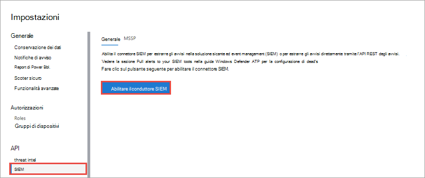

# Abilitare l'integrazione SIEM in Microsoft Defender for Endpoint

[!INCLUDE [Microsoft 365 Defender rebranding](../../includes/microsoft-defender.md)]

**Si applica a:**
- [Microsoft Defender ATP](https://go.microsoft.com/fwlink/?linkid=2154037)

>Vuoi provare Microsoft Defender per Endpoint? [Iscriversi per una versione di valutazione gratuita.](https://www.microsoft.com/microsoft-365/windows/microsoft-defender-atp?ocid=docs-wdatp-enablesiem-abovefoldlink) 

Abilita l'integrazione delle informazioni di sicurezza e della gestione degli eventi (SIEM) in modo da poter estrarre i rilevamenti da Microsoft Defender Security Center. Rilevamenti pull usando la soluzione SIEM o connettendosi direttamente all'API REST dei rilevamenti.

>[!NOTE]
>- [Microsoft Defender for Endpoint Alert](alerts.md) è composto da uno o più rilevamenti.
>- [Microsoft Defender for Endpoint Detection](api-portal-mapping.md) è composto dall'evento sospetto che si è verificato nel dispositivo e dai relativi dettagli di avviso.
>- L'API microsoft Defender for Endpoint Alert è l'API più recente per il consumo di avvisi e contiene un elenco dettagliato di prove correlate per ogni avviso. Per ulteriori informazioni, vedere [Metodi e proprietà degli](alerts.md) avvisi e Avvisi [elenco.](get-alerts.md)

## Prerequisiti

- L'utente che attiva l'impostazione deve disporre delle autorizzazioni per creare un'app in Azure Active Directory (AAD). Si tratta di un utente con i ruoli seguenti: 

  - Amministratore della sicurezza e amministratore globale
  - Amministratore applicazione cloud
  - Amministratore dell'applicazione
  - Proprietario dell'entità servizio

- Durante l'attivazione iniziale, viene visualizzata una schermata popup per l'immissione delle credenziali. Assicurarsi di consentire i popup per questo sito.

## Abilitazione dell'integrazione SIEM 
1. Nel riquadro di spostamento selezionare **Impostazioni**  >  **SIEM.**

    

    >[!TIP]
    >Se si verifica un errore durante il tentativo di abilitare l'applicazione connettore SIEM, controllare le impostazioni di blocco popup del browser. È possibile che la nuova finestra venga aperta quando si abilita la funzionalità. 

2. Selezionare **Abilita integrazione SIEM.** In questo modo viene attivata la sezione dei dettagli di accesso del connettore **SIEM** con valori precompilato e viene creata un'applicazione nel tenant di Azure Active Directory (Azure AD).

    > [!WARNING]
    >Il segreto client viene visualizzato una sola volta. Assicurarsi di conservare una copia in un luogo sicuro. 
     

    

3. Scegliere il tipo di SIEM utilizzato nell'organizzazione.

   > [!NOTE]
   > Se si seleziona HP ArcSight, sarà necessario salvare questi due file di configurazione: 
   > - WDATP-connector.jsonparser.properties
   > - WDATP-connector.properties  

   Se vuoi connetterti direttamente all'API REST dei rilevamenti tramite l'accesso a livello di codice, scegli **API generica.**

4. Copiare i singoli valori o selezionare **Salva dettagli nel file** per scaricare un file contenente tutti i valori.

5. Seleziona **Genera token per** ottenere un token di accesso e aggiornamento.
  
   > [!NOTE]
   > Dovrai generare un nuovo token Refresh ogni 90 giorni. 

6. Segui le istruzioni per la [creazione di una registrazione dell'app Azure AD](https://docs.microsoft.com/microsoft-365/security/defender-endpoint/exposed-apis-create-app-webapp) per Microsoft Defender per Endpoint e assegna le autorizzazioni corrette per leggere gli avvisi.

Ora puoi procedere con la configurazione della soluzione SIEM o la connessione all'API REST dei rilevamenti tramite l'accesso programmatico. Dovrai usare i token durante la configurazione della soluzione SIEM per consentirla di ricevere i rilevamenti da Microsoft Defender Security Center.

## Integrare Microsoft Defender per Endpoint con IBM QRadar 
Puoi configurare IBM QRadar per raccogliere i rilevamenti da Microsoft Defender per Endpoint. Per ulteriori informazioni, vedere [IBM Knowledge Center.](https://www.ibm.com/support/knowledgecenter/SS42VS_DSM/c_dsm_guide_MS_Win_Defender_ATP_overview.html?cp=SS42VS_7.3.1)

## Vedere anche
- [Configurare HP ArcSight per eseguire il pull dei rilevamenti di Microsoft Defender for Endpoint](configure-arcsight.md)
- [Campi di Microsoft Defender per il rilevamento degli endpoint](api-portal-mapping.md)
- [Eseguire il pull dei rilevamenti di Microsoft Defender per endpoint con l'API REST](pull-alerts-using-rest-api.md)
- [Risolvere i problemi di integrazione degli strumenti SIEM](troubleshoot-siem.md)
