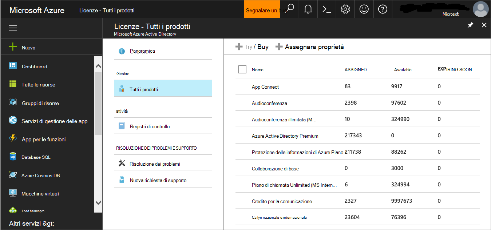

# Valutazione MDE pilota

>[!NOTE]
>Allo scopo di guidare l'utente attraverso una distribuzione tipica, questo scenario copre solo l'uso di Microsoft Endpoint Configuration Manager. Defender for Endpoint supporta l'uso di altri strumenti di onboarding, ma non copre questi scenari nella guida alla distribuzione. Per altre informazioni, vedi [Onboard di dispositivi a Microsoft Defender per Endpoint.](onboard-configure.md)

## Passaggio 1. Controllare lo stato della licenza

Il controllo dello stato della licenza e del provisioning corretto può essere eseguito tramite l'interfaccia di amministrazione o tramite il **portale Microsoft Azure .**

1. Per visualizzare le licenze, passare al **portale di Microsoft Azure** e passare alla Microsoft Azure licenza del [portale.](https://portal.azure.com/#blade/Microsoft_AAD_IAM/LicensesMenuBlade/Products)

   

1. In alternativa, nell'interfaccia di amministrazione passare a **Fatturazione**  >  **Abbonamenti.**

    Sullo schermo verranno visualizzate tutte le licenze di cui è stato eseguito il provisioning e il relativo **stato corrente.**

    

## Passaggio 2. Onboardare gli endpoint usando uno degli strumenti di gestione supportati

[L'argomento Pianificare](deployment-strategy.md) la distribuzione descrive i passaggi generali da eseguire per distribuire Defender for Endpoint.  

Guarda questo video per una breve panoramica del processo di onboarding e scopri gli strumenti e i metodi disponibili.

> [!VIDEO https://www.microsoft.com/videoplayer/embed/RE4bGqr]

Dopo aver identificato l'architettura, è necessario decidere quale metodo di distribuzione utilizzare. Lo strumento di distribuzione scelto influisce sulla modalità di onboard degli endpoint nel servizio.

### Opzioni dello strumento di onboarding

Nella tabella seguente sono elencati gli strumenti disponibili in base all'endpoint da eseguire l'onboard.

| Endpoint     | Opzioni degli strumenti                       |
|--------------|------------------------------------------|
| **Windows**  |  [Script locale (fino a 10 dispositivi)](../defender-endpoint/configure-endpoints-script.md)   [Criteri di gruppo](../defender-endpoint/configure-endpoints-gp.md)   [Microsoft Endpoint Manager/ Gestione dispositivi mobili](../defender-endpoint/configure-endpoints-mdm.md)   [Microsoft Endpoint Configuration Manager](../defender-endpoint/configure-endpoints-sccm.md)   [Script VDI](../defender-endpoint/configure-endpoints-vdi.md)   [Integrazione con Azure Defender](../defender-endpoint/configure-server-endpoints.md#integration-with-azure-defender) |
| **macOS**    | [Script locali](../defender-endpoint/mac-install-manually.md)   [Microsoft Endpoint Manager](../defender-endpoint/mac-install-with-intune.md)   [JAMF Pro](../defender-endpoint/mac-install-with-jamf.md)   [Gestione di dispositivi mobili](../defender-endpoint/mac-install-with-other-mdm.md) |
| **Linux Server** | [Script locale](../defender-endpoint/linux-install-manually.md)   [Pupazzo](../defender-endpoint/linux-install-with-puppet.md)   [Ansible](../defender-endpoint/linux-install-with-ansible.md)|
| **iOS**      | [Basato su app](../defender-endpoint/ios-install.md)                                |
| **Android**  | [Microsoft Endpoint Manager](../defender-endpoint/android-intune.md)               |
