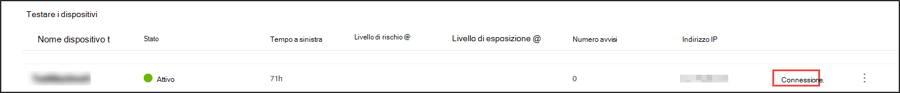
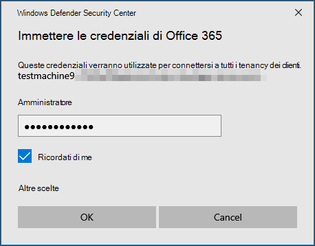

# Esperienza di Microsoft Defender for Endpoint (MDE) tramite attacchi simulati

>[!TIP]
>
>- Informazioni sugli ultimi miglioramenti in Microsoft Defender for Endpoint: [Novità di Defender per Endpoint?](https://cloudblogs.microsoft.com/microsoftsecure/2018/11/15/whats-new-in-windows-defender-atp/).
>- Defender for Endpoint ha dimostrato le funzionalità di ottica e rilevamento leader del settore nella recente valutazione MITRE. Leggere: [Insights dalla valutazione basata su CK&MITRE ATT](https://cloudblogs.microsoft.com/microsoftsecure/2018/12/03/insights-from-the-mitre-attack-based-evaluation-of-windows-defender-atp/).

Potresti voler provare Defender for Endpoint prima di eseguire l'onboardboard di più di alcuni dispositivi nel servizio. A tale scopo, è possibile eseguire simulazioni di attacco controllate su alcuni dispositivi di test. Dopo aver eseguito gli attacchi simulati, puoi esaminare il modo in cui Defender for Endpoint mostra attività dannose ed esplorare il modo in cui consente una risposta efficiente.

## Prima di iniziare

Per eseguire una delle simulazioni fornite, è necessario almeno [un dispositivo onboarded.](onboard-configure.md)

Leggere il documento della procedura dettagliata fornito con ogni scenario di attacco. Ogni documento include i requisiti del sistema operativo e delle applicazioni, nonché istruzioni dettagliate specifiche per uno scenario di attacco.

## Eseguire una simulazione

1. In   >  **Simulazioni guida & esercitazioni** selezionare quali degli scenari di attacco disponibili si desidera simulare:

   - **Scenario 1: la backdoor** del documento viene simulare la consegna di un documento di esca socialmente progettato. Il documento avvia una backdoor appositamente predisposta che consente agli utenti malintenzionati di controllare.

   - **Scenario 2: script di PowerShell in** attacco senza file - Simula un attacco senza file che si basa su PowerShell, che mostra la riduzione della superficie di attacco e il rilevamento di dispositivi di apprendimento di attività di memoria dannose.

   - **Scenario 3: risposta** automatica agli eventi imprevisti : attiva un'indagine automatizzata, che cerca e correda automaticamente gli artefatti di violazione per ridimensionare la capacità di risposta agli incidenti.

2. Scaricare e leggere il documento della procedura dettagliata corrispondente fornito con lo scenario selezionato.

3. Scarica il file di simulazione o copia lo script di simulazione accedendo alla **Guida**  >  **Simulazioni & esercitazioni**. Puoi scegliere di scaricare il file o lo script nel dispositivo di test, ma non è obbligatorio.

4. Eseguire il file o lo script di simulazione nel dispositivo di test come indicato nel documento della procedura dettagliata.

> [!NOTE]
> I file o gli script di simulazione simulano l'attività di attacco, ma sono in realtà benigni e non danneggiano o comprometteranno il dispositivo di test.
>

## TESTO ARGOMENTO ALTERNATIVO

## Simulare scenari di attacco

Usa i dispositivi di test per eseguire le tue simulazioni di attacco connettendoti a essi.

Puoi simulare scenari di attacco usando:

- Scenari di attacco ["Fai da te"](https://securitycenter.windows.com/tutorials)
- Simulatori di minacce

È inoltre possibile utilizzare [la ricerca avanzata per](advanced-hunting-overview.md) eseguire query sui dati e [sull'analisi](threat-analytics.md) delle minacce per visualizzare i report sulle minacce emergenti.

### Scenari di attacco fai-da-te

Se stai cercando una simulazione predefinita, puoi usare i nostri scenari di attacco "Fai da [te".](https://securitycenter.windows.com/tutorials) Questi script sono sicuri, documentati e facili da usare. Questi scenari rifletteranno le funzionalità di Defender for Endpoint e illustrano l'esperienza di analisi.

>[!NOTE]
>La connessione ai dispositivi di test viene eseguita tramite RDP. Verificare che le impostazioni del firewall consentano le connessioni RDP.

1. Connessione al dispositivo ed esegui una simulazione di attacco selezionando **Connessione**.

    

2. Salvare il file RDP e avviarlo selezionando **Connessione**.

    

    >[!NOTE]
    >Se non si dispone di una copia della password salvata durante la configurazione iniziale, è possibile reimpostare la password selezionando Reimposta **password** dal menu: Immagine della password 
    >
    > Il dispositivo cambierà lo stato in "Esecuzione della reimpostazione della password", quindi ti verrà presentata la nuova password in pochi minuti.

3. Immetti la password visualizzata durante il passaggio di creazione del dispositivo.

   

4. Esegui simulazioni di attacco fai-da-te nel dispositivo.

### Scenari del simulatore di minacce

Se si è scelto di installare uno dei simulatori di minacce supportati durante la configurazione del lab, è possibile eseguire le simulazioni incorporate nei dispositivi del laboratorio di valutazione.

L'esecuzione di simulazioni di minacce con piattaforme di terze parti è un buon modo per valutare le funzionalità di Microsoft Defender for Endpoint entro i limiti di un ambiente lab.

>[!NOTE]
>
>Prima di poter eseguire simulazioni, verificare che siano soddisfatti i requisiti seguenti:

>- I dispositivi devono essere aggiunti al laboratorio di valutazione
>- I simulatori di minacce devono essere installati nel laboratorio di valutazione

1. Nel portale selezionare **Crea simulazione**.

2. Selezionare un simulatore di minacce.

    

3. Scegliere una simulazione o esaminare la raccolta di simulazioni per esplorare le simulazioni disponibili.

    Puoi accedere alla raccolta di simulazioni da:
    - Dashboard di valutazione principale nel riquadro **Panoramica simulazioni** o
    - Spostandosi dal riquadro di **spostamento** Valutazione ed esercitazioni  >  **Simulazione & esercitazioni**, quindi selezionare Catalogo **simulazioni**.

4. Seleziona i dispositivi in cui vuoi eseguire la simulazione.

5. Selezionare **Crea simulazione.**

6. Visualizzare lo stato di avanzamento di una simulazione selezionando la **scheda Simulazioni.** Visualizzare lo stato della simulazione, gli avvisi attivi e altri dettagli.

    
 

Dopo aver eseguito le simulazioni, ti invitiamo a esaminare l'indicatore di stato del lab ed esplorare Microsoft Defender for Endpoint che ha attivato un'indagine e **una correzione automatizzate.** Controlla le prove raccolte e analizzate dalla funzionalità.

Cercare le prove di attacco tramite la ricerca avanzata usando il linguaggio di query avanzato e la telemetria non elaborata e consultare alcune minacce a livello mondiale documentate in Threat analytics.
