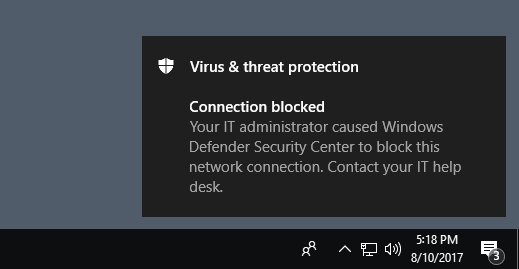

# <a name="evaluate-network-protection"></a>Valutare la protezione di rete

[!INCLUDE [Microsoft 365 Defender rebranding](../../includes/microsoft-defender.md)]

**Si applica a:**
- [Microsoft Defender per endpoint](https://go.microsoft.com/fwlink/?linkid=2154037)
- - [Microsoft 365 Defender](https://go.microsoft.com/fwlink/?linkid=2118804)

[La protezione di](network-protection.md) rete consente di impedire ai dipendenti di utilizzare qualsiasi applicazione per accedere a domini pericolosi che potrebbero ospitare tentativi di phishing, exploit e altri contenuti dannosi su Internet.

Questo articolo consente di valutare la protezione di rete abilitando la funzionalità e guidando l'utente a un sito di testing. I siti in questo articolo di valutazione non sono dannosi. Sono siti Web creati appositamente che fingono di essere dannosi. Il sito replica il comportamento che si verifica se un utente visita un sito o un dominio dannoso.

> [!TIP]
> Puoi anche visitare il sito Web Microsoft Defender Testground [all'demo.wd.microsoft.com](https://demo.wd.microsoft.com?ocid=cx-wddocs-testground) per vedere come funzionano le altre funzionalità di protezione.

## <a name="enable-network-protection-in-audit-mode"></a>Abilitare la protezione di rete in modalità di controllo

Abilitare la protezione di rete in modalità di controllo per vedere quali indirizzi IP e domini sarebbero stati bloccati. Puoi assicurarti che non influisca sulle app line-of-business o avere un'idea della frequenza con cui si verificano i blocchi.

1. Digitare **powershell** nella menu Start, fare clic con il pulsante destro **del mouse** Windows PowerShell e selezionare Esegui come **amministratore**
2. Immettere il cmdlet seguente:

    ```PowerShell
    Set-MpPreference -EnableNetworkProtection AuditMode
    ```

### <a name="visit-a-fake-malicious-domain"></a>Visitare un dominio dannoso (falso)

1. Apri Internet Explorer, Google Chrome o qualsiasi altro browser di tua scelta.

1. Vai a [https://smartscreentestratings2.net](https://smartscreentestratings2.net).

La connessione di rete sarà consentita e verrà visualizzato un messaggio di prova.



## <a name="review-network-protection-events-in-windows-event-viewer"></a>Esaminare gli eventi di protezione di rete nel Visualizzatore Windows eventi

Per esaminare le app che sarebbero state bloccate, aprire il Visualizzatore eventi e filtrare l'ID evento 1125 nel registro microsoft-Windows-Windows-Defender/Operativo. Nella tabella seguente sono elencati tutti gli eventi di protezione di rete.

| ID evento | Provide/Source | Descrizione |
|-|-|-|
|5007 | Windows Defender (operativo) | Evento quando vengono modificate le impostazioni |
|1125 | Windows Defender (operativo) | Evento quando viene verificata una connessione di rete |
|1126 | Windows Defender (operativo) | Evento quando viene bloccata una connessione di rete |

## <a name="see-also"></a>Vedere anche

* [Protezione di rete](network-protection.md)
* [Abilitare la protezione di rete](enable-network-protection.md)
* [Risolvere i problemi di protezione di rete](troubleshoot-np.md)
