# Laboratorio di valutazione di Microsoft Defender for EndpointMicrosoft Defender for Endpoint evaluation lab

[!INCLUDE [Microsoft 365 Defender rebranding](../../includes/microsoft-defender.md)]

**Si applica a:****Applies to:**
- [Microsoft Defender per endpointMicrosoft Defender for Endpoint](https://go.microsoft.com/fwlink/?linkid=2154037)
- [Microsoft 365 DefenderMicrosoft 365 Defender](https://go.microsoft.com/fwlink/?linkid=2118804)

>Vuoi provare Microsoft Defender per Endpoint?Want to experience Microsoft Defender for Endpoint? [Iscriversi per una versione di valutazione gratuita.Sign up for a free trial.](https://www.microsoft.com/microsoft-365/windows/microsoft-defender-atp?ocid=docs-wdatp-enablesiem-abovefoldlink)

L'esecuzione di una valutazione completa del prodotto per la sicurezza può essere un processo complesso che richiede una configurazione complessa dell'ambiente e del dispositivo prima di poter effettivamente eseguire una simulazione di attacco end-to-end.Conducting a comprehensive security product evaluation can be a complex process requiring cumbersome environment and device configuration before an end-to-end attack simulation can actually be done. L'aggiunta alla complessità è la sfida di tenere traccia dei casi in cui le attività di simulazione, gli avvisi e i risultati si riflettono durante la valutazione.Adding to the complexity is the challenge of tracking where the simulation activities, alerts, and results are reflected during the evaluation.

Il laboratorio di valutazione di Microsoft Defender for Endpoint è progettato per eliminare le complessità della configurazione di dispositivi e ambienti, in modo da concentrarti sulla valutazione delle funzionalità della piattaforma, sull'esecuzione di simulazioni e sulla visualizzazione delle funzionalità di prevenzione, rilevamento e correzione in azione.The Microsoft Defender for Endpoint evaluation lab is designed to eliminate the complexities of device and environment configuration so that you can  focus on evaluating the capabilities of the platform, running simulations, and seeing the prevention, detection, and remediation features in action.

> [!VIDEO https://www.microsoft.com/en-us/videoplayer/embed/RE4qLUM]

Con l'esperienza di configurazione semplificata, puoi concentrarti sull'esecuzione di scenari di test personalizzati e sulle simulazioni predefinite per vedere le prestazioni di Defender for Endpoint.With the simplified set-up experience, you can focus on running your own test scenarios and the pre-made simulations to see how Defender for Endpoint performs. 

Avrai accesso completo alle potenti funzionalità della piattaforma, ad esempio indagini automatizzate, ricerca avanzata e analisi delle minacce, consentendoti di testare lo stack di protezione completo che Defender for Endpoint offre.You'll have full access to the powerful capabilities of the platform such as automated investigations, advanced hunting, and threat analytics, allowing you to test the comprehensive protection stack that Defender for Endpoint offers. 

È possibile aggiungere dispositivi Windows 10 o Windows Server 2019 preconfigurato per installare le versioni più recenti del sistema operativo e i componenti di sicurezza più recenti e Office 2019 Standard.You can add Windows 10 or Windows Server 2019 devices that come pre-configured to have the latest OS versions and the right security components in place as well as Office 2019 Standard installed.

Puoi anche installare simulatori di minacce.You can also install threat simulators. Defender for Endpoint ha collaborato con le principali piattaforme di simulazione delle minacce del settore per aiutarti a testare le funzionalità di Defender for Endpoint senza dover uscire dal portale.Defender for Endpoint has partnered with industry leading threat simulation platforms to help you test out the Defender for Endpoint capabilities without having to leave the portal.

 Installa il simulatore preferito, esegui scenari all'interno del laboratorio di valutazione e scopri immediatamente le prestazioni della piattaforma, il tutto comodamente disponibile senza costi aggiuntivi.Install your preferred simulator, run scenarios within the evaluation lab, and instantly see how the platform performs - all conveniently available at no extra cost to you. Avrai anche un comodo accesso a un'ampia gamma di simulazioni a cui puoi accedere ed eseguire dal catalogo delle simulazioni.You'll also have convenient access to wide array of simulations which you can access and run from the simulations catalog.
    

## Prima di iniziareBefore you begin
Dovrai soddisfare i requisiti  di licenza o avere accesso di prova a Microsoft Defender for Endpoint per accedere al laboratorio di valutazione.You'll need to fulfill the [licensing requirements](minimum-requirements.md#licensing-requirements) or have trial access to Microsoft Defender for Endpoint to access the evaluation lab.

È necessario disporre delle autorizzazioni Di gestione **delle impostazioni di** sicurezza per:You must have **Manage security settings** permissions to:
- Creare il labCreate the lab
- Creare dispositiviCreate devices
- Reimpostare la passwordReset password
- Creare simulazioniCreate simulations 
 
Se è stato abilitato il controllo di accesso basato sui ruoli (RBAC) e è stato creato almeno un gruppo di computer, gli utenti devono avere accesso a Tutti i gruppi di computer.If you enabled role-based access control (RBAC) and created at least a one machine group, users must have access to All machine groups.

Per ulteriori informazioni, vedere [Create and manage roles](user-roles.md).For more information, see [Create and manage roles](user-roles.md).

Vuoi provare Microsoft Defender per Endpoint?Want to experience Microsoft Defender for Endpoint? [Iscriversi per una versione di valutazione gratuita.Sign up for a free trial.](https://www.microsoft.com/microsoft-365/windows/microsoft-defender-atp?ocid=docs-wdatp-main-abovefoldlink)

## Introduzione al labGet started with the lab
Puoi accedere al lab dal menu.You can access the lab from the menu. Nel menu di spostamento seleziona **Valutazione ed esercitazioni > lab di valutazione.**In the navigation menu, select **Evaluation and tutorials > Evaluation lab**.

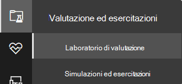

>[!NOTE]
>- A seconda del tipo di struttura dell'ambiente selezionato, i dispositivi saranno disponibili per il numero di ore specificato a partire dal giorno dell'attivazione.Depending the type of environment structure you select, devices will be available for the specified number of hours from the day of activation.
>- Viene eseguito il provisioning di ogni ambiente con un set limitato di dispositivi di test.Each environment is provisioned with a limited set of test devices. Dopo aver usato i dispositivi di cui è stato eseguito il provisioning e li hai eliminati, puoi richiedere altri dispositivi.When you've used up the provisioned devices and have deleted them, you can request for more devices. 
>- È possibile richiedere risorse lab una volta al mese.You can request for lab resources once a month. 

Hai già un lab?Already have a lab? Assicurati di abilitare i nuovi simulatori di minacce e di avere dispositivi attivi.Make sure to enable the new threat simulators and have active devices.

## Configurare il laboratorio di valutazioneSetup the evaluation lab

1. Nel riquadro di spostamento, selezionare **Valutazione ed esercitazioni**  >  **Laboratorio di** valutazione, quindi **selezionare Setup lab.**In the navigation pane, select **Evaluation and tutorials** > **Evaluation lab**, then select **Setup lab**.

    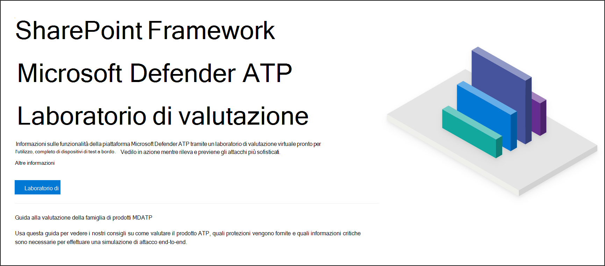

2. A seconda delle esigenze di valutazione, puoi scegliere di configurare un ambiente con meno dispositivi per un periodo più lungo o più dispositivi per un periodo più breve.Depending on your evaluation needs, you can choose to setup an environment with fewer devices for a longer period or more devices for a shorter period. Seleziona la configurazione lab preferita e quindi seleziona **Avanti.**Select your preferred lab configuration then select **Next**.

    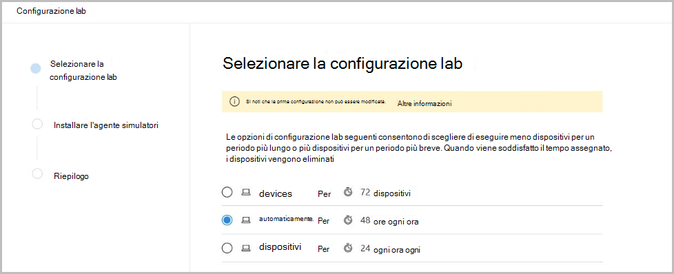 

3. (Facoltativo) Puoi scegliere di installare simulatori di minacce nel lab.(Optional) You can choose to install threat simulators in the lab. 

    

    >[!IMPORTANT]
    >Dovrai prima accettare e fornire il consenso alle condizioni e alle dichiarazioni di condivisione delle informazioni.You'll first need to accept and provide consent to the terms and information sharing statements. 

4. Selezionare l'agente di simulazione delle minacce che si desidera utilizzare e immettere i dettagli.Select the threat simulation agent you'd like to use and enter your details. Puoi anche scegliere di installare simulatori di minacce in un secondo momento.You can also choose to install threat simulators at a later time. Se si sceglie di installare gli agenti di simulazione delle minacce durante la configurazione del lab, sarà possibile installarli comodamente nei dispositivi aggiunti.If you choose to install threat simulation agents during the lab setup, you'll enjoy the benefit of having them conveniently installed on the devices you add.  
    
    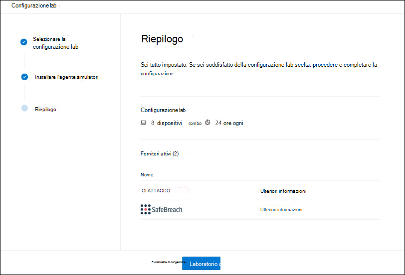

5.  Esaminare il riepilogo e selezionare **Setup lab**.Review the summary and select **Setup lab**.  

Al termine del processo di installazione del lab, è possibile aggiungere dispositivi ed eseguire simulazioni.After the lab setup process is complete, you can add devices and run simulations. 

## Aggiungere dispositiviAdd devices
Quando aggiungi un dispositivo all'ambiente, Defender for Endpoint configura un dispositivo ben configurato con i dettagli di connessione.When you add a device to your environment, Defender for Endpoint sets up a well-configured device with connection details. È possibile aggiungere Windows 10 o Windows Server 2019.You can add Windows 10 or Windows Server 2019 devices.

Il dispositivo verrà configurato con la versione più aggiornata del sistema operativo e Office 2019 Standard e con altre app come Java, Python e SysIntenals.The device will be configured with the most up-to-date version of the OS and Office 2019 Standard as well as other apps such as Java, Python, and SysIntenals. 

Se hai scelto di aggiungere un simulatore di minacce durante la configurazione del lab, tutti i dispositivi avranno l'agente simulatore di minacce installato nei dispositivi che aggiungi.If you chose to add a threat simulator during the lab setup, all devices will have the threat simulator agent installed in the devices that you add.

Il dispositivo verrà automaticamente onboarded nel tenant con i componenti di sicurezza Windows consigliati attivati e in modalità di controllo, senza alcun impegno da parte dell'utente.The device will automatically be onboarded to your tenant with the recommended Windows security components turned on and in audit mode - with no effort on your side. 

I componenti di sicurezza seguenti sono preconfigurato nei dispositivi di test:The following security components are pre-configured in the test devices:

- [Riduzione della superficie di attaccoAttack surface reduction](https://docs.microsoft.com/windows/security/threat-protection/windows-defender-exploit-guard/attack-surface-reduction-exploit-guard)
- [Blocco al primo avvistamentoBlock at first sight](https://docs.microsoft.com/windows/security/threat-protection/microsoft-defender-antivirus/configure-block-at-first-sight-microsoft-defender-antivirus)
- [Accesso controllato alle cartelleControlled folder access](https://docs.microsoft.com/windows/security/threat-protection/windows-defender-exploit-guard/controlled-folders-exploit-guard)
- [Protezione dagli exploitExploit protection](https://docs.microsoft.com/windows/security/threat-protection/windows-defender-exploit-guard/enable-exploit-protection)
- [Protezione di reteNetwork protection](https://docs.microsoft.com/windows/security/threat-protection/windows-defender-exploit-guard/network-protection-exploit-guard)
- [Rilevamento di applicazioni potenzialmente indesideratePotentially unwanted application detection](https://docs.microsoft.com/windows/security/threat-protection/microsoft-defender-antivirus/detect-block-potentially-unwanted-apps-microsoft-defender-antivirus)
- [Protezione basata sul cloudCloud-delivered protection](https://docs.microsoft.com/windows/security/threat-protection/microsoft-defender-antivirus/utilize-microsoft-cloud-protection-microsoft-defender-antivirus)
- [Microsoft Defender SmartScreenMicrosoft Defender SmartScreen](https://docs.microsoft.com/windows/security/threat-protection/windows-defender-smartscreen/windows-defender-smartscreen-overview)

>[!NOTE]
> Antivirus Microsoft Defender sarà attivata (non in modalità di controllo).Microsoft Defender Antivirus will be on (not in audit mode). Se Antivirus Microsoft Defender l'esecuzione della simulazione, puoi disattivare la protezione in tempo reale nel dispositivo tramite Sicurezza di Windows.If Microsoft Defender Antivirus blocks you from running your simulation, you can turn off real-time protection on the device through Windows Security. Per ulteriori informazioni, vedere [Configure always-on protection](https://docs.microsoft.com/windows/security/threat-protection/microsoft-defender-antivirus/configure-real-time-protection-microsoft-defender-antivirus).For more information, see [Configure always-on protection](https://docs.microsoft.com/windows/security/threat-protection/microsoft-defender-antivirus/configure-real-time-protection-microsoft-defender-antivirus).

Le impostazioni di analisi automatizzate dipendono dalle impostazioni del tenant.Automated investigation settings will be dependent on tenant settings. Verrà configurata per essere semiautomizzata per impostazione predefinita.It will be configured to be semi-automated by default. Per ulteriori informazioni, vedere [Overview of Automated investigations](automated-investigations.md).For more information, see [Overview of Automated investigations](automated-investigations.md).

>[!NOTE]
>La connessione ai dispositivi di test viene eseguita tramite RDP.The connection to the test devices is done using RDP. Verificare che le impostazioni del firewall consentano le connessioni RDP.Make sure that your firewall settings allow RDP connections.

1. Nel dashboard seleziona **Aggiungi dispositivo.**From the dashboard, select **Add device**. 

2. Scegli il tipo di dispositivo da aggiungere.Choose the type of device to add. È possibile scegliere di aggiungere Windows 10 o Windows Server 2019.You can choose to add Windows 10 or Windows Server 2019.

    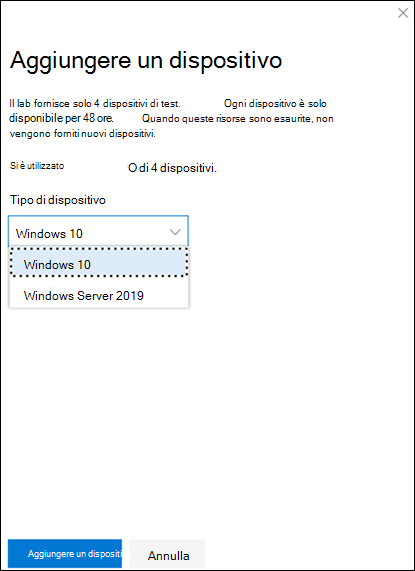

    >[!NOTE]
    >Se si verifica un problema durante il processo di creazione del dispositivo, verrà inviata una notifica e sarà necessario inviare una nuova richiesta.If something goes wrong with the device creation process, you'll be notified and you'll need to submit a new request. Se la creazione del dispositivo ha esito negativo, non verrà conteggiata rispetto alla quota complessiva consentita.If the device creation fails, it will not be counted against the overall allowed quota. 

3. Vengono visualizzati i dettagli della connessione.The connection details are displayed. Seleziona **Copia** per salvare la password per il dispositivo.Select **Copy** to save the password for the device.

    >[!NOTE]
    >La password viene visualizzata una sola volta.The password is only displayed once. Assicurati di salvarlo per un uso successivo.Be sure to save it for later use.

    

4. Viene avviata la configurazione del dispositivo.Device set up begins. Questa operazione può richiedere fino a circa 30 minuti.This can take up to approximately 30 minutes. 

5. Vedi lo stato dei dispositivi di test, i livelli di rischio e esposizione e lo stato delle installazioni di simulatori selezionando la **scheda** Dispositivi.See the status of test devices, the risk and exposure levels, and the status of simulator installations by selecting the **Devices** tab. 

    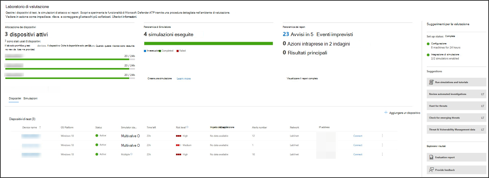
    

    > [!TIP]
    > Nella colonna **Stato simulatore** puoi passare il mouse sull'icona delle informazioni per conoscere lo stato di installazione di un agente.In the **Simulator status** column, you can hover over the information icon to know the installation status of an agent.

## Richiesta di altri dispositiviRequest for more devices
Quando tutti i dispositivi esistenti vengono usati ed eliminati, puoi richiedere altri dispositivi.When all existing devices are used and deleted, you can request for more devices. È possibile richiedere risorse lab una volta al mese.You can request for lab resources once a month. 

1. Nel dashboard del lab di valutazione seleziona **Richiedi altri dispositivi.**From the evaluation lab dashboard, select **Request for more devices**.

   

2. Scegliere la configurazione.Choose your configuration. 
3. Inviare la richiesta.Submit the request. 

Quando la richiesta viene inviata correttamente, vedrai un banner di conferma verde e la data dell'ultimo invio.When the request is submitted successfully you'll see a green confirmation banner and the date of the last submission.
 
Puoi trovare lo stato della richiesta nella **scheda Azioni** utente, che verrà approvata in poche ore.You can find the status of your request in the **User Actions** tab, which will be approved in a matter of hours.

Una volta approvati, i dispositivi richiesti verranno aggiunti alla configurazione del lab e potrai creare altri dispositivi.When approved, the requested devices will be added to your lab set up and you’ll be able to create more devices. 

> [!TIP]
> Per ottenere di più dal lab, non dimenticare di consultare la libreria di simulazioni.To get more out of your lab, don’t forget to check out our simulations library.

## Simulare scenari di attaccoSimulate attack scenarios
Usa i dispositivi di test per eseguire le tue simulazioni di attacco connettendoti a essi.Use the test devices to run your own attack simulations by connecting to them. 

Puoi simulare scenari di attacco usando:You can simulate attack scenarios using:
- Scenari di attacco ["Fai da te"](https://securitycenter.windows.com/tutorials)The ["Do It Yourself" attack scenarios](https://securitycenter.windows.com/tutorials)
- Simulatori di minacceThreat simulators

È inoltre possibile utilizzare [la ricerca avanzata per](advanced-hunting-query-language.md) eseguire query sui dati e [sull'analisi](threat-analytics.md) delle minacce per visualizzare i report sulle minacce emergenti.You can also use [Advanced hunting](advanced-hunting-query-language.md) to query data and [Threat analytics](threat-analytics.md) to view reports about emerging threats.

### Scenari di attacco fai-da-teDo-it-yourself attack scenarios
Se stai cercando una simulazione predefinita, puoi usare i nostri scenari di attacco "Fai da [te".](https://securitycenter.windows.com/tutorials)If you are looking for a pre-made simulation, you can use our ["Do It Yourself" attack scenarios](https://securitycenter.windows.com/tutorials). Questi script sono sicuri, documentati e facili da usare.These scripts are safe, documented, and easy to use. Questi scenari rifletteranno le funzionalità di Defender for Endpoint e illustrano l'esperienza di analisi.These scenarios will reflect Defender for Endpoint capabilities and walk you through investigation experience.

>[!NOTE]
>La connessione ai dispositivi di test viene eseguita tramite RDP.The connection to the test devices is done using RDP. Verificare che le impostazioni del firewall consentano le connessioni RDP.Make sure that your firewall settings allow RDP connections.

1. Connessione al dispositivo ed esegui una simulazione di attacco selezionando **Connessione**.Connect to your device and run an attack simulation by selecting **Connect**. 

    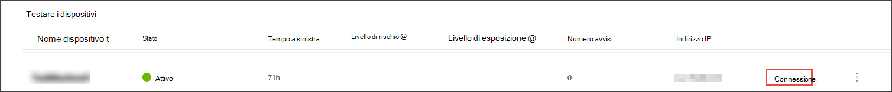

2. Salvare il file RDP e avviarlo selezionando **Connessione**.Save the RDP file and launch it by selecting **Connect**.

    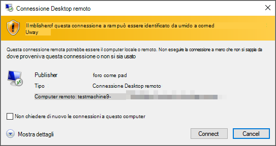

    >[!NOTE]
    >Se non si dispone di una copia della password salvata durante la configurazione iniziale, è possibile reimpostare la password selezionando Reimposta **password** dal menu: Immagine della password If you don't have a copy of the password saved during the initial setup, you can reset the password by selecting **Reset password** from the menu:  
    > Il dispositivo cambierà lo stato in "Esecuzione della reimpostazione della password", quindi ti verrà presentata la nuova password in pochi minuti.The device will change it’s state to “Executing password reset", then you’ll be presented with your new password in a few minutes.

3. Immetti la password visualizzata durante il passaggio di creazione del dispositivo.Enter the password that was displayed during the device creation step. 

   

4. Esegui simulazioni di attacco fai-da-te nel dispositivo.Run Do-it-yourself attack simulations on the device. 

### Scenari di simulatore di minacceThreat simulator scenarios
Se si è scelto di installare uno dei simulatori di minacce supportati durante la configurazione del lab, è possibile eseguire le simulazioni incorporate nei dispositivi del laboratorio di valutazione.If you chose to install any of the supported threat simulators during the lab setup, you can run the built-in simulations on the evaluation lab devices. 

L'esecuzione di simulazioni di minacce con piattaforme di terze parti è un buon modo per valutare le funzionalità di Microsoft Defender for Endpoint entro i limiti di un ambiente lab.Running threat simulations using third-party platforms is a good way to evaluate Microsoft Defender for Endpoint capabilities within the confines of a lab environment.

>[!NOTE]
>Prima di poter eseguire simulazioni, verificare che siano soddisfatti i requisiti seguenti:Before you can run simulations, ensure the following requirements are met:
>- I dispositivi devono essere aggiunti al laboratorio di valutazioneDevices must be added to the evaluation lab
>- I simulatori di minacce devono essere installati nel laboratorio di valutazioneThreat simulators must be installed in the evaluation lab

1. Nel portale selezionare **Crea simulazione**.From the portal select **Create simulation**.

2. Selezionare un simulatore di minacce.Select a threat simulator.

    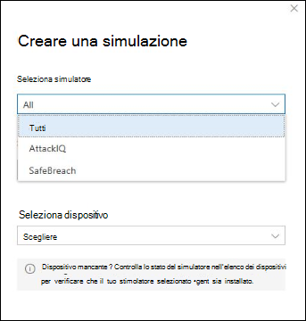

3. Scegliere una simulazione o esaminare la raccolta di simulazioni per esplorare le simulazioni disponibili.Choose a simulation or look through the simulation gallery to browse through the available simulations. 

    Puoi accedere alla raccolta di simulazioni da:You can get to the simulation gallery from:
    - Dashboard di valutazione principale nel riquadro **Panoramica simulazioni** oThe main evaluation dashboard in the **Simulations overview** tile or
    - Spostandosi dal riquadro di **spostamento** Valutazione ed esercitazioni  >  **Simulazione & esercitazioni**, quindi selezionare Catalogo **simulazioni**.By navigating from the navigation pane **Evaluation and tutorials** > **Simulation & tutorials**, then select **Simulations catalog**.

4. Seleziona i dispositivi in cui vuoi eseguire la simulazione.Select the devices where you'd like to run the simulation on.

5. Selezionare **Crea simulazione.**Select **Create simulation**.

6. Visualizzare lo stato di avanzamento di una simulazione selezionando la **scheda Simulazioni.** Visualizzare lo stato della simulazione, gli avvisi attivi e altri dettagli.View the progress of a simulation by selecting the **Simulations** tab. View the simulation state, active alerts, and other details. 

    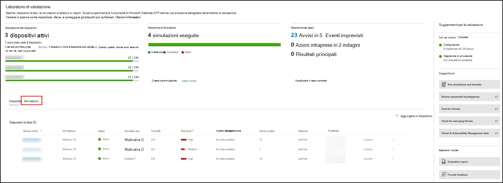
    
Dopo aver eseguito le simulazioni, ti invitiamo a esaminare l'indicatore di stato del lab ed esplorare Microsoft Defender for Endpoint che ha attivato un'indagine e **una correzione automatizzate.**After running your simulations, we encourage you to walk through the lab progress bar and explore **Microsoft Defender for Endpoint triggered an automated investigation and remediation**. Controlla le prove raccolte e analizzate dalla funzionalità.Check out the evidence collected and analyzed by the feature.

Cercare le prove di attacco tramite la ricerca avanzata usando il linguaggio di query avanzato e la telemetria non elaborata e consultare alcune minacce a livello mondiale documentate in Threat analytics.Hunt for attack evidence through advanced hunting by using the rich query language and raw telemetry and check out some world-wide threats documented in Threat analytics.

## Raccolta simulazioniSimulation gallery
Microsoft Defender for Endpoint ha collaborato con diverse piattaforme di simulazione delle minacce per fornire un accesso pratico per testare le funzionalità della piattaforma direttamente dal portale.Microsoft Defender for Endpoint has partnered with various threat simulation platforms to give you convenient access to test the capabilities of the platform right from the within the portal. 

Per visualizzare tutte le simulazioni disponibili, accedere a **Simulazioni ed** esercitazioni  >  **Catalogo simulazioni** dal menu.View all the available simulations by going to  **Simulations and tutorials** > **Simulations catalog**  from the menu. 

Viene elencato un elenco degli agenti di simulazione delle minacce di terze parti supportati e nel catalogo vengono forniti tipi specifici di simulazioni e descrizioni dettagliate.A list of supported third-party threat simulation agents are listed, and specific types of simulations along with detailed descriptions are provided on the catalog. 

È possibile eseguire comodamente qualsiasi simulazione disponibile direttamente dal catalogo.You can conveniently run any available simulation right from the catalog.  

Ogni simulazione include una descrizione approfondita dello scenario di attacco e riferimenti come le tecniche di attacco MITRE utilizzate e l'esempio di query di ricerca avanzata eseguite.Each simulation comes with an in-depth description of the attack scenario and references such as the MITRE attack techniques used and sample Advanced hunting queries you run.

**Esempi:** 
 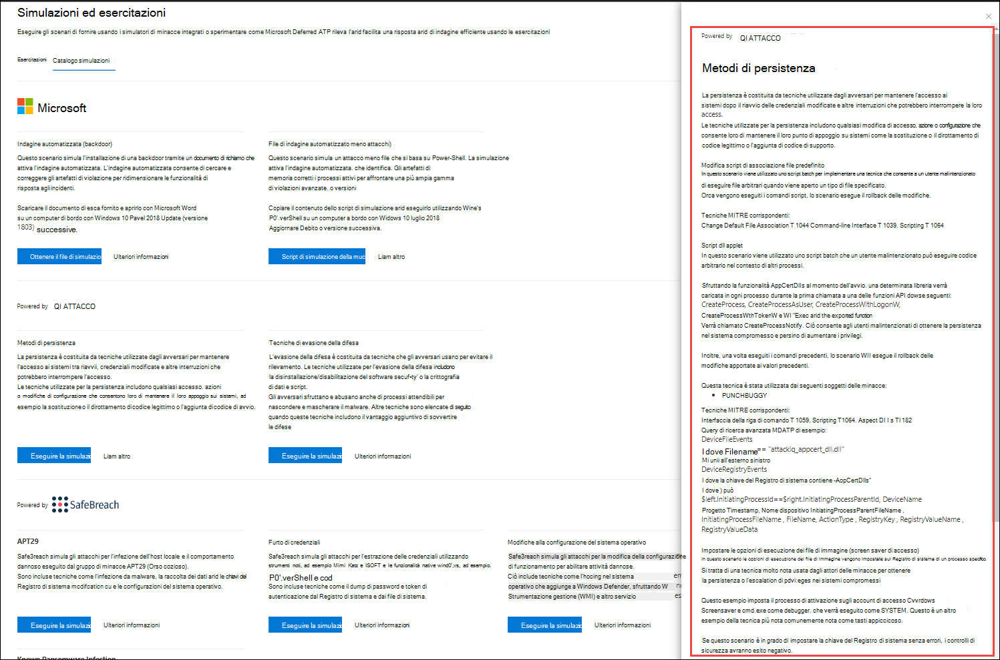**Examples:**

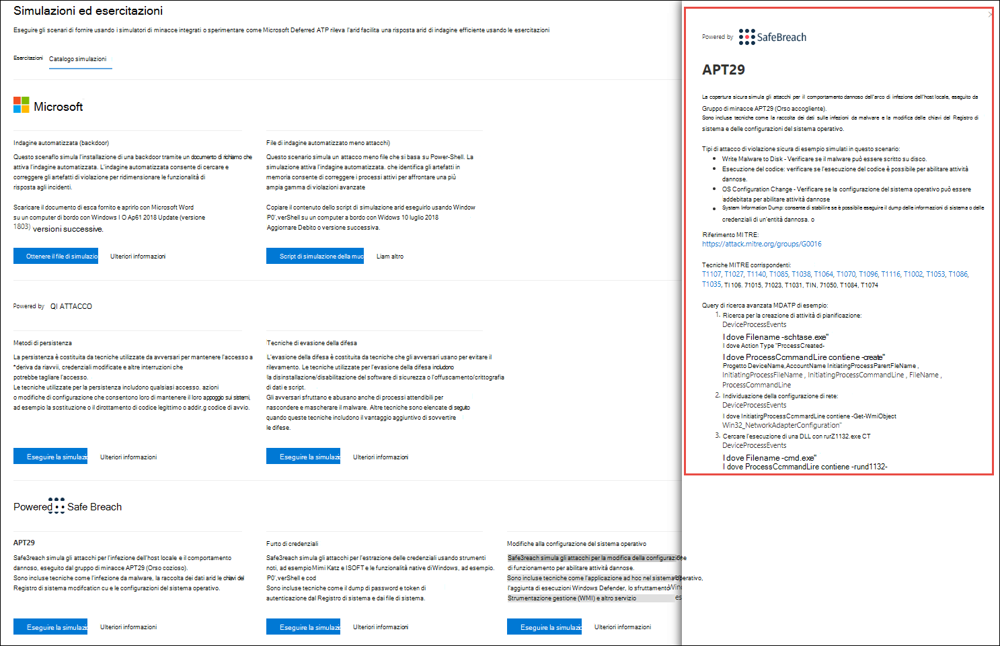

## Report di valutazioneEvaluation report
I report del lab riepilogano i risultati delle simulazioni eseguite sui dispositivi.The lab reports summarize the results of the simulations conducted on the devices.

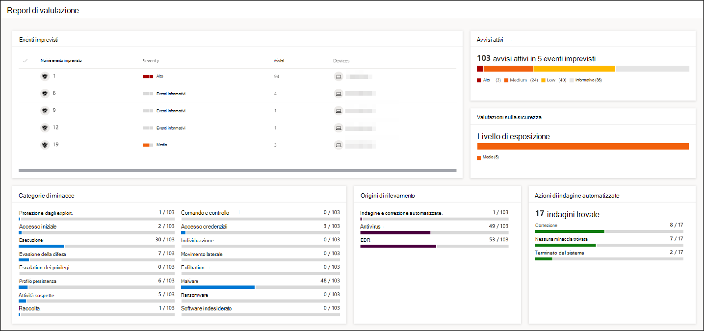

A colpo d'occhio, potrai rapidamente vedere:At a glance, you'll quickly be able to see:
- Eventi imprevisti attivatiIncidents that were triggered
- Avvisi generatiGenerated alerts
- Valutazioni a livello di esposizioneAssessments on exposure level 
- Categorie di minacce osservateThreat categories observed
- Origini di rilevamentoDetection sources
- Indagini automatizzateAutomated investigations

## Inviare feedbackProvide feedback
Il tuo feedback ci aiuta a migliorare la protezione dell'ambiente dagli attacchi avanzati.Your feedback helps us get better in protecting your environment from advanced attacks. Condividere l'esperienza e le impression dalle funzionalità del prodotto e dai risultati della valutazione.Share your experience and impressions from product capabilities and evaluation results.

Facci sapere cosa ne pensi selezionando **Invia feedback.**Let us know what you think, by selecting **Provide feedback**.

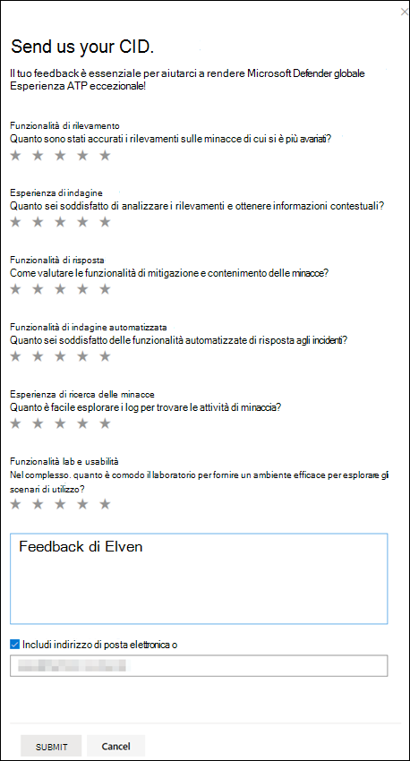
