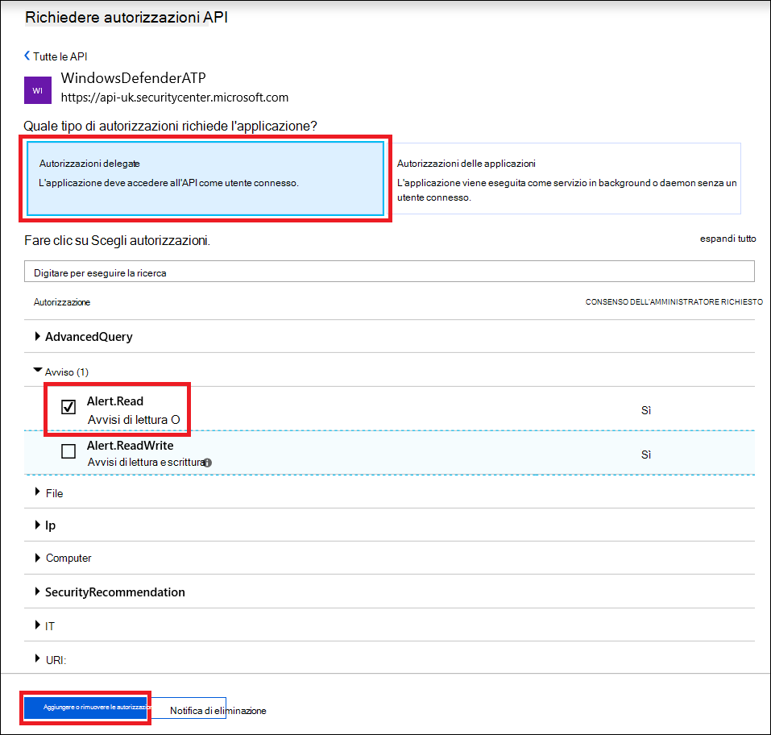
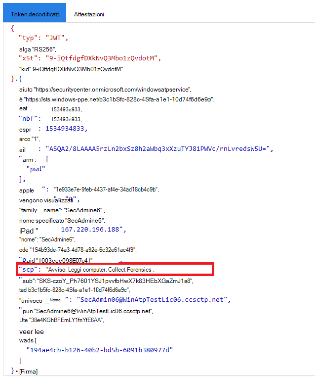

# <a name="use-microsoft-defender-for-endpoint-apis"></a><span data-ttu-id="2a262-104">Usare Microsoft Defender per le API degli endpoint</span><span class="sxs-lookup"><span data-stu-id="2a262-104">Use Microsoft Defender for Endpoint APIs</span></span>

[!INCLUDE [Microsoft 365 Defender rebranding](../../includes/microsoft-defender.md)]


<span data-ttu-id="2a262-105">**Si applica a:**</span><span class="sxs-lookup"><span data-stu-id="2a262-105">**Applies to:**</span></span>
- [<span data-ttu-id="2a262-106">Microsoft Defender per endpoint</span><span class="sxs-lookup"><span data-stu-id="2a262-106">Microsoft Defender for Endpoint</span></span>](https://go.microsoft.com/fwlink/?linkid=2154037)

> <span data-ttu-id="2a262-107">Vuoi provare Microsoft Defender per Endpoint?</span><span class="sxs-lookup"><span data-stu-id="2a262-107">Want to experience Microsoft Defender for Endpoint?</span></span> [<span data-ttu-id="2a262-108">Iscriversi per una versione di valutazione gratuita.</span><span class="sxs-lookup"><span data-stu-id="2a262-108">Sign up for a free trial.</span></span>](https://www.microsoft.com/microsoft-365/windows/microsoft-defender-atp?ocid=docs-wdatp-exposedapis-abovefoldlink)

[!include[Microsoft Defender for Endpoint API URIs for US Government](../../includes/microsoft-defender-api-usgov.md)]

[!include[Improve request performance](../../includes/improve-request-performance.md)]

<span data-ttu-id="2a262-109">Questa pagina descrive come creare un'applicazione per ottenere l'accesso a livello di codice a Defender per Endpoint per conto di un utente.</span><span class="sxs-lookup"><span data-stu-id="2a262-109">This page describes how to create an application to get programmatic access to Defender for Endpoint on behalf of a user.</span></span>

<span data-ttu-id="2a262-110">Se è necessario accedere a livello di codice a Microsoft Defender for Endpoint senza un utente, fare riferimento a [Access Microsoft Defender for Endpoint with application context](exposed-apis-create-app-webapp.md).</span><span class="sxs-lookup"><span data-stu-id="2a262-110">If you need programmatic access Microsoft Defender for Endpoint without a user, refer to [Access Microsoft Defender for Endpoint with application context](exposed-apis-create-app-webapp.md).</span></span>

<span data-ttu-id="2a262-111">Se non si è certi dell'accesso necessario, leggere la [pagina Introduzione.](apis-intro.md)</span><span class="sxs-lookup"><span data-stu-id="2a262-111">If you are not sure which access you need, read the [Introduction page](apis-intro.md).</span></span>

<span data-ttu-id="2a262-112">Microsoft Defender for Endpoint espone gran parte dei dati e delle azioni tramite un set di API programmatiche.</span><span class="sxs-lookup"><span data-stu-id="2a262-112">Microsoft Defender for Endpoint exposes much of its data and actions through a set of programmatic APIs.</span></span> <span data-ttu-id="2a262-113">Queste API ti consentiranno di automatizzare i flussi di lavoro e innovare in base alle funzionalità di Microsoft Defender for Endpoint.</span><span class="sxs-lookup"><span data-stu-id="2a262-113">Those APIs will enable you to automate work flows and innovate based on Microsoft Defender for Endpoint capabilities.</span></span> <span data-ttu-id="2a262-114">L'accesso API richiede l'autenticazione OAuth2.0.</span><span class="sxs-lookup"><span data-stu-id="2a262-114">The API access requires OAuth2.0 authentication.</span></span> <span data-ttu-id="2a262-115">Per ulteriori informazioni, vedere [OAuth 2.0 Authorization Code Flow](/azure/active-directory/develop/active-directory-v2-protocols-oauth-code).</span><span class="sxs-lookup"><span data-stu-id="2a262-115">For more information, see [OAuth 2.0 Authorization Code Flow](/azure/active-directory/develop/active-directory-v2-protocols-oauth-code).</span></span>

<span data-ttu-id="2a262-116">In generale, dovrai eseguire la procedura seguente per usare le API:</span><span class="sxs-lookup"><span data-stu-id="2a262-116">In general, you’ll need to take the following steps to use the APIs:</span></span>
- <span data-ttu-id="2a262-117">Creare un'applicazione AAD</span><span class="sxs-lookup"><span data-stu-id="2a262-117">Create an AAD application</span></span>
- <span data-ttu-id="2a262-118">Ottenere un token di accesso con questa applicazione</span><span class="sxs-lookup"><span data-stu-id="2a262-118">Get an access token using this application</span></span>
- <span data-ttu-id="2a262-119">Usare il token per accedere all'API di Defender for Endpoint</span><span class="sxs-lookup"><span data-stu-id="2a262-119">Use the token to access Defender for Endpoint API</span></span>

<span data-ttu-id="2a262-120">Questa pagina spiega come creare un'applicazione AAD, ottenere un token di accesso a Microsoft Defender for Endpoint e convalidare il token.</span><span class="sxs-lookup"><span data-stu-id="2a262-120">This page explains how to create an AAD application, get an access token to Microsoft Defender for Endpoint and validate the token.</span></span>

>[!NOTE]
> <span data-ttu-id="2a262-121">Quando si accede all'API di Microsoft Defender per endpoint per conto di un utente, sono necessarie l'autorizzazione applicazione e l'autorizzazione utente corrette.</span><span class="sxs-lookup"><span data-stu-id="2a262-121">When accessing Microsoft Defender for Endpoint API on behalf of a user, you will need the correct Application permission and user permission.</span></span>
> <span data-ttu-id="2a262-122">Se non si ha familiarità con le autorizzazioni utente in Microsoft Defender for Endpoint, vedere [Manage portal access using role-based access control](rbac.md).</span><span class="sxs-lookup"><span data-stu-id="2a262-122">If you are not familiar with user permissions on Microsoft Defender for Endpoint, see [Manage portal access using role-based access control](rbac.md).</span></span>

>[!TIP]
> <span data-ttu-id="2a262-123">Se hai l'autorizzazione per eseguire un'azione nel portale, hai l'autorizzazione per eseguire l'azione nell'API.</span><span class="sxs-lookup"><span data-stu-id="2a262-123">If you have the permission to perform an action in the portal, you have the permission to perform the action in the API.</span></span>

## <a name="create-an-app"></a><span data-ttu-id="2a262-124">Creare un'app</span><span class="sxs-lookup"><span data-stu-id="2a262-124">Create an app</span></span>

1. <span data-ttu-id="2a262-125">Accedere ad [Azure](https://portal.azure.com) con un account utente con il **ruolo amministratore** globale.</span><span class="sxs-lookup"><span data-stu-id="2a262-125">Log on to [Azure](https://portal.azure.com) with a user account that has the **Global Administrator** role.</span></span>

2. <span data-ttu-id="2a262-126">Passare **a** Azure Active Directory  >  **app Nuove**  >  **registrazioni**.</span><span class="sxs-lookup"><span data-stu-id="2a262-126">Navigate to **Azure Active Directory** > **App registrations** > **New registration**.</span></span> 

   

3. <span data-ttu-id="2a262-128">Quando viene **visualizzata la pagina Registra** un'applicazione, immettere le informazioni di registrazione dell'applicazione:</span><span class="sxs-lookup"><span data-stu-id="2a262-128">When the **Register an application** page appears, enter your application's registration information:</span></span>

   - <span data-ttu-id="2a262-129">**Nome:** immettere un nome di applicazione significativo che verrà visualizzato agli utenti dell'app.</span><span class="sxs-lookup"><span data-stu-id="2a262-129">**Name** - Enter a meaningful application name that will be displayed to users of the app.</span></span>
   - <span data-ttu-id="2a262-130">**Tipi di account supportati:** selezionare gli account che si desidera supportare dall'applicazione.</span><span class="sxs-lookup"><span data-stu-id="2a262-130">**Supported account types** - Select which accounts you would like your application to support.</span></span>

       | <span data-ttu-id="2a262-131">Tipi di account supportati</span><span class="sxs-lookup"><span data-stu-id="2a262-131">Supported account types</span></span> | <span data-ttu-id="2a262-132">Descrizione</span><span class="sxs-lookup"><span data-stu-id="2a262-132">Description</span></span> |
       |-------------------------|-------------|
       | <span data-ttu-id="2a262-133">**Account solo in questa directory organizzativa**</span><span class="sxs-lookup"><span data-stu-id="2a262-133">**Accounts in this organizational directory only**</span></span> | <span data-ttu-id="2a262-134">Selezionare questa opzione se si sta creando un'applicazione line-of-business (LOB).</span><span class="sxs-lookup"><span data-stu-id="2a262-134">Select this option if you're building a line-of-business (LOB) application.</span></span> <span data-ttu-id="2a262-135">Questa opzione non è disponibile se non si sta registrando l'applicazione in una directory.</span><span class="sxs-lookup"><span data-stu-id="2a262-135">This option is not available if you're not registering the application in a directory.</span></span><br><br><span data-ttu-id="2a262-136">Questa opzione esegue il mapping ad Azure AD solo a tenant singolo.</span><span class="sxs-lookup"><span data-stu-id="2a262-136">This option maps to Azure AD only single-tenant.</span></span><br><br><span data-ttu-id="2a262-137">Questa è l'opzione predefinita, a meno che tu non registri l'app all'esterno di una directory.</span><span class="sxs-lookup"><span data-stu-id="2a262-137">This is the default option unless you're registering the app outside of a directory.</span></span> <span data-ttu-id="2a262-138">Nei casi in cui l'app viene registrata all'esterno di una directory, il valore predefinito è Azure AD multi-tenant e account Microsoft personali.</span><span class="sxs-lookup"><span data-stu-id="2a262-138">In cases where the app is registered outside of a directory, the default is Azure AD multi-tenant and personal Microsoft accounts.</span></span> |
       | <span data-ttu-id="2a262-139">**Account in qualsiasi directory dell'organizzazione**</span><span class="sxs-lookup"><span data-stu-id="2a262-139">**Accounts in any organizational directory**</span></span> | <span data-ttu-id="2a262-140">Selezionare questa opzione se si desidera scegliere come destinazione tutti i clienti aziendali ed educativi.</span><span class="sxs-lookup"><span data-stu-id="2a262-140">Select this option if you would like to target all business and educational customers.</span></span><br><br><span data-ttu-id="2a262-141">Questa opzione è mappata solo a un multi-tenant di Azure AD.</span><span class="sxs-lookup"><span data-stu-id="2a262-141">This option maps to an Azure AD only multi-tenant.</span></span><br><br><span data-ttu-id="2a262-142">Se l'app è stata registrata come singolo tenant di Azure AD, è possibile aggiornarla in modo che sia multi-tenant di Azure AD e tornare a single-tenant tramite il pannello **Autenticazione.**</span><span class="sxs-lookup"><span data-stu-id="2a262-142">If you registered the app as Azure AD only single-tenant, you can update it to be Azure AD multi-tenant and back to single-tenant through the **Authentication** blade.</span></span> |
       | <span data-ttu-id="2a262-143">**Account in qualsiasi directory organizzativa e account Microsoft personali**</span><span class="sxs-lookup"><span data-stu-id="2a262-143">**Accounts in any organizational directory and personal Microsoft accounts**</span></span> | <span data-ttu-id="2a262-144">Selezionare questa opzione per scegliere come target il set più ampio di clienti.</span><span class="sxs-lookup"><span data-stu-id="2a262-144">Select this option to target the widest set of customers.</span></span><br><br><span data-ttu-id="2a262-145">Questa opzione è mappata agli account Microsoft personali e multi-tenant di Azure AD.</span><span class="sxs-lookup"><span data-stu-id="2a262-145">This option maps to Azure AD multi-tenant and personal Microsoft accounts.</span></span><br><br><span data-ttu-id="2a262-146">Se l'app è stata registrata come account Microsoft personali e multi-tenant di Azure AD, non è possibile modificarla nell'interfaccia utente.</span><span class="sxs-lookup"><span data-stu-id="2a262-146">If you registered the app as Azure AD multi-tenant and personal Microsoft accounts, you cannot change this in the UI.</span></span> <span data-ttu-id="2a262-147">È invece necessario utilizzare l'editor del manifesto dell'applicazione per modificare i tipi di account supportati.</span><span class="sxs-lookup"><span data-stu-id="2a262-147">Instead, you must use the application manifest editor to change the supported account types.</span></span> |

   - <span data-ttu-id="2a262-148">URI di reindirizzamento **(facoltativo):** seleziona il tipo di app che stai creando, il client **Web** o pubblico **(desktop & mobile)** e quindi immetti l'URI di reindirizzamento (o URL di risposta) per l'applicazione.</span><span class="sxs-lookup"><span data-stu-id="2a262-148">**Redirect URI (optional)** - Select the type of app you're building, **Web** or **Public client (mobile & desktop)**, and then enter the redirect URI (or reply URL) for your application.</span></span>
       - <span data-ttu-id="2a262-149">Per le applicazioni Web, specifica l'URL di base della tua app.</span><span class="sxs-lookup"><span data-stu-id="2a262-149">For web applications, provide the base URL of your app.</span></span> <span data-ttu-id="2a262-150">Ad esempio, `http://localhost:31544` potrebbe essere l'URL di un'app Web in esecuzione nel computer locale.</span><span class="sxs-lookup"><span data-stu-id="2a262-150">For example, `http://localhost:31544` might be the URL for a web app running on your local machine.</span></span> <span data-ttu-id="2a262-151">Gli utenti utilizzerebbe questo URL per accedere a un'applicazione client Web.</span><span class="sxs-lookup"><span data-stu-id="2a262-151">Users would use this URL to sign in to a web client application.</span></span>
       - <span data-ttu-id="2a262-152">Per le applicazioni client pubbliche, fornire l'URI usato da Azure AD per restituire risposte di token.</span><span class="sxs-lookup"><span data-stu-id="2a262-152">For public client applications, provide the URI used by Azure AD to return token responses.</span></span> <span data-ttu-id="2a262-153">Immettere un valore specifico per l'applicazione, ad esempio `myapp://auth` .</span><span class="sxs-lookup"><span data-stu-id="2a262-153">Enter a value specific to your application, such as `myapp://auth`.</span></span>

     <span data-ttu-id="2a262-154">Per visualizzare esempi specifici per le applicazioni Web o le applicazioni native, vedere le [guide introduttive](/azure/active-directory/develop/#quickstarts).</span><span class="sxs-lookup"><span data-stu-id="2a262-154">To see specific examples for web applications or native applications, check out our [quickstarts](/azure/active-directory/develop/#quickstarts).</span></span>

     <span data-ttu-id="2a262-155">Al termine, selezionare **Registra**.</span><span class="sxs-lookup"><span data-stu-id="2a262-155">When finished, select **Register**.</span></span>

4. <span data-ttu-id="2a262-156">Consenti all'applicazione di accedere a Microsoft Defender per Endpoint e assegnarle l'autorizzazione "Lettura avvisi":</span><span class="sxs-lookup"><span data-stu-id="2a262-156">Allow your Application to access Microsoft Defender for Endpoint and assign it 'Read alerts' permission:</span></span>

    - <span data-ttu-id="2a262-157">Nella pagina dell'applicazione seleziona **Autorizzazioni API** Aggiungi API di autorizzazione che l'organizzazione usa >  >    >   **digitare WindowsDefenderATP** e selezionare **in WindowsDefenderATP.**</span><span class="sxs-lookup"><span data-stu-id="2a262-157">On your application page, select **API Permissions** > **Add permission** > **APIs my organization uses** > type **WindowsDefenderATP** and select on **WindowsDefenderATP**.</span></span>

    - <span data-ttu-id="2a262-158">**Nota:** *WindowsDefenderATP* non viene visualizzato nell'elenco originale.</span><span class="sxs-lookup"><span data-stu-id="2a262-158">**Note**: *WindowsDefenderATP* does not appear in the original list.</span></span> <span data-ttu-id="2a262-159">Iniziare a scrivere il nome nella casella di testo per visualizzarlo.</span><span class="sxs-lookup"><span data-stu-id="2a262-159">Start writing its name in the text box to see it appear.</span></span>

      

    - <span data-ttu-id="2a262-161">Scegliere **Autorizzazioni delegate**  >  **Alert.Read >** selezionare Aggiungi **autorizzazioni**</span><span class="sxs-lookup"><span data-stu-id="2a262-161">Choose **Delegated permissions** > **Alert.Read** > select **Add permissions**</span></span>

      

    - <span data-ttu-id="2a262-163">**Nota importante:** selezionare le autorizzazioni pertinenti.</span><span class="sxs-lookup"><span data-stu-id="2a262-163">**Important note**: Select the relevant permissions.</span></span> <span data-ttu-id="2a262-164">Gli avvisi di lettura sono solo un esempio.</span><span class="sxs-lookup"><span data-stu-id="2a262-164">Read alerts is only an example.</span></span>

      <span data-ttu-id="2a262-165">Ad esempio,</span><span class="sxs-lookup"><span data-stu-id="2a262-165">For instance,</span></span>

      - <span data-ttu-id="2a262-166">Per [eseguire query avanzate,](run-advanced-query-api.md)selezionare l'autorizzazione "Esegui query avanzate"</span><span class="sxs-lookup"><span data-stu-id="2a262-166">To [run advanced queries](run-advanced-query-api.md), select 'Run advanced queries' permission</span></span>
      - <span data-ttu-id="2a262-167">Per [isolare un dispositivo,](isolate-machine.md)selezionare l'autorizzazione "Isola computer"</span><span class="sxs-lookup"><span data-stu-id="2a262-167">To [isolate a device](isolate-machine.md), select 'Isolate machine' permission</span></span>
      - <span data-ttu-id="2a262-168">Per determinare l'autorizzazione necessaria, vedi **la sezione Autorizzazioni** nell'API che vuoi chiamare.</span><span class="sxs-lookup"><span data-stu-id="2a262-168">To determine which permission you need, view the **Permissions** section in the API you are interested to call.</span></span>

    - <span data-ttu-id="2a262-169">Selezionare **Concedi consenso**</span><span class="sxs-lookup"><span data-stu-id="2a262-169">Select **Grant consent**</span></span>

      <span data-ttu-id="2a262-170">**Nota:** ogni volta che aggiungi l'autorizzazione, devi selezionare Concedi **il** consenso perché la nuova autorizzazione sia effettiva.</span><span class="sxs-lookup"><span data-stu-id="2a262-170">**Note**: Every time you add permission you must select on **Grant consent** for the new permission to take effect.</span></span>

      

6. <span data-ttu-id="2a262-172">Annota l'ID applicazione e l'ID tenant:</span><span class="sxs-lookup"><span data-stu-id="2a262-172">Write down your application ID and your tenant ID:</span></span>

   - <span data-ttu-id="2a262-173">Nella pagina dell'applicazione passare a **Panoramica** e copiare le informazioni seguenti:</span><span class="sxs-lookup"><span data-stu-id="2a262-173">On your application page, go to **Overview** and copy the following information:</span></span>

   


## <a name="get-an-access-token"></a><span data-ttu-id="2a262-175">Ottenere un token di accesso</span><span class="sxs-lookup"><span data-stu-id="2a262-175">Get an access token</span></span>

<span data-ttu-id="2a262-176">Per altre informazioni sui token AAD, vedi Esercitazione [su Azure AD](/azure/active-directory/develop/active-directory-v2-protocols-oauth-client-creds)</span><span class="sxs-lookup"><span data-stu-id="2a262-176">For more information on AAD tokens, see [Azure AD tutorial](/azure/active-directory/develop/active-directory-v2-protocols-oauth-client-creds)</span></span>

### <a name="using-c"></a><span data-ttu-id="2a262-177">Utilizzo di C #</span><span class="sxs-lookup"><span data-stu-id="2a262-177">Using C#</span></span>

- <span data-ttu-id="2a262-178">Copia/Incolla la classe seguente nell'applicazione.</span><span class="sxs-lookup"><span data-stu-id="2a262-178">Copy/Paste the below class in your application.</span></span>
- <span data-ttu-id="2a262-179">Usa **il metodo AcquireUserTokenAsync** con l'ID applicazione, l'ID tenant, il nome utente e la password per acquisire un token.</span><span class="sxs-lookup"><span data-stu-id="2a262-179">Use **AcquireUserTokenAsync** method with your application ID, tenant ID, user name, and password to acquire a token.</span></span>

    ```csharp
    namespace WindowsDefenderATP
    {
        using System.Net.Http;
        using System.Text;
        using System.Threading.Tasks;
        using Newtonsoft.Json.Linq;

        public static class WindowsDefenderATPUtils
        {
            private const string Authority = "https://login.microsoftonline.com";

            private const string WdatpResourceId = "https://api.securitycenter.microsoft.com";

            public static async Task<string> AcquireUserTokenAsync(string username, string password, string appId, string tenantId)
            {
                using (var httpClient = new HttpClient())
                {
                    var urlEncodedBody = $"resource={WdatpResourceId}&client_id={appId}&grant_type=password&username={username}&password={password}";

                    var stringContent = new StringContent(urlEncodedBody, Encoding.UTF8, "application/x-www-form-urlencoded");

                    using (var response = await httpClient.PostAsync($"{Authority}/{tenantId}/oauth2/token", stringContent).ConfigureAwait(false))
                    {
                        response.EnsureSuccessStatusCode();

                        var json = await response.Content.ReadAsStringAsync().ConfigureAwait(false);

                        var jObject = JObject.Parse(json);

                        return jObject["access_token"].Value<string>();
                    }
                }
            }
        }
    }
    ```

## <a name="validate-the-token"></a><span data-ttu-id="2a262-180">Convalidare il token</span><span class="sxs-lookup"><span data-stu-id="2a262-180">Validate the token</span></span>

<span data-ttu-id="2a262-181">Verificare di avere un token corretto:</span><span class="sxs-lookup"><span data-stu-id="2a262-181">Verify to make sure you got a correct token:</span></span>
- <span data-ttu-id="2a262-182">Copia/incolla in [JWT](https://jwt.ms) il token ottenuto nel passaggio precedente per decodificarlo</span><span class="sxs-lookup"><span data-stu-id="2a262-182">Copy/paste into [JWT](https://jwt.ms) the token you got in the previous step in order to decode it</span></span>
- <span data-ttu-id="2a262-183">Verifica di ottenere un'attestazione "scp" con le autorizzazioni dell'app desiderate</span><span class="sxs-lookup"><span data-stu-id="2a262-183">Validate you get a 'scp' claim with the desired app permissions</span></span>
- <span data-ttu-id="2a262-184">Nello screenshot seguente puoi vedere un token decodificato acquisito dall'app nell'esercitazione:</span><span class="sxs-lookup"><span data-stu-id="2a262-184">In the screenshot below you can see a decoded token acquired from the app in the tutorial:</span></span>



## <a name="use-the-token-to-access-microsoft-defender-for-endpoint-api"></a><span data-ttu-id="2a262-186">Usare il token per accedere all'API di Microsoft Defender for Endpoint</span><span class="sxs-lookup"><span data-stu-id="2a262-186">Use the token to access Microsoft Defender for Endpoint API</span></span>

- <span data-ttu-id="2a262-187">Scegli l'API che vuoi usare - [API supportate di Microsoft Defender per endpoint](exposed-apis-list.md)</span><span class="sxs-lookup"><span data-stu-id="2a262-187">Choose the API you want to use - [Supported Microsoft Defender for Endpoint APIs](exposed-apis-list.md)</span></span>
- <span data-ttu-id="2a262-188">Imposta l'intestazione Authorization nella richiesta HTTP inviata a "Bearer {token}" (Bearer è lo schema di autorizzazione)</span><span class="sxs-lookup"><span data-stu-id="2a262-188">Set the Authorization header in the HTTP request you send to "Bearer {token}" (Bearer is the Authorization scheme)</span></span>
- <span data-ttu-id="2a262-189">La scadenza del token è di 1 ora (è possibile inviare più di una richiesta con lo stesso token)</span><span class="sxs-lookup"><span data-stu-id="2a262-189">The Expiration time of the token is 1 hour (you can send more than one request with the same token)</span></span>

- <span data-ttu-id="2a262-190">Esempio di invio di una richiesta per ottenere un elenco di avvisi **tramite C#**</span><span class="sxs-lookup"><span data-stu-id="2a262-190">Example of sending a request to get a list of alerts **using C#**</span></span> 

    ```csharp
    var httpClient = new HttpClient();

    var request = new HttpRequestMessage(HttpMethod.Get, "https://api.securitycenter.microsoft.com/api/alerts");

    request.Headers.Authorization = new AuthenticationHeaderValue("Bearer", token);

    var response = httpClient.SendAsync(request).GetAwaiter().GetResult();

    // Do something useful with the response
    ```

## <a name="see-also"></a><span data-ttu-id="2a262-191">Vedere anche</span><span class="sxs-lookup"><span data-stu-id="2a262-191">See also</span></span>
- [<span data-ttu-id="2a262-192">API di Microsoft Defender per endpoint</span><span class="sxs-lookup"><span data-stu-id="2a262-192">Microsoft Defender for Endpoint APIs</span></span>](exposed-apis-list.md)
- [<span data-ttu-id="2a262-193">Accedere a Microsoft Defender for Endpoint con il contesto dell'applicazione</span><span class="sxs-lookup"><span data-stu-id="2a262-193">Access Microsoft Defender for Endpoint with application context</span></span>](exposed-apis-create-app-webapp.md)
