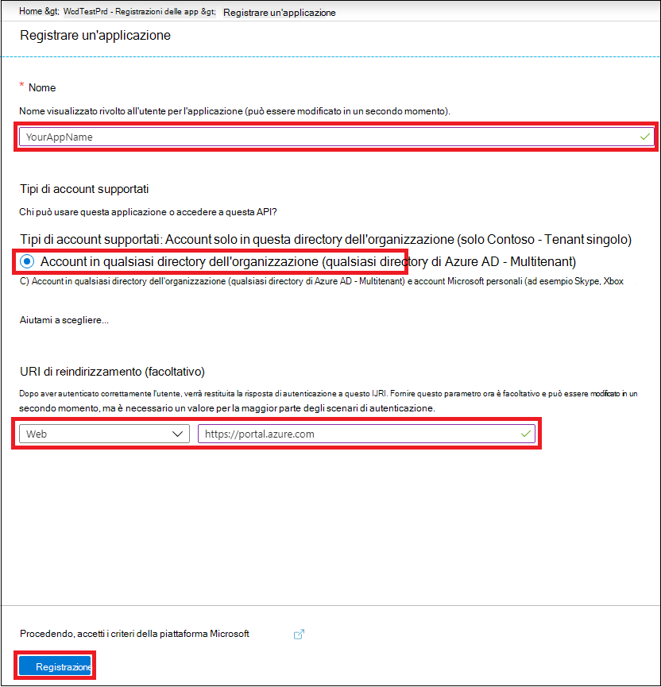
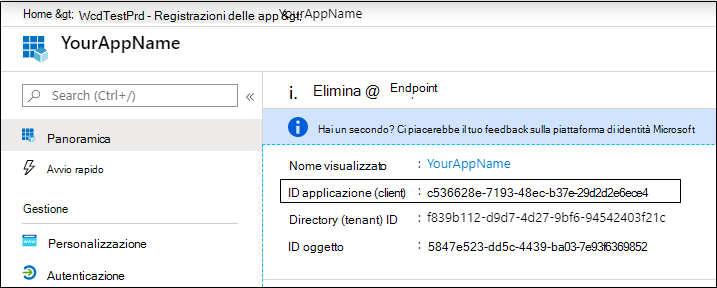
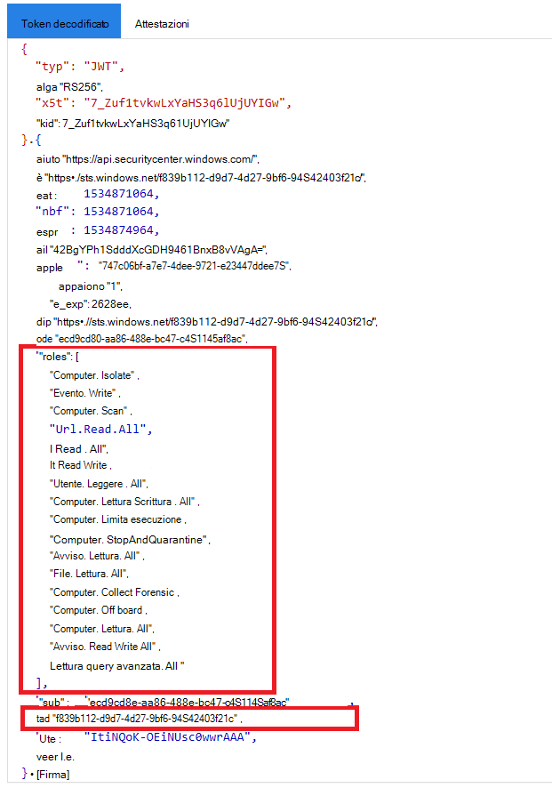

# <a name="partner-access-through-microsoft-defender-for-endpoint-apis"></a><span data-ttu-id="3e1d9-104">Accesso partner tramite LE API di Microsoft Defender for Endpoint</span><span class="sxs-lookup"><span data-stu-id="3e1d9-104">Partner access through Microsoft Defender for Endpoint APIs</span></span>

[!INCLUDE [Microsoft 365 Defender rebranding](../../includes/microsoft-defender.md)]


<span data-ttu-id="3e1d9-105">**Si applica a:** [Microsoft Defender for Endpoint](https://go.microsoft.com/fwlink/?linkid=2154037)</span><span class="sxs-lookup"><span data-stu-id="3e1d9-105">**Applies to:** [Microsoft Defender for Endpoint](https://go.microsoft.com/fwlink/?linkid=2154037)</span></span>

> <span data-ttu-id="3e1d9-106">Vuoi provare Microsoft Defender per Endpoint?</span><span class="sxs-lookup"><span data-stu-id="3e1d9-106">Want to experience Microsoft Defender for Endpoint?</span></span> [<span data-ttu-id="3e1d9-107">Iscriversi per una versione di valutazione gratuita.</span><span class="sxs-lookup"><span data-stu-id="3e1d9-107">Sign up for a free trial.</span></span>](https://www.microsoft.com/microsoft-365/windows/microsoft-defender-atp?ocid=docs-wdatp-exposedapis-abovefoldlink)

[!include[Microsoft Defender for Endpoint API URIs for US Government](../../includes/microsoft-defender-api-usgov.md)]

[!include[Improve request performance](../../includes/improve-request-performance.md)]

<span data-ttu-id="3e1d9-108">Questa pagina descrive come creare un'applicazione Azure Active Directory (Azure AD) per ottenere l'accesso programmatico a Microsoft Defender for Endpoint per conto dei clienti.</span><span class="sxs-lookup"><span data-stu-id="3e1d9-108">This page describes how to create an Azure Active Directory (Azure AD) application to get programmatic access to Microsoft Defender for Endpoint on behalf of your customers.</span></span>


<span data-ttu-id="3e1d9-109">Microsoft Defender for Endpoint espone gran parte dei dati e delle azioni tramite un set di API programmatiche.</span><span class="sxs-lookup"><span data-stu-id="3e1d9-109">Microsoft Defender for Endpoint exposes much of its data and actions through a set of programmatic APIs.</span></span> <span data-ttu-id="3e1d9-110">Queste API ti aiuteranno ad automatizzare i flussi di lavoro e a innovare in base alle funzionalità di Microsoft Defender for Endpoint.</span><span class="sxs-lookup"><span data-stu-id="3e1d9-110">Those APIs will help you automate work flows and innovate based on Microsoft Defender for Endpoint capabilities.</span></span> <span data-ttu-id="3e1d9-111">L'accesso API richiede l'autenticazione OAuth2.0.</span><span class="sxs-lookup"><span data-stu-id="3e1d9-111">The API access requires OAuth2.0 authentication.</span></span> <span data-ttu-id="3e1d9-112">Per ulteriori informazioni, vedere [OAuth 2.0 Authorization Code Flow](https://docs.microsoft.com/azure/active-directory/develop/active-directory-v2-protocols-oauth-code).</span><span class="sxs-lookup"><span data-stu-id="3e1d9-112">For more information, see [OAuth 2.0 Authorization Code Flow](https://docs.microsoft.com/azure/active-directory/develop/active-directory-v2-protocols-oauth-code).</span></span>

<span data-ttu-id="3e1d9-113">In generale, dovrai eseguire la procedura seguente per usare le API:</span><span class="sxs-lookup"><span data-stu-id="3e1d9-113">In general, you’ll need to take the following steps to use the APIs:</span></span>
- <span data-ttu-id="3e1d9-114">Creare un'applicazione Azure AD **multi-tenant.**</span><span class="sxs-lookup"><span data-stu-id="3e1d9-114">Create a **multi-tenant** Azure AD application.</span></span>
- <span data-ttu-id="3e1d9-115">Ottenere l'autorizzazione (consenso) dall'amministratore del cliente per l'applicazione per accedere alle risorse di Defender for Endpoint necessarie.</span><span class="sxs-lookup"><span data-stu-id="3e1d9-115">Get authorized(consent) by your customer administrator for your application to access Defender for Endpoint resources it needs.</span></span>
- <span data-ttu-id="3e1d9-116">Ottieni un token di accesso usando questa applicazione.</span><span class="sxs-lookup"><span data-stu-id="3e1d9-116">Get an access token using this application.</span></span>
- <span data-ttu-id="3e1d9-117">Usa il token per accedere all'API di Microsoft Defender for Endpoint.</span><span class="sxs-lookup"><span data-stu-id="3e1d9-117">Use the token to access Microsoft Defender for Endpoint API.</span></span>

<span data-ttu-id="3e1d9-118">La procedura seguente illustra come creare un'applicazione Azure AD, ottenere un token di accesso a Microsoft Defender for Endpoint e convalidare il token.</span><span class="sxs-lookup"><span data-stu-id="3e1d9-118">The following steps will guide you how to create an Azure AD application, get an access token to Microsoft Defender for Endpoint and validate the token.</span></span>

## <a name="create-the-multi-tenant-app"></a><span data-ttu-id="3e1d9-119">Creare l'app multi-tenant</span><span class="sxs-lookup"><span data-stu-id="3e1d9-119">Create the multi-tenant app</span></span>

1. <span data-ttu-id="3e1d9-120">Accedere al [tenant di Azure](https://portal.azure.com) con l'utente con **ruolo amministratore** globale.</span><span class="sxs-lookup"><span data-stu-id="3e1d9-120">Sign in to your [Azure tenant](https://portal.azure.com) with user that has **Global Administrator** role.</span></span>

2. <span data-ttu-id="3e1d9-121">Passare **a** Azure Active Directory  >  **app Nuove**  >  **registrazioni**.</span><span class="sxs-lookup"><span data-stu-id="3e1d9-121">Navigate to **Azure Active Directory** > **App registrations** > **New registration**.</span></span> 

   

3. <span data-ttu-id="3e1d9-123">Nel modulo di registrazione:</span><span class="sxs-lookup"><span data-stu-id="3e1d9-123">In the registration form:</span></span>

    - <span data-ttu-id="3e1d9-124">Scegliere un nome per l'applicazione.</span><span class="sxs-lookup"><span data-stu-id="3e1d9-124">Choose a name for your application.</span></span>

    - <span data-ttu-id="3e1d9-125">Tipi di account supportati: account in qualsiasi directory dell'organizzazione.</span><span class="sxs-lookup"><span data-stu-id="3e1d9-125">Supported account types - accounts in any organizational directory.</span></span>

    - <span data-ttu-id="3e1d9-126">URI di reindirizzamento - tipo: Web, URI: https://portal.azure.com</span><span class="sxs-lookup"><span data-stu-id="3e1d9-126">Redirect URI - type: Web, URI: https://portal.azure.com</span></span>

    


4. <span data-ttu-id="3e1d9-128">Consenti all'applicazione di accedere a Microsoft Defender per Endpoint e assegnarla con il set minimo di autorizzazioni necessarie per completare l'integrazione.</span><span class="sxs-lookup"><span data-stu-id="3e1d9-128">Allow your Application to access Microsoft Defender for Endpoint and assign it with the minimal set of permissions required to complete the integration.</span></span>

   - <span data-ttu-id="3e1d9-129">Nella pagina dell'applicazione seleziona **Autorizzazioni API** Aggiungi API di autorizzazione che l'organizzazione usa >  >    >   **digitare WindowsDefenderATP** e selezionare **in WindowsDefenderATP.**</span><span class="sxs-lookup"><span data-stu-id="3e1d9-129">On your application page, select **API Permissions** > **Add permission** > **APIs my organization uses** > type **WindowsDefenderATP** and select on **WindowsDefenderATP**.</span></span>

   - <span data-ttu-id="3e1d9-130">**Nota:** *WindowsDefenderATP* non viene visualizzato nell'elenco originale.</span><span class="sxs-lookup"><span data-stu-id="3e1d9-130">**Note**: *WindowsDefenderATP* does not appear in the original list.</span></span> <span data-ttu-id="3e1d9-131">Iniziare a scrivere il nome nella casella di testo per visualizzarlo.</span><span class="sxs-lookup"><span data-stu-id="3e1d9-131">Start writing its name in the text box to see it appear.</span></span>

   
   
   ### <a name="request-api-permissions"></a><span data-ttu-id="3e1d9-133">Richiedere autorizzazioni API</span><span class="sxs-lookup"><span data-stu-id="3e1d9-133">Request API permissions</span></span>

   <span data-ttu-id="3e1d9-134">Per determinare l'autorizzazione necessaria, esamina la **sezione Autorizzazioni** nell'API che vuoi chiamare.</span><span class="sxs-lookup"><span data-stu-id="3e1d9-134">To determine which permission you need, review the **Permissions** section in the API you are interested to call.</span></span> <span data-ttu-id="3e1d9-135">Ad esempio:</span><span class="sxs-lookup"><span data-stu-id="3e1d9-135">For instance:</span></span>

   - <span data-ttu-id="3e1d9-136">Per [eseguire query avanzate,](run-advanced-query-api.md)selezionare l'autorizzazione "Esegui query avanzate"</span><span class="sxs-lookup"><span data-stu-id="3e1d9-136">To [run advanced queries](run-advanced-query-api.md), select 'Run advanced queries' permission</span></span>
   
   - <span data-ttu-id="3e1d9-137">Per [isolare un dispositivo,](isolate-machine.md)selezionare l'autorizzazione "Isola computer"</span><span class="sxs-lookup"><span data-stu-id="3e1d9-137">To [isolate a device](isolate-machine.md), select 'Isolate machine' permission</span></span>

   <span data-ttu-id="3e1d9-138">Nell'esempio seguente verrà utilizzata **l'autorizzazione "Read all alerts":**</span><span class="sxs-lookup"><span data-stu-id="3e1d9-138">In the following example we will use **'Read all alerts'** permission:</span></span>

   <span data-ttu-id="3e1d9-139">Choose **Application permissions**  >  **Alert.Read.All >** select on Add **permissions**</span><span class="sxs-lookup"><span data-stu-id="3e1d9-139">Choose **Application permissions** > **Alert.Read.All** > select on **Add permissions**</span></span>

   


5. <span data-ttu-id="3e1d9-141">Selezionare **Concedi consenso**</span><span class="sxs-lookup"><span data-stu-id="3e1d9-141">Select **Grant consent**</span></span>

    - <span data-ttu-id="3e1d9-142">**Nota:** ogni volta che aggiungi l'autorizzazione, devi selezionare Concedi **il** consenso perché la nuova autorizzazione sia effettiva.</span><span class="sxs-lookup"><span data-stu-id="3e1d9-142">**Note**: Every time you add permission you must select on **Grant consent** for the new permission to take effect.</span></span>

    

6. <span data-ttu-id="3e1d9-144">Aggiungere un segreto all'applicazione.</span><span class="sxs-lookup"><span data-stu-id="3e1d9-144">Add a secret to the application.</span></span>

    - <span data-ttu-id="3e1d9-145">Selezionare **Certificati & segreti**, aggiungere una descrizione al segreto e selezionare **Aggiungi**.</span><span class="sxs-lookup"><span data-stu-id="3e1d9-145">Select **Certificates & secrets**, add description to the secret and select **Add**.</span></span>

    <span data-ttu-id="3e1d9-146">**Importante:** dopo aver fatto clic su Aggiungi, **copia il valore segreto generato.**</span><span class="sxs-lookup"><span data-stu-id="3e1d9-146">**Important**: After click Add, **copy the generated secret value**.</span></span> <span data-ttu-id="3e1d9-147">Non sarà possibile recuperare dopo aver lasciato!</span><span class="sxs-lookup"><span data-stu-id="3e1d9-147">You won't be able to retrieve after you leave!</span></span>

    

7. <span data-ttu-id="3e1d9-149">Annota l'ID applicazione:</span><span class="sxs-lookup"><span data-stu-id="3e1d9-149">Write down your application ID:</span></span>

   - <span data-ttu-id="3e1d9-150">Nella pagina dell'applicazione passare a **Panoramica** e copiare le informazioni seguenti:</span><span class="sxs-lookup"><span data-stu-id="3e1d9-150">On your application page, go to **Overview** and copy the following information:</span></span>

   

8. <span data-ttu-id="3e1d9-152">Aggiungere l'applicazione al tenant del cliente.</span><span class="sxs-lookup"><span data-stu-id="3e1d9-152">Add the application to your customer's tenant.</span></span>

    <span data-ttu-id="3e1d9-153">È necessario che l'applicazione sia approvata in ogni tenant del cliente in cui si intende usarla.</span><span class="sxs-lookup"><span data-stu-id="3e1d9-153">You need your application to be approved in each customer tenant where you intend to use it.</span></span> <span data-ttu-id="3e1d9-154">Questo perché l'applicazione interagisce con l'applicazione Microsoft Defender for Endpoint per conto del cliente.</span><span class="sxs-lookup"><span data-stu-id="3e1d9-154">This is because your application interacts with Microsoft Defender for Endpoint application on behalf of your customer.</span></span>

    <span data-ttu-id="3e1d9-155">Un utente con **amministratore globale** dal tenant del cliente deve selezionare il collegamento di consenso e approvare l'applicazione.</span><span class="sxs-lookup"><span data-stu-id="3e1d9-155">A user with **Global Administrator** from your customer's tenant need to select the consent link and approve your application.</span></span>

    <span data-ttu-id="3e1d9-156">Il collegamento consenso ha il formato seguente:</span><span class="sxs-lookup"><span data-stu-id="3e1d9-156">Consent link is of the form:</span></span>

    ```
    https://login.microsoftonline.com/common/oauth2/authorize?prompt=consent&client_id=00000000-0000-0000-0000-000000000000&response_type=code&sso_reload=true
    ```

    <span data-ttu-id="3e1d9-157">Dove 000000000-0000-0000-0000-000000000000 deve essere sostituito con l'ID applicazione</span><span class="sxs-lookup"><span data-stu-id="3e1d9-157">Where 00000000-0000-0000-0000-000000000000 should be replaced with your Application ID</span></span>

    <span data-ttu-id="3e1d9-158">Dopo aver fatto clic sul collegamento di consenso, accedere con l'amministratore globale del tenant del cliente e acconsentire all'applicazione.</span><span class="sxs-lookup"><span data-stu-id="3e1d9-158">After clicking on the consent link, sign in with the Global Administrator of the customer's tenant and consent the application.</span></span>

    

    <span data-ttu-id="3e1d9-160">Inoltre, dovrai chiedere al cliente l'ID tenant e salvarlo per un uso futuro durante l'acquisizione del token.</span><span class="sxs-lookup"><span data-stu-id="3e1d9-160">In addition, you will need to ask your customer for their tenant ID and save it for future use when acquiring the token.</span></span>

- <span data-ttu-id="3e1d9-161">**Fatto!**</span><span class="sxs-lookup"><span data-stu-id="3e1d9-161">**Done!**</span></span> <span data-ttu-id="3e1d9-162">L'applicazione è stata registrata correttamente.</span><span class="sxs-lookup"><span data-stu-id="3e1d9-162">You have successfully registered an application!</span></span> 
- <span data-ttu-id="3e1d9-163">Vedi gli esempi seguenti per l'acquisizione e la convalida di token.</span><span class="sxs-lookup"><span data-stu-id="3e1d9-163">See examples below for token acquisition and validation.</span></span>

## <a name="get-an-access-token-example"></a><span data-ttu-id="3e1d9-164">Ottenere un esempio di token di accesso:</span><span class="sxs-lookup"><span data-stu-id="3e1d9-164">Get an access token example:</span></span>

<span data-ttu-id="3e1d9-165">**Nota:** Per ottenere il token di accesso per conto del cliente, usa l'ID tenant del cliente nelle acquisizioni di token seguenti.</span><span class="sxs-lookup"><span data-stu-id="3e1d9-165">**Note:** To get access token on behalf of your customer, use the customer's tenant ID on the following token acquisitions.</span></span>

<br><span data-ttu-id="3e1d9-166">Per altre informazioni sul token AAD, vedi Esercitazione [su AAD](https://docs.microsoft.com/azure/active-directory/develop/active-directory-v2-protocols-oauth-client-creds)</span><span class="sxs-lookup"><span data-stu-id="3e1d9-166">For more information on AAD token, see [AAD tutorial](https://docs.microsoft.com/azure/active-directory/develop/active-directory-v2-protocols-oauth-client-creds)</span></span>

### <a name="using-powershell"></a><span data-ttu-id="3e1d9-167">Utilizzo di PowerShell</span><span class="sxs-lookup"><span data-stu-id="3e1d9-167">Using PowerShell</span></span>

```
# That code gets the App Context Token and save it to a file named "Latest-token.txt" under the current directory
# Paste below your Tenant ID, App ID and App Secret (App key).

$tenantId = '' ### Paste your tenant ID here
$appId = '' ### Paste your Application ID here
$appSecret = '' ### Paste your Application key here

$resourceAppIdUri = 'https://api.securitycenter.microsoft.com'
$oAuthUri = "https://login.microsoftonline.com/$TenantId/oauth2/token"
$authBody = [Ordered] @{
    resource = "$resourceAppIdUri"
    client_id = "$appId"
    client_secret = "$appSecret"
    grant_type = 'client_credentials'
}
$authResponse = Invoke-RestMethod -Method Post -Uri $oAuthUri -Body $authBody -ErrorAction Stop
$token = $authResponse.access_token
Out-File -FilePath "./Latest-token.txt" -InputObject $token
return $token
```

### <a name="using-c"></a><span data-ttu-id="3e1d9-168">Utilizzo C#:</span><span class="sxs-lookup"><span data-stu-id="3e1d9-168">Using C#:</span></span>

><span data-ttu-id="3e1d9-169">Il codice seguente è stato testato con Nuget Microsoft.IdentityModel.Clients.ActiveDirectory</span><span class="sxs-lookup"><span data-stu-id="3e1d9-169">The below code was tested with Nuget Microsoft.IdentityModel.Clients.ActiveDirectory</span></span>

- <span data-ttu-id="3e1d9-170">Creare una nuova applicazione console</span><span class="sxs-lookup"><span data-stu-id="3e1d9-170">Create a new Console Application</span></span>
- <span data-ttu-id="3e1d9-171">Installare NuGet [Microsoft.IdentityModel.Clients.ActiveDirectory](https://www.nuget.org/packages/Microsoft.IdentityModel.Clients.ActiveDirectory/)</span><span class="sxs-lookup"><span data-stu-id="3e1d9-171">Install NuGet [Microsoft.IdentityModel.Clients.ActiveDirectory](https://www.nuget.org/packages/Microsoft.IdentityModel.Clients.ActiveDirectory/)</span></span>
- <span data-ttu-id="3e1d9-172">Aggiungi gli elementi seguenti usando</span><span class="sxs-lookup"><span data-stu-id="3e1d9-172">Add the below using</span></span>

    ```
    using Microsoft.IdentityModel.Clients.ActiveDirectory;
    ```

- <span data-ttu-id="3e1d9-173">Copia/Incolla il codice seguente nell'applicazione (non dimenticare di aggiornare le tre variabili: ```tenantId, appId, appSecret``` )</span><span class="sxs-lookup"><span data-stu-id="3e1d9-173">Copy/Paste the below code in your application (do not forget to update the three variables: ```tenantId, appId, appSecret```)</span></span>

    ```
    string tenantId = "00000000-0000-0000-0000-000000000000"; // Paste your own tenant ID here
    string appId = "11111111-1111-1111-1111-111111111111"; // Paste your own app ID here
    string appSecret = "22222222-2222-2222-2222-222222222222"; // Paste your own app secret here for a test, and then store it in a safe place! 

    const string authority = "https://login.microsoftonline.com";
    const string wdatpResourceId = "https://api.securitycenter.microsoft.com";

    AuthenticationContext auth = new AuthenticationContext($"{authority}/{tenantId}/");
    ClientCredential clientCredential = new ClientCredential(appId, appSecret);
    AuthenticationResult authenticationResult = auth.AcquireTokenAsync(wdatpResourceId, clientCredential).GetAwaiter().GetResult();
    string token = authenticationResult.AccessToken;
    ```


### <a name="using-python"></a><span data-ttu-id="3e1d9-174">Uso di Python</span><span class="sxs-lookup"><span data-stu-id="3e1d9-174">Using Python</span></span>

<span data-ttu-id="3e1d9-175">Fare riferimento [a Get token using Python](run-advanced-query-sample-python.md#get-token)</span><span class="sxs-lookup"><span data-stu-id="3e1d9-175">Refer to [Get token using Python](run-advanced-query-sample-python.md#get-token)</span></span>

### <a name="using-curl"></a><span data-ttu-id="3e1d9-176">Uso di Curl</span><span class="sxs-lookup"><span data-stu-id="3e1d9-176">Using Curl</span></span>

> [!NOTE]
> <span data-ttu-id="3e1d9-177">La procedura seguente dovrebbe Essere arricciata per Windows è già installata nel computer</span><span class="sxs-lookup"><span data-stu-id="3e1d9-177">The below procedure supposed Curl for Windows is already installed on your computer</span></span>

- <span data-ttu-id="3e1d9-178">Aprire una finestra di comando</span><span class="sxs-lookup"><span data-stu-id="3e1d9-178">Open a command window</span></span>
- <span data-ttu-id="3e1d9-179">Impostare CLIENT_ID l'ID applicazione Azure</span><span class="sxs-lookup"><span data-stu-id="3e1d9-179">Set CLIENT_ID to your Azure application ID</span></span>
- <span data-ttu-id="3e1d9-180">Impostare CLIENT_SECRET segreto dell'applicazione Azure</span><span class="sxs-lookup"><span data-stu-id="3e1d9-180">Set CLIENT_SECRET to your Azure application secret</span></span>
- <span data-ttu-id="3e1d9-181">Impostare TENANT_ID sull'ID tenant di Azure del cliente che vuole usare l'applicazione per accedere all'applicazione Microsoft Defender for Endpoint</span><span class="sxs-lookup"><span data-stu-id="3e1d9-181">Set TENANT_ID to the Azure tenant ID of the customer that wants to use your application to access Microsoft Defender for Endpoint application</span></span>
- <span data-ttu-id="3e1d9-182">Eseguire il comando seguente:</span><span class="sxs-lookup"><span data-stu-id="3e1d9-182">Run the below command:</span></span>

```
curl -i -X POST -H "Content-Type:application/x-www-form-urlencoded" -d "grant_type=client_credentials" -d "client_id=%CLIENT_ID%" -d "scope=https://securitycenter.onmicrosoft.com/windowsatpservice/.default" -d "client_secret=%CLIENT_SECRET%" "https://login.microsoftonline.com/%TENANT_ID%/oauth2/v2.0/token" -k
```

<span data-ttu-id="3e1d9-183">Si otterrà una risposta nel modulo:</span><span class="sxs-lookup"><span data-stu-id="3e1d9-183">You will get an answer of the form:</span></span>

```
{"token_type":"Bearer","expires_in":3599,"ext_expires_in":0,"access_token":"eyJ0eXAiOiJKV1QiLCJhbGciOiJSUzI1NiIsIn <truncated> aWReH7P0s0tjTBX8wGWqJUdDA"}
```

## <a name="validate-the-token"></a><span data-ttu-id="3e1d9-184">Convalidare il token</span><span class="sxs-lookup"><span data-stu-id="3e1d9-184">Validate the token</span></span>

<span data-ttu-id="3e1d9-185">Verifica della sanità mentale per assicurarti di avere un token corretto:</span><span class="sxs-lookup"><span data-stu-id="3e1d9-185">Sanity check to make sure you got a correct token:</span></span>
- <span data-ttu-id="3e1d9-186">Copia/incolla in [JWT](https://jwt.ms) il token che ottieni nel passaggio precedente per decodificarlo</span><span class="sxs-lookup"><span data-stu-id="3e1d9-186">Copy/paste into [JWT](https://jwt.ms) the token you get in the previous step in order to decode it</span></span>
- <span data-ttu-id="3e1d9-187">Verificare di ottenere un'attestazione "ruoli" con le autorizzazioni desiderate</span><span class="sxs-lookup"><span data-stu-id="3e1d9-187">Validate you get a 'roles' claim with the desired permissions</span></span>
- <span data-ttu-id="3e1d9-188">Nello screenshot seguente puoi vedere un token decodificato acquisito da un'applicazione con più autorizzazioni per Microsoft Defender per Endpoint:</span><span class="sxs-lookup"><span data-stu-id="3e1d9-188">In the screenshot below, you can see a decoded token acquired from an Application with multiple permissions to  Microsoft Defender for Endpoint:</span></span>
- <span data-ttu-id="3e1d9-189">L'attestazione "tid" è l'ID tenant a cui appartiene il token.</span><span class="sxs-lookup"><span data-stu-id="3e1d9-189">The "tid" claim is the tenant ID the token belongs to.</span></span>



## <a name="use-the-token-to-access-microsoft-defender-for-endpoint-api"></a><span data-ttu-id="3e1d9-191">Usare il token per accedere all'API di Microsoft Defender for Endpoint</span><span class="sxs-lookup"><span data-stu-id="3e1d9-191">Use the token to access Microsoft Defender for Endpoint API</span></span>

- <span data-ttu-id="3e1d9-192">Scegli l'API che vuoi usare, per altre informazioni, vedi [Api supportate di Microsoft Defender per endpoint](exposed-apis-list.md)</span><span class="sxs-lookup"><span data-stu-id="3e1d9-192">Choose the API you want to use, for more information, see [Supported Microsoft Defender for Endpoint APIs](exposed-apis-list.md)</span></span>
- <span data-ttu-id="3e1d9-193">Imposta l'intestazione Authorization nella richiesta Http inviata a "Bearer {token}" (Bearer è lo schema di autorizzazione)</span><span class="sxs-lookup"><span data-stu-id="3e1d9-193">Set the Authorization header in the Http request you send to "Bearer {token}" (Bearer is the Authorization scheme)</span></span>
- <span data-ttu-id="3e1d9-194">La scadenza del token è di 1 ora (è possibile inviare più di una richiesta con lo stesso token)</span><span class="sxs-lookup"><span data-stu-id="3e1d9-194">The Expiration time of the token is 1 hour (you can send more than one request with the same token)</span></span>

- <span data-ttu-id="3e1d9-195">Esempio di invio di una richiesta per ottenere un elenco di avvisi **tramite C#**</span><span class="sxs-lookup"><span data-stu-id="3e1d9-195">Example of sending a request to get a list of alerts **using C#**</span></span> 
    ```
    var httpClient = new HttpClient();

    var request = new HttpRequestMessage(HttpMethod.Get, "https://api.securitycenter.microsoft.com/api/alerts");

    request.Headers.Authorization = new AuthenticationHeaderValue("Bearer", token);

    var response = httpClient.SendAsync(request).GetAwaiter().GetResult();

    // Do something useful with the response
    ```

## <a name="see-also"></a><span data-ttu-id="3e1d9-196">Vedere anche</span><span class="sxs-lookup"><span data-stu-id="3e1d9-196">See also</span></span>
- [<span data-ttu-id="3e1d9-197">Accedere a API di Microsoft Defender per endpoint</span><span class="sxs-lookup"><span data-stu-id="3e1d9-197">Supported Microsoft Defender for Endpoint APIs</span></span>](exposed-apis-list.md)
- [<span data-ttu-id="3e1d9-198">Accedere a Microsoft Defender for Endpoint per conto di un utente</span><span class="sxs-lookup"><span data-stu-id="3e1d9-198">Access Microsoft Defender for Endpoint on behalf of a user</span></span>](exposed-apis-create-app-nativeapp.md)
