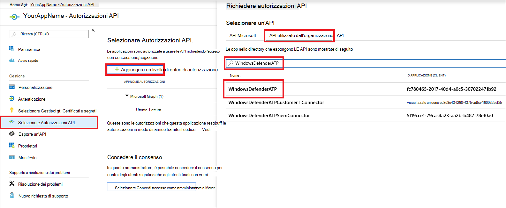
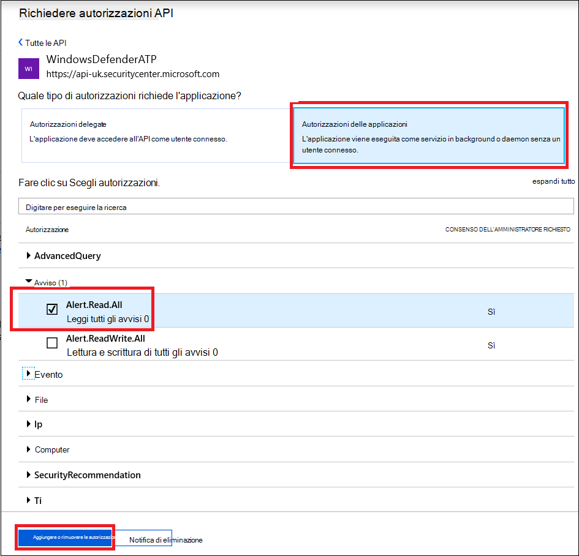
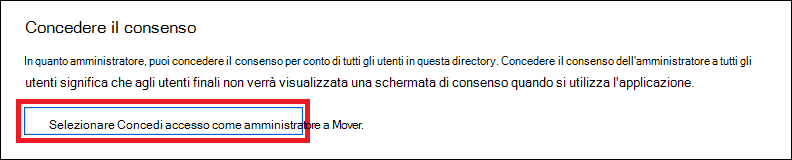
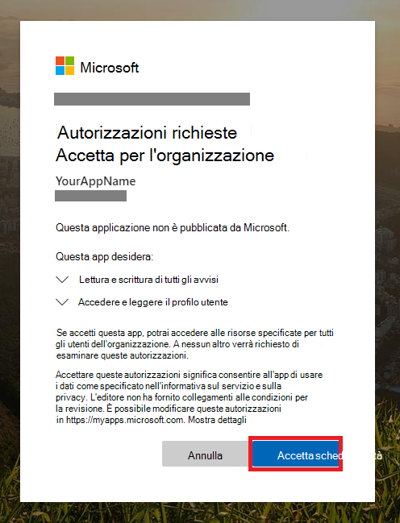

# <a name="partner-access-through-microsoft-defender-for-endpoint-apis"></a>Accesso partner tramite LE API di Microsoft Defender for Endpoint

[!INCLUDE [Microsoft 365 Defender rebranding](../../includes/microsoft-defender.md)]


**Si applica a:** [Microsoft Defender for Endpoint](https://go.microsoft.com/fwlink/?linkid=2154037)

> Vuoi provare Microsoft Defender per Endpoint? [Iscriversi per una versione di valutazione gratuita.](https://www.microsoft.com/microsoft-365/windows/microsoft-defender-atp?ocid=docs-wdatp-exposedapis-abovefoldlink)

[!include[Microsoft Defender for Endpoint API URIs for US Government](../../includes/microsoft-defender-api-usgov.md)]

[!include[Improve request performance](../../includes/improve-request-performance.md)]

Questa pagina descrive come creare un'applicazione Azure Active Directory (Azure AD) per ottenere l'accesso programmatico a Microsoft Defender per Endpoint per conto dei clienti.


Microsoft Defender for Endpoint espone gran parte dei dati e delle azioni tramite un set di API programmatiche. Queste API ti aiuteranno ad automatizzare i flussi di lavoro e a innovare in base alle funzionalità di Microsoft Defender for Endpoint. L'accesso API richiede l'autenticazione OAuth2.0. Per ulteriori informazioni, vedere Flusso del codice di autorizzazione [OAuth 2.0.](https://docs.microsoft.com/azure/active-directory/develop/active-directory-v2-protocols-oauth-code)

In generale, dovrai eseguire la procedura seguente per usare le API:
- Creare un'applicazione Azure AD **multi-tenant.**
- Ottenere l'autorizzazione (consenso) dall'amministratore del cliente per l'applicazione per accedere alle risorse di Defender for Endpoint necessarie.
- Ottieni un token di accesso usando questa applicazione.
- Usa il token per accedere all'API di Microsoft Defender for Endpoint.

La procedura seguente illustra come creare un'applicazione Azure AD, ottenere un token di accesso a Microsoft Defender for Endpoint e convalidare il token.

## <a name="create-the-multi-tenant-app"></a>Creare l'app multi-tenant

1. Accedere al [tenant di Azure](https://portal.azure.com) con l'utente con **ruolo amministratore** globale.

2. Passare ad **Azure Active Directory** App  >  **registrations** Nuova  >  **registrazione**. 

   

3. Nel modulo di registrazione:

    - Scegliere un nome per l'applicazione.

    - Tipi di account supportati: account in qualsiasi directory dell'organizzazione.

    - URI di reindirizzamento - tipo: Web, URI: https://portal.azure.com

    


4. Consenti all'applicazione di accedere a Microsoft Defender per Endpoint e assegnarla con il set minimo di autorizzazioni necessarie per completare l'integrazione.

   - Nella pagina dell'applicazione seleziona **Autorizzazioni API** Aggiungi API di autorizzazione che l'organizzazione usa >  >    >   **digitare WindowsDefenderATP** e selezionare **in WindowsDefenderATP.**

   - **Nota:** *WindowsDefenderATP* non viene visualizzato nell'elenco originale. Iniziare a scrivere il nome nella casella di testo per visualizzarlo.

   
   
   ### <a name="request-api-permissions"></a>Richiedere autorizzazioni API

   Per determinare l'autorizzazione necessaria, esamina la **sezione Autorizzazioni** nell'API che vuoi chiamare. Ad esempio:

   - Per [eseguire query avanzate,](run-advanced-query-api.md)selezionare l'autorizzazione "Esegui query avanzate"
   
   - Per [isolare un dispositivo,](isolate-machine.md)selezionare l'autorizzazione "Isola computer"

   Nell'esempio seguente verrà utilizzata **l'autorizzazione "Read all alerts":**

   Choose **Application permissions**  >  **Alert.Read.All >** select on Add **permissions**

   


5. Selezionare **Concedi consenso**

    - **Nota:** ogni volta che aggiungi l'autorizzazione, devi selezionare Concedi **il** consenso perché la nuova autorizzazione sia effettiva.

    

6. Aggiungere un segreto all'applicazione.

    - Selezionare **Certificati & segreti**, aggiungere una descrizione al segreto e selezionare **Aggiungi**.

    **Importante:** dopo aver fatto clic su Aggiungi, **copia il valore segreto generato.** Non sarà possibile recuperare dopo aver lasciato!

    

7. Annota l'ID applicazione:

   - Nella pagina dell'applicazione passare a **Panoramica** e copiare le informazioni seguenti:

   

8. Aggiungere l'applicazione al tenant del cliente.

    È necessario che l'applicazione sia approvata in ogni tenant del cliente in cui si intende usarla. Questo perché l'applicazione interagisce con l'applicazione Microsoft Defender for Endpoint per conto del cliente.

    Un utente con **amministratore globale** dal tenant del cliente deve selezionare il collegamento di consenso e approvare l'applicazione.

    Il collegamento consenso ha il formato seguente:

    ```
    https://login.microsoftonline.com/common/oauth2/authorize?prompt=consent&client_id=00000000-0000-0000-0000-000000000000&response_type=code&sso_reload=true
    ```

    Dove 000000000-0000-0000-0000-000000000000 deve essere sostituito con l'ID applicazione

    Dopo aver fatto clic sul collegamento di consenso, accedere con l'amministratore globale del tenant del cliente e acconsentire all'applicazione.

    

    Inoltre, dovrai chiedere al cliente l'ID tenant e salvarlo per un uso futuro durante l'acquisizione del token.

- **Fatto!** L'applicazione è stata registrata correttamente. 
- Vedi gli esempi seguenti per l'acquisizione e la convalida di token.

## <a name="get-an-access-token-example"></a>Ottenere un esempio di token di accesso:

**Nota:** Per ottenere il token di accesso per conto del cliente, usa l'ID tenant del cliente nelle acquisizioni di token seguenti.

<br>Per altre informazioni sul token AAD, vedi Esercitazione [su AAD](https://docs.microsoft.com/azure/active-directory/develop/active-directory-v2-protocols-oauth-client-creds)

### <a name="using-powershell"></a>Utilizzo di PowerShell

```
# That code gets the App Context Token and save it to a file named "Latest-token.txt" under the current directory
# Paste below your Tenant ID, App ID and App Secret (App key).

$tenantId = '' ### Paste your tenant ID here
$appId = '' ### Paste your Application ID here
$appSecret = '' ### Paste your Application key here

$resourceAppIdUri = 'https://api.securitycenter.microsoft.com'
$oAuthUri = "https://login.microsoftonline.com/$TenantId/oauth2/token"
$authBody = [Ordered] @{
    resource = "$resourceAppIdUri"
    client_id = "$appId"
    client_secret = "$appSecret"
    grant_type = 'client_credentials'
}
$authResponse = Invoke-RestMethod -Method Post -Uri $oAuthUri -Body $authBody -ErrorAction Stop
$token = $authResponse.access_token
Out-File -FilePath "./Latest-token.txt" -InputObject $token
return $token
```

### <a name="using-c"></a>Utilizzo C#:

>Il codice seguente è stato testato con Nuget Microsoft.IdentityModel.Clients.ActiveDirectory

- Creare una nuova applicazione console
- Installare NuGet [Microsoft.IdentityModel.Clients.ActiveDirectory](https://www.nuget.org/packages/Microsoft.IdentityModel.Clients.ActiveDirectory/)
- Aggiungi gli elementi seguenti usando

    ```
    using Microsoft.IdentityModel.Clients.ActiveDirectory;
    ```

- Copia/Incolla il codice seguente nell'applicazione (non dimenticare di aggiornare le tre variabili: ```tenantId, appId, appSecret``` )

    ```
    string tenantId = "00000000-0000-0000-0000-000000000000"; // Paste your own tenant ID here
    string appId = "11111111-1111-1111-1111-111111111111"; // Paste your own app ID here
    string appSecret = "22222222-2222-2222-2222-222222222222"; // Paste your own app secret here for a test, and then store it in a safe place! 

    const string authority = "https://login.microsoftonline.com";
    const string wdatpResourceId = "https://api.securitycenter.microsoft.com";

    AuthenticationContext auth = new AuthenticationContext($"{authority}/{tenantId}/");
    ClientCredential clientCredential = new ClientCredential(appId, appSecret);
    AuthenticationResult authenticationResult = auth.AcquireTokenAsync(wdatpResourceId, clientCredential).GetAwaiter().GetResult();
    string token = authenticationResult.AccessToken;
    ```


### <a name="using-python"></a>Uso di Python

Fare riferimento [a Get token using Python](run-advanced-query-sample-python.md#get-token)

### <a name="using-curl"></a>Uso di Curl

> [!NOTE]
> Nel computer è già installata la procedura seguente:

- Aprire una finestra di comando
- Impostare CLIENT_ID l'ID applicazione Azure
- Impostare CLIENT_SECRET segreto dell'applicazione Azure
- Impostare TENANT_ID sull'ID tenant di Azure del cliente che vuole usare l'applicazione per accedere all'applicazione Microsoft Defender for Endpoint
- Eseguire il comando seguente:

```
curl -i -X POST -H "Content-Type:application/x-www-form-urlencoded" -d "grant_type=client_credentials" -d "client_id=%CLIENT_ID%" -d "scope=https://securitycenter.onmicrosoft.com/windowsatpservice/.default" -d "client_secret=%CLIENT_SECRET%" "https://login.microsoftonline.com/%TENANT_ID%/oauth2/v2.0/token" -k
```

Si otterrà una risposta nel modulo:

```
{"token_type":"Bearer","expires_in":3599,"ext_expires_in":0,"access_token":"eyJ0eXAiOiJKV1QiLCJhbGciOiJSUzI1NiIsIn <truncated> aWReH7P0s0tjTBX8wGWqJUdDA"}
```

## <a name="validate-the-token"></a>Convalidare il token

Verifica della sanità mentale per assicurarti di avere un token corretto:
- Copia/incolla in [JWT](https://jwt.ms) il token che ottieni nel passaggio precedente per decodificarlo
- Verificare di ottenere un'attestazione "ruoli" con le autorizzazioni desiderate
- Nello screenshot seguente puoi vedere un token decodificato acquisito da un'applicazione con più autorizzazioni per Microsoft Defender per Endpoint:
- L'attestazione "tid" è l'ID tenant a cui appartiene il token.


## <a name="use-the-token-to-access-microsoft-defender-for-endpoint-api"></a>Usare il token per accedere all'API di Microsoft Defender for Endpoint

- Scegli l'API che vuoi usare, per altre informazioni, vedi [Api supportate di Microsoft Defender per endpoint](exposed-apis-list.md)
- Imposta l'intestazione Authorization nella richiesta Http inviata a "Bearer {token}" (Bearer è lo schema di autorizzazione)
- La scadenza del token è di 1 ora (è possibile inviare più di una richiesta con lo stesso token)

- Esempio di invio di una richiesta per ottenere un elenco di avvisi **tramite C#** 
    ```
    var httpClient = new HttpClient();

    var request = new HttpRequestMessage(HttpMethod.Get, "https://api.securitycenter.microsoft.com/api/alerts");

    request.Headers.Authorization = new AuthenticationHeaderValue("Bearer", token);

    var response = httpClient.SendAsync(request).GetAwaiter().GetResult();

    // Do something useful with the response
    ```

## <a name="see-also"></a>Vedere anche
- [API di Microsoft Defender per endpoint supportate](exposed-apis-list.md)
- [Accedere a Microsoft Defender for Endpoint per conto di un utente](exposed-apis-create-app-nativeapp.md)
