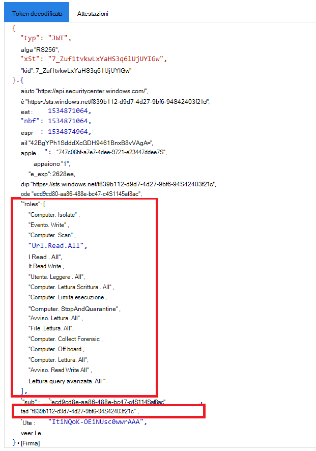

# <a name="create-an-app-to-access-microsoft-defender-for-endpoint-without-a-user"></a><span data-ttu-id="220f9-104">Creare un'app per accedere a Microsoft Defender for Endpoint senza un utente</span><span class="sxs-lookup"><span data-stu-id="220f9-104">Create an app to access Microsoft Defender for Endpoint without a user</span></span>

[!INCLUDE [Microsoft 365 Defender rebranding](../../includes/microsoft-defender.md)]


<span data-ttu-id="220f9-105">**Si applica a:** [Microsoft Defender for Endpoint](https://go.microsoft.com/fwlink/?linkid=2154037)</span><span class="sxs-lookup"><span data-stu-id="220f9-105">**Applies to:** [Microsoft Defender for Endpoint](https://go.microsoft.com/fwlink/?linkid=2154037)</span></span>

- <span data-ttu-id="220f9-106">Vuoi provare Microsoft Defender per Endpoint?</span><span class="sxs-lookup"><span data-stu-id="220f9-106">Want to experience Microsoft Defender for Endpoint?</span></span> [<span data-ttu-id="220f9-107">Iscriversi per una versione di valutazione gratuita.</span><span class="sxs-lookup"><span data-stu-id="220f9-107">Sign up for a free trial.</span></span>](https://www.microsoft.com/microsoft-365/windows/microsoft-defender-atp?ocid=docs-wdatp-exposedapis-abovefoldlink)

[!include[Microsoft Defender for Endpoint API URIs for US Government](../../includes/microsoft-defender-api-usgov.md)]

[!include[Improve request performance](../../includes/improve-request-performance.md)]

<span data-ttu-id="220f9-108">Questa pagina descrive come creare un'applicazione per ottenere l'accesso a livello di codice a Defender per Endpoint senza un utente.</span><span class="sxs-lookup"><span data-stu-id="220f9-108">This page describes how to create an application to get programmatic access to Defender for Endpoint without a user.</span></span> <span data-ttu-id="220f9-109">Se hai bisogno dell'accesso a livello di codice a Defender for Endpoint per conto di un utente, vedi [Ottenere l'accesso con il contesto utente.](exposed-apis-create-app-nativeapp.md)</span><span class="sxs-lookup"><span data-stu-id="220f9-109">If you need programmatic access to Defender for Endpoint on behalf of a user, see [Get access with user context](exposed-apis-create-app-nativeapp.md).</span></span> <span data-ttu-id="220f9-110">Se non si è certi dell'accesso necessario, vedere [Introduzione.](apis-intro.md)</span><span class="sxs-lookup"><span data-stu-id="220f9-110">If you are not sure which access you need, see [Get started](apis-intro.md).</span></span>

<span data-ttu-id="220f9-111">Microsoft Defender for Endpoint espone gran parte dei dati e delle azioni tramite un set di API programmatiche.</span><span class="sxs-lookup"><span data-stu-id="220f9-111">Microsoft Defender for Endpoint exposes much of its data and actions through a set of programmatic APIs.</span></span> <span data-ttu-id="220f9-112">Queste API ti aiuteranno ad automatizzare i flussi di lavoro e a innovare in base alle funzionalità di Defender for Endpoint.</span><span class="sxs-lookup"><span data-stu-id="220f9-112">Those APIs will help you automate work flows and innovate based on Defender for Endpoint capabilities.</span></span> <span data-ttu-id="220f9-113">L'accesso API richiede l'autenticazione OAuth2.0.</span><span class="sxs-lookup"><span data-stu-id="220f9-113">The API access requires OAuth2.0 authentication.</span></span> <span data-ttu-id="220f9-114">Per ulteriori informazioni, vedere [OAuth 2.0 Authorization Code Flow](https://docs.microsoft.com/azure/active-directory/develop/active-directory-v2-protocols-oauth-code).</span><span class="sxs-lookup"><span data-stu-id="220f9-114">For more information, see [OAuth 2.0 Authorization Code Flow](https://docs.microsoft.com/azure/active-directory/develop/active-directory-v2-protocols-oauth-code).</span></span>

<span data-ttu-id="220f9-115">In generale, dovrai eseguire la procedura seguente per usare le API:</span><span class="sxs-lookup"><span data-stu-id="220f9-115">In general, you’ll need to take the following steps to use the APIs:</span></span>
- <span data-ttu-id="220f9-116">Creare un'Azure Active Directory (Azure AD).</span><span class="sxs-lookup"><span data-stu-id="220f9-116">Create an Azure Active Directory (Azure AD) application.</span></span>
- <span data-ttu-id="220f9-117">Ottieni un token di accesso usando questa applicazione.</span><span class="sxs-lookup"><span data-stu-id="220f9-117">Get an access token using this application.</span></span>
- <span data-ttu-id="220f9-118">Usa il token per accedere a Defender for Endpoint API.</span><span class="sxs-lookup"><span data-stu-id="220f9-118">Use the token to access Defender for Endpoint API.</span></span>

<span data-ttu-id="220f9-119">Questo articolo spiega come creare un'applicazione Azure AD, ottenere un token di accesso a Microsoft Defender for Endpoint e convalidare il token.</span><span class="sxs-lookup"><span data-stu-id="220f9-119">This article explains how to create an Azure AD application, get an access token to Microsoft Defender for Endpoint, and validate the token.</span></span>

## <a name="create-an-app"></a><span data-ttu-id="220f9-120">Creare un'app</span><span class="sxs-lookup"><span data-stu-id="220f9-120">Create an app</span></span>

1. <span data-ttu-id="220f9-121">Accedere ad [Azure](https://portal.azure.com) con un utente con il **ruolo amministratore** globale.</span><span class="sxs-lookup"><span data-stu-id="220f9-121">Log on to [Azure](https://portal.azure.com) with a user that has the **Global Administrator** role.</span></span>

2. <span data-ttu-id="220f9-122">Passare **a** Azure Active Directory  >  **app Nuove**  >  **registrazioni**.</span><span class="sxs-lookup"><span data-stu-id="220f9-122">Navigate to **Azure Active Directory** > **App registrations** > **New registration**.</span></span> 

   

3. <span data-ttu-id="220f9-124">Nel modulo di registrazione scegliere un nome per l'applicazione e quindi selezionare **Registra**.</span><span class="sxs-lookup"><span data-stu-id="220f9-124">In the registration form, choose a name for your application, and then select **Register**.</span></span>

4. <span data-ttu-id="220f9-125">Per consentire alla tua app di accedere a Defender for Endpoint e assegnarle l'autorizzazione **"Leggi** tutti gli avvisi", nella pagina dell'applicazione seleziona **Autorizzazioni API** Aggiungi le API di autorizzazione che l'organizzazione usa >, digita  >    >   **WindowsDefenderATP** e quindi seleziona **WindowsDefenderATP.**</span><span class="sxs-lookup"><span data-stu-id="220f9-125">To enable your app to access Defender for Endpoint and assign it **'Read all alerts'** permission, on your application page, select **API Permissions** > **Add permission** > **APIs my organization uses** >, type **WindowsDefenderATP**, and then select **WindowsDefenderATP**.</span></span>

   > [!NOTE]
   > <span data-ttu-id="220f9-126">*WindowsDefenderATP* non viene visualizzato nell'elenco originale.</span><span class="sxs-lookup"><span data-stu-id="220f9-126">*WindowsDefenderATP* does not appear in the original list.</span></span> <span data-ttu-id="220f9-127">Iniziare a scrivere il nome nella casella di testo per visualizzarlo.</span><span class="sxs-lookup"><span data-stu-id="220f9-127">Start writing its name in the text box to see it appear.</span></span>

   

   - <span data-ttu-id="220f9-129">Selezionare **Autorizzazioni applicazione**  >  **Alert.Read.All** e quindi Aggiungi **autorizzazioni.**</span><span class="sxs-lookup"><span data-stu-id="220f9-129">Select **Application permissions** > **Alert.Read.All**, and then select **Add permissions**.</span></span>

   

     <span data-ttu-id="220f9-131">È necessario selezionare le autorizzazioni pertinenti.</span><span class="sxs-lookup"><span data-stu-id="220f9-131">You need to select the relevant permissions.</span></span> <span data-ttu-id="220f9-132">"Leggi tutti gli avvisi" è solo un esempio.</span><span class="sxs-lookup"><span data-stu-id="220f9-132">'Read All Alerts' is only an example.</span></span> <span data-ttu-id="220f9-133">Ad esempio:</span><span class="sxs-lookup"><span data-stu-id="220f9-133">For instance:</span></span>

     - <span data-ttu-id="220f9-134">Per [eseguire query avanzate,](run-advanced-query-api.md)selezionare l'autorizzazione "Esegui query avanzate".</span><span class="sxs-lookup"><span data-stu-id="220f9-134">To [run advanced queries](run-advanced-query-api.md), select the 'Run advanced queries' permission.</span></span>
     - <span data-ttu-id="220f9-135">Per [isolare un dispositivo,](isolate-machine.md)seleziona l'autorizzazione "Isola computer".</span><span class="sxs-lookup"><span data-stu-id="220f9-135">To [isolate a device](isolate-machine.md), select the 'Isolate machine' permission.</span></span>
     - <span data-ttu-id="220f9-136">Per determinare l'autorizzazione necessaria, guarda la **sezione Autorizzazioni** nell'API che vuoi chiamare.</span><span class="sxs-lookup"><span data-stu-id="220f9-136">To determine which permission you need, look at the **Permissions** section in the API you are interested to call.</span></span>

5. <span data-ttu-id="220f9-137">Selezionare **Concedi consenso**.</span><span class="sxs-lookup"><span data-stu-id="220f9-137">Select **Grant consent**.</span></span>

     > [!NOTE]
     > <span data-ttu-id="220f9-138">Ogni volta che aggiungi un'autorizzazione, devi selezionare **Concedi il consenso** perché la nuova autorizzazione sia effettiva.</span><span class="sxs-lookup"><span data-stu-id="220f9-138">Every time you add a permission, you must select **Grant consent** for the new permission to take effect.</span></span>

    

6. <span data-ttu-id="220f9-140">Per aggiungere un segreto all'applicazione, selezionare **Certificati & segreti,** aggiungere una descrizione al segreto e quindi selezionare **Aggiungi**.</span><span class="sxs-lookup"><span data-stu-id="220f9-140">To add a secret to the application, select **Certificates & secrets**, add a description to the secret, and then select **Add**.</span></span>

    > [!NOTE]
    > <span data-ttu-id="220f9-141">Dopo aver selezionato **Aggiungi,** selezionare **copia il valore segreto generato.**</span><span class="sxs-lookup"><span data-stu-id="220f9-141">After you select **Add**, select **copy the generated secret value**.</span></span> <span data-ttu-id="220f9-142">Non sarà possibile recuperare questo valore dopo aver lasciato.</span><span class="sxs-lookup"><span data-stu-id="220f9-142">You won't be able to retrieve this value after you leave.</span></span>

    

7. <span data-ttu-id="220f9-144">Annota l'ID applicazione e l'ID tenant.</span><span class="sxs-lookup"><span data-stu-id="220f9-144">Write down your application ID and your tenant ID.</span></span> <span data-ttu-id="220f9-145">Nella pagina dell'applicazione passare a **Panoramica e** copiare quanto segue.</span><span class="sxs-lookup"><span data-stu-id="220f9-145">On your application page, go to **Overview** and copy the following.</span></span>

   

8. <span data-ttu-id="220f9-147">**Solo per Microsoft Defender per i partner endpoint.**</span><span class="sxs-lookup"><span data-stu-id="220f9-147">**For Microsoft Defender for Endpoint Partners only**.</span></span> <span data-ttu-id="220f9-148">Imposta l'app in modo che sia multi-tenant (disponibile in tutti i tenant dopo il consenso).</span><span class="sxs-lookup"><span data-stu-id="220f9-148">Set your app to be multi-tenanted (available in all tenants after consent).</span></span> <span data-ttu-id="220f9-149">Questa operazione **è necessaria** per le app di terze parti(ad esempio, se crei un'app che deve essere eseguita nel tenant di più clienti).</span><span class="sxs-lookup"><span data-stu-id="220f9-149">This is **required** for third-party apps (for example, if you create an app that is intended to run in multiple customers' tenant).</span></span> <span data-ttu-id="220f9-150">Questa operazione **non** è necessaria se si crea un servizio che si desidera eseguire solo nel tenant, ad esempio se si crea un'applicazione per il proprio utilizzo che interagirà solo con i propri dati.</span><span class="sxs-lookup"><span data-stu-id="220f9-150">This is **not required** if you create a service that you want to run in your tenant only (for example, if you create an application for your own usage that will only interact with your own data).</span></span> <span data-ttu-id="220f9-151">Per impostare l'app in modo che sia multi-tenant:</span><span class="sxs-lookup"><span data-stu-id="220f9-151">To set your app to be multi-tenanted:</span></span>

    - <span data-ttu-id="220f9-152">Vai a **Autenticazione** e aggiungi `https://portal.azure.com` come URI di **reindirizzamento.**</span><span class="sxs-lookup"><span data-stu-id="220f9-152">Go to **Authentication**, and add `https://portal.azure.com` as the **Redirect URI**.</span></span>

    - <span data-ttu-id="220f9-153">Nella parte inferiore della pagina, in Tipi di **account supportati,** selezionare account **in qualsiasi** consenso dell'applicazione directory dell'organizzazione per l'app multi-tenant.</span><span class="sxs-lookup"><span data-stu-id="220f9-153">On the bottom of the page, under **Supported account types**, select the **Accounts in any organizational directory** application consent for your multi-tenant app.</span></span>

    <span data-ttu-id="220f9-154">È necessario che l'applicazione sia approvata in ogni tenant in cui si intende usarla.</span><span class="sxs-lookup"><span data-stu-id="220f9-154">You need your application to be approved in each tenant where you intend to use it.</span></span> <span data-ttu-id="220f9-155">Questo perché l'applicazione interagisce con Defender per Endpoint per conto del cliente.</span><span class="sxs-lookup"><span data-stu-id="220f9-155">This is because your application interacts Defender for Endpoint on behalf of your customer.</span></span>

    <span data-ttu-id="220f9-156">Tu (o il tuo cliente se stai scrivendo un'app di terze parti) devi selezionare il link di consenso e approvare l'app.</span><span class="sxs-lookup"><span data-stu-id="220f9-156">You (or your customer if you are writing a third-party app) need to select the consent link and approve your app.</span></span> <span data-ttu-id="220f9-157">Il consenso deve essere effettuato con un utente con privilegi amministrativi in Active Directory.</span><span class="sxs-lookup"><span data-stu-id="220f9-157">The consent should be done with a user who has administrative privileges in Active Directory.</span></span>

    <span data-ttu-id="220f9-158">Il collegamento di consenso è formato come segue:</span><span class="sxs-lookup"><span data-stu-id="220f9-158">The consent link is formed as follows:</span></span> 

    ```
    https://login.microsoftonline.com/common/oauth2/authorize?prompt=consent&client_id=00000000-0000-0000-0000-000000000000&response_type=code&sso_reload=true
    ```

    <span data-ttu-id="220f9-159">Dove 000000000-0000-0000-0000-000000000000 viene sostituito con l'ID applicazione.</span><span class="sxs-lookup"><span data-stu-id="220f9-159">Where 00000000-0000-0000-0000-000000000000 is replaced with your application ID.</span></span>


<span data-ttu-id="220f9-160">**Fatto!**</span><span class="sxs-lookup"><span data-stu-id="220f9-160">**Done!**</span></span> <span data-ttu-id="220f9-161">L'applicazione è stata registrata correttamente.</span><span class="sxs-lookup"><span data-stu-id="220f9-161">You have successfully registered an application!</span></span> <span data-ttu-id="220f9-162">Vedi gli esempi seguenti per l'acquisizione e la convalida di token.</span><span class="sxs-lookup"><span data-stu-id="220f9-162">See examples below for token acquisition and validation.</span></span>

## <a name="get-an-access-token"></a><span data-ttu-id="220f9-163">Ottenere un token di accesso</span><span class="sxs-lookup"><span data-stu-id="220f9-163">Get an access token</span></span>

<span data-ttu-id="220f9-164">Per altre informazioni sui token di Azure AD, vedi l'esercitazione [su Azure AD.](https://docs.microsoft.com/azure/active-directory/develop/active-directory-v2-protocols-oauth-client-creds)</span><span class="sxs-lookup"><span data-stu-id="220f9-164">For more information on Azure AD tokens, see the [Azure AD tutorial](https://docs.microsoft.com/azure/active-directory/develop/active-directory-v2-protocols-oauth-client-creds).</span></span>

### <a name="use-powershell"></a><span data-ttu-id="220f9-165">Usare PowerShell.</span><span class="sxs-lookup"><span data-stu-id="220f9-165">Use PowerShell</span></span>

```powershell
# This script acquires the App Context Token and stores it in the variable $token for later use in the script.
# Paste your Tenant ID, App ID, and App Secret (App key) into the indicated quotes below.

$tenantId = '' ### Paste your tenant ID here
$appId = '' ### Paste your Application ID here
$appSecret = '' ### Paste your Application key here

$resourceAppIdUri = 'https://api.securitycenter.microsoft.com'
$oAuthUri = "https://login.microsoftonline.com/$TenantId/oauth2/token"
$authBody = [Ordered] @{
    resource = "$resourceAppIdUri"
    client_id = "$appId"
    client_secret = "$appSecret"
    grant_type = 'client_credentials'
}
$authResponse = Invoke-RestMethod -Method Post -Uri $oAuthUri -Body $authBody -ErrorAction Stop
$token = $authResponse.access_token
```

### <a name="use-c"></a><span data-ttu-id="220f9-166">Utilizzare C#:</span><span class="sxs-lookup"><span data-stu-id="220f9-166">Use C#:</span></span>

<span data-ttu-id="220f9-167">Il codice seguente è stato testato con NuGet Microsoft.IdentityModel.Clients.ActiveDirectory 3.19.8.</span><span class="sxs-lookup"><span data-stu-id="220f9-167">The following code was tested with NuGet Microsoft.IdentityModel.Clients.ActiveDirectory 3.19.8.</span></span>

1. <span data-ttu-id="220f9-168">Creare una nuova applicazione console.</span><span class="sxs-lookup"><span data-stu-id="220f9-168">Create a new console application.</span></span>
1. <span data-ttu-id="220f9-169">Installare NuGet [Microsoft.IdentityModel.Clients.ActiveDirectory](https://www.nuget.org/packages/Microsoft.IdentityModel.Clients.ActiveDirectory/).</span><span class="sxs-lookup"><span data-stu-id="220f9-169">Install NuGet [Microsoft.IdentityModel.Clients.ActiveDirectory](https://www.nuget.org/packages/Microsoft.IdentityModel.Clients.ActiveDirectory/).</span></span>
1. <span data-ttu-id="220f9-170">Aggiungere quanto segue:</span><span class="sxs-lookup"><span data-stu-id="220f9-170">Add the following:</span></span>

    ```
    using Microsoft.IdentityModel.Clients.ActiveDirectory;
    ```

1. <span data-ttu-id="220f9-171">Copia e incolla il codice seguente nella tua app (non dimenticare di aggiornare le tre ```tenantId, appId, appSecret``` variabili):</span><span class="sxs-lookup"><span data-stu-id="220f9-171">Copy and paste the following code in your app (don't forget to update the three variables: ```tenantId, appId, appSecret```):</span></span>

    ```
    string tenantId = "00000000-0000-0000-0000-000000000000"; // Paste your own tenant ID here
    string appId = "11111111-1111-1111-1111-111111111111"; // Paste your own app ID here
    string appSecret = "22222222-2222-2222-2222-222222222222"; // Paste your own app secret here for a test, and then store it in a safe place! 

    const string authority = "https://login.microsoftonline.com";
    const string wdatpResourceId = "https://api.securitycenter.microsoft.com";

    AuthenticationContext auth = new AuthenticationContext($"{authority}/{tenantId}/");
    ClientCredential clientCredential = new ClientCredential(appId, appSecret);
    AuthenticationResult authenticationResult = auth.AcquireTokenAsync(wdatpResourceId, clientCredential).GetAwaiter().GetResult();
    string token = authenticationResult.AccessToken;
    ```


### <a name="use-python"></a><span data-ttu-id="220f9-172">Usare Python</span><span class="sxs-lookup"><span data-stu-id="220f9-172">Use Python</span></span>

<span data-ttu-id="220f9-173">Vedi [Ottenere token con Python.](run-advanced-query-sample-python.md#get-token)</span><span class="sxs-lookup"><span data-stu-id="220f9-173">See [Get token using Python](run-advanced-query-sample-python.md#get-token).</span></span>

### <a name="use-curl"></a><span data-ttu-id="220f9-174">Usare l'arricciatura</span><span class="sxs-lookup"><span data-stu-id="220f9-174">Use Curl</span></span>

> [!NOTE]
> <span data-ttu-id="220f9-175">Nella procedura seguente si presuppone che l'Windows sia già installato nel computer.</span><span class="sxs-lookup"><span data-stu-id="220f9-175">The following procedure assumes that Curl for Windows is already installed on your computer.</span></span>

1. <span data-ttu-id="220f9-176">Aprire un prompt dei comandi e impostare CLIENT_ID'ID applicazione di Azure.</span><span class="sxs-lookup"><span data-stu-id="220f9-176">Open a command prompt, and set CLIENT_ID to your Azure application ID.</span></span>
1. <span data-ttu-id="220f9-177">Impostare CLIENT_SECRET sul segreto dell'applicazione Azure.</span><span class="sxs-lookup"><span data-stu-id="220f9-177">Set CLIENT_SECRET to your Azure application secret.</span></span>
1. <span data-ttu-id="220f9-178">Imposta TENANT_ID'ID tenant di Azure del cliente che vuole usare la tua app per accedere a Defender per Endpoint.</span><span class="sxs-lookup"><span data-stu-id="220f9-178">Set TENANT_ID to the Azure tenant ID of the customer that wants to use your app to access Defender for Endpoint.</span></span>
1. <span data-ttu-id="220f9-179">Eseguire il comando seguente:</span><span class="sxs-lookup"><span data-stu-id="220f9-179">Run the following command:</span></span>

```
curl -i -X POST -H "Content-Type:application/x-www-form-urlencoded" -d "grant_type=client_credentials" -d "client_id=%CLIENT_ID%" -d "scope=https://securitycenter.onmicrosoft.com/windowsatpservice/.default" -d "client_secret=%CLIENT_SECRET%" "https://login.microsoftonline.com/%TENANT_ID%/oauth2/v2.0/token" -k
```

<span data-ttu-id="220f9-180">Si otterrà una risposta nel formato seguente:</span><span class="sxs-lookup"><span data-stu-id="220f9-180">You will get an answer in the following form:</span></span>

```
{"token_type":"Bearer","expires_in":3599,"ext_expires_in":0,"access_token":"eyJ0eXAiOiJKV1QiLCJhbGciOiJSUzI1NiIsIn <truncated> aWReH7P0s0tjTBX8wGWqJUdDA"}
```

## <a name="validate-the-token"></a><span data-ttu-id="220f9-181">Convalidare il token</span><span class="sxs-lookup"><span data-stu-id="220f9-181">Validate the token</span></span>

<span data-ttu-id="220f9-182">Assicurati di avere il token corretto:</span><span class="sxs-lookup"><span data-stu-id="220f9-182">Ensure that you got the correct token:</span></span>

1. <span data-ttu-id="220f9-183">Copia e incolla il token ottenuto nel passaggio precedente in [JWT](https://jwt.ms) per decodificarlo.</span><span class="sxs-lookup"><span data-stu-id="220f9-183">Copy and paste the token you got in the previous step into [JWT](https://jwt.ms) in order to decode it.</span></span>
1. <span data-ttu-id="220f9-184">Verificare di ottenere un'attestazione "ruoli" con le autorizzazioni desiderate</span><span class="sxs-lookup"><span data-stu-id="220f9-184">Validate that you get a 'roles' claim with the desired permissions</span></span>
1. <span data-ttu-id="220f9-185">Nell'immagine seguente puoi vedere un token decodificato acquisito da un'app con autorizzazioni per tutti i ruoli di Microsoft Defender for Endpoint:</span><span class="sxs-lookup"><span data-stu-id="220f9-185">In the following image, you can see a decoded token acquired from an app with permissions to all of  Microsoft Defender for Endpoint's roles:</span></span>



## <a name="use-the-token-to-access-microsoft-defender-for-endpoint-api"></a><span data-ttu-id="220f9-187">Usare il token per accedere all'API di Microsoft Defender for Endpoint</span><span class="sxs-lookup"><span data-stu-id="220f9-187">Use the token to access Microsoft Defender for Endpoint API</span></span>

1. <span data-ttu-id="220f9-188">Scegli l'API che vuoi usare.</span><span class="sxs-lookup"><span data-stu-id="220f9-188">Choose the API you want to use.</span></span> <span data-ttu-id="220f9-189">Per altre informazioni, vedi [Supported Defender for Endpoint APIs.](exposed-apis-list.md)</span><span class="sxs-lookup"><span data-stu-id="220f9-189">For more information, see [Supported Defender for Endpoint APIs](exposed-apis-list.md).</span></span>
1. <span data-ttu-id="220f9-190">Imposta l'intestazione di autorizzazione nella richiesta http inviata a "Bearer {token}" (Bearer è lo schema di autorizzazione).</span><span class="sxs-lookup"><span data-stu-id="220f9-190">Set the authorization header in the http request you send to "Bearer {token}" (Bearer is the authorization scheme).</span></span>
1. <span data-ttu-id="220f9-191">La scadenza del token è di un'ora.</span><span class="sxs-lookup"><span data-stu-id="220f9-191">The expiration time of the token is one hour.</span></span> <span data-ttu-id="220f9-192">Puoi inviare più richieste con lo stesso token.</span><span class="sxs-lookup"><span data-stu-id="220f9-192">You can send more than one request with the same token.</span></span>

<span data-ttu-id="220f9-193">Di seguito è riportato un esempio di invio di una richiesta per ottenere un elenco di avvisi **tramite C#**:</span><span class="sxs-lookup"><span data-stu-id="220f9-193">The following is an example of sending a request to get a list of alerts **using C#**:</span></span> 
```
    var httpClient = new HttpClient();

    var request = new HttpRequestMessage(HttpMethod.Get, "https://api.securitycenter.microsoft.com/api/alerts");

    request.Headers.Authorization = new AuthenticationHeaderValue("Bearer", token);

    var response = httpClient.SendAsync(request).GetAwaiter().GetResult();

    // Do something useful with the response
```

## <a name="see-also"></a><span data-ttu-id="220f9-194">Vedere anche</span><span class="sxs-lookup"><span data-stu-id="220f9-194">See also</span></span>
- [<span data-ttu-id="220f9-195">Accedere a API di Microsoft Defender per endpoint</span><span class="sxs-lookup"><span data-stu-id="220f9-195">Supported Microsoft Defender for Endpoint APIs</span></span>](exposed-apis-list.md)
- [<span data-ttu-id="220f9-196">Accedere a Microsoft Defender for Endpoint per conto di un utente</span><span class="sxs-lookup"><span data-stu-id="220f9-196">Access Microsoft Defender for Endpoint on behalf of a user</span></span>](exposed-apis-create-app-nativeapp.md)
