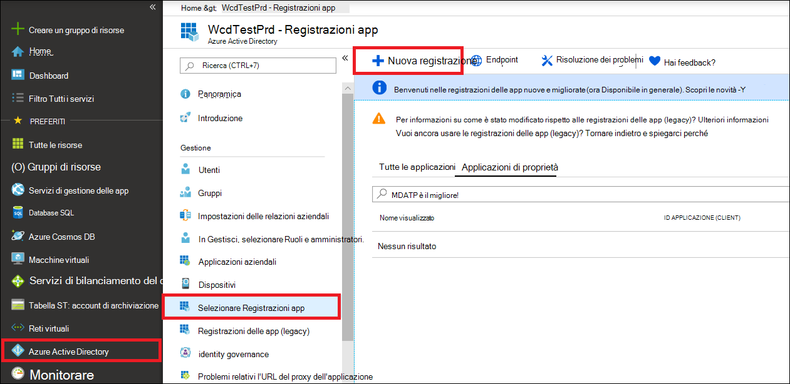

# <a name="create-an-app-to-access-microsoft-defender-for-endpoint-without-a-user"></a>Creare un'app per accedere a Microsoft Defender for Endpoint senza un utente

[!INCLUDE [Microsoft 365 Defender rebranding](../../includes/microsoft-defender.md)]


**Si applica a:** [Microsoft Defender for Endpoint](https://go.microsoft.com/fwlink/?linkid=2154037)

- Vuoi provare Microsoft Defender per Endpoint? [Iscriversi per una versione di valutazione gratuita.](https://www.microsoft.com/microsoft-365/windows/microsoft-defender-atp?ocid=docs-wdatp-exposedapis-abovefoldlink)

[!include[Microsoft Defender for Endpoint API URIs for US Government](../../includes/microsoft-defender-api-usgov.md)]

[!include[Improve request performance](../../includes/improve-request-performance.md)]

Questa pagina descrive come creare un'applicazione per ottenere l'accesso a livello di codice a Defender per Endpoint senza un utente. Se hai bisogno dell'accesso a livello di codice a Defender for Endpoint per conto di un utente, vedi [Ottenere l'accesso con il contesto utente.](exposed-apis-create-app-nativeapp.md) Se non si è certi dell'accesso necessario, vedere [Introduzione.](apis-intro.md)

Microsoft Defender for Endpoint espone gran parte dei dati e delle azioni tramite un set di API programmatiche. Queste API ti aiuteranno ad automatizzare i flussi di lavoro e a innovare in base alle funzionalità di Defender for Endpoint. L'accesso API richiede l'autenticazione OAuth2.0. Per ulteriori informazioni, vedere [OAuth 2.0 Authorization Code Flow](/azure/active-directory/develop/active-directory-v2-protocols-oauth-code).

In generale, dovrai eseguire la procedura seguente per usare le API:
- Creare un'Azure Active Directory (Azure AD).
- Ottieni un token di accesso usando questa applicazione.
- Usa il token per accedere a Defender for Endpoint API.

Questo articolo spiega come creare un'applicazione Azure AD, ottenere un token di accesso a Microsoft Defender for Endpoint e convalidare il token.

## <a name="create-an-app"></a>Creare un'app

1. Accedere ad [Azure](https://portal.azure.com) con un utente con il **ruolo amministratore** globale.

2. Passare **a** Azure Active Directory  >  **app Nuove**  >  **registrazioni**. 

   

3. Nel modulo di registrazione scegliere un nome per l'applicazione e quindi selezionare **Registra**.

4. Per consentire alla tua app di accedere a Defender for Endpoint e assegnarle l'autorizzazione **"Leggi** tutti gli avvisi", nella pagina dell'applicazione seleziona **Autorizzazioni API** Aggiungi le API di autorizzazione che l'organizzazione usa >, digita  >    >   **WindowsDefenderATP** e quindi seleziona **WindowsDefenderATP.**

   > [!NOTE]
   > *WindowsDefenderATP* non viene visualizzato nell'elenco originale. Iniziare a scrivere il nome nella casella di testo per visualizzarlo.

   

   - Selezionare **Autorizzazioni applicazione**  >  **Alert.Read.All** e quindi Aggiungi **autorizzazioni.**

   

     È necessario selezionare le autorizzazioni pertinenti. "Leggi tutti gli avvisi" è solo un esempio. Ad esempio:

     - Per [eseguire query avanzate,](run-advanced-query-api.md)selezionare l'autorizzazione "Esegui query avanzate".
     - Per [isolare un dispositivo,](isolate-machine.md)seleziona l'autorizzazione "Isola computer".
     - Per determinare l'autorizzazione necessaria, guarda la **sezione Autorizzazioni** nell'API che vuoi chiamare.

5. Selezionare **Concedi consenso**.

     > [!NOTE]
     > Ogni volta che aggiungi un'autorizzazione, devi selezionare **Concedi il consenso** perché la nuova autorizzazione sia effettiva.

    

6. Per aggiungere un segreto all'applicazione, selezionare **Certificati & segreti,** aggiungere una descrizione al segreto e quindi selezionare **Aggiungi**.

    > [!NOTE]
    > Dopo aver selezionato **Aggiungi,** selezionare **copia il valore segreto generato.** Non sarà possibile recuperare questo valore dopo aver lasciato.

    

7. Annota l'ID applicazione e l'ID tenant. Nella pagina dell'applicazione passare a **Panoramica e** copiare quanto segue.

   

8. **Solo per Microsoft Defender per i partner endpoint.** Imposta l'app in modo che sia multi-tenant (disponibile in tutti i tenant dopo il consenso). Questa operazione **è necessaria** per le app di terze parti(ad esempio, se crei un'app che deve essere eseguita nel tenant di più clienti). Questa operazione **non** è necessaria se si crea un servizio che si desidera eseguire solo nel tenant, ad esempio se si crea un'applicazione per il proprio utilizzo che interagirà solo con i propri dati. Per impostare l'app in modo che sia multi-tenant:

    - Vai a **Autenticazione** e aggiungi `https://portal.azure.com` come URI di **reindirizzamento.**

    - Nella parte inferiore della pagina, in Tipi di **account supportati,** selezionare account **in qualsiasi** consenso dell'applicazione directory dell'organizzazione per l'app multi-tenant.

    È necessario che l'applicazione sia approvata in ogni tenant in cui si intende usarla. Questo perché l'applicazione interagisce con Defender per Endpoint per conto del cliente.

    Tu (o il tuo cliente se stai scrivendo un'app di terze parti) devi selezionare il link di consenso e approvare l'app. Il consenso deve essere effettuato con un utente con privilegi amministrativi in Active Directory.

    Il collegamento di consenso è formato come segue: 

    ```
    https://login.microsoftonline.com/common/oauth2/authorize?prompt=consent&client_id=00000000-0000-0000-0000-000000000000&response_type=code&sso_reload=true
    ```

    Dove 000000000-0000-0000-0000-000000000000 viene sostituito con l'ID applicazione.


**Fatto!** L'applicazione è stata registrata correttamente. Vedi gli esempi seguenti per l'acquisizione e la convalida di token.

## <a name="get-an-access-token"></a>Ottenere un token di accesso

Per altre informazioni sui token di Azure AD, vedi l'esercitazione [su Azure AD.](/azure/active-directory/develop/active-directory-v2-protocols-oauth-client-creds)

### <a name="use-powershell"></a>Usare PowerShell.

```powershell
# This script acquires the App Context Token and stores it in the variable $token for later use in the script.
# Paste your Tenant ID, App ID, and App Secret (App key) into the indicated quotes below.

$tenantId = '' ### Paste your tenant ID here
$appId = '' ### Paste your Application ID here
$appSecret = '' ### Paste your Application key here

$resourceAppIdUri = 'https://api.securitycenter.microsoft.com'
$oAuthUri = "https://login.microsoftonline.com/$TenantId/oauth2/token"
$authBody = [Ordered] @{
    resource = "$resourceAppIdUri"
    client_id = "$appId"
    client_secret = "$appSecret"
    grant_type = 'client_credentials'
}
$authResponse = Invoke-RestMethod -Method Post -Uri $oAuthUri -Body $authBody -ErrorAction Stop
$token = $authResponse.access_token
```

### <a name="use-c"></a>Utilizzare C#:

Il codice seguente è stato testato con NuGet Microsoft.IdentityModel.Clients.ActiveDirectory 3.19.8.

1. Creare una nuova applicazione console.
1. Installare NuGet [Microsoft.IdentityModel.Clients.ActiveDirectory](https://www.nuget.org/packages/Microsoft.IdentityModel.Clients.ActiveDirectory/).
1. Aggiungere quanto segue:

    ```
    using Microsoft.IdentityModel.Clients.ActiveDirectory;
    ```

1. Copia e incolla il codice seguente nella tua app (non dimenticare di aggiornare le tre ```tenantId, appId, appSecret``` variabili):

    ```
    string tenantId = "00000000-0000-0000-0000-000000000000"; // Paste your own tenant ID here
    string appId = "11111111-1111-1111-1111-111111111111"; // Paste your own app ID here
    string appSecret = "22222222-2222-2222-2222-222222222222"; // Paste your own app secret here for a test, and then store it in a safe place! 

    const string authority = "https://login.microsoftonline.com";
    const string wdatpResourceId = "https://api.securitycenter.microsoft.com";

    AuthenticationContext auth = new AuthenticationContext($"{authority}/{tenantId}/");
    ClientCredential clientCredential = new ClientCredential(appId, appSecret);
    AuthenticationResult authenticationResult = auth.AcquireTokenAsync(wdatpResourceId, clientCredential).GetAwaiter().GetResult();
    string token = authenticationResult.AccessToken;
    ```


### <a name="use-python"></a>Usare Python

Vedi [Ottenere token con Python.](run-advanced-query-sample-python.md#get-token)

### <a name="use-curl"></a>Usare l'arricciatura

> [!NOTE]
> Nella procedura seguente si presuppone che l'Windows sia già installato nel computer.

1. Aprire un prompt dei comandi e impostare CLIENT_ID'ID applicazione di Azure.
1. Impostare CLIENT_SECRET sul segreto dell'applicazione Azure.
1. Imposta TENANT_ID'ID tenant di Azure del cliente che vuole usare la tua app per accedere a Defender per Endpoint.
1. Eseguire il comando seguente:

```
curl -i -X POST -H "Content-Type:application/x-www-form-urlencoded" -d "grant_type=client_credentials" -d "client_id=%CLIENT_ID%" -d "scope=https://securitycenter.onmicrosoft.com/windowsatpservice/.default" -d "client_secret=%CLIENT_SECRET%" "https://login.microsoftonline.com/%TENANT_ID%/oauth2/v2.0/token" -k
```

Si otterrà una risposta nel formato seguente:

```
{"token_type":"Bearer","expires_in":3599,"ext_expires_in":0,"access_token":"eyJ0eXAiOiJKV1QiLCJhbGciOiJSUzI1NiIsIn <truncated> aWReH7P0s0tjTBX8wGWqJUdDA"}
```

## <a name="validate-the-token"></a>Convalidare il token

Assicurati di avere il token corretto:

1. Copia e incolla il token ottenuto nel passaggio precedente in [JWT](https://jwt.ms) per decodificarlo.
1. Verificare di ottenere un'attestazione "ruoli" con le autorizzazioni desiderate
1. Nell'immagine seguente puoi vedere un token decodificato acquisito da un'app con autorizzazioni per tutti i ruoli di Microsoft Defender for Endpoint:


## <a name="use-the-token-to-access-microsoft-defender-for-endpoint-api"></a>Usare il token per accedere all'API di Microsoft Defender for Endpoint

1. Scegli l'API che vuoi usare. Per altre informazioni, vedi [Supported Defender for Endpoint APIs.](exposed-apis-list.md)
1. Imposta l'intestazione di autorizzazione nella richiesta http inviata a "Bearer {token}" (Bearer è lo schema di autorizzazione).
1. La scadenza del token è di un'ora. Puoi inviare più richieste con lo stesso token.

Di seguito è riportato un esempio di invio di una richiesta per ottenere un elenco di avvisi **tramite C#**: 
```
    var httpClient = new HttpClient();

    var request = new HttpRequestMessage(HttpMethod.Get, "https://api.securitycenter.microsoft.com/api/alerts");

    request.Headers.Authorization = new AuthenticationHeaderValue("Bearer", token);

    var response = httpClient.SendAsync(request).GetAwaiter().GetResult();

    // Do something useful with the response
```

## <a name="see-also"></a>Vedere anche
- [Accedere a API di Microsoft Defender per endpoint](exposed-apis-list.md)
- [Accedere a Microsoft Defender for Endpoint per conto di un utente](exposed-apis-create-app-nativeapp.md)
