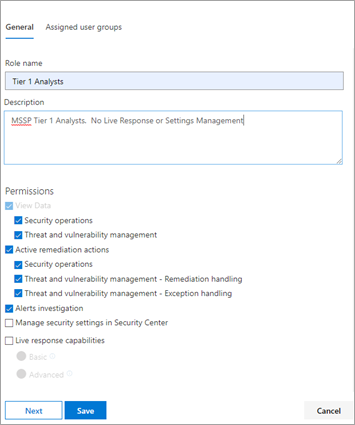
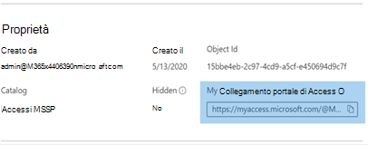

# Concedere l'accesso msSP (Managed Security Service Provider) (anteprima)

[!INCLUDE [Microsoft 365 Defender rebranding](../../includes/microsoft-defender.md)]

**Si applica a:**
- [Microsoft Defender per endpoint](https://go.microsoft.com/fwlink/p/?linkid=2154037)
- [Microsoft 365 Defender](https://go.microsoft.com/fwlink/?linkid=2118804)

>Vuoi provare Defender per Endpoint? [Iscriversi per una versione di valutazione gratuita.](https://www.microsoft.com/microsoft-365/windows/microsoft-defender-atp?ocid=docs-mssp-support-abovefoldlink)

>[!IMPORTANT] 
>Alcune informazioni fanno riferimento alle caratteristiche del prodotto prima del rilascio, e possono essere modificate sostanzialmente prima della distribuzione al pubblico. Microsoft non fornisce alcuna garanzia, esplicita o implicita, in relazione alle informazioni contenute in questo documento.

Per implementare una soluzione di accesso delegato multi-tenant, eseguire la procedura seguente:

1. Abilitare [il controllo dell'accesso](rbac.md) basato sui ruoli in Defender for Endpoint e connettersi ai gruppi di Active Directory (AD).

2. Configurare i [pacchetti di accesso di](/azure/active-directory/governance/identity-governance-overview) governance per la richiesta di accesso e il provisioning.

3. Gestire le richieste di accesso e i controlli in [Microsoft Myaccess.](/azure/active-directory/governance/entitlement-management-request-approve)

## Abilitare i controlli di accesso basati sui ruoli in Microsoft Defender for Endpoint

1. **Creare gruppi di accesso per le risorse MSSP in Customer AAD: Gruppi**

    Questi gruppi verranno collegati ai ruoli creati in Defender per Endpoint. A tale scopo, nel tenant AD del cliente creare tre gruppi. Nell'approccio di esempio vengono creati i gruppi seguenti:

    - Analista di livello 1 
    - Analista di livello 2 
    - Responsabili approvazione analista MSSP  

2. Creare ruoli defender per endpoint per i livelli di accesso appropriati in Customer Defender for Endpoint.

    Per abilitare il controllo degli accessi in base al ruolo Microsoft Defender Security Center, accedere Impostazioni > Autorizzazioni > Ruoli e **"Attiva** ruoli" da un account utente con diritti di amministratore globale o amministratore della sicurezza.

    

    Creare quindi ruoli RBAC per soddisfare le esigenze del livello SOC MSSP. Collegare questi ruoli ai gruppi di utenti creati tramite "Gruppi di utenti assegnati".

    Due possibili ruoli:

    - **Analisti di livello 1**  
      Eseguire tutte le azioni ad eccezione della risposta in tempo reale e gestire le impostazioni di sicurezza.

    - **Analisti di livello 2**  
      Funzionalità di livello 1 con l'aggiunta della [risposta in tempo reale](live-response.md)

    Per ulteriori informazioni, vedere [Use role-based access control](rbac.md).

## Configurare i pacchetti di accesso alla governance

1.  **Aggiungere MSSP come organizzazione connessa in Customer AAD: Identity Governance**
    
    L'aggiunta di MSSP come organizzazione connessa consentirà al provider mssp di richiedere e disporre degli accessi di cui è stato eseguito il provisioning. 

    A tale scopo, nel tenant AD del cliente, accedere a Identity Governance: Connected organization. Aggiungere una nuova organizzazione e cercare il tenant dell'analista MSSP tramite l'ID tenant o il dominio. Ti consigliamo di creare un tenant AD separato per gli analisti MSSP.

2. **Creare un catalogo delle risorse in Customer AAD: Identity Governance**

    I cataloghi delle risorse sono una raccolta logica di pacchetti di accesso, creati nel tenant AD del cliente.

    A tale scopo, nel tenant AD del cliente, accedere a Identity Governance: Catalogs e aggiungere **New Catalog.** In questo esempio, verrà chiamato **MSSP Accesses**. 

    

    Per ulteriori informazioni, vedere [Create a catalog of resources](/azure/active-directory/governance/entitlement-management-catalog-create).

3. **Creare pacchetti di accesso per le risorse MSSP Customer AAD: Identity Governance**

    I pacchetti di accesso sono la raccolta di diritti e accessi a cui un richiedente verrà concesso all'approvazione. 

    A tale scopo, nel tenant AD del cliente, accedere a Identity Governance: Access Packages e aggiungere **New Access Package.** Creare un pacchetto di accesso per i responsabili approvazione MSSP e ogni livello di analista. Ad esempio, la configurazione dell'analista di livello 1 seguente crea un pacchetto di accesso che:

    - Richiede a un membro del gruppo AD **Responsabili approvazione analisti MSSP** di autorizzare nuove richieste
    - Ha revisioni di accesso annuali, in cui gli analisti SOC possono richiedere un'estensione di accesso
    - Può essere richiesto solo dagli utenti nel tenant SOC MSSP
    - Access scade automaticamente dopo 365 giorni

    > [!div class="mx-imgBorder"]
    > 

    Per ulteriori informazioni, vedere [Create a new access package](/azure/active-directory/governance/entitlement-management-access-package-create).

4. **Fornire il collegamento della richiesta di accesso alle risorse MSSP da Customer AAD: Identity Governance**

    Il collegamento al portale My Access viene utilizzato dagli analisti SOC di MSSP per richiedere l'accesso tramite i pacchetti di accesso creati. Il collegamento è durevole, ovvero lo stesso collegamento può essere utilizzato nel tempo per i nuovi analisti. La richiesta dell'analista viene inviata in una coda per l'approvazione da parte dei responsabili approvazione degli analisti **MSSP.**

    > [!div class="mx-imgBorder"]
    > 

    Il collegamento si trova nella pagina di panoramica di ogni pacchetto di accesso.

## Gestire accessi 

1. Esaminare e autorizzare le richieste di accesso in Customer e/o MSSP myaccess.

    Le richieste di accesso vengono gestite nel cliente Accesso personale dai membri del gruppo Responsabili approvazione analista MSSP.

    A tale scopo, accedere all'account myaccess del cliente usando:  `https://myaccess.microsoft.com/@<Customer Domain >` . 

    Esempio:  `https://myaccess.microsoft.com/@M365x440XXX.onmicrosoft.com#/`   
2. Approvare o rifiutare le richieste nella **sezione Approvazioni** dell'interfaccia utente.

    A questo punto, è stato effettuato il provisioning dell'accesso dell'analista e ogni analista deve essere in grado di accedere ai dati del cliente Microsoft Defender Security Center:`https://securitycenter.Microsoft.com/?tid=<CustomerTenantId>`

## Argomenti correlati
- [Accedere al portale clienti MSSP](access-mssp-portal.md)
- [Configurare le notifiche di avviso](configure-mssp-notifications.md)
- [Recuperare gli avvisi dal tenant del cliente](fetch-alerts-mssp.md)

 

