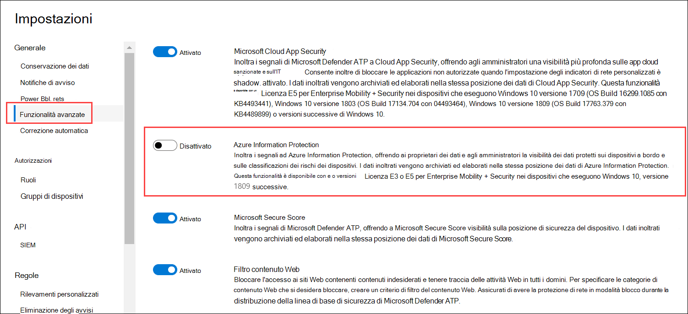

# <a name="information-protection-in-windows-overview"></a><span data-ttu-id="d110c-104">Panoramica di protezione delle informazioni in Windows</span><span class="sxs-lookup"><span data-stu-id="d110c-104">Information protection in Windows overview</span></span>

[!INCLUDE [Microsoft 365 Defender rebranding](../../includes/microsoft-defender.md)]

<span data-ttu-id="d110c-105">**Si applica a:**</span><span class="sxs-lookup"><span data-stu-id="d110c-105">**Applies to:**</span></span>

- [<span data-ttu-id="d110c-106">Microsoft Defender per endpoint</span><span class="sxs-lookup"><span data-stu-id="d110c-106">Microsoft Defender for Endpoint</span></span>](https://go.microsoft.com/fwlink/p/?linkid=2154037)
- [<span data-ttu-id="d110c-107">Microsoft 365 Defender</span><span class="sxs-lookup"><span data-stu-id="d110c-107">Microsoft 365 Defender</span></span>](https://go.microsoft.com/fwlink/?linkid=2118804)

> <span data-ttu-id="d110c-108">Vuoi provare Defender per Endpoint?</span><span class="sxs-lookup"><span data-stu-id="d110c-108">Want to experience Defender for Endpoint?</span></span> [<span data-ttu-id="d110c-109">Iscriversi per una versione di valutazione gratuita.</span><span class="sxs-lookup"><span data-stu-id="d110c-109">Sign up for a free trial.</span></span>](https://www.microsoft.com/microsoft-365/windows/microsoft-defender-atp?ocid=docs-wdatp-exposedapis-abovefoldlink) 


[!include[Prerelease information](../../includes/prerelease.md)]

<span data-ttu-id="d110c-110">La protezione delle informazioni è parte integrante di Microsoft 365 Enterprise suite, fornendo una protezione intelligente per proteggere i dati sensibili, consentendo allo stesso tempo la produttività sul luogo di lavoro.</span><span class="sxs-lookup"><span data-stu-id="d110c-110">Information protection is an integral part of Microsoft 365 Enterprise suite, providing intelligent protection to keep sensitive data secure while enabling productivity in the workplace.</span></span>


>[!TIP]
> <span data-ttu-id="d110c-111">Leggi il post di blog su come Microsoft Defender for Endpoint si integra con Microsoft Information Protection per [individuare,](https://cloudblogs.microsoft.com/microsoftsecure/2019/01/17/windows-defender-atp-integrates-with-microsoft-information-protection-to-discover-protect-and-monitor-sensitive-data-on-windows-devices/)proteggere e monitorare i dati sensibili Windows dispositivi .</span><span class="sxs-lookup"><span data-stu-id="d110c-111">Read our blog post about how Microsoft Defender for Endpoint integrates with Microsoft Information Protection to [discover, protect, and monitor sensitive data on Windows devices](https://cloudblogs.microsoft.com/microsoftsecure/2019/01/17/windows-defender-atp-integrates-with-microsoft-information-protection-to-discover-protect-and-monitor-sensitive-data-on-windows-devices/).</span></span>

<span data-ttu-id="d110c-112">Defender for Endpoint applica i metodi seguenti per individuare, classificare e proteggere i dati:</span><span class="sxs-lookup"><span data-stu-id="d110c-112">Defender for Endpoint applies the following methods to discover, classify, and protect data:</span></span>

- <span data-ttu-id="d110c-113">**Individuazione dei dati** - Identificare i dati sensibili nei dispositivi Windows a rischio</span><span class="sxs-lookup"><span data-stu-id="d110c-113">**Data discovery** - Identify sensitive data on Windows devices at risk</span></span>
- <span data-ttu-id="d110c-114">**Classificazione dei dati:** classifica automaticamente i dati in base ai criteri comuni di Microsoft Information Protection (MIP) gestiti nel Centro sicurezza Office 365 sicurezza & conformità.</span><span class="sxs-lookup"><span data-stu-id="d110c-114">**Data classification** - Automatically classify data based on common Microsoft Information Protection (MIP) policies managed in Office 365 Security & Compliance Center.</span></span> <span data-ttu-id="d110c-115">La classificazione automatica consente di proteggere i dati sensibili anche se l'utente finale non lo ha classificato manualmente.</span><span class="sxs-lookup"><span data-stu-id="d110c-115">Auto-classification allows you to protect sensitive data even if the end user hasn’t manually classified it.</span></span>


## <a name="data-discovery-and-data-classification"></a><span data-ttu-id="d110c-116">Individuazione e classificazione dei dati</span><span class="sxs-lookup"><span data-stu-id="d110c-116">Data discovery and data classification</span></span>

<span data-ttu-id="d110c-117">Defender for Endpoint individua automaticamente i file con etichette di riservatezza e i file che contengono tipi di informazioni riservate.</span><span class="sxs-lookup"><span data-stu-id="d110c-117">Defender for Endpoint automatically discovers files with sensitivity labels and files that contain sensitive information types.</span></span>

<span data-ttu-id="d110c-118">Le etichette di riservatezza classificano e proteggono i contenuti sensibili.</span><span class="sxs-lookup"><span data-stu-id="d110c-118">Sensitivity labels classify and help protect sensitive content.</span></span>

<span data-ttu-id="d110c-119">I tipi di informazioni riservate nell'Office 365 prevenzione della perdita dei dati (DLP) rientrano in due categorie:</span><span class="sxs-lookup"><span data-stu-id="d110c-119">Sensitive information types in the Office 365 data loss prevention (DLP) implementation fall under two categories:</span></span>

- <span data-ttu-id="d110c-120">Impostazione predefinita</span><span class="sxs-lookup"><span data-stu-id="d110c-120">Default</span></span>
- <span data-ttu-id="d110c-121">Personalizzato</span><span class="sxs-lookup"><span data-stu-id="d110c-121">Custom</span></span>

<span data-ttu-id="d110c-122">I tipi di informazioni riservate predefiniti includono informazioni quali numeri di conto corrente bancario, numeri di previdenza sociale o ID nazionali.</span><span class="sxs-lookup"><span data-stu-id="d110c-122">Default sensitive information types include information such as bank account numbers, social security numbers, or national IDs.</span></span> <span data-ttu-id="d110c-123">Per ulteriori informazioni, vedere [Ricerca del tipo di informazioni riservate](/office365/securitycompliance/what-the-sensitive-information-types-look-for).</span><span class="sxs-lookup"><span data-stu-id="d110c-123">For more information, see [What the sensitive information type look for](/office365/securitycompliance/what-the-sensitive-information-types-look-for).</span></span>

<span data-ttu-id="d110c-124">I tipi personalizzati sono definiti dall'utente ed è progettato per proteggere un tipo diverso di informazioni riservate, ad esempio ID dipendenti o numeri di progetto.</span><span class="sxs-lookup"><span data-stu-id="d110c-124">Custom types are ones that you define and is designed to protect a different type of sensitive information (for example, employee IDs or project numbers).</span></span> <span data-ttu-id="d110c-125">Per ulteriori informazioni, vedere [Creare un tipo di informazioni riservate personalizzato.](/office365/securitycompliance/create-a-custom-sensitive-information-type)</span><span class="sxs-lookup"><span data-stu-id="d110c-125">For more information see, [Create a custom sensitive information type](/office365/securitycompliance/create-a-custom-sensitive-information-type).</span></span>

<span data-ttu-id="d110c-126">Quando un file viene creato o modificato in un dispositivo Windows, Defender for Endpoint analizza il contenuto per valutare se contiene informazioni riservate.</span><span class="sxs-lookup"><span data-stu-id="d110c-126">When a file is created or edited on a  Windows device, Defender for Endpoint scans the content to evaluate if it contains sensitive information.</span></span>

<span data-ttu-id="d110c-127">Attivare l'integrazione di Azure Information Protection in modo che quando un file che contiene informazioni riservate viene individuato da Defender per Endpoint anche se etichette o tipi di informazioni, viene automaticamente inoltrato ad Azure Information Protection dal dispositivo.</span><span class="sxs-lookup"><span data-stu-id="d110c-127">Turn on the Azure Information Protection integration so that when a file that contains sensitive information is discovered by Defender for Endpoint though labels or information types, it is automatically forwarded to Azure Information Protection from the device.</span></span>



<span data-ttu-id="d110c-129">I segnali segnalati possono essere visualizzati nel dashboard azure Information Protection - Individuazione dati.</span><span class="sxs-lookup"><span data-stu-id="d110c-129">The reported signals can be viewed on the Azure Information Protection – Data discovery dashboard.</span></span>

## <a name="azure-information-protection---data-discovery-dashboard"></a><span data-ttu-id="d110c-130">Azure Information Protection - Dashboard di individuazione dei dati</span><span class="sxs-lookup"><span data-stu-id="d110c-130">Azure Information Protection - Data discovery dashboard</span></span>

<span data-ttu-id="d110c-131">Questo dashboard presenta un riepilogo delle informazioni di individuazione dei dati individuati da Defender per Endpoint e Azure Information Protection.</span><span class="sxs-lookup"><span data-stu-id="d110c-131">This dashboard presents a summarized discovery information of data discovered by both Defender for Endpoint and Azure Information Protection.</span></span> <span data-ttu-id="d110c-132">I dati di Defender per Endpoint sono contrassegnati con Location Type - Endpoint.</span><span class="sxs-lookup"><span data-stu-id="d110c-132">Data from Defender for Endpoint is marked with Location Type - Endpoint.</span></span>


<span data-ttu-id="d110c-134">Nota la colonna Rischio dispositivo a destra, questo rischio del dispositivo deriva direttamente da Defender per Endpoint, che indica il livello di rischio del dispositivo di sicurezza in cui è stato individuato il file, in base alle minacce alla sicurezza attive rilevate da Defender per Endpoint.</span><span class="sxs-lookup"><span data-stu-id="d110c-134">Notice the Device Risk column on the right, this device risk is derived directly from Defender for Endpoint, indicating the risk level of the security device where the file was discovered, based on the active security threats detected by Defender for Endpoint.</span></span>

<span data-ttu-id="d110c-135">Fai clic su un dispositivo per visualizzare un elenco dei file osservati su questo dispositivo, con le etichette di riservatezza e i tipi di informazioni.</span><span class="sxs-lookup"><span data-stu-id="d110c-135">Click on a device to view a list of files observed on this device, with their sensitivity labels and information types.</span></span>

>[!NOTE]
><span data-ttu-id="d110c-136">Attendere circa 15-20 minuti perché l'individuazione del dashboard di Azure Information Protection rifletta i file individuati.</span><span class="sxs-lookup"><span data-stu-id="d110c-136">Please allow approximately 15-20 minutes for the Azure Information Protection Dashboard Discovery to reflect discovered files.</span></span>

## <a name="log-analytics"></a><span data-ttu-id="d110c-137">Log Analytics</span><span class="sxs-lookup"><span data-stu-id="d110c-137">Log Analytics</span></span>

<span data-ttu-id="d110c-138">L'individuazione dei dati basata su Defender per Endpoint è disponibile anche in [Azure Log Analytics,](/azure/log-analytics/log-analytics-overview)in cui è possibile eseguire query complesse sui dati non elaborati.</span><span class="sxs-lookup"><span data-stu-id="d110c-138">Data discovery based on Defender for Endpoint is also available in [Azure Log Analytics](/azure/log-analytics/log-analytics-overview), where you can perform complex queries over the raw data.</span></span>

<span data-ttu-id="d110c-139">Per ulteriori informazioni sull'analisi di Azure Information Protection, vedere [Creazione di report centrali per Azure Information Protection.](/azure/information-protection/reports-aip)</span><span class="sxs-lookup"><span data-stu-id="d110c-139">For more information on Azure Information Protection analytics, see [Central reporting for Azure Information Protection](/azure/information-protection/reports-aip).</span></span>

<span data-ttu-id="d110c-140">Aprire Azure Log Analytics nel portale di Azure e aprire un generatore di query (standard o classico).</span><span class="sxs-lookup"><span data-stu-id="d110c-140">Open Azure Log Analytics in Azure portal and open a query builder (standard or classic).</span></span>

<span data-ttu-id="d110c-141">Per visualizzare i dati di Defender for Endpoint, eseguire una query contenente:</span><span class="sxs-lookup"><span data-stu-id="d110c-141">To view Defender for Endpoint data, perform a query that contains:</span></span>

```
InformationProtectionLogs_CL
| where Workload_s == "Windows Defender"
```

<span data-ttu-id="d110c-142">**Prerequisiti:**</span><span class="sxs-lookup"><span data-stu-id="d110c-142">**Prerequisites:**</span></span>

- <span data-ttu-id="d110c-143">I clienti devono avere una sottoscrizione per Azure Information Protection.</span><span class="sxs-lookup"><span data-stu-id="d110c-143">Customers must have a subscription for Azure Information Protection.</span></span>
- <span data-ttu-id="d110c-144">Abilitare l'integrazione di Azure Information Protection in Microsoft Defender Security Center:</span><span class="sxs-lookup"><span data-stu-id="d110c-144">Enable Azure Information Protection integration in Microsoft Defender Security Center:</span></span>
    - <span data-ttu-id="d110c-145">Vai a **Impostazioni** in Microsoft Defender Security Center, fai clic su **Impostazioni avanzate Impostazioni** in **Generale**.</span><span class="sxs-lookup"><span data-stu-id="d110c-145">Go to **Settings** in Microsoft Defender Security Center, click on **Advanced Settings** under **General**.</span></span>


