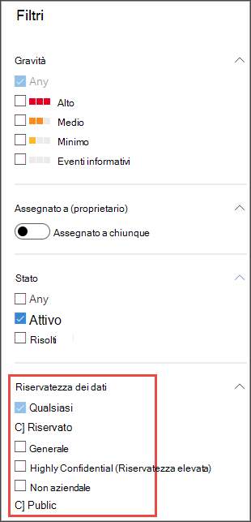
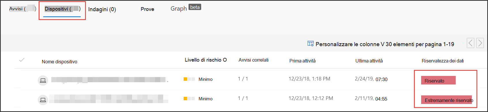
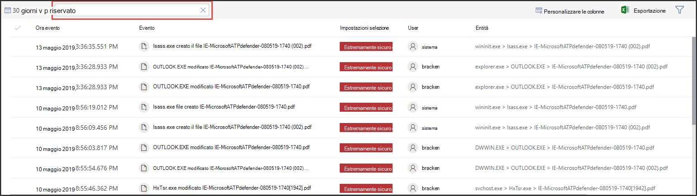

# Usare le etichette di riservatezza per definire la priorità della risposta agli eventi imprevisti  

[!INCLUDE [Microsoft 365 Defender rebranding](../../includes/microsoft-defender.md)]

**Si applica a:**
- [Microsoft Defender ATP](https://go.microsoft.com/fwlink/p/?linkid=2146631)
- [Microsoft 365 Defender](https://go.microsoft.com/fwlink/?linkid=2118804)

> Vuoi provare Defender per Endpoint? [Iscriversi per una versione di valutazione gratuita.](https://www.microsoft.com/microsoft-365/windows/microsoft-defender-atp?ocid=docs-wdatp-exposedapis-abovefoldlink) 

Un tipico ciclo di vita avanzato delle minacce persistenti implica l'esfiltrazione dei dati. In un incidente di sicurezza, è importante avere la possibilità di assegnare priorità alle indagini in cui i file sensibili potrebbero essere a rischio in modo che i dati e le informazioni aziendali siano protetti.

Defender for Endpoint consente di semplificare la definizione della priorità degli incidenti di sicurezza con l'uso delle etichette di riservatezza. Le etichette di riservatezza identificano rapidamente gli incidenti che possono coinvolgere i dispositivi con informazioni riservate, ad esempio informazioni riservate. 

## Analizzare gli eventi imprevisti che coinvolgono dati sensibili
Informazioni su come usare le etichette di riservatezza dei dati per definire la priorità dell'analisi degli incidenti.

>[!NOTE]
>Vengono rilevate etichette per Windows 10 versione 1809 o successiva.

1. In Microsoft Defender Security Center seleziona **Eventi imprevisti.** 

2. Scorrere verso destra per visualizzare la **colonna Riservatezza dati.** Questa colonna riflette le etichette di riservatezza che sono state osservate nei dispositivi correlati agli eventi imprevisti, fornendo un'indicazione se i file sensibili potrebbero essere influenzati dall'incidente.

    

    È inoltre possibile filtrare in base **alla riservatezza dei dati** 

    

3. Apri la pagina dell'evento imprevisto per analizzare ulteriormente.

    

4. Seleziona la **scheda Dispositivi** per identificare i dispositivi che archiviano file con etichette di riservatezza.

    
   

5. Seleziona i dispositivi che archiviano dati sensibili ed eserciti una ricerca nella sequenza temporale per identificare i file che potrebbero essere influenzati e quindi eserciti le azioni appropriate per garantire che i dati siano protetti. 

   Puoi limitare gli eventi visualizzati nella sequenza temporale del dispositivo cercando le etichette di riservatezza dei dati. In questo modo verranno visualizzati solo gli eventi associati ai file con il nome dell'etichetta specificato.

    

>[!TIP]
>Questi punti dati vengono esposti anche tramite "DeviceFileEvents" nella ricerca avanzata, consentendo alle query avanzate e al rilevamento della pianificazione di prendere in considerazione le etichette di riservatezza e lo stato di protezione dei file. 
