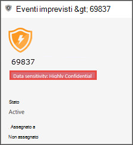

# Usare le etichette di riservatezza per definire la priorità della risposta agli eventi imprevistiUse sensitivity labels to prioritize incident response  

[!INCLUDE [Microsoft 365 Defender rebranding](../../includes/microsoft-defender.md)]

**Si applica a:****Applies to:**
- [Microsoft Defender per endpointMicrosoft Defender for Endpoint](https://go.microsoft.com/fwlink/p/?linkid=2154037)
- [Microsoft 365 DefenderMicrosoft 365 Defender](https://go.microsoft.com/fwlink/?linkid=2118804)

> Vuoi provare Defender per Endpoint?Want to experience Defender for Endpoint? [Iscriversi per una versione di valutazione gratuita.Sign up for a free trial.](https://www.microsoft.com/microsoft-365/windows/microsoft-defender-atp?ocid=docs-wdatp-exposedapis-abovefoldlink) 

Un tipico ciclo di vita avanzato delle minacce persistenti implica l'esfiltrazione dei dati.A typical advanced persistent threat lifecycle involves data exfiltration. In un incidente di sicurezza, è importante avere la possibilità di assegnare priorità alle indagini in cui i file sensibili potrebbero essere a rischio in modo che i dati e le informazioni aziendali siano protetti.In a security incident, it's important to have the ability to prioritize investigations where sensitive files may be jeopardy so that corporate data and information are protected.

Defender for Endpoint consente di semplificare la definizione della priorità degli incidenti di sicurezza con l'uso delle etichette di riservatezza.Defender for Endpoint helps to make the prioritization of security incidents much simpler with the use of sensitivity labels. Le etichette di riservatezza identificano rapidamente gli incidenti che possono coinvolgere i dispositivi con informazioni riservate, ad esempio informazioni riservate.Sensitivity labels quickly identify incidents that may involve devices with sensitive information such as confidential information. 

## Analizzare gli eventi imprevisti che coinvolgono dati sensibiliInvestigate incidents that involve sensitive data
Informazioni su come usare le etichette di riservatezza dei dati per definire la priorità dell'analisi degli incidenti.Learn how to use data sensitivity labels to prioritize incident investigation.

>[!NOTE]
>Vengono rilevate etichette per Windows 10 versione 1809 o successiva.Labels are detected for Windows 10, version 1809 or later.

1. In Microsoft Defender Security Center seleziona **Eventi imprevisti.**In Microsoft Defender Security Center, select **Incidents**. 

2. Scorrere verso destra per visualizzare la **colonna Riservatezza dati.**Scroll to the right to see the **Data sensitivity** column. Questa colonna riflette le etichette di riservatezza che sono state osservate nei dispositivi correlati agli eventi imprevisti, fornendo un'indicazione se i file sensibili potrebbero essere influenzati dall'incidente.This column reflects sensitivity labels that have been observed on devices related to the incidents providing an indication of whether sensitive files may be impacted by the incident.

    

    È inoltre possibile filtrare in base **alla riservatezza dei dati**You can also filter based on **Data sensitivity** 

    

3. Apri la pagina dell'evento imprevisto per analizzare ulteriormente.Open the incident page to further investigate.

    

4. Seleziona la **scheda Dispositivi** per identificare i dispositivi che archiviano file con etichette di riservatezza.Select the **Devices** tab to identify devices storing files with sensitivity labels.

    
   

5. Seleziona i dispositivi che archiviano dati sensibili ed eserciti una ricerca nella sequenza temporale per identificare i file che potrebbero essere influenzati e quindi eserciti le azioni appropriate per garantire che i dati siano protetti.Select the devices that store sensitive data and search through the timeline to identify which files may be impacted then take appropriate action to ensure that data is protected. 

   Puoi limitare gli eventi visualizzati nella sequenza temporale del dispositivo cercando le etichette di riservatezza dei dati.You can narrow down the events shown on the device timeline by searching for data sensitivity labels. In questo modo verranno visualizzati solo gli eventi associati ai file con il nome dell'etichetta specificato.Doing this will show only events associated with files that have said label name.

    

>[!TIP]
>Questi punti dati vengono esposti anche tramite "DeviceFileEvents" nella ricerca avanzata, consentendo alle query avanzate e al rilevamento della pianificazione di prendere in considerazione le etichette di riservatezza e lo stato di protezione dei file.These data points are also exposed through the ‘DeviceFileEvents’ in advanced hunting, allowing advanced queries and schedule detection to take into account sensitivity labels and file protection status. 
