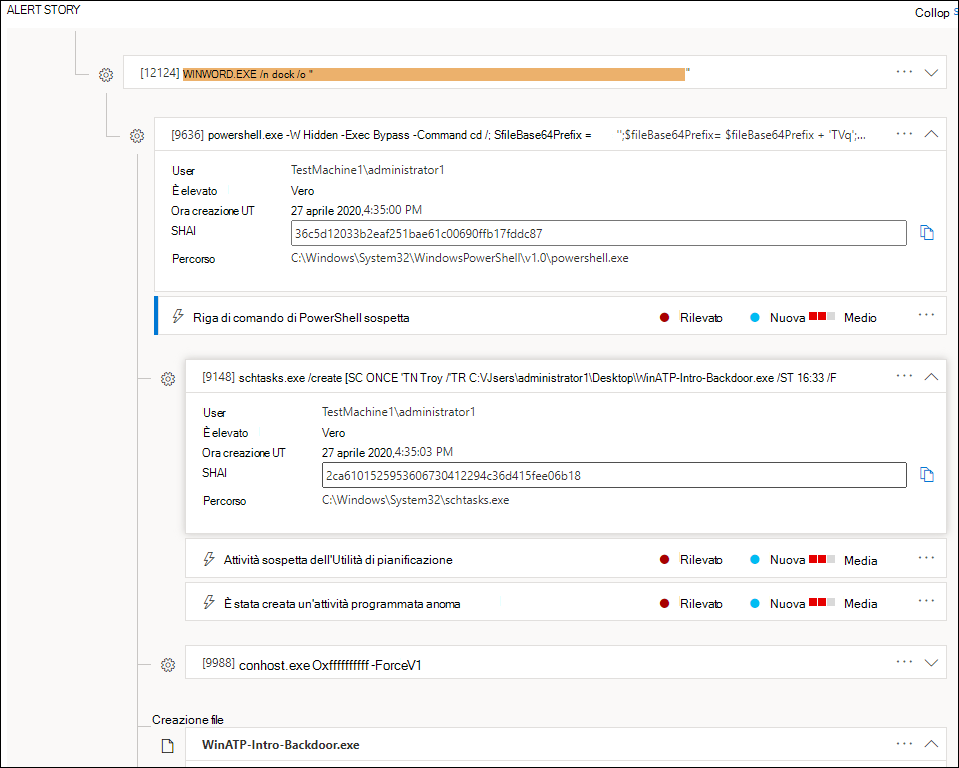
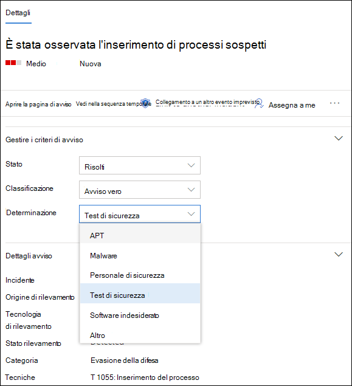
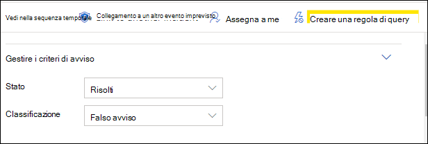

# Analizzare gli avvisi in Microsoft Defender for EndpointInvestigate alerts in Microsoft Defender for Endpoint

[!INCLUDE [Microsoft 365 Defender rebranding](../../includes/microsoft-defender.md)]

**Si applica a:****Applies to:**
- [Microsoft Defender per endpointMicrosoft Defender for Endpoint](https://go.microsoft.com/fwlink/p/?linkid=2154037)
- [Microsoft 365 DefenderMicrosoft 365 Defender](https://go.microsoft.com/fwlink/?linkid=2118804)

>Vuoi provare Defender per Endpoint?Want to experience Defender for Endpoint? [Iscriversi per una versione di valutazione gratuita.Sign up for a free trial.](https://www.microsoft.com/microsoft-365/windows/microsoft-defender-atp?ocid=docs-wdatp-investigatealerts-abovefoldlink) 

Analizzare gli avvisi che interessano la rete, comprenderne il significato e come risolverli.Investigate alerts that are affecting your network, understand what they mean, and how to resolve them.

Selezionare un avviso dalla coda degli avvisi per passare alla pagina di avviso.Select an alert from the alerts queue to go to alert page. Questa visualizzazione contiene il titolo dell'avviso, gli asset interessati, il riquadro laterale dei dettagli e la storia dell'avviso.This view contains the alert title, the affected assets, the details side pane, and the alert story.

Nella pagina di avviso iniziare l'indagine selezionando le risorse interessate o una delle entità nella visualizzazione albero della storia di avviso.From the alert page, begin your investigation by selecting the affected assets or any of the entities under the alert story tree view. Il riquadro dei dettagli viene popolato automaticamente con ulteriori informazioni sugli elementi selezionati.The details pane automatically populates with further information about what you selected. Per sapere quali tipi di informazioni è possibile visualizzare qui, vedere [Esaminare gli avvisi in Microsoft Defender per Endpoint.](https://docs.microsoft.com/microsoft-365/security/defender-endpoint/review-alerts)To see what kind of information you can view here, read [Review alerts in Microsoft Defender for Endpoint](https://docs.microsoft.com/microsoft-365/security/defender-endpoint/review-alerts).

## Analizzare usando la storia di avvisoInvestigate using the alert story

La storia dell'avviso dettaglia il motivo per cui l'avviso è stato attivato, gli eventi correlati che si sono verificati prima e dopo, nonché altre entità correlate.The alert story details why the alert was triggered, related events that happened before and after, as well as other related entities.

Le entità sono selezionabili e ogni entità che non è un avviso è espandibile usando l'icona di espansione sul lato destro della scheda dell'entità.Entities are clickable and every entity that isn't an alert is expandable using the expand icon on the right side of that entity's card. L'entità con lo stato attivo verrà indicata da una striscia blu a sinistra della scheda dell'entità, con l'avviso nel titolo che è stato attivato in un primo momento.The entity in focus will be indicated by a blue stripe to the left side of that entity's card, with the alert in the title being in focus at first.

Espandi entità per visualizzare i dettagli a colpo d'occhio.Expand entities to view details at a glance. Se si seleziona un'entità, il contesto del riquadro dei dettagli verrà commutato in questa entità e sarà possibile esaminare ulteriori informazioni e gestire tale entità.Selecting an entity will switch the context of the details pane to this entity, and will allow you to review further information, as well as manage that entity. Selezionando *...* a destra della scheda dell'entità verranno mostrate tutte le azioni disponibili per tale entità.Selecting *...* to the right of the entity card will reveal all actions available for that entity. Queste stesse azioni vengono visualizzate nel riquadro dei dettagli quando l'entità è attiva.These same actions appear in the details pane when that entity is in focus.

> [!NOTE]
> La sezione della storia dell'avviso può contenere più di un avviso, con altri avvisi correlati allo stesso albero di esecuzione visualizzati prima o dopo l'avviso selezionato.The alert story section may contain more than one alert, with additional alerts related to the same execution tree appearing before or after the alert you've selected.

## Eseguire un'azione dal riquadro dei dettagliTake action from the details pane

Dopo aver selezionato un'entità di interesse, il riquadro dei dettagli cambia per visualizzare le informazioni sul tipo  di entità selezionato, le informazioni storiche quando è disponibile e offrire controlli per eseguire azioni su questa entità direttamente dalla pagina di avviso.Once you've selected an entity of interest, the details pane will change to display information about the selected entity type, historic information when it's available, and offer controls to **take action** on this entity directly from the alert page.

Al termine dell'analisi, tornare all'avviso avviato, contrassegnare lo stato dell'avviso come **Risolto** e classificarlo come **Avviso** falso o **Avviso True.**Once you're done investigating, go back to the alert you started with, mark the alert's status as **Resolved** and classify it as either **False alert** or **True alert**. La classificazione degli avvisi consente di ottimizzare questa funzionalità per fornire avvisi più veri e meno falsi.Classifying alerts helps tune this capability to provide more true alerts and less false alerts.

Se lo classifichiamo come un avviso vero, puoi anche selezionare una determinazione, come mostrato nell'immagine seguente.If you classify it as a true alert, you can also select a determination, as shown in the image below.

Se si verifica un falso avviso con un'applicazione line-of-business, creare una regola di eliminazione per evitare questo tipo di avviso in futuro.If you are experiencing a false alert with a line-of-business application, create a suppression rule to avoid this type of alert in the future.

> [!TIP]
> Se riscontri problemi non descritti in precedenza, usa il pulsante per fornire feedback o 🙂 aprire un ticket di supporto.If you're experiencing any issues not described above, use the 🙂 button to provide feedback or open a support ticket.

## Argomenti correlatiRelated topics
- [Visualizzare e organizzare la coda di Microsoft Defender for Endpoint AlertsView and organize the Microsoft Defender for Endpoint Alerts queue](alerts-queue.md)
- [Gestire gli avvisi di Microsoft Defender for EndpointManage Microsoft Defender for Endpoint alerts](manage-alerts.md)
- [Analizzare un file associato a un avviso di Defender for EndpointInvestigate a file associated with a Defender for Endpoint alert](investigate-files.md)
- [Analizzare i dispositivi nell'elenco Defender for Endpoint DevicesInvestigate devices in the Defender for Endpoint Devices list](investigate-machines.md)
- [Analizzare un indirizzo IP associato a un avviso Defender for EndpointInvestigate an IP address associated with a Defender for Endpoint alert](investigate-ip.md)
- [Analizzare un dominio associato a un avviso Defender for EndpointInvestigate a domain associated with a Defender for Endpoint alert](investigate-domain.md)
- [Analizzare un account utente in Defender for EndpointInvestigate a user account in Defender for Endpoint](investigate-user.md)

