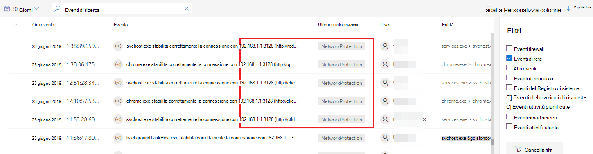
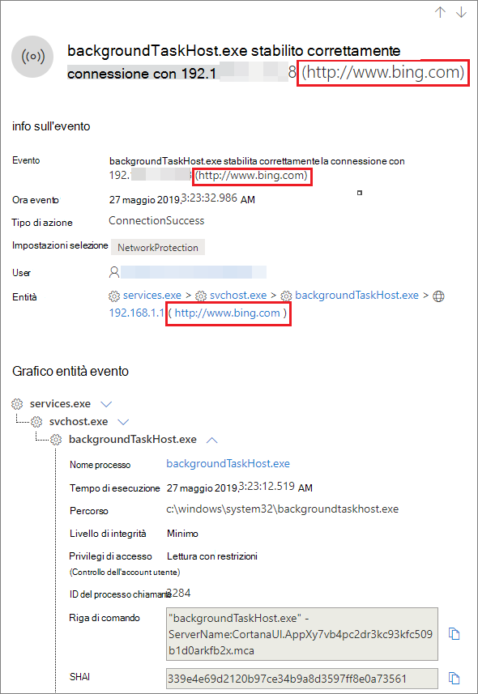

# <a name="investigate-connection-events-that-occur-behind-forward-proxies"></a><span data-ttu-id="6f0da-104">Esaminare gli eventi di connessione che si verificano dietro i proxy di inoltro.</span><span class="sxs-lookup"><span data-stu-id="6f0da-104">Investigate connection events that occur behind forward proxies</span></span>

[!INCLUDE [Microsoft 365 Defender rebranding](../../includes/microsoft-defender.md)]

<span data-ttu-id="6f0da-105">**Si applica a:**</span><span class="sxs-lookup"><span data-stu-id="6f0da-105">**Applies to:**</span></span>
- [<span data-ttu-id="6f0da-106">Microsoft Defender per endpoint</span><span class="sxs-lookup"><span data-stu-id="6f0da-106">Microsoft Defender for Endpoint</span></span>](https://go.microsoft.com/fwlink/p/?linkid=2154037)
- [<span data-ttu-id="6f0da-107">Microsoft 365 Defender</span><span class="sxs-lookup"><span data-stu-id="6f0da-107">Microsoft 365 Defender</span></span>](https://go.microsoft.com/fwlink/?linkid=2118804)

> <span data-ttu-id="6f0da-108">Vuoi provare Defender per Endpoint?</span><span class="sxs-lookup"><span data-stu-id="6f0da-108">Want to experience Defender for Endpoint?</span></span> [<span data-ttu-id="6f0da-109">Iscriversi per una versione di valutazione gratuita.</span><span class="sxs-lookup"><span data-stu-id="6f0da-109">Sign up for a free trial.</span></span>](https://www.microsoft.com/microsoft-365/windows/microsoft-defender-atp?ocid=docs-wdatp-investigatemachines-abovefoldlink)

<span data-ttu-id="6f0da-110">Defender for Endpoint supporta il monitoraggio delle connessioni di rete da diversi livelli dello stack di rete.</span><span class="sxs-lookup"><span data-stu-id="6f0da-110">Defender for Endpoint supports network connection monitoring from different levels of the network stack.</span></span> <span data-ttu-id="6f0da-111">Un caso difficile è quando la rete utilizza un proxy di inoltro come gateway a Internet.</span><span class="sxs-lookup"><span data-stu-id="6f0da-111">A challenging case is when the network uses a forward proxy as a gateway to the Internet.</span></span>

<span data-ttu-id="6f0da-112">Il proxy agisce come se fosse l'endpoint di destinazione.</span><span class="sxs-lookup"><span data-stu-id="6f0da-112">The proxy acts as if it was the target endpoint.</span></span>  <span data-ttu-id="6f0da-113">In questi casi, i monitor delle connessioni di rete semplici controllano le connessioni con il proxy corretto, ma con un valore di indagine inferiore.</span><span class="sxs-lookup"><span data-stu-id="6f0da-113">In these cases, simple network connection monitors will audit the connections with the proxy which is correct but has lower investigation value.</span></span> 

<span data-ttu-id="6f0da-114">Defender for Endpoint supporta il monitoraggio avanzato a livello HTTP tramite la protezione di rete.</span><span class="sxs-lookup"><span data-stu-id="6f0da-114">Defender for Endpoint supports advanced HTTP level monitoring through network protection.</span></span> <span data-ttu-id="6f0da-115">Quando è attivata, viene visualizzato un nuovo tipo di evento che espone i nomi di dominio di destinazione reali.</span><span class="sxs-lookup"><span data-stu-id="6f0da-115">When turned on, a new type of event is surfaced which exposes the real target domain names.</span></span>

## <a name="use-network-protection-to-monitor-network-connection-behind-a-firewall"></a><span data-ttu-id="6f0da-116">Usare la protezione di rete per monitorare la connessione di rete dietro un firewall</span><span class="sxs-lookup"><span data-stu-id="6f0da-116">Use network protection to monitor network connection behind a firewall</span></span>
<span data-ttu-id="6f0da-117">Il monitoraggio della connessione di rete dietro un proxy di inoltro è possibile a causa di eventi di rete aggiuntivi che hanno origine dalla protezione di rete.</span><span class="sxs-lookup"><span data-stu-id="6f0da-117">Monitoring network connection behind a forward proxy is possible due to additional network events that originate from network protection.</span></span> <span data-ttu-id="6f0da-118">Per vederli in una sequenza temporale del dispositivo, attiva la protezione di rete (almeno in modalità di controllo).</span><span class="sxs-lookup"><span data-stu-id="6f0da-118">To see them on a device timeline, turn network protection on (at the minimum in audit mode).</span></span> 

<span data-ttu-id="6f0da-119">La protezione di rete può essere controllata utilizzando le modalità seguenti:</span><span class="sxs-lookup"><span data-stu-id="6f0da-119">Network protection can be controlled using the following modes:</span></span>

- <span data-ttu-id="6f0da-120">**Blocca**</span><span class="sxs-lookup"><span data-stu-id="6f0da-120">**Block**</span></span> <br> <span data-ttu-id="6f0da-121">Agli utenti o alle app verrà impedito di connettersi a domini pericolosi.</span><span class="sxs-lookup"><span data-stu-id="6f0da-121">Users or apps will be blocked from connecting to dangerous domains.</span></span> <span data-ttu-id="6f0da-122">Sarà possibile visualizzare questa attività in Microsoft Defender Security Center.</span><span class="sxs-lookup"><span data-stu-id="6f0da-122">You will be able to see this activity in Microsoft Defender Security Center.</span></span>
- <span data-ttu-id="6f0da-123">**Audit**</span><span class="sxs-lookup"><span data-stu-id="6f0da-123">**Audit**</span></span> <br> <span data-ttu-id="6f0da-124">Agli utenti o alle app non verrà impedito di connettersi a domini pericolosi.</span><span class="sxs-lookup"><span data-stu-id="6f0da-124">Users or apps will not be blocked from connecting to dangerous domains.</span></span> <span data-ttu-id="6f0da-125">Tuttavia, questa attività continuerà a essere visualizzata in Microsoft Defender Security Center.</span><span class="sxs-lookup"><span data-stu-id="6f0da-125">However, you will still see this activity in Microsoft Defender Security Center.</span></span>


<span data-ttu-id="6f0da-126">Se si disattiva la protezione di rete, agli utenti o alle app non verrà impedito di connettersi a domini pericolosi.</span><span class="sxs-lookup"><span data-stu-id="6f0da-126">If you turn network protection off, users or apps will not be blocked from connecting to dangerous domains.</span></span> <span data-ttu-id="6f0da-127">Non verrà visualizzata alcuna attività di rete in Microsoft Defender Security Center.</span><span class="sxs-lookup"><span data-stu-id="6f0da-127">You will not see any network activity in Microsoft Defender Security Center.</span></span>

<span data-ttu-id="6f0da-128">Se non lo si configura, il blocco della rete verrà disattivato per impostazione predefinita.</span><span class="sxs-lookup"><span data-stu-id="6f0da-128">If you do not configure it, network blocking will be turned off by default.</span></span>

<span data-ttu-id="6f0da-129">Per ulteriori informazioni, vedere [Enable network protection](enable-network-protection.md).</span><span class="sxs-lookup"><span data-stu-id="6f0da-129">For more information, see [Enable network protection](enable-network-protection.md).</span></span>

## <a name="investigation-impact"></a><span data-ttu-id="6f0da-130">Impatto dell'indagine</span><span class="sxs-lookup"><span data-stu-id="6f0da-130">Investigation impact</span></span>
<span data-ttu-id="6f0da-131">Quando la protezione di rete è attivata, vedrai che nella sequenza temporale di un dispositivo l'indirizzo IP continuerà a rappresentare il proxy, mentre l'indirizzo di destinazione reale viene visualizzato.</span><span class="sxs-lookup"><span data-stu-id="6f0da-131">When network protection is turned on, you'll see that on a device's timeline the IP address will keep representing the proxy, while the real target address shows up.</span></span>



<span data-ttu-id="6f0da-133">Altri eventi attivati dal livello di protezione di rete sono ora disponibili per visualizzare i nomi di dominio reali anche dietro un proxy.</span><span class="sxs-lookup"><span data-stu-id="6f0da-133">Additional events triggered by the network protection layer are now available to surface the real domain names even behind a proxy.</span></span>

<span data-ttu-id="6f0da-134">Informazioni sull'evento:</span><span class="sxs-lookup"><span data-stu-id="6f0da-134">Event's information:</span></span>




## <a name="hunt-for-connection-events-using-advanced-hunting"></a><span data-ttu-id="6f0da-136">Ricerca di eventi di connessione tramite ricerca avanzata</span><span class="sxs-lookup"><span data-stu-id="6f0da-136">Hunt for connection events using advanced hunting</span></span> 
<span data-ttu-id="6f0da-137">Tutti i nuovi eventi di connessione sono disponibili anche per la ricerca avanzata.</span><span class="sxs-lookup"><span data-stu-id="6f0da-137">All new connection events are available for you to hunt on through advanced hunting as well.</span></span> <span data-ttu-id="6f0da-138">Poiché questi eventi sono eventi di connessione, puoi trovarli nella tabella DeviceNetworkEvents sotto il `ConnecionSuccess` tipo di azione.</span><span class="sxs-lookup"><span data-stu-id="6f0da-138">Since these events are connection events, you can find them under the DeviceNetworkEvents table under the `ConnecionSuccess` action type.</span></span>

<span data-ttu-id="6f0da-139">L'utilizzo di questa query semplice mostrerà tutti gli eventi pertinenti:</span><span class="sxs-lookup"><span data-stu-id="6f0da-139">Using this simple query will show you all the relevant events:</span></span>

```
DeviceNetworkEvents
| where ActionType == "ConnectionSuccess" 
| take 10
```


<span data-ttu-id="6f0da-141">Puoi anche filtrare gli eventi correlati alla connessione al proxy stesso.</span><span class="sxs-lookup"><span data-stu-id="6f0da-141">You can also filter out  events that are related to connection to the proxy itself.</span></span> 

<span data-ttu-id="6f0da-142">Utilizzare la query seguente per filtrare le connessioni al proxy:</span><span class="sxs-lookup"><span data-stu-id="6f0da-142">Use the following query to filter out the connections to the proxy:</span></span>

```
DeviceNetworkEvents
| where ActionType == "ConnectionSuccess" and RemoteIP != "ProxyIP"  
| take 10
```


## <a name="related-topics"></a><span data-ttu-id="6f0da-143">Argomenti correlati</span><span class="sxs-lookup"><span data-stu-id="6f0da-143">Related topics</span></span>
- [<span data-ttu-id="6f0da-144">Applicazione della protezione di rete con Criteri di gruppo - CSP criteri</span><span class="sxs-lookup"><span data-stu-id="6f0da-144">Applying network protection with GP - policy CSP</span></span>](https://docs.microsoft.com/windows/client-management/mdm/policy-csp-defender#defender-enablenetworkprotection)
