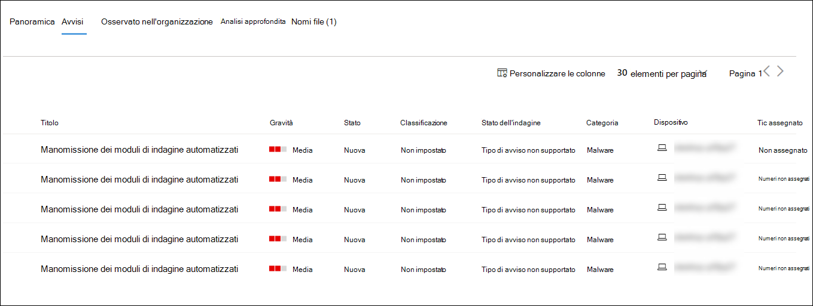
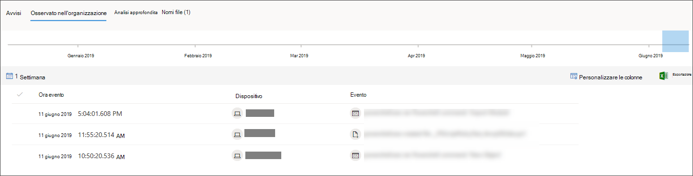
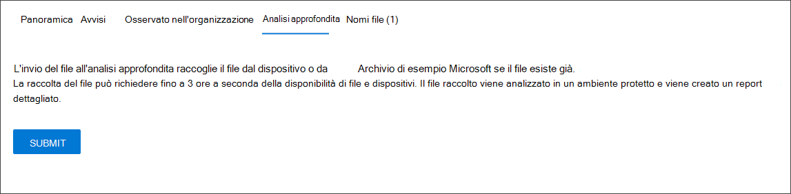

# Analizzare un file associato a un avviso di Microsoft Defender for Endpoint

[!INCLUDE [Microsoft 365 Defender rebranding](../../includes/microsoft-defender.md)]

**Si applica a:**
- [Microsoft Defender ATP](https://go.microsoft.com/fwlink/p/?linkid=2146631)
- [Microsoft 365 Defender](https://go.microsoft.com/fwlink/?linkid=2118804)

>Vuoi provare Defender per Endpoint? [Iscriversi per una versione di valutazione gratuita.](https://www.microsoft.com/microsoft-365/windows/microsoft-defender-atp?ocid=docs-wdatp-investigatefiles-abovefoldlink)

Analizzare i dettagli di un file associato a un avviso, un comportamento o un evento specifico per determinare se il file presenta attività dannose, identificare la motivazione dell'attacco e comprendere l'ambito potenziale della violazione.

Esistono molti modi per accedere alla pagina del profilo dettagliata di un file specifico. Ad esempio, puoi usare la funzionalità di ricerca, fare clic su un collegamento nell'albero del processo di **avviso,** nel grafico degli eventi **imprevisti,** nella sequenza temporale artefatto o selezionare un evento elencato nella sequenza temporale del **dispositivo.**

Una volta visualizzata la pagina dettagliata del profilo, è possibile passare dal layout di pagina nuovo a quello precedente tramite la creazione di **una nuova pagina file.** Il resto di questo articolo descrive il layout di pagina più recente.

È possibile ottenere informazioni dalle sezioni seguenti nella visualizzazione file:

- Dettagli file, rilevamento malware, diffusione dei file
- Analisi approfondita
- Avvisi
- Osservato nell'organizzazione
- Analisi approfondita
- Nomi di file

È inoltre possibile eseguire un'azione su un file da questa pagina.

## Azioni file

Nella parte superiore della pagina del profilo, sopra le schede di informazioni sui file. Le azioni che è possibile eseguire qui includono:

- Arrestare e mettere in quarantena
- Indicatore di aggiunta/modifica
- Scarica file
- Consultare un esperto di minacce
- Centro notifiche

Per ulteriori informazioni su queste azioni, vedere [Eseguire un'azione di risposta su un file.](respond-file-alerts.md)

## Dettagli file, rilevamento malware e diffusione di file

I dettagli del file, l'evento imprevisto, il rilevamento malware e le schede di prevalenza dei file visualizzano vari attributi relativi al file.

Vedrai dettagli come MD5 del file, il rapporto di rilevamento totale virus e il rilevamento di Microsoft Defender AV, se disponibile, e la diffusione del file.

La scheda di prevalenza dei file mostra dove il file è stato visualizzato nei dispositivi dell'organizzazione e in tutto il mondo. 

> [!NOTE] 
> Diversi utenti possono visualizzare valori diversi nella sezione *dispositivi nell'organizzazione* della scheda di diffusione dei file. Ciò è dovuto al fatto che nella scheda vengono visualizzate informazioni basate sull'ambito RBAC di un utente. Ciò significa che se a un utente è stata concessa visibilità su un set specifico di dispositivi, verrà visualizzata solo la diffusione dell'organizzazione dei file su tali dispositivi.

## Avvisi

Nella **scheda** Avvisi è disponibile un elenco di avvisi associati al file. Questo elenco copre gran parte delle stesse informazioni della coda avvisi, ad eccezione del gruppo di dispositivi, se presente, a cui appartiene il dispositivo interessato. È possibile scegliere il tipo di informazioni visualizzate selezionando **Personalizza colonne** dalla barra degli strumenti sopra le intestazioni di colonna.

## Osservato nell'organizzazione

La **scheda Osservati nell'organizzazione** consente di specificare un intervallo di date per vedere quali dispositivi sono stati osservati con il file.

>[!NOTE]
>Questa scheda mostrerà un numero massimo di 100 dispositivi. Per visualizzare _tutti_ i dispositivi con il file, esporta la scheda in un file CSV selezionando **Esporta** dal menu azione sopra le intestazioni di colonna della scheda.

Usa il dispositivo di scorrimento o il selettore dell'intervallo per specificare rapidamente un periodo di tempo che vuoi controllare per gli eventi che coinvolgono il file. È possibile specificare un intervallo di tempo piccolo come un singolo giorno. In questo modo sarà possibile visualizzare solo i file che comunicano con tale indirizzo IP in quel momento, riducendo drasticamente lo scorrimento e la ricerca non necessari.

## Analisi approfondita

La **scheda Analisi** approfondita consente di inviare il [file](respond-file-alerts.md#deep-analysis)per l'analisi approfondita, per scoprire ulteriori dettagli sul comportamento del file, nonché l'effetto che ha all'interno delle organizzazioni. Dopo aver inviato il file, il report di analisi approfondita verrà visualizzato in questa scheda una volta disponibili i risultati. Se l'analisi approfondita non ha trovato alcun elemento, il report sarà vuoto e lo spazio dei risultati rimarrà vuoto.

## Nomi di file

Nella **scheda Nomi** file sono elencati tutti i nomi che il file è stato osservato per l'utilizzo all'interno delle organizzazioni.

## Argomenti correlati

- [Visualizzare e organizzare la coda di Microsoft Defender for Endpoint](alerts-queue.md)
- [Gestire gli avvisi di Microsoft Defender for Endpoint](manage-alerts.md)
- [Analizzare gli avvisi di Microsoft Defender for Endpoint](investigate-alerts.md)
- [Analizzare i dispositivi nell'elenco Di Microsoft Defender per dispositivi endpoint](investigate-machines.md)
- [Analizzare un indirizzo IP associato a un avviso di Microsoft Defender for Endpoint](investigate-ip.md)
- [Analizzare un dominio associato a un avviso di Microsoft Defender for Endpoint](investigate-domain.md)
- [Analizzare un account utente in Microsoft Defender for Endpoint](investigate-user.md)
- [Eseguire azioni di risposta su un file](respond-file-alerts.md)
